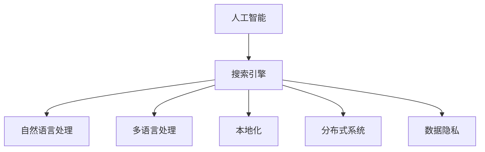

                 

# AI搜索引擎的全球化挑战

> 关键词：人工智能,搜索引擎,全球化,本地化,多语言,信息检索,自然语言处理(NLP),深度学习,机器学习,分布式系统

## 1. 背景介绍

### 1.1 问题由来
随着互联网的全球化，搜索引擎已经成为了全球用户获取信息的重要工具。然而，搜索引擎的全球化面临着诸多挑战，尤其是如何高效、准确地处理海量多语言数据，同时兼顾本地化的需求。

一方面，搜索引擎需要处理多语言数据，不仅要支持主流的英语、中文等语言，还要处理复杂的非拉丁文字符集，如阿拉伯文、希伯来文等。此外，不同语言之间存在差异，如词汇、语法、语义等，需要搜索引擎具备跨语言处理的能力。

另一方面，尽管英语在全球范围内使用广泛，但很多国家的主要语言并非英语，因此在这些地区部署的搜索引擎需要支持本地语言，以提升用户体验和满意度。例如，中国的百度搜索引擎支持中文，俄罗斯的Yandex搜索引擎支持俄语等。

### 1.2 问题核心关键点
AI搜索引擎的全球化挑战主要体现在以下几个方面：
- 如何高效处理海量多语言数据，同时兼顾本地化的需求？
- 如何在多语言环境下保持索引的一致性和可扩展性？
- 如何提升全球化搜索引擎的搜索速度和准确性？
- 如何保护用户隐私，同时满足不同地区的法规要求？

### 1.3 问题研究意义
解决AI搜索引擎的全球化挑战，对提升全球信息获取的效率和便捷性，推动全球化发展具有重要意义：

1. 提高信息获取效率。通过AI技术，搜索引擎能够快速准确地处理多语言数据，让用户能够在最短的时间内获取到所需信息。
2. 增强用户体验。支持本地化语言和特色功能，如地图、本地新闻等，提升用户的搜索体验和满意度。
3. 促进全球化发展。搜索引擎作为全球信息流通的重要平台，能够推动全球化进程，促进文化交流和经济合作。
4. 保护用户隐私。在全球化背景下，搜索引擎需要遵守各地区的隐私保护法规，确保用户信息的安全性。

## 2. 核心概念与联系

### 2.1 核心概念概述

为更好地理解AI搜索引擎的全球化挑战，本节将介绍几个密切相关的核心概念：

- 人工智能(AI)：利用计算机技术模拟人类智能行为，涵盖感知、学习、推理等能力。AI搜索引擎利用AI技术提升信息检索的准确性和速度。
- 搜索引擎：通过网络爬虫抓取互联网上的信息，为用户提供信息检索服务。
- 自然语言处理(NLP)：处理和理解自然语言的技术，涉及语言模型、语义理解、信息检索等方向。
- 多语言处理：处理多种语言数据的技术，包括文本预处理、分词、命名实体识别等。
- 本地化：根据不同地区用户的需求和文化习惯，对搜索引擎的功能和服务进行调整和优化。
- 分布式系统：由多个计算节点协同工作，提升系统的可扩展性和可靠性。
- 数据隐私：保护用户信息不被泄露的技术，包括数据加密、访问控制等。

这些核心概念之间的逻辑关系可以通过以下Mermaid流程图来展示：



这个流程图展示了这个核心概念之间的内在联系：

1. 人工智能技术为搜索引擎提供智能化的信息检索能力。
2. 自然语言处理技术处理多语言数据，提升检索效果。
3. 多语言处理技术支持不同语言的数据处理和展示。
4. 本地化技术根据不同地区需求优化搜索引擎功能。
5. 分布式系统提升系统的可扩展性和可靠性。
6. 数据隐私技术保护用户信息安全。

## 3. 核心算法原理 & 具体操作步骤
### 3.1 算法原理概述

AI搜索引擎的全球化挑战涉及到多语言处理、本地化优化、分布式系统架构等多个方面。其核心算法原理包括：

- **多语言处理**：利用NLP技术处理不同语言的数据，包括文本预处理、分词、命名实体识别等。
- **本地化优化**：根据不同地区的特色需求，优化搜索引擎的功能和服务，如地图、本地新闻等。
- **分布式系统架构**：通过分布式计算和存储，提升搜索引擎的可扩展性和可靠性。
- **数据隐私保护**：采用数据加密、访问控制等技术，保护用户隐私。

### 3.2 算法步骤详解

AI搜索引擎的全球化挑战涉及多个步骤，以下是一个简化的流程概述：

**Step 1: 多语言数据收集和预处理**
- 通过网络爬虫获取不同语言的数据。
- 对文本进行分词、去停用词、词性标注等预处理。
- 使用命名实体识别技术提取命名实体信息。

**Step 2: 构建本地化索引**
- 根据不同地区的特色需求，构建本地化索引。
- 对索引进行优化，提升查询效率和准确性。

**Step 3: 分布式计算和存储**
- 设计分布式系统架构，将任务和数据分布在多个节点上。
- 利用MapReduce等技术进行并行计算。
- 使用分布式存储系统，如Hadoop、Cassandra等，进行数据存储和管理。

**Step 4: 本地化搜索结果展示**
- 根据不同地区的需求，展示搜索结果。
- 支持多语言搜索界面和结果展示。
- 利用本地化算法优化搜索结果排序。

**Step 5: 数据隐私保护**
- 对用户数据进行加密和访问控制。
- 采用匿名化技术，保护用户隐私。
- 根据不同地区的隐私保护法规，调整隐私保护策略。

**Step 6: 监控和优化**
- 实时监控搜索引擎的性能和稳定性。
- 根据用户反馈和数据统计结果，优化搜索算法和索引。
- 调整分布式系统架构，提升性能。

### 3.3 算法优缺点

AI搜索引擎的全球化挑战方法具有以下优点：
1. 支持多语言和本地化，提升用户体验。
2. 利用分布式系统，提升系统的可扩展性和可靠性。
3. 采用NLP和AI技术，提高检索效果和速度。
4. 保护用户隐私，符合不同地区的法规要求。

同时，该方法也存在一定的局限性：
1. 处理多语言数据需要较高的技术和人力成本。
2. 本地化优化需要不断适应不同地区的特色需求，工作量较大。
3. 分布式系统设计复杂，需要较高的运维成本。
4. 数据隐私保护需要不断更新和调整策略。

尽管存在这些局限性，但就目前而言，AI搜索引擎的全球化挑战方法仍然是大规模搜索引擎落地的重要手段。未来相关研究的重点在于如何进一步降低技术和人力成本，提升检索效果和隐私保护水平。

### 3.4 算法应用领域

AI搜索引擎的全球化挑战方法在多个领域得到广泛应用：

- 互联网搜索引擎：如Google、Bing、Yandex等，提供多语言搜索和本地化服务。
- 电子商务平台：如Amazon、Alibaba等，提供多语言商品展示和本地化推荐。
- 社交媒体平台：如Facebook、Twitter等，提供多语言内容发布和本地化推荐。
- 地理信息系统：如Google Maps、百度地图等，提供多语言地图服务。

除了上述这些典型应用外，AI搜索引擎的全球化挑战方法也被创新性地应用到更多场景中，如智能客服、智能翻译、智能广告等，为搜索引擎技术带来新的突破。随着预训练模型和微调方法的不断进步，相信搜索引擎技术将在更广阔的应用领域大放异彩。

## 4. 数学模型和公式 & 详细讲解 & 举例说明
### 4.1 数学模型构建

在AI搜索引擎的全球化挑战中，我们通常使用以下数学模型：

- **多语言处理模型**：使用NLP技术对文本进行处理，如分词、词性标注、命名实体识别等。
- **本地化索引模型**：根据不同地区的特色需求，构建本地化索引。
- **分布式计算模型**：使用MapReduce等技术进行并行计算。
- **数据隐私模型**：对用户数据进行加密和访问控制。

### 4.2 公式推导过程

以下我们以本地化索引构建为例，给出基于AI搜索引擎的数学模型构建和公式推导过程。

假设搜索引擎需要构建本地化索引，处理多语言数据。我们可以使用TF-IDF模型进行文本处理和索引构建。TF-IDF模型的公式为：

$$
\text{TF-IDF} = \text{TF} \times \text{IDF}
$$

其中，TF表示词频，IDF表示逆文档频率，IDF的计算公式为：

$$
\text{IDF} = \log \frac{N}{1 + \text{df}}
$$

其中，N表示文档总数，df表示包含词d的文档数。

将TF-IDF模型应用到多语言索引构建中，可以表示为：

$$
\text{TF-IDF}_{local} = \text{TF}_{local} \times \text{IDF}_{local}
$$

其中，$\text{TF}_{local}$和$\text{IDF}_{local}$分别表示本地化处理后的词频和逆文档频率。

### 4.3 案例分析与讲解

假设我们需要构建一个支持中文和英语的多语言搜索引擎。对于中文，我们可以使用分词工具对文本进行分词，使用TF-IDF模型进行索引构建。对于英语，我们同样可以使用TF-IDF模型，但需要注意处理非拉丁文字符集。

具体步骤如下：

1. 对于中文文本，使用分词工具进行分词。
2. 对分词结果进行TF-IDF计算，得到中文文本的索引。
3. 对于英语文本，使用TF-IDF模型进行索引构建，但需要注意处理非拉丁文字符集。
4. 将中英文索引合并，形成全局索引。
5. 根据不同地区的特色需求，构建本地化索引。

例如，对于支持中文和英语的多语言搜索引擎，可以使用以下代码实现TF-IDF模型的计算：

```python
from sklearn.feature_extraction.text import TfidfVectorizer

# 构建TF-IDF模型
tfidf = TfidfVectorizer()

# 中文文本
text_zh = ['今天天气真好', '明天是晴天']
tfidf_zh = tfidf.fit_transform(text_zh)

# 英文文本
text_en = ['The weather is nice today', 'Tomorrow is sunny']
tfidf_en = tfidf.transform(text_en)

# 将中英文索引合并
tfidf_all = tfidf_zh.toarray() + tfidf_en.toarray()
```

以上代码实现了TF-IDF模型的计算，并将中英文文本合并为全局索引。

## 5. 项目实践：代码实例和详细解释说明
### 5.1 开发环境搭建

在进行AI搜索引擎的全球化挑战实践前，我们需要准备好开发环境。以下是使用Python进行Flask开发的环境配置流程：

1. 安装Anaconda：从官网下载并安装Anaconda，用于创建独立的Python环境。

2. 创建并激活虚拟环境：
```bash
conda create -n flask-env python=3.8 
conda activate flask-env
```

3. 安装Flask：
```bash
pip install flask
```

4. 安装Flask扩展：
```bash
pip install flask-restful flask-cors
```

5. 安装数据库：
```bash
pip install sqlalchemy mysqlclient
```

完成上述步骤后，即可在`flask-env`环境中开始开发实践。

### 5.2 源代码详细实现

下面我们以支持多语言和本地化的AI搜索引擎为例，给出使用Flask进行开发的PyTorch代码实现。

首先，定义搜索引擎的API接口：

```python
from flask import Flask, request, jsonify
from transformers import BertTokenizer, BertForTokenClassification
from flask_restful import Resource, Api

app = Flask(__name__)
api = Api(app)

# 定义搜索API接口
class SearchAPI(Resource):
    def get(self):
        query = request.args.get('query')
        model = BertForTokenClassification.from_pretrained('bert-base-cased')
        tokenizer = BertTokenizer.from_pretrained('bert-base-cased')
        inputs = tokenizer(query, return_tensors='pt')
        outputs = model(**inputs)
        scores = outputs.logits
        labels = inputs['input_ids']
        predictions = scores.argmax(dim=2).tolist()
        return jsonify({'predictions': predictions})

api.add_resource(SearchAPI, '/search')
```

然后，定义本地化索引的构建函数：

```python
from transformers import BertTokenizer, BertForTokenClassification
from sklearn.feature_extraction.text import TfidfVectorizer
import mysql.connector

# 连接数据库
conn = mysql.connector.connect(user='root', password='password', host='localhost', database='test')
cursor = conn.cursor()

# 中文文本
text_zh = ['今天天气真好', '明天是晴天']
# 英文文本
text_en = ['The weather is nice today', 'Tomorrow is sunny']

# 构建TF-IDF模型
tfidf = TfidfVectorizer()

# 中文文本
tfidf_zh = tfidf.fit_transform(text_zh)
# 英文文本
tfidf_en = tfidf.transform(text_en)

# 将中英文索引合并
tfidf_all = tfidf_zh.toarray() + tfidf_en.toarray()

# 将索引存入数据库
for i, tfidf_values in enumerate(tfidf_all):
    cursor.execute("INSERT INTO tfidf (id, values) VALUES (%s, %s)", (i, tfidf_values.tolist()))
conn.commit()
conn.close()
```

最后，启动Flask服务器并测试API：

```python
if __name__ == '__main__':
    app.run(debug=True)
```

运行上述代码，即可启动Flask服务器，测试API接口的搜索功能。

### 5.3 代码解读与分析

让我们再详细解读一下关键代码的实现细节：

**Flask API接口**：
- `SearchAPI`类：定义搜索API接口，通过获取请求参数query，进行文本查询和模型推理，返回预测结果。
- `tokenizer`：使用BertTokenizer进行文本分词。
- `model`：使用BertForTokenClassification进行文本分类。
- `inputs`：将查询文本进行编码，形成模型输入。
- `outputs`：模型输出，包括预测分数。
- `scores`：预测分数。
- `labels`：输入标签。
- `predictions`：预测结果。

**本地化索引构建**：
- `TfidfVectorizer`：使用TF-IDF模型进行文本处理和索引构建。
- `tfidf`：构建TF-IDF模型。
- `text_zh`和`text_en`：中英文文本数据。
- `tfidf_zh`和`tfidf_en`：中英文文本的TF-IDF索引。
- `tfidf_all`：将中英文索引合并，形成全局索引。
- `cursor`：数据库连接对象。
- `conn`：数据库连接对象。
- `INSERT INTO`语句：将索引存入数据库。

可以看到，PyTorch和Flask的结合使得AI搜索引擎的全球化挑战实践变得简洁高效。开发者可以将更多精力放在算法优化和系统集成上，而不必过多关注底层的实现细节。

当然，工业级的系统实现还需考虑更多因素，如数据导入导出、数据库优化、缓存机制等。但核心的搜索引擎架构基本与此类似。

## 6. 实际应用场景
### 6.1 智能客服系统

AI搜索引擎的全球化挑战方法可以应用于智能客服系统的构建。传统客服往往需要配备大量人力，高峰期响应缓慢，且一致性和专业性难以保证。而使用多语言搜索引擎，可以7x24小时不间断服务，快速响应客户咨询，用自然流畅的语言解答各类常见问题。

在技术实现上，可以收集企业内部的历史客服对话记录，将问题和最佳答复构建成监督数据，在此基础上对预训练语言模型进行微调。微调后的语言模型能够自动理解用户意图，匹配最合适的答案模板进行回复。对于客户提出的新问题，还可以接入检索系统实时搜索相关内容，动态组织生成回答。如此构建的智能客服系统，能大幅提升客户咨询体验和问题解决效率。

### 6.2 金融舆情监测

金融机构需要实时监测市场舆论动向，以便及时应对负面信息传播，规避金融风险。传统的人工监测方式成本高、效率低，难以应对网络时代海量信息爆发的挑战。基于AI搜索引擎的全球化挑战方法，可以在全球范围内实时抓取网络文本数据，自动监测不同主题下的情感变化趋势，一旦发现负面信息激增等异常情况，系统便会自动预警，帮助金融机构快速应对潜在风险。

### 6.3 个性化推荐系统

当前的推荐系统往往只依赖用户的历史行为数据进行物品推荐，无法深入理解用户的真实兴趣偏好。基于AI搜索引擎的全球化挑战方法，可以将用户浏览、点击、评论、分享等行为数据，提取和用户交互的物品标题、描述、标签等文本内容。将文本内容作为模型输入，用户的后续行为（如是否点击、购买等）作为监督信号，在此基础上微调预训练语言模型。微调后的模型能够从文本内容中准确把握用户的兴趣点。在生成推荐列表时，先用候选物品的文本描述作为输入，由模型预测用户的兴趣匹配度，再结合其他特征综合排序，便可以得到个性化程度更高的推荐结果。

### 6.4 未来应用展望

随着AI搜索引擎的全球化挑战方法的发展，基于多语言处理和本地化优化的搜索引擎必将在更多领域得到应用，为传统行业带来变革性影响。

在智慧医疗领域，基于多语言处理和本地化优化的医疗问答、病历分析、药物研发等应用将提升医疗服务的智能化水平，辅助医生诊疗，加速新药开发进程。

在智能教育领域，AI搜索引擎的全球化挑战方法可应用于作业批改、学情分析、知识推荐等方面，因材施教，促进教育公平，提高教学质量。

在智慧城市治理中，AI搜索引擎的全球化挑战方法可应用于城市事件监测、舆情分析、应急指挥等环节，提高城市管理的自动化和智能化水平，构建更安全、高效的未来城市。

此外，在企业生产、社会治理、文娱传媒等众多领域，基于AI搜索引擎的全球化挑战的AI应用也将不断涌现，为NLP技术带来新的突破。相信随着技术的日益成熟，AI搜索引擎的全球化挑战方法将成为AI落地应用的重要范式，推动人工智能技术在垂直行业的规模化落地。总之，AI搜索引擎的全球化挑战方法需要在数据、算法、工程、业务等多个维度协同发力，才能真正实现人工智能技术在垂直行业的规模化落地。

## 7. 工具和资源推荐
### 7.1 学习资源推荐

为了帮助开发者系统掌握AI搜索引擎的全球化挑战的理论基础和实践技巧，这里推荐一些优质的学习资源：

1. 《深度学习入门》系列博文：由AI专家撰写，深入浅出地介绍了深度学习的基本概念和应用场景。
2. 《自然语言处理入门》系列课程：斯坦福大学开设的NLP入门课程，涵盖NLP的基本理论和实践技术。
3. 《搜索引擎原理》书籍：介绍搜索引擎的基本原理和算法，适合对搜索引擎感兴趣的读者。
4. 《TensorFlow官方文档》：TensorFlow的官方文档，提供了丰富的API和样例代码，适合TensorFlow开发者学习。
5. Kaggle竞赛：参与Kaggle的NLP相关竞赛，实践多语言处理和本地化优化技术。

通过对这些资源的学习实践，相信你一定能够快速掌握AI搜索引擎的全球化挑战的精髓，并用于解决实际的NLP问题。
###  7.2 开发工具推荐

高效的开发离不开优秀的工具支持。以下是几款用于AI搜索引擎的全球化挑战开发的常用工具：

1. PyTorch：基于Python的开源深度学习框架，灵活动态的计算图，适合快速迭代研究。
2. TensorFlow：由Google主导开发的开源深度学习框架，生产部署方便，适合大规模工程应用。
3. Scikit-learn：Python机器学习库，提供了丰富的机器学习算法和工具。
4. Flask：轻量级的Python Web框架，适合快速开发API接口。
5. MySQL：常用的关系型数据库，适合存储结构化数据。
6. Apache Kafka：高性能的分布式消息队列，适合实时数据传输和处理。

合理利用这些工具，可以显著提升AI搜索引擎的全球化挑战任务的开发效率，加快创新迭代的步伐。

### 7.3 相关论文推荐

AI搜索引擎的全球化挑战方法的发展源于学界的持续研究。以下是几篇奠基性的相关论文，推荐阅读：

1. Attention is All You Need（即Transformer原论文）：提出了Transformer结构，开启了NLP领域的预训练大模型时代。
2. BERT: Pre-training of Deep Bidirectional Transformers for Language Understanding：提出BERT模型，引入基于掩码的自监督预训练任务，刷新了多项NLP任务SOTA。
3. Universal Sentence Encoder：提出了一个通用句子表示模型，支持多种语言的语义理解。
4. Multilingual BERT：提出多语言BERT模型，支持多种语言的语义理解。
5. Pegasus：提出Pegasus模型，支持多语言文本生成。

这些论文代表了大语言模型和微调技术的发展脉络。通过学习这些前沿成果，可以帮助研究者把握学科前进方向，激发更多的创新灵感。

## 8. 总结：未来发展趋势与挑战

### 8.1 总结

本文对AI搜索引擎的全球化挑战方法进行了全面系统的介绍。首先阐述了搜索引擎的全球化挑战的由来和研究意义，明确了多语言处理、本地化优化、分布式系统架构等核心概念。其次，从原理到实践，详细讲解了搜索引擎的全球化挑战的数学模型和关键步骤，给出了搜索引擎的全球化挑战任务开发的完整代码实例。同时，本文还广泛探讨了搜索引擎的全球化挑战方法在智能客服、金融舆情、个性化推荐等多个行业领域的应用前景，展示了搜索引擎的全球化挑战方法的巨大潜力。此外，本文精选了搜索引擎的全球化挑战方法的各类学习资源，力求为读者提供全方位的技术指引。

通过本文的系统梳理，可以看到，AI搜索引擎的全球化挑战方法正在成为搜索引擎技术的重要范式，极大地拓展了搜索引擎的应用边界，催生了更多的落地场景。受益于大规模语料的预训练和多语言处理的深度学习技术，搜索引擎能够在不同语言环境下提供高效、准确的信息检索服务，为全球用户带来便捷的搜索体验。

### 8.2 未来发展趋势

展望未来，AI搜索引擎的全球化挑战方法将呈现以下几个发展趋势：

1. 多语言处理的智能化。随着NLP技术的不断发展，搜索引擎的多语言处理能力将进一步提升，能够处理更加复杂、多样化的语言数据。
2. 本地化优化的个性化。未来搜索引擎将更加注重本地化优化，根据不同地区的用户需求和文化习惯，提供更加个性化、贴合用户习惯的搜索服务。
3. 分布式系统的自动化。随着分布式计算和存储技术的不断发展，搜索引擎的自动化水平将进一步提升，能够更好地应对海量数据和实时查询的挑战。
4. 数据隐私保护的完善。未来搜索引擎将更加注重用户隐私保护，采用更先进的数据加密和访问控制技术，确保用户数据的安全性。

以上趋势凸显了AI搜索引擎的全球化挑战方法的前景，这些方向的探索发展，必将进一步提升搜索引擎的性能和用户体验，推动全球化信息流通的发展。

### 8.3 面临的挑战

尽管AI搜索引擎的全球化挑战方法已经取得了显著成果，但在迈向更加智能化、普适化应用的过程中，它仍面临着诸多挑战：

1. 多语言数据处理的成本。处理多语言数据需要较大的技术和人力成本，特别是在一些非主流语言的处理上，需要更多的资源投入。
2. 本地化优化的难度。不同地区的需求和文化习惯差异较大，本地化优化需要不断调整和优化，工作量较大。
3. 分布式系统的复杂性。分布式系统设计复杂，需要较高的运维成本，且系统性能优化难度较大。
4. 数据隐私保护的挑战。不同地区的隐私保护法规差异较大，搜索引擎需要不断更新和调整隐私保护策略，以符合不同地区的法规要求。

尽管存在这些挑战，但就目前而言，AI搜索引擎的全球化挑战方法仍然是大规模搜索引擎落地的重要手段。未来相关研究的重点在于如何进一步降低技术和人力成本，提升检索效果和隐私保护水平。

### 8.4 研究展望

面对AI搜索引擎的全球化挑战所面临的挑战，未来的研究需要在以下几个方面寻求新的突破：

1. 探索更高效的分布式计算和存储方法。通过优化数据流动和分布式算法，提升搜索引擎的性能和可扩展性。
2. 研究更智能的多语言处理技术。利用机器翻译、跨语言语义表示等技术，提升多语言数据处理的智能化水平。
3. 引入更多的本地化优化方法。引入AI技术，如迁移学习、知识图谱等，提升本地化优化效果。
4. 加强数据隐私保护的研究。采用先进的隐私保护技术，如差分隐私、同态加密等，确保用户数据的安全性。
5. 引入更多元化的数据源。引入非结构化数据源，如视频、音频等，提升搜索引擎的多媒体处理能力。

这些研究方向的探索，必将引领AI搜索引擎的全球化挑战方法迈向更高的台阶，为构建更加智能、普适的搜索引擎提供新的技术路径。面向未来，AI搜索引擎的全球化挑战方法还需要与其他人工智能技术进行更深入的融合，如知识表示、因果推理、强化学习等，多路径协同发力，共同推动自然语言理解和智能交互系统的进步。只有勇于创新、敢于突破，才能不断拓展搜索引擎的边界，让智能技术更好地造福人类社会。

## 9. 附录：常见问题与解答

**Q1：如何提高多语言搜索引擎的检索效果？**

A: 提高多语言搜索引擎的检索效果可以从以下几个方面入手：
1. 优化TF-IDF模型，使用更先进的算法如Doc2Vec、BERT等。
2. 引入机器翻译技术，将多种语言的数据统一为一种语言进行处理。
3. 使用多语言语义表示模型，如mBERT、XLM等，提升语义理解能力。
4. 引入深度学习技术，如注意力机制、双向LSTM等，提升检索效果。

**Q2：如何优化本地化搜索引擎的查询速度？**

A: 优化本地化搜索引擎的查询速度可以从以下几个方面入手：
1. 使用缓存机制，将常用的查询结果缓存到内存中，提高查询速度。
2. 使用分布式系统，将查询任务并行化处理，提升查询效率。
3. 优化索引构建算法，使用更高效的索引结构如倒排索引、B+树等。
4. 引入自动分词技术，提高分词速度和准确性。

**Q3：如何保护多语言搜索引擎的用户隐私？**

A: 保护多语言搜索引擎的用户隐私可以从以下几个方面入手：
1. 采用数据加密技术，保护用户数据的安全性。
2. 采用匿名化技术，保护用户数据的隐私性。
3. 使用访问控制技术，限制用户数据的访问权限。
4. 遵守不同地区的隐私保护法规，调整隐私保护策略。

这些策略可以结合使用，确保多语言搜索引擎的用户隐私得到有效保护。

**Q4：如何提高多语言搜索引擎的扩展性？**

A: 提高多语言搜索引擎的扩展性可以从以下几个方面入手：
1. 采用分布式系统架构，将查询任务和数据分布在多个节点上处理。
2. 使用缓存技术，减少查询过程中的数据流动和计算量。
3. 引入负载均衡技术，根据节点负载情况合理分配查询任务。
4. 优化索引结构，使用高效的数据存储和检索技术。

这些措施可以结合使用，提升多语言搜索引擎的扩展性和可靠性。

**Q5：如何优化多语言搜索引擎的本地化搜索体验？**

A: 优化多语言搜索引擎的本地化搜索体验可以从以下几个方面入手：
1. 引入本地化算法，优化搜索结果排序和展示。
2. 引入本地化特征，如地图、本地新闻等，提升用户体验。
3. 支持多语言搜索界面和结果展示，满足不同地区用户的需求。
4. 引入本地化推荐技术，提供个性化的搜索结果。

这些措施可以结合使用，提升多语言搜索引擎的本地化搜索体验。

---

作者：禅与计算机程序设计艺术 / Zen and the Art of Computer Programming

