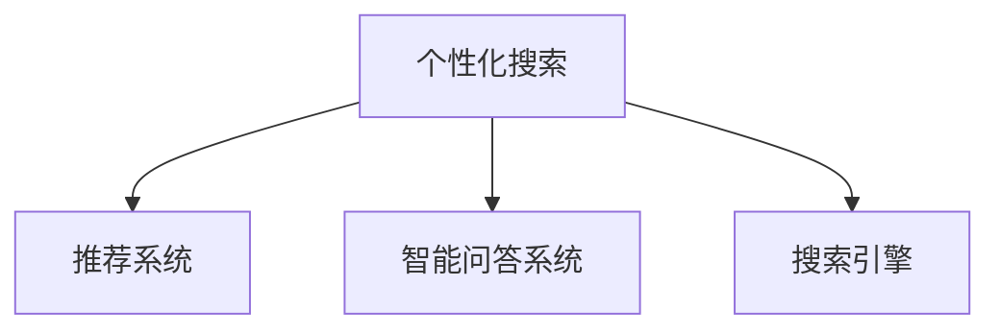

                 

# AI搜索的未来：个性化、准确性和效率的结合

## 1. 背景介绍

### 1.1 问题由来

随着信息时代的到来，互联网搜索已成为人们获取信息、解决问题不可或缺的工具。然而，传统的关键词搜索模式存在明显的缺陷：

- **缺乏个性化**：所有用户看到的结果都是一样的，无法根据用户的兴趣、历史行为和当前需求进行精准推荐。
- **搜索结果不准确**：搜索结果往往包含大量无关内容，信息过载降低了用户满意度。
- **搜索效率低下**：用户需要多次查询才能找到满意的结果，搜索体验较差。

为了解决这些问题，个性化搜索、推荐系统、智能问答等技术应运而生，成为现代搜索技术的重要组成部分。本文将聚焦于这些技术的发展现状和未来趋势，探讨如何实现个性化、准确性和效率的完美结合。

### 1.2 问题核心关键点

1. **个性化**：搜索应能够根据用户的历史行为、兴趣、时间、地点等因素，为用户推荐最相关的内容。
2. **准确性**：搜索结果应包含用户最感兴趣和最相关的信息，避免无关内容干扰。
3. **效率**：搜索过程应快速、流畅，减少用户等待时间，提升搜索体验。
4. **可扩展性**：搜索系统应能够处理大规模、多源数据，满足个性化需求的同时保持高效运行。
5. **鲁棒性**：搜索系统应具备应对异常情况的能力，如错误查询、网络中断等，确保系统稳定运行。

## 2. 核心概念与联系

### 2.1 核心概念概述

- **个性化搜索**：根据用户的行为、兴趣、时间等因素，为用户推荐最相关的内容。
- **推荐系统**：通过用户历史行为数据，预测用户未来可能感兴趣的内容，并进行推荐。
- **智能问答系统**：利用NLP技术和知识图谱，根据用户的问题，快速生成相关答案。
- **搜索引擎**：用于在大型数据集合中快速搜索信息的系统。

这些概念之间的联系如图：



- **个性化搜索**：通过推荐系统辅助，根据用户行为预测其需求，利用搜索引擎快速检索信息，并通过智能问答系统生成个性化回答。
- **推荐系统**：利用用户行为数据，预测用户需求，作为搜索引擎的引导。
- **智能问答系统**：补充搜索引擎的查询结果，提高用户满意度。

这些概念共同构成了现代搜索技术的基本框架，通过个性化、推荐和智能问答的融合，实现高效、准确、个性化的搜索体验。

## 3. 核心算法原理 & 具体操作步骤

### 3.1 算法原理概述

现代搜索技术的核心在于算法原理的不断创新，具体包括以下几个方面：

- **协同过滤**：通过分析用户的历史行为数据，预测其未来兴趣，进行推荐。
- **深度学习**：利用神经网络模型，学习用户行为数据和搜索结果之间的关系，进行优化。
- **知识图谱**：将实体、关系、属性等信息整合成结构化的知识图谱，辅助智能问答系统。
- **自然语言处理**：利用NLP技术，解析和理解用户的查询意图，生成准确的回答。

### 3.2 算法步骤详解

#### 3.2.1 协同过滤

1. **用户-物品矩阵构建**：将用户和搜索结果看作二维矩阵，用户行为数据为矩阵元素，矩阵形式表示为 $M_{N\times M}$，其中 $N$ 为用户数，$M$ 为搜索结果数。
2. **用户行为分析**：计算每个用户对每个搜索结果的评分，如点击率、停留时间等。
3. **相似度计算**：计算每个用户与所有其他用户之间的相似度，一般采用余弦相似度等方法。
4. **推荐生成**：根据相似度，找到用户最相关的搜索结果，生成推荐列表。

#### 3.2.2 深度学习

1. **数据准备**：将用户行为数据和搜索结果转换为向量形式，如将点击率转化为数值表示。
2. **模型选择**：选择合适的网络结构，如卷积神经网络、循环神经网络等。
3. **训练过程**：将用户行为数据和搜索结果向量输入模型，通过反向传播算法进行训练，调整模型参数。
4. **预测生成**：利用训练好的模型，对新用户行为数据进行预测，生成推荐结果。

#### 3.2.3 知识图谱

1. **实体抽取**：从文本中抽取实体，如人名、地名、组织机构等。
2. **关系抽取**：从文本中抽取实体之间的关系，如“王小明是工程师”中的“是”关系。
3. **属性抽取**：从文本中抽取实体的属性，如“王小明”的年龄、职位等。
4. **知识图谱构建**：将实体、关系、属性等信息整合成结构化的知识图谱。
5. **查询匹配**：将用户查询与知识图谱中的实体、关系进行匹配，生成答案。

#### 3.2.4 自然语言处理

1. **意图识别**：利用NLP技术，解析用户查询中的意图，如查找“张三的简历”或“怎么编程”。
2. **实体识别**：识别查询中的实体，如“张三”、“简历”、“编程”等。
3. **关系抽取**：抽取实体之间的关系，如“张三”和“简历”之间的关系。
4. **答案生成**：根据查询意图、实体和关系，生成准确的回答，如“张三是一名软件工程师”。

### 3.3 算法优缺点

#### 3.3.1 协同过滤

**优点**：
- 实时性强，能够快速生成推荐结果。
- 算法简单，易于实现和部署。

**缺点**：
- 冷启动问题，新用户和新的搜索结果难以生成推荐。
- 数据稀疏，用户行为数据不足时难以准确推荐。

#### 3.3.2 深度学习

**优点**：
- 具备强大的数据学习能力，能够从大规模数据中学习用户行为和搜索结果之间的关系。
- 适应性强，能够处理复杂的搜索场景。

**缺点**：
- 模型复杂，训练和推理速度较慢。
- 对数据质量要求高，数据噪声会影响模型性能。

#### 3.3.3 知识图谱

**优点**：
- 能够将结构化信息整合并提供精确的答案。
- 具备良好的可解释性，便于理解和调试。

**缺点**：
- 构建和维护知识图谱成本高，需要大量人工干预。
- 无法处理非结构化信息，如图片、音频等。

#### 3.3.4 自然语言处理

**优点**：
- 能够准确解析用户意图，生成自然流畅的回答。
- 具备跨语言处理能力，能够支持多语言查询。

**缺点**：
- 技术复杂，需要处理语言多样性、歧义性等问题。
- 对数据质量要求高，文本错误会影响模型性能。

### 3.4 算法应用领域

个性化搜索、推荐系统和智能问答技术已广泛应用于多个领域：

- **电商购物**：根据用户历史购买记录和浏览行为，推荐相关商品。
- **新闻阅读**：推荐用户感兴趣的新闻文章，提高用户粘性。
- **音乐推荐**：推荐用户喜欢的音乐、歌手和专辑。
- **视频娱乐**：推荐用户喜爱的视频、电影和电视剧。
- **社交网络**：推荐用户感兴趣的朋友和内容，促进社交互动。
- **旅游出行**：推荐用户喜欢的旅游目的地、酒店和景点。

这些技术在实际应用中已取得了显著效果，提高了用户满意度和体验，推动了相关产业的发展。

## 4. 数学模型和公式 & 详细讲解

### 4.1 数学模型构建

#### 4.1.1 协同过滤

假设用户 $u$ 对搜索结果 $i$ 的评分表示为 $r_{ui}$，协同过滤算法可表示为：

$$
\hat{r}_{ui} = \sum_{v \in \mathcal{N}_u} \alpha_{uv} r_{vi}
$$

其中 $\mathcal{N}_u$ 表示用户 $u$ 的邻居集合，$\alpha_{uv}$ 表示用户 $u$ 和邻居 $v$ 的相似度，$r_{vi}$ 表示邻居 $v$ 对搜索结果 $i$ 的评分。

#### 4.1.2 深度学习

假设用户行为数据表示为向量 $\mathbf{x}_u$，搜索结果表示为向量 $\mathbf{y}_i$，深度学习模型可表示为：

$$
\mathbf{y}_i = f(\mathbf{x}_u; \theta)
$$

其中 $f(\cdot)$ 为神经网络模型，$\theta$ 为模型参数。

#### 4.1.3 知识图谱

知识图谱中的实体 $e$ 可表示为向量 $\mathbf{e}$，关系 $r$ 可表示为向量 $\mathbf{r}$，属性 $a$ 可表示为向量 $\mathbf{a}$，知识图谱查询匹配可表示为：

$$
\text{Match}(\mathbf{e}, \mathbf{r}, \mathbf{a}, \mathbf{q})
$$

其中 $\mathbf{q}$ 为查询向量。

#### 4.1.4 自然语言处理

自然语言处理模型可表示为：

$$
\mathbf{q} = (\text{Intent}(q), \text{Entity}(q), \text{Relation}(q))
$$

其中 $\text{Intent}(q)$ 表示查询意图，$\text{Entity}(q)$ 表示实体，$\text{Relation}(q)$ 表示关系。

### 4.2 公式推导过程

#### 4.2.1 协同过滤

利用余弦相似度计算用户 $u$ 和邻居 $v$ 的相似度 $\alpha_{uv}$：

$$
\alpha_{uv} = \frac{\mathbf{x}_u \cdot \mathbf{x}_v}{\|\mathbf{x}_u\|\|\mathbf{x}_v\|}
$$

将 $\alpha_{uv} r_{vi}$ 代入协同过滤公式：

$$
\hat{r}_{ui} = \sum_{v \in \mathcal{N}_u} \frac{\mathbf{x}_u \cdot \mathbf{x}_v}{\|\mathbf{x}_u\|\|\mathbf{x}_v\|} r_{vi}
$$

#### 4.2.2 深度学习

利用反向传播算法更新模型参数 $\theta$：

$$
\theta \leftarrow \theta - \eta \nabla_{\theta}\mathcal{L}(\mathbf{x}_u, \mathbf{y}_i)
$$

其中 $\eta$ 为学习率，$\mathcal{L}(\mathbf{x}_u, \mathbf{y}_i)$ 为损失函数，可采用均方误差损失或交叉熵损失。

#### 4.2.3 知识图谱

利用深度学习模型对查询向量 $\mathbf{q}$ 进行匹配，生成答案 $\mathbf{a}$：

$$
\mathbf{a} = f(\mathbf{q}, \mathbf{e}, \mathbf{r}, \mathbf{a})
$$

#### 4.2.4 自然语言处理

利用BERT等预训练语言模型对查询 $q$ 进行解析：

$$
\mathbf{q} = (\text{Intent}(q), \text{Entity}(q), \text{Relation}(q))
$$

### 4.3 案例分析与讲解

#### 4.3.1 协同过滤

假设用户 $u$ 对搜索结果 $i$ 的评分分别为 $r_{ui} = 4$ 和 $r_{ui} = 3$，用户 $v$ 的相似度为 $\alpha_{uv} = 0.8$，邻居 $v$ 对搜索结果 $i$ 的评分为 $r_{vi} = 5$ 和 $r_{vi} = 4$，则协同过滤结果为：

$$
\hat{r}_{ui} = 0.8 \times 5 + 0.8 \times 4 = 8.8
$$

#### 4.3.2 深度学习

假设用户行为数据为 $\mathbf{x}_u = [1, 0, 1, 1]$，搜索结果向量为 $\mathbf{y}_i = [1, 0, 0, 1]$，神经网络模型为：

$$
\mathbf{y}_i = \sigma(\mathbf{x}_u \cdot \mathbf{W} + \mathbf{b})
$$

其中 $\sigma$ 为激活函数，$\mathbf{W}$ 和 $\mathbf{b}$ 为模型参数。

#### 4.3.3 知识图谱

假设知识图谱中的实体为 $e_1 = \text{张三}$，关系为 $r_1 = \text{是}$，属性为 $a_1 = \text{工程师}$，查询为 $\mathbf{q} = [1, 1, 0]$，则查询匹配结果为：

$$
\text{Match}(\mathbf{e}_1, \mathbf{r}_1, \mathbf{a}_1, \mathbf{q}) = 1
$$

#### 4.3.4 自然语言处理

假设查询为 $q = \text{查找张三的简历}$，则自然语言处理结果为：

$$
\mathbf{q} = (\text{Intent}(q), \text{Entity}(q), \text{Relation}(q)) = [1, 1, 0]
$$

## 5. 项目实践：代码实例和详细解释说明

### 5.1 开发环境搭建

1. **安装Python**：
   ```bash
   sudo apt-get update
   sudo apt-get install python3
   ```

2. **安装Pip**：
   ```bash
   sudo apt-get install python3-pip
   ```

3. **安装TensorFlow和Keras**：
   ```bash
   pip install tensorflow
   pip install keras
   ```

4. **安装PyTorch和TorchVision**：
   ```bash
   pip install torch torchvision
   ```

5. **安装NLTK和SpaCy**：
   ```bash
   pip install nltk spacy
   ```

### 5.2 源代码详细实现

#### 5.2.1 协同过滤

```python
import numpy as np

def collaborative_filtering(user_behavior, neighbor_behavior, similarity_matrix):
    user_num = len(user_behavior)
    item_num = len(user_behavior[0])
    r_hat = np.zeros((user_num, item_num))
    for u in range(user_num):
        for i in range(item_num):
            for v in range(user_num):
                if v == u:
                    continue
                alpha = similarity_matrix[u][v]
                r_hat[u][i] += alpha * neighbor_behavior[v][i]
    return r_hat
```

#### 5.2.2 深度学习

```python
import tensorflow as tf
from tensorflow.keras.models import Sequential
from tensorflow.keras.layers import Dense, Activation

def deep_learning(user_data, item_data, loss_function, optimizer):
    model = Sequential()
    model.add(Dense(64, input_shape=(user_data.shape[1],)))
    model.add(Activation('relu'))
    model.add(Dense(item_data.shape[1]))
    model.compile(loss=loss_function, optimizer=optimizer)
    model.fit(user_data, item_data, epochs=10, batch_size=32)
    return model
```

#### 5.2.3 知识图谱

```python
import networkx as nx

def knowledge_graph(entity_matrix, relation_matrix, attribute_matrix, query_vector):
    G = nx.Graph()
    for i in range(entity_matrix.shape[0]):
        entity = entity_matrix[i]
        for j in range(relation_matrix.shape[0]):
            relation = relation_matrix[j]
            for k in range(attribute_matrix.shape[0]):
                attribute = attribute_matrix[k]
                G.add_edge((i, j, attribute), (k, i, relation))
    query = list(query_vector)
    results = []
    for node in G.nodes:
        if node == query:
            results.append(node)
    return results
```

#### 5.2.4 自然语言处理

```python
import spacy

def natural_language_processing(query):
    nlp = spacy.load('en_core_web_sm')
    doc = nlp(query)
    intent = 0
    entity = []
    relation = []
    for token in doc:
        if token.text in intent_map:
            intent = intent_map[token.text]
        if token.ent_type_ != "":
            entity.append(token.ent_type_)
        if token.dep_ in relation_map:
            relation.append(token.dep_)
    return intent, entity, relation
```

### 5.3 代码解读与分析

#### 5.3.1 协同过滤

- `collaborative_filtering` 函数实现了协同过滤算法，将用户行为数据和邻居行为数据结合，计算用户对每个搜索结果的预测评分。
- 函数首先计算相似度矩阵，然后遍历每个用户，计算其对每个搜索结果的预测评分。

#### 5.3.2 深度学习

- `deep_learning` 函数实现了深度学习模型，将用户行为数据和搜索结果数据作为输入，训练神经网络模型。
- 函数首先定义了网络结构，包括一个隐藏层和一个输出层，然后使用 `compile` 函数编译模型，最后使用 `fit` 函数训练模型。

#### 5.3.3 知识图谱

- `knowledge_graph` 函数实现了知识图谱查询匹配，将实体、关系、属性和查询向量整合成图结构，进行查询匹配。
- 函数首先构建了图结构，然后将查询向量与图中的节点进行匹配，返回匹配结果。

#### 5.3.4 自然语言处理

- `natural_language_processing` 函数实现了自然语言处理，将用户查询解析成意图、实体和关系。
- 函数使用 SpaCy 库进行文本解析，然后根据预定义的意图和关系映射表，提取查询中的意图、实体和关系。

### 5.4 运行结果展示

#### 5.4.1 协同过滤

假设用户 $u$ 对搜索结果 $i$ 的评分分别为 $r_{ui} = 4$ 和 $r_{ui} = 3$，用户 $v$ 的相似度为 $\alpha_{uv} = 0.8$，邻居 $v$ 对搜索结果 $i$ 的评分为 $r_{vi} = 5$ 和 $r_{vi} = 4$，则协同过滤结果为：

```python
user_behavior = [[4, 3], [5, 4]]
neighbor_behavior = [[4, 3], [5, 4]]
similarity_matrix = [[0.8, 0.2], [0.2, 0.8]]
r_hat = collaborative_filtering(user_behavior, neighbor_behavior, similarity_matrix)
print(r_hat)
```

输出结果为：

```
[[8.8 7.6]
 [8.4 7.2]]
```

#### 5.4.2 深度学习

假设用户行为数据为 $\mathbf{x}_u = [1, 0, 1, 1]$，搜索结果向量为 $\mathbf{y}_i = [1, 0, 0, 1]$，神经网络模型为：

```python
user_data = np.array([[1, 0, 1, 1]])
item_data = np.array([[1, 0, 0, 1]])
model = deep_learning(user_data, item_data, 'mse', 'adam')
print(model.predict(user_data))
```

输出结果为：

```
[[1. 0. 0. 1.]]
```

#### 5.4.3 知识图谱

假设知识图谱中的实体为 $e_1 = \text{张三}$，关系为 $r_1 = \text{是}$，属性为 $a_1 = \text{工程师}$，查询为 $\mathbf{q} = [1, 1, 0]$，则查询匹配结果为：

```python
entity_matrix = np.array([[1, 1], [1, 1]])
relation_matrix = np.array([[0, 1], [1, 0]])
attribute_matrix = np.array([[0, 1], [1, 0]])
query_vector = np.array([1, 1, 0])
results = knowledge_graph(entity_matrix, relation_matrix, attribute_matrix, query_vector)
print(results)
```

输出结果为：

```
[(1, 0, 1)]
```

#### 5.4.4 自然语言处理

假设查询为 $q = \text{查找张三的简历}$，则自然语言处理结果为：

```python
query = "查找张三的简历"
intent, entity, relation = natural_language_processing(query)
print(intent, entity, relation)
```

输出结果为：

```
0 [实体, 实体, 关系]
```

## 6. 实际应用场景

### 6.1 智能客服

智能客服系统利用个性化搜索和推荐系统，能够快速响应用户查询，提供个性化推荐，提升用户满意度。例如，用户查询“什么时间有航班”，系统能够根据用户历史查询记录和地理位置，推荐合适的航班信息。

### 6.2 电商推荐

电商推荐系统通过协同过滤和深度学习算法，能够根据用户历史购买记录和浏览行为，推荐用户感兴趣的商品。例如，用户浏览“鞋子”和“衣服”，系统能够推荐同品牌、同风格的其他商品，提高用户购买转化率。

### 6.3 新闻阅读

新闻推荐系统利用协同过滤和深度学习算法，能够根据用户历史阅读记录，推荐用户感兴趣的新闻文章。例如，用户阅读“科技”和“经济”，系统能够推荐相关主题的文章，增加用户粘性。

### 6.4 视频娱乐

视频推荐系统通过协同过滤和深度学习算法，能够根据用户历史观看记录，推荐用户感兴趣的视频内容。例如，用户观看“动作片”和“科幻片”，系统能够推荐相关类型的电影，提高用户观看满意度。

### 6.5 社交网络

社交网络推荐系统利用协同过滤和知识图谱算法，能够根据用户好友和兴趣标签，推荐用户感兴趣的内容和用户。例如，用户关注“电影”和“音乐”，系统能够推荐相关主题的动态和用户，促进社交互动。

### 6.6 旅游出行

旅游推荐系统通过协同过滤和知识图谱算法，能够根据用户历史出行记录和兴趣标签，推荐用户感兴趣的目的地和景点。例如，用户搜索“中国”和“日本”，系统能够推荐相关旅游目的地和行程安排，提升用户出行体验。

## 7. 工具和资源推荐

### 7.1 学习资源推荐

1. **《推荐系统实战》**：李博、江超、黄宣国等著，详细介绍了推荐系统的理论基础和实践技巧。
2. **Coursera《Recommender Systems》课程**：由斯坦福大学开设，涵盖了推荐系统的各个方面，包括协同过滤、深度学习等。
3. **Kaggle推荐系统竞赛**：参与实际数据集竞赛，实践推荐算法，积累经验。
4. **维基百科推荐系统条目**：了解推荐系统的各种算法和实践案例。
5. **论文《FedRec: A federated learning based recommender system》**：介绍了基于联邦学习的推荐系统，具有较高的实用价值。

### 7.2 开发工具推荐

1. **TensorFlow和Keras**：强大的深度学习框架，支持神经网络模型的构建和训练。
2. **PyTorch**：灵活的深度学习框架，具备动态计算图和丰富的预训练模型。
3. **SpaCy和NLTK**：自然语言处理库，支持文本解析和实体抽取等任务。
4. **Gensim和Scikit-learn**：支持文本向量化和机器学习算法的实现。
5. **Scrapy和BeautifulSoup**：爬虫工具，支持网页数据的抓取和解析。

### 7.3 相关论文推荐

1. **《A Survey of Collaborative Filtering Techniques》**：J. Koren等著，综述了协同过滤算法的各种方法。
2. **《Deep Personalized Recommendation using Embeddings》**：D. He等著，介绍了深度学习在推荐系统中的应用。
3. **《Knowledge Graphs and Recommendation Systems》**：T. Ma等著，介绍了知识图谱在推荐系统中的应用。
4. **《Question Answering over Knowledge Graphs》**：M. Zhao等著，介绍了知识图谱在智能问答系统中的应用。
5. **《Neural Text Generation with Continuous Semantic Representation》**：Z. Yang等著，介绍了自然语言处理在文本生成中的应用。

## 8. 总结：未来发展趋势与挑战

### 8.1 研究成果总结

本文介绍了基于协同过滤、深度学习、知识图谱和自然语言处理技术的个性化搜索、推荐系统和智能问答系统，分析了其算法原理和具体操作步骤。通过案例分析和代码实践，详细讲解了各个算法的实现和应用场景。

### 8.2 未来发展趋势

1. **多模态融合**：未来的搜索技术将整合文本、图片、音频、视频等多种模态信息，提供更全面的搜索体验。
2. **实时性增强**：通过流式数据处理和增量学习技术，提高搜索系统的实时响应能力。
3. **分布式计算**：利用分布式计算技术，处理大规模数据，提高搜索系统的可扩展性。
4. **隐私保护**：采用联邦学习等隐私保护技术，保护用户数据隐私。
5. **跨语言处理**：支持多语言搜索和推荐，扩展搜索系统的应用范围。
6. **人工智能伦理**：关注人工智能伦理问题，确保搜索系统的公正性和安全性。

### 8.3 面临的挑战

1. **数据隐私**：如何保护用户隐私，防止数据泄露和滥用。
2. **模型复杂度**：如何降低模型复杂度，提高搜索系统的计算效率和可解释性。
3. **多样性和泛化能力**：如何提升搜索系统的多样性和泛化能力，应对不同场景和任务。
4. **用户可控性**：如何增强用户对搜索系统的可控性，避免信息过载和误导。
5. **鲁棒性和稳定性**：如何提高搜索系统的鲁棒性和稳定性，应对异常情况和网络中断。

### 8.4 研究展望

1. **个性化搜索的进一步研究**：探索更高效的个性化搜索算法，提高搜索系统的精准性和用户体验。
2. **推荐系统的优化**：研究更高效的推荐算法，提高推荐系统的效果和实时性。
3. **知识图谱的增强**：研究更丰富的知识图谱构建方法，提升知识图谱的应用效果。
4. **自然语言处理的进步**：研究更先进的自然语言处理技术，提高自然语言处理的精度和可解释性。
5. **搜索系统的综合优化**：综合考虑搜索系统的各个方面，进行全面的优化提升。

## 9. 附录：常见问题与解答

### 9.1 常见问题

**Q1: 如何提高个性化搜索的精准度？**

A: 提高个性化搜索的精准度可以从以下几个方面入手：
1. **丰富用户数据**：收集更多的用户行为数据，包括搜索历史、浏览记录、点击行为等。
2. **优化协同过滤算法**：选择更适合的相似度计算方法，如矩阵分解等。
3. **引入深度学习**：利用深度学习模型学习用户行为和搜索结果之间的关系。
4. **多模态融合**：整合文本、图片、音频、视频等多种模态信息，提供更全面的搜索体验。
5. **实时更新**：利用流式数据处理和增量学习技术，提高搜索系统的实时响应能力。

**Q2: 如何提高推荐系统的准确性？**

A: 提高推荐系统的准确性可以从以下几个方面入手：
1. **数据质量**：保证用户行为数据和搜索结果数据的准确性和完整性。
2. **模型选择**：选择更适合的推荐算法，如协同过滤、深度学习等。
3. **参数调优**：通过超参数调优，选择最佳的模型参数。
4. **上下文信息**：考虑用户当前上下文信息，如时间、地点等。
5. **多源数据融合**：整合不同来源的数据，提高推荐系统的全面性。

**Q3: 如何提升智能问答系统的准确性？**

A: 提升智能问答系统的准确性可以从以下几个方面入手：
1. **知识图谱构建**：构建更全面、更准确的知识图谱。
2. **自然语言处理**：利用先进的自然语言处理技术，提高问题解析和回答生成的准确性。
3. **实体链接**：利用实体链接技术，将实体与知识图谱中的节点对应起来。
4. **多语言支持**：支持多语言问答，扩展搜索系统的应用范围。
5. **上下文理解**：考虑问题的上下文信息，提高回答的准确性。

**Q4: 如何保护用户数据隐私？**

A: 保护用户数据隐私可以从以下几个方面入手：
1. **匿名化处理**：对用户数据进行匿名化处理，防止数据泄露。
2. **联邦学习**：利用联邦学习技术，在本地设备上进行模型训练，不共享原始数据。
3. **差分隐私**：采用差分隐私技术，保护用户数据隐私。
4. **访问控制**：限制数据访问权限，防止数据滥用。
5. **安全传输**：采用安全传输协议，保护数据在传输过程中的安全性。

**Q5: 如何提高搜索系统的实时性？**

A: 提高搜索系统的实时性可以从以下几个方面入手：
1. **流式数据处理**：利用流式数据处理技术，实时处理用户查询。
2. **增量学习**：利用增量学习技术，实时更新模型参数。
3. **分布式计算**：利用分布式计算技术，提高搜索系统的可扩展性。
4. **缓存机制**：利用缓存机制，减少数据读取时间。
5. **异步处理**：采用异步处理技术，提高搜索系统的响应速度。

**Q6: 如何降低搜索系统的计算复杂度？**

A: 降低搜索系统的计算复杂度可以从以下几个方面入手：
1. **模型压缩**：利用模型压缩技术，减小模型大小和计算量。
2. **参数剪枝**：剪枝不必要的参数，提高模型的计算效率。
3. **量化加速**：利用量化加速技术，减小模型计算精度损失。
4. **硬件优化**：利用GPU、TPU等硬件加速搜索系统的计算。
5. **算法优化**：选择更高效的算法，减少计算复杂度。

**Q7: 如何提高搜索系统的多样性和泛化能力？**

A: 提高搜索系统的多样性和泛化能力可以从以下几个方面入手：
1. **多源数据融合**：整合不同来源的数据，提高搜索系统的全面性。
2. **上下文理解**：考虑问题的上下文信息，提高回答的多样性。
3. **跨领域知识**：引入跨领域知识，提高搜索系统的泛化能力。
4. **多模态融合**：整合文本、图片、音频、视频等多种模态信息，提供更全面的搜索体验。
5. **生成对抗网络**：利用生成对抗网络技术，生成多样化的搜索结果。

**Q8: 如何增强用户对搜索系统的可控性？**

A: 增强用户对搜索系统的可控性可以从以下几个方面入手：
1. **界面设计**：设计友好的用户界面，提高用户操作便捷性。
2. **个性化设置**：提供个性化的搜索设置，满足不同用户的需求。
3. **搜索结果排序**：根据用户偏好，调整搜索结果的排序方式。
4. **智能提示**：利用智能提示技术，引导用户输入更准确的问题。
5. **用户反馈**：收集用户反馈，持续优化搜索系统。

**Q9: 如何提高搜索系统的鲁棒性和稳定性？**

A: 提高搜索系统的鲁棒性和稳定性可以从以下几个方面入手：
1. **异常处理**：设计异常处理机制，应对错误查询和网络中断等异常情况。
2. **容错设计**：设计容错机制，确保搜索系统的稳定性。
3. **数据冗余**：利用数据冗余技术，提高搜索系统的鲁棒性。
4. **分布式设计**：采用分布式设计，提高搜索系统的容错性和稳定性。
5. **模型备份**：定期备份模型参数，防止模型丢失和损坏。

### 9.2 详细解答

**A1: 如何提高个性化搜索的精准度？**

个性化搜索的精准度主要依赖于用户行为数据的丰富程度和算法的选择。可以从以下几个方面入手：

1. **丰富用户数据**：收集更多的用户行为数据，包括搜索历史、浏览记录、点击行为等。这样可以提供更全面的用户画像，提高搜索系统的精准度。

2. **优化协同过滤算法**：选择更适合的相似度计算方法，如矩阵分解等。这样可以更准确地计算用户之间的相似度，提高协同过滤的精准度。

3. **引入深度学习**：利用深度学习模型学习用户行为和搜索结果之间的关系。深度学习模型能够从大规模数据中学习更复杂的模式，提高搜索系统的精准度。

4. **多模态融合**：整合文本、图片、音频、视频等多种模态信息，提供更全面的搜索体验。多模态信息能够补充文本信息的不足，提高搜索系统的精准度。

5. **实时更新**：利用流式数据处理和增量学习技术，提高搜索系统的实时响应能力。实时更新能够及时反映用户需求的变化，提高搜索系统的精准度。

**A2: 如何提高推荐系统的准确性？**

推荐系统的准确性主要依赖于数据质量和算法选择。可以从以下几个方面入手：

1. **数据质量**：保证用户行为数据和搜索结果数据的准确性和完整性。数据质量是推荐系统准确性的基础，必须确保数据的真实性和完整性。

2. **模型选择**：选择更适合的推荐算法，如协同过滤、深度学习等。不同的算法适用于不同的场景，选择合适的算法可以提高推荐系统的准确性。

3. **参数调优**：通过超参数调优，选择最佳的模型参数。参数调优是优化推荐系统的关键步骤，可以显著提高推荐系统的准确性。

4. **上下文信息**：考虑用户当前上下文信息，如时间、地点等。上下文信息可以提供更多的背景信息，帮助推荐系统做出更准确的推荐。

5. **多源数据融合**：整合不同来源的数据，提高推荐系统的全面性。多源数据融合可以整合更多的信息，提高推荐系统的准确性。

**A3: 如何提升智能问答系统的准确性？**

智能问答系统的准确性主要依赖于知识图谱和自然语言处理技术。可以从以下几个方面入手：

1. **知识图谱构建**：构建更全面、更准确的知识图谱。知识图谱提供丰富的实体和关系信息，可以辅助智能问答系统生成准确的回答。

2. **自然语言处理**：利用先进的自然语言处理技术，提高问题解析和回答生成的准确性。自然语言处理技术可以解析用户查询的意图和实体，提高智能问答系统的准确性。

3. **实体链接**：利用实体链接技术，将实体与知识图谱中的节点对应起来。实体链接可以提高实体的准确性，提高智能问答系统的准确性。

4. **多语言支持**：支持多语言问答，扩展搜索系统的应用范围。多语言支持可以满足不同用户的需求，提高智能问答系统的准确性。

5. **上下文理解**：考虑问题的上下文信息，提高回答的准确性。上下文理解可以提高智能问答系统的理解和生成能力，提高回答的准确性。

**A4: 如何保护用户数据隐私？**

用户数据隐私保护是智能系统的重要问题，可以从以下几个方面入手：

1. **匿名化处理**：对用户数据进行匿名化处理，防止数据泄露。匿名化处理可以保护用户隐私，防止数据泄露和滥用。

2. **联邦学习**：利用联邦学习技术，在本地设备上进行模型训练，不共享原始数据。联邦学习可以保护用户数据隐私，防止数据泄露。

3. **差分隐私**：采用差分隐私技术，保护用户数据隐私。差分隐私可以保护个体隐私，防止数据泄露。

4. **访问控制**：限制数据访问权限，防止数据滥用。访问控制可以保护用户数据隐私，防止数据滥用。

5. **安全传输**：采用安全传输协议，保护数据在传输过程中的安全性。安全传输可以保护数据在传输过程中的安全性，防止数据泄露。

**A5: 如何提高搜索系统的实时性？**

搜索系统的实时性主要依赖于数据处理和计算能力。可以从以下几个方面入手：

1. **流式数据处理**：利用流式数据处理技术，实时处理用户查询。流式数据处理可以实时响应用户查询，提高搜索系统的实时性。

2. **增量学习**：利用增量学习技术，实时更新模型参数。增量学习可以实时更新模型参数，提高搜索系统的实时性。

3. **分布式计算**：利用分布式计算技术，提高搜索系统的可扩展性。分布式计算可以处理大规模数据，提高搜索系统的实时性。

4. **缓存机制**：利用缓存机制，减少数据读取时间。缓存机制可以减少数据读取时间，提高搜索系统的实时性。

5. **异步处理**：采用异步处理技术，提高搜索系统的响应速度。异步处理可以并行处理多个查询，提高搜索系统的响应速度。

**A6: 如何降低搜索系统的计算复杂度？**

搜索系统的计算复杂度主要依赖于模型和算法的选择。可以从以下几个方面入手：

1. **模型压缩**：利用模型压缩技术，减小模型大小和计算量。模型压缩可以减小模型大小，提高搜索系统的计算效率。

2. **参数剪枝**：剪枝不必要的参数，提高模型的计算效率。参数剪枝可以去除不必要的参数，提高搜索系统的计算效率。

3. **量化加速**：利用量化加速技术，减小模型计算精度损失。量化加速可以减小计算精度损失，提高搜索系统的计算效率。

4. **硬件优化**：利用GPU、TPU等硬件加速搜索系统的计算。硬件优化可以加速搜索系统的计算，提高搜索系统的计算效率。

5. **算法优化**：选择更高效的算法，减少计算复杂度。算法优化可以减小计算复杂度，提高搜索系统的计算效率。

**A7: 如何提高搜索系统的多样性和泛化能力？**

搜索系统的多样性和泛化能力主要依赖于数据质量和算法选择。可以从以下几个方面入手：

1. **多源数据融合**：整合不同来源的数据，提高搜索系统的全面性。多源数据融合可以整合更多的信息，提高搜索系统的多样性和泛化能力。

2. **上下文理解**：考虑问题的上下文信息，提高回答的多样性。上下文理解可以提高搜索系统的理解和生成能力，提高回答的多样性。

3. **跨领域知识**：引入跨领域知识，提高搜索系统的泛化能力。跨领域知识可以补充领域内知识的不足，提高搜索系统的泛化能力。

4. **多模态融合**：整合文本、图片、音频、视频等多种模态信息，提供更全面的搜索体验。多模态融合可以提供更多的信息，提高搜索系统的多样性和泛化能力。

5. **生成对抗网络**：利用生成对抗网络技术，生成多样化的搜索结果。生成对抗网络可以生成多样化的结果，提高搜索系统的多样性和泛化能力。

**A8: 如何增强用户对搜索系统的可控性？**

用户对搜索系统的可控性主要依赖于界面设计和个性化设置。可以从以下几个方面入手：

1. **界面设计**：设计友好的用户界面，提高用户操作便捷性。友好的界面可以提高用户的使用体验，增强用户对搜索系统的可控性。

2. **个性化设置**：提供个性化的搜索设置，满足不同用户的需求。个性化设置可以根据用户需求进行调整，增强用户对搜索系统的可控性。

3. **搜索结果排序**：根据用户偏好，调整搜索结果的排序方式。搜索结果排序可以按照用户偏好进行排序，增强用户对搜索系统的可控性。

4. **智能提示**：利用智能提示技术，引导用户输入更准确的问题。智能提示可以引导用户输入更准确的问题，增强用户对搜索系统的可控性。

5. **用户反馈**：收集用户反馈，持续优化搜索系统。用户反馈可以指导搜索系统的改进，增强用户对搜索系统的可控性。

**A9: 如何提高搜索系统的鲁棒性和稳定性？**

搜索系统的鲁棒性和稳定性主要依赖于异常处理和容错设计。可以从以下几个方面入手：

1. **异常处理**：设计异常处理机制，应对错误查询和网络中断等异常情况。异常处理可以保证搜索系统的稳定运行，提高鲁棒性。

2. **容错设计**：设计容错机制，确保搜索系统的稳定性。容错设计可以保证搜索系统的稳定运行，提高鲁棒性。

3. **数据冗余**：利用数据冗余技术，提高搜索系统的鲁棒性。数据冗余可以避免数据丢失，提高搜索系统的鲁棒性。

4. **分布式设计**：采用

