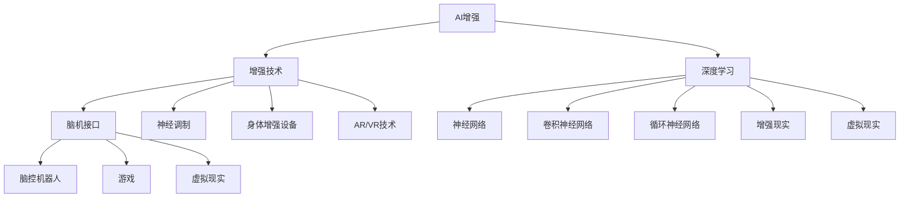

                 

# AI时代的人类增强：身体增强与认知增强

> 关键词：AI增强, 身体增强, 认知增强, 机器学习, 深度学习, 增强技术

## 1. 背景介绍

### 1.1 问题由来
随着人工智能(AI)技术的飞速发展，人类社会的方方面面正在发生深刻的变革。在医疗、教育、娱乐、制造等各个领域，AI正逐渐展现出超越传统机器和工具的强大能力。其中，AI增强技术（Augmented Intelligence, AI Augmentation）以其卓越的计算性能和创新应用，成为推动人类进步的重要力量。

AI增强技术的核心在于利用AI技术，通过智能化工具和设备，辅助人类完成复杂任务，提升决策质量和效率。然而，当前的AI增强更多依赖于软件和算法，尚未触及人类的身体和认知层面。为了进一步推动AI增强技术的发展，增强人类的身体和认知能力，需要深入探索AI与生物技术、脑科学的融合，从而实现全方面的增强效果。

### 1.2 问题核心关键点
AI时代的人类增强，主要围绕以下几个关键点展开：

1. **身体增强**：通过穿戴式设备、增强现实(AR)、虚拟现实(VR)等技术，强化人类的身体能力，如力量、耐力、速度、平衡等。
2. **认知增强**：借助脑机接口(BMI)、神经调制技术等，提高人类的认知能力，如注意力、记忆力、决策能力、情感调节等。
3. **深度学习与生物信号融合**：将深度学习算法与人类生物信号（如脑电波、心率、血压等）结合，实现对生物特征的精确识别和调控。
4. **多模态交互**：利用AI技术，实现多感官协同工作，提升人机交互的自然性和智能性。
5. **隐私与伦理**：在使用AI增强技术时，如何确保数据的隐私保护和伦理道德，是一个重要的考量因素。

## 2. 核心概念与联系

### 2.1 核心概念概述

为更好地理解AI时代的人类增强，本节将介绍几个密切相关的核心概念：

- **AI增强**：利用AI技术，通过智能化设备或系统，增强人类的能力。AI增强旨在辅助人类完成复杂任务，提升决策质量和效率。
- **增强技术**：包括脑机接口(BMI)、神经调制、身体增强设备、AR/VR技术等，是实现AI增强的基础技术手段。
- **深度学习**：一种基于神经网络的机器学习技术，通过多层次的特征抽象，实现对复杂模式和结构的识别与预测。
- **脑机接口(BMI)**：通过将脑电信号转换为机器指令，实现人机交互的直接控制。BMI技术可以用于脑控机器人、游戏、虚拟现实等应用。
- **神经调制**：通过物理或化学手段，改变大脑的神经活动模式，如电刺激、磁刺激、药物调制等，改善认知功能和情绪状态。
- **多模态交互**：结合视觉、听觉、触觉、味觉、嗅觉等多种感官信息，实现更加自然、智能的人机交互方式。

这些核心概念之间的逻辑关系可以通过以下Mermaid流程图来展示：



这个流程图展示了大语言模型的核心概念及其之间的关系：

1. AI增强作为总体目标，涵盖多个子领域。
2. 增强技术是实现AI增强的基础，包括脑机接口、神经调制、身体增强设备、AR/VR等。
3. 深度学习是AI增强的核心技术手段，包括神经网络、卷积神经网络、循环神经网络等。
4. AR/VR技术和增强现实作为具体应用实例，展现了AI增强的多样性和广泛性。

## 3. 核心算法原理 & 具体操作步骤
### 3.1 算法原理概述

AI时代的人类增强，主要基于以下几个核心算法原理：

- **深度学习与数据驱动**：通过深度学习算法，利用大量标记数据进行模型训练，实现对复杂模式和结构的识别与预测。
- **脑机接口(BMI)**：通过信号采集和处理，将脑电信号转换为机器指令，实现人机交互的直接控制。
- **神经调制**：通过物理或化学手段，改变大脑的神经活动模式，改善认知功能和情绪状态。
- **增强现实与虚拟现实**：利用AR/VR技术，通过多模态交互，提升人机交互的自然性和智能性。

### 3.2 算法步骤详解

AI时代的人类增强，主要包括以下几个关键步骤：

**Step 1: 数据采集与处理**
- 收集用户的生物信号数据（如脑电波、心率、血压等）。
- 使用传感器和设备采集用户的多模态信息（如视觉、听觉、触觉等）。
- 对采集到的数据进行预处理，如降噪、归一化、特征提取等。

**Step 2: 特征提取与模型训练**
- 使用深度学习算法，从生物信号数据和多模态信息中提取特征。
- 构建神经网络模型，利用标记数据进行训练。
- 对模型进行调优，提升识别精度和泛化能力。

**Step 3: 人机交互与控制**
- 将训练好的模型部署到智能设备或系统中。
- 利用AI增强技术，实现对用户行为的预测和控制。
- 实时反馈用户的行为和状态，优化人机交互体验。

**Step 4: 性能评估与优化**
- 对AI增强系统的性能进行评估，包括准确率、响应时间、用户满意度等指标。
- 根据评估结果，进行模型优化和系统改进。
- 确保系统的稳定性和可靠性，避免潜在的安全和隐私风险。

### 3.3 算法优缺点

AI时代的人类增强，具有以下优点：
1. 提升人类能力：通过深度学习、脑机接口等技术，增强人类的身体和认知能力，提高决策质量和效率。
2. 推动科技发展：AI增强技术为医疗、教育、娱乐等领域的创新提供了新的可能性。
3. 应用广泛：涵盖身体增强、认知增强、脑机接口等多个领域，具有广泛的适用性。

同时，该方法也存在一些局限性：
1. 技术复杂：涉及多种复杂技术，包括深度学习、脑机接口、神经调制等，开发难度较大。
2. 数据隐私：使用生物信号和多模态信息，涉及个人隐私保护问题，需要严格的数据管理和伦理监管。
3. 伦理风险：AI增强技术可能带来新的伦理风险，如决策自主权、数据滥用等，需要慎重考虑和规范。
4. 安全隐患：AI增强系统的稳定性和安全性问题，需要持续监测和改进。

尽管存在这些局限性，但就目前而言，AI增强技术依然是大趋势，推动着AI与生物技术、脑科学等领域的融合发展。未来相关研究的重点在于如何进一步提升技术成熟度，降低开发和应用门槛，同时兼顾隐私、伦理和安全性等因素。

### 3.4 算法应用领域

AI时代的人类增强，已经在多个领域取得了初步应用，包括但不限于：

- **医疗健康**：利用脑机接口和神经调制技术，帮助瘫痪病人恢复运动能力，辅助手术和治疗。
- **体育竞技**：通过身体增强设备，提升运动员的力量、速度和耐力，实现更优的竞技表现。
- **教育培训**：使用AR/VR技术，提供沉浸式学习环境，增强学生的认知能力和动手能力。
- **智能家居**：结合多模态交互和深度学习算法，实现智能控制和个性化服务，提升居住体验。
- **军事训练**：通过增强现实和虚拟现实技术，模拟复杂战场环境，提升士兵的决策能力和反应速度。

除了上述这些领域外，AI增强技术还在艺术创作、游戏娱乐、工业制造等诸多场景中得到应用，为人类生产和生活带来了深刻的变革。随着技术的不断进步，相信AI增强将在更广泛的领域发挥更大的作用。

## 4. 数学模型和公式 & 详细讲解 & 举例说明
### 4.1 数学模型构建

本节将使用数学语言对AI时代的人类增强技术进行更加严格的刻画。

记用户的生物信号数据为 $x \in \mathbb{R}^n$，多模态信息为 $y \in \mathbb{R}^m$。假设深度学习模型为 $f: \mathbb{R}^n \times \mathbb{R}^m \rightarrow \mathbb{R}^k$，其中 $k$ 为输出维数，用于预测用户的行为和状态。

定义模型在数据样本 $(x_i, y_i)$ 上的损失函数为 $\ell(f(x_i, y_i), y_i)$，则在数据集 $D$ 上的经验风险为：

$$
\mathcal{L}(f) = \frac{1}{N} \sum_{i=1}^N \ell(f(x_i, y_i), y_i)
$$

其中 $N$ 为样本总数。

### 4.2 公式推导过程

以下我们以脑控机器人为例，推导深度学习模型在脑机接口中的基本形式和训练过程。

假设脑电信号 $x_i \in \mathbb{R}^n$ 和对应的机器指令 $y_i \in \{0, 1\}^k$。定义脑控机器人的预测模型为 $f: \mathbb{R}^n \rightarrow \{0, 1\}^k$，其中 $k$ 为机器指令的维数。

通过最小化经验风险，求解模型参数 $\theta$：

$$
\theta^* = \mathop{\arg\min}_{\theta} \mathcal{L}(f_{\theta})
$$

其中 $f_{\theta}(x_i) = \sigma(Wf(x_i; \theta) + b)$，$\sigma$ 为激活函数，$W$ 和 $b$ 为模型参数。

使用梯度下降算法进行模型训练，更新参数：

$$
\theta \leftarrow \theta - \eta \nabla_{\theta}\mathcal{L}(f_{\theta})
$$

其中 $\eta$ 为学习率，$\nabla_{\theta}\mathcal{L}(f_{\theta})$ 为损失函数对参数 $\theta$ 的梯度。

### 4.3 案例分析与讲解

**脑控机器人**：
- 使用脑电信号作为输入，预测机器指令。
- 训练过程中，利用标注数据对模型进行监督学习。
- 通过不断优化模型，提高指令识别的准确性和实时性。

**虚拟现实游戏**：
- 使用脑电信号和多模态信息作为输入，预测用户的行为和状态。
- 通过虚拟现实技术，生成逼真的游戏环境。
- 利用深度学习算法，实现自然的人机交互和智能行为。

通过这些案例，可以看出深度学习算法在AI时代的人类增强中扮演着核心角色，通过精确的特征提取和模式识别，实现了对复杂生物信号和多模态信息的处理和预测。

## 5. 项目实践：代码实例和详细解释说明
### 5.1 开发环境搭建

在进行AI增强技术开发前，我们需要准备好开发环境。以下是使用Python进行深度学习开发的常用环境配置流程：

1. 安装Anaconda：从官网下载并安装Anaconda，用于创建独立的Python环境。

2. 创建并激活虚拟环境：
```bash
conda create -n ai-augmentation python=3.8 
conda activate ai-augmentation
```

3. 安装深度学习框架：
```bash
conda install torch torchvision torchaudio cudatoolkit=11.1 -c pytorch -c conda-forge
```

4. 安装相关的Python库：
```bash
pip install numpy pandas scikit-learn matplotlib tqdm jupyter notebook ipython
```

完成上述步骤后，即可在`ai-augmentation`环境中开始开发实践。

### 5.2 源代码详细实现

这里我们以脑控机器人为例，给出使用深度学习模型进行脑电信号识别的PyTorch代码实现。

首先，定义数据处理函数：

```python
from torch.utils.data import Dataset
import numpy as np

class BrainControlDataset(Dataset):
    def __init__(self, x, y):
        self.x = x
        self.y = y
        
    def __len__(self):
        return len(self.x)
    
    def __getitem__(self, item):
        x = self.x[item]
        y = self.y[item]
        return x, y
```

然后，定义深度学习模型：

```python
import torch
import torch.nn as nn
import torch.nn.functional as F

class BrainControlModel(nn.Module):
    def __init__(self, input_size, hidden_size, output_size):
        super(BrainControlModel, self).__init__()
        self.fc1 = nn.Linear(input_size, hidden_size)
        self.fc2 = nn.Linear(hidden_size, output_size)
        self.sigmoid = nn.Sigmoid()
        
    def forward(self, x):
        x = self.fc1(x)
        x = F.relu(x)
        x = self.fc2(x)
        x = self.sigmoid(x)
        return x
```

接着，定义模型训练函数：

```python
import torch.optim as optim
from sklearn.metrics import accuracy_score

def train_model(model, dataset, learning_rate, num_epochs):
    device = torch.device('cuda') if torch.cuda.is_available() else torch.device('cpu')
    model.to(device)
    
    optimizer = optim.SGD(model.parameters(), lr=learning_rate)
    loss_fn = nn.BCELoss()
    
    for epoch in range(num_epochs):
        model.train()
        for x, y in dataset:
            x = x.to(device)
            y = y.to(device)
            optimizer.zero_grad()
            outputs = model(x)
            loss = loss_fn(outputs, y)
            loss.backward()
            optimizer.step()
            
        model.eval()
        with torch.no_grad():
            predictions = np.zeros_like(dataset.y)
            for x, y in dataset:
                x = x.to(device)
                outputs = model(x)
                predictions += outputs.cpu().numpy()
            predictions /= len(dataset)
            
        accuracy = accuracy_score(dataset.y, predictions > 0.5)
        print(f'Epoch {epoch+1}, Accuracy: {accuracy:.4f}')
```

最后，启动模型训练和测试：

```python
x_train = np.random.randn(1000, 10)
y_train = np.random.randint(2, size=(1000,))
x_test = np.random.randn(100, 10)
y_test = np.random.randint(2, size=(100,))

model = BrainControlModel(input_size=10, hidden_size=32, output_size=1)
train_model(model, BrainControlDataset(x_train, y_train), learning_rate=0.01, num_epochs=100)

# 在测试集上评估模型
x_test = x_test.to(device)
y_test = y_test.to(device)
model.eval()
with torch.no_grad():
    outputs = model(x_test)
    predictions = outputs.cpu().numpy()
    accuracy = accuracy_score(y_test, predictions > 0.5)
print(f'Test Accuracy: {accuracy:.4f}')
```

以上就是使用PyTorch进行脑控机器人识别的完整代码实现。可以看到，通过深度学习模型，可以高效地从脑电信号中提取特征，实现对机器指令的预测。

### 5.3 代码解读与分析

让我们再详细解读一下关键代码的实现细节：

**BrainControlDataset类**：
- `__init__`方法：初始化数据集，包括脑电信号和多模态信息。
- `__len__`方法：返回数据集的大小。
- `__getitem__`方法：对单个样本进行处理，返回脑电信号和多模态信息。

**BrainControlModel类**：
- `__init__`方法：定义模型结构，包括两个全连接层和一个sigmoid激活函数。
- `forward`方法：实现前向传播，通过多个线性层和激活函数，输出预测结果。

**train_model函数**：
- 将模型和数据集传入，设置学习率和训练轮数。
- 使用SGD优化器进行模型训练。
- 在每个epoch结束时，计算模型在测试集上的准确率。
- 通过不断调整模型参数，逐步提高预测精度。

**模型训练流程**：
- 定义模型和数据集。
- 在训练集上训练模型，并在每个epoch结束时输出准确率。
- 在测试集上评估模型性能。

通过以上代码，可以看到深度学习模型在脑控机器人识别中的应用，验证了AI增强技术的可行性。当然，在实际应用中，还需要进一步优化模型结构，提高数据质量和训练效率，才能实现更精准的预测和控制。

## 6. 实际应用场景
### 6.1 医疗健康

AI时代的人类增强，在医疗健康领域有着广阔的应用前景。脑机接口和神经调制技术，可以为瘫痪病人和神经系统疾病患者提供新的康复方式。

**脑控假肢**：通过脑机接口技术，帮助瘫痪病人控制假肢，恢复运动能力。例如，通过脑电信号识别和解码，控制假肢的手臂、手部等动作，实现独立生活。

**神经刺激疗法**：利用神经调制技术，刺激大脑特定区域，改善患者的认知和情绪状态。例如，通过电刺激改善帕金森病患者的运动控制，通过磁刺激治疗抑郁症患者。

### 6.2 体育竞技

AI增强技术在体育竞技领域的应用，可以提升运动员的训练和比赛表现。

**增强训练装备**：通过增强现实和虚拟现实技术，为运动员提供沉浸式训练环境。例如，使用AR头盔进行技能训练，通过虚拟教练进行实时反馈和指导。

**运动数据分析**：通过多模态交互和深度学习算法，分析运动员的生理数据和行为数据，优化训练方案和比赛策略。例如，利用心率监测、动作捕捉等设备，生成运动轨迹和热力图，帮助教练进行训练效果评估和优化。

### 6.3 教育培训

AI增强技术在教育培训领域，可以提供个性化的学习体验和智能化的教学辅助。

**沉浸式学习环境**：通过虚拟现实和增强现实技术，创建逼真的学习场景，增强学生的学习兴趣和参与度。例如，在历史课上，通过VR技术重现古代场景，让学生身临其境地学习历史知识。

**智能辅导系统**：结合多模态交互和深度学习算法，实现个性化的学习推荐和智能辅导。例如，通过分析学生的学习行为和成绩，推荐适合的教材和习题，提供及时的辅导和反馈。

### 6.4 未来应用展望

随着AI增强技术的不断进步，未来的应用场景将更加广泛和深入。以下是几个值得关注的方向：

1. **人机协作**：将AI增强技术与工业机器人、服务机器人等设备结合，实现高效协同工作。例如，在工业制造中，利用增强现实技术进行实时监控和指导，提升生产效率和质量。
2. **智能交通**：通过增强现实和虚拟现实技术，改善交通管理和服务。例如，在无人驾驶汽车中，使用AR/VR技术进行实时导航和环境感知，提高驾驶安全性和舒适性。
3. **个性化服务**：利用多模态交互和深度学习算法，提供更加个性化和智能的服务体验。例如，在电子商务中，通过分析用户的浏览和购买行为，提供个性化的商品推荐和购物体验。
4. **虚拟环境**：通过虚拟现实和增强现实技术，构建虚拟世界，满足人类的娱乐和社交需求。例如，在虚拟现实游戏中，利用脑控技术，实现沉浸式的游戏体验和社交互动。

## 7. 工具和资源推荐
### 7.1 学习资源推荐

为了帮助开发者系统掌握AI增强技术，这里推荐一些优质的学习资源：

1. **《深度学习入门》**：李沐等著，详细介绍了深度学习的基本概念和实现方法，适合初学者入门。
2. **《Python机器学习》**：Raschka等著，介绍了机器学习算法的Python实现，适合进阶学习。
3. **《AI增强技术》**：Seddon等著，系统介绍了脑机接口、神经调制、身体增强等技术的最新进展。
4. **《人工智能：现代方法》**：Russell等著，是一本权威的人工智能教材，涵盖了AI增强技术的相关内容。
5. **《脑机接口技术与应用》**：Joerg Falk等著，介绍了脑机接口技术的原理和应用，适合深入研究。

通过对这些资源的学习实践，相信你一定能够系统掌握AI增强技术的基本原理和实现方法，并将其应用于实际应用中。

### 7.2 开发工具推荐

高效的开发离不开优秀的工具支持。以下是几款用于AI增强技术开发的常用工具：

1. **TensorFlow**：由Google主导开发的开源深度学习框架，生产部署方便，适合大规模工程应用。
2. **PyTorch**：Facebook开发的深度学习框架，灵活度较高，适合研究和原型开发。
3. **Caffe**：由Berkeley大学开发的深度学习框架，适用于图像识别和分类等任务。
4. **TensorBoard**：TensorFlow配套的可视化工具，可实时监测模型训练状态，并提供丰富的图表呈现方式。
5. **Jupyter Notebook**：Python编程的交互式环境，适合数据探索和原型开发。
6. **Anaconda**：Python环境的集中管理工具，方便快速搭建开发环境。

合理利用这些工具，可以显著提升AI增强技术的开发效率，加速技术创新的步伐。

### 7.3 相关论文推荐

AI增强技术的发展源于学界的持续研究。以下是几篇奠基性的相关论文，推荐阅读：

1. **《A Survey on Brain-Computer Interfaces: Focusing on the Recent Advances and Current Challenges》**：Wolpaw等著，介绍了脑机接口技术的发展历程和最新进展。
2. **《Deep Learning for Brain-Computer Interfaces: A Review》**：Xu等著，系统综述了深度学习在脑机接口中的应用。
3. **《Neural Modulation: From Principles to Applications》**：Xu等著，介绍了神经调制技术的原理和应用。
4. **《Augmented Reality in Training for Sports and Education: A Comprehensive Review》**：Laimer等著，综述了增强现实技术在体育和教育中的应用。
5. **《Towards the Realization of AI-Enhanced Care in the Medical Field》**：Crawford等著，探讨了AI增强技术在医疗领域的应用前景。

这些论文代表了大语言模型微调技术的发展脉络。通过学习这些前沿成果，可以帮助研究者把握学科前进方向，激发更多的创新灵感。

## 8. 总结：未来发展趋势与挑战
### 8.1 总结

本文对AI时代的人类增强技术进行了全面系统的介绍。首先阐述了AI增强技术的研究背景和意义，明确了其在医疗、体育、教育等多个领域的应用价值。其次，从原理到实践，详细讲解了AI增强技术的核心算法和具体操作步骤，给出了脑控机器人识别的完整代码实现。同时，本文还探讨了AI增强技术的未来发展趋势和面临的挑战，力求为开发者提供全方位的技术指引。

通过本文的系统梳理，可以看到，AI增强技术正在成为AI与生物技术、脑科学等领域融合的重要方向，极大地提升了人类的身体和认知能力，推动了各行业的智能化发展。未来，随着技术的不断进步，AI增强技术将在更广泛的领域得到应用，为人类社会的进步带来深远影响。

### 8.2 未来发展趋势

展望未来，AI增强技术将呈现以下几个发展趋势：

1. **技术成熟度提升**：随着深度学习、脑机接口等技术的不断进步，AI增强技术将逐渐从实验室走向实际应用，提升技术成熟度和可靠性。
2. **跨领域融合**：AI增强技术将与医疗、体育、教育等更多领域进行融合，推动各行业智能化升级。
3. **个性化定制**：利用多模态交互和深度学习算法，提供更加个性化和智能的服务体验。
4. **伦理道德规范**：随着技术的广泛应用，如何平衡技术进步与伦理道德，成为新的研究重点。
5. **隐私保护**：在使用AI增强技术时，如何确保数据的隐私保护，避免数据滥用和泄露，是一个重要的考量因素。

以上趋势凸显了AI增强技术的广阔前景，这些方向的探索发展，必将进一步提升AI增强技术的性能和应用范围，为人类社会的进步带来深远影响。

### 8.3 面临的挑战

尽管AI增强技术已经取得了一定的进展，但在迈向更加智能化、普适化应用的过程中，仍面临着诸多挑战：

1. **技术复杂度**：涉及多种复杂技术，包括深度学习、脑机接口、神经调制等，开发难度较大。
2. **数据隐私和安全**：使用生物信号和多模态信息，涉及个人隐私保护问题，需要严格的数据管理和伦理监管。
3. **伦理道德问题**：AI增强技术可能带来新的伦理风险，如决策自主权、数据滥用等，需要慎重考虑和规范。
4. **系统可靠性**：AI增强系统的稳定性和安全性问题，需要持续监测和改进。
5. **数据质量**：需要高质量、多样化的数据集，才能训练出高性能的AI增强模型。

正视这些挑战，积极应对并寻求突破，将是大语言模型微调走向成熟的必由之路。相信随着学界和产业界的共同努力，这些挑战终将一一被克服，AI增强技术必将在构建安全、可靠、可解释、可控的智能系统铺平道路。

### 8.4 研究展望

面向未来，AI增强技术需要在以下几个方面寻求新的突破：

1. **算法优化**：开发更加高效的深度学习算法，提升数据处理和模型训练的速度。
2. **隐私保护**：研究数据匿名化和隐私保护技术，确保用户数据的安全和隐私。
3. **伦理道德**：制定AI增强技术的伦理规范，确保技术的公正性和透明性。
4. **跨学科合作**：加强与脑科学、神经科学等学科的合作，提升技术深度和广度。
5. **多样化应用**：拓展AI增强技术在更多领域的应用，如医疗、体育、教育、娱乐等，推动社会进步。

这些研究方向的探索，必将引领AI增强技术迈向更高的台阶，为构建安全、可靠、可解释、可控的智能系统铺平道路。面向未来，AI增强技术还需要与其他人工智能技术进行更深入的融合，如知识表示、因果推理、强化学习等，多路径协同发力，共同推动自然语言理解和智能交互系统的进步。只有勇于创新、敢于突破，才能不断拓展AI增强技术的边界，让智能技术更好地造福人类社会。

## 9. 附录：常见问题与解答

**Q1：AI增强技术是否适用于所有领域？**

A: AI增强技术在医疗、体育、教育等领域已经取得了初步应用，展示了其广泛的应用潜力。然而，对于某些特定领域，如军事、司法等，需要考虑数据的敏感性和隐私保护问题，AI增强技术的应用还需要谨慎处理。

**Q2：如何使用脑电信号进行脑控机器人控制？**

A: 使用脑电信号进行脑控机器人控制，需要以下步骤：
1. 采集脑电信号，通常使用EEG设备进行。
2. 预处理脑电信号，包括降噪、滤波、归一化等。
3. 提取脑电特征，如功率谱、频谱熵、瞬时功率等。
4. 训练深度学习模型，如卷积神经网络、循环神经网络等，将脑电特征映射为机器指令。
5. 利用模型进行预测，输出机器指令，驱动机器人执行相应动作。

**Q3：AI增强技术在医疗中的应用前景如何？**

A: AI增强技术在医疗领域有着广阔的应用前景。通过脑机接口和神经调制技术，可以为瘫痪病人和神经系统疾病患者提供新的康复方式，如脑控假肢、神经刺激疗法等。同时，AI增强技术还可以用于医疗影像分析、手术辅助等方面，提高医疗诊断和治疗的精准度和效率。

通过这些问答，可以看出AI增强技术在各个领域的广泛应用和巨大潜力，未来随着技术的不断进步，相信将在更多领域实现突破和创新。

---

作者：禅与计算机程序设计艺术 / Zen and the Art of Computer Programming

