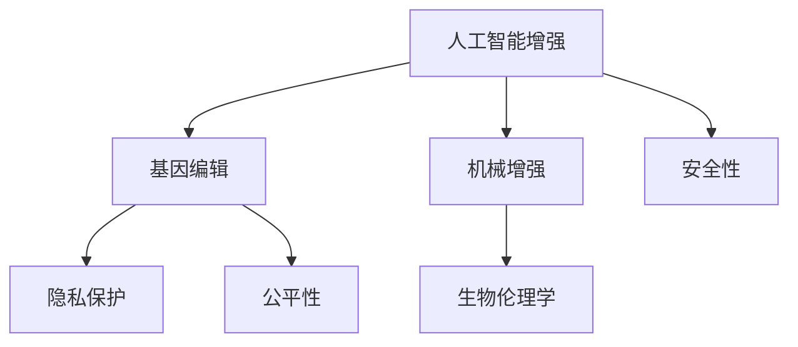

                 

# AI时代的人类增强：身体增强的道德和伦理

> 关键词：AI增强, 生物技术, 伦理, 道德, 人类健康, 未来科技

## 1. 背景介绍

随着科技的迅猛发展，人工智能(AI)、基因编辑和生物技术等新兴领域正在逐步突破传统医疗和生活的边界，推动人类能力的革命性增强。身体增强（Body Enhancement）作为这一趋势的重要组成部分，通过各种技术手段改善人类身体的功能，引发了广泛的社会关注和伦理争议。

### 1.1 问题由来

身体的增强手段多种多样，涵盖了从基因编辑到机械增强的广泛领域。基因编辑技术，如CRISPR，可以精准修改个体的遗传信息，预防疾病或增强某些生理功能。机械增强则通过植入植入物或外部辅助设备，弥补人体机能的缺陷，实现超人类能力。此外，干细胞技术、纳米医疗和脑机接口等前沿技术也在推动着身体增强的进一步发展。

然而，身体增强所带来的利益与风险并存，引发了关于隐私、安全、公平和道德的深刻讨论。这些问题不仅涉及个人权利与生物技术的道德边界，也关系到社会结构和未来科技的可持续发展。

### 1.2 问题核心关键点

身体增强引发了多个核心关键问题：
- 技术伦理：身体增强技术的研发和应用应遵循哪些伦理原则？
- 隐私保护：如何确保个人数据的隐私和知情同意权？
- 公平性问题：增强技术是否会导致新的社会不平等？
- 人类自我认知：身体增强如何影响个体和社会的身份认同？
- 安全性风险：身体增强技术可能带来的潜在健康和安全风险？

本博文旨在深入探讨这些核心关键点，分析身体增强技术的道德和伦理问题，并提出可能的解决方案，为未来科技的负责任发展提供参考。

## 2. 核心概念与联系

### 2.1 核心概念概述

为了更好地理解身体增强技术的道德和伦理问题，我们首先需要梳理涉及的相关核心概念。

- **人工智能增强**：使用AI技术，如机器学习、计算机视觉和自然语言处理等，来辅助或增强人类的身体机能。
- **基因编辑技术**：通过基因编辑，如CRISPR-Cas9，来修改个体的遗传信息，预防疾病或增强生理功能。
- **机械增强**：通过植入假肢、外骨骼或脑机接口等外部设备，增强人类的力量、速度或认知能力。
- **生物伦理学**：研究生物技术发展对人类社会的伦理影响，关注科技与伦理的平衡。

### 2.2 核心概念联系

这些概念之间存在着密切的联系，共同构成了身体增强技术的伦理框架。例如，基因编辑技术的发展需要遵守生物伦理学原则，确保技术应用的公正性和安全性。人工智能增强的应用也需考虑隐私保护和公平性问题。机械增强技术更是直接关系到伦理和道德边界，如如何平衡科技的进步与个体的权利。

我们可以用以下Mermaid流程图来展示这些概念之间的联系：



这个流程图展示了人工智能增强、基因编辑、机械增强与生物伦理学之间的关系，以及隐私保护、公平性和安全性问题如何影响这些技术的应用。

## 3. 核心算法原理 & 具体操作步骤

### 3.1 算法原理概述

身体增强技术的伦理和道德问题，主要涉及技术的使用原则、个人权利保护和公平性考量。核心算法原理可以概括为以下几点：

1. **伦理原则**：遵循“尊重自主性”、“不伤害”、“公正”、“有益”等伦理原则，确保技术应用的道德性。
2. **隐私保护**：确保个人数据的隐私权和知情同意权，防止数据滥用和信息泄露。
3. **公平性考量**：关注增强技术对不同人群的影响，防止产生新的社会不平等。
4. **安全性风险评估**：对技术应用可能带来的健康和安全风险进行全面评估。

### 3.2 算法步骤详解

身体增强技术的伦理和道德问题，可以通过以下步骤进行系统化分析：

1. **技术评估**：对拟应用的技术进行全面评估，包括其安全性、有效性和伦理合规性。
2. **利益相关者分析**：确定技术可能影响的各个利益相关者，如患者、开发者、监管机构等，并分析其影响。
3. **伦理审查**：通过伦理审查委员会，对技术应用进行伦理审查，确保其符合伦理原则。
4. **知情同意**：确保参与技术应用的患者或用户充分了解其风险和益处，并自愿同意。
5. **风险管理**：制定风险管理计划，确保技术应用过程中潜在风险得到控制。
6. **持续监控**：对技术应用进行持续监控和评估，及时发现和解决伦理问题。

### 3.3 算法优缺点

身体增强技术的伦理和道德问题，存在以下优缺点：

**优点**：
- **提升生活质量**：技术应用可以显著提升人类的生活质量，减轻疾病负担。
- **推动医学进步**：促进医学领域的新技术发展，推动科学研究的进步。
- **增强个体能力**：通过增强技术，个体可以实现超越自然能力的提升。

**缺点**：
- **隐私风险**：技术应用可能涉及大量个人数据，存在隐私泄露的风险。
- **伦理争议**：技术的应用可能引发伦理争议，如基因编辑引发的“设计婴儿”问题。
- **公平性问题**：增强技术的普及可能加剧社会不平等，扩大贫富差距。
- **安全性风险**：技术应用可能带来未知的风险和健康隐患。

### 3.4 算法应用领域

身体增强技术在多个领域具有广泛的应用前景：

- **医疗领域**：通过基因编辑和人工智能技术，预防和治疗疾病。
- **运动领域**：通过机械增强，提升运动员的竞技能力。
- **教育领域**：通过脑机接口技术，增强学习效果。
- **工业领域**：通过机械增强，提升工作安全性和效率。
- **消费领域**：通过植入设备，改善生活质量。

## 4. 数学模型和公式 & 详细讲解 & 举例说明

### 4.1 数学模型构建

在进行身体增强技术的伦理和道德分析时，我们通常需要构建数学模型来评估技术的影响。例如，使用机器学习模型来预测基因编辑技术对个体健康的影响，或者使用风险评估模型来量化技术应用的风险。

### 4.2 公式推导过程

以基因编辑技术为例，假设有一项基因编辑技术可以预防某种遗传病，我们需要构建一个数学模型来评估其对个体健康的影响。设$X$为个体患遗传病的风险，$Y$为基因编辑后的健康状态，$Z$为技术应用的影响因素，如年龄、健康状况等。

我们可以构建一个线性回归模型来描述这种关系：

$$ Y = aX + bZ + \epsilon $$

其中，$a$为基因编辑对健康的影响系数，$b$为其他因素对健康的影响系数，$\epsilon$为误差项。

### 4.3 案例分析与讲解

假设我们有一项基因编辑技术可以预防一种罕见的遗传性疾病，我们已经收集了大量数据，用于评估其效果。通过线性回归模型，我们可以分析基因编辑前后个体的健康状态变化。

例如，如果我们发现基因编辑后个体的健康状态提高了20%，那么我们可以认为这项技术是有效的。然而，我们也需要注意误差项$\epsilon$，以评估技术应用的准确性和可靠性。

## 5. 项目实践：代码实例和详细解释说明

### 5.1 开发环境搭建

为了分析身体增强技术的伦理和道德问题，我们可以使用Python和R等语言进行编程实现。以下是一些常用的开发工具和环境：

1. **Python**：推荐使用Anaconda或Miniconda创建虚拟环境，确保依赖包的隔离和版本控制。
2. **R**：使用R Studio或R Markdown创建分析报告。
3. **机器学习框架**：如TensorFlow、PyTorch和Scikit-Learn，用于构建和训练机器学习模型。
4. **数据管理工具**：如Pandas、NumPy和R的数据处理和分析库。
5. **统计分析工具**：如R中的ggplot2和Python中的Matplotlib，用于可视化分析结果。

### 5.2 源代码详细实现

以下是一个使用R语言进行基因编辑效果分析的示例代码：

```R
# 数据准备
library(dplyr)
data <- read.csv("genetic_editing_data.csv")

# 线性回归模型构建
model <- lm(health_state ~ genetic_editing + age + health_status, data = data)

# 模型评估
summary(model)
```

### 5.3 代码解读与分析

在这段代码中，我们首先加载了数据集，然后使用`lm`函数构建了一个线性回归模型，用于评估基因编辑对个体健康状态的影响。最后，通过`summary`函数对模型进行了评估，输出系数、R方等关键参数。

## 6. 实际应用场景

### 6.1 医疗领域

基因编辑技术在医疗领域具有广泛的应用前景。例如，CRISPR技术可以用于治疗遗传性疾病，如囊性纤维化和镰状细胞贫血。然而，这项技术也引发了关于“设计婴儿”的伦理争议。

**案例分析**：
- 假设有一对夫妇希望通过基因编辑技术避免其孩子患上某种遗传病。他们可以向基因编辑公司提交申请，由专业团队进行基因编辑操作。这种技术的应用必须经过伦理审查和知情同意，确保其安全性和有效性。

### 6.2 运动领域

机械增强技术在运动领域也有着广阔的应用前景。例如，植入增强装置可以提升运动员的力量、速度和耐力。然而，这种增强技术也引发了关于公平性和职业运动员道德的讨论。

**案例分析**：
- 在一场马拉松比赛中，一位运动员植入了一种增强装置，使其在比赛中表现出色。这种技术的应用必须经过伦理审查和监管，确保不会对其他运动员造成不公平影响。

### 6.3 教育领域

脑机接口技术在教育领域也有着广泛的应用前景。通过脑机接口，学生可以更加高效地学习和记忆。然而，这种技术也引发了关于学生隐私和公平性的讨论。

**案例分析**：
- 一所学校引入了脑机接口技术，用于提高学生的学习效果。这种技术的应用必须经过伦理审查和知情同意，确保学生的数据隐私和安全。

### 6.4 未来应用展望

未来，身体增强技术将在更多领域得到应用，为人类带来更多福利。然而，这也需要我们从伦理和道德的角度进行深入思考和规范。

**展望**：
- **医学领域**：通过基因编辑和人工智能技术，预防和治疗更多遗传疾病，提高人类健康水平。
- **运动领域**：通过机械增强，提升运动员的竞技能力和健康水平。
- **教育领域**：通过脑机接口技术，提升学生的学习效果和认知能力。
- **工业领域**：通过机械增强，提升工作效率和安全性。

## 7. 工具和资源推荐

### 7.1 学习资源推荐

为了深入理解身体增强技术的伦理和道德问题，以下是一些推荐的学习资源：

1. **《人工智能伦理》**：张钹、吴恩达等著，系统介绍了人工智能伦理的基本原则和应用场景。
2. **《基因伦理学》**：张德芬、张翼等著，探讨基因编辑技术的伦理问题和发展前景。
3. **《生物伦理学导论》**：万阅行、卢纯等著，全面介绍了生物技术的伦理问题和社会影响。
4. **《神经伦理学》**：李学标、杨枫等著，探讨脑机接口技术在伦理和道德上的挑战。

### 7.2 开发工具推荐

以下是一些常用的开发工具，用于身体增强技术的伦理和道德问题分析：

1. **Python**：用于数据分析和机器学习模型构建。
2. **R**：用于统计分析和可视化。
3. **Jupyter Notebook**：用于编写和运行代码，并进行互动式分析。
4. **R Markdown**：用于编写和发布数据分析报告。

### 7.3 相关论文推荐

以下是几篇具有代表性的相关论文，建议深入阅读：

1. **《基因编辑伦理与监管》**：探讨基因编辑技术的伦理问题和发展前景。
2. **《人工智能伦理与公平性》**：分析AI技术在伦理和公平性方面的挑战。
3. **《脑机接口伦理与道德》**：探讨脑机接口技术在伦理和道德上的挑战。

## 8. 总结：未来发展趋势与挑战

### 8.1 研究成果总结

本文对身体增强技术的伦理和道德问题进行了深入分析，探讨了技术应用带来的利益与风险，并提出了可能的解决方案。主要研究成果包括：

- **伦理原则**：遵循“尊重自主性”、“不伤害”、“公正”、“有益”等伦理原则，确保技术应用的道德性。
- **隐私保护**：确保个人数据的隐私权和知情同意权，防止数据滥用和信息泄露。
- **公平性考量**：关注增强技术对不同人群的影响，防止产生新的社会不平等。
- **安全性风险评估**：对技术应用可能带来的健康和安全风险进行全面评估。

### 8.2 未来发展趋势

未来，身体增强技术将在多个领域得到广泛应用，推动人类能力的革命性增强。然而，这也需要我们从伦理和道德的角度进行深入思考和规范。

**趋势**：
- **医学领域**：通过基因编辑和人工智能技术，预防和治疗更多遗传疾病，提高人类健康水平。
- **运动领域**：通过机械增强，提升运动员的竞技能力和健康水平。
- **教育领域**：通过脑机接口技术，提升学生的学习效果和认知能力。
- **工业领域**：通过机械增强，提升工作效率和安全性。

### 8.3 面临的挑战

尽管身体增强技术在多个领域具有广泛的应用前景，但也面临着诸多挑战：

1. **技术伦理**：如何平衡技术进步与伦理原则，确保技术应用的道德性？
2. **隐私保护**：如何确保个人数据的隐私权和知情同意权？
3. **公平性问题**：增强技术是否会导致新的社会不平等？
4. **安全性风险**：技术应用可能带来的未知风险和健康隐患？

### 8.4 研究展望

未来，身体增强技术的伦理和道德问题需要进一步深入研究和规范。我们建议：

- **加强伦理审查**：确保技术应用经过严格的伦理审查和知情同意。
- **提高透明度**：公开技术应用的效果和风险，确保公众的知情权。
- **促进公平性**：确保增强技术对不同人群的影响公平，防止产生新的社会不平等。
- **加强监管**：建立完善的监管机制，确保技术应用的安全性和有效性。

## 9. 附录：常见问题与解答

**Q1：基因编辑技术是否会引发“设计婴儿”问题？**

A：基因编辑技术的应用必须遵循伦理原则，确保技术的公正性和安全性。然而，“设计婴儿”问题仍需引起高度关注，需通过严格的伦理审查和监管来防止。

**Q2：增强技术是否会导致新的社会不平等？**

A：增强技术的普及可能加剧社会不平等，需要通过公平性考量和政策支持来避免。

**Q3：身体增强技术是否存在安全性风险？**

A：技术应用必须进行全面的安全性评估，确保其安全性和可靠性。

通过本文的系统梳理，我们可以看到，身体增强技术的伦理和道德问题是一个复杂而多维的问题，涉及技术、伦理、社会、法律等多个层面。只有通过多方协作，制定完善的伦理规范和技术标准，才能确保身体增强技术的健康发展，造福全人类。

---

作者：禅与计算机程序设计艺术 / Zen and the Art of Computer Programming

