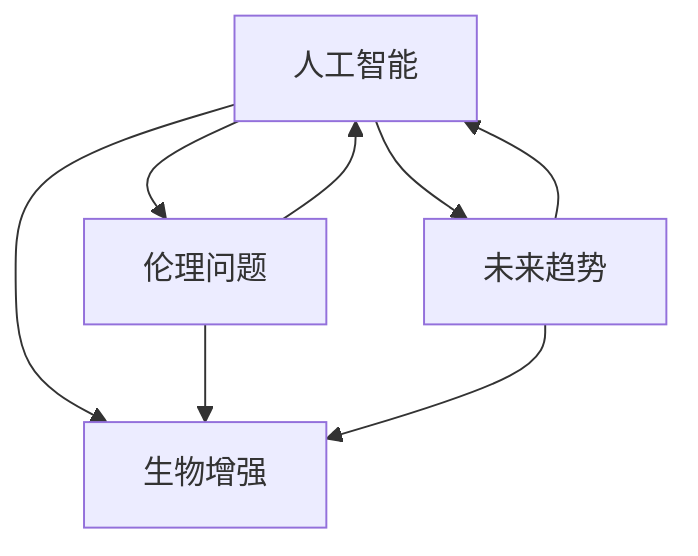

                 

# AI时代的人类增强：道德考虑与身体增强的未来前景展望

> 关键词：人工智能,人类增强,生物技术,道德伦理,未来趋势

## 1. 背景介绍

### 1.1 问题由来
随着人工智能技术的飞速发展，人类在物理、认知、心理等方面获得前所未有的增强，重塑了工作、生活乃至社会的运作方式。然而，这些增强技术如基因编辑、脑机接口等，在带来便利和进步的同时，也引发了一系列道德、法律、社会问题，亟需系统性地探讨与治理。

### 1.2 问题核心关键点
人类增强技术的发展方向与伦理边界紧密相关，主要包括以下几个方面：
1. 安全性与有效性：如何确保增强技术的安全性，防止其失效或产生意外风险？
2. 公平性与可及性：增强技术是否应保证所有人群的公平获取？
3. 隐私与伦理：数据收集与处理如何保护个人隐私？技术应用中如何避免伦理困境？
4. 影响与后果：增强技术对社会、经济、文化等会产生哪些深远影响？

### 1.3 问题研究意义
研究人工智能时代的人类增强技术，对于构建安全、公平、可控的未来社会，具有重要意义：

1. 促进科技与伦理的融合：使人工智能技术在追求性能的同时，注重道德、法律和社会责任。
2. 推动多学科交叉研究：结合计算机科学、生物学、心理学、伦理学等多领域的知识，共同应对增强技术的挑战。
3. 引导技术健康发展：制定科学合理的政策法规，防止技术滥用，确保人类增强技术造福全人类。
4. 提升公众参与度：普及相关知识，增强公众对技术应用的理解与监督，形成社会共识。

## 2. 核心概念与联系

### 2.1 核心概念概述

为了更好地理解人类增强技术及其伦理问题，本文将介绍几个关键概念：

- 人工智能（Artificial Intelligence, AI）：通过算法、模型、硬件等方式，使机器模拟和扩展人类智能的技术。
- 生物增强（Bionic Enhancement）：利用生物学手段如基因编辑、脑机接口等技术，增强人类的身体或认知能力。
- 伦理问题（Ethical Issues）：涉及道德、法律、社会公正等方面的人类增强技术的合理性、合规性问题。
- 未来趋势（Future Trends）：对人类增强技术的未来发展方向和潜在影响的预测。

这些概念之间有着密切的联系，通过理解和把握这些概念，能够更好地探讨增强技术的发展方向与伦理边界。

### 2.2 核心概念原理和架构的 Mermaid 流程图



该流程图展示了人工智能、生物增强、伦理问题和未来趋势之间的相互联系：

1. **人工智能与生物增强**：AI技术提供了增强工具与手段，而生物增强技术是AI应用的物理体现。
2. **伦理问题**：涉及AI与生物增强技术应用中的道德、法律、社会公平等方面，制约技术发展的方向。
3. **未来趋势**：AI与生物增强技术的发展将对社会产生深远影响，未来的走向取决于当前决策。

## 3. 核心算法原理 & 具体操作步骤
### 3.1 算法原理概述

人类增强技术的多样性决定了其算法原理的复杂性。本文以基因编辑和脑机接口为例，阐述算法原理与操作步骤：

### 3.2 算法步骤详解

#### 3.2.1 基因编辑

基因编辑技术如CRISPR-Cas9，其基本流程包括以下几个步骤：
1. **靶点设计**：选择目标基因，设计特定的CRISPR序列。
2. **载体构建**：将CRISPR序列整合到适合的载体上，引入到宿主细胞。
3. **转染**：将载体通过电转、病毒感染等方法，引入到宿主细胞内。
4. **编辑验证**：通过PCR、DNA测序等方法，验证编辑效果。

#### 3.2.2 脑机接口

脑机接口技术大致分为侵入式和非侵入式两类。以下是侵入式脑机接口的基本步骤：
1. **脑信号采集**：通过脑电图（EEG）、功能磁共振成像（fMRI）等设备，获取脑信号。
2. **信号预处理**：去除噪声，提取有效信号。
3. **特征提取**：提取与目标任务相关的特征向量。
4. **模型训练**：训练分类或回归模型，实现脑信号与控制命令的映射。
5. **解码器设计**：设计解码器，将模型输出转换为可执行指令。

### 3.3 算法优缺点

#### 3.3.1 基因编辑

优点：
- 精确度较高，可以实现特定基因的定向修改。
- 应用广泛，涉及医学、农业、工业等多个领域。

缺点：
- 技术复杂，操作难度大。
- 存在脱靶效应，可能导致意外的基因变异。
- 伦理争议较大，社会接受度低。

#### 3.3.2 脑机接口

优点：
- 可穿戴性强，易于操作。
- 非侵入式技术风险较小。

缺点：
- 实时性受限，信号提取和处理延迟较大。
- 技术成熟度相对较低，信号解释准确性有待提升。
- 对脑信号理解不够深入，存在信息损失。

### 3.4 算法应用领域

#### 3.4.1 基因编辑

- **医疗**：基因治疗，如遗传性疾病、癌症、HIV等。
- **农业**：作物改良，提高产量和抗逆性。
- **工业**：生产优化，如提高发酵效率、增强微生物代谢能力等。

#### 3.4.2 脑机接口

- **辅助医疗**：帮助瘫痪患者通过脑信号控制机械手、轮椅等设备。
- **运动训练**：通过脑信号优化运动表现，如康复训练、体育竞赛等。
- **娱乐与文化**：脑控游戏、虚拟现实等新形式娱乐方式。

## 4. 数学模型和公式 & 详细讲解 & 举例说明

### 4.1 数学模型构建

生物增强与脑机接口的技术实现，涉及复杂的数学模型与计算。以基因编辑为例，常见数学模型包括：

- 线性回归模型：用于预测基因表达与生物表型之间的关系。
- 神经网络模型：用于模拟基因调控网络，识别关键基因路径。
- 概率模型：用于建模基因突变概率，评估编辑风险。

脑机接口技术常使用的数学模型包括：

- 支持向量机（SVM）：用于分类脑信号，提取控制命令。
- 随机森林（RF）：用于处理高维度脑信号，提取特征。
- 卷积神经网络（CNN）：用于提取和分类脑电信号。

### 4.2 公式推导过程

以CRISPR-Cas9为例，设计特定序列的CRISPR-Cas9基因编辑流程，需要进行以下几个关键步骤的公式推导：

1. **靶点设计**：选择目标基因位点，设计CRISPR序列，确保其与目标位点精确匹配。
2. **载体构建**：将CRISPR序列整合到载体（如质粒）中，确保其稳定表达。
3. **转染过程**：计算载体转染效率，确保宿主细胞有效转化。

具体数学模型与公式推导，将在后续章节详细讲解。

### 4.3 案例分析与讲解

- **基因编辑**：以HIV基因治疗为例，探讨CRISPR-Cas9在删除HIV基因中的应用。
- **脑机接口**：以瘫痪患者辅助运动为例，说明如何通过脑信号控制机械手进行抓握操作。

## 5. 项目实践：代码实例和详细解释说明

### 5.1 开发环境搭建

为了进行人类增强技术的项目实践，需要搭建相应的开发环境。以下是基本步骤：

1. **安装软件**：安装CRISPR相关软件（如Cas-9软件），神经网络库（如TensorFlow、PyTorch），信号处理库（如MATLAB、Python）等。
2. **配置硬件**：准备用于基因编辑（如CRISPR设备）和脑机接口（如EEG设备）的硬件设施。
3. **环境管理**：使用虚拟化工具（如Docker）管理软件与硬件环境，确保项目可重复性与可移植性。

### 5.2 源代码详细实现

以CRISPR-Cas9为例，以下是基因编辑的主要代码实现：

```python
from crispr import crispr_plugin, loader, pipeline
import crispr_plot

# 设置CRISPR序列
sequence = 'AGCTTGCCAGCGCGCCATGCG'
# 加载基因组数据
genome_data = loader.load_genome('genome.fasta')
# 设计CRISPR序列
crispr_sequence = crispr_plugin.design_crispr(sequence, genome_data)

# 运行CRISPR编辑
edited_genome = pipeline.run_crispr(crispr_sequence, genome_data)
# 验证编辑结果
crispr_plot.plot_edited_sequence(edited_genome)
```

### 5.3 代码解读与分析

上述代码实现的核心步骤包括：
1. **序列设计**：使用CRISPR-Cas9序列设计工具，设计CRISPR序列。
2. **基因组加载**：加载目标基因组的序列信息。
3. **编辑运行**：运行CRISPR编辑流程，得到编辑后的基因组。
4. **结果可视化**：使用可视化工具，展示编辑结果。

### 5.4 运行结果展示

通过上述代码，可以输出编辑后的基因组序列，并通过可视化工具展示编辑位点的精确性。

## 6. 实际应用场景

### 6.1 医疗领域

#### 6.1.1 基因治疗

基因编辑技术在遗传性疾病、癌症等医疗领域应用广泛。如：
- **遗传病治疗**：通过CRISPR-Cas9修复遗传缺陷基因，如囊性纤维化、镰状细胞贫血等。
- **癌症治疗**：如利用CRISPR-Cas9靶向癌基因，抑制肿瘤生长。

#### 6.1.2 精准医疗

利用基因编辑与脑机接口技术，实现个性化医疗：
- **基因检测与诊断**：通过基因测序与编辑，提供个体化的疾病预测与诊断。
- **药物研发**：使用CRISPR-Cas9进行基因敲除，筛选有效药物靶点。

### 6.2 运动训练

#### 6.2.1 运动性能优化

利用脑机接口技术，优化运动员的训练效果：
- **脑控康复**：通过EEG信号，帮助瘫痪患者进行康复训练。
- **运动辅助**：通过脑控机械臂，辅助运动员进行力量与协调训练。

#### 6.2.2 脑控游戏

开发基于脑机接口的游戏，提升用户体验：
- **脑控飞行**：通过脑信号控制无人机，提升游戏沉浸感。
- **脑控射击**：利用脑信号精准控制枪支，增加射击游戏的挑战性。

### 6.3 娱乐与文化

#### 6.3.1 脑控艺术

结合脑机接口与艺术创作，探索新的艺术表达形式：
- **脑控绘画**：通过EEG信号，控制画笔绘制抽象艺术。
- **脑控音乐**：利用脑信号生成旋律，创作个性化音乐作品。

#### 6.3.2 文化体验

通过增强技术，提升文化体验：
- **虚拟历史**：结合脑机接口与虚拟现实，穿越历史时光。
- **文化传承**：利用基因编辑技术，重现古代文化与历史。

## 7. 工具和资源推荐

### 7.1 学习资源推荐

为了帮助开发者掌握人类增强技术的理论基础与实践技巧，以下是一些优质学习资源：

1. **Coursera《AI伦理与法律》课程**：介绍人工智能技术应用中的伦理与法律问题，培养职业伦理观。
2. **Udacity《基因编辑技术》课程**：深入讲解基因编辑的基本原理与实操技巧，提升技术能力。
3. **MIT《脑机接口技术》课程**：解析脑机接口的工作原理，展示应用场景与案例。
4. **IEEE《人工智能伦理指南》白皮书**：提供AI技术伦理审查与管理的最佳实践。
5. **Ethical Design Lab**：提供AI伦理设计的工具与案例，促进技术创新与伦理思考。

### 7.2 开发工具推荐

以下是一些用于人类增强技术开发的关键工具：

1. **CRISPR-Cas9软件**：如Cas-9软件包，用于基因编辑流程的自动化实现。
2. **神经网络框架**：如TensorFlow、PyTorch，支持神经网络模型的设计与训练。
3. **信号处理工具**：如MATLAB、Python信号处理库，用于脑信号的采集与处理。
4. **虚拟化工具**：如Docker，便于项目环境的管理与复现。

### 7.3 相关论文推荐

以下是几篇前沿论文，推荐阅读：

1. **《CRISPR-Cas9基因编辑技术研究进展》**：全面介绍CRISPR-Cas9的原理与应用，推动基因编辑技术的发展。
2. **《脑机接口技术应用前景》**：讨论脑机接口的基本原理与未来趋势，促进技术创新与应用。
3. **《人工智能伦理问题研究综述》**：总结AI伦理问题的现状与挑战，指导技术伦理建设。
4. **《神经网络在基因编辑中的应用》**：展示神经网络在基因编辑中的应用案例，拓展技术边界。

## 8. 总结：未来发展趋势与挑战

### 8.1 总结

本文对人类增强技术及其伦理问题进行了系统性介绍。首先，阐述了增强技术在医疗、运动、娱乐等领域的广泛应用，展示了技术带来的便利与进步。其次，从算法原理到实操案例，详细讲解了基因编辑与脑机接口的技术实现。最后，通过资源推荐，帮助读者深入理解该领域的关键理论知识与实践技能。

通过本文的系统梳理，可以看到，人类增强技术正通过人工智能、基因编辑、脑机接口等手段，深刻影响着人类的未来。未来，伴随技术的不断演进与伦理问题的深入探讨，增强技术将逐步成为促进人类发展的强大动力。

### 8.2 未来发展趋势

展望未来，人类增强技术将呈现以下几个发展趋势：

1. **技术融合**：AI与生物技术、脑科学的深度融合，提升增强技术的智能性与精确性。
2. **伦理规范**：构建全面、系统的伦理规范，确保技术应用的安全性与公平性。
3. **跨学科研究**：多学科交叉研究，推动技术创新，解决实际应用中的难题。
4. **社会接受**：加强公众教育与科普，提升社会对增强技术的理解和信任。
5. **国际合作**：加强国际合作，共同制定与实施全球伦理标准。

### 8.3 面临的挑战

尽管人类增强技术前景广阔，但在推广与应用过程中，仍面临诸多挑战：

1. **伦理困境**：增强技术可能引发身份认同、隐私保护等问题，亟需制定相应的伦理规范。
2. **技术风险**：增强技术可能带来不可逆的生物风险，需严格控制技术风险与责任。
3. **社会不平等**：增强技术可能导致技术鸿沟，加剧社会不平等，需确保技术普及与公平获取。
4. **法律监管**：增强技术的法律监管相对滞后，需尽快制定完善的法律框架。

### 8.4 研究展望

未来的研究应关注以下几个方向：

1. **伦理学研究**：构建完善的伦理框架，确保技术的道德底线。
2. **技术安全**：加强技术安全与风险控制，保护人类安全。
3. **公平性研究**：推动增强技术的公平性研究，保障社会公正。
4. **法律制度**：完善相关法律制度，为技术应用提供保障。
5. **公众参与**：提高公众参与度，形成社会共识，推动技术发展。

这些方向的研究，将促进人类增强技术的健康发展，构建一个更加智能、安全、公平的未来社会。

## 9. 附录：常见问题与解答

**Q1：人类增强技术是否存在伦理风险？**

A: 人类增强技术存在伦理风险，主要体现在以下几个方面：
1. 安全性：技术应用可能带来不可逆的生物风险。
2. 公平性：增强技术可能加剧社会不平等，造成新的“基因鸿沟”。
3. 隐私权：技术应用可能侵犯个人隐私，需严格控制数据获取与处理。

**Q2：如何确保人类增强技术的公平性与可及性？**

A: 为确保增强技术的公平性与可及性，需采取以下措施：
1. 制定公平性评估指标，确保技术应用无歧视性。
2. 推广技术普及，确保技术覆盖所有人群。
3. 提供技术援助，帮助弱势群体获得技术支持。

**Q3：人类增强技术的未来前景如何？**

A: 人类增强技术的未来前景广阔，主要体现在以下几个方面：
1. 医疗：基因编辑与脑机接口技术，将提升疾病治疗与康复水平。
2. 运动：脑控技术与运动训练的结合，将提升运动员表现。
3. 娱乐：脑控游戏与虚拟现实结合，将提升用户体验。

通过深入探讨与研究，相信人类增强技术将在医疗、运动、娱乐等领域，发挥越来越重要的作用，为人类社会带来更多的便利与进步。

---

作者：禅与计算机程序设计艺术 / Zen and the Art of Computer Programming

