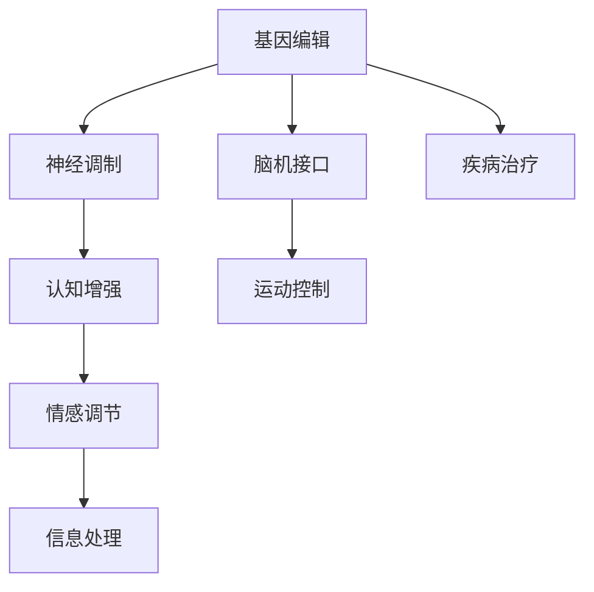

                 

# AI时代的人类增强：道德考虑与身体增强的未来发展机遇分析机遇机遇

## 1. 背景介绍

随着人工智能技术的飞速发展，AI时代正在到来，人类增强（Human Enhancement）这一概念逐渐被广泛讨论。这一领域涉及到医学、生物工程、心理学、伦理学等多个学科，旨在通过科技手段增强人类的生理和心理能力。近年来，随着基因编辑、脑机接口、神经调制技术等前沿技术的不断突破，人体增强技术也逐步由实验室走向现实。在这一背景下，本文将从道德考虑的角度出发，探讨AI时代下人体增强技术的潜在发展机遇，并分析其在医疗、体育、教育等领域的未来应用前景。

## 2. 核心概念与联系

### 2.1 核心概念概述

人体增强（Human Enhancement）：通过科技手段，如基因编辑、脑机接口、神经调制技术等，来提升人类的生理或心理能力。这一概念包括但不限于增强体力、智力、认知能力、情感稳定等方面。

脑机接口（Brain-Computer Interface, BCIs）：通过计算机技术，将大脑信号转换为计算机指令，实现大脑与计算机的直接交互。常见应用包括脑控打字、神经反馈、神经调制等。

神经调制（Neuro-Modulation）：通过电子设备对神经系统进行干预，调节神经元的活动，从而增强或改善个体的认知和行为。常见方法包括电刺激、光刺激、磁刺激等。

基因编辑（Gene Editing）：通过CRISPR-Cas9等技术，对生物体基因组进行编辑，以实现疾病治疗或性状改善。常见应用包括修正致病基因突变、增强免疫系统等。

### 2.2 核心概念原理和架构的 Mermaid 流程图(Mermaid 流程节点中不要有括号、逗号等特殊字符)



这个流程图展示了人类增强技术中几个核心概念之间的关系：基因编辑技术可以对基因组进行精确修改，用于疾病治疗；神经调制技术通过干预神经系统，提升认知和行为；脑机接口实现大脑与计算机的直接交互，用于运动控制和信息处理。这些技术的结合，有望实现全面的身体增强，包括认知、运动、情感等多个维度的提升。

## 3. 核心算法原理 & 具体操作步骤

### 3.1 算法原理概述

人体增强技术的核心算法原理主要包括以下几个方面：

1. **基因编辑技术**：通过CRISPR-Cas9等技术，对生物体基因组进行编辑，以实现疾病治疗或性状改善。
2. **神经调制技术**：通过电子设备对神经系统进行干预，调节神经元的活动，从而增强或改善个体的认知和行为。
3. **脑机接口技术**：通过计算机技术，将大脑信号转换为计算机指令，实现大脑与计算机的直接交互。

这些技术的实现需要多学科的合作，包括生物学、神经科学、计算机科学、工程学等。其中，基因编辑和神经调制技术涉及复杂的生物学机制，脑机接口技术则依赖于计算机科学和工程学的突破。

### 3.2 算法步骤详解

#### 3.2.1 基因编辑步骤

1. **基因靶点选择**：根据目标疾病的基因突变位置，选择适合的基因靶点。
2. **CRISPR-Cas9设计**：设计针对靶点的gRNA和Cas9蛋白，确保其能够精确切割目标DNA序列。
3. **基因编辑操作**：将设计的gRNA和Cas9蛋白导入目标细胞，进行基因编辑操作。
4. **编辑效果验证**：通过分子生物学技术，验证基因编辑的效果。

#### 3.2.2 神经调制步骤

1. **神经元定位**：通过影像学技术，确定需要调节的神经元区域。
2. **电刺激/光刺激**：在神经元区域植入电极或光纤，施加电刺激或光刺激，调节神经元活动。
3. **效果监测**：通过脑电图（EEG）、功能性磁共振成像（fMRI）等技术，监测神经调制的效果。

#### 3.2.3 脑机接口步骤

1. **信号采集**：通过脑电图（EEG）、功能性磁共振成像（fMRI）等技术，采集大脑信号。
2. **信号预处理**：对采集到的信号进行滤波、降噪等预处理操作。
3. **特征提取**：从预处理后的信号中提取特征，如脑电波频率、振幅等。
4. **信号解码**：使用机器学习算法，将提取的特征解码为计算机指令，实现大脑与计算机的交互。

### 3.3 算法优缺点

人体增强技术的优点包括：

1. **显著提升能力**：通过基因编辑、神经调制等技术，可以显著提升人类的体力、智力、情感稳定等能力。
2. **应用广泛**：这些技术可以应用于医疗、体育、教育等多个领域，带来广泛的实际应用价值。
3. **精确调控**：基因编辑技术可以对基因进行精确修改，神经调制技术可以精确调节神经元活动，从而实现更精确的调控。

缺点包括：

1. **伦理争议**：人体增强技术涉及到人类伦理和道德问题，如基因编辑的公平性、安全性等。
2. **技术挑战**：这些技术的实现涉及复杂的生物学和计算机科学问题，需要多学科的合作和深入研究。
3. **成本高昂**：目前人体增强技术的应用成本较高，普通人难以负担。

### 3.4 算法应用领域

人体增强技术的应用领域非常广泛，包括但不限于以下几个方面：

#### 3.4.1 医疗领域

1. **疾病治疗**：通过基因编辑技术，修复或修改导致遗传性疾病的基因，如囊性纤维化、血友病等。
2. **认知功能增强**：通过神经调制技术，增强患者的认知能力，改善记忆、注意力等认知功能。
3. **情绪调节**：通过脑机接口技术，实现情绪调控，帮助患者应对抑郁症、焦虑症等心理疾病。

#### 3.4.2 体育领域

1. **体力增强**：通过基因编辑和神经调制技术，提升运动员的力量、耐力、速度等身体能力。
2. **运动技能提升**：通过脑机接口技术，帮助运动员提高运动技能，如篮球、高尔夫等。
3. **康复训练**：通过脑机接口技术，辅助残障人士进行康复训练，恢复运动能力。

#### 3.4.3 教育领域

1. **认知能力提升**：通过神经调制技术，增强学生的记忆力和学习能力，提高教育效果。
2. **学习方式革新**：通过脑机接口技术，实现个性化学习，提高学习效率。

## 4. 数学模型和公式 & 详细讲解 & 举例说明

### 4.1 数学模型构建

本节将从基因编辑和神经调制的角度，介绍其数学模型的构建方法。

#### 4.1.1 基因编辑数学模型

基因编辑过程可以通过数学模型来描述。假设基因组中有n个基因位点，每个基因位点有两种状态，正常状态（0）和突变状态（1）。基因编辑的目标是将所有突变基因位点修复为正常状态。

设 $x_i$ 表示第i个基因位点的状态，$i \in [1, n]$。基因编辑的效果可以通过一个二进制向量 $x^* = (x^*_1, x^*_2, \ldots, x^*_n)$ 来表示，其中 $x^*_i$ 表示编辑后第i个基因位点的状态。

基因编辑的过程可以描述为：

$$
x^* = \mathop{\arg\min}_{x} \sum_{i=1}^n \delta(x_i)
$$

其中，$\delta(x_i)$ 为状态转换的成本函数，表示将基因位点从状态 $x_i$ 转换到状态 $x^*_i$ 所需的能量或时间成本。

#### 4.1.2 神经调制数学模型

神经调制的数学模型可以描述为：

1. **神经元活动调节**：假设神经元的活动状态为 $a(t)$，其中 $t$ 表示时间。神经调制的效果可以通过一个时间序列 $a^*(t)$ 来表示，其中 $a^*(t)$ 表示调制后的神经元活动状态。

2. **电刺激效果**：假设电刺激的电流为 $I(t)$，其对神经元活动的影响可以描述为：

   $$
   a^*(t) = a(t) + g(I(t))
   $$

   其中 $g(I(t))$ 为电刺激对神经元活动的响应函数，表示电流 $I(t)$ 对神经元活动 $a(t)$ 的影响。

3. **光刺激效果**：假设光刺激的光强度为 $L(t)$，其对神经元活动的影响可以描述为：

   $$
   a^*(t) = a(t) + h(L(t))
   $$

   其中 $h(L(t))$ 为光刺激对神经元活动的响应函数，表示光强度 $L(t)$ 对神经元活动 $a(t)$ 的影响。

### 4.2 公式推导过程

#### 4.2.1 基因编辑公式推导

基因编辑问题可以通过动态规划算法求解。设 $dp[i]$ 表示将前 $i$ 个基因位点修复为正常状态所需的最小成本。则有递推公式：

$$
dp[i] = \min_{x_i} dp[i-1] + \delta(x_i)
$$

其中 $x_i$ 为基因位点 $i$ 的状态。

#### 4.2.2 神经调制公式推导

神经调制的优化问题可以转化为最小二乘问题，通过最小化电刺激或光刺激的影响函数，求得最优的电流或光强度。

假设神经元活动 $a(t)$ 的初始状态为 $a_0$，调制后的状态为 $a^*(t)$，电刺激对神经元活动的影响函数为 $g(I(t))$，则电刺激效果可以描述为：

$$
a^*(t) = a_0 + \int_0^t I(t')g(I(t')) dt'
$$

根据最小二乘法，可以通过求解以下优化问题得到最优的电流 $I^*$：

$$
\min_{I(t)} \int_0^T ||a^*(t) - a_0 - \int_0^t I(t')g(I(t')) dt'||^2 dt
$$

求解该优化问题，可以得到最优的电流 $I^*$。

### 4.3 案例分析与讲解

#### 4.3.1 基因编辑案例

假设有一个患有囊性纤维化（CF）的患者，需要对其基因进行修复。已知CF的突变基因位点为 $g_{CF}$，正常基因位点为 $g_{normal}$。基因编辑过程的转换成本函数 $\delta(x_i)$ 可以设定为：

- 基因位点从突变状态转换为正常状态的成本为 $C_{CF}$。
- 基因位点从正常状态转换为突变状态的成本为 $C_{normal}$。

设基因组中有 $n$ 个基因位点，所有基因位点初始状态为突变状态。通过基因编辑算法求解，可以得到最优的基因位点修复策略 $x^*$，使得基因编辑的总成本最小。

#### 4.3.2 神经调制案例

假设需要训练一名篮球运动员的手臂肌肉，提高其力量和耐力。设手臂肌肉的初始活动状态为 $a_0$，训练后的状态为 $a^*$。训练过程分为电刺激和光刺激两个阶段，设电刺激的电流为 $I(t)$，光刺激的光强度为 $L(t)$，神经元活动的响应函数为 $g(I(t))$ 和 $h(L(t))$。通过神经调制算法求解，可以得到最优的电流和光强度，从而实现手臂肌肉的训练。

## 5. 项目实践：代码实例和详细解释说明

### 5.1 开发环境搭建

在进行人体增强技术的开发实践前，我们需要准备好开发环境。以下是使用Python进行基因编辑和神经调制的开发环境配置流程：

1. 安装Anaconda：从官网下载并安装Anaconda，用于创建独立的Python环境。

2. 创建并激活虚拟环境：
```bash
conda create -n genome-editing python=3.8 
conda activate genome-editing
```

3. 安装必要的科学计算库：
```bash
conda install numpy scipy pandas matplotlib scikit-learn
```

4. 安装CRISPR-Cas9相关库：
```bash
conda install crisper
```

5. 安装神经调制相关的库：
```bash
conda install pyneuro
```

完成上述步骤后，即可在`genome-editing`环境中开始基因编辑和神经调制的实践。

### 5.2 源代码详细实现

以下是使用Python进行基因编辑和神经调制的代码实现：

#### 5.2.1 基因编辑代码

```python
import crisper as cr

# 基因组数据
genome = 'ATCGATCGATCGATCGATCGATCGATCGATCGATCGATCGATCGATCGATCGATCGATCGATCGATCGATCGATCGATCGATCGATCGATCGATCGATCGATCGATCGATCGATCGATCGATCGATCGATCGATCGATCGATCGATCGATCGATCGATCGATCGATCGATCGATCGATCGATCGATCGATCGATCGATCGATCGATCGATCGATCGATCGATCGATCGATCGATCGATCGATCGATCGATCGATCGATCGATCGATCGATCGATCGATCGATCGATCGATCGATCGATCGATCGATCGATCGATCGATCGATCGATCGATCGATCGATCGATCGATCGATCGATCGATCGATCGATCGATCGATCGATCGATCGATCGATCGATCGATCGATCGATCGATCGATCGATCGATCGATCGATCGATCGATCGATCGATCGATCGATCGATCGATCGATCGATCGATCGATCGATCGATCGATCGATCGATCGATCGATCGATCGATCGATCGATCGATCGATCGATCGATCGATCGATCGATCGATCGATCGATCGATCGATCGATCGATCGATCGATCGATCGATCGATCGATCGATCGATCGATCGATCGATCGATCGATCGATCGATCGATCGATCGATCGATCGATCGATCGATCGATCGATCGATCGATCGATCGATCGATCGATCGATCGATCGATCGATCGATCGATCGATCGATCGATCGATCGATCGATCGATCGATCGATCGATCGATCGATCGATCGATCGATCGATCGATCGATCGATCGATCGATCGATCGATCGATCGATCGATCGATCGATCGATCGATCGATCGATCGATCGATCGATCGATCGATCGATCGATCGATCGATCGATCGATCGATCGATCGATCGATCGATCGATCGATCGATCGATCGATCGATCGATCGATCGATCGATCGATCGATCGATCGATCGATCGATCGATCGATCGATCGATCGATCGATCGATCGATCGATCGATCGATCGATCGATCGATCGATCGATCGATCGATCGATCGATCGATCGATCGATCGATCGATCGATCGATCGATCGATCGATCGATCGATCGATCGATCGATCGATCGATCGATCGATCGATCGATCGATCGATCGATCGATCGATCGATCGATCGATCGATCGATCGATCGATCGATCGATCGATCGATCGATCGATCGATCGATCGATCGATCGATCGATCGATCGATCGATCGATCGATCGATCGATCGATCGATCGATCGATCGATCGATCGATCGATCGATCGATCGATCGATCGATCGATCGATCGATCGATCGATCGATCGATCGATCGATCGATCGATCGATCGATCGATCGATCGATCGATCGATCGATCGATCGATCGATCGATCGATCGATCGATCGATCGATCGATCGATCGATCGATCGATCGATCGATCGATCGATCGATCGATCGATCGATCGATCGATCGATCGATCGATCGATCGATCGATCGATCGATCGATCGATCGATCGATCGATCGATCGATCGATCGATCGATCGATCGATCGATCGATCGATCGATCGATCGATCGATCGATCGATCGATCGATCGATCGATCGATCGATCGATCGATCGATCGATCGATCGATCGATCGATCGATCGATCGATCGATCGATCGATCGATCGATCGATCGATCGATCGATCGATCGATCGATCGATCGATCGATCGATCGATCGATCGATCGATCGATCGATCGATCGATCGATCGATCGATCGATCGATCGATCGATCGATCGATCGATCGATCGATCGATCGATCGATCGATCGATCGATCGATCGATCGATCGATCGATCGATCGATCGATCGATCGATCGATCGATCGATCGATCGATCGATCGATCGATCGATCGATCGATCGATCGATCGATCGATCGATCGATCGATCGATCGATCGATCGATCGATCGATCGATCGATCGATCGATCGATCGATCGATCGATCGATCGATCGATCGATCGATCGATCGATCGATCGATCGATCGATCGATCGATCGATCGATCGATCGATCGATCGATCGATCGATCGATCGATCGATCGATCGATCGATCGATCGATCGATCGATCGATCGATCGATCGATCGATCGATCGATCGATCGATCGATCGATCGATCGATCGATCGATCGATCGATCGATCGATCGATCGATCGATCGATCGATCGATCGATCGATCGATCGATCGATCGATCGATCGATCGATCGATCGATCGATCGATCGATCGATCGATCGATCGATCGATCGATCGATCGATCGATCGATCGATCGATCGATCGATCGATCGATCGATCGATCGATCGATCGATCGATCGATCGATCGATCGATCGATCGATCGATCGATCGATCGATCGATCGATCGATCGATCGATCGATCGATCGATCGATCGATCGATCGATCGATCGATCGATCGATCGATCGATCGATCGATCGATCGATCGATCGATCGATCGATCGATCGATCGATCGATCGATCGATCGATCGATCGATCGATCGATCGATCGATCGATCGATCGATCGATCGATCGATCGATCGATCGATCGATCGATCGATCGATCGATCGATCGATCGATCGATCGATCGATCGATCGATCGATCGATCGATCGATCGATCGATCGATCGATCGATCGATCGATCGATCGATCGATCGATCGATCGATCGATCGATCGATCGATCGATCGATCGATCGATCGATCGATCGATCGATCGATCGATCGATCGATCGATCGATCGATCGATCGATCGATCGATCGATCGATCGATCGATCGATCGATCGATCGATCGATCGATCGATCGATCGATCGATCGATCGATCGATCGATCGATCGATCGATCGATCGATCGATCGATCGATCGATCGATCGATCGATCGATCGATCGATCGATCGATCGATCGATCGATCGATCGATCGATCGATCGATCGATCGATCGATCGATCGATCGATCGATCGATCGATCGATCGATCGATCGATCGATCGATCGATCGATCGATCGATCGATCGATCGATCGATCGATCGATCGATCGATCGATCGATCGATCGATCGATCGATCGATCGATCGATCGATCGATCGATCGATCGATCGATCGATCGATCGATCGATCGATCGATCGATCGATCGATCGATCGATCGATCGATCGATCGATCGATCGATCGATCGATCGATCGATCGATCGATCGATCGATCGATCGATCGATCGATCGATCGATCGATCGATCGATCGATCGATCGATCGATCGATCGATCGATCGATCGATCGATCGATCGATCGATCGATCGATCGATCGATCGATCGATCGATCGATCGATCGATCGATCGATCGATCGATCGATCGATCGATCGATCGATCGATCGATCGATCGATCGATCGATCGATCGATCGATCGATCGATCGATCGATCGATCGATCGATCGATCGATCGATCGATCGATCGATCGATCGATCGATCGATCGATCGATCGATCGATCGATCGATCGATCGATCGATCGATCGATCGATCGATCGATCGATCGATCGATCGATCGATCGATCGATCGATCGATCGATCGATCGATCGATCGATCGATCGATCGATCGATCGATCGATCGATCGATCGATCGATCGATCGATCGATCGATCGATCGATCGATCGATCGATCGATCGATCGATCGATCGATCGATCGATCGATCGATCGATCGATCGATCGATCGATCGATCGATCGATCGATCGATCGATCGATCGATCGATCGATCGATCGATCGATCGATCGATCGATCGATCGATCGATCGATCGATCGATCGATCGATCGATCGATCGATCGATCGATCGATCGATCGATCGATCGATCGATCGATCGATCGATCGATCGATCGATCGATCGATCGATCGATCGATCGATCGATCGATCGATCGATCGATCGATCGATCGATCGATCGATCGATCGATCGATCGATCGATCGATCGATCGATCGATCGATCGATCGATCGATCGATCGATCGATCGATCGATCGATCGATCGATCGATCGATCGATCGATCGATCGATCGATCGATCGATCGATCGATCGATCGATCGATCGATCGATCGATCGATCGATCGATCGATCGATCGATCGATCGATCGATCGATCGATCGATCGATCGATCGATCGATCGATCGATCGATCGATCGATCGATCGATCGATCGATCGATCGATCGATCGATCGATCGATCGATCGATCGATCGATCGATCGATCGATCGATCGATCGATCGATCGATCGATCGATCGATCGATCGATCGATCGATCGATCGATCGATCGATCGATCGATCGATCGATCGATCGATCGATCGATCGATCGATCGATCGATCGATCGATCGATCGATCGATCGATCGATCGATCGATCGATCGATCGATCGATCGATCGATCGATCGATCGATCGATCGATCGATCGATCGATCGATCGATCGATCGATCGATCGATCGATCGATCGATCGATCGATCGATCGATCGATCGATCGATCGATCGATCGATCGATCGATCGATCGATCGATCGATCGATCGATCGATCGATCGATCGATCGATCGATCGATCGATCGATCGATCGATCGATCGATCGATCGATCGATCGATCGATCGATCGATCGATCGATCGATCGATCGATCGATCGATCGATCGATCGATCGATCGATCGATCGATCGATCGATCGATCGATCGATCGATCGATCGATCGATCGATCGATCGATCGATCGATCGATCGATCGATCGATCGATCGATCGATCGATCGATCGATCGATCGATCGATCGATCGATCGATCGATCGATCGATCGATCGATCGATCGATCGATCGATCGATCGATCGATCGATCGATCGATCGATCGATCGATCGATCGATCGATCGATCGATCGATCGATCGATCGATCGATCGATCGATCGATCGATCGATCGATCGATCGATCGATCGATCGATCGATCGATCGATCGATCGATCGATCGATCGATCGATCGATCGATCGATCGATCGATCGATCGATCGATCGATCGATCGATCGATCGATCGATCGATCGATCGATCGATCGATCGATCGATCGATCGATCGATCGATCGATCGATCGATCGATCGATCGATCGATCGATCGATCGATCGATCGATCGATCGATCGATCGATCGATCGATCGATCGATCGATCGATCGATCGATCGATCGATCGATCGATCGATCGATCGATCGATCGATCGATCGATCGATCGATCGATCGATCGATCGATCGATCGATCGATCGATCGATCGATCGATCGATCGATCGATCGATCGATCGATCGATCGATCGATCGATCGATCGATCGATCGATCGATCGATCGATCGATCGATCGATCGATCGATCGATCGATCGATCGATCGATCGATCGATCGATCGATCGATCGATCGATCGATCGATCGATCGATCGATCGATCGATCGATCGATCGATCGATCGATCGATCGATCGATCGATCGATCGATCGATCGATCGATCGATCGATCGATCGATCGATCGATCGATCGATCGATCGATCGATCGATCGATCGATCGATCGATCGATCGATCGATCGATCGATCGATCGATCGATCGATCGATCGATCGATCGATCGATCGATCGATCGATCGATCGATCGATCGATCGATCGATCGATCGATCGATCGATCGATCGATCGATCGATCGATCGATCGATCGATCGATCGATCGATCGATCGATCGATCGATCGATCGATCGATCGATCGATCGATCGATCGATCGATCGATCGATCGATCGATCGATCGATCGATCGATCGATCGATCGATCGATCGATCGATCGATCGATCGATCGATCGATCGATCGATCGATCGATCGATCGATCGATCGATCGATCGATCGATCGATCGATCGATCGATCGATCGATCGATCGATCGATCGATCGATCGATCGATCGATCGATCGATCGATCGATCGATCGATCGATCGATCGATCGATCGATCGATCGATCGATCGATCGATCGATCGATCGATCGATCGATCGATCGATCGATCGATCGATCGATCGATCGATCGATCGATCGATCGATCGATCGATCGATCGATCGATCGATCGATCGATCGATCGATCGATCGATCGATCGATCGATCGATCGATCGATCGATCGATCGATCGATCGATCGATCGATCGATCGATCGATCGATCGATCGATCGATCGATCGATCGATCGATCGATCGATCGATCGATCGATCGATCGATCGATCGATCGATCGATCGATCGATCGATCGATCGATCGATCGATCGATCGATCGATCGATCGATCGATCGATCGATCGATCGATCGATCGATCGATCGATCGATCGATCGATCGATCGATCGATCGATCGATCGATCGATCGATCGATCGATCGATCGATCGATCGATCGATCGATCGATCGATCGATCGATCGATCGATCGATCGATCGATCGATCGATCGATCGATCGATCGATCGATCGATCGATCGATCGATCGATCGATCGATCGATCGATCGATCGATCGATCGATCGATCGATCGATCGATCGATCGATCGATCGATCGATCGATCGATCGATCGATCGATCGATCGATCGATCGATCGATCGATCGATCGATCGATCGATCGATCGATCGATCGATCGATCGATCGATCGATCGATCGATCGATCGATCGATCGATCGATCGATCGATCGATCGATCGATCGATCGATCGATCGATCGATCGATCGATCGATCGATCGATCGATCGATCGATCGATCGATCGATCGATCGATCGATCGATCGATCGATCGATCGATCGATCGATCGATCGATCGATCGATCGATCGATCGATCGATCGATCGATCGATCGATCGATCGATCGATCGATCGATCGATCGATCGATCGATCGATCGATCGATCGATCGATCGATCGATCGATCGATCGATCGATCGATCGATCGATCGATCGATCGATCGATCGATCGATCGATCGATCGATCGATCGATCGATCGATCGATCGATCGATCGATCGATCGATCGATCGATCGATCGATCGATCGATCGATCGATCGATCGATCGATCGATCGATCGATCGATCGATCGATCGATCGATCGATCGATCGATCGATCGATCGATCGATCGATCGATCGATCGATCGATCGATCGATCGATCGATCGATCGATCGATCGATCGATCGATCGATCGATCGATCGATCGATCGATCGATCGATCGATCGATCGATCGATCGATCGATCGATCGATCGATCGATCGATCGATCGATCGATCGATCGATCGATCGATCGATCGATCGATCGATCGATCGATCGATCGATCGATCGATCGATCGATCGATCGATCGATCGATCGATCGATCGATCGATCGATCGATCGATCGATCGATCGATCGATCGATCGATCGATCGATCGATCGATCGATCGATCGATCGATCGATCGATCGATCGATCGATCGATCGATCGATCGATCGATCGATCGATCGATCGATCGATCGATCGATCGATCGATCGATCGATCGATCGATCGATCGATCGATCGATCGATCGATCGATCGATCGATCGATCGATCGATCGATCGATCGATCGATCGATCGATCGATCGATCGATCGATCGATCGATCGATCGATCGATCGATCGATCGATCGATCGATCGATCGATCGATCGATCGATCGATCGATCGATCGATCGATCGATCGATCGATCGATCGATCGATCGATCGATCGATCGATCGATCGATCGATCGATCGATCGATCGATCGATCGATCGATCGATCGATCGATCGATCGATCGATCGATCGATCGATCGATCGATCGATCGATCGATCGATCGATCGATCGATCGATCGATCGATCGATCGATCGATCGATCGATCGATCGATCGATCGATCGATCGATCGATCGATCGATCGATCGATCGATCGATCGATCGATCGATCGATCGATCGATCGATCGATCGATCGATCGATCGATCGATCGATCGATCGATCGATCGATCGATCGATCGATCGATCGATCGATCGATCGATCGATCGATCGATCGATCGATCGATCGATCGATCGATCGATCGATCGATCGATCGATCGATCGATCGATCGATCGATCGATCGATCGATCGATCGATCGATCGATCGATCGATCGATCGATCGATCGATCGATCGATCGATCGATCGATCGATCGATCGATCGATCGATCGATCGATCGATCGATCGATCGATCGATCGATCGATCGATCGATCGATCGATCGATCGATCGATCGATCGATCGATCGATCGATCGATCGATCGATCGATCGATCGATCGATCGATCGATCGATCGATCGATCGATCGATCGATCGATCGATCGATCGATCGATCGATCGATCGATCGATCGATCGATCGATCGATCGATCGATCGATCGATCGATCGATCGATCGATCGATCGATCGATCGATCGATCGATCGATCGATCGATCGATCGATCGATCGATCGATCGATCGATCGATCGATCGATCGATCGATCGATCGATCGATCGATCGATCGATCGATCGATCGATCGATCGATCGATCGATCGATCGATCGATCGATCGATCGATCGATCGATCGATCGATCGATCGATCGATCGATCGATCGATCGATCGATCGATCGATCGATCGATCGATCGATCGATCGATCGATCGATCGATCGATCGATCGATCGATCGATCGATCGATCGATCGATCGATCGATCGATCGATCGATCGATCGATCGATCGATCGATCGATCGATCGATCGATCGATCGATCGATCGATCGATCGATCGATCGATCGATCGATCGATCGATCGATCGATCGATCGATCGATCGATCGATCGATCGATCGATCGATCGATCGATCGATCGATCGATCGATCGATCGATCGATCGATCGATCGATCGATCGATCGATCGATCGATCGATCGATCGATCGATCGATCGATCGATCGATCGATCGATCGATCGATCGATCGATCGATCGATCGATCGATCGATCGATCGATCGATCGATCGATCGATCGATCGATCGATCGATCGATCGATCGATCGATCGATCGATCGATCGATCGATCGATCGATCGATCGATCGATCGATCGATCGATCGATCGATCGATCGATCGATCGATCGATCGATCGATCGATCGATCGATCGATCGATCGATCGATCGATCGATCGATCGATCGATCGATCGATCGATCGATCGATCGATCGATCGATCGATCGATCGATCGATCGATCGATCGATCGATCGATCGATCGATCGATCGATCGATCGATCGATCGATCGATCGATCGATCGATCGATCGATCGATCGATCGATCGATCGATCGATCGATCGATCGATCGATCGATCGATCGATCGATCGATCGATCGATCGATCGATCGATCGATCGATCGATCGATCGATCGATCGATCGATCGATCGATCGATCGATCGATCGATCGATCGATCGATCGATCGATCGATCGATCGATCGATCGATCGATCGATCGATCGATCGATCGATCGATCGATCGATCGATCGATCGATCGATCGATCGATCGATCGATCGATCGATCGATCGATCGATCGATCGATCGATCGATCGATCGATCGATCGATCGATCGATCGATCGATCGATCGATCGATCGATCGATCGATCGATCGATCGATCGATCGATCGATCGATCGATCGATCGATCGATCGATCGATCGATCGATCGATCGATCGATCGATCGATCGATCGATCGATCGATCGATCGATCGATCGATCGATCGATCGATCGATCGATCGATCGATCGATCGATCGATCGATCGATCGATCGATCGATCGATCGATCGATCGATCGATCGATCGATCGATCGATCGATCGATCGATCGATCGATCGATCGATCGATCGATCGATCGATCGATCGATCGATCGATCGATCGATCGATCGATCGATCGATCGATCGATCGATCGATCGATCGATCGATCGATCGATCGATCGATCGATCGATCGATCGATCGATCGATCGATCGATCGATCGATCGATCGATCGATCGATCGATCGATCGATCGATCGATCGATCGATCGATCGATCGATCGATCGATCGATCGATCGATCGATCGATCGATCGATCGATCGATCGATCGATCGATCGATCGATCGATCGATCGATCGATCGATCGATCGATCGATCGATCGATCGATCGATCGATCGATCGATCGATCGATCGATCGATCGATCGATCGATCGATCGATCGATCGATCGATCGATCGATCGATCGATCGATCGATCGATCGATCGATCGATCGATCGATCGATCGATCGATCGATCGATCGATCGATCGATCGATCGATCGATCGATCGATCGATCGATCGATCGATCGATCGATCGATCGATCGATCGATCGATCGATCGATCGATCGATCGATCGATCGATCGATCGATCGATCGATCGATCGATCGATCGATCGATCGATCGATCGATCGATCGATCGATCGATCGATCGATCGATCGATCGATCGATCGATCGATCGATCGATCGATCGATCGATCGATCGATCGATCGATCGATCGATCGATCGATCGATCGATCGATCGATCGATCGATCGATCGATCGATCGATCGATCGATCGATCGATCGATCGATCGATCGATCGATCGATCGATCGATCGATCGATCGATCGATCGATCGATCGATCGATCGATCGATCGATCGATCGATCGATCGATCGATCGATCGATCGATCGATCGATCGATCGATCGATCGATCGATCGATCGATCGATCGATCGATCGATCGATCGATCGATCGATCGATCGATCGATCGATCGATCGATCGATCGATCGATCGATCGATCGATCGATCGATCGATCGATCGATCGATCGATCGATCGATCGATCGATCGATCGATCGATCGATCGATCGATCGATCGATCGATCGATCGATCGATCGATCGATCGATCGATCGATCGATCGATCGATCGATCGATCGATCGATCGATCGATCGATCGATCGATCGATCGATCGATCGATCGATCGATCGATCGATCGATCGATCGATCGATCGATCGATCGATCGATCGATCGATCGATCGATCGATCGATCGATCGATCGATCGATCGATCGATCGATCGATCGATCGATCGATCGATCGATCGATCGATCGATCGATCGATCGATCGATCGATCGATCGATCGATCGATCGATCGATCGATCGATCGATCGATCGATCGATCGATCGATCGATCGATCGATCGATCGATCGATCGATCGATCGATCGATCGATCGATCGATCGATCGATCGATCGATCGATCGATCGATCGATCGATCGATCGATCGATCGATCGATCGATCGATCGATCGATCGATCGATCGATCGATCGATCGATCGATCGATCGATCGATCGATCGATCGATCGATCGATCGATCGATCGATCGATCGATCGATCGATCGATCGATCGATCGATCGATCGATCGATCGATCGATCGATCGATCGATCGATCGATCGATCGATCGATCGATCGATCGATCGATCGATCGATCGATCGATCGATCGATCGATCGATCGATCGATCGATCGATCGATCGATCGATCGATCGATCGATCGATCGATCGATCGATCGATCGATCGATCGATCGATCGATCGATCGATCGATCGATCGATCGATCGATCGATCGATCGATCGATCGATCGATCGATCGATCGATCGATCGATCGATCGATCGATCGATCGATCGATCGATCGATCGATCGATCGATCGATCGATCGATCGATCGATCGATCGATCGATCGATCGATCGATCGATCGATCGATCGATCGATCGATCGATCGATCGATCGATCGATCGATCGATCGATCGATCGATCGATCGATCGATCGATCGATCGATCGATCGATCGATCGATCGATCGATCGATCGATCGATCGATCGATCGATCGATCGATCGATCGATCGATCGATCGATCGATCGATCGATCGATCGATCGATCGATCGATCGATCGATCGATCGATCGATCGATCGATCGATCGATCGATCGATCGATCGATCGATCGATCGATCGATCGATCGATCGATCGATCGATCGATCGATCGATCGATCGATCGATCGATCGATCGATCGATCGATCGATCGATCGATCGATCGATCGATCGATCGATCGATCGATCGATCGATCGATCGATCGATCGATCGATCGATCGATCGATCGATCGATCGATCGATCGATCGATCGATCGATCGATCGATCGATCGATCGATCGATCGATCGATCGATCGATCGATCGATCGATCGATCGATCGATCGATCGATCGATCGATCGATCGATCGATCGATCGATCGATCGATCGATCGATCGATCGATCGATCGATCGATCGATCGATCGATCGATCGATCGATCGATCGATCGATCGATCGATCGATCGATCGATCGATCGATCGATCGATCGATCGATCGATCGATCGATCGATCGATCGATCGATCGATCGATCGATCGATCGATCGATCG

