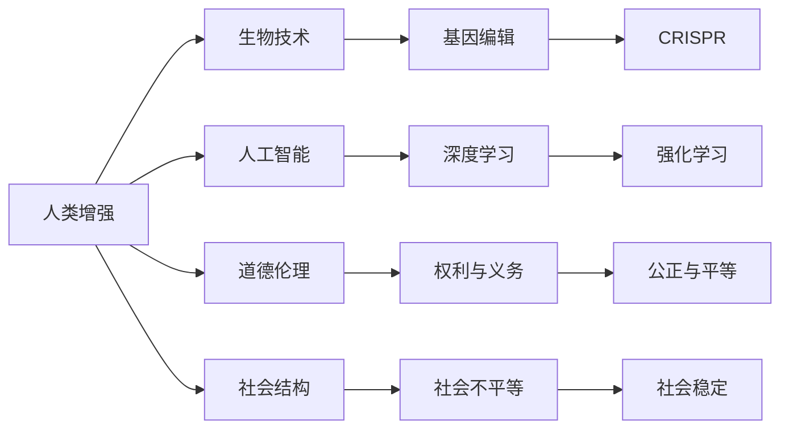

                 

## 1. 背景介绍

在人工智能(AI)的迅猛发展下，人类增强技术的边界不断被拓展，从算法优化到生物干预，众多前沿技术正逐步应用于人类能力的提升。这些技术不仅改变了我们的生活和工作方式，也对伦理、道德和社会结构提出了新的挑战。本文将探讨在AI时代下，身体增强技术的发展前景和道德考量，并提出未来发展策略，以期为人类增强技术的健康发展提供有益的参考。

## 2. 核心概念与联系

### 2.1 核心概念概述

为更好地理解人类增强技术的原理和应用，本节将介绍几个关键概念：

- **人类增强（Human Enhancement）**：指通过技术手段提升人类的生理和心理能力，包括物理能力、认知能力、情感智能等方面。
- **生物技术（Biotechnology）**：指应用于生物体的技术，包括基因编辑、细胞再生、生物传感等。
- **人工智能（Artificial Intelligence）**：指通过算法和模型，使计算机系统具备人类智能水平的领域，如自然语言处理、计算机视觉等。
- **道德伦理（Ethics and Morality）**：涉及人类行为的道德规范和价值判断，是人类增强技术发展中必须考虑的重要因素。
- **社会结构（Social Structure）**：指社会中个体和组织之间的互动关系，以及这些关系如何影响社会的稳定和进步。

这些概念之间的联系可以通过以下Mermaid流程图来展示：



这个流程图展示了一系列核心概念及其之间的关系：

1. 人类增强技术通过生物技术和人工智能的辅助，实现个体能力的提升。
2. 基因编辑和深度学习等生物技术手段，为人类增强提供了技术基础。
3. 道德伦理是指导人类增强技术发展的核心原则，确保技术应用的公正性和合理性。
4. 社会结构变化是技术应用的重要背景，需要在应用中考虑其带来的社会影响。

## 3. 核心算法原理 & 具体操作步骤

### 3.1 算法原理概述

人类增强技术的核心算法原理通常基于生物技术和人工智能，具体包括以下几个步骤：

1. **数据收集与预处理**：通过生物传感器、健康监测设备等收集个体的生理数据，如心率、血压、血糖等。
2. **模型训练与优化**：使用深度学习等算法，训练智能模型预测健康状态，识别疾病风险，优化药物和治疗方法。
3. **生物干预与反馈**：根据模型的预测结果，采用基因编辑、细胞再生等技术，对个体进行生物干预，同时收集反馈数据，不断优化模型。

### 3.2 算法步骤详解

**Step 1: 数据收集与预处理**

首先，需要构建一套完整的数据收集系统，使用生物传感器、健康监测设备等手段，实时收集用户的生理数据。常用的设备包括：

- **可穿戴设备**：如智能手表、健康监测带等，实时监测心率、血压、血糖等指标。
- **家用监测设备**：如血压计、血糖仪等，定期监测健康状况。
- **移动应用**：通过手机应用记录饮食、运动、睡眠质量等生活习惯数据。

数据收集后，需要进行预处理，包括数据清洗、去噪、归一化等，以保证数据的质量和一致性。预处理流程如下：

1. **数据清洗**：去除异常值和噪声数据，确保数据的准确性。
2. **数据归一化**：将不同量级的数据统一到0-1或-1到1的范围内，方便后续模型处理。
3. **特征提取**：从原始数据中提取关键特征，如心率变化趋势、血糖波动等。

**Step 2: 模型训练与优化**

在数据预处理后，可以开始训练智能模型。常用的模型包括深度神经网络、随机森林、支持向量机等。以下是使用深度学习模型训练的步骤：

1. **选择模型架构**：根据任务特点选择合适的神经网络结构，如卷积神经网络（CNN）、循环神经网络（RNN）、长短期记忆网络（LSTM）等。
2. **数据划分**：将数据集分为训练集、验证集和测试集，以评估模型的性能。
3. **训练模型**：使用训练集数据，通过反向传播算法不断调整模型参数，优化模型性能。
4. **验证与调优**：在验证集上测试模型性能，根据结果调整超参数和模型结构，进一步优化模型。
5. **测试与评估**：在测试集上评估模型性能，确保模型泛化能力强，适用于新数据。

**Step 3: 生物干预与反馈**

模型训练完成后，可以使用其预测结果指导生物干预。例如，对于心血管疾病的预测，可以通过基因编辑技术修正遗传基因，减少疾病风险。具体步骤如下：

1. **基因编辑**：利用CRISPR-Cas9等技术，对基因序列进行精确编辑，修复突变基因。
2. **细胞再生**：通过干细胞培养和诱导技术，生成新的健康细胞，修复受损组织。
3. **药物干预**：根据模型预测结果，定制个性化药物方案，优化药物效果。
4. **反馈收集**：收集干预后的生理数据，评估干预效果，持续优化模型和干预方案。

### 3.3 算法优缺点

人类增强技术的算法具有以下优点：

1. **精准化**：通过智能模型精准预测健康风险，实现个性化干预。
2. **普适性**：适用于多种健康问题和干预手段，适应性强。
3. **效率高**：自动化处理大量数据，减少人工干预，提高效率。

同时，算法也存在一些缺点：

1. **数据依赖性高**：模型的性能依赖于数据的质量和数量，高质量数据获取成本高。
2. **模型泛化能力**：模型的泛化能力受限于数据分布和样本量，难以处理极端情况。
3. **伦理争议**：基因编辑等技术存在伦理争议，难以获得广泛认可。
4. **安全性**：模型和干预技术可能存在潜在风险，需慎重考虑。

### 3.4 算法应用领域

人类增强技术的应用领域广泛，涉及医疗健康、体育运动、教育培训等多个方面。以下是一些典型的应用场景：

1. **医疗健康**：通过基因编辑和药物干预，治疗遗传性疾病、癌症等重大疾病，提高生存率和生活质量。
2. **体育运动**：利用基因编辑和细胞再生技术，增强运动员的体能和恢复能力，提升运动表现。
3. **教育培训**：通过脑机接口和认知增强技术，提升学生的学习能力、记忆力和注意力，优化教育效果。
4. **娱乐与文化**：通过增强现实和虚拟现实技术，创造沉浸式体验，丰富娱乐和文化消费方式。

## 4. 数学模型和公式 & 详细讲解

### 4.1 数学模型构建

在本节中，我们将使用数学语言对人类增强技术的核心算法进行详细阐述。

记生物数据为 $X \in \mathbb{R}^n$，模型参数为 $\theta$，输出结果为 $Y \in \mathbb{R}^m$。假设模型为 $f_\theta: X \rightarrow Y$，其损失函数为 $\mathcal{L}(\theta) = \frac{1}{N} \sum_{i=1}^N \ell(y_i, f_\theta(x_i))$，其中 $\ell$ 为损失函数，如均方误差、交叉熵等。

### 4.2 公式推导过程

以深度学习模型为例，假设模型结构为 $f_\theta = \text{sigmoid}(W^TX + b)$，其中 $W$ 和 $b$ 为模型参数，$X$ 为输入数据。

对于二分类任务，使用交叉熵损失函数 $\ell = -(y\log f_\theta(x) + (1-y)\log (1-f_\theta(x)))$。训练过程中，通过梯度下降算法更新模型参数，其更新公式为：

$$
\theta \leftarrow \theta - \eta \nabla_{\theta} \mathcal{L}(\theta)
$$

其中 $\eta$ 为学习率，$\nabla_{\theta} \mathcal{L}(\theta)$ 为损失函数对模型参数的梯度，可通过反向传播算法高效计算。

### 4.3 案例分析与讲解

以基因编辑为例，假设模型预测基因突变风险为 $P$，基因编辑后的突变风险为 $P'$，模型损失函数为 $\mathcal{L} = (P - P')^2$。通过优化该损失函数，可以指导基因编辑操作，减少突变风险。

假设 $P = \text{sigmoid}(W^TG + b)$，其中 $G$ 为基因数据，$W$ 和 $b$ 为模型参数。通过迭代优化 $\mathcal{L}$，可以找到最优的 $W$ 和 $b$，使得 $P$ 和 $P'$ 尽可能接近，从而实现精确的基因编辑。

## 5. 项目实践：代码实例和详细解释说明

### 5.1 开发环境搭建

在进行人类增强技术开发前，我们需要准备好开发环境。以下是使用Python进行TensorFlow开发的环境配置流程：

1. 安装Anaconda：从官网下载并安装Anaconda，用于创建独立的Python环境。

2. 创建并激活虚拟环境：
```bash
conda create -n tf-env python=3.8 
conda activate tf-env
```

3. 安装TensorFlow：根据CUDA版本，从官网获取对应的安装命令。例如：
```bash
conda install tensorflow -c tf -c conda-forge
```

4. 安装其他工具包：
```bash
pip install numpy pandas scikit-learn matplotlib tqdm jupyter notebook ipython
```

完成上述步骤后，即可在`tf-env`环境中开始人类增强技术的开发。

### 5.2 源代码详细实现

下面我们以基因编辑为例，给出使用TensorFlow对深度学习模型进行基因编辑预测的Python代码实现。

首先，定义基因数据和标签：

```python
import tensorflow as tf
import numpy as np

# 假定基因数据
X_train = np.random.randn(100, 10)
Y_train = np.random.randint(2, size=(100, 1))

# 定义模型输入和输出
X = tf.keras.Input(shape=(10,))
Y = tf.keras.layers.Dense(1, activation='sigmoid')(X)
model = tf.keras.Model(inputs=X, outputs=Y)
```

接着，定义模型损失函数和优化器：

```python
# 定义交叉熵损失函数
loss_fn = tf.keras.losses.BinaryCrossentropy()

# 定义Adam优化器
optimizer = tf.keras.optimizers.Adam(learning_rate=0.001)
```

然后，定义训练和评估函数：

```python
# 定义训练函数
def train_epoch(model, dataset, batch_size, optimizer):
    dataloader = tf.data.Dataset.from_tensor_slices((dataset['X'], dataset['Y']))
    dataloader = dataloader.batch(batch_size).shuffle(100).repeat()
    model.compile(optimizer=optimizer, loss=loss_fn)
    model.fit(dataloader, epochs=10)

# 定义评估函数
def evaluate(model, dataset, batch_size):
    dataloader = tf.data.Dataset.from_tensor_slices((dataset['X'], dataset['Y']))
    dataloader = dataloader.batch(batch_size).shuffle(100).repeat()
    model.evaluate(dataloader)
```

最后，启动训练流程并在测试集上评估：

```python
# 定义训练数据
dataset = {'X': X_train, 'Y': Y_train}

# 训练模型
train_epoch(model, dataset, batch_size=32, optimizer=optimizer)

# 在测试集上评估模型
evaluate(model, dataset, batch_size=32)
```

以上就是使用TensorFlow对基因编辑预测进行完整代码实现。可以看到，TensorFlow提供了高度抽象的API，使得模型的构建和训练变得简洁高效。

### 5.3 代码解读与分析

让我们再详细解读一下关键代码的实现细节：

**基因数据定义**：
- `X_train` 和 `Y_train` 分别表示基因数据和标签，均为NumPy数组。

**模型定义**：
- `tf.keras.Input` 用于定义模型输入，`tf.keras.layers.Dense` 用于定义隐藏层，`activation='sigmoid'` 表示使用sigmoid激活函数。

**损失函数和优化器定义**：
- `tf.keras.losses.BinaryCrossentropy` 用于定义二分类交叉熵损失函数。
- `tf.keras.optimizers.Adam` 用于定义Adam优化器，学习率为0.001。

**训练函数定义**：
- `tf.data.Dataset.from_tensor_slices` 用于创建数据集，`batch` 和 `shuffle` 用于数据批次和随机打乱，`repeat` 用于数据重复。
- `model.compile` 用于编译模型，`optimizer` 和 `loss` 用于指定优化器和损失函数。
- `model.fit` 用于执行模型训练，`epochs` 指定训练轮数。

**评估函数定义**：
- `evaluate` 函数用于在测试集上评估模型性能，`dataloader` 用于创建数据集，`batch` 和 `shuffle` 与训练函数类似。

**训练流程**：
- `dataset` 定义训练数据。
- `train_epoch` 函数用于执行模型训练，`model` 表示模型，`batch_size` 表示批次大小，`optimizer` 表示优化器。
- 训练函数调用`model.fit`执行训练，`epochs` 表示训练轮数。
- `evaluate` 函数用于在测试集上评估模型性能。

可以看到，TensorFlow提供了丰富的工具和接口，使得模型的构建和训练变得简单快捷。开发者可以专注于算法逻辑，而不必过多关注底层实现细节。

## 6. 实际应用场景

### 6.1 健康医疗

人类增强技术在健康医疗领域有着广阔的应用前景，能够显著提升疾病预防和治疗的效果。

在**疾病预防**方面，基因编辑和深度学习等技术可以用于提前发现基因突变，预测疾病风险，帮助人们提前进行预防和治疗。例如，通过基因编辑技术修正突变基因，减少癌症等重大疾病的发生率。

在**疾病治疗**方面，深度学习可以用于个性化药物研发，通过分析病患的生理数据和遗传信息，定制最优的药物方案，提高治疗效果。例如，利用深度学习模型预测药物反应，指导医生制定个性化用药计划。

### 6.2 体育运动

体育运动是人类增强技术的另一个重要应用领域，能够显著提升运动员的体能和恢复能力。

在**体能提升**方面，深度学习可以用于分析运动员的训练数据，发现最优训练方案，优化训练计划。例如，通过分析运动员的心率、速度、力量等数据，生成个性化的训练计划，提高训练效果。

在**恢复能力提升**方面，基因编辑和细胞再生技术可以用于加速运动员的康复过程。例如，利用基因编辑技术修复运动损伤，加速恢复，缩短康复周期。

### 6.3 教育培训

教育培训是人类增强技术的又一重要应用领域，能够显著提升学生的学习效果和教师的教学效果。

在**学习能力提升**方面，深度学习可以用于分析学生的学习数据，发现学习规律，提供个性化学习建议。例如，通过分析学生的作业、考试成绩和学习时间等数据，生成个性化学习方案，提升学习效果。

在**教学效果提升**方面，基因编辑和细胞再生技术可以用于提升教师的教学能力。例如，通过基因编辑技术修复教师的身体损伤，提高其教学能力，提升教学效果。

## 7. 工具和资源推荐

### 7.1 学习资源推荐

为了帮助开发者系统掌握人类增强技术的理论基础和实践技巧，这里推荐一些优质的学习资源：

1. **《人工智能伦理与法律》**：全面介绍了人工智能伦理和法律的基础知识和前沿案例，帮助开发者了解技术应用中的伦理和法律问题。
2. **Coursera《人工智能伦理》课程**：由斯坦福大学教授主讲，深入讲解人工智能伦理问题，包括隐私保护、公平性、安全性等。
3. **Khan Academy《基因编辑》课程**：通过丰富的实验和案例，帮助理解基因编辑技术的原理和应用。
4. **DeepLearning.ai《深度学习专项课程》**：由Google机器学习专家主讲，全面讲解深度学习理论和实践，涵盖多种深度学习模型和应用。
5. **IEEE《人工智能伦理指南》**：由IEEE组织编写的伦理指南，涵盖了人工智能技术应用的各个方面，提供了伦理决策的参考框架。

通过对这些资源的学习实践，相信你一定能够快速掌握人类增强技术的精髓，并用于解决实际的伦理和应用问题。

### 7.2 开发工具推荐

高效的开发离不开优秀的工具支持。以下是几款用于人类增强技术开发的常用工具：

1. **TensorFlow**：由Google主导开发的深度学习框架，生产部署方便，适合大规模工程应用。
2. **PyTorch**：基于Python的开源深度学习框架，灵活动态的计算图，适合快速迭代研究。
3. **Jupyter Notebook**：交互式的代码编辑器，支持多种编程语言和库，便于快速开发和共享代码。
4. **Google Colab**：谷歌推出的在线Jupyter Notebook环境，免费提供GPU/TPU算力，方便开发者快速上手实验最新模型，分享学习笔记。
5. **ModelScope**：国内领先的模型开源社区，提供丰富的预训练模型和工具，支持模型的微调和应用。

合理利用这些工具，可以显著提升人类增强技术的开发效率，加快创新迭代的步伐。

### 7.3 相关论文推荐

人类增强技术的发展源于学界的持续研究。以下是几篇奠基性的相关论文，推荐阅读：

1. **《人工智能伦理与法律》**：系统介绍了人工智能伦理和法律的理论基础和前沿实践，提供了伦理和法律框架的参考。
2. **《人类增强技术伦理研究》**：讨论了人类增强技术的伦理问题，包括技术风险、社会影响和伦理边界等。
3. **《基因编辑技术的伦理考量》**：探讨了基因编辑技术的伦理问题，包括技术风险、社会影响和伦理边界等。
4. **《深度学习在人类增强中的应用》**：讨论了深度学习在人类增强技术中的广泛应用，包括疾病预测、体能提升、教育培训等。
5. **《人工智能伦理指南》**：由IEEE组织编写的伦理指南，涵盖了人工智能技术应用的各个方面，提供了伦理决策的参考框架。

这些论文代表了大语言模型微调技术的发展脉络。通过学习这些前沿成果，可以帮助研究者把握学科前进方向，激发更多的创新灵感。

## 8. 总结：未来发展趋势与挑战

### 8.1 总结

本文对人类增强技术的发展前景和道德考量进行了全面系统的介绍。首先阐述了人类增强技术的定义和核心概念，明确了其在AI时代下的重要地位。其次，从原理到实践，详细讲解了人类增强技术的核心算法，提供了完整的代码实例和详细解释。同时，本文还探讨了人类增强技术在多个领域的应用前景，展示了其广阔的潜力和广阔的创新空间。最后，本文精选了相关学习资源和工具，力求为读者提供全方位的技术指引。

通过本文的系统梳理，可以看到，人类增强技术在AI时代下具有广阔的发展前景，能够显著提升人类的生理和心理能力，带来深远的社会和经济影响。然而，技术发展也带来了新的伦理和道德挑战，需要在应用中慎重考虑，确保技术应用的公正性和合理性。

### 8.2 未来发展趋势

展望未来，人类增强技术将呈现以下几个发展趋势：

1. **技术融合**：人工智能和生物技术的深度融合，将推动人类增强技术的发展，提升技术精度和效率。
2. **普适性提升**：随着技术的发展，人类增强技术将逐渐从高成本的实验室走向普适化的应用，惠及更多人群。
3. **伦理规范**：随着技术应用的广泛，伦理规范将逐渐完善，形成系统的伦理框架，指导技术应用。
4. **法律保障**：政府将出台相关的法律法规，保障技术应用的公平性和安全性，防止技术滥用。
5. **社会影响**：人类增强技术将带来深远的社会影响，需要多方协作，共同推进技术的健康发展。

以上趋势凸显了人类增强技术的广阔前景。这些方向的探索发展，必将进一步提升人类增强技术的性能和应用范围，为人类智能的进步带来深远影响。

### 8.3 面临的挑战

尽管人类增强技术已经取得了显著成就，但在迈向更加智能化、普适化应用的过程中，它仍面临着诸多挑战：

1. **技术风险**：基因编辑等技术可能带来不可逆的风险，如基因变异、遗传疾病等，需谨慎应用。
2. **伦理争议**：人类增强技术可能带来伦理争议，如增强过度、基因歧视等，需慎重考虑。
3. **社会不平等**：技术应用的普适性不足，可能加剧社会不平等，需公平分配技术资源。
4. **法律问题**：技术应用的法律框架不完善，可能带来法律风险，需制定相关法律法规。
5. **公共安全**：技术应用的公共安全问题，如数据隐私、信息泄露等，需加强防护措施。

这些挑战需要各方共同努力，制定合理的技术标准和伦理规范，确保技术的健康发展。

### 8.4 研究展望

面对人类增强技术面临的挑战，未来的研究需要在以下几个方面寻求新的突破：

1. **技术风险评估**：研究基因编辑等技术的风险评估方法，制定安全应用标准。
2. **伦理规范制定**：制定系统的伦理规范，指导技术应用的伦理边界。
3. **公平性提升**：提升技术的普适性，确保技术应用公平性，防止技术滥用。
4. **法律保障完善**：完善相关法律法规，保障技术应用的公平性和安全性。
5. **公共安全防护**：加强数据隐私和安全防护，防止信息泄露和滥用。

这些研究方向的探索，必将引领人类增强技术迈向更高的台阶，为人类智能的进步带来深远影响。面向未来，人类增强技术还需要与其他人工智能技术进行更深入的融合，共同推动智能社会的建设。

## 9. 附录：常见问题与解答

**Q1：人类增强技术是否适用于所有人群？**

A: 人类增强技术虽然具有广泛的应用前景，但并非适用于所有人群。例如，对于遗传疾病或免疫系统缺陷的人群，基因编辑技术可能带来风险。因此，在应用前需要进行严格的风险评估和伦理审查，确保技术应用的合理性和安全性。

**Q2：人类增强技术是否会导致伦理争议？**

A: 人类增强技术可能带来伦理争议，如基因编辑带来的基因歧视、增强过度等问题。因此，在技术应用中需要慎重考虑伦理问题，制定合理的伦理规范和法律框架，确保技术应用的公正性和合理性。

**Q3：人类增强技术是否会对社会产生负面影响？**

A: 人类增强技术可能带来社会不平等问题，如技术应用的普适性不足，加剧社会不平等。因此，在技术应用中需要公平分配技术资源，确保技术应用的公平性和普适性。

**Q4：人类增强技术是否会带来技术风险？**

A: 人类增强技术可能带来技术风险，如基因编辑技术带来的基因变异、遗传疾病等。因此，在技术应用中需要进行严格的风险评估和安全测试，确保技术应用的安全性。

**Q5：人类增强技术是否会带来法律问题？**

A: 人类增强技术可能带来法律问题，如基因编辑技术带来的基因歧视、技术滥用等。因此，在技术应用中需要制定相关的法律法规，保障技术应用的公平性和安全性。

这些问题的探讨，为人类增强技术的健康发展提供了有益的参考，帮助各方在技术应用中慎重考虑伦理、法律和风险问题，确保技术应用的合理性和安全性。

---

作者：禅与计算机程序设计艺术 / Zen and the Art of Computer Programming

