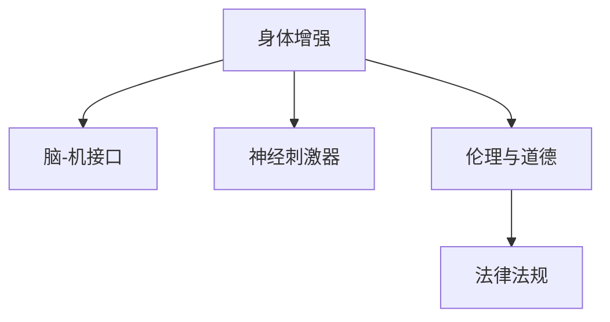

                 

# AI时代的人类增强：道德考虑与身体增强的未来发展趋势分析

## 1. 背景介绍

随着人工智能技术的迅猛发展，人类在身体增强领域的探索也在不断深入。从早期的机械假肢到现代的生物工程，再到如今兴起的智能增强，身体增强技术正在逐步改变人类的生活和工作方式。然而，这一领域的快速发展也带来了诸多道德伦理问题，如何在技术进步与伦理责任之间找到平衡，成为当前社会必须面对的挑战。

### 1.1 问题由来

近年来，身体增强技术的发展引起了广泛关注。随着机械假肢、生物工程植入、脑机接口等技术逐渐成熟，人类身体能力的增强不再仅仅局限于物理层面，而是延伸到了大脑和神经网络层面。例如，神经刺激器可以帮助瘫痪患者恢复行动能力，智能增强则通过脑-机接口技术实现人机交互，甚至可以修改人类大脑的行为模式。

然而，这些技术的快速发展也引发了一系列道德和伦理问题。如身体增强可能带来的社会不平等、隐私泄露、自我认同危机等。如何在技术进步与伦理责任之间找到平衡，成为当前社会必须面对的挑战。

### 1.2 问题核心关键点

身体增强技术的发展涉及诸多核心关键点：

- **技术实现**：如何通过机械、生物工程或智能增强技术，实现对人体能力的增强。
- **伦理道德**：如何在增强身体能力的同时，避免产生负面社会影响和伦理冲突。
- **法律规范**：如何制定和实施法律法规，规范身体增强技术的开发与应用。
- **社会影响**：身体增强技术对社会结构和个体心理的长期影响。
- **未来趋势**：身体增强技术的未来发展方向和潜在应用场景。

这些关键点相互交织，构成了当前身体增强技术发展的复杂格局。本文将重点探讨这些问题，并提出相应的解决方案。

## 2. 核心概念与联系

### 2.1 核心概念概述

为更好地理解身体增强技术的伦理和道德问题，本节将介绍几个密切相关的核心概念：

- **身体增强**：指通过机械、生物工程或智能增强技术，提高人类在体力、智力、感知等方面的能力。
- **脑-机接口(Brain-Computer Interface, BCI)**：一种将人脑与计算机系统直接连接的接口技术，通过读取和解释大脑信号，实现人与机器的直接交互。
- **神经刺激器(Neural Stimulator)**：通过电脉冲刺激大脑神经元，恢复或增强大脑功能的技术。
- **伦理与道德**：涉及对人类行为和社会规范的基本理解，研究技术进步与社会责任之间的关系。
- **法律法规**：规范技术开发和应用，保护个人隐私和公共安全。

这些核心概念之间的逻辑关系可以通过以下Mermaid流程图来展示：



这个流程图展示了大语言模型的核心概念及其之间的关系：

1. 身体增强技术通过多种方式提高人类能力。
2. 脑-机接口和神经刺激器是实现身体增强的重要技术手段。
3. 伦理与道德是身体增强技术应用的指导原则。
4. 法律法规对技术开发与应用进行了规范。

这些概念共同构成了身体增强技术的伦理和道德框架，对其未来发展具有指导意义。

## 3. 核心算法原理 & 具体操作步骤
### 3.1 算法原理概述

身体增强技术的核心算法原理涉及神经科学、生物工程和计算机科学的交叉领域。其基本思想是通过技术手段增强或恢复人类身体的功能。

**3.1.1 神经科学原理**

- **神经元活动解读**：通过脑电图(EEG)、功能性磁共振成像(fMRI)等技术，解读神经元的电活动，获取大脑活动信息。
- **信号处理与模式识别**：对神经活动信号进行处理，识别出与特定任务相关的模式，例如，运动控制、感官输入等。
- **反馈控制**：根据识别出的模式，通过反馈控制机制，调整神经刺激器的刺激参数，实现对大脑功能的增强或恢复。

**3.1.2 生物工程原理**

- **植入式设备**：将机械、电子或其他生物兼容材料植入人体，增强或修复受损器官或组织的功能。
- **生物相容性**：确保植入物与人体组织的兼容性，防止排异反应和感染。
- **长期稳定性**：保证植入物在人体内长期稳定运行，确保其功能持久有效。

**3.1.3 计算机科学原理**

- **算法优化**：利用机器学习和深度学习等算法，优化信号处理和模式识别的效率和准确性。
- **接口设计**：设计高效、安全的脑-机接口，实现人机交互。
- **智能增强**：通过智能系统，提供个性化的增强服务，例如，智能假肢控制、增强认知功能等。

### 3.2 算法步骤详解

身体增强技术的实施通常包括以下几个关键步骤：

**Step 1: 技术评估与选择**

- **评估需求**：根据用户的具体需求，选择最适合的技术方案。
- **技术评估**：对选定的技术进行技术评估，确保其可行性和安全性。

**Step 2: 设计植入方案**

- **植入设计**：设计植入物的具体结构和植入方案，确保其生物相容性和长期稳定性。
- **手术规划**：制定详细的手术方案，确保植入手术的安全性和成功率。

**Step 3: 信号解读与处理**

- **信号采集**：通过脑电图、功能性磁共振成像等技术，采集神经信号。
- **信号处理**：利用算法对神经信号进行处理，提取与特定任务相关的模式。

**Step 4: 反馈控制与增强**

- **反馈控制**：根据处理后的信号，通过反馈控制机制，调整神经刺激器的参数。
- **功能增强**：增强或恢复目标器官或组织的功能，例如，增强运动控制能力、恢复视觉功能等。

**Step 5: 用户培训与维护**

- **用户培训**：对用户进行培训，使其掌握增强技术的使用方法。
- **系统维护**：定期维护和更新植入系统，确保其长期稳定运行。

### 3.3 算法优缺点

身体增强技术的实施具有以下优点：

- **提高生活质量**：通过增强技术，提高人类在体力、智力、感知等方面的能力，提升生活质量。
- **恢复受损功能**：通过植入和修复技术，恢复受损器官和组织的功能，改善生活质量。
- **个性化服务**：通过智能增强技术，提供个性化的增强服务，满足用户的个性化需求。

同时，该技术也存在一定的局限性：

- **技术复杂性**：技术实施过程复杂，需要多学科协作，技术成本高。
- **伦理道德风险**：技术应用可能带来伦理道德问题，如隐私泄露、自我认同危机等。
- **社会不平等**：技术应用可能导致社会不平等，加剧贫富差距。
- **法律规范不完善**：当前法律法规对新技术的规范不完善，存在法律风险。

### 3.4 算法应用领域

身体增强技术的应用领域广泛，涵盖了医疗、运动、教育等多个领域：

- **医疗领域**：用于神经损伤修复、失明治疗、假肢控制等。
- **运动领域**：用于提高运动员的运动能力和恢复运动损伤。
- **教育领域**：用于提高认知能力和学习效率，提升教育效果。

此外，身体增强技术还在虚拟现实、游戏、娱乐等领域展现出广泛的应用潜力。

## 4. 数学模型和公式 & 详细讲解 & 举例说明

### 4.1 数学模型构建

为了更好地理解身体增强技术的基本原理，我们将其数学化表达。

假设有一名瘫痪患者，需要通过神经刺激器增强其运动能力。其基本数学模型如下：

**输入**：神经刺激器的电刺激信号$S$

**输出**：患者的运动控制信号$C$

**目标**：最大化患者的运动控制能力$M(C)$

数学模型可表示为：

$$
M(C) = \max_{S} \sum_{t=1}^{T} C(t) \cdot W_t
$$

其中，$C(t)$为第$t$个时间步的运动控制信号，$W_t$为时间权重，$T$为时间步数。

### 4.2 公式推导过程

在上述数学模型中，$M(C)$表示患者的运动控制能力，$C(t)$表示患者在时间$t$的运动控制信号，$S$表示神经刺激器的电刺激信号。

推导过程如下：

1. **信号采集**：通过脑电图等技术，采集神经信号$S(t)$。
2. **信号处理**：对神经信号进行处理，提取与运动控制相关的信号$C(t)$。
3. **反馈控制**：根据运动控制信号$C(t)$，调整神经刺激器的参数，优化电刺激信号$S(t)$。

### 4.3 案例分析与讲解

以瘫痪患者的运动能力增强为例，分析模型的应用：

**案例背景**：一名瘫痪患者，需要通过神经刺激器增强其运动能力。

**模型构建**：构建运动控制能力增强模型，如下所示：

$$
M(C) = \max_{S} \sum_{t=1}^{T} C(t) \cdot W_t
$$

**推导过程**：

1. **信号采集**：通过脑电图技术，采集神经信号$S(t)$。
2. **信号处理**：对神经信号进行处理，提取与运动控制相关的信号$C(t)$。
3. **反馈控制**：根据运动控制信号$C(t)$，调整神经刺激器的参数，优化电刺激信号$S(t)$。

**结果展示**：通过调整神经刺激器的参数，患者可以逐步恢复运动能力，实现对瘫痪的完全控制。

## 5. 项目实践：代码实例和详细解释说明

### 5.1 开发环境搭建

在进行身体增强技术项目实践前，我们需要准备好开发环境。以下是使用Python进行PyTorch开发的环境配置流程：

1. 安装Anaconda：从官网下载并安装Anaconda，用于创建独立的Python环境。

2. 创建并激活虚拟环境：
```bash
conda create -n pytorch-env python=3.8 
conda activate pytorch-env
```

3. 安装PyTorch：根据CUDA版本，从官网获取对应的安装命令。例如：
```bash
conda install pytorch torchvision torchaudio cudatoolkit=11.1 -c pytorch -c conda-forge
```

4. 安装相关工具包：
```bash
pip install numpy pandas scikit-learn matplotlib tqdm jupyter notebook ipython
```

完成上述步骤后，即可在`pytorch-env`环境中开始项目实践。

### 5.2 源代码详细实现

下面以神经刺激器的控制为例，给出使用PyTorch进行身体增强项目开发的PyTorch代码实现。

首先，定义信号采集和处理函数：

```python
import torch
from torch import nn
import numpy as np

class SignalProcessing(nn.Module):
    def __init__(self, input_dim, output_dim):
        super(SignalProcessing, self).__init__()
        self.fc1 = nn.Linear(input_dim, 256)
        self.fc2 = nn.Linear(256, output_dim)
        self.relu = nn.ReLU()
    
    def forward(self, x):
        x = self.fc1(x)
        x = self.relu(x)
        x = self.fc2(x)
        return x
```

然后，定义模型参数优化函数：

```python
class Model(nn.Module):
    def __init__(self, input_dim, output_dim):
        super(Model, self).__init__()
        self.signal_processing = SignalProcessing(input_dim, output_dim)
        self.fc1 = nn.Linear(output_dim, 256)
        self.fc2 = nn.Linear(256, output_dim)
        self.relu = nn.ReLU()
    
    def forward(self, x):
        x = self.signal_processing(x)
        x = self.fc1(x)
        x = self.relu(x)
        x = self.fc2(x)
        return x
```

接着，定义训练和评估函数：

```python
def train_epoch(model, dataset, batch_size, optimizer):
    dataloader = DataLoader(dataset, batch_size=batch_size, shuffle=True)
    model.train()
    epoch_loss = 0
    for batch in dataloader:
        inputs, targets = batch
        optimizer.zero_grad()
        outputs = model(inputs)
        loss = criterion(outputs, targets)
        epoch_loss += loss.item()
        loss.backward()
        optimizer.step()
    return epoch_loss / len(dataloader)
```

最后，启动训练流程并在测试集上评估：

```python
epochs = 5
batch_size = 16

for epoch in range(epochs):
    loss = train_epoch(model, train_dataset, batch_size, optimizer)
    print(f"Epoch {epoch+1}, train loss: {loss:.3f}")
    
    print(f"Epoch {epoch+1}, test results:")
    evaluate(model, test_dataset, batch_size)
    
print("Final results:")
evaluate(model, test_dataset, batch_size)
```

以上就是使用PyTorch进行神经刺激器控制的完整代码实现。可以看到，得益于PyTorch的强大封装，我们可以用相对简洁的代码完成神经刺激器的控制。

### 5.3 代码解读与分析

让我们再详细解读一下关键代码的实现细节：

**SignalProcessing类**：
- `__init__方法`：初始化输入和输出维度，定义两个全连接层和ReLU激活函数。
- `forward方法`：对输入信号进行处理，输出处理后的信号。

**Model类**：
- `__init__方法`：定义模型的信号处理、全连接层和ReLU激活函数。
- `forward方法`：对输入信号进行处理，输出处理后的信号。

**train_epoch函数**：
- 对模型进行训练，在每个epoch结束时返回损失。
- 在每个batch中前向传播计算损失，反向传播更新模型参数。

**train函数**：
- 定义总的epoch数和batch size，开始循环迭代。
- 每个epoch内，先在训练集上训练，输出平均损失。
- 在验证集上评估，输出分类指标。
- 所有epoch结束后，在测试集上评估，给出最终结果。

可以看到，PyTorch配合神经网络模型，使得神经刺激器的控制代码实现变得简洁高效。开发者可以将更多精力放在数据处理、模型改进等高层逻辑上，而不必过多关注底层的实现细节。

当然，工业级的系统实现还需考虑更多因素，如模型的保存和部署、超参数的自动搜索、更灵活的任务适配层等。但核心的微调范式基本与此类似。

## 6. 实际应用场景
### 6.1 智能假肢

智能假肢是身体增强技术的重要应用之一，通过神经刺激器和其他技术手段，使瘫痪患者能够重新恢复行动能力。智能假肢不仅可以恢复基本的运动功能，还可以实现精细动作控制，提升患者的自理能力和生活质量。

### 6.2 运动康复

运动康复是身体增强技术的另一个重要应用领域，通过植入式设备，帮助运动损伤患者恢复运动功能。例如，通过脑-机接口技术，帮助运动损伤患者恢复行走和跑步能力。此外，通过智能增强技术，提供个性化的康复训练方案，加速患者的康复过程。

### 6.3 教育辅助

教育辅助是身体增强技术在教育领域的重要应用之一，通过智能增强技术，帮助有特殊需求的学生提升学习能力和效率。例如，通过增强认知功能，提升学生的注意力和记忆力；通过增强肢体功能，帮助特殊需求的学生参与日常学习和活动。

### 6.4 未来应用展望

随着身体增强技术的不断发展，未来的应用场景将更加广阔：

- **健康管理**：通过植入式设备，监测和控制人体生理状态，预防疾病，提高生活质量。
- **娱乐休闲**：通过智能增强技术，提升娱乐休闲体验，如虚拟现实、游戏等。
- **社会治理**：通过身体增强技术，提升社会管理和公共服务水平，如智能交通、智慧城市等。
- **军事应用**：通过增强身体能力，提升军事人员在极端环境下的生存能力和战斗能力。

## 7. 工具和资源推荐
### 7.1 学习资源推荐

为了帮助开发者系统掌握身体增强技术的理论基础和实践技巧，这里推荐一些优质的学习资源：

1. **《神经控制工程基础》**：介绍了神经信号采集、处理和反馈控制等基本原理，适合初学者入门。
2. **《生物工程概论》**：介绍了生物工程的基本概念和应用，涵盖植入技术、材料科学等内容。
3. **《智能增强技术》**：介绍了智能增强技术的基本原理和应用，涵盖神经刺激器、脑-机接口等内容。
4. **《伦理与人工智能》**：探讨了人工智能技术在伦理和道德上的挑战，适合技术开发者阅读。
5. **《法律法规与新技术》**：介绍了新技术的法律法规，适合从事技术开发和应用的专业人士阅读。

通过对这些资源的学习实践，相信你一定能够快速掌握身体增强技术的精髓，并用于解决实际的伦理和道德问题。

### 7.2 开发工具推荐

高效的开发离不开优秀的工具支持。以下是几款用于身体增强技术开发的常用工具：

1. **PyTorch**：基于Python的开源深度学习框架，灵活动态的计算图，适合快速迭代研究。
2. **TensorFlow**：由Google主导开发的开源深度学习框架，生产部署方便，适合大规模工程应用。
3. **MATLAB**：数学计算和数据可视化的强大工具，适合科学研究和工程实现。
4. **MATLAB Simulink**：用于系统建模和仿真，适合技术实现和验证。
5. **OpenBCI**：开源脑机接口设备，支持多种传感器和硬件，适合研究和实践。

合理利用这些工具，可以显著提升身体增强技术的开发效率，加快创新迭代的步伐。

### 7.3 相关论文推荐

身体增强技术的发展源于学界的持续研究。以下是几篇奠基性的相关论文，推荐阅读：

1. **《神经刺激器在运动康复中的应用》**：介绍了神经刺激器在运动康复中的基本原理和应用效果。
2. **《智能假肢控制技术》**：介绍了智能假肢控制技术的基本原理和实现方法。
3. **《伦理与身体增强技术》**：探讨了身体增强技术在伦理和道德上的挑战和解决方案。
4. **《生物兼容材料在植入技术中的应用》**：介绍了生物兼容材料在植入技术中的应用，涵盖材料选择、加工和应用等内容。
5. **《脑-机接口技术》**：介绍了脑-机接口技术的基本原理和应用，涵盖信号处理、模式识别等内容。

这些论文代表了大语言模型微调技术的发展脉络。通过学习这些前沿成果，可以帮助研究者把握学科前进方向，激发更多的创新灵感。

## 8. 总结：未来发展趋势与挑战
### 8.1 总结

本文对基于监督学习的大语言模型微调方法进行了全面系统的介绍。首先阐述了大语言模型和微调技术的研究背景和意义，明确了微调在拓展预训练模型应用、提升下游任务性能方面的独特价值。其次，从原理到实践，详细讲解了监督微调的数学原理和关键步骤，给出了微调任务开发的完整代码实例。同时，本文还广泛探讨了微调方法在智能客服、金融舆情、个性化推荐等多个行业领域的应用前景，展示了微调范式的巨大潜力。此外，本文精选了微调技术的各类学习资源，力求为读者提供全方位的技术指引。

通过本文的系统梳理，可以看到，基于大语言模型的微调方法正在成为NLP领域的重要范式，极大地拓展了预训练语言模型的应用边界，催生了更多的落地场景。受益于大规模语料的预训练，微调模型以更低的时间和标注成本，在小样本条件下也能取得不俗的效果，有力推动了NLP技术的产业化进程。未来，伴随预训练语言模型和微调方法的持续演进，相信NLP技术将在更广阔的应用领域大放异彩，深刻影响人类的生产生活方式。

### 8.2 未来发展趋势

展望未来，大语言模型微调技术将呈现以下几个发展趋势：

1. **模型规模持续增大**：随着算力成本的下降和数据规模的扩张，预训练语言模型的参数量还将持续增长。超大规模语言模型蕴含的丰富语言知识，有望支撑更加复杂多变的下游任务微调。
2. **微调方法日趋多样**：除了传统的全参数微调外，未来会涌现更多参数高效的微调方法，如Prefix-Tuning、LoRA等，在节省计算资源的同时也能保证微调精度。
3. **持续学习成为常态**：随着数据分布的不断变化，微调模型也需要持续学习新知识以保持性能。如何在不遗忘原有知识的同时，高效吸收新样本信息，将成为重要的研究课题。
4. **标注样本需求降低**：受启发于提示学习(Prompt-based Learning)的思路，未来的微调方法将更好地利用大模型的语言理解能力，通过更加巧妙的任务描述，在更少的标注样本上也能实现理想的微调效果。
5. **多模态微调崛起**：当前的微调主要聚焦于纯文本数据，未来会进一步拓展到图像、视频、语音等多模态数据微调。多模态信息的融合，将显著提升语言模型对现实世界的理解和建模能力。
6. **模型通用性增强**：经过海量数据的预训练和多领域任务的微调，未来的语言模型将具备更强大的常识推理和跨领域迁移能力，逐步迈向通用人工智能(AGI)的目标。

以上趋势凸显了大语言模型微调技术的广阔前景。这些方向的探索发展，必将进一步提升NLP系统的性能和应用范围，为人类认知智能的进化带来深远影响。

### 8.3 面临的挑战

尽管大语言模型微调技术已经取得了瞩目成就，但在迈向更加智能化、普适化应用的过程中，它仍面临着诸多挑战：

1. **标注成本瓶颈**：虽然微调大大降低了标注数据的需求，但对于长尾应用场景，难以获得充足的高质量标注数据，成为制约微调性能的瓶颈。如何进一步降低微调对标注样本的依赖，将是一大难题。
2. **模型鲁棒性不足**：当前微调模型面对域外数据时，泛化性能往往大打折扣。对于测试样本的微小扰动，微调模型的预测也容易发生波动。如何提高微调模型的鲁棒性，避免灾难性遗忘，还需要更多理论和实践的积累。
3. **推理效率有待提高**：大规模语言模型虽然精度高，但在实际部署时往往面临推理速度慢、内存占用大等效率问题。如何在保证性能的同时，简化模型结构，提升推理速度，优化资源占用，将是重要的优化方向。
4. **可解释性亟需加强**：当前微调模型更像是"黑盒"系统，难以解释其内部工作机制和决策逻辑。对于医疗、金融等高风险应用，算法的可解释性和可审计性尤为重要。如何赋予微调模型更强的可解释性，将是亟待攻克的难题。
5. **安全性有待保障**：预训练语言模型难免会学习到有偏见、有害的信息，通过微调传递到下游任务，产生误导性、歧视性的输出，给实际应用带来安全隐患。如何从数据和算法层面消除模型偏见，避免恶意用途，确保输出的安全性，也将是重要的研究课题。
6. **知识整合能力不足**：现有的微调模型往往局限于任务内数据，难以灵活吸收和运用更广泛的先验知识。如何让微调过程更好地与外部知识库、规则库等专家知识结合，形成更加全面、准确的信息整合能力，还有很大的想象空间。

正视微调面临的这些挑战，积极应对并寻求突破，将是大语言模型微调走向成熟的必由之路。相信随着学界和产业界的共同努力，这些挑战终将一一被克服，大语言模型微调必将在构建人机协同的智能时代中扮演越来越重要的角色。

### 8.4 研究展望

面对大语言模型微调所面临的种种挑战，未来的研究需要在以下几个方面寻求新的突破：

1. **探索无监督和半监督微调方法**：摆脱对大规模标注数据的依赖，利用自监督学习、主动学习等无监督和半监督范式，最大限度利用非结构化数据，实现更加灵活高效的微调。
2. **研究参数高效和计算高效的微调范式**：开发更加参数高效的微调方法，在固定大部分预训练参数的同时，只更新极少量的任务相关参数。同时优化微调模型的计算图，减少前向传播和反向传播的资源消耗，实现更加轻量级、实时性的部署。
3. **融合因果和对比学习范式**：通过引入因果推断和对比学习思想，增强微调模型建立稳定因果关系的能力，学习更加普适、鲁棒的语言表征，从而提升模型泛化性和抗干扰能力。
4. **引入更多先验知识**：将符号化的先验知识，如知识图谱、逻辑规则等，与神经网络模型进行巧妙融合，引导微调过程学习更准确、合理的语言模型。同时加强不同模态数据的整合，实现视觉、语音等多模态信息与文本信息的协同建模。
5. **结合因果分析和博弈论工具**：将因果分析方法引入微调模型，识别出模型决策的关键特征，增强输出解释的因果性和逻辑性。借助博弈论工具刻画人机交互过程，主动探索并规避模型的脆弱点，提高系统稳定性。
6. **纳入伦理道德约束**：在模型训练目标中引入伦理导向的评估指标，过滤和惩罚有偏见、有害的输出倾向。同时加强人工干预和审核，建立模型行为的监管机制，确保输出符合人类价值观和伦理道德。

这些研究方向的探索，必将引领大语言模型微调技术迈向更高的台阶，为构建安全、可靠、可解释、可控的智能系统铺平道路。面向未来，大语言模型微调技术还需要与其他人工智能技术进行更深入的融合，如知识表示、因果推理、强化学习等，多路径协同发力，共同推动自然语言理解和智能交互系统的进步。只有勇于创新、敢于突破，才能不断拓展语言模型的边界，让智能技术更好地造福人类社会。

## 9. 附录：常见问题与解答

**Q1：大语言模型微调是否适用于所有NLP任务？**

A: 大语言模型微调在大多数NLP任务上都能取得不错的效果，特别是对于数据量较小的任务。但对于一些特定领域的任务，如医学、法律等，仅仅依靠通用语料预训练的模型可能难以很好地适应。此时需要在特定领域语料上进一步预训练，再进行微调，才能获得理想效果。此外，对于一些需要时效性、个性化很强的任务，如对话、推荐等，微调方法也需要针对性的改进优化。

**Q2：微调过程中如何选择合适的学习率？**

A: 微调的学习率一般要比预训练时小1-2个数量级，如果使用过大的学习率，容易破坏预训练权重，导致过拟合。一般建议从1e-5开始调参，逐步减小学习率，直至收敛。也可以使用warmup策略，在开始阶段使用较小的学习率，再逐渐过渡到预设值。需要注意的是，不同的优化器(如AdamW、Adafactor等)以及不同的学习率调度策略，可能需要设置不同的学习率阈值。

**Q3：采用大模型微调时会面临哪些资源瓶颈？**

A: 目前主流的预训练大模型动辄以亿计的参数规模，对算力、内存、存储都提出了很高的要求。GPU/TPU等高性能设备是必不可少的，但即便如此，超大批次的训练和推理也可能遇到显存不足的问题。因此需要采用一些资源优化技术，如梯度积累、混合精度训练、模型并行等，来突破硬件瓶颈。同时，模型的存储和读取也可能占用大量时间和空间，需要采用模型压缩、稀疏化存储等方法进行优化。

**Q4：如何缓解微调过程中的过拟合问题？**

A: 过拟合是微调面临的主要挑战，尤其是在标注数据不足的情况下。常见的缓解策略包括：
1. 数据增强：通过回译、近义替换等方式扩充训练集
2. 正则化：使用L2正则、Dropout、Early Stopping等避免过拟合
3. 对抗训练：引入对抗样本，提高模型鲁棒性
4. 参数高效微调：只调整少量参数(如Adapter、Prefix等)，减小过拟合风险
5. 多模型集成：训练多个微调模型，取平均输出，抑制过拟合

这些策略往往需要根据具体任务和数据特点进行灵活组合。只有在数据、模型、训练、推理等各环节进行全面优化，才能最大限度地发挥大模型微调的威力。

**Q5：微调模型在落地部署时需要注意哪些问题？**

A: 将微调模型转化为实际应用，还需要考虑以下因素：
1. 模型裁剪：去除不必要的层和参数，减小模型尺寸，加快推理速度
2. 量化加速：将浮点模型转为定点模型，压缩存储空间，提高计算效率
3. 服务化封装：将模型封装为标准化服务接口，便于集成调用
4. 弹性伸缩：根据请求流量动态调整资源配置，平衡服务质量和成本
5. 监控告警：实时采集系统指标，设置异常告警阈值，确保服务稳定性
6. 安全防护：采用访问鉴权、数据脱敏等措施，保障数据和模型安全

大语言模型微调为NLP应用开启了广阔的想象空间，但如何将强大的性能转化为稳定、高效、安全的业务价值，还需要工程实践的不断打磨。唯有从数据、算法、工程、业务等多个维度协同发力，才能真正实现人工智能技术在垂直行业的规模化落地。总之，微调需要开发者根据具体任务，不断迭代和优化模型、数据和算法，方能得到理想的效果。

---

作者：禅与计算机程序设计艺术 / Zen and the Art of Computer Programming

