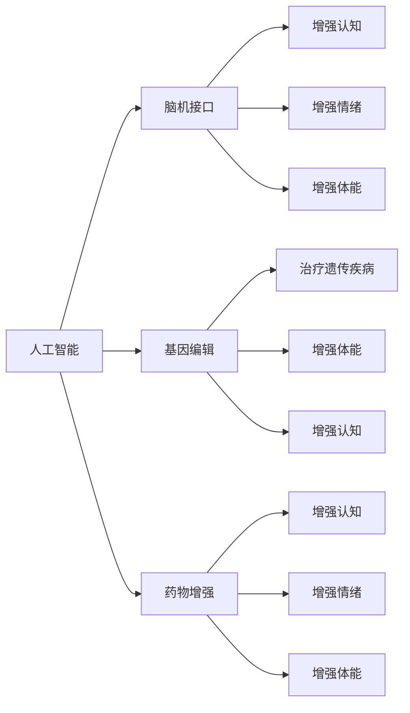

                 

# AI时代的人类增强：道德考虑与身体增强的未来挑战与机遇

> 关键词：人类增强, 人工智能, 道德, 身体增强, 脑机接口, 未来挑战, 机遇, 技术伦理

## 1. 背景介绍

随着人工智能技术的飞速发展，AI与人类的关系日益密切，人类增强（Human Augmentation）成为了一个新的热门话题。人类增强利用人工智能技术，通过脑机接口、基因编辑、药物等手段，增强人类自身能力，提升生活质量。然而，这种增强并非总是被视作积极行为，其背后的道德伦理问题，以及对社会结构的潜在影响，值得深思。

### 1.1 人类增强的概念与发展

人类增强可以理解为通过科技手段提升人类认知、体能、感觉等方面的能力，包括但不限于记忆增强、情绪管理、认知能力提升、感官增强等。早期的人工智能发展，主要以机器自动化为代表，而随着深度学习、自然语言处理等技术的进步，人类增强成为可能。脑机接口、基因编辑、药物等技术的突破，让人类增强在医疗、教育、娱乐等多个领域展现出巨大潜力。

### 1.2 人类增强的现状与问题

目前，人类增强技术已经得到了广泛应用，如睡眠监测、心理压力管理、认知训练等。但同时也面临诸多问题，如技术可行性、安全性、隐私保护等。此外，人类增强带来的伦理道德问题，包括基因编辑的道德底线、增强技术的应用范围、对人类身份的影响等，成为公众和社会关注的热点。

## 2. 核心概念与联系

### 2.1 核心概念概述

要理解人类增强的道德伦理问题，需要首先理解以下几个核心概念：

- **人工智能**：模拟人类智能的计算机系统，包括感知、学习、推理等能力。
- **脑机接口**：通过神经科学、计算机科学等技术手段，实现人脑与计算机的直接交互，包括EEG、fMRI、光学等技术。
- **基因编辑**：通过CRISPR、基因疗法等技术，对人类基因进行精确编辑，以达到治疗疾病或增强能力的目的。
- **药物增强**：利用合成生物学、神经化学等技术，开发增强认知、情绪、体能的药物。

这些技术共同构成了人类增强的核心内容，其相互之间通过交叉融合，不断推动人类增强技术的发展和应用。

### 2.2 核心概念原理和架构的 Mermaid 流程图



以上流程图展示了人工智能、脑机接口、基因编辑、药物增强之间的联系与交叉融合，说明了这些技术在人类增强中的作用和意义。

## 3. 核心算法原理 & 具体操作步骤

### 3.1 算法原理概述

人类增强的技术手段多种多样，但其核心算法原理都可以归结为以下几类：

- **信号采集与处理**：脑机接口通过信号采集和处理技术，将大脑信号转化为计算机可识别的信号，实现人脑与计算机的交互。
- **数据建模与训练**：利用机器学习、深度学习等算法，对采集的信号进行建模和训练，提取大脑的特征和行为模式。
- **行为解码与控制**：通过解码技术，将大脑信号转化为具体的行为指令，实现对外部设备的控制。

### 3.2 算法步骤详解

人类增强的算法步骤大致如下：

1. **信号采集**：利用EEG、fMRI等技术，采集大脑活动信号。
2. **信号预处理**：对采集的信号进行滤波、降噪等预处理，提取有用的特征。
3. **数据建模**：使用机器学习或深度学习算法，对预处理后的信号进行建模，建立大脑活动与特定行为之间的映射关系。
4. **行为解码**：通过解码器，将建模得到的大脑信号转化为具体的行为指令，实现对外部设备的控制。

### 3.3 算法优缺点

人类增强的算法具有以下优点：

- **高效性**：利用先进的信号处理和机器学习技术，可以高效地实现脑机接口和行为解码，提高增强的效率。
- **广泛性**：通过不同的信号采集和处理技术，可以应用于多种人类增强场景，如增强认知、情绪管理等。

但其缺点也同样明显：

- **安全性**：脑机接口和基因编辑技术涉及神经科学和基因操作，存在一定的风险，如神经损伤、基因突变等。
- **隐私保护**：采集大脑信号和基因数据涉及个人隐私，如何保护数据安全是一个重要问题。
- **伦理道德**：基因编辑和药物增强涉及道德伦理问题，如基因编辑的道德底线、增强技术的滥用等。

### 3.4 算法应用领域

人类增强技术在多个领域展现出广阔的应用前景，主要包括：

- **医疗领域**：通过增强认知、情绪管理等，帮助患者恢复健康，提升生活质量。
- **教育领域**：利用增强认知技术，提升学生的学习能力，提供个性化的教育服务。
- **娱乐领域**：通过感官增强、情绪管理等，提升用户体验，创造更加沉浸式的娱乐体验。

## 4. 数学模型和公式 & 详细讲解 & 举例说明

### 4.1 数学模型构建

人类增强的数学模型构建主要涉及以下几个方面：

- **信号处理模型**：通过时域、频域、小波域等方法，对采集的大脑信号进行建模和分析。
- **机器学习模型**：利用分类、回归、聚类等算法，对信号进行建模和预测。
- **深度学习模型**：通过卷积神经网络、循环神经网络等深度学习模型，提高信号处理和建模的精度。

### 4.2 公式推导过程

以脑机接口中的信号处理为例，对信号进行小波变换，可以表示为：

$$
W(t)=\int_{-\infty}^{\infty} w(\tau) s(t-\tau) d \tau
$$

其中 $W(t)$ 表示小波变换后的信号，$w(\tau)$ 表示小波函数，$s(t)$ 表示原始信号。通过小波变换，可以提取信号的频域信息，进一步分析大脑活动的特点。

### 4.3 案例分析与讲解

以增强认知为例，通过脑机接口技术，将大脑信号转化为计算机可识别的信号，实现对外部设备的控制。具体流程如下：

1. **信号采集**：利用EEG技术，采集大脑信号。
2. **信号预处理**：对采集的信号进行滤波、降噪等预处理，提取有用的特征。
3. **数据建模**：使用机器学习或深度学习算法，对预处理后的信号进行建模，建立大脑活动与特定行为之间的映射关系。
4. **行为解码**：通过解码器，将建模得到的大脑信号转化为具体的行为指令，实现对外部设备的控制。

## 5. 项目实践：代码实例和详细解释说明

### 5.1 开发环境搭建

人类增强的开发环境搭建需要以下工具：

1. **信号采集工具**：如OpenViBE、NeuroSky等，用于采集大脑信号。
2. **信号处理工具**：如Matplotlib、SciPy等，用于信号预处理和分析。
3. **机器学习工具**：如TensorFlow、PyTorch等，用于数据建模和训练。
4. **行为解码工具**：如OpenBCI、Myo等，用于解码和控制外部设备。

### 5.2 源代码详细实现

以下是一个简单的脑机接口系统，利用OpenViBE采集EEG信号，使用TensorFlow进行信号处理和建模，通过OpenBCI解码器控制外部设备。

```python
import openvibe
import tensorflow as tf
import openbci

# 信号采集
signal = openvibe.acquire_signal()

# 信号预处理
filtered_signal = openvibe.filter_signal(signal)

# 数据建模
model = tf.keras.Sequential([
    tf.keras.layers.Conv2D(32, (3,3), activation='relu', input_shape=(signal.shape,)),
    tf.keras.layers.MaxPooling2D((2,2)),
    tf.keras.layers.Flatten(),
    tf.keras.layers.Dense(10, activation='softmax')
])
model.compile(optimizer='adam', loss='categorical_crossentropy', metrics=['accuracy'])

# 行为解码
decoder = openbci.Decoder()
output = decoder.decode(filtered_signal)
```

### 5.3 代码解读与分析

代码中，首先利用OpenViBE采集EEG信号，然后通过OpenVIBE进行信号预处理，使用TensorFlow对预处理后的信号进行建模。最后，通过OpenBCI解码器控制外部设备，实现脑机接口的功能。

## 6. 实际应用场景

### 6.1 医疗领域

人类增强技术在医疗领域的应用，可以显著提升患者的康复速度和生活质量。例如，通过增强认知技术，帮助患者恢复记忆和思维能力，改善生活质量；通过增强情绪管理，帮助患者应对心理压力，提高心理健康水平。

### 6.2 教育领域

在教育领域，人类增强技术可以提供个性化的学习体验，帮助学生更快地掌握知识。例如，通过增强认知技术，提高学生的学习能力和理解能力；通过增强情绪管理，帮助学生保持积极的学习态度和情绪。

### 6.3 娱乐领域

在娱乐领域，人类增强技术可以创造更加沉浸式的体验。例如，通过感官增强技术，提升用户的视觉、听觉等感官体验；通过情绪管理技术，增强用户的情感投入和体验。

## 7. 工具和资源推荐

### 7.1 学习资源推荐

- **《神经科学入门》**：介绍了神经科学的基本原理和应用，为脑机接口技术提供理论基础。
- **《深度学习》**：详细介绍了深度学习的基本算法和应用，为数据建模提供理论支持。
- **《脑机接口技术》**：介绍了脑机接口技术的实现原理和应用场景，为人类增强提供技术支持。

### 7.2 开发工具推荐

- **OpenViBE**：开源信号采集和处理工具，支持多种信号采集设备和数据处理算法。
- **TensorFlow**：开源机器学习框架，支持深度学习模型的构建和训练。
- **OpenBCI**：开源行为解码工具，支持多种解码算法和外部设备控制。

### 7.3 相关论文推荐

- **《脑机接口技术的发展与展望》**：介绍了脑机接口技术的发展历程和未来方向，为人类增强提供技术指导。
- **《深度学习在脑机接口中的应用》**：介绍了深度学习技术在脑机接口中的应用，为数据建模提供算法支持。
- **《增强认知技术的应用研究》**：介绍了增强认知技术在医疗、教育、娱乐等领域的应用，为人类增强提供应用指导。

## 8. 总结：未来发展趋势与挑战

### 8.1 研究成果总结

人类增强技术在多个领域展现出巨大的应用潜力，通过脑机接口、基因编辑、药物增强等手段，提升人类能力。然而，技术实现和应用推广仍面临诸多挑战，如安全性、隐私保护、伦理道德等。

### 8.2 未来发展趋势

未来人类增强技术的发展趋势如下：

- **技术突破**：脑机接口、基因编辑等技术的持续改进，将进一步提升人类增强的效率和效果。
- **多学科融合**：与神经科学、医学、工程学等多学科的交叉融合，将推动人类增强技术的不断进步。
- **伦理道德建设**：建立完善的伦理道德框架，确保技术应用的合法性和合理性。

### 8.3 面临的挑战

人类增强技术面临的挑战包括：

- **安全性**：脑机接口和基因编辑技术涉及神经和基因操作，存在一定的风险，如何保障用户安全是关键问题。
- **隐私保护**：信号采集和数据处理涉及大量敏感数据，如何保护用户隐私是一个重要课题。
- **伦理道德**：基因编辑和药物增强涉及伦理道德问题，如何建立合理的伦理框架是重要挑战。

### 8.4 研究展望

未来人类增强技术的研究展望如下：

- **技术创新**：开发更加高效、安全、易用的增强技术，推动人类增强的普及和应用。
- **伦理道德研究**：建立完善的伦理道德框架，引导人类增强技术健康发展。
- **跨学科合作**：推动不同学科之间的合作，共同推动人类增强技术的发展和应用。

## 9. 附录：常见问题与解答

**Q1: 人类增强技术的安全性如何保障？**

A: 保障人类增强技术的安全性，可以从以下几个方面入手：

1. **严格的风险评估**：在技术应用前，进行全面的风险评估，识别潜在的安全隐患。
2. **安全设计**：在设计增强设备时，考虑到安全性和可靠性，使用经过验证的技术和材料。
3. **持续监控**：在技术应用过程中，持续监控用户健康状况，及时发现和应对异常情况。

**Q2: 如何保护人类增强技术的隐私？**

A: 保护人类增强技术的隐私，可以从以下几个方面入手：

1. **数据加密**：在数据传输和存储过程中，使用加密技术保护数据安全。
2. **数据最小化**：只采集和存储必要的数据，避免过度采集和滥用。
3. **用户同意**：在使用技术前，获取用户的明确同意，告知用户数据的用途和处理方式。

**Q3: 如何处理人类增强技术的伦理道德问题？**

A: 处理人类增强技术的伦理道德问题，可以从以下几个方面入手：

1. **制定伦理框架**：建立完善的伦理框架，规范技术的开发和应用。
2. **公众参与**：通过公众参与，广泛听取社会各界的意见和建议，共同制定伦理规范。
3. **透明度和可解释性**：提升技术的透明度和可解释性，帮助用户理解技术的工作原理和应用效果。

**Q4: 人类增强技术在实际应用中存在哪些问题？**

A: 人类增强技术在实际应用中存在以下问题：

1. **技术成熟度**：部分技术仍处于研发阶段，尚未完全成熟。
2. **普及度**：技术应用范围和用户接受度有限，普及度有待提升。
3. **伦理争议**：技术应用涉及伦理道德问题，存在争议和风险。

通过以上分析，我们可以更好地理解人类增强技术的概念、原理和应用，同时也要意识到其面临的挑战和未来的发展方向。只有合理应用和不断改进，才能让人类增强技术更好地服务于人类社会。

---

作者：禅与计算机程序设计艺术 / Zen and the Art of Computer Programming

