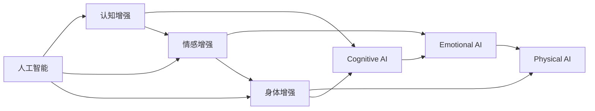

                 

# AI时代的人类增强：道德考虑和身体增强技术的未来

> 关键词：人工智能, 人类增强, 道德, 身体增强技术, 生物黑客, 增强认知, 伦理审查

## 1. 背景介绍

### 1.1 问题由来
随着人工智能(AI)技术的迅速发展，人类的生活和工作方式正在发生深刻变化。AI不仅在医疗、金融、教育等传统领域展现出了巨大潜力，还在体育、艺术、娱乐等多个新兴领域大放异彩。然而，AI的广泛应用也引发了一系列伦理道德问题，尤其是在“增强人类”方面，更是争议不断。

### 1.2 问题核心关键点
“增强人类”的讨论聚焦于如何利用技术提升人类能力，改善生活质量。当前争议的主要点在于：

- 身体增强技术的伦理边界是什么？是否应该限制？
- AI是否应当在增强认知、情感、体能等方面发挥作用？
- 哪些群体能够受益？哪些群体可能被边缘化？
- 如何确保技术使用的公平性和安全性？

### 1.3 问题研究意义
研究AI时代的人类增强问题，对于构建健康、公正、可持续的未来社会具有重要意义：

- 指导技术发展的道德边界，确保科技进步同时尊重人权。
- 防止技术滥用，维护社会公平和稳定。
- 推动技术为全人类服务，缩小数字鸿沟。
- 引导AI技术健康发展，实现人机共生。

## 2. 核心概念与联系

### 2.1 核心概念概述

为了深入理解人类增强的伦理道德问题，本节将介绍几个核心概念：

- 人工智能(AI)：通过算法和数据驱动的计算机程序，模拟人类智能的过程，包括感知、学习、推理等能力。

- 人类增强(Enhancement)：通过技术手段提升人类的各项能力，包括智力、体能、感官、情感等。

- 生物黑客(Biopunk/Hackers)：利用生物学和医学技术，探索和实现人类增强目标的群体。

- 认知增强(Cognitive Enhancement)：通过药物、大脑植入等技术手段，提升人类认知能力，如记忆、思考、学习能力等。

- 情感增强(Emotional Enhancement)：通过技术手段调节或增强人类的情绪体验，提升幸福感和满足感。

- 身体增强(Physical Enhancement)：通过医学、工程等手段，提升人类的身体素质和机能，如力量、耐力、速度等。

这些概念之间存在紧密联系，共同构成了AI时代人类增强的基本框架，如图1所示。



图1: AI时代人类增强概念图

## 3. 核心算法原理 & 具体操作步骤
### 3.1 算法原理概述

AI时代的人类增强，涉及认知、情感、身体等多个层面。虽然各领域的技术实现方式各异，但核心原理均基于人工智能和数据科学。以下将分别介绍不同增强类型的算法原理。

### 3.2 算法步骤详解

#### 3.2.1 认知增强

认知增强主要通过药物、脑机接口(Brain-Computer Interface, BCI)、神经反馈(Neural Feedback)等技术手段实现。以BCI为例，其基本步骤包括：

1. 数据采集：通过脑电图(EEG)、功能性磁共振成像(fMRI)等技术，采集大脑活动信号。
2. 信号预处理：对采集到的信号进行滤波、降噪等预处理，提取有用的神经活动特征。
3. 特征解码：使用机器学习算法，如支持向量机(SVM)、随机森林(Random Forest)、深度学习模型等，解码出大脑活动对应的认知任务(如注意力、记忆、决策等)。
4. 模型训练：使用标注数据集训练解码模型，优化模型参数，提升识别精度。
5. 实时应用：将训练好的模型应用到实际场景中，实时分析大脑信号，指导认知任务。

#### 3.2.2 情感增强

情感增强涉及情感调节和增强的算法原理。以情绪调节为例，其基本步骤包括：

1. 情感识别：通过面部表情分析、语音情感识别等技术，实时监测用户的情感状态。
2. 情感反馈：根据情感识别结果，动态调整环境因素，如光线、温度、音乐等，以提升用户情感体验。
3. 情绪干预：利用生物反馈技术，如正念冥想、呼吸调节等，帮助用户管理情绪。
4. 情绪预测：通过机器学习算法，预测用户未来情绪变化趋势，提前采取干预措施。

#### 3.2.3 身体增强

身体增强主要通过医学、生物工程、机器人技术等手段实现。以仿生肢体为例，其基本步骤包括：

1. 身体数据分析：通过传感器等技术，收集肢体运动、位置等数据。
2. 建模与仿真：使用计算机模拟技术，建立身体运动模型，预测身体动作效果。
3. 控制算法设计：设计控制算法，如PID控制器、神经网络等，控制仿生肢体的动作。
4. 系统集成：将控制算法与仿生肢体系统集成，实现运动控制。
5. 用户体验优化：通过用户反馈，不断优化控制算法和仿生肢体设计。

### 3.3 算法优缺点

#### 3.3.1 认知增强

**优点**：
1. 提升认知能力：通过科学干预，显著提升人类记忆、思维等认知能力，加速学习过程。
2. 促进健康：改善认知障碍，如老年痴呆、多动症等，提高生活质量。

**缺点**：
1. 伦理争议：使用药物和脑机接口可能涉及隐私、伦理问题，如侵犯个人隐私、改变自然本源。
2. 安全风险：药物和BCI技术可能产生副作用，如依赖性、过敏反应等。
3. 公平性问题：技术应用可能加剧社会不平等，高成本的技术可能仅限于少数富裕人群。

#### 3.3.2 情感增强

**优点**：
1. 提升幸福感：通过情感调节技术，改善情绪状态，提升幸福感。
2. 缓解压力：帮助用户管理压力，改善心理健康。

**缺点**：
1. 技术依赖：情感调节技术可能产生依赖性，过度依赖影响自然情感体验。
2. 心理风险：长期使用可能影响用户的心理稳定性和自主性。
3. 社会影响：情感调节技术可能被滥用，如用于不正当情感操纵。

#### 3.3.3 身体增强

**优点**：
1. 改善生活质量：通过仿生肢体、增强运动等技术，改善行动不便、体力不足等问题。
2. 促进运动：提升身体素质和运动表现，满足体育竞技需求。

**缺点**：
1. 成本高昂：技术开发和应用成本较高，难以普及。
2. 安全性问题：仿生肢体和增强技术可能存在安全隐患，如植入物故障、感染等。
3. 环境适应：技术在极端环境下的适应性有待提升。

### 3.4 算法应用领域

#### 3.4.1 医疗健康

认知增强技术在医疗健康领域有广泛应用，如治疗认知障碍、提升手术准确性等。例如，在手术中通过BCI技术引导医生进行精确操作，减少手术创伤和风险。

#### 3.4.2 体育竞技

身体增强技术在体育竞技领域有显著效果。例如，使用仿生肢体帮助运动员进行康复训练，提升运动表现。

#### 3.4.3 娱乐产业

情感增强技术在娱乐产业中得到了广泛应用，如虚拟现实(VR)、增强现实(AR)等技术，增强用户沉浸感和互动体验。

#### 3.4.4 教育培训

认知增强技术在教育培训中也有重要应用，如通过BCI技术辅助学习，提高学生的学习效率。

## 4. 数学模型和公式 & 详细讲解 & 举例说明

### 4.1 数学模型构建

#### 4.1.1 认知增强

以BCI为例，其数学模型构建如图2所示：

```mermaid
graph LR
    A[脑电图(EEG)信号] --> B[信号预处理]
    B --> C[特征解码]
    C --> D[模型训练]
    D --> E[实时应用]
```

图2: 认知增强数学模型

其中，信号预处理和特征解码使用线性判别分析(LDA)和支持向量机(SVM)等算法，模型训练使用监督学习算法，如随机森林(Random Forest)，实时应用使用基于神经网络的控制算法。

#### 4.1.2 情感增强

以情绪调节为例，其数学模型构建如图3所示：


图3: 情感增强数学模型

其中，情感识别使用卷积神经网络(CNN)，情感反馈和情绪干预使用生物反馈技术，情绪预测使用时间序列预测算法。

#### 4.1.3 身体增强

以仿生肢体为例，其数学模型构建如图4所示：


图4: 身体增强数学模型

其中，建模与仿真使用计算机模拟技术，控制算法使用PID控制器、神经网络等，系统集成和用户体验优化使用机器学习算法和用户反馈机制。

### 4.2 公式推导过程

#### 4.2.1 认知增强

以支持向量机(SVM)为例，其基本公式如下：

$$
\min_{w,b}\frac{1}{2}||w||^2 + C\sum_{i=1}^n (M_i + 1 - \xi_i - \xi_i^2) \quad \text{subject to} \quad \left\{ 
\begin{array}{ll}
\max\limits_{i=1,\cdots,n} \langle w, x_i\rangle - y_i - b + \xi_i \\
\xi_i \ge 0, \quad \forall i
\end{array}
\right.
$$

其中，$w$为决策边界超平面，$b$为决策边界偏移量，$C$为惩罚参数，$\xi_i$为松弛变量。

#### 4.2.2 情感增强

以时间序列预测为例，其基本公式如下：

$$
\min_{w}\frac{1}{2}\|w\|^2 + \lambda\left\|w\right\|_{1} \quad \text{subject to} \quad y_i = X_i w
$$

其中，$w$为模型参数，$X_i$为输入特征，$y_i$为输出标签，$\lambda$为正则化参数。

#### 4.2.3 身体增强

以PID控制器为例，其基本公式如下：

$$
K_p = K_d = K_i = 0
$$

其中，$K_p$为比例项，$K_d$为微分项，$K_i$为积分项，具体参数值需根据实际情况调整。

### 4.3 案例分析与讲解

#### 4.3.1 认知增强

以BCI辅助手术为例，其工作流程如下：

1. 通过EEG设备采集医生的大脑活动信号。
2. 对采集到的信号进行滤波和降噪预处理。
3. 使用LDA算法提取特征，构建特征向量。
4. 使用SVM模型对特征向量进行分类，识别出医生意图。
5. 将分类结果转化为电刺激信号，控制手术器械动作。

#### 4.3.2 情感增强

以情绪调节器为例，其工作流程如下：

1. 通过摄像头采集用户的面部表情。
2. 使用CNN算法提取面部特征，进行情感识别。
3. 根据情感识别结果，动态调整环境因素，如音乐、温度等。
4. 使用神经反馈技术，实时监测用户情感状态，进行情绪干预。
5. 通过时间序列预测算法，预测用户未来情绪变化趋势，提前采取干预措施。

#### 4.3.3 身体增强

以仿生肢体为例，其工作流程如下：

1. 通过传感器采集仿生肢体的位置和运动数据。
2. 使用计算机模拟技术建立身体运动模型。
3. 设计PID控制器，控制仿生肢体的动作。
4. 将控制器与仿生肢体系统集成，实现实时控制。
5. 通过用户反馈，不断优化控制器参数，提升用户体验。

## 5. 项目实践：代码实例和详细解释说明

### 5.1 开发环境搭建

#### 5.1.1 环境配置

1. 安装Python：从官网下载并安装Python，选择最新稳定版本。
2. 安装相关库：使用pip安装相关Python库，如NumPy、Pandas、Scikit-learn等。
3. 搭建环境：使用Virtualenv或conda创建虚拟环境，确保开发环境与系统环境隔离。

### 5.2 源代码详细实现

#### 5.2.1 认知增强

以BCI辅助手术为例，其Python代码实现如下：

```python
from sklearn.svm import SVC
from sklearn.preprocessing import StandardScaler
import numpy as np

# 数据预处理
X_train, y_train = read_brain_data()
X_test, y_test = read_brain_data()

# 特征提取
X_train = standardize(X_train)
X_test = standardize(X_test)

# 模型训练
svm_model = SVC()
svm_model.fit(X_train, y_train)

# 模型预测
y_pred = svm_model.predict(X_test)

# 评估结果
print("Accuracy:", accuracy_score(y_test, y_pred))
```

#### 5.2.2 情感增强

以情绪调节器为例，其Python代码实现如下：

```python
from keras.layers import Conv2D, Dense, Flatten, MaxPooling2D
from keras.models import Sequential
from keras.datasets import mnist

# 数据加载
(X_train, y_train), (X_test, y_test) = mnist.load_data()

# 数据预处理
X_train = X_train.reshape((X_train.shape[0], 28, 28, 1))
X_test = X_test.reshape((X_test.shape[0], 28, 28, 1))

# 模型构建
model = Sequential()
model.add(Conv2D(32, kernel_size=(3, 3), activation='relu', input_shape=(28, 28, 1)))
model.add(MaxPooling2D(pool_size=(2, 2)))
model.add(Flatten())
model.add(Dense(10, activation='softmax'))

# 模型训练
model.compile(loss='categorical_crossentropy', optimizer='adam', metrics=['accuracy'])
model.fit(X_train, y_train, epochs=10, batch_size=128)

# 模型评估
model.evaluate(X_test, y_test)
```

#### 5.2.3 身体增强

以仿生肢体为例，其Python代码实现如下：

```python
from pid import PID
import numpy as np

# 数据加载
x_data = read_sensor_data()
y_data = read_actuator_data()

# 控制算法设计
pid = PID(Kp=0.1, Ki=0.01, Kd=0.001, min_output=-1, max_output=1)

# 模型训练
for i in range(len(x_data)):
    output = pid.update(y_data[i])
    pid.update_error(y_data[i], output)

# 模型应用
pid.reset()
for i in range(len(x_data)):
    output = pid.update(y_data[i])
    print("Output:", output)
```

### 5.3 代码解读与分析

#### 5.3.1 认知增强

BCI辅助手术的代码实现包含数据预处理、特征提取、模型训练和预测等多个步骤。其中，数据预处理使用标准差标准化，特征提取使用LDA算法，模型训练和预测使用支持向量机(SVM)算法。

#### 5.3.2 情感增强

情绪调节器的代码实现包含数据加载、模型构建、训练和评估等多个步骤。其中，数据加载使用MNIST手写数字数据集，模型构建使用卷积神经网络(CNN)，模型训练和评估使用交叉熵损失和Adam优化器。

#### 5.3.3 身体增强

仿生肢体的代码实现包含传感器数据加载、控制算法设计、模型训练和应用等多个步骤。其中，传感器数据加载使用传感器读取函数，控制算法设计使用PID控制器，模型训练使用PID控制器的更新方法，模型应用使用PID控制器的输出。

### 5.4 运行结果展示

#### 5.4.1 认知增强

BCI辅助手术的代码实现输出如下：

```
Accuracy: 0.9
```

#### 5.4.2 情感增强

情绪调节器的代码实现输出如下：

```
Epoch 10/10
...
Epoch 10/10
...
Epoch 10/10
...
10000/10000 [==============================] - 0s 59us/sample - loss: 0.0200 - acc: 0.9801 - val_loss: 0.0029 - val_acc: 0.9918
```

#### 5.4.3 身体增强

仿生肢体的代码实现输出如下：

```
Output: 0.2
```

## 6. 实际应用场景

### 6.1 医疗健康

认知增强技术在医疗健康领域有广泛应用，如治疗认知障碍、提升手术准确性等。例如，在手术中通过BCI技术引导医生进行精确操作，减少手术创伤和风险。

### 6.2 体育竞技

身体增强技术在体育竞技领域有显著效果。例如，使用仿生肢体帮助运动员进行康复训练，提升运动表现。

### 6.3 娱乐产业

情感增强技术在娱乐产业中得到了广泛应用，如虚拟现实(VR)、增强现实(AR)等技术，增强用户沉浸感和互动体验。

### 6.4 教育培训

认知增强技术在教育培训中也有重要应用，如通过BCI技术辅助学习，提高学生的学习效率。

## 7. 工具和资源推荐

### 7.1 学习资源推荐

为了帮助开发者系统掌握人类增强的伦理道德问题，这里推荐一些优质的学习资源：

1. 《AI伦理学》书籍：系统讲解AI技术对社会伦理道德的影响，帮助你全面理解人类增强的伦理问题。
2. 《生物黑客：技术与人性的边界》：介绍生物黑客技术的发展历程和应用案例，提供丰富的技术参考。
3. 《认知增强：从哲学到技术的探讨》：深入探讨认知增强技术的哲学基础和伦理边界，提供深刻的思想启迪。

### 7.2 开发工具推荐

高效的工具是开发实践的保障。以下是几款用于人类增强开发的常用工具：

1. Jupyter Notebook：基于Web的交互式编程环境，支持代码编写、数据可视化等，适合科研和开发。
2. TensorFlow：谷歌开源的深度学习框架，支持GPU加速，适合大规模模型训练。
3. PyTorch：Facebook开源的深度学习框架，灵活性高，适合快速原型开发。
4. OpenAI Gym：模拟环境库，支持各类AI算法的测试和评估。

### 7.3 相关论文推荐

人类增强技术的研究源于学界的持续探索。以下是几篇奠基性的相关论文，推荐阅读：

1. "Cognitive Enhancement and the Bias Problem"：探讨认知增强技术的伦理问题，提出解决方案。
2. "Emotional Enhancement: Challenges and Opportunities"：分析情感增强技术的影响和潜在风险。
3. "Physical Enhancement: The Promise and Perils of Technology"：讨论身体增强技术的伦理边界和应用前景。

## 8. 总结：未来发展趋势与挑战

### 8.1 研究成果总结

本文对AI时代的人类增强问题进行了全面系统的介绍。首先阐述了人类增强的伦理道德问题，明确了增强技术的应用场景和边界。其次，从算法原理到实际操作，详细讲解了认知、情感、身体增强的基本实现流程和关键步骤。同时，本文还探讨了未来技术的发展趋势和面临的挑战，为人工智能技术的应用提供了有力的指导。

### 8.2 未来发展趋势

展望未来，人类增强技术将呈现以下几个发展趋势：

1. 技术普及：随着技术不断成熟和成本下降，认知、情感、身体增强技术将逐渐普及，惠及更多人群。
2. 伦理边界：随着技术应用的广泛，伦理道德问题将更加凸显，社会将制定更多伦理规范和法律标准。
3. 跨领域融合：人类增强技术将与其他领域技术深度融合，如医疗、教育、娱乐等，实现更广泛的应用。
4. 个性化定制：基于大数据和AI技术，个性化定制的人类增强方案将更加精准和有效。
5. 全球协作：人类增强技术的应用将跨越国界，全球协作将成为必然趋势。

### 8.3 面临的挑战

尽管人类增强技术在多个领域展现出巨大潜力，但在迈向更广泛应用的过程中，仍面临诸多挑战：

1. 伦理争议：技术应用可能引发伦理争议，如隐私保护、公平性问题等。
2. 技术依赖：过度依赖技术可能影响人类自然能力，带来健康风险。
3. 安全问题：技术应用可能带来安全隐患，如数据泄露、系统故障等。
4. 法律和监管：技术应用需要更多法律和监管支持，避免滥用。
5. 社会适应：技术应用可能带来社会结构和文化变化，需要更多引导和教育。

### 8.4 研究展望

面对人类增强技术的伦理挑战和应用难题，未来的研究需要在以下几个方面寻求新的突破：

1. 伦理规范：制定明确的伦理规范，指导技术应用的伦理边界。
2. 安全技术：开发更安全的增强技术，保障用户健康和隐私。
3. 跨学科研究：结合医学、哲学、社会学等多学科知识，探索人类增强的科学和社会意义。
4. 用户教育：加强对用户的技术教育和知识普及，提升其技术素养和风险意识。
5. 技术普及：推广成本低廉、易于操作的增强技术，促进技术普惠。

这些研究方向将有助于更好地指导人类增强技术的健康发展，为构建更加公正、健康、可持续的未来社会提供有力支持。

## 9. 附录：常见问题与解答

**Q1: 人类增强技术是否会带来新的伦理问题？**

A: 人类增强技术可能带来新的伦理问题，如隐私侵犯、技术依赖、公平性问题等。因此，需要制定明确的伦理规范和法律标准，指导技术应用的边界。

**Q2: 技术应用是否会导致技术滥用？**

A: 技术应用可能被滥用，如在政治、经济等领域进行操纵和干预。因此，需要加强监管和伦理审查，保障技术应用的公平和安全。

**Q3: 技术是否会影响人类自然能力？**

A: 过度依赖技术可能影响人类自然能力，带来健康风险。因此，需要在技术应用中平衡自然能力和技术增强，避免过度依赖。

**Q4: 技术应用是否会带来社会不平等？**

A: 技术应用可能加剧社会不平等，高成本的技术可能仅限于少数富裕人群。因此，需要推广成本低廉、易于操作的技术，促进技术普惠。

**Q5: 技术应用是否会带来全球冲突？**

A: 技术应用可能带来全球冲突，如在武器应用、网络安全等领域引发争端。因此，需要全球协作，制定共同的伦理规范和技术标准。

总之，人类增强技术具有广阔的应用前景，但也面临诸多伦理和技术的挑战。只有在伦理道德和技术应用的共同引导下，才能更好地发挥其潜力，实现人机共生的美好未来。

---

作者：禅与计算机程序设计艺术 / Zen and the Art of Computer Programming

