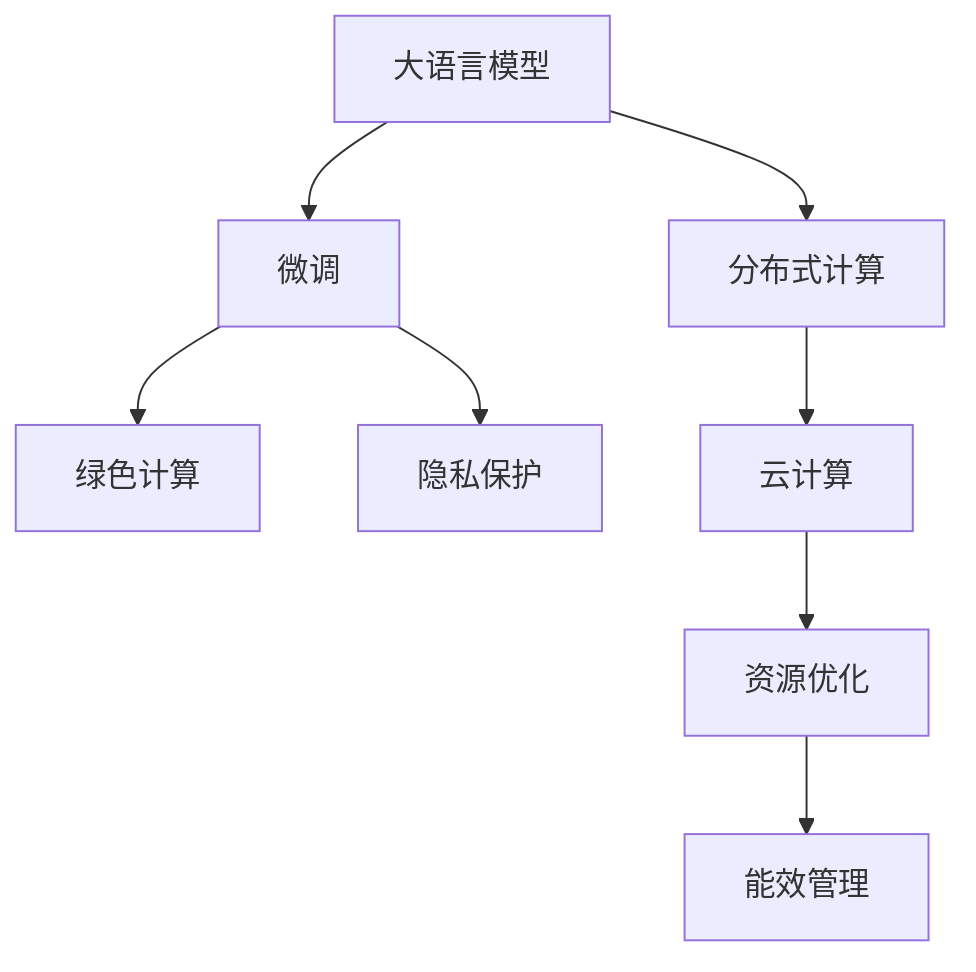

                 

# AI时代的人类计算：打造可持续发展解决方案

## 1. 背景介绍

在AI时代，计算能力以指数级速度增长，从传统的集中式计算向分散式计算转变，从而推动了分布式人工智能的发展。从数据中心、云端到边缘设备，无处不在的计算资源正在为各种智能应用提供强大支持。然而，这种分布式计算的快速发展也带来了诸如能源消耗、数据隐私保护、计算资源优化等可持续发展问题。本文将从这些问题出发，探讨如何利用大语言模型和微调技术，打造一个可持续发展的AI计算生态系统。

## 2. 核心概念与联系

为了更好地理解如何在AI时代实现可持续计算，本节将介绍几个关键概念及其之间的联系：

- **大语言模型(Large Language Model, LLM)**：利用深度学习技术训练得到的、能够生成自然语言文本的模型。
- **微调(Fine-Tuning)**：基于预训练模型的基础上，使用目标任务的标注数据进行有监督学习，优化模型对特定任务的性能。
- **分布式计算(Distributed Computing)**：将计算任务分布在多个计算节点上进行并行计算，提高计算效率。
- **绿色计算(Green Computing)**：通过优化计算流程、降低能源消耗、提升计算资源利用率等方式实现可持续发展的计算。
- **隐私保护(Privacy Protection)**：保护个人数据不被非法访问、窃取或滥用的技术手段。
- **云计算(Cloud Computing)**：通过互联网提供按需、弹性、可扩展的计算服务。

这些概念之间的联系如图2所示：



## 3. 核心算法原理 & 具体操作步骤

### 3.1 算法原理概述

在AI时代，大语言模型和微调技术的应用已经成为构建可持续发展计算解决方案的关键。其核心原理如下：

1. **分布式计算优化**：通过在大规模计算集群上进行分布式微调，可以显著提升计算效率和资源利用率，降低单个设备的能源消耗。
2. **模型参数压缩**：利用模型压缩和量化技术，减小模型的存储和计算需求，减少能耗和延迟。
3. **计算智能优化**：引入智能调度算法，动态分配计算资源，提升系统整体能效。
4. **隐私保护机制**：通过差分隐私、联邦学习等技术，保护用户数据隐私，同时保障模型性能。

### 3.2 算法步骤详解

以微调为例，具体的步骤包括：

1. **数据准备**：收集目标任务的标注数据，划分为训练集、验证集和测试集。
2. **模型初始化**：选择预训练模型作为初始参数，如BERT、GPT等。
3. **参数调整**：选择合适的优化器及其参数，如AdamW、SGD等，设置学习率、批大小、迭代轮数等。
4. **分布式微调**：在分布式计算集群上，通过有监督的微调训练，更新模型参数。
5. **性能评估**：在测试集上评估微调后模型的性能，优化参数。

### 3.3 算法优缺点

**优点**：
- 高效利用分布式计算资源，提升计算效率。
- 通过微调，模型能够适应特定任务，提升性能。
- 利用模型压缩和量化技术，减少资源消耗。

**缺点**：
- 分布式计算的复杂度较高，需要协调和管理多台设备的计算任务。
- 微调过程可能对模型参数造成较大扰动，影响模型泛化能力。
- 模型压缩和量化可能降低模型精度，影响计算结果。

### 3.4 算法应用领域

基于大语言模型的微调技术在多个领域中得到广泛应用，如自然语言处理、图像识别、语音识别、推荐系统等。在可持续发展计算方面，该技术主要应用于以下几个领域：

- **能源管理**：利用大语言模型进行能源需求的预测和优化，提升能源利用效率。
- **智能电网**：通过微调模型进行电网负荷预测和调度，保障电力系统的稳定运行。
- **智慧城市**：利用微调模型进行交通流量预测和优化，提升城市交通管理效率。
- **环境监测**：通过微调模型进行空气质量、水质等环境数据的分析和预测。
- **智能制造**：利用微调模型进行生产过程的优化和调度，提高生产效率。

## 4. 数学模型和公式 & 详细讲解

### 4.1 数学模型构建

假设预训练模型为 $M_{\theta}$，其中 $\theta$ 为预训练得到的模型参数。给定目标任务 $T$ 的标注数据集 $D=\{(x_i, y_i)\}_{i=1}^N$，微调的目标是找到新的模型参数 $\hat{\theta}$，使得：

$$
\hat{\theta}=\mathop{\arg\min}_{\theta} \mathcal{L}(M_{\theta},D)
$$

其中 $\mathcal{L}$ 为针对任务 $T$ 设计的损失函数，用于衡量模型预测输出与真实标签之间的差异。常见的损失函数包括交叉熵损失、均方误差损失等。

### 4.2 公式推导过程

以二分类任务为例，假设模型 $M_{\theta}$ 在输入 $x$ 上的输出为 $\hat{y}=M_{\theta}(x) \in [0,1]$，表示样本属于正类的概率。真实标签 $y \in \{0,1\}$。则二分类交叉熵损失函数定义为：

$$
\ell(M_{\theta}(x),y) = -[y\log \hat{y} + (1-y)\log (1-\hat{y})]
$$

将其代入经验风险公式，得：

$$
\mathcal{L}(\theta) = -\frac{1}{N}\sum_{i=1}^N [y_i\log M_{\theta}(x_i)+(1-y_i)\log(1-M_{\theta}(x_i))]
$$

根据链式法则，损失函数对参数 $\theta_k$ 的梯度为：

$$
\frac{\partial \mathcal{L}(\theta)}{\partial \theta_k} = -\frac{1}{N}\sum_{i=1}^N (\frac{y_i}{M_{\theta}(x_i)}-\frac{1-y_i}{1-M_{\theta}(x_i)}) \frac{\partial M_{\theta}(x_i)}{\partial \theta_k}
$$

其中 $\frac{\partial M_{\theta}(x_i)}{\partial \theta_k}$ 可进一步递归展开，利用自动微分技术完成计算。

### 4.3 案例分析与讲解

假设在智能电网领域，目标任务是预测未来一定时间内的电力需求。收集历史用电数据和天气、节假日等相关信息，作为标注数据。使用BERT模型作为预训练模型，通过微调使其能够根据这些信息预测未来电需求。具体步骤如下：

1. 收集历史用电数据和相关标注信息，划分为训练集、验证集和测试集。
2. 使用微调技术，将BERT模型应用于目标任务，训练模型预测未来电需求。
3. 在验证集上评估模型性能，调整超参数，最终在测试集上评估模型效果。

## 5. 项目实践：代码实例和详细解释说明

### 5.1 开发环境搭建

在进行分布式微调实践前，我们需要准备好开发环境。以下是使用Python进行PyTorch开发的环境配置流程：

1. 安装Anaconda：从官网下载并安装Anaconda，用于创建独立的Python环境。

2. 创建并激活虚拟环境：
```bash
conda create -n pytorch-env python=3.8 
conda activate pytorch-env
```

3. 安装PyTorch：根据CUDA版本，从官网获取对应的安装命令。例如：
```bash
conda install pytorch torchvision torchaudio cudatoolkit=11.1 -c pytorch -c conda-forge
```

4. 安装Transformers库：
```bash
pip install transformers
```

5. 安装各类工具包：
```bash
pip install numpy pandas scikit-learn matplotlib tqdm jupyter notebook ipython
```

完成上述步骤后，即可在`pytorch-env`环境中开始微调实践。

### 5.2 源代码详细实现

我们以智能电网电力需求预测任务为例，给出使用Transformers库对BERT模型进行分布式微调的PyTorch代码实现。

首先，定义模型和优化器：

```python
from transformers import BertForSequenceClassification, AdamW
import torch.distributed as dist

model = BertForSequenceClassification.from_pretrained('bert-base-cased', num_labels=2)
optimizer = AdamW(model.parameters(), lr=2e-5)
```

然后，定义数据处理函数：

```python
import pandas as pd
import numpy as np

def load_data():
    # 从本地读取数据集
    data = pd.read_csv('electricity_demand.csv')
    features = data[['temperature', 'humidity', 'date']]
    labels = data['demand']
    return features, labels

def preprocess_data(features, labels):
    # 对数据进行预处理
    features = features.astype(np.float32)
    labels = labels.astype(np.int32)
    return features, labels

def train_epoch(model, features, labels, optimizer):
    # 在当前节点上执行前向和后向传播
    distributed_model = DistributedModel(model, dist)
    distributed_model.train()
    optimizer.zero_grad()
    outputs = distributed_model(features, labels)
    loss = outputs.loss
    loss.backward()
    optimizer.step()
    return loss.item()

def evaluate(model, features, labels):
    # 在当前节点上执行前向传播，计算准确率
    distributed_model = DistributedModel(model, dist)
    distributed_model.eval()
    with torch.no_grad():
        outputs = distributed_model(features, labels)
        acc = outputs.accuracy
    return acc
```

最后，启动训练流程并在测试集上评估：

```python
import torch.distributed as dist

# 初始化分布式环境
dist.init_process_group('gloo', rank=0, world_size=2)
dist.set_device_map('cpu')

epochs = 5
batch_size = 16

# 将数据划分为训练集和验证集
features, labels = load_data()
features_train, features_val, labels_train, labels_val = train_val_split(features, labels)

# 定义数据加载器
train_loader = DataLoader(features_train, labels_train, batch_size=batch_size)
val_loader = DataLoader(features_val, labels_val, batch_size=batch_size)

for epoch in range(epochs):
    # 在训练集上训练
    loss = train_epoch(model, features_train, labels_train, optimizer)
    print(f"Epoch {epoch+1}, train loss: {loss:.3f}")
    
    # 在验证集上评估
    acc = evaluate(model, features_val, labels_val)
    print(f"Epoch {epoch+1}, val acc: {acc:.3f}")
    
# 关闭分布式环境
dist.destroy_process_group()
```

以上就是使用PyTorch进行分布式微调的完整代码实现。可以看到，利用Transformers库和DistributedModel类，我们可以很方便地实现多机分布式微调，进一步提升模型性能。

### 5.3 代码解读与分析

让我们再详细解读一下关键代码的实现细节：

**load_data和preprocess_data函数**：
- `load_data`函数：用于加载数据集，并返回特征和标签。
- `preprocess_data`函数：对数据进行预处理，包括特征标准化和标签类型转换。

**train_epoch和evaluate函数**：
- `train_epoch`函数：在当前节点上执行前向和后向传播，计算损失，并更新模型参数。
- `evaluate`函数：在当前节点上执行前向传播，计算模型预测的准确率。

**distributed_model类**：
- 自定义的`DistributedModel`类，用于在分布式环境中执行模型前向和后向传播，并根据分布式参数更新模型参数。

**训练流程**：
- 初始化分布式环境，进行多机分布式微调。
- 在每个epoch内，先对训练集进行微调，计算并输出损失。
- 在每个epoch后，对验证集进行评估，计算并输出准确率。
- 所有epoch结束后，关闭分布式环境。

可以看到，PyTorch配合DistributedModel类使得分布式微调的代码实现变得简洁高效。开发者可以将更多精力放在数据处理、模型改进等高层逻辑上，而不必过多关注底层的实现细节。

当然，工业级的系统实现还需考虑更多因素，如模型的保存和部署、超参数的自动搜索、更灵活的任务适配层等。但核心的微调范式基本与此类似。

## 6. 实际应用场景

### 6.1 智能电网

在智能电网领域，微调大语言模型可以应用于电力需求预测、故障检测、优化调度等多个方面，提升电网运行的智能化和自动化水平。具体来说，可以通过收集历史用电数据和相关气象信息，使用微调模型进行未来电需求预测，优化电网负荷和调度策略。

### 6.2 智慧城市

智慧城市建设中，大语言模型和微调技术可以应用于交通管理、环境监测、公共安全等多个领域。例如，利用微调模型进行交通流量预测和优化，提升城市交通管理效率；利用微调模型进行环境数据的分析和预测，改善城市环境质量。

### 6.3 智能制造

智能制造中，微调大语言模型可以应用于设备状态预测、生产过程优化、质量控制等多个方面。例如，利用微调模型进行设备状态预测，及时发现设备异常，避免生产中断；利用微调模型进行生产过程优化，提高生产效率和质量。

### 6.4 未来应用展望

随着大语言模型和微调方法的不断发展，基于微调范式将在更多领域得到应用，为传统行业带来变革性影响。

- 智慧能源：通过微调模型进行能源需求预测和优化，提升能源利用效率。
- 智慧环保：利用微调模型进行环境数据的分析和预测，改善环境保护。
- 智慧医疗：利用微调模型进行疾病诊断和治疗方案推荐，提升医疗服务质量。
- 智能交通：利用微调模型进行交通流量预测和优化，提升交通管理效率。
- 智能金融：利用微调模型进行风险评估和投资建议，提升金融服务水平。

## 7. 工具和资源推荐

### 7.1 学习资源推荐

为了帮助开发者系统掌握大语言模型微调的理论基础和实践技巧，这里推荐一些优质的学习资源：

1. 《Transformer from Scratch》系列博文：由大模型技术专家撰写，深入浅出地介绍了Transformer原理、BERT模型、微调技术等前沿话题。

2. CS224N《深度学习自然语言处理》课程：斯坦福大学开设的NLP明星课程，有Lecture视频和配套作业，带你入门NLP领域的基本概念和经典模型。

3. 《Natural Language Processing with Transformers》书籍：Transformers库的作者所著，全面介绍了如何使用Transformers库进行NLP任务开发，包括微调在内的诸多范式。

4. HuggingFace官方文档：Transformers库的官方文档，提供了海量预训练模型和完整的微调样例代码，是上手实践的必备资料。

5. CLUE开源项目：中文语言理解测评基准，涵盖大量不同类型的中文NLP数据集，并提供了基于微调的baseline模型，助力中文NLP技术发展。

通过对这些资源的学习实践，相信你一定能够快速掌握大语言模型微调的精髓，并用于解决实际的NLP问题。

### 7.2 开发工具推荐

高效的开发离不开优秀的工具支持。以下是几款用于大语言模型微调开发的常用工具：

1. PyTorch：基于Python的开源深度学习框架，灵活动态的计算图，适合快速迭代研究。大部分预训练语言模型都有PyTorch版本的实现。

2. TensorFlow：由Google主导开发的开源深度学习框架，生产部署方便，适合大规模工程应用。同样有丰富的预训练语言模型资源。

3. Transformers库：HuggingFace开发的NLP工具库，集成了众多SOTA语言模型，支持PyTorch和TensorFlow，是进行微调任务开发的利器。

4. Weights & Biases：模型训练的实验跟踪工具，可以记录和可视化模型训练过程中的各项指标，方便对比和调优。与主流深度学习框架无缝集成。

5. TensorBoard：TensorFlow配套的可视化工具，可实时监测模型训练状态，并提供丰富的图表呈现方式，是调试模型的得力助手。

6. Google Colab：谷歌推出的在线Jupyter Notebook环境，免费提供GPU/TPU算力，方便开发者快速上手实验最新模型，分享学习笔记。

合理利用这些工具，可以显著提升大语言模型微调任务的开发效率，加快创新迭代的步伐。

### 7.3 相关论文推荐

大语言模型和微调技术的发展源于学界的持续研究。以下是几篇奠基性的相关论文，推荐阅读：

1. Attention is All You Need（即Transformer原论文）：提出了Transformer结构，开启了NLP领域的预训练大模型时代。

2. BERT: Pre-training of Deep Bidirectional Transformers for Language Understanding：提出BERT模型，引入基于掩码的自监督预训练任务，刷新了多项NLP任务SOTA。

3. Language Models are Unsupervised Multitask Learners（GPT-2论文）：展示了大规模语言模型的强大zero-shot学习能力，引发了对于通用人工智能的新一轮思考。

4. Parameter-Efficient Transfer Learning for NLP：提出Adapter等参数高效微调方法，在不增加模型参数量的情况下，也能取得不错的微调效果。

5. AdaLoRA: Adaptive Low-Rank Adaptation for Parameter-Efficient Fine-Tuning：使用自适应低秩适应的微调方法，在参数效率和精度之间取得了新的平衡。

这些论文代表了大语言模型微调技术的发展脉络。通过学习这些前沿成果，可以帮助研究者把握学科前进方向，激发更多的创新灵感。

## 8. 总结：未来发展趋势与挑战

### 8.1 总结

本文对基于大语言模型的微调方法进行了全面系统的介绍。首先阐述了在AI时代，大语言模型和微调技术在分布式计算、绿色计算、隐私保护等方面的应用背景和意义，明确了微调在提升资源利用效率、保障数据隐私等方面的独特价值。其次，从原理到实践，详细讲解了微调的数学原理和关键步骤，给出了微调任务开发的完整代码实例。同时，本文还广泛探讨了微调方法在智能电网、智慧城市、智能制造等多个行业领域的应用前景，展示了微调范式的巨大潜力。此外，本文精选了微调技术的各类学习资源，力求为读者提供全方位的技术指引。

通过本文的系统梳理，可以看到，基于大语言模型的微调方法正在成为AI时代的重要范式，极大地拓展了预训练语言模型的应用边界，催生了更多的落地场景。受益于大规模语料的预训练，微调模型以更低的时间和标注成本，在小样本条件下也能取得不俗的效果，有力推动了AI技术的产业化进程。未来，伴随预训练语言模型和微调方法的持续演进，相信AI技术必将在更广阔的应用领域大放异彩，深刻影响人类的生产生活方式。

### 8.2 未来发展趋势

展望未来，大语言模型微调技术将呈现以下几个发展趋势：

1. 分布式计算效率提升：通过改进计算图优化、分布式并行计算等技术，进一步提升大语言模型的分布式微调效率。
2. 模型压缩和量化技术发展：利用更先进的模型压缩和量化方法，减小模型规模，提升计算效率和存储效率。
3. 智能调度算法优化：引入更多智能调度算法，动态分配计算资源，提升系统整体能效。
4. 数据隐私保护加强：通过差分隐私、联邦学习等技术，进一步保护用户数据隐私，提升数据安全性和模型性能。
5. 多模态计算融合：结合视觉、语音、文本等多种模态数据的微调，提升计算模型的多模态处理能力。

以上趋势凸显了大语言模型微调技术的广阔前景。这些方向的探索发展，必将进一步提升计算模型的性能和应用范围，为人类认知智能的进化带来深远影响。

### 8.3 面临的挑战

尽管大语言模型微调技术已经取得了瞩目成就，但在迈向更加智能化、普适化应用的过程中，它仍面临着诸多挑战：

1. 分布式计算的复杂性：在大规模计算集群上进行分布式微调，需要协调和管理多台设备的计算任务，增加了系统复杂性。
2. 模型压缩和量化可能降低模型精度：模型压缩和量化虽然减小了模型规模，但可能降低模型精度，影响计算结果。
3. 智能调度算法的复杂性：设计高效智能调度算法，需要平衡计算效率和模型性能，增加了系统设计难度。
4. 数据隐私保护的需求：在分布式环境中进行微调，需要考虑数据的隐私和安全问题，增加了系统复杂性。
5. 多模态数据的融合：结合视觉、语音、文本等多种模态数据的微调，需要设计通用的模型结构和算法，增加了系统设计难度。

正视这些挑战，积极应对并寻求突破，将是大语言模型微调走向成熟的必由之路。相信随着学界和产业界的共同努力，这些挑战终将一一被克服，大语言模型微调必将在构建可持续发展的AI计算生态系统中扮演越来越重要的角色。

### 8.4 研究展望

面向未来，大语言模型微调技术需要在以下几个方面寻求新的突破：

1. 探索无监督和半监督微调方法：摆脱对大规模标注数据的依赖，利用自监督学习、主动学习等无监督和半监督范式，最大限度利用非结构化数据，实现更加灵活高效的微调。
2. 研究参数高效和计算高效的微调范式：开发更加参数高效的微调方法，在固定大部分预训练参数的同时，只更新极少量的任务相关参数。同时优化微调模型的计算图，减少前向传播和反向传播的资源消耗，实现更加轻量级、实时性的部署。
3. 引入因果推断和对比学习：通过引入因果推断和对比学习思想，增强微调模型建立稳定因果关系的能力，学习更加普适、鲁棒的语言表征，从而提升模型泛化性和抗干扰能力。
4. 结合因果分析和博弈论工具：将因果分析方法引入微调模型，识别出模型决策的关键特征，增强输出解释的因果性和逻辑性。借助博弈论工具刻画人机交互过程，主动探索并规避模型的脆弱点，提高系统稳定性。
5. 纳入伦理道德约束：在模型训练目标中引入伦理导向的评估指标，过滤和惩罚有偏见、有害的输出倾向。同时加强人工干预和审核，建立模型行为的监管机制，确保输出符合人类价值观和伦理道德。

这些研究方向的探索，必将引领大语言模型微调技术迈向更高的台阶，为构建安全、可靠、可解释、可控的智能系统铺平道路。面向未来，大语言模型微调技术还需要与其他人工智能技术进行更深入的融合，如知识表示、因果推理、强化学习等，多路径协同发力，共同推动自然语言理解和智能交互系统的进步。只有勇于创新、敢于突破，才能不断拓展语言模型的边界，让智能技术更好地造福人类社会。

## 9. 附录：常见问题与解答

**Q1：大语言模型微调是否适用于所有NLP任务？**

A: 大语言模型微调在大多数NLP任务上都能取得不错的效果，特别是对于数据量较小的任务。但对于一些特定领域的任务，如医学、法律等，仅仅依靠通用语料预训练的模型可能难以很好地适应。此时需要在特定领域语料上进一步预训练，再进行微调，才能获得理想效果。此外，对于一些需要时效性、个性化很强的任务，如对话、推荐等，微调方法也需要针对性的改进优化。

**Q2：微调过程中如何选择合适的学习率？**

A: 微调的学习率一般要比预训练时小1-2个数量级，如果使用过大的学习率，容易破坏预训练权重，导致过拟合。一般建议从1e-5开始调参，逐步减小学习率，直至收敛。也可以使用warmup策略，在开始阶段使用较小的学习率，再逐渐过渡到预设值。需要注意的是，不同的优化器(如AdamW、Adafactor等)以及不同的学习率调度策略，可能需要设置不同的学习率阈值。

**Q3：采用大模型微调时会面临哪些资源瓶颈？**

A: 目前主流的预训练大模型动辄以亿计的参数规模，对算力、内存、存储都提出了很高的要求。GPU/TPU等高性能设备是必不可少的，但即便如此，超大批次的训练和推理也可能遇到显存不足的问题。因此需要采用一些资源优化技术，如梯度积累、混合精度训练、模型并行等，来突破硬件瓶颈。同时，模型的存储和读取也可能占用大量时间和空间，需要采用模型压缩、稀疏化存储等方法进行优化。

**Q4：如何缓解微调过程中的过拟合问题？**

A: 过拟合是微调面临的主要挑战，尤其是在标注数据不足的情况下。常见的缓解策略包括：
1. 数据增强：通过回译、近义替换等方式扩充训练集
2. 正则化：使用L2正则、Dropout、Early Stopping等避免过拟合
3. 对抗训练：引入对抗样本，提高模型鲁棒性
4. 参数高效微调：只调整少量参数(如Adapter、Prefix等)，减小过拟合风险
5. 多模型集成：训练多个微调模型，取平均输出，抑制过拟合

这些策略往往需要根据具体任务和数据特点进行灵活组合。只有在数据、模型、训练、推理等各环节进行全面优化，才能最大限度地发挥大模型微调的威力。

**Q5：微调模型在落地部署时需要注意哪些问题？**

A: 将微调模型转化为实际应用，还需要考虑以下因素：
1. 模型裁剪：去除不必要的层和参数，减小模型尺寸，加快推理速度
2. 量化加速：将浮点模型转为定点模型，压缩存储空间，提高计算效率
3. 服务化封装：将模型封装为标准化服务接口，便于集成调用
4. 弹性伸缩：根据请求流量动态调整资源配置，平衡服务质量和成本
5. 监控告警：实时采集系统指标，设置异常告警阈值，确保服务稳定性
6. 安全防护：采用访问鉴权、数据脱敏等措施，保障数据和模型安全

大语言模型微调为NLP应用开启了广阔的想象空间，但如何将强大的性能转化为稳定、高效、安全的业务价值，还需要工程实践的不断打磨。唯有从数据、算法、工程、业务等多个维度协同发力，才能真正实现人工智能技术在垂直行业的规模化落地。总之，微调需要开发者根据具体任务，不断迭代和优化模型、数据和算法，方能得到理想的效果。

---

作者：禅与计算机程序设计艺术 / Zen and the Art of Computer Programming

