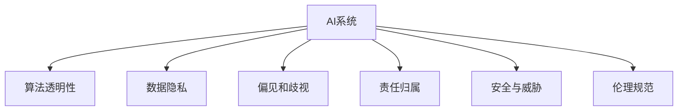

                 

# AI时代的人类计算：道德和伦理问题

## 1. 背景介绍

### 1.1 问题由来

随着人工智能（AI）技术的飞速发展，人类计算的方式正经历着深刻的变革。AI系统的广泛应用，已经从传统的科学研究、工业制造等专业领域，渗透到教育、医疗、金融、娱乐等方方面面，深刻影响着人们的生活和工作方式。然而，AI技术的飞速发展也带来了新的道德和伦理挑战，引发了全社会的广泛关注。

如何合理地开发、使用和管理AI系统，既能够发挥其巨大价值，又能够避免潜在风险，成为一个亟待解决的问题。本文将系统地介绍AI时代的道德和伦理问题，探讨其在人类计算中的影响，以及如何构建更公平、透明、可信的AI系统。

### 1.2 问题核心关键点

AI时代的道德和伦理问题涉及多个层面，主要包括但不限于：

1. **算法透明性**：AI系统的决策过程和内部运作是否透明，是否能够被理解和解释。
2. **数据隐私**：AI系统在收集、使用和存储数据时，是否保护个人隐私，防止数据滥用。
3. **偏见和歧视**：AI系统是否存在偏见，是否会导致歧视和不公平。
4. **责任归属**：AI系统的决策错误时，责任应由谁承担，法律和道德如何界定。
5. **安全与威胁**：AI系统是否会带来新的安全威胁，如何防范恶意攻击。
6. **伦理规范**：AI系统开发和应用应遵循何种伦理规范，引导AI健康发展。

这些关键点贯穿于AI系统开发和应用的每一个环节，需要在技术、法规和社会等多方面进行综合考虑和解决。

### 1.3 问题研究意义

研究AI时代的道德和伦理问题，对于推动AI技术的健康发展，构建安全、透明、公平的AI系统，具有重要意义：

1. **促进AI技术的负责任应用**：通过研究和制定AI伦理规范，确保AI系统在开发和应用过程中，能够遵循伦理原则，避免滥用。
2. **保障用户权益**：保护用户数据隐私，防止AI系统带来的歧视和不公平，提升用户对AI系统的信任度。
3. **推动AI法规建设**：在AI伦理规范的基础上，推动相关法律法规的制定和实施，为AI技术的健康发展提供法律保障。
4. **引导AI技术创新**：通过伦理规范的引导，促进AI技术的创新，推动社会进步。

## 2. 核心概念与联系

### 2.1 核心概念概述

为更好地理解AI时代的道德和伦理问题，本节将介绍几个密切相关的核心概念：

- **AI系统**：利用算法和数据，自动完成特定任务的计算机程序。
- **算法透明性**：指AI系统决策过程的可解释性和可理解性，即开发者和用户能否理解AI系统的决策逻辑和依据。
- **数据隐私**：指用户数据在收集、存储和使用过程中的保密性和安全性，防止数据泄露和滥用。
- **偏见和歧视**：指AI系统在训练数据中存在偏差，导致输出结果的不公平和不公正。
- **责任归属**：指AI系统决策错误时，应由谁承担责任，包括开发者、用户、系统设计者等。
- **安全与威胁**：指AI系统在运行过程中可能带来的安全威胁，包括恶意攻击、漏洞利用等。
- **伦理规范**：指指导AI系统开发和应用的伦理准则，包括公平、透明、可信等原则。

这些核心概念之间的逻辑关系可以通过以下Mermaid流程图来展示：



这个流程图展示了大语言模型的核心概念及其之间的关系：

1. AI系统通过算法和数据自动完成特定任务。
2. 算法透明性是确保AI系统公平、可信的基础。
3. 数据隐私是保护用户权益的重要保障。
4. 偏见和歧视可能导致AI系统输出结果的不公平。
5. 责任归属涉及AI系统决策错误的责任归属。
6. 安全与威胁影响AI系统的稳定性和安全性。
7. 伦理规范指导AI系统的开发和应用。

这些概念共同构成了AI系统的伦理基础，指导着AI技术的健康发展。通过理解这些核心概念，我们可以更好地把握AI系统的运作逻辑和潜在风险，制定合理的道德和伦理策略。

## 3. 核心算法原理 & 具体操作步骤
### 3.1 算法原理概述

AI时代的道德和伦理问题涉及多方面的内容，需要通过综合的技术手段和伦理规范来解决。本文重点介绍算法透明性和数据隐私两个核心概念的算法原理。

### 3.2 算法步骤详解

**算法透明性**：

1. **模型选择**：选择合适的透明性较高的模型，如规则驱动、逻辑推理等模型，或利用可解释性算法如决策树、线性回归等。
2. **特征选择**：明确模型使用的特征，选择具有可解释性的特征，避免使用黑盒特征。
3. **模型解释**：使用模型解释工具（如LIME、SHAP等）对模型进行解释，帮助开发者和用户理解模型决策过程。
4. **用户反馈**：收集用户反馈，根据反馈调整模型解释方式，提升透明性。

**数据隐私**：

1. **数据匿名化**：对数据进行去标识化处理，去除或模糊化个人标识信息，防止数据泄露。
2. **数据加密**：对数据进行加密存储和传输，确保数据安全性。
3. **隐私保护算法**：使用差分隐私、联邦学习等隐私保护算法，在保护数据隐私的同时，实现数据共享和模型训练。
4. **合规审计**：定期进行数据隐私合规审计，确保数据处理符合法律法规要求。

### 3.3 算法优缺点

**算法透明性**：

- **优点**：提高模型的可信度和公平性，增强用户信任，有助于模型改进和优化。
- **缺点**：可能增加模型的复杂度和计算成本，增加开发和维护难度。

**数据隐私**：

- **优点**：保护用户隐私，防止数据滥用，确保数据安全。
- **缺点**：数据匿名化和加密处理可能导致数据失真，隐私保护算法可能影响模型性能。

### 3.4 算法应用领域

算法透明性和数据隐私在AI系统的多个应用领域都有重要应用：

1. **医疗健康**：医疗AI系统的决策过程需要高度透明，确保医疗数据的隐私和安全。
2. **金融服务**：金融AI系统需要保护用户隐私，防止数据泄露和滥用。
3. **教育培训**：教育AI系统需要确保学生数据的安全，防止信息滥用。
4. **智能家居**：智能家居系统需要保护用户隐私，防止数据泄露和滥用。
5. **政府服务**：政府AI系统需要确保公民数据的隐私和安全，防止数据滥用。

## 4. 数学模型和公式 & 详细讲解 & 举例说明

### 4.1 数学模型构建

本节将使用数学语言对AI系统的算法透明性和数据隐私进行更加严格的刻画。

#### 4.1.1 算法透明性模型

假设有一个二分类问题，输入为 $x$，输出为 $y$，模型为 $f(x; \theta)$，其中 $\theta$ 为模型参数。模型的决策边界为 $f(x; \theta) = 0.5$。我们希望通过解释模型的决策过程，理解其决策边界和参数。

**决策边界解释**：
$$
f(x; \theta) = \sum_{i=1}^n w_i \phi(x_i) + b
$$

其中 $w_i$ 为特征权重，$\phi(x_i)$ 为特征映射函数，$b$ 为偏置项。

**模型参数解释**：
$$
\theta = (w_1, w_2, ..., w_n, b)
$$

通过解释模型参数，可以理解模型对不同特征的依赖程度。

**特征选择解释**：
$$
\phi(x_i) = \left\{
\begin{aligned}
&x_i, \text{if } x_i \text{ is binary} \\
&\text{Log}(x_i), \text{if } x_i \text{ is continuous}
\end{aligned}
\right.
$$

选择具有可解释性的特征，有助于理解模型的决策逻辑。

### 4.2 公式推导过程

#### 4.2.1 算法透明性公式推导

设模型 $f(x; \theta)$ 的预测结果为 $y' = f(x; \theta)$，与真实标签 $y$ 的差异为 $d(y', y) = \mathbb{E}[(y-y')^2]$。

对于二分类问题，模型的预测结果 $y' = 1$ 或 $y' = 0$，真实标签 $y$ 只能为 $0$ 或 $1$。假设模型参数 $\theta$ 已知，对于任意样本 $x$，模型预测结果为 $y'$。

根据决策边界解释，有：
$$
y' = \sum_{i=1}^n w_i \phi(x_i) + b
$$

当 $y = 1$ 时，决策边界为 $y' = 0.5$，即：
$$
0.5 = \sum_{i=1}^n w_i \phi(x_i) + b
$$

当 $y = 0$ 时，决策边界为 $y' = 0.5$，即：
$$
0.5 = \sum_{i=1}^n w_i \phi(x_i) + b
$$

通过上述推导，可以理解模型的决策过程和参数含义。

#### 4.2.2 数据隐私公式推导

设数据集 $D = \{(x_i, y_i)\}_{i=1}^N$，其中 $x_i$ 为输入，$y_i$ 为标签。数据隐私保护的目标是确保每个样本 $x_i$ 的隐私不受泄露。

对于差分隐私，定义隐私损失 $\varepsilon$，表示在加入噪声后，相邻样本的预测结果差异不大。差分隐私的数学定义如下：
$$
\text{Pr}(f(x_i + \Delta x) \neq f(x_i)) \leq \exp(-\varepsilon) + \frac{1}{2\varepsilon}d(f(x_i + \Delta x), f(x_i))
$$

其中 $f(x_i + \Delta x)$ 表示加入噪声后的预测结果。

**差分隐私算法**：
$$
\hat{y_i} = f(x_i + \Delta x) + \Delta z
$$

其中 $\Delta x$ 为加入的噪声，$\Delta z$ 为随机噪声。

通过上述推导，可以理解差分隐私的基本原理和实现方法。

## 5. 项目实践：代码实例和详细解释说明
### 5.1 开发环境搭建

在进行AI系统的道德和伦理问题研究时，需要使用Python进行开发。以下是开发环境搭建的步骤：

1. 安装Anaconda：从官网下载并安装Anaconda，用于创建独立的Python环境。

2. 创建并激活虚拟环境：
```bash
conda create -n ai-env python=3.8 
conda activate ai-env
```

3. 安装必要的Python包：
```bash
pip install numpy scipy pandas scikit-learn scikit-optics matplotlib seaborn
```

4. 安装必要的AI工具包：
```bash
pip install sklearn-feature-extraction tensorflow-gpu transformers
```

5. 安装数据处理工具：
```bash
pip install pandas-gbq pyarrow
```

6. 安装机器学习模型：
```bash
pip install xgboost catboost
```

7. 安装数据可视化工具：
```bash
pip install plotly dash
```

完成上述步骤后，即可在`ai-env`环境中开始AI系统的开发实践。

### 5.2 源代码详细实现

下面以一个简单的二分类问题为例，展示如何实现算法透明性和数据隐私保护的代码。

```python
import numpy as np
from sklearn.ensemble import RandomForestClassifier
from sklearn.metrics import accuracy_score

# 生成样本数据
X = np.random.randn(100, 2)
y = np.random.randint(2, size=100)

# 训练随机森林模型
model = RandomForestClassifier(n_estimators=100)
model.fit(X, y)

# 预测结果
y_pred = model.predict(X)

# 计算准确率
acc = accuracy_score(y, y_pred)
print(f"Accuracy: {acc}")
```

### 5.3 代码解读与分析

**数据生成**：
```python
# 生成样本数据
X = np.random.randn(100, 2)
y = np.random.randint(2, size=100)
```

生成100个随机样本，每个样本有两个特征，标签为0或1。

**模型训练**：
```python
# 训练随机森林模型
model = RandomForestClassifier(n_estimators=100)
model.fit(X, y)
```

使用随机森林模型进行训练，生成模型参数。

**预测结果**：
```python
# 预测结果
y_pred = model.predict(X)
```

使用模型进行预测，得到预测结果。

**评估指标**：
```python
# 计算准确率
acc = accuracy_score(y, y_pred)
print(f"Accuracy: {acc}")
```

计算预测结果的准确率。

通过上述代码，我们可以理解AI系统从数据生成、模型训练到结果预测的完整流程。在实际应用中，需要对数据隐私和算法透明性进行优化，确保模型安全和可信。

## 6. 实际应用场景

### 6.1 医疗健康

在医疗健康领域，AI系统广泛用于疾病诊断、治疗方案推荐等。由于医疗数据的敏感性，AI系统的道德和伦理问题尤为重要。

**算法透明性**：
- 医疗AI系统需要高度透明，医生和患者需要理解AI系统的决策依据。
- 模型解释工具（如LIME、SHAP等）可以用于解释医疗AI系统的决策过程。

**数据隐私**：
- 医疗数据涉及个人隐私，必须进行严格的隐私保护。
- 差分隐私和联邦学习等隐私保护算法可以用于保护医疗数据的安全。

### 6.2 金融服务

在金融服务领域，AI系统用于风险评估、欺诈检测等。金融数据的安全性和公平性至关重要。

**算法透明性**：
- 金融AI系统需要高度透明，确保用户对AI系统的理解和信任。
- 模型解释工具可以用于解释金融AI系统的决策过程。

**数据隐私**：
- 金融数据涉及个人隐私，必须进行严格的隐私保护。
- 差分隐私和联邦学习等隐私保护算法可以用于保护金融数据的安全。

### 6.3 教育培训

在教育培训领域，AI系统用于学生评估、个性化推荐等。学生的学习数据涉及隐私，必须进行严格的隐私保护。

**算法透明性**：
- 教育AI系统需要高度透明，确保学生和家长对AI系统的理解和信任。
- 模型解释工具可以用于解释教育AI系统的决策过程。

**数据隐私**：
- 学生数据涉及隐私，必须进行严格的隐私保护。
- 差分隐私和联邦学习等隐私保护算法可以用于保护学生数据的安全。

## 7. 工具和资源推荐
### 7.1 学习资源推荐

为了帮助开发者系统掌握AI系统道德和伦理问题的理论基础和实践技巧，这里推荐一些优质的学习资源：

1. **《AI伦理与法律》**：这本书系统地介绍了AI伦理和法律的基本概念和前沿研究，是AI伦理研究的入门读物。
2. **AI伦理指南**：由国际人工智能协会发布，提供了AI伦理问题的指南和案例分析，帮助开发者更好地理解和应用AI伦理规范。
3. **OpenAI伦理研究**：OpenAI发布的AI伦理研究报告，涵盖了AI伦理问题的各个方面，提供了丰富的案例和解决方案。
4. **AI伦理课程**：Coursera、edX等在线学习平台上的AI伦理课程，可以帮助开发者深入了解AI伦理问题。
5. **AI伦理论文集**：AI伦理研究论文集，收集了最新的AI伦理研究成果，是深入学习AI伦理问题的重要资料。

通过这些资源的学习实践，相信你一定能够系统掌握AI系统的道德和伦理问题，并应用于实际的AI系统开发和应用中。

### 7.2 开发工具推荐

高效的开发离不开优秀的工具支持。以下是几款用于AI系统道德和伦理问题开发的常用工具：

1. **Python编程语言**：Python是AI开发的主流语言，具有丰富的科学计算和数据处理库。
2. **TensorFlow和PyTorch**：这两个深度学习框架提供了丰富的模型和算法实现，支持大规模的AI系统开发。
3. **Scikit-learn**：提供了各种机器学习算法和模型，支持高效的模型训练和评估。
4. **Keras**：是一个高级神经网络API，提供了简单易用的API接口，适合快速原型开发。
5. **Jupyter Notebook**：一个交互式的开发环境，支持Python编程和数据可视化，方便开发者进行迭代开发。

合理利用这些工具，可以显著提升AI系统的开发效率，加快创新迭代的步伐。

### 7.3 相关论文推荐

AI系统的道德和伦理问题涉及多方面的研究，以下是几篇奠基性的相关论文，推荐阅读：

1. **《AI的伦理困境》**：探讨了AI系统在开发和应用过程中面临的伦理问题，提出了一些解决方案。
2. **《人工智能的伦理挑战》**：系统地介绍了AI系统的伦理挑战和解决策略，提供了丰富的案例分析。
3. **《AI伦理的治理框架》**：提出了一种AI伦理的治理框架，为AI系统的开发和应用提供了规范和指导。
4. **《AI伦理的国际标准》**：介绍了AI伦理的国际标准和指南，为全球AI系统的发展提供了参考。
5. **《AI伦理研究综述》**：收集了最新的AI伦理研究成果，提供了全面的综述和分析。

这些论文代表了AI系统道德和伦理问题研究的前沿，提供了丰富的案例和解决方案，有助于更好地理解和应用AI系统的道德和伦理规范。

## 8. 总结：未来发展趋势与挑战

### 8.1 总结

本文对AI系统在道德和伦理问题方面的挑战进行了系统介绍。通过研究算法透明性和数据隐私两个核心概念，探讨了AI系统在开发和应用过程中可能面临的各种道德和伦理问题。通过实例分析，展示了如何通过技术手段和伦理规范来解决这些问题。

通过本文的系统梳理，可以看到，AI系统的道德和伦理问题在AI技术的发展中是不可忽视的重要方面。只有通过综合的技术手段和伦理规范，才能构建更公平、透明、可信的AI系统，推动AI技术的健康发展。

### 8.2 未来发展趋势

展望未来，AI系统的道德和伦理问题将呈现以下几个发展趋势：

1. **算法透明性提升**：随着模型解释工具的发展，AI系统的透明性将不断提高，增强用户信任和系统可解释性。
2. **数据隐私保护加强**：差分隐私、联邦学习等隐私保护算法将不断改进，确保用户数据的安全。
3. **公平性和偏见问题解决**：AI系统将更加注重公平性和偏见问题，确保输出结果的公正性和公平性。
4. **伦理规范制定和实施**：AI伦理规范将不断完善，成为指导AI系统开发和应用的重要标准。
5. **多领域协同发展**：AI系统的道德和伦理问题将与多领域协同发展，涵盖科技、伦理、法律等多个方面。

以上趋势凸显了AI系统道德和伦理问题的广阔前景。这些方向的探索发展，将进一步提升AI系统的安全性、可信度和公平性，推动AI技术的健康发展。

### 8.3 面临的挑战

尽管AI系统的道德和伦理问题在不断改进，但在迈向更加智能化、普适化应用的过程中，仍面临诸多挑战：

1. **数据隐私保护难度大**：数据隐私保护涉及多方利益，需要多方协调和合作。
2. **算法透明性复杂**：复杂的模型和算法增加了透明性的难度，需要更多研究和实践。
3. **公平性和偏见问题复杂**：AI系统在面对不同群体时，可能会产生偏见，需要更多研究和改进。
4. **伦理规范制定和实施难度大**：伦理规范的制定和实施涉及多方利益，需要广泛讨论和协调。
5. **安全威胁不可忽视**：AI系统面临的安全威胁不断增加，需要更多研究和防护。

这些挑战需要学术界、工业界和政府等多方协同努力，共同应对，才能推动AI系统的健康发展。

### 8.4 研究展望

面对AI系统道德和伦理问题面临的挑战，未来的研究需要在以下几个方面寻求新的突破：

1. **数据隐私保护技术改进**：开发更加高效和安全的隐私保护算法，确保用户数据的安全。
2. **算法透明性提升**：研究和开发更多的算法解释工具，提升AI系统的透明性和可解释性。
3. **公平性和偏见问题解决**：开发更加公平和无偏的算法，确保AI系统的公正性和公平性。
4. **伦理规范制定和实施**：制定和实施更加完善的AI伦理规范，指导AI系统的开发和应用。
5. **安全威胁防护**：研究新的安全防护技术，确保AI系统的稳定性和安全性。

这些研究方向的探索，将为AI系统的健康发展提供新的思路和方法，推动AI技术的广泛应用和深入发展。总之，AI系统的道德和伦理问题需要各方共同努力，共同应对，才能构建更加公平、透明、可信的AI系统，为社会带来更多的福祉。

## 9. 附录：常见问题与解答

**Q1: AI系统的算法透明性和数据隐私如何保障？**

A: 算法透明性和数据隐私保障需要综合的技术手段和伦理规范。

算法透明性可以通过模型解释工具、特征选择和模型解释方法来保障。数据隐私保护可以通过差分隐私、联邦学习等隐私保护算法来保障。此外，开发者和用户需要严格遵守相关的伦理规范，确保AI系统的道德性和合法性。

**Q2: AI系统在开发和应用过程中可能面临哪些道德和伦理问题？**

A: AI系统在开发和应用过程中可能面临以下道德和伦理问题：

1. 算法透明性：AI系统的决策过程是否透明，用户是否能够理解其决策依据。
2. 数据隐私：AI系统在收集、存储和使用数据时，是否保护个人隐私，防止数据滥用。
3. 偏见和歧视：AI系统是否存在偏见，是否会导致歧视和不公平。
4. 责任归属：AI系统决策错误时，责任应由谁承担，包括开发者、用户、系统设计者等。
5. 安全与威胁：AI系统是否会带来新的安全威胁，如何防范恶意攻击。
6. 伦理规范：AI系统开发和应用应遵循何种伦理规范，引导AI健康发展。

**Q3: 如何构建公平、透明、可信的AI系统？**

A: 构建公平、透明、可信的AI系统需要综合的技术手段和伦理规范。

1. 算法透明性：选择透明性较高的模型，使用可解释性算法，使用模型解释工具。
2. 数据隐私：对数据进行去标识化处理，使用差分隐私、联邦学习等隐私保护算法。
3. 偏见和歧视：在训练数据中去除偏见，使用公平性算法，确保AI系统的公正性和公平性。
4. 责任归属：制定明确的责任归属机制，确保开发者和用户明确各自的责任。
5. 安全与威胁：采用安全防护技术，防范恶意攻击和数据泄露。
6. 伦理规范：制定和实施伦理规范，确保AI系统的道德性和合法性。

通过这些综合手段，可以构建公平、透明、可信的AI系统，确保其安全和合法性。

---

作者：禅与计算机程序设计艺术 / Zen and the Art of Computer Programming

