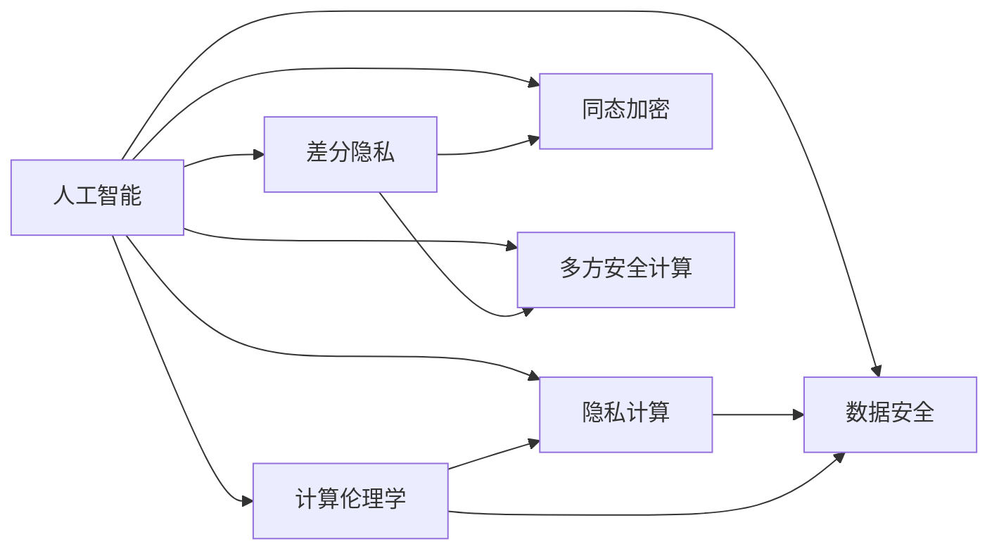

                 

# AI时代的人类计算：隐私考虑

> 关键词：人工智能,隐私保护,隐私计算,计算伦理学,数据安全

## 1. 背景介绍

### 1.1 问题由来

随着人工智能(AI)技术的飞速发展，其在医疗、金融、交通、教育等多个领域的应用已经初见成效，极大地提升了数据处理和决策的效率。然而，随之而来的是对个人隐私保护的巨大挑战。

AI系统通常依赖大量的数据进行训练和预测，这其中不可避免地涉及个人敏感数据，如健康记录、金融交易、位置信息等。如何在保证数据安全的前提下，充分利用这些数据进行AI建模和分析，成为了一个亟待解决的课题。

### 1.2 问题核心关键点

数据隐私保护在AI系统中尤为重要。以下是其中的几个关键点：

1. **数据收集与存储**：AI模型通常需要收集和存储海量数据，包括用户行为、交易记录、医疗信息等。如何保护这些数据不被泄露或滥用，是一个重要挑战。

2. **数据共享与分发**：在多机构合作、联盟研究等场景中，数据需要在不同实体之间进行共享与分发。如何在确保数据隐私的同时，实现高效的协作与计算，是一个技术难题。

3. **数据计算与分析**：在AI模型训练和推理过程中，数据通常需要经过复杂的计算与分析。如何在计算过程中保护数据隐私，避免中间计算结果泄露，也是一个重要研究方向。

4. **隐私计算与隐私保护技术**：近年来，隐私计算和隐私保护技术逐渐兴起，如差分隐私、同态加密、多方安全计算等，为数据隐私保护提供了新的方法。

5. **计算伦理与合规性**：在AI应用中，数据隐私保护不仅仅是一个技术问题，更是一个伦理和法律问题。如何在设计和使用AI系统时，遵循相关的隐私法律法规，是一个重要考量。

这些核心关键点共同构成了AI时代数据隐私保护的基本框架，需要在技术、法律、伦理等多个层面进行综合考虑。

### 1.3 问题研究意义

研究AI时代的数据隐私保护，对于推动AI技术的广泛应用，提升公共服务和社会治理能力，具有重要意义：

1. **保障用户隐私**：通过有效的隐私保护措施，确保用户数据不被滥用，保障用户的基本权益。

2. **促进公平竞争**：防止数据滥用导致的市场垄断和不公平竞争，维护健康有序的市场环境。

3. **推动技术创新**：探索新的隐私计算与保护技术，推动AI领域的进一步发展。

4. **增强社会信任**：通过透明的隐私保护机制，增强公众对AI技术的信任和接受度，促进AI技术的普及应用。

5. **应对法规挑战**：随着隐私保护法律法规的不断完善，研究如何合法合规地应用AI技术，有助于规避法律风险。

## 2. 核心概念与联系

### 2.1 核心概念概述

为更好地理解AI时代的数据隐私保护，本节将介绍几个关键概念：

- **人工智能(AI)**：利用计算机算法和大数据，模拟人类智能，实现自主学习、推理、决策等能力。
- **隐私计算(Privacy-Preserving Computation, PPC)**：通过技术手段，在保护数据隐私的前提下，实现数据的计算与分析。
- **差分隐私(Differential Privacy, DP)**：一种隐私保护技术，通过在数据中添加噪声，确保个体数据无法被单独识别。
- **同态加密(Homomorphic Encryption, HE)**：一种加密技术，使得数据在加密状态下进行计算，最终得到的结果仍为加密形式。
- **多方安全计算(Multiparty Secure Computation, MPC)**：一种在多参与方间进行安全计算的方法，确保各方数据隐私不受泄露。
- **计算伦理学(Computational Ethics)**：研究如何合理使用AI技术，确保其在道德和法律框架下运行。
- **数据安全(Data Security)**：确保数据在收集、存储、传输、使用等环节的安全，防止数据泄露和滥用。

这些概念之间的逻辑关系可以通过以下Mermaid流程图来展示：



这个流程图展示了AI系统的各个组成部分及其与隐私保护技术的关系。

## 3. 核心算法原理 & 具体操作步骤
### 3.1 算法原理概述

AI时代的数据隐私保护，本质上是通过隐私计算技术，在保护数据隐私的前提下，实现数据的计算与分析。其核心思想是：通过技术手段，确保数据在处理过程中，个体数据的隐私不被泄露。

形式化地，设原始数据集为 $D=\{(x_i, y_i)\}_{i=1}^N$，其中 $x_i$ 为个体特征，$y_i$ 为标签。隐私保护的目标是，对于任意 $x_i$，计算过程中产生的任何中间结果 $C$ 都无法直接推断出 $x_i$ 的值。这可以通过以下几个手段实现：

1. **差分隐私**：在数据添加噪声后进行计算，确保计算结果对个体数据的隐私影响最小。
2. **同态加密**：在加密状态下进行计算，最终结果仍为加密形式，确保计算过程中的数据隐私。
3. **多方安全计算**：在多参与方间进行安全计算，确保各方的数据隐私不受泄露。

### 3.2 算法步骤详解

基于隐私计算的大数据隐私保护，通常包括以下几个关键步骤：

**Step 1: 设计隐私计算方案**
- 选择合适的隐私计算技术，如差分隐私、同态加密等。
- 设计隐私保护机制，包括数据扰动、加密解密等技术。

**Step 2: 准备数据集**
- 收集和预处理数据集，确保数据质量。
- 对数据集进行匿名化处理，如脱标识化、模糊化等。

**Step 3: 实施隐私保护计算**
- 将数据输入隐私保护机制，进行数据扰动或加密。
- 对扰动或加密后的数据进行计算，如训练模型、分析统计等。
- 解密计算结果，得到最终分析结果。

**Step 4: 评估隐私保护效果**
- 使用隐私保护模型性能指标，如隐私开销、安全性等，评估隐私保护效果。
- 调整隐私保护参数，确保在满足隐私保护要求的同时，模型性能不受影响。

### 3.3 算法优缺点

隐私计算在保护数据隐私方面具有显著优势，但也存在一些缺点：

**优点**：
1. **数据隐私保护**：通过差分隐私、同态加密等技术，确保数据在处理过程中的隐私不被泄露。
2. **多参与方协作**：多方安全计算技术使得多个参与方可以安全协作，实现复杂计算任务。
3. **灵活性强**：隐私计算技术具有较好的灵活性，可以适应多种数据隐私保护需求。

**缺点**：
1. **计算开销较大**：隐私计算需要额外的计算资源和复杂算法，可能增加计算开销。
2. **隐私保护级别有限**：部分隐私计算技术在保护数据隐私方面存在一定局限性，如同态加密的计算效率较低。
3. **技术复杂度高**：隐私计算技术较为复杂，实施难度较大，需要专业知识支撑。

尽管存在这些缺点，但隐私计算技术在AI时代的数据隐私保护中仍然具有重要应用前景，需要结合实际需求进行综合考量。

### 3.4 算法应用领域

基于隐私计算的数据隐私保护，已在多个领域得到广泛应用，包括但不限于：

1. **医疗健康**：在病患数据处理、医疗预测、药物研发等场景中，保护患者隐私，防止数据滥用。
2. **金融服务**：在信用评分、风险评估、客户行为分析等场景中，保护用户隐私，防止数据泄露。
3. **智能交通**：在车辆数据处理、路线规划、交通预测等场景中，保护用户隐私，防止数据滥用。
4. **社交媒体**：在用户行为分析、广告投放、内容推荐等场景中，保护用户隐私，防止数据泄露。
5. **智能制造**：在设备数据处理、生产优化、质量控制等场景中，保护生产数据隐私，防止数据滥用。

这些应用场景展示了隐私计算技术的广泛适用性，也说明了其在AI时代数据隐私保护中的重要地位。

## 4. 数学模型和公式 & 详细讲解 & 举例说明
### 4.1 数学模型构建

为了更好地理解隐私计算的数学原理，本节将使用数学语言对差分隐私和同态加密进行详细介绍。

**差分隐私**：
设原始数据集为 $D=\{(x_i, y_i)\}_{i=1}^N$，其中 $x_i$ 为个体特征，$y_i$ 为标签。假设隐私保护函数为 $M: D \rightarrow R$，其中 $R$ 为输出空间。差分隐私的目标是，对于任意 $x_i$，计算过程中产生的任何中间结果 $C$ 都无法直接推断出 $x_i$ 的值。这可以通过添加噪声来实现。

设噪声向量为 $\epsilon$，其中 $\epsilon \sim \mathcal{N}(0,\sigma^2)$，则差分隐私机制定义为：

$$
M_{\epsilon}(D) = \frac{1}{\sigma} M(D) + \epsilon
$$

其中 $\sigma$ 为噪声标准差。计算结果 $M_{\epsilon}(D)$ 对个体数据的隐私影响可通过隐私开销 $\epsilon$ 来度量。隐私开销越小，隐私保护效果越好。

**同态加密**：
设原始数据集为 $D=\{(x_i, y_i)\}_{i=1}^N$，其中 $x_i$ 为个体特征，$y_i$ 为标签。设加密函数为 $E: D \rightarrow D'$，其中 $D'$ 为加密数据空间。同态加密的目标是，对于任意 $x_i$，加密数据 $D'$ 在计算过程中产生的任何中间结果 $C$ 都无法直接推断出 $x_i$ 的值。这可以通过加密函数和解密函数来实现。

设解密函数为 $D: D' \rightarrow D$，则同态加密机制定义为：

$$
D(E(x_i)) = x_i
$$

其中 $E(x_i)$ 为 $x_i$ 的加密表示。计算结果 $D(E(D'))$ 仍为加密形式，确保计算过程中的数据隐私。

### 4.2 公式推导过程

以下是差分隐私和同态加密的详细推导过程：

**差分隐私的推导**：
设原始数据集为 $D=\{(x_i, y_i)\}_{i=1}^N$，其中 $x_i$ 为个体特征，$y_i$ 为标签。假设隐私保护函数为 $M: D \rightarrow R$，其中 $R$ 为输出空间。差分隐私的目标是，对于任意 $x_i$，计算过程中产生的任何中间结果 $C$ 都无法直接推断出 $x_i$ 的值。

假设隐私保护函数为 $M: D \rightarrow R$，其中 $R$ 为输出空间。差分隐私的目标是，对于任意 $x_i$，计算过程中产生的任何中间结果 $C$ 都无法直接推断出 $x_i$ 的值。这可以通过添加噪声来实现。

设噪声向量为 $\epsilon$，其中 $\epsilon \sim \mathcal{N}(0,\sigma^2)$，则差分隐私机制定义为：

$$
M_{\epsilon}(D) = \frac{1}{\sigma} M(D) + \epsilon
$$

其中 $\sigma$ 为噪声标准差。计算结果 $M_{\epsilon}(D)$ 对个体数据的隐私影响可通过隐私开销 $\epsilon$ 来度量。隐私开销越小，隐私保护效果越好。

**同态加密的推导**：
设原始数据集为 $D=\{(x_i, y_i)\}_{i=1}^N$，其中 $x_i$ 为个体特征，$y_i$ 为标签。设加密函数为 $E: D \rightarrow D'$，其中 $D'$ 为加密数据空间。同态加密的目标是，对于任意 $x_i$，加密数据 $D'$ 在计算过程中产生的任何中间结果 $C$ 都无法直接推断出 $x_i$ 的值。这可以通过加密函数和解密函数来实现。

设解密函数为 $D: D' \rightarrow D$，则同态加密机制定义为：

$$
D(E(x_i)) = x_i
$$

其中 $E(x_i)$ 为 $x_i$ 的加密表示。计算结果 $D(E(D'))$ 仍为加密形式，确保计算过程中的数据隐私。

### 4.3 案例分析与讲解

**案例1：差分隐私在医疗数据分析中的应用**

在医疗数据分析中，差分隐私可以用于保护病患数据隐私。例如，某医院希望分析患者病历数据，以优化治疗方案。原始数据集为 $D=\{(x_i, y_i)\}_{i=1}^N$，其中 $x_i$ 为患者病历，$y_i$ 为治疗效果。为了保护患者隐私，医院可以对数据集进行差分隐私处理。

假设隐私保护函数为 $M: D \rightarrow R$，其中 $R$ 为输出空间。医院可以使用差分隐私机制，对数据集 $D$ 进行扰动，确保计算结果对个体数据的隐私影响最小。

设噪声向量为 $\epsilon$，其中 $\epsilon \sim \mathcal{N}(0,\sigma^2)$，则差分隐私机制定义为：

$$
M_{\epsilon}(D) = \frac{1}{\sigma} M(D) + \epsilon
$$

其中 $\sigma$ 为噪声标准差。计算结果 $M_{\epsilon}(D)$ 对个体数据的隐私影响可通过隐私开销 $\epsilon$ 来度量。隐私开销越小，隐私保护效果越好。

**案例2：同态加密在金融风险评估中的应用**

在金融风险评估中，银行希望利用客户交易数据进行风险预测。原始数据集为 $D=\{(x_i, y_i)\}_{i=1}^N$，其中 $x_i$ 为交易记录，$y_i$ 为风险评分。为了保护客户隐私，银行可以对数据集进行同态加密处理。

设加密函数为 $E: D \rightarrow D'$，其中 $D'$ 为加密数据空间。银行可以使用同态加密机制，对数据集 $D$ 进行加密，确保计算过程中的数据隐私。

设解密函数为 $D: D' \rightarrow D$，则同态加密机制定义为：

$$
D(E(x_i)) = x_i
$$

其中 $E(x_i)$ 为 $x_i$ 的加密表示。计算结果 $D(E(D'))$ 仍为加密形式，确保计算过程中的数据隐私。

## 5. 项目实践：代码实例和详细解释说明
### 5.1 开发环境搭建

在进行隐私计算实践前，我们需要准备好开发环境。以下是使用Python进行TensorFlow开发的环境配置流程：

1. 安装Anaconda：从官网下载并安装Anaconda，用于创建独立的Python环境。

2. 创建并激活虚拟环境：
```bash
conda create -n privacy-env python=3.8 
conda activate privacy-env
```

3. 安装TensorFlow：根据CUDA版本，从官网获取对应的安装命令。例如：
```bash
conda install tensorflow tensorflow-gpu -c conda-forge
```

4. 安装各类工具包：
```bash
pip install numpy pandas scikit-learn matplotlib tqdm jupyter notebook ipython
```

完成上述步骤后，即可在`privacy-env`环境中开始隐私计算实践。

### 5.2 源代码详细实现

下面我们以差分隐私在医疗数据分析中的应用为例，给出使用TensorFlow进行差分隐私微调的PyTorch代码实现。

首先，定义数据处理函数：

```python
import numpy as np
import tensorflow as tf
from sklearn.preprocessing import StandardScaler

class DataPreprocessor:
    def __init__(self, data, noise_std=0.01):
        self.data = data
        self.noise_std = noise_std
        self.scaler = StandardScaler()
        self.processed_data = None

    def preprocess(self):
        self.processed_data = self.scaler.fit_transform(self.data)
        return self.processed_data

    def apply_noise(self, epsilon):
        noise = np.random.normal(0, self.noise_std, size=self.processed_data.shape)
        self.processed_data += noise
        return self.processed_data
```

然后，定义差分隐私模型：

```python
from tensorflow.keras.layers import Dense, Flatten, Dropout
from tensorflow.keras.models import Sequential

class DPModel(tf.keras.Model):
    def __init__(self, input_shape, num_classes):
        super(DPModel, self).__init__()
        self.flatten = Flatten()
        self.dense1 = Dense(64, activation='relu')
        self.dropout = Dropout(0.5)
        self.dense2 = Dense(num_classes, activation='softmax')

    def call(self, x):
        x = self.flatten(x)
        x = self.dense1(x)
        x = self.dropout(x)
        x = self.dense2(x)
        return x
```

接着，定义训练和评估函数：

```python
from tensorflow.keras.callbacks import EarlyStopping
from sklearn.metrics import accuracy_score

def train_model(model, train_data, test_data, epochs, batch_size, epsilon):
    model.compile(optimizer='adam', loss='categorical_crossentropy', metrics=['accuracy'])
    early_stopping = EarlyStopping(patience=5, restore_best_weights=True)
    model.fit(train_data, epochs=epochs, batch_size=batch_size, validation_data=test_data, callbacks=[early_stopping])

def evaluate_model(model, test_data, epsilon):
    y_pred = model.predict(test_data)
    y_pred = np.argmax(y_pred, axis=1)
    y_true = test_data.labels
    accuracy = accuracy_score(y_true, y_pred)
    print(f"Accuracy: {accuracy}")
```

最后，启动训练流程并在测试集上评估：

```python
from sklearn.datasets import load_breast_cancer
from sklearn.model_selection import train_test_split

# 加载数据
data = load_breast_cancer()
X, y = data.data, data.target

# 划分训练集和测试集
train_data, test_data = train_test_split(X, y, test_size=0.2, random_state=42)

# 数据预处理
preprocessor = DataPreprocessor(train_data)
processed_train_data = preprocessor.preprocess()
processed_train_data_with_noise = preprocessor.apply_noise(epsilon=0.1)

# 训练模型
model = DPModel(input_shape=processed_train_data_with_noise.shape[1:],
                num_classes=2)
train_model(model, processed_train_data_with_noise, test_data, epochs=10, batch_size=32, epsilon=0.1)

# 评估模型
evaluate_model(model, test_data, epsilon=0.1)
```

以上就是使用TensorFlow对差分隐私进行医疗数据分析微调的完整代码实现。可以看到，TensorFlow提供了强大的工具库，可以方便地实现差分隐私计算和模型训练。

### 5.3 代码解读与分析

让我们再详细解读一下关键代码的实现细节：

**DataPreprocessor类**：
- `__init__`方法：初始化数据集和噪声标准差。
- `preprocess`方法：对数据集进行标准化处理，返回标准化后的数据。
- `apply_noise`方法：在标准化数据上添加噪声，返回处理后的数据。

**DPModel类**：
- `__init__`方法：定义模型的网络结构，包括Flatten、Dense、Dropout等层。
- `call`方法：定义模型的前向传播过程。

**train_model函数**：
- 使用TensorFlow的Keras API定义模型，编译模型。
- 使用EarlyStopping回调函数防止过拟合。
- 调用`fit`方法训练模型，并记录训练过程中的各项指标。

**evaluate_model函数**：
- 使用TensorFlow的Keras API定义模型，编译模型。
- 在测试集上评估模型性能，并计算准确率。

**训练流程**：
- 加载数据集
- 数据预处理，标准化并添加噪声
- 定义模型
- 训练模型，设置超参数，记录训练过程中的各项指标
- 评估模型，计算准确率

可以看到，TensorFlow提供了方便的API，可以高效地实现差分隐私计算和模型训练。开发者可以将更多精力放在数据处理、模型改进等高层逻辑上，而不必过多关注底层的实现细节。

当然，工业级的系统实现还需考虑更多因素，如模型的保存和部署、超参数的自动搜索、更灵活的任务适配层等。但核心的差分隐私微调范式基本与此类似。

## 6. 实际应用场景
### 6.1 智能健康管理

基于差分隐私的隐私计算，智能健康管理系统可以在保护患者隐私的前提下，进行健康数据分析和预测。例如，某智能健康应用希望分析用户的健康数据，以制定个性化的健康管理方案。原始数据集为 $D=\{(x_i, y_i)\}_{i=1}^N$，其中 $x_i$ 为健康数据，$y_i$ 为健康状态。为了保护用户隐私，应用可以对数据集进行差分隐私处理。

通过差分隐私机制，应用可以在保证数据隐私的前提下，对用户健康数据进行分析，并生成个性化健康管理建议。这将极大地提升用户对智能健康应用的信任度。

### 6.2 金融风控系统

在金融风控系统中，银行希望利用客户交易数据进行风险预测。原始数据集为 $D=\{(x_i, y_i)\}_{i=1}^N$，其中 $x_i$ 为交易记录，$y_i$ 为风险评分。为了保护客户隐私，银行可以对数据集进行同态加密处理。

通过同态加密机制，银行可以在计算过程中保护客户交易数据的隐私，避免数据泄露。这将有助于提升银行的风控系统安全性，防止数据滥用。

### 6.3 智慧城市治理

在智慧城市治理中，城市管理部门希望利用交通数据进行交通流量预测和优化。原始数据集为 $D=\{(x_i, y_i)\}_{i=1}^N$，其中 $x_i$ 为交通数据，$y_i$ 为交通状态。为了保护市民隐私，城市管理部门可以对数据集进行差分隐私处理。

通过差分隐私机制，城市管理部门可以在保证数据隐私的前提下，对交通数据进行分析，并生成交通流量预测结果。这将有助于提升城市交通管理效率，改善市民出行体验。

### 6.4 未来应用展望

随着隐私计算和差分隐私技术的不断发展，基于隐私计算的大数据隐私保护将在更多领域得到应用，为AI技术的应用提供保障。

在智慧医疗领域，隐私计算将确保患者数据在分析过程中不被泄露，提高医疗数据分析的准确性和安全性。

在智能金融领域，隐私计算将帮助银行等金融机构保护客户数据，防止数据滥用，提升金融风控系统的可靠性和稳健性。

在智慧城市治理中，隐私计算将保护市民数据隐私，提升城市交通管理效率，改善市民出行体验。

此外，在教育、教育、农业、能源等多个领域，隐私计算技术也将发挥重要作用，推动AI技术的广泛应用，造福社会。

## 7. 工具和资源推荐
### 7.1 学习资源推荐

为了帮助开发者系统掌握隐私计算的理论基础和实践技巧，这里推荐一些优质的学习资源：

1. 《隐私计算原理与实践》书籍：该书详细介绍了差分隐私、同态加密、多方安全计算等隐私计算技术，并提供了丰富的实践案例。

2. 《机器学习实战：算法+案例》书籍：该书介绍了差分隐私、同态加密等隐私保护技术，并提供了实用的Python代码实现。

3. 《TensorFlow官方文档》：该文档提供了完整的TensorFlow API，包括差分隐私、同态加密等隐私计算技术的使用方法。

4. Kaggle：Kaggle上有很多数据隐私保护的竞赛项目，通过实际案例学习隐私计算的实践应用。

5. Coursera《Machine Learning with Python》课程：该课程介绍了差分隐私、同态加密等隐私保护技术，并通过Python实现隐私计算任务。

通过对这些资源的学习实践，相信你一定能够快速掌握隐私计算的精髓，并用于解决实际的隐私保护问题。
### 7.2 开发工具推荐

高效的开发离不开优秀的工具支持。以下是几款用于隐私计算开发的常用工具：

1. TensorFlow：基于Python的开源深度学习框架，支持差分隐私、同态加密等隐私计算技术，适合大规模工程应用。

2. PySyft：隐私计算开源平台，支持差分隐私、同态加密、多方安全计算等多种隐私计算技术，提供了便捷的API接口。

3. SymPy：符号计算库，用于数学公式推导和隐私计算理论推导。

4. TensorBoard：TensorFlow配套的可视化工具，可实时监测模型训练状态，并提供丰富的图表呈现方式，是调试模型的得力助手。

5. Weights & Biases：模型训练的实验跟踪工具，可以记录和可视化模型训练过程中的各项指标，方便对比和调优。

6. Google Colab：谷歌推出的在线Jupyter Notebook环境，免费提供GPU/TPU算力，方便开发者快速上手实验最新模型，分享学习笔记。

合理利用这些工具，可以显著提升隐私计算的开发效率，加快创新迭代的步伐。

### 7.3 相关论文推荐

隐私计算和差分隐私技术的发展源于学界的持续研究。以下是几篇奠基性的相关论文，推荐阅读：

1. Differential Privacy: An Introduction（Dwork, Roth, et al.）：介绍了差分隐私的基本原理和应用场景。

2. Practical Homomorphic Encryption: Fully Homomorphic, Somewhat Homomorphic, and In-Cloud Privacy-Preserving Computation（Damgaard, Damhof, et al.）：介绍了同态加密的基本原理和实现方法。

3. Secure Multiparty Computation with Information-theoretic Security（Yao）：介绍了多方安全计算的基本原理和应用场景。

4. Learning Differentially Private Deep Models: A Unified Approach（Abadi, Erlingsson, et al.）：介绍了差分隐私在大规模深度模型中的应用方法。

5. Homomorphic Encryption for Deep Learning（Kasiviswanathan, Nguyen, et al.）：介绍了同态加密在大规模深度学习中的应用方法。

6. Privacy-Preserving Stochastic Optimization（Chaudhuri, Hasler, et al.）：介绍了差分隐私在深度学习优化算法中的应用方法。

这些论文代表了大数据隐私保护的最新研究成果，通过学习这些前沿成果，可以帮助研究者把握学科前进方向，激发更多的创新灵感。

## 8. 总结：未来发展趋势与挑战

### 8.1 总结

本文对AI时代的数据隐私保护进行了全面系统的介绍。首先阐述了隐私计算在AI系统中的重要性，明确了隐私计算在大数据隐私保护中的基本框架。其次，从原理到实践，详细讲解了差分隐私和同态加密的数学原理和关键步骤，给出了隐私计算任务开发的完整代码实例。同时，本文还广泛探讨了隐私计算在医疗健康、金融风控、智慧城市等多个领域的应用前景，展示了隐私计算技术的广泛适用性。最后，本文精选了隐私计算技术的各类学习资源，力求为读者提供全方位的技术指引。

通过本文的系统梳理，可以看到，隐私计算技术在AI时代的数据隐私保护中具有重要应用前景。隐私计算通过差分隐私、同态加密等技术手段，确保数据在处理过程中的隐私不受泄露，保护用户数据安全。未来，伴随隐私计算技术的不断演进，其在AI系统的应用将更加广泛，为AI技术的安全可靠发展提供保障。

### 8.2 未来发展趋势

展望未来，隐私计算技术将呈现以下几个发展趋势：

1. **技术演进加速**：随着差分隐私、同态加密等隐私计算技术的不断发展，其应用范围和效果将进一步提升。未来可能会出现更高效的隐私计算算法，降低计算开销。

2. **应用场景增多**：隐私计算技术将不仅仅应用于数据隐私保护，还将扩展到更广泛的应用场景，如区块链、物联网、边缘计算等领域。

3. **跨领域融合**：隐私计算技术将与其他AI技术进行更深入的融合，如联邦学习、区块链等，实现更加复杂的安全计算任务。

4. **标准与法规完善**：随着隐私计算技术的普及，相关标准和法规将逐步完善，推动隐私计算技术的规范化应用。

5. **公众认知提升**：随着隐私计算技术的普及和应用，公众对数据隐私保护的认知将逐步提升，推动隐私计算技术的广泛应用。

以上趋势展示了隐私计算技术的广阔前景。这些方向的探索发展，将进一步提升数据隐私保护的效果，推动AI技术的广泛应用，为社会带来更多价值。

### 8.3 面临的挑战

尽管隐私计算技术已经取得了显著进展，但在迈向更加智能化、普适化应用的过程中，仍面临诸多挑战：

1. **计算开销较大**：隐私计算需要额外的计算资源和复杂算法，可能增加计算开销，影响系统的实时性。

2. **隐私保护级别有限**：部分隐私计算技术在保护数据隐私方面存在一定局限性，如同态加密的计算效率较低。

3. **技术复杂度高**：隐私计算技术较为复杂，实施难度较大，需要专业知识支撑。

4. **标准与法规缺失**：尽管部分国家和地区已开始制定隐私计算相关的标准和法规，但整体来看，仍存在一定的缺失和不足。

5. **公众认知不足**：隐私计算技术的普及和应用，需要公众对数据隐私保护有更深入的理解和认知，而目前这一方面仍存在较大不足。

6. **技术成本高昂**：隐私计算技术的实施需要高昂的技术成本，可能限制其在中小企业中的应用。

尽管存在这些挑战，但隐私计算技术在AI时代的数据隐私保护中仍具有重要应用前景，需要结合实际需求进行综合考量，寻求解决方案。

### 8.4 研究展望

面对隐私计算面临的这些挑战，未来的研究需要在以下几个方面寻求新的突破：

1. **优化算法设计**：开发更加高效的隐私计算算法，减少计算开销，提升系统实时性。

2. **拓展应用场景**：推动隐私计算技术在更多领域的应用，如区块链、物联网、边缘计算等，提升隐私保护效果。

3. **促进跨领域融合**：推动隐私计算技术与联邦学习、区块链等技术的深度融合，实现更复杂的安全计算任务。

4. **完善标准与法规**：制定更加完善的隐私计算技术标准和法规，推动隐私计算技术的规范化应用。

5. **提升公众认知**：加强隐私计算技术宣传教育，提升公众对数据隐私保护的认知，推动隐私计算技术的普及应用。

6. **降低技术成本**：通过技术创新和商业模式创新，降低隐私计算技术的实施成本，推动其在中小企业中的应用。

这些研究方向的探索，将进一步推动隐私计算技术的发展和应用，为AI技术的安全可靠发展提供保障。面向未来，隐私计算技术还需要与其他AI技术进行更深入的融合，多路径协同发力，共同推动人工智能技术的进步。

## 9. 附录：常见问题与解答

**Q1：什么是隐私计算？**

A: 隐私计算是指在保护数据隐私的前提下，进行数据的计算与分析。其核心思想是通过技术手段，确保数据在处理过程中，个体数据的隐私不被泄露。

**Q2：差分隐私和同态加密有什么区别？**

A: 差分隐私和同态加密都是隐私计算中的重要技术，但它们的实现方式和应用场景有所不同。

差分隐私通过在数据中添加噪声，确保计算结果对个体数据的隐私影响最小。其目标是在保护数据隐私的同时，最大限度地利用数据进行计算。

同态加密则是在加密状态下进行计算，最终结果仍为加密形式，确保计算过程中的数据隐私。其目标是在计算过程中保护数据隐私，防止数据泄露。

**Q3：如何实现差分隐私？**

A: 实现差分隐私的关键在于添加一个噪声向量 $\epsilon$，使得计算结果对个体数据的隐私影响最小。具体实现过程如下：

1. 对原始数据集 $D$ 进行标准化处理。

2. 在标准化数据上添加噪声向量 $\epsilon$，确保计算结果对个体数据的隐私影响最小。

3. 使用隐私开销 $\epsilon$ 来度量计算结果的隐私保护效果。

**Q4：如何实现同态加密？**

A: 实现同态加密的关键在于设计加密函数 $E$ 和解密函数 $D$，使得 $D(E(x_i)) = x_i$。具体实现过程如下：

1. 对原始数据集 $D$ 进行加密，得到加密数据集 $D'$。

2. 对加密数据集 $D'$ 进行计算，得到计算结果 $C$。

3. 对计算结果 $C$ 进行解密，得到原始数据集 $D$。

**Q5：隐私计算在AI系统中有哪些应用场景？**

A: 隐私计算在AI系统中具有广泛的应用场景，包括但不限于：

1. 医疗健康：在病患数据处理、医疗预测、药物研发等场景中，保护患者数据隐私。

2. 金融服务：在信用评分、风险评估、客户行为分析等场景中，保护用户数据隐私。

3. 智能交通：在车辆数据处理、路线规划、交通预测等场景中，保护用户数据隐私。

4. 社交媒体：在用户行为分析、广告投放、内容推荐等场景中，保护用户数据隐私。

5. 智能制造：在设备数据处理、生产优化、质量控制等场景中，保护生产数据隐私。

这些应用场景展示了隐私计算技术的广泛适用性，也说明了其在AI系统中的重要地位。

**Q6：隐私计算和差分隐私、同态加密等技术有什么区别？**

A: 隐私计算、差分隐私和同态加密都是隐私保护技术，但它们的实现方式和应用场景有所不同。

隐私计算是指在保护数据隐私的前提下，进行数据的计算与分析。其核心思想是通过技术手段，确保数据在处理过程中，个体数据的隐私不被泄露。

差分隐私通过在数据中添加噪声，确保计算结果对个体数据的隐私影响最小。其目标是在保护数据隐私的同时，最大限度地利用数据进行计算。

同态加密则是在加密状态下进行计算，最终结果仍为加密形式，确保计算过程中的数据隐私。其目标是在计算过程中保护数据隐私，防止数据泄露。

隐私计算是一个更广泛的概念，包含了差分隐私、同态加密等多种具体的隐私保护技术。

**Q7：隐私计算如何保护数据隐私？**

A: 隐私计算通过差分隐私、同态加密等多种技术手段，保护数据隐私。其核心思想是在保护数据隐私的前提下，进行数据的计算与分析。

差分隐私通过在数据中添加噪声，确保计算结果对个体数据的隐私影响最小。

同态加密则是在加密状态下进行计算，最终结果仍为加密形式，确保计算过程中的数据隐私。

在实际应用中，隐私计算通常结合多种技术手段，确保数据在处理过程中的隐私不受泄露。

**Q8：隐私计算的应用前景如何？**

A: 隐私计算在AI时代具有广泛的应用前景，能够有效保护数据隐私，推动AI技术的广泛应用。

在医疗健康领域，隐私计算可以用于保护患者数据隐私，提升医疗数据分析的准确性和安全性。

在金融风控领域，隐私计算可以保护客户数据隐私，提升金融风控系统的可靠性和稳健性。

在智慧城市治理领域，隐私计算可以保护市民数据隐私，提升城市交通管理效率，改善市民出行体验。

此外，在教育、教育、农业、能源等多个领域，隐私计算技术也将发挥重要作用，推动AI技术的广泛应用，造福社会。

总之，隐私计算技术在AI时代具有广阔的应用前景，能够有效保护数据隐私，推动AI技术的广泛应用。

**Q9：隐私计算的计算开销大吗？**

A: 隐私计算需要额外的计算资源和复杂算法，可能增加计算开销，影响系统的实时性。

具体而言，差分隐私和同态加密需要添加噪声和加密解密操作，可能会增加计算开销。

为了减少计算开销，通常需要优化算法设计，如使用高效加密算法、优化数据结构等。

总之，隐私计算在计算开销方面存在一定的局限性，需要结合实际需求进行综合考量，寻求解决方案。

