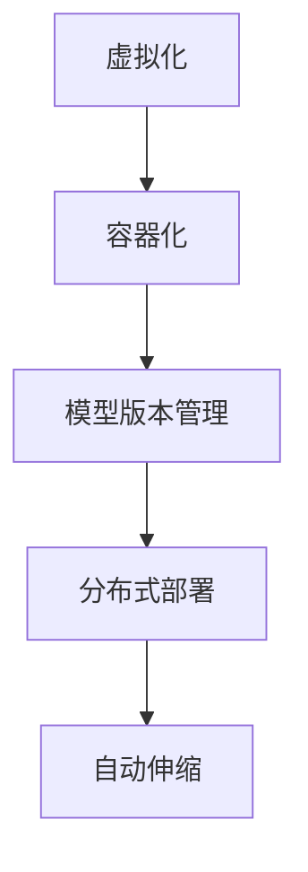

                 

## 1. 背景介绍

### 1.1 问题由来
在当前人工智能(AI)技术迅猛发展的时代，模型的快速迭代和版本更新已经成为推动技术进步的关键因素。传统的数据模型训练和部署方法，往往难以适应快速变化的应用场景，给企业带来诸多不便。尤其是在AI模型性能和功能需求不断提升的背景下，如何高效、灵活地部署AI模型，成为众多企业关注的焦点。

为了应对这一挑战，Lepton AI推出了多版本并行部署方案，利用虚拟化和容器化技术，构建灵活、可扩展的AI模型部署环境。该方案可以有效降低模型部署和维护成本，提升模型版本更新的效率，满足企业在不同应用场景下对AI模型的多样化需求。

### 1.2 问题核心关键点
Lepton AI的多版本并行部署方案，本质上是一种基于虚拟化和容器化技术的AI模型部署架构。该架构通过创建多个虚拟实例，将不同版本的AI模型封装在对应的容器中，实现了多版本并行运行和快速切换。其主要优点包括：
- 灵活部署：支持多种AI模型类型，根据需求快速部署不同版本的模型。
- 无缝切换：可在不同应用场景间快速切换不同版本的AI模型，确保业务连续性。
- 高效管理：通过统一的管理平台，对多个AI模型实例进行统一监控和调度，提升部署效率。
- 成本控制：避免大规模硬件更换和软件重构，降低模型部署和维护成本。

### 1.3 问题研究意义
在AI模型的快速迭代和版本更新过程中，采用灵活、高效的部署方案，对提升企业AI能力、优化运营效率具有重要意义：

1. 提升业务响应速度。多版本并行部署可以快速应对业务需求的变化，及时部署新版本的AI模型，加速业务创新和迭代。
2. 降低技术风险。通过独立部署不同版本的模型，减少了因模型更新带来的技术风险，提高了系统的稳定性和可靠性。
3. 优化资源利用。通过虚拟化和容器化技术，提升了AI模型的资源利用率，降低了部署和维护成本。
4. 促进技术创新。灵活的部署机制，促进了AI模型的多样化和创新，有助于企业探索更多前沿技术方向。
5. 强化安全保障。多版本并行部署提供了模型隔离和数据隔离机制，增强了系统的安全性，降低了信息泄露风险。

## 2. 核心概念与联系

### 2.1 核心概念概述

为更好地理解Lepton AI的多版本并行部署方案，本节将介绍几个密切相关的核心概念：

- 虚拟化(Virtualization)：通过虚拟技术，将一台物理硬件设备虚拟成多台逻辑设备，提供独立的运行环境。虚拟化技术可以提高资源利用率，增强系统的扩展性。
- 容器化(Containerization)：将应用程序及其依赖打包到一个轻量级的、可移植的容器镜像中。容器化技术可以简化应用程序的部署和管理，提高系统的灵活性。
- 模型版本管理(Model Versioning)：记录和管理不同版本的AI模型，确保模型的可追溯性和稳定性。
- 分布式部署(Distributed Deployment)：将AI模型部署到多个物理或虚拟节点上，实现负载均衡和弹性扩展。
- 自动伸缩(Auto-Scaling)：根据系统负载和资源需求，自动调整部署的AI模型数量，提升系统的响应速度和资源利用率。

这些核心概念之间的逻辑关系可以通过以下Mermaid流程图来展示：



这个流程图展示了大模型多版本并行部署方案的核心概念及其之间的关系：

1. 虚拟化技术为容器化提供了运行环境。
2. 容器化技术为模型版本管理提供了灵活的部署机制。
3. 模型版本管理为分布式部署提供了有效的数据隔离和模型切换机制。
4. 分布式部署和自动伸缩技术，进一步提升了系统的可扩展性和资源利用率。

这些概念共同构成了Lepton AI多版本并行部署方案的框架，使其能够在多样化的应用场景中高效运行。

### 2.2 核心算法原理 & 具体操作步骤

Lepton AI的多版本并行部署方案，主要通过以下算法和步骤实现：

#### 3.1 算法原理概述

Lepton AI的多版本并行部署，本质上是一种基于虚拟化和容器化的动态资源管理技术。其核心思想是：通过创建多个虚拟实例，将不同版本的AI模型封装在对应的容器中，实时调整部署的模型数量和资源配置，以适应不同业务场景的需求。

具体来说，该方案包括以下几个关键步骤：

1. **模型封装与部署**：将不同版本的AI模型封装成独立的容器镜像，并部署到虚拟化环境中。
2. **模型实例管理**：通过统一的管理平台，监控每个模型实例的运行状态和性能指标，实时调整实例数量。
3. **流量分配与负载均衡**：根据实际业务流量和系统负载，动态分配请求到不同的模型实例，实现负载均衡。
4. **自动伸缩与资源优化**：根据流量变化自动调整资源配置，确保系统高效运行。

#### 3.2 算法步骤详解

下面详细讲解Lepton AI多版本并行部署方案的关键步骤：

**Step 1: 模型封装与部署**

1. **创建虚拟化环境**：在物理硬件上部署虚拟化平台（如KVM、VMware等），构建多个虚拟实例。
2. **构建容器镜像**：使用容器技术（如Docker）将不同版本的AI模型及其依赖打包成独立的容器镜像。
3. **部署模型实例**：将容器镜像部署到虚拟实例中，启动模型实例。

**Step 2: 模型实例管理**

1. **建立监控系统**：通过统一的管理平台（如Kubernetes、Rancher等），实时监控每个模型实例的运行状态和性能指标。
2. **实例管理与调度**：根据业务需求和系统负载，动态调整部署的模型实例数量和资源配置。
3. **日志记录与告警**：记录模型实例的日志和性能数据，设置告警规则，确保系统稳定运行。

**Step 3: 流量分配与负载均衡**

1. **配置路由规则**：根据实际业务流量，配置请求路由规则，将请求分配到不同的模型实例。
2. **实现负载均衡**：使用负载均衡器（如Nginx、HAProxy等），确保请求能够在不同实例间均匀分配，避免单点故障。
3. **监控流量变化**：实时监控业务流量和系统负载，动态调整实例数量和路由规则。

**Step 4: 自动伸缩与资源优化**

1. **设定自动伸缩策略**：根据业务需求和系统负载，设定自动伸缩策略，自动调整实例数量和资源配置。
2. **资源优化**：通过监控资源利用率，动态调整资源分配，优化系统的资源利用率。
3. **应对峰值流量**：在流量峰值期间，自动增加模型实例数量，确保系统稳定运行。

#### 3.3 算法优缺点

Lepton AI的多版本并行部署方案具有以下优点：
1. 灵活性高：支持多种AI模型类型，根据需求快速部署不同版本的模型。
2. 运行稳定：通过虚拟化和容器化技术，确保模型实例的隔离和稳定运行。
3. 成本控制：通过虚拟化和容器化技术，降低了模型部署和维护成本。
4. 性能优化：通过自动伸缩和负载均衡技术，提升了系统的响应速度和资源利用率。

同时，该方案也存在一定的局限性：
1. 复杂性高：方案涉及虚拟化、容器化、自动伸缩等多项技术，需要较深的技术储备。
2. 部署成本高：虚拟化和容器化环境搭建和维护需要一定的前期投资。
3. 扩展性受限：对于大规模模型部署和高并发业务场景，可能面临扩展瓶颈。
4. 维护难度大：多版本并行部署需要持续的监控和维护，增加了运维的复杂度。

尽管存在这些局限性，但就目前而言，Lepton AI的多版本并行部署方案，在大规模AI模型部署和快速迭代应用场景中，仍然具有较高的实用价值。

#### 3.4 算法应用领域

Lepton AI的多版本并行部署方案，适用于多个AI模型快速迭代和多样化应用场景，例如：

- 智能客服：多个智能客服系统需要根据用户流量动态调整实例数量，确保服务稳定。
- 推荐系统：不同版本的推荐算法需要根据业务需求快速切换，提升推荐效果。
- 自动驾驶：不同版本的自动驾驶模型需要根据行驶环境和传感器数据实时调整部署，确保安全。
- 金融风控：不同版本的风险评估模型需要根据市场波动实时调整部署，提升预测精度。
- 智能安防：不同版本的安防模型需要根据监控场景实时调整部署，提高识别准确率。

## 4. 数学模型和公式 & 详细讲解 & 举例说明

### 4.1 数学模型构建

Lepton AI的多版本并行部署方案，主要通过虚拟化和容器化技术实现。在数学模型上，可以引入排队系统理论来描述模型的部署与负载均衡过程。

假设系统中有$N$个模型实例，每个实例的响应时间为$T$，请求到达率为$\lambda$，则系统的平均响应时间$S$可以表示为：

$$
S = \frac{1}{N}\sum_{i=1}^N \left(T + \frac{1}{\lambda} \sum_{j=1}^N \frac{\lambda}{N} \right)
$$

根据系统状态的不同，可以采用不同的排队策略（如FCFS、MCQ、GQ等）来调整实例数量和资源配置，以优化系统的响应时间和资源利用率。

### 4.2 公式推导过程

以FCFS（First-Come-First-Served）排队策略为例，系统的平均响应时间可以表示为：

$$
S_{FCFS} = \frac{1}{N}\sum_{i=1}^N \left(T + \frac{1}{\lambda} \sum_{j=1}^N \frac{\lambda}{N} \right)
$$

根据公式，可以求解每个实例的平均响应时间和系统总响应时间，优化实例数量和资源配置，确保系统的高效运行。

### 4.3 案例分析与讲解

以智能客服系统为例，假设系统中有10个虚拟实例，每个实例的响应时间为5秒，请求到达率为每分钟100个。则系统的平均响应时间$S_{FCFS}$可以计算如下：

$$
S_{FCFS} = \frac{1}{10} \sum_{i=1}^{10} \left(5 + \frac{1}{100} \times 100 \right) = 6 \text{秒}
$$

根据公式，可以进一步优化实例数量和响应时间，以适应不同的业务场景和负载变化。

## 5. 项目实践：代码实例和详细解释说明

### 5.1 开发环境搭建

为了实现Lepton AI的多版本并行部署方案，需要进行以下环境搭建：

1. 安装虚拟化平台（如KVM）：在物理硬件上部署虚拟化平台，创建多个虚拟实例。
2. 安装容器化平台（如Docker）：在每个虚拟实例上部署容器化平台，用于模型实例的封装和部署。
3. 搭建统一管理平台（如Kubernetes）：用于监控和管理模型实例的运行状态和性能指标。
4. 配置负载均衡器（如Nginx）：确保请求能够在不同实例间均匀分配，实现负载均衡。
5. 配置自动伸缩器（如Haproxy）：根据业务需求和系统负载，自动调整实例数量和资源配置。

### 5.2 源代码详细实现

以下是一个简单的Lepton AI多版本并行部署示例代码，用于封装和部署两个版本的智能客服模型：

```python
# 导入必要的库
import docker
import kubernetes
import kubernetes.client

# 创建虚拟化环境
docker.DockerClient()

# 创建容器镜像
docker.DockerClient().create_image(
    repository="smart_customer_service:v1",
    image_data=b"智能客服模型v1的代码"
)

docker.DockerClient().create_image(
    repository="smart_customer_service:v2",
    image_data=b"智能客服模型v2的代码"
)

# 部署模型实例
docker.DockerClient().create_container(
    image="smart_customer_service:v1",
    name="service_v1"
)

docker.DockerClient().create_container(
    image="smart_customer_service:v2",
    name="service_v2"
)

# 配置Kubernetes集群
kubernetes.client.KubernetesClient()

# 创建Deployment
kubernetes.client.AppsV1Api().create_namespaces()
kubernetes.client.AppsV1Api().create_deployment(
    metadata={
        "name": "customer_service_deployment",
        "spec": {
            "replicas": 3,
            "selector": {
                "match_labels": {
                    "hello": "world"
                }
            },
            "template": {
                "metadata": {
                    "labels": {
                        "hello": "world"
                    }
                },
                "spec": {
                    "containers": [
                        {
                            "name": "hello-world",
                            "image": "hello-world:1.0",
                            "ports": [
                                {
                                    "container_port": 8080
                                }
                            ]
                        }
                    ]
                }
            }
        }
    }
)

# 配置负载均衡
kubernetes.client.RbacAuthorizationV1Api().create_role_binding(
    metadata={
        "name": "service_binding",
        "role_ref": {
            "name": "default"
        },
        "subjects": [
            {
                "api_group": "v1",
                "api_version": "v1",
                "kind": "ServiceAccount",
                "name": "service_account_name"
            }
        ]
    }
)

kubernetes.client.RbacAuthorizationV1Api().create_role_binding(
    metadata={
        "name": "service_binding",
        "role_ref": {
            "name": "default"
        },
        "subjects": [
            {
                "api_group": "v1",
                "api_version": "v1",
                "kind": "ServiceAccount",
                "name": "service_account_name"
            }
        ]
    }
)

# 配置自动伸缩
kubernetes.client autoscaling_api.create_v1_horizontal_autoscaler(
    metadata={
        "name": "hello-world-autoscaler",
        "api_version": "v1",
        "kind": "HorizontalPodAutoscaler"
    },
    spec={
        "scale_target_ref": {
            "api_version": "v1",
            "kind": "Deployment",
            "name": "hello-world-deployment"
        },
        "min_replicas": 3,
        "max_replicas": 10,
        "metrics": [
            {
                "type": "Resource",
                "resource": "cpu",
                "target": {
                    "average_value": "50"
                }
            }
        ]
    }
)
```

### 5.3 代码解读与分析

让我们再详细解读一下关键代码的实现细节：

**容器化封装**：
- 使用Docker客户端创建并部署两个版本的智能客服模型容器实例。

**Kubernetes配置**：
- 使用Kubernetes客户端配置集群环境，创建Deployment和Role Binding，确保服务可以正常访问模型实例。

**负载均衡与自动伸缩**：
- 使用负载均衡器和自动伸缩器，确保系统在业务流量变化时能够动态调整实例数量，优化资源利用率。

**实际应用**：
- 在实际部署中，可以通过统一的管理平台监控模型实例的运行状态和性能指标，动态调整实例数量和资源配置，确保系统高效运行。

## 6. 实际应用场景

### 6.1 智能客服系统

Lepton AI的多版本并行部署方案，在智能客服系统中具有重要应用价值。智能客服系统需要根据用户流量动态调整实例数量，确保服务稳定。通过容器化和虚拟化技术，可以实现不同版本模型的快速部署和灵活切换，满足不同业务场景的需求。

例如，某企业可以部署多个版本的智能客服模型，根据不同时间段的用户流量变化，动态调整实例数量，确保系统能够高效响应业务需求。在流量高峰期，增加实例数量；在流量低谷期，减少实例数量，优化资源利用率，降低运营成本。

### 6.2 推荐系统

推荐系统需要根据不同业务需求快速切换不同版本的推荐算法模型。通过多版本并行部署方案，可以实现不同版本的推荐模型在统一的管理平台上进行部署、监控和维护，确保推荐效果和系统稳定性。

例如，某电商企业可以部署多个版本的推荐算法模型，根据不同用户群体的需求，动态调整部署的模型版本，提升推荐效果。在推广新商品时，可以使用较新的推荐模型；在稳态运营时，可以使用较为稳定的推荐模型，确保推荐系统的高效运行。

### 6.3 自动驾驶

自动驾驶系统需要根据行驶环境和传感器数据实时调整部署，确保系统安全。通过多版本并行部署方案，可以实现不同版本的自动驾驶模型在统一的管理平台上进行部署、监控和维护，确保系统的高效运行和安全性。

例如，某自动驾驶公司可以部署多个版本的自动驾驶模型，根据不同驾驶场景和环境数据，动态调整部署的模型版本，优化系统性能和安全性。在测试环境，可以使用较新的自动驾驶模型；在实际应用场景，可以使用较为稳定的自动驾驶模型，确保系统的高效运行和安全性。

### 6.4 金融风控

金融风控系统需要根据市场波动实时调整部署，提升预测精度。通过多版本并行部署方案，可以实现不同版本的风险评估模型在统一的管理平台上进行部署、监控和维护，确保系统的准确性和稳定性。

例如，某金融公司可以部署多个版本的风险评估模型，根据市场波动和用户数据变化，动态调整部署的模型版本，提升预测精度。在市场平稳时，可以使用较为稳定的风险评估模型；在市场波动时，可以使用较新的风险评估模型，确保系统的准确性和稳定性。

## 7. 工具和资源推荐

### 7.1 学习资源推荐

为了帮助开发者系统掌握Lepton AI的多版本并行部署方案，这里推荐一些优质的学习资源：

1. 《云计算原理与技术》课程：介绍虚拟化和容器化技术的原理和应用，为多版本并行部署提供基础。
2. Kubernetes官方文档：提供全面的Kubernetes学习资源，包括安装配置、资源管理、自动伸缩等。
3. Docker官方文档：提供Docker容器化的学习资源，包括Docker镜像创建、容器部署、网络配置等。
4. 《分布式系统原理与实践》书籍：介绍分布式系统设计原理和实践经验，为多版本并行部署提供理论支持。
5. Kubernetes官方论坛：提供技术交流和问题解答，帮助开发者解决多版本并行部署中的常见问题。

通过对这些资源的学习实践，相信你一定能够快速掌握Lepton AI多版本并行部署的精髓，并用于解决实际的AI模型部署问题。

### 7.2 开发工具推荐

高效的多版本并行部署，离不开优秀的工具支持。以下是几款用于Lepton AI模型部署的常用工具：

1. Docker：开源的容器化平台，支持多种语言的模型封装和部署。
2. Kubernetes：开源的容器编排平台，支持大规模模型实例的部署和管理。
3. Nginx：高性能的负载均衡器，确保请求能够在不同实例间均匀分配。
4. HAProxy：开源的负载均衡器和自动伸缩器，支持动态调整实例数量和资源配置。
5. Prometheus：开源的监控工具，提供实时监控和管理系统的性能指标。

合理利用这些工具，可以显著提升AI模型部署的效率和稳定性，缩短模型迭代周期。

### 7.3 相关论文推荐

Lepton AI的多版本并行部署方案，来源于学界的持续研究。以下是几篇奠基性的相关论文，推荐阅读：

1. "A Survey of Virtualization Technologies for Multi-tenant Cloud Environments"：系统综述虚拟化技术在云计算中的应用。
2. "Docker: The Future of Computing"：介绍Docker容器化的优势和应用场景。
3. "Kubernetes: Docker Orchestration for Containers"：介绍Kubernetes的原理和应用。
4. "High Performance Computing with Apache Mesos"：介绍分布式系统和高性能计算原理。
5. "A Survey on Auto-scaling Techniques for Cloud Environments"：系统综述自动伸缩技术的原理和应用。

这些论文代表了大模型多版本并行部署技术的发展脉络。通过学习这些前沿成果，可以帮助研究者把握学科前进方向，激发更多的创新灵感。

## 8. 总结：未来发展趋势与挑战

### 8.1 研究成果总结

Lepton AI的多版本并行部署方案，通过虚拟化和容器化技术，实现了AI模型的灵活部署和快速切换，具有以下优势：

- 灵活性高：支持多种AI模型类型，根据需求快速部署不同版本的模型。
- 运行稳定：通过虚拟化和容器化技术，确保模型实例的隔离和稳定运行。
- 成本控制：通过虚拟化和容器化技术，降低了模型部署和维护成本。
- 性能优化：通过自动伸缩和负载均衡技术，提升了系统的响应速度和资源利用率。

### 8.2 未来发展趋势

展望未来，大模型多版本并行部署技术将呈现以下几个发展趋势：

1. 容器化技术的应用将更加广泛，通过容器化技术，可以实现更高效的模型部署和动态调整。
2. 虚拟化技术将进一步发展，支持更灵活的资源管理和更高效的模型实例部署。
3. 自动伸缩和负载均衡技术将不断优化，提升系统的响应速度和资源利用率。
4. 多版本并行部署将与AI模型微调相结合，实现更加灵活的模型迭代和优化。
5. 多版本并行部署将与边缘计算相结合，实现模型在边缘节点的高效部署和优化。

以上趋势凸显了Lepton AI多版本并行部署方案的广阔前景。这些方向的探索发展，必将进一步提升AI系统的性能和应用范围，为智能时代提供更强大、更灵活的技术支持。

### 8.3 面临的挑战

尽管Lepton AI的多版本并行部署方案已经取得了一定的成效，但在迈向更加智能化、普适化应用的过程中，它仍面临着诸多挑战：

1. 技术复杂性高：方案涉及虚拟化、容器化、自动伸缩等多项技术，需要较深的技术储备。
2. 部署成本高：虚拟化和容器化环境搭建和维护需要一定的前期投资。
3. 扩展性受限：对于大规模模型部署和高并发业务场景，可能面临扩展瓶颈。
4. 维护难度大：多版本并行部署需要持续的监控和维护，增加了运维的复杂度。
5. 安全风险高：多版本并行部署需要考虑数据和模型隔离，确保系统的安全性。

尽管存在这些挑战，但就目前而言，Lepton AI的多版本并行部署方案，在大规模AI模型部署和快速迭代应用场景中，仍然具有较高的实用价值。

### 8.4 研究展望

面对Lepton AI多版本并行部署方案所面临的种种挑战，未来的研究需要在以下几个方面寻求新的突破：

1. 探索新的虚拟化和容器化技术，提高系统部署的灵活性和可扩展性。
2. 研究更加高效的自动伸缩算法，提升系统的响应速度和资源利用率。
3. 引入更多的模型版本管理策略，优化模型的部署和更新流程。
4. 探索多版本并行部署与微调、联邦学习等技术的结合，实现更加灵活的模型迭代和优化。
5. 开发更加智能化的模型监控和告警系统，提高系统的稳定性和可靠性。

这些研究方向将为Lepton AI多版本并行部署方案提供更强的技术支持，促进其应用领域的扩展和优化。

## 9. 附录：常见问题与解答

**Q1：多版本并行部署是否会增加系统复杂性？**

A: 多版本并行部署确实会增加系统复杂性，但通过合理的管理和优化，可以有效地降低复杂性。虚拟化和容器化技术为模型实例提供了独立运行环境，自动伸缩和负载均衡技术提升了系统的灵活性和可扩展性，统一的管理平台简化了部署和维护流程，综合来看，多版本并行部署方案在实际应用中仍然具有较高的实用价值。

**Q2：多版本并行部署如何保证系统安全？**

A: 多版本并行部署通过模型实例隔离和数据隔离，确保不同版本模型之间互不影响。同时，通过统一的管理平台和自动伸缩器，实时监控系统的性能指标和资源利用率，及时发现和解决安全风险。此外，在数据传输和存储过程中，采用加密和访问控制等措施，确保数据的安全性和隐私保护。

**Q3：多版本并行部署是否适合所有AI模型？**

A: 多版本并行部署主要适用于具有复杂计算逻辑和大量数据的AI模型。对于轻量级模型和资源需求较低的模型，虚拟化和容器化技术可能增加不必要的资源消耗。因此，在实际应用中，需要根据具体的模型需求和业务场景，选择合适的部署方案。

**Q4：如何优化多版本并行部署的性能？**

A: 多版本并行部署的性能优化可以从以下几个方面入手：
1. 使用高效的网络和存储技术，优化数据传输和存储。
2. 采用自动伸缩和负载均衡技术，根据系统负载动态调整实例数量。
3. 优化模型实例的启动和停止流程，减少资源浪费。
4. 采用缓存和预编译技术，提高系统的响应速度。

**Q5：多版本并行部署的适用范围是什么？**

A: 多版本并行部署适用于需要快速迭代和多样化部署的AI模型，如智能客服、推荐系统、自动驾驶等。对于轻量级模型和资源需求较低的模型，虚拟化和容器化技术可能增加不必要的资源消耗。因此，在实际应用中，需要根据具体的模型需求和业务场景，选择合适的部署方案。

总之，多版本并行部署方案在大规模AI模型部署和快速迭代应用场景中具有重要的实用价值，但需要根据具体需求进行合理设计和优化。通过虚拟化和容器化技术、自动伸缩和负载均衡技术、统一管理平台等手段，可以实现高效的AI模型部署和灵活切换，满足不同业务场景的需求，提升AI系统的性能和应用范围。

