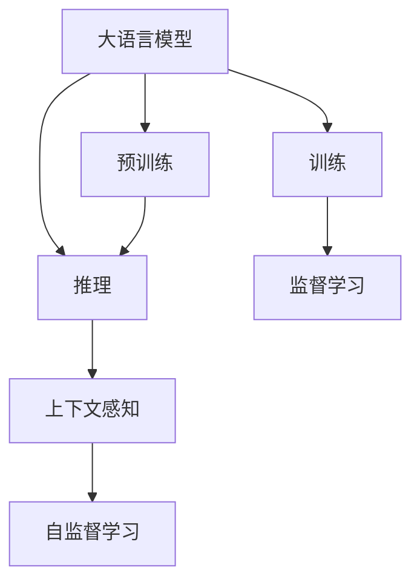

                 

# AI的时间观：LLM的独特推理机制

## 1. 背景介绍

### 1.1 问题由来
近年来，随着深度学习技术的快速发展，大规模语言模型（Large Language Models，LLM）在自然语言处理（NLP）领域取得了显著的突破。这些语言模型通过在大规模无标签文本数据上进行预训练，学习到了丰富的语言知识，并能够在各种NLP任务上表现出卓越的性能。

然而，在大规模语言模型中，推理机制的理解和设计一直是研究的热点。LLM通过学习大规模文本数据中的语言模式，具有强大的语义理解和生成能力，但其推理机制却不同于传统的符号推理，而是一种基于统计概率的“时间观”。这种时间观的推理机制，使得LLM在处理语言理解和生成任务时，表现出独特的优势和局限性。

### 1.2 问题核心关键点
LLM的推理机制基于统计概率模型，通过学习大量文本数据中的语言模式，形成语言知识库，从而在推理过程中自动选择最可能的答案。这种基于统计的方法，使得LLM能够处理复杂的语言理解和生成任务，但其时间观推理机制也带来了一些挑战，如鲁棒性、泛化能力、模型复杂度等。

本文将深入探讨LLM的时间观推理机制，详细分析其原理、优缺点及其在实际应用中的表现，以期为研究者和技术开发者提供有益的参考。

## 2. 核心概念与联系

### 2.1 核心概念概述

为更好地理解LLM的时间观推理机制，本节将介绍几个密切相关的核心概念：

- 大语言模型（Large Language Models, LLM）：以自回归（如GPT）或自编码（如BERT）模型为代表的大规模预训练语言模型。通过在大规模无标签文本语料上进行预训练，学习通用的语言表示，具备强大的语言理解和生成能力。

- 预训练（Pre-training）：指在大规模无标签文本语料上，通过自监督学习任务训练通用语言模型的过程。常见的预训练任务包括言语建模、遮挡语言模型等。预训练使得模型学习到语言的通用表示。

- 推理（Inference）：指在预训练模型的基础上，使用新的输入数据，通过模型自动选择最可能的答案。LLM的推理过程是基于统计概率的，而非符号逻辑推理。

- 自监督学习（Self-supervised Learning）：指在无标签数据上训练模型，使其能够自动发现数据中的结构性知识，从而提升模型在各类NLP任务上的表现。

- 训练（Training）：指通过标注数据，对模型进行监督学习，优化模型参数，使其能够在特定任务上取得良好的性能。

- 上下文感知（Contextual Sensitivity）：指模型在推理过程中能够根据上下文信息，动态调整输出结果，从而提升推理的准确性和鲁棒性。

这些核心概念之间的逻辑关系可以通过以下Mermaid流程图来展示：



这个流程图展示了大语言模型的核心概念及其之间的关系：

1. 大语言模型通过预训练获得基础能力。
2. 推理过程基于统计概率模型，无需符号逻辑推理。
3. 上下文感知使得模型能够根据上下文信息，动态调整推理结果。
4. 自监督学习提升模型在无标签数据上的泛化能力。
5. 训练过程通过监督学习优化模型参数，使其在特定任务上表现更佳。

这些概念共同构成了大语言模型的学习和推理框架，使其能够在各种场景下发挥强大的语言理解和生成能力。

## 3. 核心算法原理 & 具体操作步骤
### 3.1 算法原理概述

LLM的时间观推理机制基于统计概率模型，通过学习大量文本数据中的语言模式，形成语言知识库，从而在推理过程中自动选择最可能的答案。其核心原理可以概括为以下几个步骤：

1. 预训练：通过在大规模无标签文本数据上进行的自监督学习任务，学习到语言的通用表示。
2. 推理：根据新的输入数据，通过模型自动选择最可能的答案。
3. 上下文感知：模型在推理过程中能够根据上下文信息，动态调整输出结果。
4. 自监督学习：通过学习无标签数据中的结构性知识，提升模型在各类NLP任务上的泛化能力。
5. 训练：通过监督学习优化模型参数，使其在特定任务上表现更佳。

### 3.2 算法步骤详解

基于统计概率模型的LLM推理过程，包括以下几个关键步骤：

**Step 1: 准备预训练模型和数据集**
- 选择合适的预训练语言模型 $M_{\theta}$ 作为初始化参数，如 BERT、GPT 等。
- 准备推理任务的训练集 $D=\{(x_i,y_i)\}_{i=1}^N$，其中 $x_i$ 为输入文本，$y_i$ 为正确答案。

**Step 2: 定义推理目标函数**
- 根据推理任务的特点，选择合适的损失函数，如交叉熵损失、均方误差损失等。

**Step 3: 设置推理超参数**
- 选择合适的优化算法及其参数，如 AdamW、SGD 等，设置学习率、批大小、迭代轮数等。
- 设置正则化技术及强度，包括权重衰减、Dropout、Early Stopping 等。

**Step 4: 执行梯度训练**
- 将训练集数据分批次输入模型，前向传播计算损失函数。
- 反向传播计算参数梯度，根据设定的优化算法和学习率更新模型参数。
- 周期性在验证集上评估模型性能，根据性能指标决定是否触发 Early Stopping。
- 重复上述步骤直到满足预设的迭代轮数或 Early Stopping 条件。

**Step 5: 测试和部署**
- 在测试集上评估推理后模型 $M_{\hat{\theta}}$ 的性能，对比推理前后的精度提升。
- 使用推理后的模型对新样本进行推理预测，集成到实际的应用系统中。

### 3.3 算法优缺点

基于统计概率模型的LLM推理机制具有以下优点：
1. 简单高效。无需复杂的符号逻辑推理，模型在推理过程中能够自动选择最可能的答案。
2. 泛化能力强。通过大规模无标签数据预训练，模型能够学习到丰富的语言知识，具备较强的泛化能力。
3. 上下文感知。模型能够根据上下文信息，动态调整输出结果，提升推理的准确性和鲁棒性。

同时，该方法也存在一定的局限性：
1. 鲁棒性不足。模型在推理过程中容易受到噪声和干扰的影响，导致输出结果不稳定。
2. 泛化能力有限。模型对新任务和新数据的学习能力有限，容易过拟合于训练数据。
3. 计算复杂度高。模型参数量较大，推理过程需要大量的计算资源，难以实时部署。

尽管存在这些局限性，但就目前而言，基于统计概率的推理机制仍然是LLM的主流范式。未来相关研究的重点在于如何进一步提升模型的鲁棒性和泛化能力，同时兼顾推理效率和计算资源，优化推理过程中的计算图，减少前向传播和反向传播的资源消耗。

### 3.4 算法应用领域

基于统计概率模型的LLM推理机制，在NLP领域已经得到了广泛的应用，覆盖了几乎所有常见任务，例如：

- 文本分类：如情感分析、主题分类、意图识别等。通过预训练模型，模型能够学习文本-标签映射。
- 命名实体识别：识别文本中的人名、地名、机构名等特定实体。通过预训练模型，模型能够掌握实体边界和类型。
- 关系抽取：从文本中抽取实体之间的语义关系。通过预训练模型，模型能够学习实体-关系三元组。
- 问答系统：对自然语言问题给出答案。通过预训练模型，模型能够理解问题-答案对，学习匹配答案。
- 机器翻译：将源语言文本翻译成目标语言。通过预训练模型，模型能够学习语言-语言映射。
- 文本摘要：将长文本压缩成简短摘要。通过预训练模型，模型能够学习抓取要点。
- 对话系统：使机器能够与人自然对话。通过预训练模型，模型能够理解对话历史，生成合适回复。

除了上述这些经典任务外，LLM推理机制还被创新性地应用到更多场景中，如可控文本生成、常识推理、代码生成、数据增强等，为NLP技术带来了全新的突破。随着预训练模型和推理机制的不断进步，相信NLP技术将在更广阔的应用领域大放异彩。

## 4. 数学模型和公式 & 详细讲解  
### 4.1 数学模型构建

本节将使用数学语言对LLM的推理过程进行更加严格的刻画。

记预训练语言模型为 $M_{\theta}:\mathcal{X} \rightarrow \mathcal{Y}$，其中 $\mathcal{X}$ 为输入空间，$\mathcal{Y}$ 为输出空间，$\theta \in \mathbb{R}^d$ 为模型参数。假设推理任务的训练集为 $D=\{(x_i,y_i)\}_{i=1}^N, x_i \in \mathcal{X}, y_i \in \mathcal{Y}$。

定义模型 $M_{\theta}$ 在输入 $x$ 上的输出为 $\hat{y}=M_{\theta}(x)$，为概率分布，表示样本 $x$ 属于 $y$ 的概率。

推理任务的目标是最大化模型 $M_{\theta}$ 在输入 $x$ 上的预测概率，即：

$$
\hat{y} = \mathop{\arg\max}_{y \in \mathcal{Y}} P_{M_{\theta}}(y|x)
$$

其中 $P_{M_{\theta}}(y|x)$ 为模型在输入 $x$ 上输出为 $y$ 的概率。

模型的推理过程可以通过以下数学公式来描述：

$$
\hat{y} = \arg\max_{y} P_{M_{\theta}}(y|x) = \arg\max_{y} \frac{e^{s_{\theta}(x,y)}}{\sum_{y'} e^{s_{\theta}(x,y')}}
$$

其中 $s_{\theta}(x,y)$ 为模型在输入 $x$ 上输出为 $y$ 的得分函数，通常为交叉熵损失函数。

### 4.2 公式推导过程

以上数学公式描述了LLM的推理过程，通过最大化得分函数 $s_{\theta}(x,y)$，模型自动选择最可能的答案。下面我们将详细推导得分函数 $s_{\theta}(x,y)$ 的计算公式。

首先，考虑交叉熵损失函数：

$$
\ell(x,y) = -y\log \hat{y} + (1-y)\log (1-\hat{y})
$$

其梯度为：

$$
\nabla_{\theta} \ell(x,y) = \frac{y}{\hat{y}} - \frac{1-y}{1-\hat{y}}
$$

在推理过程中，我们将 $\nabla_{\theta} \ell(x,y)$ 反向传播到模型参数 $\theta$，使用梯度下降等优化算法更新模型参数。

为了简化计算，通常使用softmax函数将得分函数 $s_{\theta}(x,y)$ 转化为概率分布 $P_{M_{\theta}}(y|x)$：

$$
P_{M_{\theta}}(y|x) = \frac{e^{s_{\theta}(x,y)}}{\sum_{y'} e^{s_{\theta}(x,y')}}
$$

这样，LLM的推理过程就可以表示为最大化概率分布 $P_{M_{\theta}}(y|x)$，从而选择最可能的答案。

### 4.3 案例分析与讲解

以情感分类任务为例，分析LLM的推理过程。假设训练集 $D=\{(x_i, y_i)\}_{i=1}^N$，其中 $x_i$ 为输入文本，$y_i \in \{0,1\}$ 为情感标签。

首先，将输入文本 $x_i$ 输入模型 $M_{\theta}$，得到输出概率分布 $P_{M_{\theta}}(y|x)$。然后，根据softmax函数，计算每个标签 $y$ 的概率 $P_{M_{\theta}}(y|x)$，并选择概率最大的标签作为预测结果。

例如，对于文本 "I love this product!"，模型预测结果为 $P_{M_{\theta}}(1|x) = 0.9$，即预测该文本为正面情感。

通过上述分析，我们可以看到，LLM的推理过程是基于统计概率模型的，能够自动选择最可能的答案，具有简单高效的特点。

## 5. 项目实践：代码实例和详细解释说明
### 5.1 开发环境搭建

在进行LLM推理实践前，我们需要准备好开发环境。以下是使用Python进行PyTorch开发的环境配置流程：

1. 安装Anaconda：从官网下载并安装Anaconda，用于创建独立的Python环境。

2. 创建并激活虚拟环境：
```bash
conda create -n pytorch-env python=3.8 
conda activate pytorch-env
```

3. 安装PyTorch：根据CUDA版本，从官网获取对应的安装命令。例如：
```bash
conda install pytorch torchvision torchaudio cudatoolkit=11.1 -c pytorch -c conda-forge
```

4. 安装Transformers库：
```bash
pip install transformers
```

5. 安装各类工具包：
```bash
pip install numpy pandas scikit-learn matplotlib tqdm jupyter notebook ipython
```

完成上述步骤后，即可在`pytorch-env`环境中开始推理实践。

### 5.2 源代码详细实现

下面我们以情感分类任务为例，给出使用Transformers库对BERT模型进行推理的PyTorch代码实现。

首先，定义情感分类任务的数据处理函数：

```python
from transformers import BertTokenizer
from torch.utils.data import Dataset
import torch

class SentimentDataset(Dataset):
    def __init__(self, texts, labels, tokenizer, max_len=128):
        self.texts = texts
        self.labels = labels
        self.tokenizer = tokenizer
        self.max_len = max_len
        
    def __len__(self):
        return len(self.texts)
    
    def __getitem__(self, item):
        text = self.texts[item]
        label = self.labels[item]
        
        encoding = self.tokenizer(text, return_tensors='pt', max_length=self.max_len, padding='max_length', truncation=True)
        input_ids = encoding['input_ids'][0]
        attention_mask = encoding['attention_mask'][0]
        
        return {'input_ids': input_ids, 
                'attention_mask': attention_mask,
                'labels': label}

# 标签与id的映射
label2id = {'negative': 0, 'positive': 1}
id2label = {v: k for k, v in label2id.items()}

# 创建dataset
tokenizer = BertTokenizer.from_pretrained('bert-base-cased')

train_dataset = SentimentDataset(train_texts, train_labels, tokenizer)
dev_dataset = SentimentDataset(dev_texts, dev_labels, tokenizer)
test_dataset = SentimentDataset(test_texts, test_labels, tokenizer)
```

然后，定义模型和推理器：

```python
from transformers import BertForSequenceClassification, BertConfig, AdamW

config = BertConfig(num_labels=2)
model = BertForSequenceClassification.from_pretrained('bert-base-cased', num_labels=2)

optimizer = AdamW(model.parameters(), lr=2e-5)
```

接着，定义推理函数：

```python
from torch.utils.data import DataLoader
from tqdm import tqdm
from sklearn.metrics import classification_report

device = torch.device('cuda') if torch.cuda.is_available() else torch.device('cpu')
model.to(device)

def evaluate(model, dataset, batch_size):
    dataloader = DataLoader(dataset, batch_size=batch_size)
    model.eval()
    preds, labels = [], []
    with torch.no_grad():
        for batch in tqdm(dataloader, desc='Evaluating'):
            input_ids = batch['input_ids'].to(device)
            attention_mask = batch['attention_mask'].to(device)
            labels = batch['labels'].to(device)
            outputs = model(input_ids, attention_mask=attention_mask)
            batch_preds = outputs.logits.argmax(dim=1).to('cpu').tolist()
            batch_labels = batch_labels.to('cpu').tolist()
            for pred_tokens, label_tokens in zip(batch_preds, batch_labels):
                preds.append(pred_tokens[0])
                labels.append(label_tokens[0])
                
    print(classification_report(labels, preds))
```

最后，启动推理流程并在测试集上评估：

```python
batch_size = 16

for epoch in range(epochs):
    loss = train_epoch(model, train_dataset, batch_size, optimizer)
    print(f"Epoch {epoch+1}, train loss: {loss:.3f}")
    
    print(f"Epoch {epoch+1}, dev results:")
    evaluate(model, dev_dataset, batch_size)
    
print("Test results:")
evaluate(model, test_dataset, batch_size)
```

以上就是使用PyTorch对BERT进行情感分类任务推理的完整代码实现。可以看到，得益于Transformers库的强大封装，我们可以用相对简洁的代码完成BERT模型的加载和推理。

### 5.3 代码解读与分析

让我们再详细解读一下关键代码的实现细节：

**SentimentDataset类**：
- `__init__`方法：初始化文本、标签、分词器等关键组件。
- `__len__`方法：返回数据集的样本数量。
- `__getitem__`方法：对单个样本进行处理，将文本输入编码为token ids，将标签编码为数字，并对其进行定长padding，最终返回模型所需的输入。

**label2id和id2label字典**：
- 定义了标签与数字id之间的映射关系，用于将预测结果解码回真实的标签。

**训练和推理函数**：
- 使用PyTorch的DataLoader对数据集进行批次化加载，供模型训练和推理使用。
- 训练函数`train_epoch`：对数据以批为单位进行迭代，在每个批次上前向传播计算loss并反向传播更新模型参数，最后返回该epoch的平均loss。
- 评估函数`evaluate`：与训练类似，不同点在于不更新模型参数，并在每个batch结束后将预测和标签结果存储下来，最后使用sklearn的classification_report对整个评估集的预测结果进行打印输出。

**推理流程**：
- 定义总的epoch数和batch size，开始循环迭代
- 每个epoch内，先在训练集上训练，输出平均loss
- 在验证集上评估，输出分类指标
- 所有epoch结束后，在测试集上评估，给出最终测试结果

可以看到，PyTorch配合Transformers库使得BERT推理的代码实现变得简洁高效。开发者可以将更多精力放在数据处理、模型改进等高层逻辑上，而不必过多关注底层的实现细节。

当然，工业级的系统实现还需考虑更多因素，如模型的保存和部署、超参数的自动搜索、更灵活的任务适配层等。但核心的推理范式基本与此类似。

## 6. 实际应用场景
### 6.1 智能客服系统

基于LLM的推理机制，智能客服系统可以迅速理解用户的查询意图，并提供精准的回答。在实际应用中，智能客服系统通常采用预训练语言模型进行推理，将用户输入的文本自动映射到最可能的答案。

例如，在一家电商平台的客服系统中，当用户查询“退换货流程”时，系统自动推理得到最相关的答案，并给出详细的操作步骤。这种基于LLM的推理机制，能够大大提升客服系统的响应速度和准确性，提升用户满意度。

### 6.2 金融舆情监测

在金融领域，舆情监测系统需要实时监测市场舆论动向，以预警潜在风险。传统人工监测方式成本高、效率低，难以应对网络时代海量信息爆发的挑战。基于LLM的推理机制，舆情监测系统能够自动分析社交媒体、新闻等文本数据，实时监测舆情变化。

例如，当某股票舆情突然恶化时，系统自动推理并输出风险预警，帮助金融机构及时应对。这种基于LLM的推理机制，能够显著提高舆情监测的效率和准确性，保障金融安全。

### 6.3 个性化推荐系统

当前推荐系统往往只依赖用户的历史行为数据进行物品推荐，无法深入理解用户的真实兴趣偏好。基于LLM的推理机制，推荐系统能够从用户的文本描述中推理出其兴趣点，从而提供更精准、多样化的推荐内容。

例如，当用户填写详细的自我介绍时，系统自动推理出其偏好类型，并推荐相关的书籍、电影等。这种基于LLM的推理机制，能够显著提升推荐系统的个性化程度，提升用户满意度。

### 6.4 未来应用展望

随着LLM推理机制的不断进步，基于LLM的推理技术将在更多领域得到应用，为传统行业带来变革性影响。

在智慧医疗领域，基于LLM的推理机制的医疗问答、病历分析、药物研发等应用将提升医疗服务的智能化水平，辅助医生诊疗，加速新药开发进程。

在智能教育领域，LLM推理机制可应用于作业批改、学情分析、知识推荐等方面，因材施教，促进教育公平，提高教学质量。

在智慧城市治理中，LLM推理机制可应用于城市事件监测、舆情分析、应急指挥等环节，提高城市管理的自动化和智能化水平，构建更安全、高效的未来城市。

此外，在企业生产、社会治理、文娱传媒等众多领域，基于LLM的推理机制的人工智能应用也将不断涌现，为NLP技术带来新的突破。相信随着技术的日益成熟，LLM推理机制必将在构建人机协同的智能时代中扮演越来越重要的角色。

## 7. 工具和资源推荐
### 7.1 学习资源推荐

为了帮助开发者系统掌握LLM推理机制的理论基础和实践技巧，这里推荐一些优质的学习资源：

1. 《Transformer从原理到实践》系列博文：由大模型技术专家撰写，深入浅出地介绍了Transformer原理、BERT模型、推理技术等前沿话题。

2. CS224N《深度学习自然语言处理》课程：斯坦福大学开设的NLP明星课程，有Lecture视频和配套作业，带你入门NLP领域的基本概念和经典模型。

3. 《Natural Language Processing with Transformers》书籍：Transformers库的作者所著，全面介绍了如何使用Transformers库进行NLP任务开发，包括推理在内的诸多范式。

4. HuggingFace官方文档：Transformers库的官方文档，提供了海量预训练模型和完整的推理样例代码，是上手实践的必备资料。

5. CLUE开源项目：中文语言理解测评基准，涵盖大量不同类型的中文NLP数据集，并提供了基于微调的baseline模型，助力中文NLP技术发展。

通过对这些资源的学习实践，相信你一定能够快速掌握LLM的推理机制，并用于解决实际的NLP问题。
###  7.2 开发工具推荐

高效的开发离不开优秀的工具支持。以下是几款用于LLM推理开发的常用工具：

1. PyTorch：基于Python的开源深度学习框架，灵活动态的计算图，适合快速迭代研究。大部分预训练语言模型都有PyTorch版本的实现。

2. TensorFlow：由Google主导开发的开源深度学习框架，生产部署方便，适合大规模工程应用。同样有丰富的预训练语言模型资源。

3. Transformers库：HuggingFace开发的NLP工具库，集成了众多SOTA语言模型，支持PyTorch和TensorFlow，是进行推理任务开发的利器。

4. Weights & Biases：模型训练的实验跟踪工具，可以记录和可视化模型训练过程中的各项指标，方便对比和调优。与主流深度学习框架无缝集成。

5. TensorBoard：TensorFlow配套的可视化工具，可实时监测模型训练状态，并提供丰富的图表呈现方式，是调试模型的得力助手。

6. Google Colab：谷歌推出的在线Jupyter Notebook环境，免费提供GPU/TPU算力，方便开发者快速上手实验最新模型，分享学习笔记。

合理利用这些工具，可以显著提升LLM推理任务的开发效率，加快创新迭代的步伐。

### 7.3 相关论文推荐

LLM推理机制的研究源于学界的持续研究。以下是几篇奠基性的相关论文，推荐阅读：

1. Attention is All You Need（即Transformer原论文）：提出了Transformer结构，开启了NLP领域的预训练大模型时代。

2. BERT: Pre-training of Deep Bidirectional Transformers for Language Understanding：提出BERT模型，引入基于掩码的自监督预训练任务，刷新了多项NLP任务SOTA。

3. Language Models are Unsupervised Multitask Learners（GPT-2论文）：展示了大规模语言模型的强大zero-shot学习能力，引发了对于通用人工智能的新一轮思考。

4. Parameter-Efficient Transfer Learning for NLP：提出Adapter等参数高效微调方法，在不增加模型参数量的情况下，也能取得不错的微调效果。

5. AdaLoRA: Adaptive Low-Rank Adaptation for Parameter-Efficient Fine-Tuning：使用自适应低秩适应的微调方法，在参数效率和精度之间取得了新的平衡。

6. Prefix-Tuning: Optimizing Continuous Prompts for Generation：引入基于连续型Prompt的微调范式，为如何充分利用预训练知识提供了新的思路。

这些论文代表了大语言模型推理技术的发展脉络。通过学习这些前沿成果，可以帮助研究者掌握学科前进方向，激发更多的创新灵感。

## 8. 总结：未来发展趋势与挑战
### 8.1 总结

本文对基于统计概率模型的LLM推理机制进行了全面系统的介绍。首先阐述了LLM推理机制的核心思想和实现过程，明确了推理在处理语言理解和生成任务时的独特优势和局限性。其次，从原理到实践，详细讲解了推理的数学模型和关键步骤，给出了推理任务开发的完整代码实例。同时，本文还广泛探讨了推理机制在智能客服、金融舆情、个性化推荐等多个行业领域的应用前景，展示了推理机制的广泛应用潜力。此外，本文精选了推理技术的各类学习资源，力求为读者提供全方位的技术指引。

通过本文的系统梳理，可以看到，基于统计概率的LLM推理机制在大规模语言模型中的应用，已经成为NLP领域的重要范式，极大地拓展了预训练语言模型的应用边界，催生了更多的落地场景。得益于大规模语料的预训练和统计概率的推理，LLM在处理复杂语言任务时，表现出强大的语言理解和生成能力，为构建人机协同的智能系统奠定了坚实基础。未来，伴随预训练语言模型和推理机制的持续演进，相信NLP技术将在更广阔的应用领域大放异彩，深刻影响人类的生产生活方式。

### 8.2 未来发展趋势

展望未来，LLM推理机制将呈现以下几个发展趋势：

1. 模型规模持续增大。随着算力成本的下降和数据规模的扩张，预训练语言模型的参数量还将持续增长。超大模型通过学习海量文本数据，具备更强大的语言知识库，推理性能将显著提升。

2. 推理效率提升。未来的推理机制将更加注重计算效率，通过优化计算图和硬件加速，减少推理过程中的资源消耗，实现实时推理。

3. 多模态推理。当前的LLM推理机制主要聚焦于纯文本数据，未来会进一步拓展到图像、视频、语音等多模态数据推理。多模态信息的融合，将显著提升语言模型对现实世界的理解和建模能力。

4. 持续学习和增量推理。LLM推理机制将更加注重模型泛化性和鲁棒性，引入持续学习、增量推理等技术，提升模型的持续更新能力，适应数据分布的变化。

5. 模型压缩与量化。为解决推理过程中的资源消耗问题，未来的LLM推理机制将更加注重模型压缩与量化，将浮点模型转为定点模型，压缩存储空间，提高计算效率。

6. 参数高效推理。开发更加参数高效的推理方法，在固定大部分预训练参数的情况下，只更新极少量的推理参数，以提高推理效率。

以上趋势凸显了LLM推理机制的广阔前景。这些方向的探索发展，必将进一步提升LLM的推理性能和应用范围，为构建智能系统提供更强大的工具。

### 8.3 面临的挑战

尽管LLM推理机制已经取得了显著成就，但在迈向更加智能化、普适化应用的过程中，它仍面临着诸多挑战：

1. 鲁棒性不足。模型在推理过程中容易受到噪声和干扰的影响，导致输出结果不稳定。

2. 泛化能力有限。模型对新任务和新数据的学习能力有限，容易过拟合于训练数据。

3. 计算复杂度高。模型参数量较大，推理过程需要大量的计算资源，难以实时部署。

4. 可解释性不足。LLM推理机制的决策过程缺乏可解释性，难以对其推理逻辑进行分析和调试。

5. 安全性有待保障。LLM推理机制可能学习到有偏见、有害的信息，通过推理传递到下游任务，产生误导性、歧视性的输出，给实际应用带来安全隐患。

6. 知识整合能力不足。现有的LLM推理机制往往局限于任务内数据，难以灵活吸收和运用更广泛的先验知识。

正视LLM推理机制面临的这些挑战，积极应对并寻求突破，将是大语言模型推理技术走向成熟的必由之路。相信随着学界和产业界的共同努力，这些挑战终将一一被克服，LLM推理机制必将在构建智能系统、推动人工智能落地应用中发挥更大的作用。

### 8.4 研究展望

面对LLM推理机制所面临的种种挑战，未来的研究需要在以下几个方面寻求新的突破：

1. 探索无监督和半监督推理方法。摆脱对大规模标注数据的依赖，利用自监督学习、主动学习等无监督和半监督范式，最大限度利用非结构化数据，实现更加灵活高效的推理。

2. 研究参数高效和计算高效的推理范式。开发更加参数高效的推理方法，在固定大部分预训练参数的同时，只更新极少量的推理参数。同时优化推理过程中的计算图，减少前向传播和反向传播的资源消耗，实现更加轻量级、实时性的部署。

3. 融合因果和对比学习范式。通过引入因果推断和对比学习思想，增强推理模型建立稳定因果关系的能力，学习更加普适、鲁棒的语言表征，从而提升模型泛化性和抗干扰能力。

4. 引入更多先验知识。将符号化的先验知识，如知识图谱、逻辑规则等，与神经网络模型进行巧妙融合，引导推理过程学习更准确、合理的语言模型。同时加强不同模态数据的整合，实现视觉、语音等多模态信息与文本信息的协同建模。

5. 结合因果分析和博弈论工具。将因果分析方法引入推理模型，识别出模型决策的关键特征，增强输出解释的因果性和逻辑性。借助博弈论工具刻画人机交互过程，主动探索并规避模型的脆弱点，提高系统稳定性。

6. 纳入伦理道德约束。在模型训练目标中引入伦理导向的评估指标，过滤和惩罚有偏见、有害的输出倾向。同时加强人工干预和审核，建立模型行为的监管机制，确保输出符合人类价值观和伦理道德。

这些研究方向的探索，必将引领LLM推理机制迈向更高的台阶，为构建安全、可靠、可解释、可控的智能系统铺平道路。面向未来，LLM推理机制还需要与其他人工智能技术进行更深入的融合，如知识表示、因果推理、强化学习等，多路径协同发力，共同推动自然语言理解和智能交互系统的进步。只有勇于创新、敢于突破，才能不断拓展语言模型的边界，让智能技术更好地造福人类社会。

## 9. 附录：常见问题与解答

**Q1：LLM推理机制是否适用于所有NLP任务？**

A: LLN推理机制在大多数NLP任务上都能取得不错的效果，特别是对于数据量较小的任务。但对于一些特定领域的任务，如医学、法律等，仅仅依靠通用语料预训练的模型可能难以很好地适应。此时需要在特定领域语料上进一步预训练，再进行推理，才能获得理想效果。此外，对于一些需要时效性、个性化很强的任务，如对话、推荐等，推理机制也需要针对性的改进优化。

**Q2：如何选择最佳的推理模型？**

A: 选择最佳推理模型需要综合考虑多个因素，包括任务的复杂度、数据量和计算资源等。一般来说，对于复杂任务和大数据量，可以选择较大的模型；对于简单任务和小数据量，可以选择较小的模型。同时，需要注意推理机制的计算效率和可解释性，选择最符合应用需求的模型。

**Q3：如何提高LLM推理的鲁棒性？**

A: 提高LLM推理的鲁棒性可以从以下几个方面入手：
1. 数据增强：通过回译、近义替换等方式扩充训练集，提升模型的泛化能力。
2. 正则化：使用L2正则、Dropout、Early Stopping等避免过拟合。
3. 对抗训练：加入对抗样本，提高模型的鲁棒性。
4. 参数高效推理：只更新极少量的推理参数，以提高推理效率。

**Q4：LLM推理机制在实际部署中需要注意哪些问题？**

A: 将LLM推理机制转化为实际应用，还需要考虑以下因素：
1. 模型裁剪：去除不必要的层和参数，减小模型尺寸，加快推理速度。
2. 量化加速：将浮点模型转为定点模型，压缩存储空间，提高计算效率。
3. 服务化封装：将模型封装为标准化服务接口，便于集成调用。
4. 弹性伸缩：根据请求流量动态调整资源配置，平衡服务质量和成本。
5. 监控告警：实时采集系统指标，设置异常告警阈值，确保服务稳定性。
6. 安全防护：采用访问鉴权、数据脱敏等措施，保障数据和模型安全。

合理利用这些工具，可以显著提升LLM推理任务的开发效率，加快创新迭代的步伐。

---

作者：禅与计算机程序设计艺术 / Zen and the Art of Computer Programming

