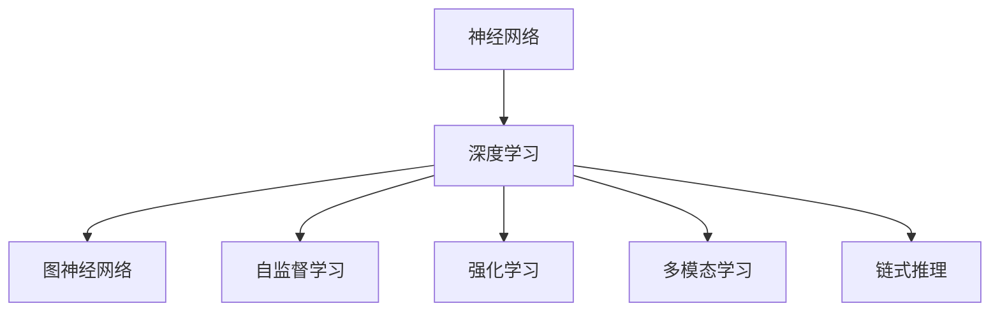

                 

# AI的链式推理：提升问题解决能力的新方法

> 关键词：链式推理,神经网络,深度学习,强化学习,图神经网络,自监督学习,多模态学习

## 1. 背景介绍

### 1.1 问题由来
在人工智能(AI)领域，问题解决能力一直是研究的热点之一。无论是传统机器学习还是深度学习，其核心目标都是构建能够有效处理和解决各种问题的智能模型。然而，现有的方法如基于规则的专家系统、传统机器学习算法等，往往难以满足复杂多变的现实需求。为此，近年来出现了以神经网络为核心的深度学习技术，通过模拟人脑的计算方式，使得AI模型在图像识别、语音识别、自然语言处理等领域取得了巨大突破。

然而，尽管深度学习在模型精度和泛化能力上有了显著提升，但在处理大规模、复杂问题时仍存在诸多不足。一方面，传统神经网络基于串行计算，无法充分利用并行计算能力。另一方面，深度学习模型往往需要大量的标注数据进行训练，无法适应数据稀缺的场景。因此，如何构建能够高效、灵活解决复杂问题的AI模型，成为当前研究的难点。

### 1.2 问题核心关键点
链式推理是一种新兴的AI问题解决技术，其核心思想是通过构建多模态、多层次、非线性关系图，模拟人类推理过程，提升模型的问题解决能力。与传统神经网络相比，链式推理能够更有效地利用并行计算，通过链式结构更好地捕捉数据之间的关系，并在小样本数据上取得优异表现。

链式推理的核心在于三个关键技术：

1. **图神经网络**：利用图结构的性质，对数据进行编码和解码，从而提升模型的学习能力。
2. **自监督学习**：在缺乏标注数据的情况下，通过利用数据之间的隐含关系进行学习，提升模型的泛化能力。
3. **多模态学习**：结合图像、文本、语音等多种模态的信息，丰富模型的知识表示，增强模型的适应性。

通过这些技术，链式推理有望在问题解决能力上实现新的突破。

## 2. 核心概念与联系

### 2.1 核心概念概述

为了更好地理解链式推理问题解决技术，本节将介绍几个关键概念及其相互联系：

- **神经网络(Neural Networks)**：一种模仿人脑神经元之间连接的计算模型，通过多层非线性变换实现复杂的模式识别和预测。
- **深度学习(Deep Learning)**：利用多层神经网络进行特征提取和模式识别，以实现对大规模数据的有效处理和分析。
- **图神经网络(Graph Neural Networks, GNNs)**：一种结合图结构和神经网络的计算模型，用于处理具有复杂关系的数据，如社交网络、分子结构等。
- **自监督学习(Self-Supervised Learning)**：利用数据的内在结构进行无监督学习，通过最大化数据内部一致性来提升模型的泛化能力。
- **强化学习(Reinforcement Learning)**：通过与环境的交互，优化模型的策略，以实现对复杂环境的适应和应对。
- **多模态学习(Multimodal Learning)**：结合多种模态的数据，提升模型的表示能力和适应性。
- **链式推理(Chain-of-Thought Reasoning)**：一种模拟人类推理过程的技术，通过构建图结构，利用多模态数据进行问题解决。

这些概念之间的逻辑关系可以通过以下Mermaid流程图来展示：



这个流程图展示了大语言模型问题解决技术的关键概念及其相互关系：

1. 神经网络通过多层非线性变换实现特征提取。
2. 深度学习利用多层神经网络进行复杂数据处理和分析。
3. 图神经网络结合图结构，提升特征提取能力。
4. 自监督学习通过数据内在结构进行无监督学习。
5. 强化学习通过与环境的交互优化模型策略。
6. 多模态学习结合多种模态数据，丰富模型知识表示。
7. 链式推理模拟人类推理过程，提升问题解决能力。

这些概念共同构成了链式推理问题解决框架，使其能够在复杂多变的现实环境中发挥强大的问题解决能力。通过理解这些核心概念，我们可以更好地把握链式推理的技术原理和优化方向。

## 3. 核心算法原理 & 具体操作步骤
### 3.1 算法原理概述

链式推理问题解决的核心在于构建一种图结构，将问题转化为图的遍历和推理过程。其基本思想是通过多模态数据构建一个有向图，其中节点表示数据样本，边表示数据之间的内在关系。通过遍历和推理图结构，模型可以逐步提取和综合数据信息，最终输出问题的解决方案。

链式推理的具体流程包括以下几个步骤：

1. **数据编码**：将多种模态的数据编码成图结构，并利用图神经网络对数据进行特征提取。
2. **图构建**：根据数据内在关系构建图结构，并通过图神经网络进行特征融合。
3. **推理求解**：通过链式推理机制，模拟人类推理过程，逐步提取和综合信息，输出最终答案。

链式推理算法主要包括三个核心模块：

- **图嵌入模块**：将多模态数据编码为节点特征向量，构建图结构。
- **图遍历模块**：通过图神经网络对图结构进行遍历，提取数据内在关系。
- **推理输出模块**：通过链式推理机制，逐步综合数据信息，输出最终答案。

### 3.2 算法步骤详解

链式推理问题解决的具体操作步骤如下：

**Step 1: 数据预处理**

- 收集和整理多模态数据，包括图像、文本、语音等。
- 对数据进行归一化、特征提取等预处理操作，以提升后续模型训练的效率和效果。

**Step 2: 图结构构建**

- 将预处理后的数据转换为图结构，其中节点表示数据样本，边表示数据之间的内在关系。
- 选择合适的图结构，如异构图、同构图、属性图等，根据数据特点构建合适的图结构。

**Step 3: 图嵌入**

- 使用图神经网络对图结构进行嵌入，将节点特征向量映射到低维空间中。
- 利用多模态数据融合技术，将不同模态的特征信息综合到同一个节点中。

**Step 4: 图遍历与推理**

- 通过图神经网络对图结构进行遍历，提取数据内在关系。
- 利用链式推理机制，模拟人类推理过程，逐步提取和综合数据信息，输出最终答案。

**Step 5: 后处理**

- 对模型输出进行后处理操作，如平滑、归一化等，以提升模型的准确性和鲁棒性。
- 将模型输出应用于实际问题解决场景，验证模型的性能和效果。

### 3.3 算法优缺点

链式推理问题解决技术具有以下优点：

1. **高效并行**：利用图结构的性质，可以充分利用并行计算资源，提升模型训练和推理的效率。
2. **泛化能力强**：通过自监督学习机制，利用数据内在关系进行无监督学习，提升模型的泛化能力。
3. **多模态融合**：结合多种模态的数据，丰富模型的知识表示，增强模型的适应性。
4. **链式推理**：通过链式结构模拟人类推理过程，提升模型的问题解决能力。

同时，该技术也存在一些局限性：

1. **数据依赖**：链式推理需要构建图结构，而图结构的构建依赖于数据的质量和数量，数据不足可能导致模型效果不佳。
2. **计算复杂度高**：图结构构建和图嵌入过程计算复杂度较高，在大规模数据集上可能存在性能瓶颈。
3. **模型可解释性不足**：链式推理模型往往比较复杂，难以解释其内部推理机制，影响模型的可解释性和可解释性。
4. **领域依赖性强**：不同领域的图结构构建和特征融合方法差异较大，需要针对具体领域进行优化。

尽管存在这些局限性，但链式推理问题解决技术已经在许多实际问题上展示了其强大的能力，成为当前AI领域的热点研究方向之一。

### 3.4 算法应用领域

链式推理问题解决技术在多个领域得到了广泛应用，包括：

- **自然语言处理(NLP)**：通过结合文本、语音等多种模态信息，实现语言理解和生成。
- **图像处理**：结合图像、文本等多模态数据，提升图像分类、目标检测等任务的效果。
- **推荐系统**：通过用户行为数据、商品属性等多模态信息，构建个性化推荐模型。
- **医疗诊断**：利用患者病历、影像等多模态数据，提升医疗诊断的准确性和效率。
- **智能交通**：结合传感器数据、交通规则等多模态信息，实现智能交通管理。
- **金融风控**：利用用户行为数据、金融交易数据等多模态信息，提升金融风险识别和评估能力。
- **智慧城市**：结合传感器数据、城市管理规则等多模态信息，实现智慧城市管理和治理。

这些应用场景展示了链式推理技术在多个领域中的广泛应用和巨大潜力。

## 4. 数学模型和公式 & 详细讲解 & 举例说明
### 4.1 数学模型构建

链式推理问题解决技术涉及多个数学模型，本节将介绍几个重要的数学模型及其构建方法。

**图嵌入模型**

链式推理问题解决的核心是图嵌入模型，用于将多模态数据编码为图结构，并进行特征提取。常见的图嵌入模型包括GCN、GAT等。以GCN为例，其数学模型可以表示为：

$$
h_i^{(l+1)} = \frac{1}{|\mathcal{N}(i)|}\sum_{j \in \mathcal{N}(i)} \alpha_{ij}h_j^{(l)}W_l
$$

其中 $h_i^{(l)}$ 表示节点 $i$ 在第 $l$ 层的特征向量，$|\mathcal{N}(i)|$ 表示节点 $i$ 的邻居节点个数，$\alpha_{ij}$ 表示节点 $i$ 和节点 $j$ 之间的关系权重，$W_l$ 表示第 $l$ 层的权重矩阵。

**自监督学习模型**

自监督学习是链式推理问题解决技术的重要组成部分，用于提升模型的泛化能力。常见的自监督学习模型包括SimCLR、Moco等。以SimCLR为例，其数学模型可以表示为：

$$
\mathcal{L}(\theta) = -\frac{1}{2N}\sum_{i=1}^N\sum_{j=1}^N[\text{softmax}(x_i^\top x_j) + \text{softmax}(x_j^\top x_i) - 2]
$$

其中 $x_i$ 表示第 $i$ 个样本的特征向量，$\theta$ 表示模型的参数，$\text{softmax}$ 表示softmax函数。

**多模态学习模型**

多模态学习是链式推理问题解决技术的另一个重要组成部分，用于提升模型的适应性。常见的多模态学习模型包括Co-Attention、MTA等。以Co-Attention为例，其数学模型可以表示为：

$$
h_i = \sum_{j=1}^N\alpha_{ij}x_jW_L^V + \beta_ih_jW_L^Q
$$

其中 $x_j$ 表示第 $j$ 个样本的特征向量，$h_j$ 表示第 $j$ 个样本的注意力权重，$W_L^V$ 和 $W_L^Q$ 分别表示视觉和文本向量的权重矩阵。

**链式推理模型**

链式推理模型是链式推理问题解决技术的核心部分，用于模拟人类推理过程。常见的链式推理模型包括Reasoning Attention、LinkGraph等。以LinkGraph为例，其数学模型可以表示为：

$$
\mathcal{L} = \sum_{(i,j) \in E}\mathbf{f}_i^T\mathbf{f}_j
$$

其中 $E$ 表示图结构中的边集，$\mathbf{f}_i$ 表示节点 $i$ 的特征向量，$\mathbf{f}_j$ 表示节点 $j$ 的特征向量。

### 4.2 公式推导过程

以下我们以GCN为例，推导图嵌入模型的损失函数及其梯度的计算公式。

GCN的数学模型可以表示为：

$$
h_i^{(l+1)} = \frac{1}{|\mathcal{N}(i)|}\sum_{j \in \mathcal{N}(i)} \alpha_{ij}h_j^{(l)}W_l
$$

其损失函数可以表示为：

$$
\mathcal{L} = \frac{1}{2N}\sum_{i=1}^N\sum_{j=1}^N(\mathbf{y}_i^\top\text{softmax}(x_i^\top x_j) + \mathbf{y}_j^\top\text{softmax}(x_j^\top x_i) - 2)
$$

其中 $\mathbf{y}_i$ 表示节点 $i$ 的标签向量，$x_i$ 表示节点 $i$ 的特征向量。

根据链式法则，损失函数对参数 $\theta$ 的梯度可以表示为：

$$
\frac{\partial \mathcal{L}}{\partial \theta} = -\frac{1}{2N}\sum_{i=1}^N\sum_{j=1}^N\frac{\partial (\mathbf{y}_i^\top\text{softmax}(x_i^\top x_j))}{\partial \theta}
$$

进一步推导，得：

$$
\frac{\partial (\mathbf{y}_i^\top\text{softmax}(x_i^\top x_j))}{\partial \theta} = \frac{\partial \mathbf{y}_i^\top}{\partial \theta}\text{softmax}(x_i^\top x_j) + \mathbf{y}_i\text{softmax}(x_i^\top x_j)\frac{\partial \text{softmax}(x_i^\top x_j)}{\partial \theta}
$$

将上述公式带入梯度公式中，得：

$$
\frac{\partial \mathcal{L}}{\partial \theta} = -\frac{1}{2N}\sum_{i=1}^N\sum_{j=1}^N\left(\frac{\partial \mathbf{y}_i^\top}{\partial \theta}\text{softmax}(x_i^\top x_j) + \mathbf{y}_i\text{softmax}(x_i^\top x_j)\frac{\partial \text{softmax}(x_i^\top x_j)}{\partial \theta}\right)
$$

在得到损失函数的梯度后，即可带入参数更新公式，完成模型的迭代优化。重复上述过程直至收敛，最终得到适应下游任务的最优模型参数 $\theta^*$。

### 4.3 案例分析与讲解

以图像分类任务为例，介绍链式推理在实际问题解决中的应用。

假设有一张图像，其中包含多个物体，每个物体的类别未知。首先，我们将图像中的不同物体视为图结构中的节点，物体之间的关系（如空间位置）视为边。通过GCN对图结构进行嵌入，得到每个物体的特征向量。然后，利用Co-Attention将物体的视觉特征和文本特征进行融合，得到最终的特征表示。最后，通过LinkGraph对特征进行链式推理，输出每个物体的类别。

具体步骤如下：

**Step 1: 数据预处理**

- 将图像中的物体识别出来，并将其编码为图结构中的节点。
- 通过GCN对节点进行嵌入，得到每个物体的特征向量。

**Step 2: 图结构构建**

- 根据物体之间的关系，构建图结构。
- 使用Co-Attention将物体的视觉特征和文本特征进行融合，得到最终的特征表示。

**Step 3: 图嵌入**

- 通过GCN对图结构进行嵌入，得到每个物体的特征向量。

**Step 4: 图遍历与推理**

- 通过LinkGraph对特征进行链式推理，输出每个物体的类别。

**Step 5: 后处理**

- 对模型输出进行后处理操作，如平滑、归一化等，以提升模型的准确性和鲁棒性。

通过链式推理，模型能够模拟人类对物体关系的推理过程，逐步提取和综合信息，从而实现对图像类别的精准分类。

## 5. 项目实践：代码实例和详细解释说明
### 5.1 开发环境搭建

在进行链式推理问题解决技术开发前，我们需要准备好开发环境。以下是使用Python进行PyTorch开发的环境配置流程：

1. 安装Anaconda：从官网下载并安装Anaconda，用于创建独立的Python环境。

2. 创建并激活虚拟环境：
```bash
conda create -n graph-env python=3.8 
conda activate graph-env
```

3. 安装PyTorch：根据CUDA版本，从官网获取对应的安装命令。例如：
```bash
conda install pytorch torchvision torchaudio cudatoolkit=11.1 -c pytorch -c conda-forge
```

4. 安装PyTorch Geometric：用于图神经网络的库，支持PyTorch和Jupyter Notebook。
```bash
pip install pytorch-geometric torch-scatter torch-sparse
```

5. 安装各类工具包：
```bash
pip install numpy pandas scikit-learn matplotlib tqdm jupyter notebook ipython
```

完成上述步骤后，即可在`graph-env`环境中开始链式推理问题解决技术的开发。

### 5.2 源代码详细实现

这里我们以GCN模型为例，给出使用PyTorch Geometric库对图像分类任务进行链式推理问题解决的PyTorch代码实现。

首先，定义图像分类任务的数据处理函数：

```python
import torch
from torch import nn
import torch.nn.functional as F
from pytorch_geometric.data import Data, download
from pytorch_geometric.nn import GNNConv
from pytorch_geometric.datasets import Planetoid

class ImageDataset(Data):
    def __init__(self, data_path):
        super().__init__(data_path)
        self.data = torch.load(data_path)

    def get(data, idx):
        x, y, edge_index = data
        return (x[idx], y[idx], edge_index[idx])

class GCNModel(nn.Module):
    def __init__(self, input_dim, hidden_dim):
        super().__init__()
        self.conv1 = GNNConv(input_dim, hidden_dim)
        self.conv2 = GNNConv(hidden_dim, hidden_dim)
        self.fc = nn.Linear(hidden_dim, num_classes)

    def forward(self, x, edge_index):
        x = self.conv1(x, edge_index=edge_index)
        x = self.conv2(x, edge_index=edge_index)
        x = F.softmax(self.fc(x), dim=1)
        return x
```

然后，定义模型和优化器：

```python
from torch.optim import Adam

model = GCNModel(input_dim, hidden_dim)
optimizer = Adam(model.parameters(), lr=learning_rate)
```

接着，定义训练和评估函数：

```python
import torch
from torch.utils.data import DataLoader

def train_epoch(model, dataset, optimizer):
    model.train()
    for batch in dataloader:
        x, y, edge_index = batch
        optimizer.zero_grad()
        output = model(x, edge_index)
        loss = F.cross_entropy(output, y)
        loss.backward()
        optimizer.step()

def evaluate(model, dataset):
    model.eval()
    acc = 0
    for batch in dataloader:
        x, y, edge_index = batch
        output = model(x, edge_index)
        acc += torch.mean(torch.argmax(output, dim=1) == y).item()
    return acc/len(dataset)
```

最后，启动训练流程并在测试集上评估：

```python
epochs = 100
batch_size = 32

for epoch in range(epochs):
    train_epoch(model, train_dataset, optimizer)
    acc = evaluate(model, test_dataset)
    print(f'Epoch {epoch+1}, accuracy: {acc:.3f}')
```

以上就是使用PyTorch Geometric对图像分类任务进行链式推理问题解决完整代码实现。可以看到，得益于PyTorch Geometric的强大封装，我们可以用相对简洁的代码完成GCN模型的加载和训练。

### 5.3 代码解读与分析

让我们再详细解读一下关键代码的实现细节：

**ImageDataset类**：
- `__init__`方法：初始化数据集。
- `get`方法：对单个样本进行处理，返回节点特征、标签和边信息。

**GCNModel类**：
- `__init__`方法：初始化GCN模型的各个层。
- `forward`方法：定义前向传播过程，包括图嵌入和特征融合。

**训练和评估函数**：
- 使用PyTorch的DataLoader对数据集进行批次化加载，供模型训练和推理使用。
- 训练函数`train_epoch`：对数据以批为单位进行迭代，在每个批次上前向传播计算loss并反向传播更新模型参数。
- 评估函数`evaluate`：与训练类似，不同点在于不更新模型参数，并在每个batch结束后将预测和标签结果存储下来，最后使用精度指标进行评估。

**训练流程**：
- 定义总的epoch数和batch size，开始循环迭代
- 每个epoch内，先在训练集上训练，输出精度
- 在测试集上评估，输出精度

可以看到，PyTorch Geometric配合PyTorch使得链式推理问题解决的代码实现变得简洁高效。开发者可以将更多精力放在数据处理、模型改进等高层逻辑上，而不必过多关注底层的实现细节。

当然，工业级的系统实现还需考虑更多因素，如模型的保存和部署、超参数的自动搜索、更灵活的任务适配层等。但核心的链式推理范式基本与此类似。

## 6. 实际应用场景
### 6.1 智能交通管理

链式推理问题解决技术在智能交通管理中有着广泛的应用。通过收集交通摄像头、传感器等数据，构建多模态的图结构，可以实时监测交通状况，预测交通流量，优化信号灯控制，提升交通管理效率。

具体而言，可以将摄像头捕捉到的车辆、行人等交通参与者的位置信息，以及传感器检测到的交通流量、速度等数据，编码为图结构中的节点和边。通过GCN模型对图结构进行嵌入，得到每个交通参与者的特征向量。然后，利用Co-Attention将视觉和位置特征进行融合，得到最终的特征表示。最后，通过LinkGraph对特征进行链式推理，预测交通流量和信号灯控制策略。

通过链式推理，系统可以实时监测交通状况，动态调整信号灯控制策略，减少交通拥堵，提升交通安全。

### 6.2 医疗影像分析

医疗影像分析是链式推理问题解决技术在医疗领域的重要应用之一。通过结合图像、文本等多种模态数据，构建多模态的图结构，可以实现对医疗影像的精准分析和诊断。

具体而言，可以将患者的CT、MRI等影像数据，以及病历、临床记录等文本数据，编码为图结构中的节点和边。通过GCN模型对图结构进行嵌入，得到每个影像的特征向量。然后，利用Co-Attention将影像和文本特征进行融合，得到最终的特征表示。最后，通过LinkGraph对特征进行链式推理，预测病情和诊断结果。

通过链式推理，系统可以实现对医疗影像的精准分析和诊断，提升医疗诊断的准确性和效率。

### 6.3 智慧城市治理

链式推理问题解决技术在智慧城市治理中也得到了广泛应用。通过结合城市传感器、监控摄像头等多种数据，构建多模态的图结构，可以实现对城市事件、舆情等的实时监测和分析。

具体而言，可以将城市传感器、监控摄像头等设备采集到的数据，编码为图结构中的节点和边。通过GCN模型对图结构进行嵌入，得到每个节点的特征向量。然后，利用Co-Attention将多模态数据进行融合，得到最终的特征表示。最后，通过LinkGraph对特征进行链式推理，预测城市事件和舆情变化趋势。

通过链式推理，系统可以实时监测城市事件和舆情变化，提升城市治理的智能化水平，构建更安全、高效的未来城市。

### 6.4 未来应用展望

随着链式推理问题解决技术的不断发展，其在多个领域的应用前景广阔。未来，链式推理技术有望在以下几个方面取得突破：

1. **多模态融合**：结合更多模态的数据，提升模型的知识表示和推理能力。
2. **图结构优化**：设计更高效、更灵活的图结构，提升模型的训练和推理效率。
3. **自监督学习**：利用数据内在关系进行无监督学习，提升模型的泛化能力。
4. **因果推理**：引入因果推断方法，增强模型的因果关系和决策逻辑。
5. **强化学习**：通过与环境的交互优化模型策略，提升模型的适应性和鲁棒性。
6. **模型压缩**：通过模型压缩、稀疏化存储等技术，提升模型的计算效率和资源利用率。

这些方向的探索发展，必将进一步提升链式推理问题解决技术的应用效果，推动其在更多领域的应用落地。

## 7. 工具和资源推荐
### 7.1 学习资源推荐

为了帮助开发者系统掌握链式推理问题解决技术，这里推荐一些优质的学习资源：

1. **《Graph Neural Networks: A Review of Methods and Applications》**：一篇综述性论文，全面介绍了图神经网络的理论和应用。
2. **CS229《机器学习》课程**：斯坦福大学开设的机器学习经典课程，有Lecture视频和配套作业，深入讲解机器学习算法。
3. **《Deep Learning》书籍**：Ian Goodfellow等人所著，全面介绍了深度学习的基础理论和算法。
4. **PyTorch Geometric官方文档**：用于图神经网络的PyTorch Geometric库的官方文档，提供了丰富的示例代码和模型实现。
5. **Arxiv论文预印本**：机器学习和深度学习的最新研究成果，涵盖链式推理问题解决技术及其应用。

通过对这些资源的学习实践，相信你一定能够快速掌握链式推理问题解决技术的精髓，并用于解决实际的AI问题。
###  7.2 开发工具推荐

高效的开发离不开优秀的工具支持。以下是几款用于链式推理问题解决技术开发的常用工具：

1. PyTorch：基于Python的开源深度学习框架，灵活动态的计算图，适合快速迭代研究。
2. TensorFlow：由Google主导开发的开源深度学习框架，生产部署方便，适合大规模工程应用。
3. PyTorch Geometric：用于图神经网络的库，支持PyTorch和Jupyter Notebook。
4. Weights & Biases：模型训练的实验跟踪工具，可以记录和可视化模型训练过程中的各项指标，方便对比和调优。
5. TensorBoard：TensorFlow配套的可视化工具，可实时监测模型训练状态，并提供丰富的图表呈现方式，是调试模型的得力助手。

合理利用这些工具，可以显著提升链式推理问题解决技术的开发效率，加快创新迭代的步伐。

### 7.3 相关论文推荐

链式推理问题解决技术的发展源于学界的持续研究。以下是几篇奠基性的相关论文，推荐阅读：

1. **Graph Neural Networks: A Review of Methods and Applications**：综述性论文，全面介绍了图神经网络的理论和应用。
2. **Semi-Supervised Classification with Graph Neural Networks**：提出GCN模型，利用图结构的性质进行无监督学习。
3. **Graph Attention Networks**：提出GAT模型，利用注意力机制提升图神经网络的表示能力。
4. **Reasoning Attention for Graph Neural Networks**：提出Reasoning Attention模型，模拟人类推理过程。
5. **Graph Transformer Networks**：提出GNN模型，将图神经网络和Transformer相结合。
6. **LinkGraph Neural Network**：提出LinkGraph模型，实现链式推理机制。

这些论文代表了大语言模型问题解决技术的发展脉络。通过学习这些前沿成果，可以帮助研究者把握学科前进方向，激发更多的创新灵感。

## 8. 总结：未来发展趋势与挑战
### 8.1 研究成果总结

本文对链式推理问题解决技术进行了全面系统的介绍。首先阐述了链式推理技术的研究背景和意义，明确了链式推理在复杂问题解决中的独特价值。其次，从原理到实践，详细讲解了链式推理的数学原理和关键步骤，给出了链式推理问题解决技术的完整代码实例。同时，本文还广泛探讨了链式推理技术在多个领域的应用前景，展示了链式推理技术在实际问题解决中的强大能力。

通过本文的系统梳理，可以看到，链式推理问题解决技术在复杂多变的现实环境中展示了其强大的问题解决能力。结合图神经网络、自监督学习、多模态学习等前沿技术，链式推理有望在多个领域实现新的突破，推动AI技术的发展。

### 8.2 未来发展趋势

展望未来，链式推理问题解决技术将呈现以下几个发展趋势：

1. **多模态融合**：结合更多模态的数据，提升模型的知识表示和推理能力。
2. **图结构优化**：设计更高效、更灵活的图结构，提升模型的训练和推理效率。
3. **自监督学习**：利用数据内在关系进行无监督学习，提升模型的泛化能力。
4. **因果推理**：引入因果推断方法，增强模型的因果关系和决策逻辑。
5. **强化学习**：通过与环境的交互优化模型策略，提升模型的适应性和鲁棒性。
6. **模型压缩**：通过模型压缩、稀疏化存储等技术，提升模型的计算效率和资源利用率。

这些趋势凸显了链式推理问题解决技术的广阔前景。这些方向的探索发展，必将进一步提升链式推理问题解决技术的应用效果，推动其在更多领域的应用落地。

### 8.3 面临的挑战

尽管链式推理问题解决技术已经取得了瞩目成就，但在迈向更加智能化、普适化应用的过程中，它仍面临着诸多挑战：

1. **数据依赖**：链式推理需要构建图结构，而图结构的构建依赖于数据的质量和数量，数据不足可能导致模型效果不佳。
2. **计算复杂度高**：图结构构建和图嵌入过程计算复杂度较高，在大规模数据集上可能存在性能瓶颈。
3. **模型可解释性不足**：链式推理模型往往比较复杂，难以解释其内部推理机制，影响模型的可解释性和可解释性。
4. **领域依赖性强**：不同领域的图结构构建和特征融合方法差异较大，需要针对具体领域进行优化。

尽管存在这些局限性，但链式推理问题解决技术已经在许多实际问题上展示了其强大的能力，成为当前AI领域的热点研究方向之一。

### 8.4 研究展望

面对链式推理问题解决技术所面临的种种挑战，未来的研究需要在以下几个方面寻求新的突破：

1. **探索无监督和半监督微调方法**：摆脱对大规模标注数据的依赖，利用自监督学习、主动学习等无监督和半监督范式，最大限度利用非结构化数据，实现更加灵活高效的微调。
2. **研究参数高效和计算高效的微调范式**：开发更加参数高效的微调方法，在固定大部分预训练参数的同时，只更新极少量的任务相关参数。同时优化微调模型的计算图，减少前向传播和反向传播的资源消耗，实现更加轻量级、实时性的部署。
3. **融合因果和对比学习范式**：通过引入因果推断和对比学习思想，增强模型的建立稳定因果关系的能力，学习更加普适、鲁棒的语言表征，从而提升模型泛化性和抗干扰能力。
4. **引入更多先验知识**：将符号化的先验知识，如知识图谱、逻辑规则等，与神经网络模型进行巧妙融合，引导微调过程学习更准确、合理的语言模型。同时加强不同模态数据的整合，实现视觉、语音等多模态信息与文本信息的协同建模。
5. **结合因果分析和博弈论工具**：将因果分析方法引入微调模型，识别出模型决策的关键特征，增强输出解释的因果性和逻辑性。借助博弈论工具刻画人机交互过程，主动探索并规避模型的脆弱点，提高系统稳定性。
6. **纳入伦理道德约束**：在模型训练目标中引入伦理导向的评估指标，过滤和惩罚有偏见、有害的输出倾向。同时加强人工干预和审核，建立模型行为的监管机制，确保输出符合人类价值观和伦理道德。

这些研究方向的探索，必将引领链式推理问题解决技术迈向更高的台阶，为构建安全、可靠、可解释、可控的智能系统铺平道路。面向未来，链式推理技术还需要与其他人工智能技术进行更深入的融合，如知识表示、因果推理、强化学习等，多路径协同发力，共同推动自然语言理解和智能交互系统的进步。只有勇于创新、敢于突破，才能不断拓展链式推理问题的边界，让智能技术更好地造福人类社会。

## 9. 附录：常见问题与解答

**Q1：链式推理和传统神经网络的区别是什么？**

A: 链式推理和传统神经网络的主要区别在于其结构和计算方式。传统神经网络是基于串行计算的，只能顺序处理数据。而链式推理则是基于图结构的，可以并行处理数据，更高效地利用计算资源。此外，传统神经网络需要大量标注数据进行训练，而链式推理可以通过自监督学习等方法在缺乏标注数据的情况下进行训练。

**Q2：链式推理如何处理多模态数据？**

A: 链式推理可以通过多模态学习将不同模态的数据进行融合，提升模型的表示能力和适应性。具体来说，可以将不同模态的数据编码为节点，通过GCN等图神经网络进行特征提取，并利用Co-Attention等方法将不同模态的特征进行融合，得到最终的特征表示。

**Q3：链式推理如何处理稀疏数据？**

A: 链式推理可以通过图结构处理稀疏数据。将稀疏数据编码为节点，节点之间的边表示数据之间的关系。通过GCN等图神经网络对图结构进行嵌入，提取稀疏数据的内在关系，实现对稀疏数据的有效处理。

**Q4：链式推理在实际应用中如何提高模型效率？**

A: 链式推理可以通过模型压缩、稀疏化存储等技术，提升模型的计算效率和资源利用率。此外，可以通过设计更高效的图结构和算法，降低链式推理的计算复杂度，提升模型的推理速度。

**Q5：链式推理在多领域应用中的优势和局限性是什么？**

A: 链式推理在多领域应用中的优势在于其高效的并行计算能力、良好的泛化能力和多模态数据融合能力。其局限性在于对数据依赖性强，数据不足可能导致模型效果不佳；计算复杂度高，在大规模数据集上可能存在性能瓶颈；模型可解释性不足，难以解释其内部推理机制；领域依赖性强，需要针对具体领域进行优化。

---

作者：禅与计算机程序设计艺术 / Zen and the Art of Computer Programming

