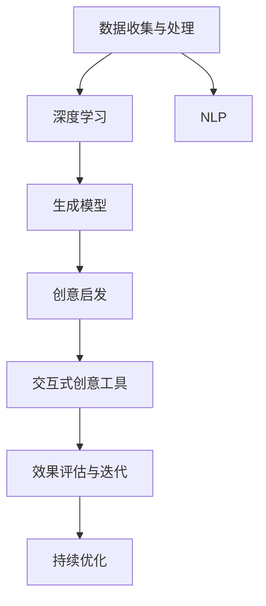

                 

# AI辅助创意：从灵感到实现

> 关键词：
1. AI辅助创作
2. 创意启发
3. 自然语言处理(NLP)
4. 深度学习
5. 生成模型
6. 音乐创作
7. 艺术设计

## 1. 背景介绍

### 1.1 问题由来

在当今数字化时代，人工智能(AI)技术的快速发展为创意产业带来了翻天覆地的变化。从音乐创作到艺术设计，从文学创作到建筑设计，AI已经广泛渗透到各个创意领域。它不仅能够协助创作过程，还能提供创新灵感，甚至在某些领域完全取代人类的创作工作。然而，AI的创作并非凭空而来，而是基于对海量数据的学习和分析，通过生成模型等技术手段，辅助人类进行创意实践。

### 1.2 问题核心关键点

AI辅助创意的核心在于利用数据和算法，从大量数据中挖掘出潜在的模式和规律，再通过生成模型，生成符合特定创意方向的输出。这一过程可以简单概括为以下几个关键点：
1. **数据收集与处理**：从互联网、数据库、社交媒体等渠道获取创意相关的数据。
2. **模型训练与优化**：通过深度学习等技术，训练生成模型，使其能够理解和生成创意内容。
3. **创意启发与辅助**：利用训练好的模型，提供创意灵感，辅助人类创作。
4. **效果评估与迭代**：通过用户反馈和评估，持续优化模型，提升创意质量。

## 2. 核心概念与联系

### 2.1 核心概念概述

为更好地理解AI辅助创意的实现机制，本节将介绍几个关键概念：

- **生成模型(Generative Models)**：一种能够生成新的、未见过的数据的机器学习模型。常见类型包括GANs、VAEs、Transformer等。
- **自然语言处理(NLP)**：利用计算机技术，实现对自然语言的理解、生成和处理。NLP在AI辅助创意中起到数据预处理和输出展示的作用。
- **深度学习(Deep Learning)**：利用多层次的神经网络，从数据中学习高级特征和模式。深度学习是训练生成模型的主力技术。
- **创意启发(Creative Inspiration)**：通过数据和算法，挖掘潜在的创意元素，为人类创作提供灵感。
- **交互式创意工具(Interactive Creative Tools)**：结合用户交互界面，实时展示创意结果，允许用户修改和调整输出内容。

这些概念之间的逻辑关系可以通过以下Mermaid流程图来展示：



这个流程图展示了大语言模型辅助创意过程的关键环节：

1. 首先收集和处理创意相关的数据。
2. 利用深度学习技术训练生成模型，使其能够生成创意内容。
3. 通过创意启发，为人类提供灵感。
4. 交互式创意工具实时展示和调整创意输出。
5. 通过效果评估，持续优化模型和创意过程。

## 3. 核心算法原理 & 具体操作步骤

### 3.1 算法原理概述

AI辅助创意的实现依赖于生成模型。生成模型通过学习数据分布，能够生成符合特定风格和内容的创意作品。其主要思想是，模型通过学习大量输入数据的特征和规律，生成新的、未见过的输出数据。这一过程可以通过以下步骤完成：

1. **数据收集与预处理**：收集与创意相关的文本、图片、音频等数据，进行清洗和标注。
2. **模型训练**：通过深度学习算法，训练生成模型。
3. **创意启发**：利用训练好的生成模型，提供创意灵感，辅助人类创作。
4. **效果评估与优化**：通过用户反馈和评估，持续优化模型和创意过程。

### 3.2 算法步骤详解

AI辅助创意的实现主要包括以下几个关键步骤：

**Step 1: 数据收集与预处理**
- 从互联网、数据库、社交媒体等渠道获取创意相关的数据。
- 对数据进行清洗和标注，去除噪声和冗余信息。

**Step 2: 选择和设计模型**
- 选择合适的生成模型，如GANs、VAEs、Transformer等。
- 根据创意任务类型，设计模型架构，如文本生成、图像生成、音乐生成等。

**Step 3: 训练生成模型**
- 将预处理好的数据输入模型，进行前向传播和后向传播。
- 调整模型参数，最小化损失函数，提高模型性能。

**Step 4: 创意启发与辅助**
- 利用训练好的生成模型，根据输入的创意种子，生成新的创意内容。
- 提供创意灵感，辅助人类创作，如提供音乐节奏、颜色搭配、文本段落等。

**Step 5: 效果评估与优化**
- 收集用户反馈和创意作品的质量评估，进行效果评估。
- 根据评估结果，调整模型参数和创意过程，优化生成质量。

### 3.3 算法优缺点

AI辅助创意具有以下优点：
1. **高效性**：通过机器学习算法，可以快速生成大量创意作品。
2. **灵活性**：能够根据不同创意需求，调整生成模型，适应多样化的创作要求。
3. **创新性**：能够挖掘出人类可能忽视的创意元素，提供新的灵感。

同时，也存在以下缺点：
1. **缺乏情感**：生成的创意作品可能缺乏人类的情感和深度。
2. **依赖数据**：模型的效果依赖于高质量的数据，数据获取成本较高。
3. **公平性**：生成的创意作品可能存在偏见，反映出数据集中的性别、种族等不平等现象。

尽管存在这些局限性，但AI辅助创意在创意产业中的应用前景依然广阔，值得进一步探索和优化。

### 3.4 算法应用领域

AI辅助创意技术已经在多个创意领域得到应用，包括但不限于：

- **音乐创作**：通过生成模型，根据用户输入的旋律或歌词，生成新的音乐作品。
- **艺术设计**：利用生成模型，自动生成绘画、雕塑、设计图等作品。
- **文学创作**：辅助生成小说、诗歌等文学作品，或对现有文本进行再创作。
- **游戏设计**：生成新的游戏场景、角色、故事情节等创意内容。
- **时尚设计**：提供服装、配饰、妆容等创意灵感，辅助设计师设计新作品。

## 4. 数学模型和公式 & 详细讲解 & 举例说明

### 4.1 数学模型构建

本节将使用数学语言对AI辅助创意的实现过程进行更加严格的刻画。

假设输入数据为 $X=\{x_1, x_2, \cdots, x_n\}$，生成模型为 $G_\theta$。其中 $x_i \in \mathcal{X}$，表示第 $i$ 个输入样本，$\mathcal{X}$ 为输入空间。模型的输出为 $G_\theta(x_i) = y_i \in \mathcal{Y}$，其中 $\mathcal{Y}$ 为输出空间。模型的目标是最小化损失函数 $\mathcal{L}(\theta)$，使得生成的输出 $y_i$ 与真实标签 $y_i$ 尽可能接近：

$$
\mathcal{L}(\theta) = \frac{1}{N}\sum_{i=1}^N \ell(G_\theta(x_i), y_i)
$$

其中 $\ell$ 为损失函数，常见类型包括均方误差、交叉熵等。

### 4.2 公式推导过程

以生成对抗网络(GANs)为例，说明生成模型的训练过程。GANs由生成器和判别器两部分组成，生成器的目标是最小化判别器的损失函数，而判别器的目标是最小化生成器的损失函数。假设生成器的参数为 $\theta_G$，判别器的参数为 $\theta_D$，训练过程如下：

1. 固定判别器参数，最小化生成器损失：
$$
\mathcal{L}_G = \mathbb{E}_{x \sim p_x(x)}\left[\log D(G(x))\right] + \mathbb{E}_{z \sim p_z(z)}\left[\log(1 - D(G(z)))\right]
$$

2. 固定生成器参数，最小化判别器损失：
$$
\mathcal{L}_D = \mathbb{E}_{x \sim p_x(x)}\left[\log D(x)\right] + \mathbb{E}_{z \sim p_z(z)}\left[\log(1 - D(G(z)))\right]
$$

其中 $p_x(x)$ 和 $p_z(z)$ 分别表示输入数据的真实分布和噪声分布，$z \sim p_z(z)$ 表示从噪声分布中采样得到随机向量 $z$。

### 4.3 案例分析与讲解

以音乐创作为例，说明AI辅助创意的具体实现过程：

1. **数据收集与预处理**：收集大量的音乐作品数据，进行标注和清洗，去除不相关和噪声数据。

2. **模型训练**：使用GANs模型，根据输入的旋律和歌词，生成新的音乐作品。

3. **创意启发**：利用训练好的模型，根据用户输入的旋律片段和歌词，生成新的音乐作品。

4. **效果评估与优化**：通过用户反馈和音乐作品的评价指标，调整生成模型的参数，优化生成质量。

## 5. 项目实践：代码实例和详细解释说明

### 5.1 开发环境搭建

在进行AI辅助创意的实践前，我们需要准备好开发环境。以下是使用Python进行PyTorch开发的环境配置流程：

1. 安装Anaconda：从官网下载并安装Anaconda，用于创建独立的Python环境。

2. 创建并激活虚拟环境：
```bash
conda create -n pytorch-env python=3.8 
conda activate pytorch-env
```

3. 安装PyTorch：根据CUDA版本，从官网获取对应的安装命令。例如：
```bash
conda install pytorch torchvision torchaudio cudatoolkit=11.1 -c pytorch -c conda-forge
```

4. 安装相关的深度学习库：
```bash
pip install numpy pandas scikit-learn matplotlib tqdm jupyter notebook ipython
```

5. 安装PyTorch和相关库：
```bash
pip install torch torchvision torchaudio
```

完成上述步骤后，即可在`pytorch-env`环境中开始创意辅助实践。

### 5.2 源代码详细实现

以下是一个简单的音乐生成模型代码实现，使用PyTorch框架：

```python
import torch
import torch.nn as nn
import torch.optim as optim

# 定义生成器网络
class Generator(nn.Module):
    def __init__(self, latent_dim, output_dim):
        super(Generator, self).__init__()
        self.fc1 = nn.Linear(latent_dim, 128)
        self.fc2 = nn.Linear(128, 256)
        self.fc3 = nn.Linear(256, output_dim)
    
    def forward(self, x):
        x = torch.relu(self.fc1(x))
        x = torch.relu(self.fc2(x))
        x = torch.sigmoid(self.fc3(x))
        return x

# 定义判别器网络
class Discriminator(nn.Module):
    def __init__(self, input_dim):
        super(Discriminator, self).__init__()
        self.fc1 = nn.Linear(input_dim, 128)
        self.fc2 = nn.Linear(128, 64)
        self.fc3 = nn.Linear(64, 1)
    
    def forward(self, x):
        x = torch.relu(self.fc1(x))
        x = torch.relu(self.fc2(x))
        x = torch.sigmoid(self.fc3(x))
        return x

# 定义数据集
class MusicDataset(torch.utils.data.Dataset):
    def __init__(self, data, labels):
        self.data = data
        self.labels = labels
    
    def __len__(self):
        return len(self.data)
    
    def __getitem__(self, idx):
        return self.data[idx], self.labels[idx]

# 定义损失函数
criterion = nn.BCELoss()

# 定义训练函数
def train_epoch(model_G, model_D, dataloader, optimizer_G, optimizer_D, batch_size, num_epochs):
    for epoch in range(num_epochs):
        for i, (input, label) in enumerate(dataloader):
            input = input.to(device)
            label = label.to(device)
            
            # 训练生成器
            optimizer_G.zero_grad()
            G_output = model_G(input)
            D_real = model_D(input)
            D_fake = model_D(G_output)
            G_loss = criterion(D_fake, torch.ones_like(D_fake))
            G_loss.backward()
            optimizer_G.step()
            
            # 训练判别器
            optimizer_D.zero_grad()
            D_real_loss = criterion(D_real, torch.ones_like(D_real))
            D_fake_loss = criterion(D_fake, torch.zeros_like(D_fake))
            D_loss = D_real_loss + D_fake_loss
            D_loss.backward()
            optimizer_D.step()
            
            # 输出当前损失
            print(f"Epoch {epoch+1}, Batch {i+1}, Generator Loss: {G_loss.item():.4f}, Discriminator Loss: {D_loss.item():.4f}")
    
# 训练模型
device = torch.device('cuda' if torch.cuda.is_available() else 'cpu')
model_G = Generator(latent_dim=64, output_dim=128).to(device)
model_D = Discriminator(input_dim=128).to(device)

optimizer_G = optim.Adam(model_G.parameters(), lr=0.0002)
optimizer_D = optim.Adam(model_D.parameters(), lr=0.0002)

dataloader = torch.utils.data.DataLoader(music_dataset, batch_size=64, shuffle=True)
train_epoch(model_G, model_D, dataloader, optimizer_G, optimizer_D, 100)

```

### 5.3 代码解读与分析

让我们再详细解读一下关键代码的实现细节：

**MusicDataset类**：
- `__init__`方法：初始化数据集，包括输入数据和标签。
- `__len__`方法：返回数据集的大小。
- `__getitem__`方法：对单个样本进行处理，返回输入和标签。

**模型定义**：
- `Generator`类：定义生成器网络，包括三个全连接层和Sigmoid激活函数，用于生成音乐数据。
- `Discriminator`类：定义判别器网络，包括三个全连接层和Sigmoid激活函数，用于区分真实音乐和生成音乐。

**损失函数**：
- `criterion`：定义二分类交叉熵损失函数，用于训练生成器和判别器。

**训练函数**：
- `train_epoch`：定义训练循环，每轮循环包括前向传播和反向传播，更新模型参数。

在实际应用中，可以进一步扩展模型架构，引入更多的创意元素，如音乐风格、情感、节奏等，使其更加丰富和多样。同时，可以考虑结合其他创意工具，如图形界面、实时展示等，增强用户体验和互动性。

## 6. 实际应用场景

### 6.1 音乐创作

AI辅助创意在音乐创作领域的应用极为广泛。传统的音乐创作依赖于艺术家的灵感和技巧，耗时耗力且创作成果具有不确定性。利用AI辅助，创作者可以快速生成多种音乐风格的作品，激发创作灵感，缩短创作周期。

例如，通过输入简单的旋律片段或歌词，生成器能够自动生成完整的音乐作品。用户可以在生成器生成的基础上，进一步修改和调整，完成创作。同时，生成器还可以生成特定的音乐风格，如古典、流行、电子等，帮助创作者拓宽音乐创作的边界。

### 6.2 艺术设计

艺术设计领域同样受益于AI辅助创意。传统的艺术设计需要耗费大量时间和精力，而AI能够快速生成各种风格和主题的艺术作品，为设计师提供灵感和参考。

例如，通过输入草图或设计概念，生成器能够自动生成多种设计方案。设计师可以在生成器生成的基础上进行修改和调整，完成创作。同时，生成器还可以生成特定的设计风格，如抽象、写实、立体主义等，帮助设计师探索新的设计方向。

### 6.3 文学创作

文学创作也是AI辅助创意的重要应用领域。传统的文学创作需要深厚的语言功底和丰富的想象力，而AI能够快速生成各种题材和风格的文学作品，激发作家的灵感。

例如，通过输入故事情节或角色设定，生成器能够自动生成完整的文学作品。作家可以在生成器生成的基础上进行修改和调整，完成创作。同时，生成器还可以生成特定的文学风格，如科幻、奇幻、现实主义等，帮助作家探索新的文学方向。

## 7. 工具和资源推荐

### 7.1 学习资源推荐

为了帮助开发者系统掌握AI辅助创意的理论基础和实践技巧，这里推荐一些优质的学习资源：

1. **《深度学习入门》**：书籍介绍深度学习的基本概念和算法，适合初学者入门。
2. **《生成对抗网络》**：书籍深入浅出地介绍了生成对抗网络的基本原理和应用。
3. **Coursera上的《深度学习专项课程》**：由Coursera和DeepLearning.AI联合推出，涵盖深度学习的多个方向，适合系统学习。
4. **Kaggle平台**：提供大量的创意数据集和比赛项目，适合实践和竞赛。

通过对这些资源的学习实践，相信你一定能够快速掌握AI辅助创意的精髓，并用于解决实际的创意问题。

### 7.2 开发工具推荐

高效的开发离不开优秀的工具支持。以下是几款用于AI辅助创意开发的常用工具：

1. **PyTorch**：基于Python的开源深度学习框架，灵活多变，适合快速迭代研究。
2. **TensorFlow**：由Google主导开发的开源深度学习框架，生产部署方便，适合大规模工程应用。
3. **Weights & Biases**：模型训练的实验跟踪工具，可以记录和可视化模型训练过程中的各项指标，方便调试和优化。
4. **TensorBoard**：TensorFlow配套的可视化工具，可实时监测模型训练状态，提供丰富的图表呈现方式。
5. **Jupyter Notebook**：交互式编程环境，方便记录和分享代码和结果。

合理利用这些工具，可以显著提升AI辅助创意的开发效率，加快创新迭代的步伐。

### 7.3 相关论文推荐

AI辅助创意技术的发展源于学界的持续研究。以下是几篇奠基性的相关论文，推荐阅读：

1. **《Neural Network Architectures for Generative Modelling》**：文章介绍了多种生成模型的架构，包括GANs、VAEs、Transformer等。
2. **《Language and Art as a Joint Probability Distribution》**：文章探讨了语言和艺术的相似性，通过生成模型将两者结合起来。
3. **《Fine-tuning GANs for Specific Creativity Tasks》**：文章介绍了如何通过微调GANs，生成特定领域的创意作品。
4. **《Text-to-Art with Attention-based Text-to-Image Synthesis》**：文章探讨了如何将文本转化为艺术作品，结合生成对抗网络和注意力机制。

这些论文代表了大语言模型辅助创意技术的发展脉络。通过学习这些前沿成果，可以帮助研究者把握学科前进方向，激发更多的创新灵感。

## 8. 总结：未来发展趋势与挑战

### 8.1 总结

本文对AI辅助创意的实现机制进行了全面系统的介绍。首先阐述了AI辅助创意的背景和意义，明确了生成模型、深度学习等技术在创意产业中的应用前景。其次，从原理到实践，详细讲解了生成模型的训练和优化过程，给出了具体代码实例。同时，本文还广泛探讨了AI辅助创意在音乐创作、艺术设计、文学创作等多个创意领域的应用前景，展示了AI辅助创意的巨大潜力。此外，本文精选了AI辅助创意的各类学习资源，力求为读者提供全方位的技术指引。

通过本文的系统梳理，可以看到，AI辅助创意技术正在成为创意产业的重要范式，极大地拓展了创意产业的边界，催生了更多的创意产品。未来，伴随AI技术的持续演进，AI辅助创意将进一步深化与创意产业的融合，带来更加多样化和个性化的创意作品。

### 8.2 未来发展趋势

展望未来，AI辅助创意技术将呈现以下几个发展趋势：

1. **个性化创作**：随着用户数据的积累和算法的优化，AI将能够更加精准地了解用户偏好，生成符合用户个性化的创意作品。
2. **多模态创意**：AI将融合多种创意模式，如图像、音乐、文字等，生成更加丰富多样的创意作品。
3. **智能化创作**：AI将结合专家知识和规则，辅助人类创作，提高创意作品的质量和深度。
4. **实时生成**：AI将能够实时生成创意作品，满足用户即时需求，提升用户体验。
5. **跨领域融合**：AI将与其他创意技术进行深度融合，如VR、AR、虚拟现实等，提供更加沉浸式的创意体验。

以上趋势凸显了AI辅助创意技术的广阔前景。这些方向的探索发展，必将进一步提升创意产业的智能化水平，为人类文化创意产业带来革命性变化。

### 8.3 面临的挑战

尽管AI辅助创意技术已经取得了显著成果，但在迈向更加智能化、普适化应用的过程中，它仍面临诸多挑战：

1. **数据获取成本高**：高质量的创意数据获取成本较高，且数据的多样性和丰富性不足。
2. **创意质量不稳定性**：生成的创意作品可能质量不稳定，受输入数据的影响较大。
3. **创意作品缺乏情感**：生成的创意作品可能缺乏人类的情感和深度，难以满足高层次的创作需求。
4. **版权和伦理问题**：AI生成的创意作品可能涉及版权和伦理问题，需要进一步规范和探讨。

尽管存在这些挑战，但通过持续的优化和创新，AI辅助创意技术将在创意产业中发挥更大的作用，为人类文化创意产业带来新的生机和活力。

### 8.4 研究展望

面对AI辅助创意所面临的挑战，未来的研究需要在以下几个方面寻求新的突破：

1. **数据增强与迁移学习**：利用迁移学习和数据增强技术，扩大数据集规模，提高创意作品的质量和多样性。
2. **多模态创意融合**：结合多种创意模式，如图像、音乐、文字等，生成更加丰富多样的创意作品。
3. **情感注入与优化**：通过改进算法和模型，增强生成的创意作品的情感深度和复杂度。
4. **创意作品版权保护**：研究如何在AI生成创意作品的过程中，尊重版权和伦理，确保作品的质量和合法性。
5. **跨领域创意融合**：结合其他创意技术，如VR、AR、虚拟现实等，提供更加沉浸式的创意体验。

这些研究方向将为AI辅助创意技术带来新的突破，推动创意产业向更加智能化、普适化和个性化方向发展。

## 9. 附录：常见问题与解答

**Q1: AI辅助创意的实现是否需要大量的高质量数据？**

A: 是的，AI辅助创意的实现依赖于高质量的数据。数据的质量和多样性直接影响生成的创意作品的质量和创新性。因此，在实际应用中，需要花费大量时间和精力收集和标注高质量的数据。

**Q2: AI生成的创意作品是否具备人类的情感和深度？**

A: 目前AI生成的创意作品可能缺乏人类的情感和深度，难以满足高层次的创作需求。然而，随着技术的进步和算法的优化，AI生成的创意作品的质量和情感深度将逐渐提升，未来有望与人类创作并肩作战。

**Q3: AI辅助创意的应用是否涉及版权和伦理问题？**

A: 是的，AI辅助创意的应用涉及版权和伦理问题。生成的创意作品可能涉及版权和伦理问题，需要进一步规范和探讨。在未来，如何保护创意作品的版权，确保作品的合法性和质量，将是一个重要的研究方向。

**Q4: AI辅助创意的应用是否会取代人类创作？**

A: 目前AI辅助创意的应用主要是辅助人类创作，而非取代。AI能够提供创意灵感，辅助人类创作，缩短创作周期，提高创作效率，但难以替代人类创作的独特性和深度。

通过本文的系统梳理，可以看到，AI辅助创意技术正在成为创意产业的重要范式，极大地拓展了创意产业的边界，催生了更多的创意产品。未来，伴随AI技术的持续演进，AI辅助创意将进一步深化与创意产业的融合，带来更加多样化和个性化的创意作品。相信随着学界和产业界的共同努力，AI辅助创意必将在创意产业中发挥更大的作用，为人类文化创意产业带来新的生机和活力。

---

作者：禅与计算机程序设计艺术 / Zen and the Art of Computer Programming

