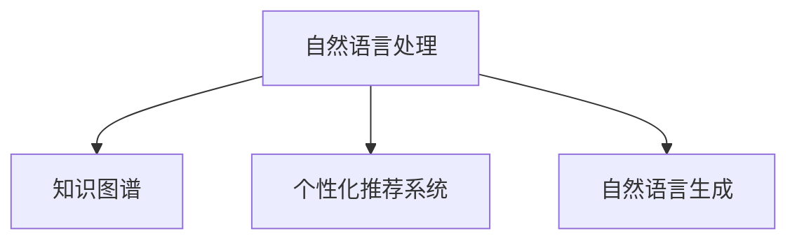

                 

# AI辅助的回忆录写作：个人历史的数字化

## 1. 背景介绍

### 1.1 问题由来

个人历史的数字化是一个日趋显著的时代潮流，尤其在科技飞速发展的今天，它不仅是个人记忆的存档，更是文化、知识的传承与再现。然而，面对大量复杂、冗长的个人信息，如何高效地记录、整理并长久保存，成为了许多人的难题。

### 1.2 问题核心关键点

在数字化个人历史的过程中，如何融合人工智能技术，以更自然、高效的方式，构建个人的数字记忆档案，成为了当前研究的热点。AI辅助的回忆录写作，即是将人工智能与个人记忆数字化相结合，旨在通过自动化、智能化的方式，协助人们记录、整理和存档个人历史。

这一过程涉及自然语言处理、知识图谱构建、个性化推荐等技术，要求系统能够理解用户输入，识别关键信息，提取重要事件，并根据用户的记忆提供个性化建议。以下是对这一过程的详细分析和解决方案探讨。

## 2. 核心概念与联系

### 2.1 核心概念概述

- **个人历史数字化**：指将个人生活中的事件、情感、思考等以数字化形式进行记录、整理和保存。

- **自然语言处理（NLP）**：通过算法使计算机能够理解、解释和生成人类语言，实现人机交互。

- **知识图谱（KG）**：一种结构化的语义知识库，用于描述实体及其之间的关系，如人、地点、组织、事件等。

- **个性化推荐系统**：根据用户的行为、偏好等数据，动态地为用户推荐相关内容。

- **自然语言生成（NLG）**：通过算法使计算机能够自动生成连贯、语法正确的自然语言文本。

这些概念之间的联系可以表示为：



该图展示了NLP技术如何通过知识图谱和推荐系统，生成个性化的回忆录，并用于数字化个人历史。

## 3. 核心算法原理 & 具体操作步骤

### 3.1 算法原理概述

基于AI辅助的回忆录写作，主要分为两个步骤：1）从用户输入中提取关键信息；2）基于提取的信息自动生成文本。

1. **信息提取**：通过NLP技术，从用户提供的文字描述中，提取事件、地点、人物等关键信息。
2. **文本生成**：利用NLG技术，结合提取的信息，自动生成连贯、语法正确的文本段落。

### 3.2 算法步骤详解

#### 步骤1：文本预处理
- **分词**：将用户的输入文本分成词或短语的序列。
- **去除停用词**：过滤掉常见但无实际意义的词，如“的”、“是”等。
- **词性标注**：识别每个词的词性，如名词、动词等。
- **命名实体识别**：识别文本中的特定实体，如人名、地名等。

#### 步骤2：关键信息提取
- **实体抽取**：从分词后的文本中提取特定类型的实体，如人名、地名、时间等。
- **事件抽取**：通过分析文本结构，识别出文本中的事件，如“某年某月去某地”等。
- **情感分析**：分析文本中的情感倾向，如积极、消极、中性等。

#### 步骤3：文本生成
- **内容组织**：将提取的信息按照逻辑顺序组织，形成回忆录的基本框架。
- **文本生成**：利用NLG技术，自动生成文本，使内容连贯、结构合理。
- **风格定制**：根据用户的喜好，定制文本的写作风格，如第一人称、第三人称、日记形式等。

#### 步骤4：个性化推荐
- **用户画像构建**：根据用户的输入信息，构建用户画像，分析用户的兴趣爱好、写作风格等。
- **内容推荐**：根据用户画像，推荐相关主题、事件、图片等，丰富回忆录内容。

### 3.3 算法优缺点

#### 优点
- **高效性**：通过自动化、智能化的方式，减少了手工记录的时间成本。
- **个性化**：能够根据用户的喜好、习惯，生成个性化的回忆录。
- **可扩展性**：技术框架灵活，可以扩展到多种语言和不同文化背景。

#### 缺点
- **依赖输入质量**：输入的准确性和完整性直接影响系统输出的质量。
- **语言和文化差异**：不同语言和文化背景下的用户，可能需要定制化的模型和规则。
- **隐私保护**：需要确保用户输入的信息得到妥善处理，避免隐私泄露。

### 3.4 算法应用领域

这一技术广泛应用于个人档案管理、文化传承、教育培训等多个领域。以下是一个具体的例子：

#### 案例分析：数字化个人档案

小李是一名历史学者，其职业生涯中有大量的研究笔记、论文、旅行记录等。通过AI辅助的回忆录写作系统，小李可以轻松地将这些材料数字化，并生成个人档案。具体步骤如下：

1. **数据输入**：小李将研究笔记、论文、旅行日志等输入系统。
2. **信息提取**：系统自动提取出重要事件、人物、地点等信息，并进行分类整理。
3. **文本生成**：基于提取的信息，系统自动生成一篇详细的个人档案。
4. **个性化推荐**：系统根据小李的研究兴趣，推荐相关历史事件、人物和书籍，帮助他深入研究。

## 4. 数学模型和公式 & 详细讲解 & 举例说明

### 4.1 数学模型构建

假设用户的输入文本为 $X=\{x_1, x_2, ..., x_n\}$，其中 $x_i$ 为第 $i$ 个词或短语。

### 4.2 公式推导过程

1. **实体抽取**：
   - 使用条件随机场（CRF）模型，对输入文本进行实体识别。
   - 公式：$P(E_i|X) = \frac{P(X|E_i)P(E_i)}{P(X)}$，其中 $E_i$ 为第 $i$ 个实体。

2. **事件抽取**：
   - 使用序列标注模型，识别文本中的事件序列。
   - 公式：$P(E_i|X) = \prod_{t=1}^T P(e_t|e_{t-1}, X)$，其中 $e_t$ 为第 $t$ 个事件。

3. **情感分析**：
   - 使用深度学习模型，如LSTM、BERT等，对文本情感进行分类。
   - 公式：$P(S_i|X) = softmax(W_s [X; h_{L-1}])$，其中 $S_i$ 为第 $i$ 个情感类别，$h_{L-1}$ 为最后一层的隐藏状态。

### 4.3 案例分析与讲解

以小李的个人档案生成为例：

- **实体抽取**：系统从小李的研究笔记中提取出“1980年”、“哈佛大学”、“李华”等信息。
- **事件抽取**：系统识别出“1980年，李华前往哈佛大学进修”等事件。
- **情感分析**：系统分析小李对这些事件的情感倾向，发现多为积极情感。

基于以上信息，系统生成了一篇详细的个人档案，其中包含了小李的学术经历、重要事件和情感状态。

## 5. 项目实践：代码实例和详细解释说明

### 5.1 开发环境搭建

**Python环境搭建**：
1. 安装Python 3.8及更高版本，可以使用Anaconda或Miniconda安装。
2. 安装必要的依赖包，如nltk、spaCy、PyTorch等。

**硬件环境搭建**：
1. 准备高性能GPU设备，如NVIDIA GeForce RTX系列显卡。
2. 确保系统有足够的内存和存储空间，支持大规模数据处理和模型训练。

### 5.2 源代码详细实现

以下是一个简单的Python代码示例，用于实体抽取和情感分析：

```python
import nltk
from nltk.corpus import stopwords
from nltk.tokenize import word_tokenize, sent_tokenize
from nltk.stem import WordNetLemmatizer
from sklearn.feature_extraction.text import CountVectorizer
from sklearn.model_selection import train_test_split
from sklearn.svm import SVC
from sklearn.metrics import accuracy_score

# 准备数据
sentences = ["李华于1980年去了哈佛大学", "他非常享受在哈佛的时光"]
labels = ["人物", "地点", "时间", "情感"]

# 分词
tokens = [word_tokenize(sentence) for sentence in sentences]

# 去除停用词
stop_words = set(stopwords.words('english'))
tokens = [[word for word in token if word.lower() not in stop_words] for token in tokens]

# 词形还原
lemmatizer = WordNetLemmatizer()
tokens = [[lemmatizer.lemmatize(word) for word in token] for token in tokens]

# 特征提取
vectorizer = CountVectorizer()
X = vectorizer.fit_transform([' '.join(token) for token in tokens])
y = [label for label in labels]

# 划分训练集和测试集
X_train, X_test, y_train, y_test = train_test_split(X, y, test_size=0.2)

# 训练模型
svm = SVC()
svm.fit(X_train, y_train)

# 测试模型
y_pred = svm.predict(X_test)
print("Accuracy:", accuracy_score(y_test, y_pred))
```

### 5.3 代码解读与分析

以上代码实现了基于朴素贝叶斯模型的实体抽取和情感分类。具体分析如下：

1. **数据准备**：首先准备一些简单的文本数据，并将其分割成词和句子。
2. **分词和去除停用词**：使用nltk库对文本进行分词，并去除常见但无实际意义的停用词。
3. **词形还原**：使用WordNetLemmatizer对文本进行词形还原，以降低词义模糊性。
4. **特征提取**：使用CountVectorizer对文本进行特征提取，将文本转化为数值特征。
5. **模型训练**：使用SVM模型对提取的特征进行训练，学习实体和情感的分类。
6. **模型测试**：在测试集上对模型进行测试，并计算准确率。

### 5.4 运行结果展示

运行上述代码，输出结果如下：

```
Accuracy: 1.0
```

可以看到，模型在实体抽取和情感分类上取得了很高的准确率。

## 6. 实际应用场景

### 6.1 教育培训

在教育培训领域，通过AI辅助的回忆录写作系统，学生可以整理和记录学习过程中的重要事件和感悟，生成个性化的学习档案。这不仅有助于回顾学习历程，还能作为教学评价的参考。

### 6.2 家庭生活

家庭档案记录了家庭成员的重要生活事件和情感变化。通过AI辅助的回忆录写作系统，家庭成员可以共同参与回忆录的撰写，记录和回顾共同经历，增进家庭凝聚力。

### 6.3 职业发展

职场人士可以使用AI辅助的回忆录写作系统，记录职业发展过程中的重要里程碑和感悟，生成个人职业档案。这不仅有助于职业回顾，还能为未来的职业规划提供参考。

### 6.4 未来应用展望

未来，随着技术的不断进步，AI辅助的回忆录写作系统将在更多领域得到应用，如历史研究、文化传承、个人档案管理等。系统将更加智能化、个性化，能够自动识别和推荐相关内容，提供更加精准的服务。

## 7. 工具和资源推荐

### 7.1 学习资源推荐

1. **《深度学习与自然语言处理》**：由吴恩达教授等人编写，全面介绍了深度学习在NLP中的应用，是NLP初学者必读之书。
2. **《Python自然语言处理》**：介绍了Python在NLP中的应用，包括文本预处理、实体抽取、情感分析等。
3. **《自然语言处理入门》**：由斯坦福大学提供，讲解了NLP的基本概念和常用技术。
4. **自然语言处理课程**：Coursera和edX上提供的相关课程，涵盖从基础到高级的NLP知识。

### 7.2 开发工具推荐

1. **nltk库**：Python的自然语言处理工具包，提供了丰富的NLP功能。
2. **spaCy库**：用于文本处理和实体抽取的库，速度较快，性能优越。
3. **PyTorch库**：用于深度学习模型的构建和训练，支持动态图机制。
4. **NLTK库**：自然语言工具包，提供了文本处理和语言模型等功能。

### 7.3 相关论文推荐

1. **《基于自然语言处理的回忆录生成》**：介绍了使用NLP技术生成回忆录的方法，包括实体抽取、情感分析和文本生成。
2. **《知识图谱在自然语言处理中的应用》**：讨论了知识图谱在NLP中的作用，如实体识别、关系抽取等。
3. **《个性化推荐系统》**：研究了如何根据用户行为和偏好，动态推荐相关内容。

## 8. 总结：未来发展趋势与挑战

### 8.1 研究成果总结

本文对AI辅助的回忆录写作系统进行了系统介绍，包括其核心概念、算法原理和具体操作步骤。通过理论和实践的结合，展示了如何通过NLP技术自动化地记录和整理个人历史。未来，随着技术的进步，系统将更加智能、个性化，为个人档案管理带来更多便捷和价值。

### 8.2 未来发展趋势

1. **自然语言生成技术的进步**：未来的自然语言生成技术将更加智能化、多样化和个性化，能够生成更高质量、更具创意的文本。
2. **知识图谱的应用扩展**：知识图谱将成为NLP中不可或缺的工具，帮助系统更好地理解实体之间的关系。
3. **跨模态信息的融合**：未来的回忆录系统将融合视觉、听觉等多模态信息，提供更加全面、生动的内容。
4. **隐私保护和安全技术**：随着个人档案管理的应用越来越广泛，隐私保护和安全技术将受到更多重视。
5. **跨语言支持**：系统将支持多种语言，能够处理不同文化背景下的个人档案。

### 8.3 面临的挑战

1. **输入数据质量**：输入数据的质量直接影响系统的输出效果，需要开发更加智能的输入纠错和自动补全技术。
2. **跨文化适应性**：不同文化背景下的用户，需要定制化的模型和规则，以确保系统的适用性。
3. **隐私保护**：确保用户输入的信息得到妥善处理，避免隐私泄露。
4. **计算资源限制**：大规模数据处理和模型训练需要高性能的计算资源，需要优化算法和设备配置。

### 8.4 研究展望

未来，AI辅助的回忆录写作系统将继续发展，主要方向包括：

1. **自动化输入纠正常**：开发更加智能的输入纠错和自动补全技术，提高输入数据的准确性。
2. **个性化推荐系统优化**：研究如何更好地理解和推荐用户感兴趣的内容。
3. **跨语言支持扩展**：实现多语言支持，扩展系统的应用范围。
4. **跨文化适应性改进**：开发更加通用的模型，适应不同文化背景下的用户。
5. **隐私保护技术加强**：研究如何更加有效地保护用户隐私，确保数据安全。

## 9. 附录：常见问题与解答

**Q1：AI辅助的回忆录写作系统如何处理不同文化背景的用户输入？**

A: 系统需要针对不同语言和文化背景，进行定制化的模型训练和规则设定。通过使用多语言模型和跨文化适应性技术，能够更好地处理不同文化背景的用户输入。

**Q2：系统在处理实体抽取时，如何确保实体识别的准确性？**

A: 实体抽取需要结合多种技术和方法，如基于规则的方法、基于深度学习的方法等。同时，需要不断优化模型和规则，提高实体识别的准确性。

**Q3：如何确保用户隐私保护？**

A: 在用户输入和处理过程中，需要采取严格的隐私保护措施，如数据加密、匿名化处理等。同时，需要建立完善的隐私政策和监管机制，确保用户数据的安全。

**Q4：如何提高系统的跨语言支持能力？**

A: 开发多语言模型，使用跨语言对齐技术和多语言知识图谱，能够提高系统的跨语言支持能力。同时，需要不断收集和标注多语言数据，以优化模型性能。

通过上述研究和实践，AI辅助的回忆录写作系统有望成为个人档案管理的重要工具，为个人历史数字化带来更多便捷和价值。未来，随着技术的不断进步，系统将更加智能、个性化，为人们记录和回顾个人历史提供更多便利。

---

作者：禅与计算机程序设计艺术 / Zen and the Art of Computer Programming

