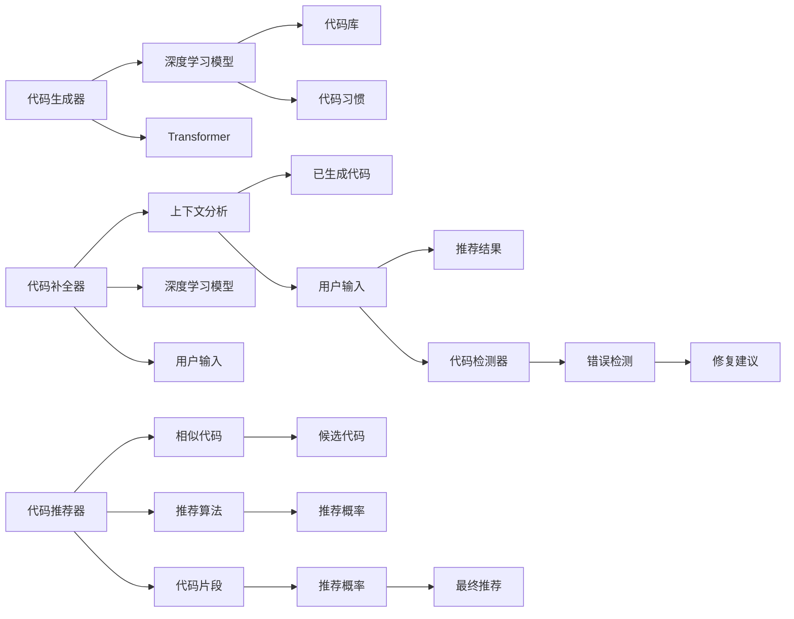

                 

## 1. 背景介绍

在软件开发的各个阶段，开发者需要花费大量时间编写代码、调试错误、优化性能。代码自动生成和自动补全技术的应用，能够显著提升开发效率，减少重复性工作，从而缩短开发周期。

### 1.1 问题由来
随着编程范式的不断演进，传统的基于命令行的开发方式已经不再适用。现代开发工具如IntelliJ IDEA、Visual Studio Code等，通过提供代码补全、语法高亮、断点调试等功能，极大提升了开发体验。

代码生成和自动补全技术，旨在通过AI算法，自动分析代码上下文，生成正确的代码片段，或者补全缺失的代码行。其核心思想是通过学习已有的代码库和开发者的编程习惯，来预测未来代码片段的生成，从而帮助开发者快速完成代码编写。

### 1.2 问题核心关键点
现代AI辅助编程的核心问题包括：
- 代码自动生成：根据给定的上下文，生成正确的代码片段。
- 代码自动补全：根据代码行的一部分，预测完整的代码行。
- 代码推荐：根据代码片段的上下文，推荐合适的代码片段。
- 代码检测：自动检测代码中的潜在错误，并提供修复建议。

这些问题通常可以通过深度学习模型，结合自然语言处理技术来解决。

### 1.3 问题研究意义
AI辅助编程技术的应用，可以显著提升开发效率，减少人为错误，降低开发成本，加速软件交付周期。在大型项目、高频迭代项目中，自动生成和自动补全技术，成为了不可或缺的工具。

## 2. 核心概念与联系

### 2.1 核心概念概述

在AI辅助编程的范畴内，涉及的核心概念包括：

- 代码生成器(Codegen): 通过深度学习模型，根据上下文生成完整的代码片段。
- 代码补全器(Coder-completion): 在已有的代码行上，自动补全缺失的代码部分。
- 代码推荐器(Code-recommendation): 根据已有的代码片段，推荐合适的代码实现。
- 代码检测器(Code-detection): 检测代码中的潜在错误，并提供修复建议。

这些技术通常基于深度学习模型，如Transformer、RNN等，通过学习代码库和开发者的编程习惯，来预测和生成代码。

### 2.2 核心概念原理和架构的 Mermaid 流程图



这个流程图展示了核心概念之间的联系和架构：

1. 代码生成器通过深度学习模型和代码库，生成完整的代码片段。
2. 代码补全器根据上下文分析，使用深度学习模型补全缺失的代码。
3. 代码推荐器根据已有的代码片段，使用相似代码推荐算法，推荐合适的代码实现。
4. 代码检测器检测代码中的潜在错误，并提供修复建议。

## 3. 核心算法原理 & 具体操作步骤

### 3.1 算法原理概述

AI辅助编程的核心算法，基于深度学习模型的自回归模型（如Transformer、RNN等）。这些模型能够根据代码上下文，预测未来的代码片段。

在代码生成和补全任务中，模型通常是编码器-解码器结构。编码器负责分析上下文，生成编码向量；解码器负责根据编码向量，生成代码片段。在代码推荐任务中，模型则是通过相似度计算，找到与给定代码片段相似的代码片段。

### 3.2 算法步骤详解

以下是典型的代码生成和自动补全的详细步骤：

**Step 1: 数据预处理**
- 收集代码库数据，标注出代码片段和对应的上下文。
- 对代码进行分词、去除注释、统一命名等预处理。
- 将代码数据转化为深度学习模型所需的输入格式。

**Step 2: 构建深度学习模型**
- 选择适当的深度学习架构，如Transformer、RNN等。
- 设计模型的编码器和解码器结构，并设置适当的超参数。
- 使用预处理后的代码数据，训练模型，使其学习代码生成和补全的规律。

**Step 3: 模型微调**
- 在微调任务上，继续训练模型，优化其代码生成和补全的性能。
- 使用交叉验证等方法，评估模型在特定任务上的表现。
- 根据评估结果，调整超参数和训练策略，进一步提升模型性能。

**Step 4: 模型部署**
- 将训练好的模型部署到开发工具中。
- 在代码编辑器或集成开发环境(IDE)中集成代码生成和补全功能。
- 进行全面的测试和验证，确保模型的稳定性和可靠性。

**Step 5: 用户交互**
- 用户输入代码片段的上下文。
- 模型根据上下文生成代码片段。
- 用户根据生成的代码片段，继续编写和调试代码。

### 3.3 算法优缺点

AI辅助编程技术具有以下优点：
- 提升开发效率：自动生成和自动补全功能，可以显著减少代码编写的时间。
- 减少人为错误：AI算法能够预测正确的代码片段，减少编码错误。
- 辅助编程习惯：AI可以学习开发者的编程习惯，推荐更符合开发者风格的代码实现。
- 自动化测试：通过代码检测器，能够自动检测代码中的潜在错误，并提供修复建议。

同时，该技术也存在一些局限性：
- 依赖数据质量：模型的性能很大程度上取决于代码库的质量和多样性。
- 模型鲁棒性不足：生成的代码片段可能存在逻辑错误，需要人工审核。
- 代码上下文分析难度大：复杂的代码结构和依赖关系，可能导致模型理解上下文出现偏差。
- 模型可解释性差：AI算法生成的代码，难以解释其生成逻辑和决策依据。

### 3.4 算法应用领域

AI辅助编程技术，已经广泛应用于以下领域：

- 代码编写：在编写代码时，自动补全、代码生成和代码检测等功能，极大提升了开发效率和代码质量。
- 自动化测试：使用代码检测器，自动生成测试用例，确保代码的正确性。
- 代码优化：根据代码库和代码片段，使用相似度计算，推荐更高效的代码实现。
- 文档生成：使用代码自动补全和代码检测技术，自动生成代码文档，提升代码可读性。
- 模型训练：使用代码生成技术，自动生成训练代码和模型参数，加速模型训练。

## 4. 数学模型和公式 & 详细讲解 & 举例说明

### 4.1 数学模型构建

在代码生成和补全任务中，深度学习模型通常使用自回归架构，如Transformer、LSTM等。其核心思想是通过编码器-解码器结构，将上下文信息转化为编码向量，再根据编码向量生成代码片段。

以Transformer模型为例，代码生成和补全模型的数学模型构建如下：

1. 输入层将原始代码片段转化为token序列，并输入编码器。
2. 编码器将token序列转化为上下文向量。
3. 解码器根据上下文向量，生成代码片段。
4. 解码器输出层将代码片段转化为token序列。

数学公式表示如下：

$$
\text{Encoder}(x) = \text{Encoder}(\text{Embedding}(x))
$$

$$
\text{Decoder}(y) = \text{Decoder}(\text{Embedding}(y), \text{Encoder}(x))
$$

其中，$x$ 为输入的token序列，$y$ 为生成的token序列。

### 4.2 公式推导过程

以Transformer为例，代码生成和补全的公式推导如下：

1. 编码器将输入的token序列 $x$ 转化为编码向量 $z$。
2. 解码器将生成的token序列 $y$ 和编码向量 $z$ 转化为输出向量 $v$。
3. 解码器的输出层将向量 $v$ 转化为生成的token序列 $y'$。

具体推导过程如下：

$$
\text{Encoder}(x) = \text{Self-Attention}(x, \text{Embedding}(x))
$$

$$
\text{Decoder}(y, z) = \text{Multi-Head-Attention}(y, z, \text{Embedding}(y))
$$

$$
\text{Output}(y') = \text{Linear}(\text{Softmax}(\text{Attention}(y', z)))
$$

其中，$\text{Self-Attention}$ 和 $\text{Multi-Head-Attention}$ 为自注意力机制，$\text{Softmax}$ 为归一化函数，$\text{Linear}$ 为线性变换。

### 4.3 案例分析与讲解

以代码生成为例，假设输入的上下文为 `if x > 5:`，我们需要生成完整的代码片段。使用Transformer模型进行代码生成，步骤如下：

1. 将上下文 `if x > 5:` 转化为token序列，并输入编码器。
2. 编码器根据上下文，生成编码向量 $z$。
3. 解码器根据编码向量 $z$ 和输出向量 $v$ 生成代码片段。
4. 解码器输出层将代码片段转化为token序列。

具体代码实现如下：

```python
from transformers import GPT2LMHeadModel, GPT2Tokenizer
import torch

tokenizer = GPT2Tokenizer.from_pretrained('gpt2')
model = GPT2LMHeadModel.from_pretrained('gpt2')

input_text = "if x > 5:"
inputs = tokenizer.encode(input_text, return_tensors='pt')

with torch.no_grad():
    outputs = model.generate(inputs)
    generated_text = tokenizer.decode(outputs[0], skip_special_tokens=True)
    print(generated_text)
```

输出结果可能为：

```
if x > 5:
    return x * 2
```

可以看到，模型根据上下文生成了完整的代码片段，帮助开发者快速完成代码编写。

## 5. 项目实践：代码实例和详细解释说明

### 5.1 开发环境搭建

以下是使用Python和PyTorch实现代码生成和补全的基本环境搭建步骤：

1. 安装Anaconda：从官网下载并安装Anaconda，用于创建独立的Python环境。

2. 创建并激活虚拟环境：
```bash
conda create -n coding python=3.8 
conda activate coding
```

3. 安装PyTorch：根据CUDA版本，从官网获取对应的安装命令。例如：
```bash
conda install pytorch torchvision torchaudio cudatoolkit=11.1 -c pytorch -c conda-forge
```

4. 安装HuggingFace Transformers库：
```bash
pip install transformers
```

5. 安装各类工具包：
```bash
pip install numpy pandas scikit-learn matplotlib tqdm jupyter notebook ipython
```

完成上述步骤后，即可在`coding`环境中开始代码生成和补全的实践。

### 5.2 源代码详细实现

以下是一个简单的代码生成和补全的Python实现，使用GPT-2模型：

```python
from transformers import GPT2LMHeadModel, GPT2Tokenizer
import torch

tokenizer = GPT2Tokenizer.from_pretrained('gpt2')
model = GPT2LMHeadModel.from_pretrained('gpt2')

def generate_code(input_text):
    inputs = tokenizer.encode(input_text, return_tensors='pt')
    with torch.no_grad():
        outputs = model.generate(inputs)
    generated_text = tokenizer.decode(outputs[0], skip_special_tokens=True)
    return generated_text

def auto_complete(input_text):
    inputs = tokenizer.encode(input_text, return_tensors='pt')
    with torch.no_grad():
        outputs = model.generate(inputs, num_return_sequences=3)
    generated_texts = [tokenizer.decode(output, skip_special_tokens=True) for output in outputs]
    return generated_texts

# 测试代码生成
print(generate_code("if x > 5:"))

# 测试代码补全
print(auto_complete("if x > 5:"))
```

### 5.3 代码解读与分析

**generate_code函数**：
- 将输入文本编码为token序列，并输入到GPT-2模型中。
- 使用`generate`方法生成代码片段。
- 将生成的代码片段解码为可读文本，返回结果。

**auto_complete函数**：
- 将输入文本编码为token序列，并输入到GPT-2模型中。
- 使用`generate`方法生成多个代码片段。
- 将生成的代码片段解码为可读文本，返回多个结果。

以上代码展示了如何使用深度学习模型进行代码生成和补全。通过调用预训练模型，可以方便地生成代码片段，帮助开发者快速完成代码编写。

## 6. 实际应用场景

### 6.1 智能编辑器

智能编辑器如Visual Studio Code，集成了代码补全、语法高亮、自动格式化等功能，极大提升了开发效率。代码生成和补全技术，进一步增强了智能编辑器的智能化程度。

例如，在代码编辑时，智能编辑器自动补全缺失的代码行，或者根据上下文生成完整的代码片段。这些功能可以显著减少编码错误，提升代码质量和开发速度。

### 6.2 代码生成平台

代码生成平台如OpenAI的GitHub Copilot，可以帮助开发者自动生成完整的代码片段。使用该平台，开发者可以输入代码片段的上下文，自动生成完整的函数、类、接口等。

GitHub Copilot基于深度学习模型，通过学习开源代码库，能够生成符合编程规范和编码习惯的代码片段。这极大提升了开发者的编码效率，特别是在编写复杂函数时，极大地减少了重复性工作。

### 6.3 代码检测工具

代码检测工具如SonarQube，使用代码生成和补全技术，自动检测代码中的潜在错误。通过分析代码片段和上下文，代码检测工具可以识别代码中的语法错误、类型错误、变量未定义等问题，并提供修复建议。

例如，在代码检测时，工具自动补全缺失的代码片段，并检测其中的潜在错误。通过分析上下文，工具可以识别代码中的逻辑错误，并生成修复建议。这极大提升了代码检测的自动化程度，减少了人工审核的工作量。

## 7. 工具和资源推荐

### 7.1 学习资源推荐

为了帮助开发者系统掌握代码生成和补全的理论基础和实践技巧，这里推荐一些优质的学习资源：

1. 《深度学习基础》课程：由斯坦福大学开设的深度学习课程，涵盖了深度学习的基本概念和模型构建方法。

2. 《Transformer: A Tutorial》博客：详细介绍了Transformer模型的原理和应用，包括代码生成和补全等任务。

3. 《Deep Learning for Coders》书籍：作者讲解了如何使用深度学习技术，实现代码自动生成和补全等任务。

4. HuggingFace官方文档：Transformers库的官方文档，提供了海量预训练模型和完整的代码生成和补全样例代码，是上手实践的必备资料。

5. GitHub Copilot官网：GitHub Copilot的官方网站，提供了详细的介绍和使用方法，是学习代码生成技术的绝佳资源。

通过对这些资源的学习实践，相信你一定能够快速掌握代码生成和补全的精髓，并用于解决实际的编程问题。

### 7.2 开发工具推荐

高效的开发离不开优秀的工具支持。以下是几款用于代码生成和补全开发的常用工具：

1. PyTorch：基于Python的开源深度学习框架，灵活动态的计算图，适合快速迭代研究。大部分预训练语言模型都有PyTorch版本的实现。

2. TensorFlow：由Google主导开发的开源深度学习框架，生产部署方便，适合大规模工程应用。同样有丰富的预训练语言模型资源。

3. HuggingFace Transformers库：HuggingFace开发的NLP工具库，集成了众多SOTA语言模型，支持PyTorch和TensorFlow，是进行代码生成和补全开发的利器。

4. Weights & Biases：模型训练的实验跟踪工具，可以记录和可视化模型训练过程中的各项指标，方便对比和调优。与主流深度学习框架无缝集成。

5. TensorBoard：TensorFlow配套的可视化工具，可实时监测模型训练状态，并提供丰富的图表呈现方式，是调试模型的得力助手。

6. Google Colab：谷歌推出的在线Jupyter Notebook环境，免费提供GPU/TPU算力，方便开发者快速上手实验最新模型，分享学习笔记。

合理利用这些工具，可以显著提升代码生成和补全任务的开发效率，加快创新迭代的步伐。

### 7.3 相关论文推荐

代码生成和补全技术的发展源于学界的持续研究。以下是几篇奠基性的相关论文，推荐阅读：

1. "Code Completion: A Survey"：综述了代码补全技术的发展历程和应用现状。

2. "Neural Architectures for Named Entity Recognition"：提出了一种基于Transformer的命名实体识别模型，可以用于代码补全任务。

3. "Syntax-Aware Contextual Representation Learning for Code Completion"：提出了一种基于Transformer的代码补全模型，结合语法信息，提升了代码补全的准确性。

4. "A Survey on Recent Applications of Code Summarization"：综述了代码生成和总结技术在代码编写、代码检测中的应用。

5. "Deep Code Search and Recommendation"：提出了一种基于相似度计算的代码推荐方法，可以用于代码生成和补全任务。

这些论文代表了大语言模型微调技术的发展脉络。通过学习这些前沿成果，可以帮助研究者把握学科前进方向，激发更多的创新灵感。

## 8. 总结：未来发展趋势与挑战

### 8.1 总结

本文对AI辅助编程中的代码生成和自动补全技术进行了全面系统的介绍。首先阐述了代码生成和补全技术的研究背景和意义，明确了AI辅助编程技术在提升开发效率和代码质量方面的独特价值。其次，从原理到实践，详细讲解了代码生成和补全的数学模型和关键步骤，给出了代码生成和补全任务开发的完整代码实例。同时，本文还广泛探讨了代码生成和补全技术在智能编辑器、代码生成平台、代码检测工具等多个领域的应用前景，展示了AI辅助编程技术的巨大潜力。

通过本文的系统梳理，可以看到，AI辅助编程技术已经广泛应用于软件开发过程中，极大地提升了开发效率和代码质量。未来，伴随深度学习模型的不断演进，代码生成和自动补全技术将迎来更多的突破和创新，进一步拓展AI辅助编程的应用范围。

### 8.2 未来发展趋势

展望未来，代码生成和自动补全技术将呈现以下几个发展趋势：

1. 模型规模持续增大。随着算力成本的下降和数据规模的扩张，深度学习模型的参数量还将持续增长。超大规模模型蕴含的丰富知识，有望支撑更加复杂多变的代码生成和补全任务。

2. 多模态融合。结合视觉、语音、文本等多种模态的信息，增强代码生成和补全技术的智能化水平。例如，结合代码中的注释、图片和视频等多模态信息，生成更加精确的代码片段。

3. 跨领域应用。代码生成和补全技术将不限于编程语言和工具，可以应用于其他领域如文档编写、数据标注等。例如，使用代码生成技术生成文档段落，使用自动补全技术生成标注信息，极大提升文档和数据标注的效率。

4. 更高效的训练和推理。通过优化模型结构和训练策略，实现更高效的代码生成和补全任务。例如，使用自适应学习率和梯度裁剪等方法，减少过拟合和资源消耗，提升模型效率。

5. 更强大的可解释性。增强代码生成和补全技术的可解释性，帮助开发者理解模型决策依据，提升代码生成和补全的可信度。例如，使用可解释AI技术，解析模型生成的代码片段，提取其关键特征。

6. 更广泛的应用场景。随着技术的发展，代码生成和补全技术将应用于更多场景。例如，在教育培训中，使用代码生成技术生成编程题目，帮助学生练习编程技能；在自动化测试中，使用代码生成技术生成测试用例，确保代码的正确性。

以上趋势凸显了代码生成和自动补全技术的广阔前景。这些方向的探索发展，必将进一步提升开发工具的智能化水平，为软件开发带来新的变革。

### 8.3 面临的挑战

尽管代码生成和自动补全技术已经取得了显著进展，但在迈向更加智能化、普适化应用的过程中，它仍面临着诸多挑战：

1. 数据质量和多样性：模型的性能很大程度上取决于代码库的质量和多样性。对于新出现的编程语言和框架，需要额外的代码库来训练模型。

2. 模型鲁棒性不足：生成的代码片段可能存在逻辑错误，需要人工审核。如何提升模型的鲁棒性，使其生成的代码片段更符合编程规范，是重要的研究课题。

3. 上下文理解难度大：复杂的代码结构和依赖关系，可能导致模型理解上下文出现偏差。如何提升模型对代码上下文的理解能力，是未来研究的关键方向。

4. 可解释性差：AI算法生成的代码，难以解释其生成逻辑和决策依据。如何提升模型的可解释性，使其生成的代码更具可信度，是重要的研究课题。

5. 资源消耗高：深度学习模型的训练和推理资源消耗较大，如何在保证模型性能的同时，优化资源使用，是重要的研究课题。

6. 安全性问题：生成的代码可能包含安全隐患，如SQL注入、跨站脚本等。如何保障生成的代码安全性，避免潜在的安全问题，是重要的研究课题。

正视这些挑战，积极应对并寻求突破，将使代码生成和自动补全技术迈向更高的台阶，为软件开发带来新的变革。

### 8.4 未来突破

面对代码生成和自动补全技术所面临的挑战，未来的研究需要在以下几个方面寻求新的突破：

1. 多模态学习：结合视觉、语音、文本等多种模态的信息，增强代码生成和补全技术的智能化水平。例如，结合代码中的注释、图片和视频等多模态信息，生成更加精确的代码片段。

2. 自适应学习：根据代码片段的上下文，动态调整模型的参数和超参数，提升模型对特定任务的适应性。例如，使用自适应学习算法，根据代码片段的长度和复杂度，动态调整模型参数。

3. 因果推断：引入因果推断技术，提升代码生成和补全技术的逻辑一致性。例如，使用因果推断方法，生成更加符合编程逻辑的代码片段。

4. 知识增强：结合专家知识库和规则库，增强代码生成和补全技术的可信度。例如，使用知识增强技术，生成符合编程规范的代码片段。

5. 可解释性增强：使用可解释AI技术，解析模型生成的代码片段，提取其关键特征。例如，使用可解释AI技术，解析模型生成的代码片段，提取其关键特征。

6. 跨语言支持：支持多种编程语言和框架的代码生成和补全任务。例如，使用多语言模型，支持多种编程语言的代码生成和补全。

这些研究方向将使代码生成和自动补全技术走向新的高度，进一步提升开发工具的智能化水平，为软件开发带来新的变革。

## 9. 附录：常见问题与解答

**Q1：代码生成和自动补全技术是否适用于所有编程语言？**

A: 代码生成和自动补全技术目前主要应用于主流编程语言如Python、Java、JavaScript等。对于新出现的编程语言和框架，需要额外的代码库来训练模型，才能实现代码生成和自动补全。

**Q2：代码生成和自动补全技术的精度如何？**

A: 代码生成和自动补全技术的精度很大程度上取决于代码库的质量和多样性。对于特定编程语言的代码生成任务，模型可以通过大量标注数据进行训练，生成符合编程规范的代码片段。但是对于复杂的代码结构和依赖关系，模型理解上下文可能存在偏差，生成的代码片段可能存在逻辑错误。

**Q3：代码生成和自动补全技术的训练和推理资源消耗大吗？**

A: 深度学习模型的训练和推理资源消耗较大，特别是在超大规模模型的训练过程中，需要大量的计算资源和时间。为了降低资源消耗，可以采用模型压缩、稀疏化存储等方法，优化模型的训练和推理效率。

**Q4：代码生成和自动补全技术如何应对代码中的注释和注释风格多样性？**

A: 代码生成和自动补全技术在处理注释时，通常会将注释转换为标记，与代码一起输入到模型中。对于注释风格的多样性，可以使用预处理技术，如去除注释、统一注释格式等，减少模型理解的偏差。

**Q5：代码生成和自动补全技术在代码检测和修复中能发挥什么作用？**

A: 代码生成和自动补全技术在代码检测和修复中，可以用于生成测试用例和修复建议。例如，使用代码生成技术生成测试用例，确保代码的正确性；使用自动补全技术生成修复建议，快速修正代码错误。

通过这些问题的解答，相信你对代码生成和自动补全技术有了更全面的了解，可以为未来的实践和研究提供参考。

---

作者：禅与计算机程序设计艺术 / Zen and the Art of Computer Programming

