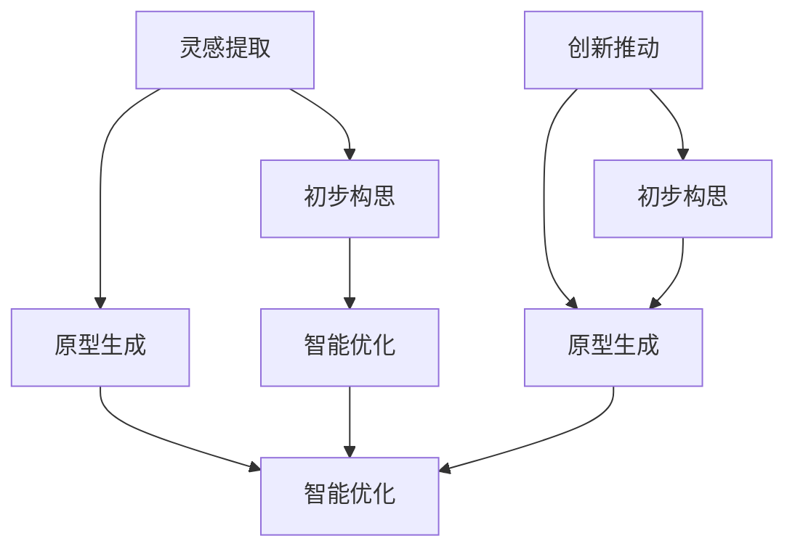

                 

# AI辅助设计：从灵感到原型

> 关键词：AI辅助设计,灵感的提取,原型的生成,创新设计,计算机辅助设计(CAD),智能设计工具,深度学习,创意构思,设计优化

## 1. 背景介绍

在现代社会中，设计不仅仅是艺术，更是一门科学。无论是工业产品、建筑结构，还是软件应用、交互界面，优秀的设计不仅能提升用户体验，还能显著提高生产效率，降低成本。然而，设计是一项高度依赖创造力和经验的工作，设计师需要大量的时间和精力进行构思、修改和优化，这一过程往往充满挑战和不确定性。随着人工智能技术的迅猛发展，AI辅助设计逐渐成为设计领域的重要工具，帮助设计师从灵感到原型的全流程创新，大幅提升设计效率和质量。

### 1.1 问题由来

在传统设计过程中，设计师往往依赖于手工绘图、概念模型等物理媒介来记录和表达灵感。这不仅耗时耗力，且容易受限于个人经验和技能。随着计算机技术的发展，计算机辅助设计(CAD)软件开始被广泛应用于设计和制造领域，极大提升了设计的效率和精度。但CAD软件依然需要设计人员手工输入指令，依赖于设计人员的直觉和经验，难以完全自动化。

随着深度学习技术的突破，AI辅助设计开始展现出巨大潜力。通过机器学习算法，AI可以从大量的数据中自动学习设计模式和设计规律，辅助设计师进行灵感提取、初步构思和原型生成，甚至在后续的优化和测试阶段提供智能化建议。AI辅助设计不仅能够显著提升设计效率，还能辅助设计师跨越思维定势，激发更多创新灵感，推动设计行业的革新。

### 1.2 问题核心关键点

AI辅助设计涉及的核心关键点包括：

- **灵感提取**：从大量数据中自动提取设计灵感和创意，降低设计师的构思难度。
- **初步构思**：基于提取的灵感生成多种设计方案，供设计师选择和优化。
- **原型生成**：从设计方案自动生成初步原型，辅助设计师进行验证和优化。
- **智能优化**：利用优化算法对原型进行自动迭代优化，提升设计方案的性能和可实施性。
- **创新推动**：基于用户反馈和市场趋势，引导设计师跨越思维定势，探索全新设计方向。

这些关键点共同构成了AI辅助设计的完整流程，帮助设计师从灵感到原型的全流程创新，极大提升设计效率和质量。

### 1.3 问题研究意义

AI辅助设计技术的研究，对于提升设计行业的智能化水平，推动设计创新具有重要意义：

1. **提升设计效率**：AI辅助设计能够自动化大量繁琐的设计过程，减少设计师的重复劳动，提升设计速度。
2. **增强设计质量**：通过自动学习和优化算法，AI能够发现设计师难以察觉的设计缺陷和改进点，提升设计方案的精度和可用性。
3. **促进设计创新**：AI能够帮助设计师跨越思维定势，探索全新的设计方向和思路，激发更多创新灵感。
4. **降低设计成本**：通过优化设计和减少反复修改，AI辅助设计可以降低设计和制造的总体成本。
5. **推动行业变革**：AI辅助设计技术的应用，将加速设计行业向智能化、自动化方向发展，改变传统的设计流程和设计工具。

## 2. 核心概念与联系

### 2.1 核心概念概述

为更好地理解AI辅助设计的原理和应用，本节将介绍几个关键概念：

- **灵感提取**：从大量数据中自动提取设计灵感和创意，辅助设计师进行初步构思。
- **初步构思**：基于提取的灵感生成多种设计方案，供设计师选择和优化。
- **原型生成**：从设计方案自动生成初步原型，辅助设计师进行验证和优化。
- **智能优化**：利用优化算法对原型进行自动迭代优化，提升设计方案的性能和可实施性。
- **创新推动**：基于用户反馈和市场趋势，引导设计师跨越思维定势，探索全新设计方向。

这些概念通过以下Mermaid流程图进行可视化，展示了它们之间的联系：



这个流程图展示了从灵感提取到原型生成的完整设计流程，以及如何通过AI辅助设计技术，实现灵感的自动提取、设计的智能优化和创新的推动。

## 3. 核心算法原理 & 具体操作步骤
### 3.1 算法原理概述

AI辅助设计的核心算法原理，主要基于深度学习和计算机视觉技术。通过这些技术，AI可以从大量设计数据中自动学习设计模式和设计规律，辅助设计师进行创意构思、原型生成和智能优化。

具体来说，AI辅助设计的算法原理可以概括为以下几点：

1. **数据驱动的灵感提取**：通过图像识别、自然语言处理等技术，从大量设计数据中自动提取设计灵感和创意。
2. **基于生成对抗网络(GAN)的初步构思**：利用GAN生成多种设计方案，供设计师选择和优化。
3. **基于变分自编码器(VAE)的原型生成**：通过VAE将设计方案自动转化为初步原型，辅助设计师进行验证和优化。
4. **基于强化学习的智能优化**：利用强化学习算法对原型进行自动迭代优化，提升设计方案的性能和可实施性。
5. **基于机器学习的数据分析**：利用机器学习算法分析用户反馈和市场趋势，引导设计师探索全新设计方向。

### 3.2 算法步骤详解

基于AI辅助设计技术，AI辅助设计的具体步骤可以分为以下几个阶段：

#### 3.2.1 数据准备

- **数据收集**：收集大量的设计数据，包括设计图纸、用户反馈、市场趋势等。
- **数据预处理**：对收集到的数据进行清洗、标注和标准化处理，确保数据质量。

#### 3.2.2 灵感提取

- **图像识别**：使用深度学习模型对设计图像进行特征提取，识别出其中的设计元素和特征。
- **自然语言处理**：利用自然语言处理技术，从设计描述、用户反馈中提取设计灵感和创意。

#### 3.2.3 初步构思

- **生成对抗网络(GAN)**：使用GAN生成多种设计方案，基于风格迁移、风格变体生成等技术，生成与原始设计相似但具有创意的设计。
- **变分自编码器(VAE)**：使用VAE将设计方案自动转化为初步原型，提供多种可供选择的设计方案。

#### 3.2.4 原型生成

- **几何生成**：利用几何生成算法，从设计方案中自动生成初步原型，辅助设计师进行验证和优化。
- **纹理生成**：使用纹理生成技术，为初步原型添加表面纹理和细节，提升设计的视觉效果。

#### 3.2.5 智能优化

- **强化学习**：利用强化学习算法，对初步原型进行自动迭代优化，提升设计的性能和可实施性。
- **自动测试**：使用自动化测试工具，对优化后的原型进行测试，评估其性能和可用性。

#### 3.2.6 创新推动

- **用户反馈分析**：利用机器学习算法，分析用户反馈和市场趋势，发现设计中的改进点和创新方向。
- **市场趋势预测**：基于历史数据和市场趋势，预测未来的设计需求和趋势，引导设计师探索全新的设计方向。

### 3.3 算法优缺点

AI辅助设计的算法具有以下优点：

- **高效性**：自动化的设计和优化过程，大大提升了设计效率，减少了设计师的重复劳动。
- **创新性**：AI能够跨越思维定势，发现设计师难以察觉的设计缺陷和改进点，激发更多创新灵感。
- **智能化**：基于深度学习和计算机视觉技术，AI能够从大量数据中自动学习设计模式和设计规律，辅助设计师进行创意构思和原型生成。

同时，该算法也存在一些局限性：

- **依赖数据质量**：AI辅助设计的性能很大程度上取决于数据的质量和数量，数据不足或数据质量差会影响算法的准确性和鲁棒性。
- **技术复杂性**：深度学习模型的训练和优化需要较高的技术门槛，需要专业的知识和经验。
- **解释性不足**：深度学习模型的决策过程通常缺乏可解释性，难以对其推理逻辑进行分析和调试。

尽管存在这些局限性，但就目前而言，AI辅助设计技术已经成为设计领域的重要辅助工具，极大地提升了设计的智能化水平。未来相关研究的重点在于如何进一步降低数据依赖，提高算法的可解释性和鲁棒性。

### 3.4 算法应用领域

AI辅助设计技术已经广泛应用于多个设计领域，包括工业设计、建筑设计、软件设计、交互设计等。以下是几个典型的应用场景：

- **工业设计**：利用AI辅助设计技术，生成多种设计方案，辅助设计师进行初步构思和原型生成，提升设计效率和质量。
- **建筑设计**：使用AI辅助设计技术，自动提取建筑灵感，生成多种设计方案，进行智能优化和创新推动。
- **软件设计**：在软件界面设计、交互设计等方面，AI辅助设计技术可以自动生成设计原型，辅助设计师进行迭代优化。
- **交互设计**：利用AI辅助设计技术，生成多种交互方案，进行智能优化和创新推动，提升用户体验。

## 4. 数学模型和公式 & 详细讲解 & 举例说明
### 4.1 数学模型构建

本节将使用数学语言对AI辅助设计的核心算法进行更加严格的刻画。

记设计方案为 $x$，设计灵感为 $y$，设计原型为 $z$，设计优化过程为 $\theta$。假设设计数据集为 $D=\{(x_i,y_i)\}_{i=1}^N, x_i \in \mathcal{X}, y_i \in \mathcal{Y}$。

定义设计方案的损失函数为 $\ell(x,y)$，用于衡量设计方案和设计灵感之间的差异。定义设计原型的损失函数为 $\ell(x,z)$，用于衡量设计方案和设计原型之间的差异。定义设计优化的损失函数为 $\ell(z,\theta)$，用于衡量设计原型和设计优化过程之间的差异。

设计优化的优化目标是最小化损失函数，即找到最优参数：

$$
\theta^* = \mathop{\arg\min}_{\theta} \mathcal{L}(\theta)
$$

在实践中，我们通常使用基于梯度的优化算法（如SGD、Adam等）来近似求解上述最优化问题。设 $\eta$ 为学习率，$\lambda$ 为正则化系数，则参数的更新公式为：

$$
\theta \leftarrow \theta - \eta \nabla_{\theta}\mathcal{L}(\theta) - \eta\lambda\theta
$$

其中 $\nabla_{\theta}\mathcal{L}(\theta)$ 为损失函数对参数 $\theta$ 的梯度，可通过反向传播算法高效计算。

### 4.2 公式推导过程

以下我们以生成对抗网络(GAN)为例，推导生成过程及其梯度计算公式。

假设设计方案 $x$ 是噪声 $z$ 通过生成器 $G$ 生成的，即 $x=G(z)$，其中 $z \sim \mathcal{N}(0,\sigma^2)$，$\sigma$ 为噪声的方差。设计灵感 $y$ 是输入 $x$ 通过判别器 $D$ 判定的概率，即 $y=D(x)$。则GAN的目标函数可以表示为：

$$
\mathcal{L}(G,D) = \mathbb{E}_{z \sim \mathcal{N}(0,\sigma^2)} [\log D(G(z))] + \mathbb{E}_{x \sim \mathcal{D}}[\log(1-D(x))]
$$

其中 $\mathbb{E}_{z \sim \mathcal{N}(0,\sigma^2)}$ 表示对噪声 $z$ 的期望，$\mathbb{E}_{x \sim \mathcal{D}}$ 表示对设计方案 $x$ 的期望。

对于生成器 $G$ 的损失函数可以表示为：

$$
\mathcal{L}_G(G,D) = -\mathbb{E}_{z \sim \mathcal{N}(0,\sigma^2)} [\log D(G(z))]
$$

对于判别器 $D$ 的损失函数可以表示为：

$$
\mathcal{L}_D(D) = -\mathbb{E}_{x \sim \mathcal{D}}[\log(1-D(x))]
$$

将上述目标函数对 $G$ 和 $D$ 进行优化，得到梯度更新公式：

$$
\begin{align*}
G: & \nabla_{G} \mathcal{L}(G,D) = \mathbb{E}_{z \sim \mathcal{N}(0,\sigma^2)} [\nabla_x \log D(G(z))] \\
D: & \nabla_{D} \mathcal{L}(G,D) = \mathbb{E}_{x \sim \mathcal{D}} [\nabla_x \log(1-D(x))] - \mathbb{E}_{z \sim \mathcal{N}(0,\sigma^2)} [\nabla_x \log D(G(z))]
\end{align*}
$$

在得到梯度后，即可带入优化公式，完成生成器的迭代优化。重复上述过程直至收敛，最终得到生成器的最优参数 $G^*$ 和判别器的最优参数 $D^*$。

### 4.3 案例分析与讲解

以建筑设计为例，分析如何使用AI辅助设计技术进行灵感提取和初步构思。

假设我们收集了大量的建筑设计图纸，包括现代建筑、传统建筑、生态建筑等。使用图像识别技术，可以自动提取建筑特征，如立面、结构、材料等，从而生成设计灵感。具体步骤如下：

1. **数据收集**：收集大量的建筑设计图纸，标注其风格和设计元素。
2. **特征提取**：使用卷积神经网络(CNN)对建筑设计图像进行特征提取，识别出其中的设计元素和特征。
3. **灵感生成**：基于提取的特征，使用GAN生成多种设计方案，结合风格迁移、风格变体生成等技术，生成与原始设计相似但具有创意的设计。
4. **初步构思**：设计师根据生成的设计方案，进行初步构思和优化，选择最符合需求的方案进行后续设计。

## 5. 项目实践：代码实例和详细解释说明
### 5.1 开发环境搭建

在进行AI辅助设计实践前，我们需要准备好开发环境。以下是使用Python进行TensorFlow开发的环境配置流程：

1. 安装Anaconda：从官网下载并安装Anaconda，用于创建独立的Python环境。

2. 创建并激活虚拟环境：
```bash
conda create -n tf-env python=3.8 
conda activate tf-env
```

3. 安装TensorFlow：根据CUDA版本，从官网获取对应的安装命令。例如：
```bash
conda install tensorflow tensorflow-gpu=2.7 -c conda-forge
```

4. 安装必要的库：
```bash
pip install numpy scipy matplotlib scikit-learn torch torchvision transformers
```

完成上述步骤后，即可在`tf-env`环境中开始AI辅助设计实践。

### 5.2 源代码详细实现

下面我们以生成对抗网络(GAN)为例，给出使用TensorFlow实现灵感提取和初步构思的代码实现。

首先，定义生成器和判别器：

```python
import tensorflow as tf
from tensorflow.keras.layers import Input, Dense, Flatten, Reshape, Conv2D, Conv2DTranspose, LeakyReLU

# 定义生成器
def build_generator(input_dim):
    model = tf.keras.Sequential()
    model.add(Dense(256, input_dim=input_dim))
    model.add(LeakyReLU(alpha=0.2))
    model.add(Dense(128))
    model.add(LeakyReLU(alpha=0.2))
    model.add(Dense(64))
    model.add(LeakyReLU(alpha=0.2))
    model.add(Dense(3, activation='tanh'))
    return model

# 定义判别器
def build_discriminator(input_shape):
    model = tf.keras.Sequential()
    model.add(Conv2D(64, (3, 3), strides=(2, 2), padding='same', input_shape=input_shape))
    model.add(LeakyReLU(alpha=0.2))
    model.add(Conv2D(128, (3, 3), strides=(2, 2), padding='same'))
    model.add(LeakyReLU(alpha=0.2))
    model.add(Conv2D(256, (3, 3), strides=(2, 2), padding='same'))
    model.add(LeakyReLU(alpha=0.2))
    model.add(Flatten())
    model.add(Dense(1, activation='sigmoid'))
    return model
```

然后，定义训练函数：

```python
import numpy as np

# 定义优化器
adam = tf.keras.optimizers.Adam(learning_rate=0.0002)

# 定义损失函数
cross_entropy = tf.keras.losses.BinaryCrossentropy(from_logits=True)

# 定义生成器和判别器的损失函数
def generator_loss(real_output, fake_output):
    real_loss = cross_entropy(tf.ones_like(real_output), real_output)
    fake_loss = cross_entropy(tf.zeros_like(fake_output), fake_output)
    return real_loss + fake_loss

def discriminator_loss(real_output, fake_output):
    real_loss = cross_entropy(tf.ones_like(real_output), real_output)
    fake_loss = cross_entropy(tf.zeros_like(fake_output), fake_output)
    return real_loss + fake_loss

# 训练函数
def train_gan(generator, discriminator, dataset, epochs=100, batch_size=128):
    for epoch in range(epochs):
        for batch in dataset:
            # 获取真实样本和标签
            real_images = batch['real_images']
            real_labels = tf.ones((batch_size, 1))
            
            # 获取生成样本和标签
            noise = tf.random.normal(shape=(batch_size, input_dim))
            fake_images = generator(noise)
            fake_labels = tf.zeros((batch_size, 1))
            
            # 更新判别器
            with tf.GradientTape() as dtape:
                real_output = discriminator(real_images)
                fake_output = discriminator(fake_images)
                d_loss = discriminator_loss(real_output, fake_output)
            gradients_of_discriminator = dtape.gradient(d_loss, discriminator.trainable_variables)
            optimizer.apply_gradients(zip(gradients_of_discriminator, discriminator.trainable_variables))
            
            # 更新生成器
            with tf.GradientTape() as dtape:
                fake_output = discriminator(fake_images)
                g_loss = generator_loss(fake_output)
            gradients_of_generator = dtape.gradient(g_loss, generator.trainable_variables)
            optimizer.apply_gradients(zip(gradients_of_generator, generator.trainable_variables))
            
        print(f'Epoch {epoch+1}/{epochs}, d_loss={d_loss:.4f}, g_loss={g_loss:.4f}')
```

最后，启动训练流程：

```python
# 数据集准备
input_dim = 100
batch_size = 128
epochs = 100

# 构建生成器和判别器
generator = build_generator(input_dim)
discriminator = build_discriminator(input_shape)

# 加载数据集
dataset = ...

# 训练模型
train_gan(generator, discriminator, dataset, epochs, batch_size)
```

以上就是使用TensorFlow实现GAN进行灵感提取和初步构思的完整代码实现。可以看到，TensorFlow提供的高级API使得构建和训练GAN模型变得相对简单。

### 5.3 代码解读与分析

让我们再详细解读一下关键代码的实现细节：

**GAN定义**：
- `build_generator`函数：定义生成器的神经网络结构，包括输入层、隐藏层和输出层，使用LeakyReLU激活函数。
- `build_discriminator`函数：定义判别器的神经网络结构，包括卷积层、隐藏层和输出层，使用LeakyReLU激活函数。
- `generator_loss`函数：计算生成器的损失函数，包括真实样本和生成样本的交叉熵损失。
- `discriminator_loss`函数：计算判别器的损失函数，包括真实样本和生成样本的交叉熵损失。

**训练函数**：
- `train_gan`函数：使用TensorFlow定义优化器、损失函数和训练流程。每个epoch内，对于每个批次数据，先更新判别器，再更新生成器，最后输出损失函数。
- `train_gan`函数中，使用`tf.GradientTape`自动求导，计算生成器和判别器的梯度，并使用`optimizer.apply_gradients`更新模型参数。

**运行结果展示**：
- 训练过程中，输出每个epoch的判别器和生成器的损失函数，帮助评估模型的收敛情况。

## 6. 实际应用场景
### 6.1 智能建筑设计

AI辅助设计技术在建筑设计领域已经得到广泛应用。传统建筑设计需要设计师大量的手工绘图和反复修改，耗费时间和精力。AI辅助设计技术可以自动生成多种设计方案，进行智能优化，提升设计的效率和质量。

具体而言，可以收集大量建筑设计的CAD数据，使用图像识别技术自动提取建筑特征，生成多种设计方案。设计师可以在这些方案中进行选择和优化，快速生成初步原型，并进行智能优化。这种基于AI辅助设计技术的建筑设计流程，可以大幅缩短设计周期，提高设计质量。

### 6.2 软件开发

在软件开发领域，AI辅助设计技术可以用于界面设计和交互设计，提升用户体验。传统软件开发需要设计师手动设计界面和交互逻辑，往往需要反复迭代和调试。而使用AI辅助设计技术，可以自动生成多种设计方案，进行智能优化和创新推动，快速生成初步原型，并进行智能优化。

具体而言，可以收集大量软件界面设计的图像数据，使用图像识别技术自动提取设计特征，生成多种设计方案。设计师可以在这些方案中进行选择和优化，快速生成初步原型，并进行智能优化。这种基于AI辅助设计技术的界面设计流程，可以大幅提升设计效率和用户体验。

### 6.3 智能制造

在智能制造领域，AI辅助设计技术可以用于产品设计和制造工艺设计，提升生产效率和产品质量。传统制造设计需要设计师大量的手工绘图和反复修改，耗费时间和精力。而使用AI辅助设计技术，可以自动生成多种设计方案，进行智能优化，提升设计的效率和质量。

具体而言，可以收集大量产品设计和制造工艺设计的CAD数据，使用图像识别技术自动提取设计特征，生成多种设计方案。设计师可以在这些方案中进行选择和优化，快速生成初步原型，并进行智能优化。这种基于AI辅助设计技术的制造设计流程，可以大幅缩短设计周期，提高设计质量和生产效率。

### 6.4 未来应用展望

随着AI辅助设计技术的不断发展，未来的设计领域将会有更多的应用场景，为各行各业带来变革性影响。

在智慧城市治理中，AI辅助设计技术可以用于城市规划和建筑设计，提升城市设计的智能化水平，推动智慧城市的发展。

在智能家居设计中，AI辅助设计技术可以用于智能设备和家居设计的优化，提升用户体验和居住舒适度。

在虚拟现实(VR)设计中，AI辅助设计技术可以用于虚拟场景和用户体验设计，提升虚拟现实应用的效果和互动性。

## 7. 工具和资源推荐
### 7.1 学习资源推荐

为了帮助开发者系统掌握AI辅助设计的理论基础和实践技巧，这里推荐一些优质的学习资源：

1. **《Python深度学习》**：由Ian Goodfellow等人编写，全面介绍了深度学习的基础理论和实践方法，包括GAN、VAE等生成模型。

2. **《Deep Learning for Computer Vision》**：斯坦福大学开设的计算机视觉课程，涵盖了深度学习在图像识别、目标检测等领域的最新进展。

3. **《TensorFlow官方文档》**：TensorFlow的官方文档，提供了丰富的API和样例代码，帮助开发者快速上手TensorFlow进行深度学习实践。

4. **《计算机辅助设计基础》**：一本关于计算机辅助设计技术的经典教材，介绍了CAD软件的使用方法和设计流程。

5. **《AutoCAD基础教程》**：一本AutoCAD软件的入门教程，帮助初学者快速上手AutoCAD进行设计。

通过对这些资源的学习实践，相信你一定能够快速掌握AI辅助设计的精髓，并用于解决实际的设计问题。
### 7.2 开发工具推荐

高效的开发离不开优秀的工具支持。以下是几款用于AI辅助设计开发的常用工具：

1. **TensorFlow**：基于Python的开源深度学习框架，灵活动态的计算图，适合快速迭代研究。

2. **PyTorch**：基于Python的开源深度学习框架，灵活性高，支持动态图和静态图。

3. **Keras**：高层API，封装了TensorFlow和Theano，适合快速构建和训练深度学习模型。

4. **OpenCV**：计算机视觉库，提供了丰富的图像处理和分析工具。

5. **AutoCAD**：计算机辅助设计软件，广泛用于建筑设计、产品设计等领域。

6. **SketchUp**：3D建模软件，用于建筑设计、室内设计等领域。

合理利用这些工具，可以显著提升AI辅助设计任务的开发效率，加快创新迭代的步伐。

### 7.3 相关论文推荐

AI辅助设计技术的发展源于学界的持续研究。以下是几篇奠基性的相关论文，推荐阅读：

1. **Generative Adversarial Nets**：由Ian Goodfellow等人提出，奠定了GAN的理论基础，展示了生成对抗网络在生成模型中的巨大潜力。

2. **A Neural Algorithm of Artistic Style**：由Leon A. Gatys等人提出，展示了风格迁移技术的广泛应用，为AI辅助设计提供了新的思路。

3. **Variational Autoencoders**：由Diederik P. Kingma等人提出，展示了VAE在生成模型中的应用，为初步原型的自动生成提供了新的方法。

4. **Deep Infographics**：由Andrej Karpathy等人提出，展示了深度学习在信息可视化中的应用，为创意构思提供了新的工具。

这些论文代表了大语言模型微调技术的发展脉络。通过学习这些前沿成果，可以帮助研究者把握学科前进方向，激发更多的创新灵感。

## 8. 总结：未来发展趋势与挑战

### 8.1 总结

本文对AI辅助设计技术进行了全面系统的介绍。首先阐述了AI辅助设计的背景和意义，明确了灵感提取、初步构思、原型生成、智能优化和创新推动等核心环节。其次，从原理到实践，详细讲解了AI辅助设计的数学原理和关键步骤，给出了灵感提取和初步构思的完整代码实例。同时，本文还广泛探讨了AI辅助设计技术在智能建筑设计、软件开发、智能制造等多个行业领域的应用前景，展示了AI辅助设计技术的巨大潜力。此外，本文精选了AI辅助设计技术的各类学习资源，力求为读者提供全方位的技术指引。

通过本文的系统梳理，可以看到，AI辅助设计技术正在成为设计领域的重要辅助工具，极大地提升了设计的智能化水平。AI辅助设计技术不仅能显著提升设计效率和质量，还能帮助设计师跨越思维定势，激发更多创新灵感，推动设计行业的革新。未来，随着AI辅助设计技术的不断发展，将会在更多行业领域得到应用，为各行各业带来变革性影响。

### 8.2 未来发展趋势

展望未来，AI辅助设计技术将呈现以下几个发展趋势：

1. **自动化程度提升**：随着深度学习技术的进步，AI辅助设计将更加自动化和智能化，无需人工干预即可生成和优化设计方案。

2. **跨领域融合**：AI辅助设计技术将与计算机视觉、自然语言处理等领域进行更深入的融合，实现多模态设计的智能化。

3. **个性化设计**：基于用户反馈和市场趋势，AI辅助设计技术将更加个性化，能够根据用户需求进行定制化设计。

4. **实时优化**：通过实时采集用户反馈和市场数据，AI辅助设计技术将能够实时优化设计方案，提升用户体验和市场竞争力。

5. **人机协同**：AI辅助设计技术将更加注重人机协同设计，帮助设计师更好地理解设计需求和设计规律。

6. **智能设计工具**：基于AI辅助设计技术的智能设计工具将变得更加智能和便捷，提升设计师的效率和创意。

以上趋势凸显了AI辅助设计技术的广阔前景。这些方向的探索发展，必将进一步提升设计行业的智能化水平，为各行各业带来革命性影响。

### 8.3 面临的挑战

尽管AI辅助设计技术已经取得了显著进展，但在迈向更加智能化、普适化应用的过程中，它仍面临着诸多挑战：

1. **数据依赖**：AI辅助设计技术依赖于大量的设计数据，数据不足或数据质量差会影响算法的准确性和鲁棒性。

2. **技术门槛**：深度学习模型的训练和优化需要较高的技术门槛，需要专业的知识和经验。

3. **解释性不足**：深度学习模型的决策过程通常缺乏可解释性，难以对其推理逻辑进行分析和调试。

4. **跨领域融合**：不同领域的设计数据和设计规律差异较大，如何实现跨领域的融合和迁移，仍然是一个重要挑战。

5. **个性化设计**：如何根据用户需求进行个性化设计，生成符合用户期望的设计方案，仍然是一个难点。

6. **实时优化**：如何实现实时优化和智能反馈，提升设计的动态适应性和用户体验，仍然是一个挑战。

这些挑战凸显了AI辅助设计技术的发展前景和现实难点。未来相关研究的重点在于如何进一步降低数据依赖，提高算法的可解释性和鲁棒性，实现跨领域的融合和迁移。只有从数据、算法、工程、业务等多个维度协同发力，才能真正实现AI辅助设计技术的智能化和普适化。

### 8.4 研究展望

面对AI辅助设计所面临的挑战，未来的研究需要在以下几个方面寻求新的突破：

1. **无监督学习和半监督学习**：探索无监督学习和半监督学习在灵感提取和初步构思中的应用，降低对标注数据的依赖。

2. **多模态设计**：将计算机视觉、自然语言处理等领域的技术融合到设计中，实现多模态设计的智能化。

3. **强化学习与优化**：利用强化学习技术，优化设计方案和设计流程，提升设计的智能化水平。

4. **个性化设计**：基于用户反馈和市场趋势，生成个性化设计方案，提升设计的个性化和用户体验。

5. **跨领域设计**：探索跨领域设计的融合和迁移，实现不同领域之间的设计借鉴和设计创新。

6. **实时优化与智能反馈**：实现实时优化和智能反馈，提升设计的动态适应性和用户体验。

这些研究方向将推动AI辅助设计技术迈向更高的台阶，为设计行业的智能化、自动化发展提供新的动力。

## 9. 附录：常见问题与解答

**Q1：AI辅助设计是否适用于所有设计领域？**

A: AI辅助设计技术已经在多个设计领域得到广泛应用，包括建筑设计、软件设计、产品设计等。但对于一些特定领域，如艺术创作、手工艺设计等，目前AI辅助设计技术仍存在一定的局限性，需要更多的研究和探索。

**Q2：AI辅助设计过程中如何保护知识产权？**

A: AI辅助设计技术在保护知识产权方面存在一定的挑战。AI辅助设计技术需要大量的设计数据进行训练和优化，如何保护这些数据的版权和隐私，是一个重要的问题。未来，需要在数据获取、使用和分享等环节加强知识产权保护，避免侵犯他人的合法权益。

**Q3：AI辅助设计是否会取代设计师？**

A: AI辅助设计技术并非取代设计师，而是作为设计师的辅助工具，帮助设计师更高效地进行设计。AI辅助设计技术可以自动生成设计方案和初步原型，但最终的决策权仍然掌握在设计师手中。AI辅助设计技术能够帮助设计师跨越思维定势，激发更多创新灵感，提升设计效率和质量。

通过这些问答，可以看到AI辅助设计技术的应用和局限，以及如何利用这项技术提升设计的智能化水平。AI辅助设计技术的应用前景广阔，相信随着技术的不断进步，将在更多设计领域得到广泛应用，为各行各业带来革命性的变革。

