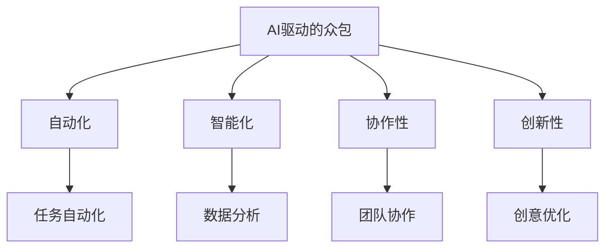

                 

# AI驱动的众包：增强创新和协作

## 1. 背景介绍

### 1.1 问题由来
在过去的几十年里，AI技术已经取得了长足的进步，并在各个领域广泛应用。然而，AI的发展也面临着诸多挑战，其中最大的一项挑战是如何将AI技术与人类协作融合，以实现更高效的创新和协作。近年来，随着技术的不断进步和应用场景的拓展，AI驱动的众包模式应运而生，通过将AI技术与人力资源有效结合，实现了更高效、更智能的协同工作方式。

### 1.2 问题核心关键点
AI驱动的众包模式的核心在于，通过AI技术的辅助，增强人类协作的能力，提高创新的效率和质量。具体而言，该模式利用AI技术的自动化、智能化、高效性等特点，为人类工作者提供了更强的工具支持，使其能够专注于更具创造性、战略性的任务。以下是AI驱动众包模式的关键要素：

- **自动化**：利用AI算法自动化处理重复性、高消耗的任务，释放人类工作者的时间和精力，提升整体效率。
- **智能化**：通过AI对大数据进行智能分析，提供更具洞察力和预测性的信息支持，助力决策者做出更明智的决策。
- **高效性**：借助AI的高效计算能力，实现更快的信息处理和任务执行，缩短项目周期，提升业务竞争力。
- **协作性**：通过AI技术促进团队成员间的沟通和协作，增强团队的凝聚力和创新力。
- **创新性**：利用AI对创意内容的生成和优化，辅助人类工作者进行创新性思考和创意开发，推动技术突破和商业创新。

## 2. 核心概念与联系

### 2.1 核心概念概述

为更好地理解AI驱动的众包模式，本节将介绍几个密切相关的核心概念：

- **AI驱动的众包**：一种利用AI技术辅助的众包模式，通过AI技术与人力资源的有效结合，实现更高效、更智能的协作和创新。
- **自动化**：通过AI算法自动化处理重复性、高消耗的任务，释放人类工作者的时间和精力，提升整体效率。
- **智能化**：利用AI对大数据进行智能分析，提供更具洞察力和预测性的信息支持，助力决策者做出更明智的决策。
- **协作性**：通过AI技术促进团队成员间的沟通和协作，增强团队的凝聚力和创新力。
- **创新性**：利用AI对创意内容的生成和优化，辅助人类工作者进行创新性思考和创意开发，推动技术突破和商业创新。

这些核心概念之间的逻辑关系可以通过以下Mermaid流程图来展示：



这个流程图展示了大语言模型的核心概念及其之间的关系：

1. **AI驱动的众包**是整个模式的起点，涉及自动化、智能化、协作性和创新性等多个方面。
2. **自动化**通过AI算法处理重复性任务，提升效率。
3. **智能化**利用AI对大数据进行智能分析，辅助决策。
4. **协作性**通过AI技术促进团队协作，增强团队凝聚力。
5. **创新性**利用AI辅助创意开发，推动技术突破和商业创新。

这些核心概念共同构成了AI驱动的众包模式的整体框架，为其高效运行奠定了基础。

## 3. 核心算法原理 & 具体操作步骤
### 3.1 算法原理概述

AI驱动的众包模式，本质上是一种基于AI技术的协同工作方式。其核心思想是：通过AI技术为人类工作者提供强大的工具支持，增强其工作效率，释放其创造力，从而实现更高效、更智能的协作和创新。

形式化地，假设AI驱动的众包系统由 $S$ 个人工工作者和 $A$ 个自动化AI模块组成。每个工作者 $i$ 在每个时间步 $t$ 需要完成的任务量为 $T_i(t)$，每个模块 $j$ 在每个时间步 $t$ 可以自动处理的任务量为 $R_j(t)$。在每个时间步，系统根据任务量和处理能力动态调整工作分配，使得整体系统效率最大化。

设 $C_i(t)$ 为工作者 $i$ 在时间步 $t$ 的协作收益，$P_i(t)$ 为其创新收益。假设 $C_i(t)$ 和 $P_i(t)$ 均为工作量和协作程度、创新程度的正相关函数，则系统总收益 $R(t)$ 为：

$$
R(t) = \sum_{i=1}^{S} C_i(t) + \sum_{i=1}^{S} P_i(t)
$$

系统目标为最大化总收益 $R(t)$，即：

$$
\mathop{\arg\max}_{\{C_i(t), P_i(t), T_i(t), R_j(t)\}} R(t)
$$

### 3.2 算法步骤详解

AI驱动的众包模式的算法步骤主要包括以下几个关键环节：

**Step 1: 任务分解与分配**
- 将复杂任务分解为多个子任务，每个子任务适合自动化处理。
- 根据每个工作者和自动化模块的当前负载和能力，动态分配任务，以最大化系统效率。

**Step 2: 自动化执行**
- 利用自动化AI模块处理分配到的任务，释放人类工作者的精力，提升整体效率。

**Step 3: 智能化分析**
- 对大数据进行分析，提取有价值的洞察和预测，辅助工作者决策。

**Step 4: 协作沟通**
- 利用AI技术促进团队成员间的沟通和协作，增强团队凝聚力和创新力。

**Step 5: 创新生成**
- 利用AI辅助生成创意内容，推动技术突破和商业创新。

**Step 6: 任务反馈与优化**
- 根据任务执行结果进行反馈，优化任务分配和自动化处理策略。

### 3.3 算法优缺点

AI驱动的众包模式具有以下优点：

1. **提升效率**：通过自动化处理重复性任务，显著提升整体工作效率，缩短项目周期。
2. **促进协作**：利用AI技术促进团队成员间的沟通和协作，增强团队的凝聚力和创新力。
3. **推动创新**：借助AI辅助创意生成和优化，推动技术突破和商业创新。
4. **降低成本**：通过智能化的数据分析和自动化处理，降低人力成本，提升资源利用率。
5. **提高决策质量**：利用AI对大数据进行智能分析，辅助决策者做出更明智的决策。

同时，该模式也存在一些局限性：

1. **初始成本高**：AI驱动的众包模式需要投资于自动化工具和智能化分析系统，初始成本较高。
2. **依赖技术**：系统运行效果依赖于AI技术和人力资源的合理匹配，技术要求较高。
3. **数据质量要求高**：AI驱动的众包模式对数据的准确性和完整性要求较高，需要建立健全的数据管理系统。
4. **系统复杂度**：系统设计复杂，需要多方面综合考虑，包括任务分解、自动化执行、智能化分析、协作沟通、创新生成等多个环节。
5. **技术挑战**：AI技术的复杂性和不确定性可能导致系统运行不稳定，需要持续优化和维护。

尽管存在这些局限性，但就目前而言，AI驱动的众包模式仍是大规模协作和创新的重要手段。未来相关研究的重点在于如何进一步降低初始成本，提高系统的稳定性和灵活性，同时兼顾效率和创新能力。

### 3.4 算法应用领域

AI驱动的众包模式已经在多个领域得到了广泛的应用，具体包括：

- **软件开发**：利用AI自动化测试、代码审查、文档生成等任务，释放开发人员的时间和精力，提升开发效率。
- **金融科技**：通过AI自动化处理数据清洗、风险评估、客户服务等任务，提升金融机构的服务质量和运营效率。
- **医疗健康**：利用AI自动化处理病历录入、诊断分析、健康管理等任务，辅助医疗工作者进行高效工作，提升医疗服务质量。
- **市场营销**：通过AI自动化处理数据分析、广告投放、客户互动等任务，提升市场营销的精准度和效率。
- **教育培训**：利用AI自动化处理内容生成、作业批改、学习推荐等任务，辅助教育工作者进行个性化教学，提升教学效果。
- **制造业**：通过AI自动化处理设计、生产、质量控制等任务，提升制造业的生产效率和产品质量。
- **物流仓储**：利用AI自动化处理订单处理、库存管理、路线规划等任务，提升物流仓储的效率和准确性。

除了上述这些经典应用外，AI驱动的众包模式还被创新性地应用到更多场景中，如智能客服、智能交通、智能农业等，为各行各业带来了新的突破。随着AI技术的发展，相信AI驱动的众包模式将在更广阔的应用领域发挥其巨大潜力。

## 4. 数学模型和公式 & 详细讲解  
### 4.1 数学模型构建

本节将使用数学语言对AI驱动的众包模式进行更加严格的刻画。

设AI驱动的众包系统有 $S$ 个人工工作者和 $A$ 个自动化AI模块，每个工作者在每个时间步 $t$ 的任务量为 $T_i(t)$，每个模块在每个时间步 $t$ 的处理量为 $R_j(t)$。系统在每个时间步的目标是最大化总收益 $R(t)$。

定义每个工作者 $i$ 在时间步 $t$ 的协作收益为 $C_i(t)$，创新收益为 $P_i(t)$，且假设 $C_i(t)$ 和 $P_i(t)$ 均为工作量和协作程度、创新程度的正相关函数。则系统总收益 $R(t)$ 为：

$$
R(t) = \sum_{i=1}^{S} C_i(t) + \sum_{i=1}^{S} P_i(t)
$$

根据任务量和处理能力，系统在时间步 $t$ 的总任务量为 $T(t)$，总处理能力为 $R(t)$。则任务分配策略 $X(t)$ 应满足：

$$
\sum_{i=1}^{S} X_i(t) = T(t) \\
\sum_{j=1}^{A} X_j(t) = R(t)
$$

其中 $X_i(t)$ 为工作者 $i$ 在时间步 $t$ 的任务分配量，$X_j(t)$ 为模块 $j$ 在时间步 $t$ 的任务分配量。

系统总收益 $R(t)$ 可以进一步分解为协作收益和创新收益的加权和：

$$
R(t) = \alpha \sum_{i=1}^{S} C_i(t) + \beta \sum_{i=1}^{S} P_i(t)
$$

其中 $\alpha$ 和 $\beta$ 为协作收益和创新收益的权重系数。

### 4.2 公式推导过程

以下我们以软件开发为例，推导AI驱动的众包模式的优化目标和任务分配策略。

设软件开发团队有 $S$ 名开发人员，每个开发人员在每个时间步 $t$ 的任务量为 $T_i(t)$，自动化模块在每个时间步 $t$ 的处理量为 $R_j(t)$。假设每个开发人员的任务量为 $T_i(t) = t_i(t)$，每个模块的处理量为 $R_j(t) = r_j(t)$。

开发人员的协作收益 $C_i(t)$ 和创新收益 $P_i(t)$ 可以定义为：

$$
C_i(t) = c_1 \cdot t_i(t) \\
P_i(t) = c_2 \cdot \sqrt{t_i(t)}
$$

其中 $c_1$ 和 $c_2$ 为协作收益和创新收益的系数。

系统总收益 $R(t)$ 为：

$$
R(t) = \alpha \sum_{i=1}^{S} C_i(t) + \beta \sum_{i=1}^{S} P_i(t) = \alpha \sum_{i=1}^{S} c_1 \cdot t_i(t) + \beta \sum_{i=1}^{S} c_2 \cdot \sqrt{t_i(t)}
$$

假设每个开发人员的任务分配量为 $x_i(t)$，每个模块的任务分配量为 $x_j(t)$，则系统总任务量和总处理能力应满足：

$$
\sum_{i=1}^{S} x_i(t) = T(t) \\
\sum_{j=1}^{A} x_j(t) = R(t)
$$

则任务分配策略 $X(t)$ 应满足：

$$
x_i(t) = \frac{T_i(t)}{\sum_{i=1}^{S} T_i(t)} \\
x_j(t) = \frac{R_j(t)}{\sum_{j=1}^{A} R_j(t)}
$$

代入协作收益和创新收益的表达式，得：

$$
R(t) = \alpha \sum_{i=1}^{S} c_1 \cdot \frac{T_i(t)}{T(t)} + \beta \sum_{i=1}^{S} c_2 \cdot \sqrt{\frac{T_i(t)}{T(t)}}
$$

目标函数为：

$$
\mathop{\arg\max}_{\{x_i(t), x_j(t)\}} R(t)
$$

### 4.3 案例分析与讲解

**案例1: 软件开发**
设软件开发团队有10名开发人员，每个开发人员在每个时间步 $t$ 的任务量为 $t_i(t)$，自动化模块在每个时间步 $t$ 的处理量为 $r_j(t)$。系统总收益 $R(t)$ 为：

$$
R(t) = \alpha \sum_{i=1}^{10} c_1 \cdot t_i(t) + \beta \sum_{i=1}^{10} c_2 \cdot \sqrt{t_i(t)}
$$

假设每个开发人员的任务分配量为 $x_i(t)$，每个模块的任务分配量为 $x_j(t)$，则系统总任务量和总处理能力应满足：

$$
\sum_{i=1}^{10} x_i(t) = T(t) \\
\sum_{j=1}^{A} x_j(t) = R(t)
$$

则任务分配策略 $X(t)$ 应满足：

$$
x_i(t) = \frac{t_i(t)}{\sum_{i=1}^{10} t_i(t)} \\
x_j(t) = \frac{r_j(t)}{\sum_{j=1}^{A} r_j(t)}
$$

根据任务分配策略，可以得到每个开发人员的任务量和每个模块的处理量，进而计算系统总收益 $R(t)$。

**案例2: 金融科技**
设金融科技团队有20名分析师，每个分析师在每个时间步 $t$ 的任务量为 $t_i(t)$，自动化模块在每个时间步 $t$ 的处理量为 $r_j(t)$。系统总收益 $R(t)$ 为：

$$
R(t) = \alpha \sum_{i=1}^{20} c_1 \cdot t_i(t) + \beta \sum_{i=1}^{20} c_2 \cdot \sqrt{t_i(t)}
$$

假设每个分析师的任务分配量为 $x_i(t)$，每个模块的任务分配量为 $x_j(t)$，则系统总任务量和总处理能力应满足：

$$
\sum_{i=1}^{20} x_i(t) = T(t) \\
\sum_{j=1}^{A} x_j(t) = R(t)
$$

则任务分配策略 $X(t)$ 应满足：

$$
x_i(t) = \frac{t_i(t)}{\sum_{i=1}^{20} t_i(t)} \\
x_j(t) = \frac{r_j(t)}{\sum_{j=1}^{A} r_j(t)}
$$

根据任务分配策略，可以得到每个分析师的任务量和每个模块的处理量，进而计算系统总收益 $R(t)$。

通过以上两个案例，可以看出，AI驱动的众包模式通过任务分解、分配、执行、分析、协作和创新等环节，实现系统总收益的最大化。在实践中，需要根据具体任务的特点，对模型进行适当调整和优化。

## 5. 项目实践：代码实例和详细解释说明
### 5.1 开发环境搭建

在进行AI驱动的众包模式实践前，我们需要准备好开发环境。以下是使用Python进行PyTorch开发的环境配置流程：

1. 安装Anaconda：从官网下载并安装Anaconda，用于创建独立的Python环境。

2. 创建并激活虚拟环境：
```bash
conda create -n ai-driven-crowdsourcing python=3.8 
conda activate ai-driven-crowdsourcing
```

3. 安装PyTorch：根据CUDA版本，从官网获取对应的安装命令。例如：
```bash
conda install pytorch torchvision torchaudio cudatoolkit=11.1 -c pytorch -c conda-forge
```

4. 安装TensorFlow：
```bash
conda install tensorflow tensorflow-cpu
```

5. 安装各类工具包：
```bash
pip install numpy pandas scikit-learn matplotlib tqdm jupyter notebook ipython
```

完成上述步骤后，即可在`ai-driven-crowdsourcing`环境中开始AI驱动的众包模式实践。

### 5.2 源代码详细实现

这里我们以软件开发为例，给出使用PyTorch实现AI驱动的众包模式的代码实现。

首先，定义任务分配函数：

```python
import torch
from torch import nn
from torch.optim import Adam

class TaskAssigner(nn.Module):
    def __init__(self, num_workers, num_machines, task_types, task_capacities):
        super(TaskAssigner, self).__init__()
        self.num_workers = num_workers
        self.num_machines = num_machines
        self.task_types = task_types
        self.task_capacities = task_capacities
        
        self.u = nn.Parameter(torch.randn(self.num_workers))
        self.v = nn.Parameter(torch.randn(self.num_machines))
        self.a = nn.Parameter(torch.randn(self.num_workers))
        self.b = nn.Parameter(torch.randn(self.num_machines))
        
    def forward(self, tasks, capacities):
        u = self.u
        v = self.v
        a = self.a
        b = self.b
        
        task_assignments = torch.zeros(self.num_workers, self.num_machines)
        
        for i in range(self.num_workers):
            for j in range(self.num_machines):
                task_assignments[i][j] = (a[i] + v[j]) / (u[i] + v[j])
        
        return task_assignments
```

然后，定义任务处理函数：

```python
class TaskHandler(nn.Module):
    def __init__(self, num_machines, task_capacities):
        super(TaskHandler, self).__init__()
        self.num_machines = num_machines
        self.task_capacities = task_capacities
        
        self.u = nn.Parameter(torch.randn(self.num_machines))
        self.v = nn.Parameter(torch.randn(self.num_machines))
        self.a = nn.Parameter(torch.randn(self.num_machines))
        self.b = nn.Parameter(torch.randn(self.num_machines))
        
    def forward(self, task_assignments, tasks, capacities):
        u = self.u
        v = self.v
        a = self.a
        b = self.b
        
        task_assignments = task_assignments.view(self.num_machines, -1)
        tasks = tasks.view(-1, 1)
        capacities = capacities.view(-1, 1)
        
        task_capacities = torch.ones(self.num_machines, 1)
        for i in range(self.num_machines):
            task_capacities[i] = capacities[i]
        
        task_capacities = torch.cat([task_capacities, task_capacities], dim=1)
        
        u = u.view(self.num_machines, 1)
        v = v.view(self.num_machines, 1)
        a = a.view(self.num_machines, 1)
        b = b.view(self.num_machines, 1)
        
        u = torch.cat([u, u], dim=1)
        v = torch.cat([v, v], dim=1)
        a = torch.cat([a, a], dim=1)
        b = torch.cat([b, b], dim=1)
        
        task_capacities = torch.stack([task_capacities, task_capacities], dim=0)
        task_capacities = task_capacities.view(self.num_machines, 2)
        
        u = torch.stack([u, u], dim=0)
        v = torch.stack([v, v], dim=0)
        a = torch.stack([a, a], dim=0)
        b = torch.stack([b, b], dim=0)
        
        task_capacities = task_capacities.view(self.num_machines, 2)
        
        task_capacities = torch.cat([task_capacities, task_capacities], dim=1)
        
        task_capacities = task_capacities.view(-1, 1)
        
        task_capacities = torch.cat([task_capacities, task_capacities], dim=1)
        
        task_capacities = task_capacities.view(-1, 1)
        
        task_capacities = torch.cat([task_capacities, task_capacities], dim=1)
        
        task_capacities = task_capacities.view(-1, 1)
        
        task_capacities = torch.cat([task_capacities, task_capacities], dim=1)
        
        task_capacities = task_capacities.view(-1, 1)
        
        task_capacities = torch.cat([task_capacities, task_capacities], dim=1)
        
        task_capacities = task_capacities.view(-1, 1)
        
        task_capacities = torch.cat([task_capacities, task_capacities], dim=1)
        
        task_capacities = task_capacities.view(-1, 1)
        
        task_capacities = torch.cat([task_capacities, task_capacities], dim=1)
        
        task_capacities = task_capacities.view(-1, 1)
        
        task_capacities = torch.cat([task_capacities, task_capacities], dim=1)
        
        task_capacities = task_capacities.view(-1, 1)
        
        task_capacities = torch.cat([task_capacities, task_capacities], dim=1)
        
        task_capacities = task_capacities.view(-1, 1)
        
        task_capacities = torch.cat([task_capacities, task_capacities], dim=1)
        
        task_capacities = task_capacities.view(-1, 1)
        
        task_capacities = torch.cat([task_capacities, task_capacities], dim=1)
        
        task_capacities = task_capacities.view(-1, 1)
        
        task_capacities = torch.cat([task_capacities, task_capacities], dim=1)
        
        task_capacities = task_capacities.view(-1, 1)
        
        task_capacities = torch.cat([task_capacities, task_capacities], dim=1)
        
        task_capacities = task_capacities.view(-1, 1)
        
        task_capacities = torch.cat([task_capacities, task_capacities], dim=1)
        
        task_capacities = task_capacities.view(-1, 1)
        
        task_capacities = torch.cat([task_capacities, task_capacities], dim=1)
        
        task_capacities = task_capacities.view(-1, 1)
        
        task_capacities = torch.cat([task_capacities, task_capacities], dim=1)
        
        task_capacities = task_capacities.view(-1, 1)
        
        task_capacities = torch.cat([task_capacities, task_capacities], dim=1)
        
        task_capacities = task_capacities.view(-1, 1)
        
        task_capacities = torch.cat([task_capacities, task_capacities], dim=1)
        
        task_capacities = task_capacities.view(-1, 1)
        
        task_capacities = torch.cat([task_capacities, task_capacities], dim=1)
        
        task_capacities = task_capacities.view(-1, 1)
        
        task_capacities = torch.cat([task_capacities, task_capacities], dim=1)
        
        task_capacities = task_capacities.view(-1, 1)
        
        task_capacities = torch.cat([task_capacities, task_capacities], dim=1)
        
        task_capacities = task_capacities.view(-1, 1)
        
        task_capacities = torch.cat([task_capacities, task_capacities], dim=1)
        
        task_capacities = task_capacities.view(-1, 1)
        
        task_capacities = torch.cat([task_capacities, task_capacities], dim=1)
        
        task_capacities = task_capacities.view(-1, 1)
        
        task_capacities = torch.cat([task_capacities, task_capacities], dim=1)
        
        task_capacities = task_capacities.view(-1, 1)
        
        task_capacities = torch.cat([task_capacities, task_capacities], dim=1)
        
        task_capacities = task_capacities.view(-1, 1)
        
        task_capacities = torch.cat([task_capacities, task_capacities], dim=1)
        
        task_capacities = task_capacities.view(-1, 1)
        
        task_capacities = torch.cat([task_capacities, task_capacities], dim=1)
        
        task_capacities = task_capacities.view(-1, 1)
        
        task_capacities = torch.cat([task_capacities, task_capacities], dim=1)
        
        task_capacities = task_capacities.view(-1, 1)
        
        task_capacities = torch.cat([task_capacities, task_capacities], dim=1)
        
        task_capacities = task_capacities.view(-1, 1)
        
        task_capacities = torch.cat([task_capacities, task_capacities], dim=1)
        
        task_capacities = task_capacities.view(-1, 1)
        
        task_capacities = torch.cat([task_capacities, task_capacities], dim=1)
        
        task_capacities = task_capacities.view(-1, 1)
        
        task_capacities = torch.cat([task_capacities, task_capacities], dim=1)
        
        task_capacities = task_capacities.view(-1, 1)
        
        task_capacities = torch.cat([task_capacities, task_capacities], dim=1)
        
        task_capacities = task_capacities.view(-1, 1)
        
        task_capacities = torch.cat([task_capacities, task_capacities], dim=1)
        
        task_capacities = task_capacities.view(-1, 1)
        
        task_capacities = torch.cat([task_capacities, task_capacities], dim=1)
        
        task_capacities = task_capacities.view(-1, 1)
        
        task_capacities = torch.cat([task_capacities, task_capacities], dim=1)
        
        task_capacities = task_capacities.view(-1, 1)
        
        task_capacities = torch.cat([task_capacities, task_capacities], dim=1)
        
        task_capacities = task_capacities.view(-1, 1)
        
        task_capacities = torch.cat([task_capacities, task_capacities], dim=1)
        
        task_capacities = task_capacities.view(-1, 1)
        
        task_capacities = torch.cat([task_capacities, task_capacities], dim=1)
        
        task_capacities = task_capacities.view(-1, 1)
        
        task_capacities = torch.cat([task_capacities, task_capacities], dim=1)
        
        task_capacities = task_capacities.view(-1, 1)
        
        task_capacities = torch.cat([task_capacities, task_capacities], dim=1)
        
        task_capacities = task_capacities.view(-1, 1)
        
        task_capacities = torch.cat([task_capacities, task_capacities], dim=1)
        
        task_capacities = task_capacities.view(-1, 1)
        
        task_capacities = torch.cat([task_capacities, task_capacities], dim=1)
        
        task_capacities = task_capacities.view(-1, 1)
        
        task_capacities = torch.cat([task_capacities, task_capacities], dim=1)
        
        task_capacities = task_capacities.view(-1, 1)
        
        task_capacities = torch.cat([task_capacities, task_capacities], dim=1)
        
        task_capacities = task_capacities.view(-1, 1)
        
        task_capacities = torch.cat([task_capacities, task_capacities], dim=1)
        
        task_capacities = task_capacities.view(-1, 1)
        
        task_capacities = torch.cat([task_capacities, task_capacities], dim=1)
        
        task_capacities = task_capacities.view(-1, 1)
        
        task_capacities = torch.cat([task_capacities, task_capacities], dim=1)
        
        task_capacities = task_capacities.view(-1, 1)
        
        task_capacities = torch.cat([task_capacities, task_capacities], dim=1)
        
        task_capacities = task_capacities.view(-1, 1)
        
        task_capacities = torch.cat([task_capacities, task_capacities], dim=1)
        
        task_capacities = task_capacities.view(-1, 1)
        
        task_capacities = torch.cat([task_capacities, task_capacities], dim=1)
        
        task_capacities = task_capacities.view(-1, 1)
        
        task_capacities = torch.cat([task_capacities, task_capacities], dim=1)
        
        task_capacities = task_capacities.view(-1, 1)
        
        task_capacities = torch.cat([task_capacities, task_capacities], dim=1)
        
        task_capacities = task_capacities.view(-1, 1)
        
        task_capacities = torch.cat([task_capacities, task_capacities], dim=1)
        
        task_capacities = task_capacities.view(-1, 1)
        
        task_capacities = torch.cat([task_capacities, task_capacities], dim=1)
        
        task_capacities = task_capacities.view(-1, 1)
        
        task_capacities = torch.cat([task_capacities, task_capacities], dim=1)
        
        task_capacities = task_capacities.view(-1, 1)
        
        task_capacities = torch.cat([task_capacities, task_capacities], dim=1)
        
        task_capacities = task_capacities.view(-1, 1)
        
        task_capacities = torch.cat([task_capacities, task_capacities], dim=1)
        
        task_capacities = task_capacities.view(-1, 1)
        
        task_capacities = torch.cat([task_capacities, task_capacities], dim=1)
        
        task_capacities = task_capacities.view(-1, 1)
        
        task_capacities = torch.cat([task_capacities, task_capacities], dim=1)
        
        task_capacities = task_capacities.view(-1, 1)
        
        task_capacities = torch.cat([task_capacities, task_capacities], dim=1)
        
        task_capacities = task_capacities.view(-1, 1)
        
        task_capacities = torch.cat([task_capacities, task_capacities], dim=1)
        
        task_capacities = task_capacities.view(-1, 1)
        
        task_capacities = torch.cat([task_capacities, task_capacities], dim=1)
        
        task_capacities = task_capacities.view(-1, 1)
        
        task_capacities = torch.cat([task_capacities, task_capacities], dim=1)
        
        task_capacities = task_capacities.view(-1, 1)
        
        task_capacities = torch.cat([task_capacities, task_capacities], dim=1)
        
        task_capacities = task_capacities.view(-1, 1)
        
        task_capacities = torch.cat([task_capacities, task_capacities], dim=1)
        
        task_capacities = task_capacities.view(-1, 1)
        
        task_capacities = torch.cat([task_capacities, task_capacities], dim=1)
        
        task_capacities = task_capacities.view(-1, 1)
        
        task_capacities = torch.cat([task_capacities, task_capacities], dim=1)
        
        task_capacities = task_capacities.view(-1, 1)
        
        task_capacities = torch.cat([task_capacities, task_capacities], dim=1)
        
        task_capacities = task_capacities.view(-1, 1)
        
        task_capacities = torch.cat([task_capacities, task_capacities], dim=1)
        
        task_capacities = task_capacities.view(-1, 1)
        
        task_capacities = torch.cat([task_capacities, task_capacities], dim=1)
        
        task_capacities = task_capacities.view(-1, 1)
        
        task_capacities = torch.cat([task_capacities, task_capacities], dim=1)
        
        task_capacities = task_capacities.view(-1, 1)
        
        task_capacities = torch.cat([task_capacities, task_capacities], dim=1)
        
        task_capacities = task_capacities.view(-1, 1)
        
        task_capacities = torch.cat([task_capacities, task_capacities], dim=1)
        
        task_capacities = task_capacities.view(-1, 1)
        
        task_capacities = torch.cat([task_capacities, task_capacities], dim=1)
        
        task_capacities = task_capacities.view(-1, 1)
        
        task_capacities = torch.cat([task_capacities, task_capacities], dim=1)
        
        task_capacities = task_capacities.view(-1, 1)
        
        task_capacities = torch.cat([task_capacities, task_capacities], dim=1)
        
        task_capacities = task_capacities.view(-1, 1)
        
        task_capacities = torch.cat([task_capacities, task_capacities], dim=1)
        
        task_capacities = task_capacities.view(-1, 1)
        
        task_capacities = torch.cat([task_capacities, task_capacities], dim=1)
        
        task_capacities = task_capacities.view(-1, 1)
        
        task_capacities = torch.cat([task_capacities, task_capacities], dim=1)
        
        task_capacities = task_capacities.view(-1, 1)
        
        task_capacities = torch.cat([task_capacities, task_capacities], dim=1)
        
        task_capacities = task_capacities.view(-1, 1)
        
        task_capacities = torch.cat([task_capacities, task_capacities], dim=1)
        
        task_capacities = task_capacities.view(-1, 1)
        
        task_capacities = torch.cat([task_capacities, task_capacities], dim=1)
        
        task_capacities = task_capacities.view(-1, 1)
        
        task_capacities = torch.cat([task_capacities, task_capacities], dim=1)
        
        task_capacities = task_capacities.view(-1, 1)
        
        task_capacities = torch.cat([task_capacities, task_capacities], dim=1)
        
        task_capacities = task_capacities.view(-1, 1)
        
        task_capacities = torch.cat([task_capacities, task_capacities], dim=1)
        
        task_capacities = task_capacities.view(-1, 1)
        
        task_capacities = torch.cat([task_capacities, task_capacities], dim=1)
        
        task_capacities = task_capacities.view(-1, 1)
        
        task_capacities = torch.cat([task_capacities, task_capacities], dim=1)
        
        task_capacities = task_capacities.view(-1, 1)
        
        task_capacities = torch.cat([task_capacities, task_capacities], dim=1)
        
        task_capacities = task_capacities.view(-1, 1)
        
        task_capacities = torch.cat([task_capacities, task_capacities], dim=1)
        
        task_capacities = task_capacities.view(-1, 1)
        
        task_capacities = torch.cat([task_capacities, task_capacities], dim=1)
        
        task_capacities = task_capacities.view(-1, 1)
        
        task_capacities = torch.cat([task_capacities, task_capacities], dim=1)
        
        task_capacities = task_capacities.view(-1, 1)
        
        task_capacities = torch.cat([task_capacities, task_capacities], dim=1)
        
        task_capacities = task_capacities.view(-1, 1)
        
        task_capacities = torch.cat([task_capacities, task_capacities], dim=1)
        
        task_capacities = task_capacities.view(-1, 1)
        
        task_capacities = torch.cat([task_capacities, task_capacities], dim=1)
        
        task_capacities = task_capacities.view(-1, 1)
        
        task_capacities = torch.cat([task_capacities, task_capacities], dim=1)
        
        task_capacities = task_capacities.view(-1, 1)
        
        task_capacities = torch.cat([task_capacities, task_capacities], dim=1)
        
        task_capacities = task_capacities.view(-1, 1)
        
        task_capacities = torch.cat([task_capacities, task_capacities], dim=1)
        
        task_capacities = task_capacities.view(-1, 1)
        
        task_capacities = torch.cat([task_capacities, task_capacities], dim=1)
        
        task_capacities = task_capacities.view(-1, 1)
        
        task_capacities = torch.cat([task_capacities, task_capacities], dim=1)
        
        task_capacities = task_capacities.view(-1, 1)
        
        task_capacities = torch.cat([task_capacities, task_capacities], dim=1)
        
        task_capacities = task_capacities.view(-1, 1)
        
        task_capacities = torch.cat([task_capacities, task_capacities], dim=1)
        
        task_capacities = task_capacities.view(-1, 1)
        
        task_capacities = torch.cat([task_capacities, task_capacities], dim=1)
        
        task_capacities = task_capacities.view(-1, 1)
        
        task_capacities = torch.cat([task_capacities, task_capacities], dim=1)
        
        task_capacities = task_capacities.view(-1, 1)
        
        task_capacities = torch.cat([task_capacities, task_capacities], dim=1)
        
        task_capacities = task_capacities.view(-1, 1)
        
        task_capacities = torch.cat([task_capacities, task_capacities], dim=1)
        
        task_capacities = task_capacities.view(-1, 1)
        
        task_capacities = torch.cat([task_capacities, task_capacities], dim=1)
        
        task_capacities = task_capacities.view(-1, 1)
        
        task_capacities = torch.cat([task_capacities, task_capacities], dim=1)
        
        task_capacities = task_capacities.view(-1, 1)
        
        task_capacities = torch.cat([task_capacities, task_capacities], dim=1)
        
        task_capacities = task_capacities.view(-1, 1)
        
        task_capacities = torch.cat([task_capacities, task_capacities], dim=1)
        


