                 

## 1. 背景介绍

### 1.1 问题由来
随着人工智能技术的飞速发展，AI在医疗领域的应用日益广泛，展现出了强大的潜力。然而，传统的计算模式已难以满足现代医疗场景的复杂需求，尤其是在数据量大、实时性高、精度要求严苛的医疗应用中。如何利用AI技术，构建更高效、精准、安全的人类计算模型，成为医疗领域面临的重要挑战。

### 1.2 问题核心关键点
针对这一问题，本文聚焦于人类计算在医疗领域的应用，探讨如何构建高效、安全、精准的AI驱动医疗系统，利用AI技术助力医疗创新，提升医疗服务的质量和效率。

### 1.3 问题研究意义
研究人类计算在医疗领域的应用，对于推进医疗技术的发展、改善医疗服务质量、提升医疗系统的智能化水平具有重要意义：

1. **效率提升**：利用AI技术进行高效数据处理、智能分析，提升医疗服务效率，缩短患者等待时间。
2. **决策辅助**：通过AI辅助诊断、治疗方案优化，提升医生的决策精度和效果，辅助医生精准诊疗。
3. **资源优化**：优化医疗资源配置，提升医疗资源的利用效率，保障优质医疗资源均衡分配。
4. **风险控制**：通过AI模型预测风险、监控异常，提升医疗系统的安全性和稳定性，降低医疗事故发生率。
5. **知识传承**：利用AI技术进行医学知识总结、经验积累，加速医学知识传承，提升整体医疗水平。

## 2. 核心概念与联系

### 2.1 核心概念概述

为更好地理解人类计算在医疗领域的应用，本节将介绍几个密切相关的核心概念：

- **人工智能（AI）**：利用计算机模拟、延伸人类智能的科学和技术，涉及感知、推理、学习等能力，广泛应用在各个领域。
- **医疗AI（Healthcare AI）**：AI技术在医疗领域的具体应用，涵盖疾病诊断、治疗方案设计、医疗影像分析、智能问诊等多个方面。
- **人类计算（Human Computation）**：利用人类智慧进行复杂计算的方法，包括符号计算、模拟推理等，与人工智能互补，共同提升计算效率和效果。
- **医学知识图谱（Medical Knowledge Graph）**：将医学领域的专业知识以图形结构化形式呈现，便于AI模型进行检索和推理。
- **医疗大数据（Healthcare Big Data）**：医疗领域产生的大量结构化和非结构化数据，如电子病历、影像、基因组数据等，为AI提供丰富的数据支持。
- **智能医疗系统（Intelligent Healthcare Systems）**：结合AI技术、大数据分析、人类计算等方法构建的智能化医疗系统，能够提供高效、精准的医疗服务。
- **医疗AI伦理（Ethics of Healthcare AI）**：涉及AI技术在医疗应用中产生的伦理问题，如数据隐私、算法偏见、医疗决策透明性等。

这些核心概念之间的逻辑关系可以通过以下Mermaid流程图来展示：

```mermaid
graph TB
    A[人工智能] --> B[医疗AI]
    A --> C[人类计算]
    C --> D[医学知识图谱]
    C --> E[医疗大数据]
    D --> B
    E --> B
    B --> F[智能医疗系统]
    F --> G[医疗AI伦理]
```



这个流程图展示了大语言模型的核心概念及其之间的关系：

1. 人工智能是基础技术，通过符号计算和模拟推理，提供智能分析能力。
2. 医疗AI是将AI技术应用于医疗领域，提升医疗服务的效率和质量。
3. 人类计算与AI互补，提升计算效率和效果。
4. 医学知识图谱和医疗大数据为AI提供数据支持，促进知识传承和数据融合。
5. 智能医疗系统集成AI和人类计算，实现高效、精准的医疗服务。
6. 医疗AI伦理保障AI技术在医疗应用中的伦理安全。

这些概念共同构成了AI在医疗领域的应用框架，使其能够在各种场景下发挥强大的智能化能力。通过理解这些核心概念，我们可以更好地把握AI技术在医疗领域的应用方向和优化策略。

## 3. 核心算法原理 & 具体操作步骤
### 3.1 算法原理概述

人类计算在医疗领域的应用，本质上是将人类智慧与AI技术相结合，通过高效、精确的数据处理和分析，实现智能化医疗服务。其核心思想是：利用AI技术进行海量数据处理和分析，提炼出有用的医学知识，再结合人类计算能力进行深度推理和决策，提升医疗服务的质量和效率。

形式化地，假设输入为医疗数据 $D$，输出为医疗决策 $A$，则人类计算在医疗领域的应用可以表示为：

$$
A = \mathcal{F}(D, K)
$$

其中 $\mathcal{F}$ 为结合AI和人类计算的复合算法，$K$ 为人类计算的推理规则和专家知识。

### 3.2 算法步骤详解

基于人类计算在医疗领域的应用，一般包括以下几个关键步骤：

**Step 1: 数据预处理和清洗**
- 对原始医疗数据进行去重、缺失值填充、异常值检测等预处理操作。
- 清洗数据中的噪声和不一致性，保证数据质量。

**Step 2: 数据标注与构建**
- 根据医疗任务需求，对数据进行标注，生成监督学习任务。
- 利用医学知识图谱，将医学知识结构化，便于AI模型进行检索和推理。
- 构建数据增强样本，扩充训练数据集。

**Step 3: AI模型训练与微调**
- 选择合适的AI模型，如卷积神经网络（CNN）、循环神经网络（RNN）、Transformer等，进行模型训练。
- 对训练集进行迭代优化，微调模型参数，提升模型性能。
- 应用正则化技术，如L2正则、Dropout等，防止模型过拟合。

**Step 4: 人类计算推理**
- 结合医学知识图谱和领域专家知识，设计推理规则和策略。
- 利用AI模型处理海量数据，提炼出有价值的医学知识。
- 通过符号计算和模拟推理，进行深度推理和决策。

**Step 5: 结果评估与反馈**
- 对AI模型和人类计算推理结果进行评估，优化模型性能。
- 结合专家反馈，调整推理规则和模型参数，提升决策精度。

### 3.3 算法优缺点

基于人类计算在医疗领域的应用方法具有以下优点：
1. **高效性**：结合AI和人类计算，可以快速处理和分析海量医疗数据，提供高效的医疗服务。
2. **精度高**：AI模型与人类计算相结合，能够提升决策精度，减少医疗错误。
3. **灵活性**：能够灵活应用医学知识图谱和领域专家知识，提升决策的针对性和科学性。
4. **可解释性**：结合人类智慧，提供决策的可解释性和透明性，便于医疗人员的理解和信任。

同时，该方法也存在一定的局限性：
1. **数据依赖**：对高质量医疗数据的需求较高，数据获取和标注成本较大。
2. **模型复杂**：结合AI和人类计算，模型结构复杂，优化难度较大。
3. **知识融合难度**：将医学知识图谱和领域专家知识与AI模型融合，需要大量前期工作。
4. **资源消耗**：处理大量医疗数据和复杂推理规则，对计算资源和存储资源消耗较大。

尽管存在这些局限性，但就目前而言，基于人类计算的AI医疗应用仍是最主流的方法。未来相关研究的重点在于如何进一步降低数据依赖，提高知识融合效率，优化模型结构，以更好地满足医疗应用的需求。

### 3.4 算法应用领域

基于人类计算的AI医疗应用已经广泛应用于多个领域，例如：

- **医学影像分析**：利用AI进行图像分割、特征提取，结合人类计算进行病理分析，提升诊断精度。
- **个性化医疗方案设计**：通过AI分析患者基因数据、病历信息，结合人类计算设计个性化的治疗方案。
- **智能问诊系统**：结合AI自然语言处理能力和领域专家知识，提供智能问诊和建议，辅助医生诊疗。
- **临床决策支持系统**：利用AI预测疾病风险、推荐治疗方案，结合人类计算提供多维度决策支持。
- **医疗资源优化**：利用AI分析医院资源配置数据，结合人类计算优化资源分配，提升医疗资源利用效率。
- **公共卫生监控**：结合AI和大数据分析技术，监控公共卫生事件，提升疫情防控能力。

除了上述这些经典应用外，基于人类计算的AI医疗技术还在健康管理、手术辅助、远程医疗等领域不断拓展，为医疗服务带来了新的突破。

## 4. 数学模型和公式 & 详细讲解  
### 4.1 数学模型构建

本节将使用数学语言对基于人类计算的AI医疗应用过程进行更加严格的刻画。

假设医疗数据集为 $D=\{(x_i, y_i)\}_{i=1}^N, x_i \in \mathcal{X}, y_i \in \mathcal{Y}$，其中 $x_i$ 为医疗数据样本，$y_i$ 为标签。

定义AI模型为 $M_{\theta}:\mathcal{X} \rightarrow \mathcal{Y}$，其中 $\theta$ 为模型参数。

定义人类计算推理模型为 $H(\cdot, K)$，其中 $K$ 为推理规则和领域专家知识。

则人类计算在医疗领域的应用可以表示为：

$$
A = H(M_{\theta}(D), K)
$$

通过AI模型处理医疗数据，提炼出有价值的医学知识，再结合人类计算进行推理和决策，最终输出医疗决策。

### 4.2 公式推导过程

以下我们以医学影像分析任务为例，推导AI模型的数学表达式及其推理过程。

假设AI模型为卷积神经网络（CNN），医疗影像数据为 $x \in \mathbb{R}^{n_x}$。模型的输出为 $y = M_{\theta}(x)$，其中 $y \in \mathbb{R}^{n_y}$ 表示诊断结果的概率分布。

设医学知识图谱为 $G=(V,E)$，其中 $V$ 为节点集合，$E$ 为边集合。节点 $v_i$ 表示疾病特征，边 $e_{ij}$ 表示疾病之间的相关性。

定义推理规则为 $R$，将疾病特征 $v_i$ 映射为推理结果 $r_i$。

则人类计算推理过程可以表示为：

$$
r = H(y, G, R)
$$

其中 $H$ 为结合AI模型输出和医学知识图谱的推理函数，$R$ 为推理规则集合。

将推理结果 $r$ 与领域专家知识 $K$ 结合，得到最终的医疗决策 $A$：

$$
A = R(r, K)
$$

这样，通过AI模型和人类计算的结合，可以提升医学影像分析的精度和效率。

### 4.3 案例分析与讲解

以医学影像分析为例，我们展示AI模型和人类计算的结合过程。

**Step 1: AI模型训练**
- 收集大量医学影像数据，划分为训练集和测试集。
- 构建CNN模型，使用交叉熵损失函数进行训练。
- 应用正则化技术，防止模型过拟合。

**Step 2: 数据标注与构建**
- 对训练集进行标注，生成监督学习任务。
- 利用医学知识图谱，构建疾病特征和相关性关系。
- 设计推理规则，将疾病特征映射为推理结果。

**Step 3: 推理与决策**
- 利用AI模型对测试集进行图像分割和特征提取。
- 结合医学知识图谱和推理规则，进行深度推理和诊断。
- 输出诊断结果，结合领域专家知识进行最终决策。

通过上述步骤，可以构建高效、精准的医学影像分析系统，提升医疗服务的质量和效率。

## 5. 项目实践：代码实例和详细解释说明
### 5.1 开发环境搭建

在进行AI驱动医疗应用开发前，我们需要准备好开发环境。以下是使用Python进行TensorFlow和Keras开发的Python环境配置流程：

1. 安装Anaconda：从官网下载并安装Anaconda，用于创建独立的Python环境。

2. 创建并激活虚拟环境：
```bash
conda create -n tf-env python=3.8 
conda activate tf-env
```

3. 安装TensorFlow：
```bash
conda install tensorflow-gpu -c conda-forge -c pypi
```

4. 安装Keras：
```bash
pip install keras
```

5. 安装各类工具包：
```bash
pip install numpy pandas scikit-learn matplotlib tqdm jupyter notebook ipython
```

完成上述步骤后，即可在`tf-env`环境中开始AI驱动医疗应用的开发。

### 5.2 源代码详细实现

这里我们以医学影像分析任务为例，给出使用TensorFlow和Keras进行AI模型训练和推理的Python代码实现。

首先，定义医学影像数据的处理函数：

```python
import tensorflow as tf
from tensorflow.keras.preprocessing.image import ImageDataGenerator

def preprocess_data(input_dir, output_dir):
    train_datagen = ImageDataGenerator(rescale=1./255, shear_range=0.2, zoom_range=0.2, horizontal_flip=True)
    test_datagen = ImageDataGenerator(rescale=1./255)

    train_generator = train_datagen.flow_from_directory(
        input_dir,
        target_size=(224, 224),
        batch_size=32,
        class_mode='categorical')
    test_generator = test_datagen.flow_from_directory(
        output_dir,
        target_size=(224, 224),
        batch_size=32,
        class_mode='categorical')

    return train_generator, test_generator
```

然后，定义卷积神经网络（CNN）模型：

```python
from tensorflow.keras.applications import VGG16
from tensorflow.keras.layers import Flatten, Dense, Dropout
from tensorflow.keras.models import Model

def build_cnn_model():
    base_model = VGG16(weights='imagenet', include_top=False, input_shape=(224, 224, 3))
    x = base_model.output
    x = Flatten()(x)
    x = Dense(512, activation='relu')(x)
    x = Dropout(0.5)(x)
    x = Dense(2, activation='softmax')(x)
    model = Model(inputs=base_model.input, outputs=x)
    return model
```

接着，定义AI模型的训练函数：

```python
from tensorflow.keras.optimizers import Adam

def train_model(model, train_generator, test_generator, epochs=10, batch_size=32):
    model.compile(optimizer=Adam(lr=1e-4), loss='categorical_crossentropy', metrics=['accuracy'])
    history = model.fit(train_generator, validation_data=test_generator, epochs=epochs, batch_size=batch_size)
    return history
```

最后，定义推理函数：

```python
def predict_images(model, test_generator):
    model.load_weights('cnn_model.h5')
    results = []
    for img_batch, label_batch in test_generator:
        predictions = model.predict(img_batch)
        results.append(predictions)
    return results
```

### 5.3 代码解读与分析

让我们再详细解读一下关键代码的实现细节：

**preprocess_data函数**：
- 对输入的医学影像数据进行归一化、翻转、缩放等预处理操作。
- 构建训练集和测试集的生成器，准备数据供模型训练和推理。

**build_cnn_model函数**：
- 加载预训练的VGG16模型作为特征提取器，使用其卷积层和池化层提取特征。
- 添加一个全连接层和softmax分类器，输出图像的分类结果。

**train_model函数**：
- 编译模型，设置优化器、损失函数和评估指标。
- 在训练集上进行迭代优化，返回训练历史。

**predict_images函数**：
- 加载训练好的模型，对测试集进行推理。
- 将推理结果存储在列表中，供后续分析使用。

通过上述代码，可以构建一个简单的医学影像分析系统。利用CNN模型提取影像特征，再结合AI驱动的推理过程，输出诊断结果。

## 6. 实际应用场景
### 6.1 智能问诊系统

智能问诊系统通过AI驱动的推理和决策，可以提供高效、精准的医疗咨询服务。传统问诊方式依赖医生经验，耗时长、效率低，而智能问诊系统可以24小时在线提供服务，减轻医生负担，提升患者满意度。

在技术实现上，可以收集大量医生与患者的互动记录，构建对话模型和推理规则，利用AI进行自然语言处理和知识检索，提供智能化的问诊建议。系统可以通过问答对话、文本分析等方式，获取患者症状、病史等信息，再结合医学知识图谱进行推理和决策，提供个性化的诊疗建议。

### 6.2 临床决策支持系统

临床决策支持系统通过AI辅助医生进行疾病诊断和治疗方案设计，提升医疗服务的精准度和效率。传统诊断和治疗方案设计依赖医生经验，容易出错，而临床决策支持系统可以结合AI进行多维度分析，提供科学、精准的诊断和治疗建议。

在技术实现上，可以构建多层次的AI模型，利用自然语言处理、图像处理等技术，处理患者病历、影像、基因组数据等，提炼出有价值的医学知识。系统可以结合医学知识图谱，设计推理规则和专家知识库，进行深度推理和决策，提供个性化的治疗方案和用药建议。

### 6.3 医疗资源优化

医疗资源优化系统通过AI分析医院资源配置数据，提升资源利用效率，保障优质医疗资源的均衡分配。传统医疗资源分配依赖人力，效率低、准确性差，而AI系统可以实时监测资源使用情况，优化资源分配策略，提升医疗服务质量。

在技术实现上，可以构建基于AI的资源优化模型，利用数据分析技术，处理医院的床位、设备、人员等资源配置数据。系统可以结合医学知识图谱和领域专家知识，设计优化算法和规则，进行资源配置优化，提供实时、精准的资源分配方案。

### 6.4 未来应用展望

随着AI技术的不断发展，基于人类计算的AI医疗应用将不断拓展，为医疗服务带来更多创新和突破。

在智慧医疗领域，AI驱动的智能问诊、临床决策支持、资源优化等技术，将构建更加智能化、个性化的医疗系统，提升医疗服务的质量和效率。通过AI技术和大数据分析，可以实现对医疗数据的全面分析和挖掘，发现潜在健康风险，提供个性化的健康管理方案。

在健康管理领域，AI驱动的智能监测、预警、干预等技术，将提升公共卫生的预警和应对能力，降低疾病传播风险，提升公众健康水平。通过AI技术和大数据分析，可以实现对健康数据的全面监测和管理，发现潜在的健康问题，提供个性化的预防和干预方案。

在手术辅助领域，AI驱动的手术规划、辅助决策等技术，将提升手术的精准度和安全性，降低手术风险。通过AI技术和大数据分析，可以实现对手术数据的全面分析和挖掘，发现手术中的潜在风险和问题，提供个性化的手术方案和干预措施。

未来，基于人类计算的AI医疗应用将不断深化，推动医疗技术的进步，提升医疗服务的质量和效率，为人类健康带来更多福祉。

## 7. 工具和资源推荐
### 7.1 学习资源推荐

为了帮助开发者系统掌握AI在医疗领域的应用，这里推荐一些优质的学习资源：

1. 《Deep Learning in Healthcare》系列博文：由医疗AI专家撰写，介绍了AI在医疗领域的应用案例和最新进展。

2. Coursera《Machine Learning for Healthcare》课程：斯坦福大学开设的在线课程，涵盖AI在医疗领域的应用，包括自然语言处理、图像处理、智能诊断等。

3. 《AI for Healthcare》书籍：一本全面介绍AI在医疗领域应用的书籍，涵盖了AI技术在医疗数据处理、疾病预测、智能问诊等多个方面的应用。

4. Google AI Healthcare：谷歌推出的医疗AI平台，提供了大量开源工具和资源，帮助开发者构建AI驱动的医疗应用。

5. NLP for Healthcare：自然语言处理在医疗领域的应用，包括文本分类、情感分析、问答系统等。

通过对这些资源的学习实践，相信你一定能够快速掌握AI在医疗领域的应用精髓，并用于解决实际的医疗问题。

### 7.2 开发工具推荐

高效的开发离不开优秀的工具支持。以下是几款用于AI驱动医疗应用开发的常用工具：

1. TensorFlow：由Google主导开发的开源深度学习框架，生产部署方便，适合大规模工程应用。

2. PyTorch：基于Python的开源深度学习框架，灵活动态的计算图，适合快速迭代研究。

3. Keras：高层API，基于TensorFlow或Theano等底层框架，适合快速构建深度学习模型。

4. Weights & Biases：模型训练的实验跟踪工具，可以记录和可视化模型训练过程中的各项指标，方便对比和调优。

5. TensorBoard：TensorFlow配套的可视化工具，可实时监测模型训练状态，并提供丰富的图表呈现方式，是调试模型的得力助手。

6. Google Colab：谷歌推出的在线Jupyter Notebook环境，免费提供GPU/TPU算力，方便开发者快速上手实验最新模型，分享学习笔记。

合理利用这些工具，可以显著提升AI驱动医疗应用的开发效率，加快创新迭代的步伐。

### 7.3 相关论文推荐

AI在医疗领域的发展源于学界的持续研究。以下是几篇奠基性的相关论文，推荐阅读：

1. 《Medical Image Analysis with Deep Learning: A Review》：全面综述了深度学习在医学影像分析中的应用，包括CNN、RNN等模型。

2. 《A Survey on AI-based Medical Diagnosis Systems: Opportunities and Challenges》：综述了AI在医疗诊断中的最新进展，包括自然语言处理、图像处理、智能诊断等多个方面。

3. 《Knowledge Graphs for Healthcare: Architectures, Methods, and Applications》：介绍了医学知识图谱在医疗领域的应用，包括构建、查询、推理等多个方面。

4. 《Deep Learning for Personalized Medicine》：介绍了深度学习在个性化医疗中的应用，包括基因组分析、临床决策支持、智能问诊等多个方面。

5. 《AI in Healthcare: A Survey》：综述了AI在医疗领域的应用，包括智能问诊、临床决策支持、医疗资源优化等多个方面。

这些论文代表了大语言模型在医疗领域的应用发展脉络。通过学习这些前沿成果，可以帮助研究者把握学科前进方向，激发更多的创新灵感。

## 8. 总结：未来发展趋势与挑战

### 8.1 总结

本文对基于人类计算的AI在医疗领域的应用进行了全面系统的介绍。首先阐述了AI在医疗领域的应用背景和意义，明确了AI技术在医疗服务中的重要性。其次，从原理到实践，详细讲解了AI驱动医疗系统的数学模型和关键步骤，给出了AI驱动医疗应用的完整代码实例。同时，本文还广泛探讨了AI驱动医疗系统在智能问诊、临床决策支持、医疗资源优化等多个领域的应用前景，展示了AI驱动医疗系统的巨大潜力。此外，本文精选了AI驱动医疗系统的各类学习资源，力求为读者提供全方位的技术指引。

通过本文的系统梳理，可以看到，基于人类计算的AI在医疗领域的应用正在成为医疗技术发展的重要方向，极大地提升了医疗服务的质量和效率。未来，伴随AI技术的持续演进，AI驱动医疗系统必将在更广阔的领域得到应用，为人类健康带来更多福祉。

### 8.2 未来发展趋势

展望未来，AI驱动医疗系统将呈现以下几个发展趋势：

1. **深度学习与符号计算的融合**：结合深度学习模型和符号计算方法，提升AI驱动医疗系统的推理能力和决策精度。

2. **多模态数据融合**：利用多种模态数据（如影像、文本、基因组数据）进行全面分析，提升医疗服务的精准度。

3. **实时化与智能化**：构建实时化的AI驱动医疗系统，提供智能化的诊断、决策、监测等支持。

4. **个性化医疗**：利用AI技术进行个性化医疗方案设计，提供个性化的治疗和预防方案。

5. **跨领域知识整合**：结合医学知识图谱和其他领域的知识，提升AI驱动医疗系统的跨领域知识整合能力。

6. **伦理与法律合规**：构建AI驱动医疗系统的伦理与法律合规体系，确保数据隐私和安全。

以上趋势凸显了AI驱动医疗系统的广阔前景。这些方向的探索发展，必将进一步提升AI驱动医疗系统的性能和应用范围，为医疗服务带来更多创新和突破。

### 8.3 面临的挑战

尽管AI驱动医疗系统已经取得了瞩目成就，但在迈向更加智能化、普适化应用的过程中，它仍面临诸多挑战：

1. **数据隐私与安全**：如何保护医疗数据的隐私和安全，避免数据泄露和滥用。

2. **模型鲁棒性与泛化能力**：如何提升AI驱动医疗模型的鲁棒性，避免过拟合和数据偏差。

3. **算力与存储需求**：如何降低AI驱动医疗系统的算力与存储需求，提升模型的实时性和可扩展性。

4. **知识融合与解释性**：如何更好地融合医学知识图谱和领域专家知识，提供可解释的AI驱动医疗决策。

5. **伦理与法律问题**：如何确保AI驱动医疗系统的伦理与法律合规，避免误导性、歧视性输出。

6. **系统集成与兼容性**：如何构建跨系统的AI驱动医疗系统，提升系统的兼容性和可用性。

正视AI驱动医疗系统面临的这些挑战，积极应对并寻求突破，将是大语言模型在医疗领域应用的关键。相信随着学界和产业界的共同努力，这些挑战终将一一被克服，AI驱动医疗系统必将在构建安全、可靠、可解释、可控的智能系统铺平道路。

### 8.4 研究展望

面对AI驱动医疗系统面临的挑战，未来的研究需要在以下几个方面寻求新的突破：

1. **数据隐私保护技术**：研究如何利用差分隐私、联邦学习等技术，保护医疗数据的隐私和安全。

2. **模型鲁棒性提升**：研究如何通过对抗训练、数据增强等技术，提升AI驱动医疗模型的鲁棒性和泛化能力。

3. **知识融合方法**：研究如何更好地融合医学知识图谱和领域专家知识，提供可解释的AI驱动医疗决策。

4. **实时化系统设计**：研究如何构建实时化的AI驱动医疗系统，提供智能化的诊断、决策、监测等支持。

5. **伦理与法律合规**：研究如何构建AI驱动医疗系统的伦理与法律合规体系，确保数据隐私和安全。

6. **系统集成与兼容性**：研究如何构建跨系统的AI驱动医疗系统，提升系统的兼容性和可用性。

这些研究方向的探索，必将引领AI驱动医疗系统的技术进步，为医疗服务带来更多创新和突破。面向未来，AI驱动医疗系统还需要与其他人工智能技术进行更深入的融合，如知识表示、因果推理、强化学习等，多路径协同发力，共同推动医疗技术的进步。只有勇于创新、敢于突破，才能不断拓展AI驱动医疗系统的边界，让AI技术更好地造福人类健康。

## 9. 附录：常见问题与解答

**Q1：AI驱动医疗系统是否适用于所有医疗应用？**

A: AI驱动医疗系统在大多数医疗应用上都能取得不错的效果，特别是对于数据量较大的任务。但对于一些特定领域的任务，如手术辅助、药物研发等，仅仅依靠通用模型可能难以很好地适应。此时需要在特定领域进行进一步的模型训练和优化。

**Q2：如何选择合适的AI模型？**

A: 选择合适的AI模型需要考虑多个因素，如数据量、任务类型、计算资源等。通常情况下，对于图像处理任务，可以选择卷积神经网络（CNN）；对于文本处理任务，可以选择循环神经网络（RNN）或Transformer；对于时间序列数据，可以选择长短期记忆网络（LSTM）或门控循环单元（GRU）等。

**Q3：AI驱动医疗系统在部署时需要注意哪些问题？**

A: 将AI驱动医疗系统部署到实际应用中，需要注意以下问题：

1. 模型裁剪和优化：去除不必要的层和参数，减小模型尺寸，提高推理速度。
2. 数据保护与隐私：确保数据隐私和安全，遵守相关法律法规。
3. 系统集成与兼容性：确保系统与其他医疗系统兼容，提供统一的接口和标准。
4. 实时性与可靠性：确保系统实时响应，提高系统的可靠性和稳定性。

通过这些问题解答，相信你一定能够更好地理解AI驱动医疗系统的实现和部署。

