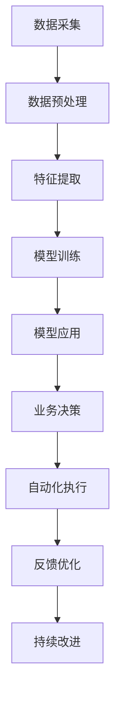

                 

# AI驱动的创新：人类计算在商业中的未来发展趋势

## 1. 背景介绍

### 1.1 问题由来

进入21世纪以来，人类社会经历了翻天覆地的变化。信息化、数字化、网络化、智能化成为时代的新特征。在这波变革浪潮中，人工智能（AI）无疑是引领未来发展的核心驱动力。AI技术通过模拟人类智能，提升了机器的自主决策、学习与感知能力，并逐步渗透到商业领域的各个环节。

当前，AI在商业领域的应用已广泛覆盖市场营销、客户服务、供应链管理、运营优化等，带来了显著的效益提升。然而，AI的潜力还远未充分挖掘。随着计算能力的不断增强，AI将从传统的基于统计模型的规则驱动，转变为基于深度学习模型和数据驱动的智能决策，实现商业领域的全面智能化。

### 1.2 问题核心关键点

AI对商业的影响主要体现在以下几个方面：

1. **预测与决策优化**：AI能够通过大数据分析预测市场趋势、客户需求，优化商业决策，降低风险，提高效率。
2. **个性化服务**：基于AI技术，商业企业能够更精准地理解客户需求，提供个性化产品和服务，提升客户满意度。
3. **运营智能化**：AI技术应用于商业运营的各个环节，如库存管理、物流配送、智能客服等，实现高效自动化。
4. **人机协同**：AI不仅替代了简单重复劳动，还能与人类劳动者协作，提升劳动效率和创新能力。

因此，如何充分发挥AI在商业中的作用，成为各行业研究的热点。本文将系统阐述AI驱动的创新，探讨人类计算在商业中的未来发展趋势，为企业提供决策参考。

## 2. 核心概念与联系

### 2.1 核心概念概述

要深入理解AI在商业中的未来发展趋势，首先需要明晰几个核心概念：

1. **AI与机器学习**：AI是计算机科学的一个分支，旨在创建智能化的机器系统，能够完成复杂任务。机器学习是AI的核心技术之一，通过训练模型使其具备数据驱动的自主学习能力。

2. **深度学习**：一种基于神经网络的机器学习方法，具有多层次的非线性映射能力，可以处理大规模复杂数据。深度学习在图像识别、语音识别、自然语言处理等领域已取得突破性进展。

3. **数据驱动决策**：AI系统通过分析大量历史数据，挖掘数据中的规律和关联，提供决策依据，减少人为判断带来的偏差。

4. **人机协作**：AI不仅独立完成任务，还可以与人类协同工作，发挥各自优势，提高整体效率。

5. **自动化与智能化**：AI技术通过自动化处理，智能化分析，实现商业运营的高效化和智能化，提升业务价值。

### 2.2 核心概念原理和架构的 Mermaid 流程图



## 3. 核心算法原理 & 具体操作步骤

### 3.1 算法原理概述

AI在商业中的应用主要依赖于算法原理，即数据驱动的机器学习和深度学习模型。以下是这些模型在商业中的基本原理：

1. **监督学习**：通过标注数据训练模型，使其能够对新数据进行分类或预测。广泛应用于客户细分、销售预测、信用评估等。

2. **无监督学习**：使用未标注数据训练模型，发现数据中的潜在结构。适用于客户聚类、异常检测等。

3. **强化学习**：通过与环境交互，让模型在不断尝试中学习最优策略。适用于游戏AI、机器人控制等。

4. **迁移学习**：将一个领域学到的知识应用到另一个领域，减少新任务学习的时间和数据需求。适用于跨领域应用、通用AI技术等。

### 3.2 算法步骤详解

AI在商业中的具体操作步骤主要包括：

1. **数据采集**：收集业务数据，如销售记录、客户反馈、市场趋势等。
2. **数据预处理**：清洗数据、特征提取、数据分割等，准备好训练数据集。
3. **模型训练**：使用监督或无监督学习方法训练模型，优化模型参数。
4. **模型应用**：将训练好的模型应用于实际业务场景，如智能推荐、销售预测、客户服务等。
5. **业务决策**：根据模型输出进行决策，调整业务策略。
6. **自动化执行**：通过API或系统集成，自动化执行决策。
7. **反馈优化**：持续收集反馈数据，优化模型。

### 3.3 算法优缺点

AI在商业中的应用具有以下优点：

1. **提高决策效率**：AI能够快速处理大量数据，提供及时决策支持。
2. **优化运营流程**：AI实现自动化操作，减少人工成本，提高运营效率。
3. **增强客户体验**：AI提供个性化服务，提升客户满意度。
4. **提升竞争力**：AI带来创新业务模式，增强市场竞争力。

同时，AI在商业中也有局限性：

1. **数据依赖性强**：AI模型依赖高质量数据训练，数据缺失或不准确会影响模型效果。
2. **模型复杂度高**：深度学习模型参数量大，训练和推理成本高。
3. **可解释性不足**：复杂模型通常难以解释其决策过程，增加管理难度。
4. **安全性风险**：AI模型可能存在偏见或错误，带来法律和伦理问题。

### 3.4 算法应用领域

AI在商业中已广泛应用于以下领域：

1. **市场营销**：通过数据分析，制定精准的市场营销策略。
2. **客户服务**：使用智能客服和聊天机器人，提高客户服务效率和质量。
3. **供应链管理**：优化库存管理、物流配送、供应商选择等。
4. **金融服务**：风险控制、信用评估、投资决策等。
5. **人力资源管理**：招聘、培训、绩效评估等。
6. **健康医疗**：疾病预测、诊断、治疗方案等。

## 4. 数学模型和公式 & 详细讲解 & 举例说明

### 4.1 数学模型构建

在商业应用中，常见的AI模型包括线性回归、决策树、随机森林、神经网络等。以神经网络为例，其基本结构为：

$$
\begin{aligned}
\boldsymbol{Z} &= \boldsymbol{X} \boldsymbol{W} + \boldsymbol{b} \\
\boldsymbol{A} &= \sigma(\boldsymbol{Z}) \\
\boldsymbol{Z}^{(2)} &= \boldsymbol{A} \boldsymbol{W}^{(2)} + \boldsymbol{b}^{(2)} \\
\boldsymbol{A}^{(2)} &= \sigma(\boldsymbol{Z}^{(2)}) \\
\hat{\boldsymbol{y}} &= \boldsymbol{A}^{(2)}
\end{aligned}
$$

其中，$\boldsymbol{X}$为输入特征，$\boldsymbol{W}$为权重，$\boldsymbol{b}$为偏置，$\sigma$为激活函数。

### 4.2 公式推导过程

以线性回归为例，公式推导如下：

$$
\hat{\boldsymbol{y}} = \boldsymbol{W} \boldsymbol{X} + \boldsymbol{b}
$$

其目标是最小化损失函数：

$$
\mathcal{L} = \frac{1}{2} \sum_{i=1}^{N} (\hat{\boldsymbol{y}}_i - \boldsymbol{y}_i)^2
$$

通过梯度下降等优化算法，求得最小化损失函数的目标参数$\boldsymbol{W}$和$\boldsymbol{b}$。

### 4.3 案例分析与讲解

假设某电商公司利用AI模型预测下个月的销售额。通过收集历史销售数据，构建线性回归模型：

$$
\hat{y} = \boldsymbol{W} \boldsymbol{x} + b
$$

其中$\boldsymbol{x} = [t, f, s]$为销售额的影响因素，$t$为时间（月份），$f$为促销活动（1为促销，0为不促销），$s$为季节（1为春季，0为非春季）。

通过最小化损失函数：

$$
\mathcal{L} = \frac{1}{2} \sum_{i=1}^{N} (\hat{y}_i - y_i)^2
$$

得到模型参数，用于预测下个月销售额。

## 5. 项目实践：代码实例和详细解释说明

### 5.1 开发环境搭建

在AI项目开发中，Python是最常用的语言。以下是搭建Python开发环境的步骤：

1. **安装Python**：选择最新版本，如Python 3.7或3.8，确保有足够的内存和磁盘空间。
2. **安装Anaconda**：用于管理依赖和创建虚拟环境。
3. **创建虚拟环境**：使用`conda create`命令创建新的虚拟环境，如`conda create -n myenv`。
4. **安装必要的库**：如Numpy、Pandas、Scikit-learn、TensorFlow等。

### 5.2 源代码详细实现

以下是一个简单的线性回归代码实现：

```python
import numpy as np
from sklearn.linear_model import LinearRegression
from sklearn.metrics import mean_squared_error

# 准备数据
X = np.array([[1, 1, 1], [2, 2, 1], [3, 3, 1], [4, 4, 1], [5, 5, 1]])
y = np.array([5, 6, 7, 8, 9])

# 训练模型
model = LinearRegression()
model.fit(X, y)

# 预测新数据
y_pred = model.predict([[6, 6, 1]])

# 评估模型
mse = mean_squared_error(y, y_pred)
print(f"均方误差: {mse}")
```

### 5.3 代码解读与分析

上述代码中，首先使用Numpy生成了一个简单的数据集。然后，使用Scikit-learn库中的LinearRegression模型进行线性回归训练。最后，使用均方误差评估模型预测的准确性。

## 6. 实际应用场景

### 6.1 智能客服系统

智能客服系统通过AI技术提升客户服务质量，减少人工成本。具体应用场景包括：

1. **自动化对话**：使用聊天机器人，提供24/7的客户服务。
2. **情感分析**：分析客户情绪，及时调整服务策略。
3. **意图识别**：准确理解客户需求，提供个性化服务。
4. **知识图谱**：构建客户与产品、服务之间的知识图谱，提供快速响应。

### 6.2 金融风险控制

金融行业面临高风险，AI在风险控制中的应用包括：

1. **信用评估**：通过分析客户历史数据，评估信用风险。
2. **欺诈检测**：使用异常检测技术，识别交易异常。
3. **投资决策**：基于市场数据，制定投资策略。

### 6.3 智能推荐系统

推荐系统通过AI技术为用户推荐商品、内容等，提升用户体验。具体应用场景包括：

1. **商品推荐**：根据用户行为，推荐商品。
2. **内容推荐**：根据用户偏好，推荐文章、视频等。
3. **个性化推荐**：使用深度学习模型，进行个性化推荐。

## 7. 工具和资源推荐

### 7.1 学习资源推荐

为了深入理解AI在商业中的应用，推荐以下学习资源：

1. **《深度学习》（周志华）**：深入浅出地介绍了深度学习的基本原理和应用。
2. **Coursera《机器学习》（Andrew Ng）**：斯坦福大学开设的课程，涵盖机器学习基础和算法。
3. **Kaggle**：数据科学竞赛平台，提供大量数据集和案例分析。
4. **Google AI Blog**：谷歌AI团队发布的博客，涵盖最新AI技术和应用。
5. **arXiv**：科研论文平台，提供前沿的AI研究进展。

### 7.2 开发工具推荐

在AI项目开发中，推荐以下工具：

1. **Python**：通用编程语言，拥有丰富的AI库。
2. **TensorFlow**：谷歌开发的深度学习框架，易于使用。
3. **PyTorch**：Facebook开发的深度学习框架，灵活高效。
4. **Jupyter Notebook**：交互式编程环境，方便代码调试和共享。
5. **Git**：版本控制工具，用于协作开发。

### 7.3 相关论文推荐

为了了解AI在商业中的应用研究，推荐以下论文：

1. **"Deep Reinforcement Learning for Decision-Making in Business"**：涉及AI在商业决策中的应用。
2. **"Applying AI in Customer Service: A Survey"**：综述了AI在客户服务中的应用。
3. **"Machine Learning in Finance"**：讨论了AI在金融领域的应用。
4. **"Recommendation Systems for Enhanced Customer Experience"**：介绍了推荐系统在商业中的应用。

## 8. 总结：未来发展趋势与挑战

### 8.1 总结

AI在商业中的应用潜力巨大，通过数据驱动和算法优化，带来了显著的效益提升。本文系统阐述了AI在商业中的应用，探讨了人类计算的未来发展趋势。AI技术正在全面渗透商业领域，带来智能化、自动化和个性化服务，提升业务效率和竞争力。

### 8.2 未来发展趋势

AI在商业中的未来发展趋势如下：

1. **智能化运营**：AI将广泛应用于各个业务环节，实现全流程智能化。
2. **个性化服务**：基于AI技术，实现精准个性化推荐和服务。
3. **跨领域应用**：AI在多个领域的应用将进一步拓展，提升业务价值。
4. **人机协同**：AI与人类协同工作，提升整体效率和创新能力。

### 8.3 面临的挑战

AI在商业中的应用也面临以下挑战：

1. **数据安全**：AI模型依赖大量数据，数据泄露和安全问题需高度重视。
2. **模型可解释性**：复杂模型难以解释其决策过程，增加管理难度。
3. **法律和伦理**：AI模型可能存在偏见和错误，带来法律和伦理问题。
4. **技术门槛**：AI技术复杂度高，需要专业人才进行开发和维护。

### 8.4 研究展望

未来，AI在商业中的研究需从以下方向突破：

1. **数据隐私保护**：开发数据隐私保护技术，确保数据安全。
2. **模型可解释性**：研究易于解释的模型，提升模型透明性。
3. **公平和透明**：确保AI模型公平透明，避免偏见和歧视。
4. **跨领域应用**：探索AI在多个领域的应用，提升业务价值。

## 9. 附录：常见问题与解答

**Q1: 人工智能在商业中应用的最大优势是什么？**

A: AI在商业中应用的最大优势在于其能够提供精准的预测和决策支持，提升运营效率和客户体验，降低成本，带来显著的效益提升。

**Q2: AI在商业中的应用有哪些局限性？**

A: AI在商业中的应用也存在一些局限性，包括数据依赖性强、模型复杂度高、可解释性不足、安全性风险等。这些都需要在实际应用中予以关注和解决。

**Q3: 未来AI在商业中的应用趋势是什么？**

A: 未来AI在商业中的应用将进一步智能化、个性化和跨领域化，提升业务价值，带来新的商业机遇。

**Q4: 如何克服AI在商业中的技术挑战？**

A: 为克服AI在商业中的技术挑战，需要加强数据隐私保护、提升模型可解释性、确保模型公平透明，以及探索跨领域应用等。

---

作者：禅与计算机程序设计艺术 / Zen and the Art of Computer Programming

