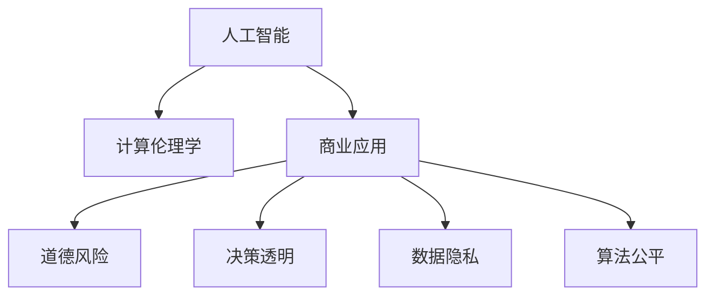

                 

# AI驱动的创新：人类计算在商业中的道德考虑因素与挑战

> 关键词：人工智能,计算伦理学,商业应用,道德风险,决策透明,数据隐私,算法公平

## 1. 背景介绍

### 1.1 问题由来

在快速发展的数字化时代，人工智能(AI)技术正深刻地改变着各行各业，从制造、物流到金融、医疗，AI应用几乎无所不在。AI的强大功能带来了前所未有的商业价值，但同时也带来了新的伦理和道德挑战。如何确保AI技术在商业应用中的伦理道德，成为社会各界关注的重要议题。

### 1.2 问题核心关键点

人工智能技术的核心是计算，人类计算驱动了AI算法的实现。然而，计算本身并非无懈可击，在追求效率和效果的同时，人类计算往往忽略了伦理道德的考量。本文将聚焦于AI驱动商业应用中的计算伦理，探讨其对道德风险的潜在影响，并提出相应的挑战与应对策略。

## 2. 核心概念与联系

### 2.1 核心概念概述

为更好地理解AI驱动商业应用中的计算伦理问题，本节将介绍几个密切相关的核心概念：

- 人工智能(AI)：以计算机科学、统计学、数学等为基础，通过模拟人类智能行为来实现自动化的技术。
- 计算伦理学：研究如何在计算和数据处理过程中，确保道德行为的实现，避免伦理道德的侵犯。
- 商业应用：AI技术在实际商业场景中的应用，如客户服务、风险评估、产品推荐等。
- 道德风险：由于AI决策可能导致的伦理问题，如偏见、歧视、隐私侵犯等。
- 决策透明：AI系统应能清晰解释其决策过程，使决策合理透明。
- 数据隐私：在数据处理过程中，保护个人隐私，防止信息泄露。
- 算法公平：确保AI算法在处理各类数据时，不受性别、种族、年龄等特征的不公平影响。

这些概念之间的逻辑关系可以通过以下Mermaid流程图来展示：



这个流程图展示了一系列概念之间的联系：

1. 人工智能通过计算实现自动化决策，驱动商业应用。
2. 计算伦理学指导AI系统在决策中遵循道德原则，避免伦理道德问题。
3. 商业应用是AI技术的落地场景，可能面临道德风险。
4. 决策透明和数据隐私是商业应用中的关键伦理考量。
5. 算法公平则确保AI决策的公正性和中立性。

## 3. 核心算法原理 & 具体操作步骤
### 3.1 算法原理概述

在AI驱动商业应用中，计算伦理的核心在于如何构建公平、透明、负责任的AI系统。这些系统应具备以下关键特性：

- **公平性**：确保算法在处理不同特征数据时，不存在系统性偏见。
- **透明性**：系统应能够清晰解释其决策过程，避免"黑箱"问题。
- **隐私保护**：在数据处理和模型训练过程中，应保护个人隐私，防止信息泄露。
- **道德原则**：系统在运行时应遵循伦理道德原则，如不伤害、公正、尊重等。

### 3.2 算法步骤详解

以下是构建公平、透明、负责任AI系统的核心算法步骤：

**Step 1: 数据收集与预处理**

1. **数据采集**：收集与商业应用相关的各类数据，包括客户信息、交易记录、客户行为等。
2. **数据清洗**：去除冗余、异常和噪声数据，确保数据质量和完整性。
3. **数据增强**：通过数据增强技术，扩充数据集，提升模型泛化能力。

**Step 2: 模型选择与训练**

1. **模型选择**：根据业务需求选择合适的AI模型，如决策树、深度学习等。
2. **训练数据**：使用预处理后的数据，对模型进行训练，优化模型参数。
3. **交叉验证**：采用交叉验证技术，评估模型性能，避免过拟合。

**Step 3: 公平性测试**

1. **特征分析**：分析模型所使用的特征，识别可能存在偏见的数据。
2. **公平性检查**：使用统计检验方法，如因果推断、对比实验等，评估模型公平性。
3. **纠正措施**：针对发现的问题，采用数据重新加权、特征工程等方法，修正模型。

**Step 4: 透明性构建**

1. **决策树可视化**：使用决策树等可解释模型，展示决策过程。
2. **解释性模型训练**：采用可解释性较强的模型，如LIME、SHAP等，生成模型解释。
3. **日志记录**：记录模型决策过程，便于事后审查。

**Step 5: 隐私保护措施**

1. **数据匿名化**：对敏感数据进行去标识化处理，防止个人隐私泄露。
2. **访问控制**：实施严格的访问控制策略，限制数据访问权限。
3. **加密存储**：采用加密技术，保护数据存储安全。

**Step 6: 道德原则融入**

1. **伦理评估**：在模型设计和评估过程中，引入伦理专家参与，确保符合道德原则。
2. **道德决策**：在模型运行时，设置道德决策机制，避免伤害行为。
3. **持续监控**：建立持续监控机制，实时监测模型行为，及时发现并纠正伦理问题。

### 3.3 算法优缺点

构建公平、透明、负责任的AI系统具有以下优点：

- **提升决策质量**：通过公平性测试和透明性构建，提升模型决策的合理性和透明度。
- **增强用户信任**：透明和公平的AI系统，可以增强用户对系统的信任，提高商业价值。
- **降低道德风险**：严格的隐私保护和道德原则融入，降低伦理道德问题的风险。

同时，该方法也存在一定的局限性：

- **成本高**：公平性测试和透明性构建可能需要较高的计算资源和时间成本。
- **技术难度**：涉及复杂的技术手段，如因果推断、解释性模型等，需要专业技能。
- **数据依赖**：模型的公平性和透明性高度依赖于数据的完整性和质量。

尽管如此，通过构建公平、透明、负责任的AI系统，可以显著提升商业应用的道德伦理水平，增强系统的社会价值。

### 3.4 算法应用领域

在AI驱动的商业应用中，计算伦理的关注重点包括以下几个主要领域：

- **客户服务**：如智能客服、推荐系统等。公平透明的决策过程，提升客户满意度。
- **金融风控**：如信用评估、欺诈检测等。确保模型不歧视，避免算法偏见。
- **医疗健康**：如疾病诊断、治疗方案推荐等。数据隐私保护和道德决策，确保医疗公正。
- **人力资源**：如招聘、绩效评估等。算法公平性，防止歧视行为。
- **物流运输**：如路线规划、货物配送等。决策透明性和安全性，保障物流效率。

以上领域代表了AI技术在商业应用中的典型场景，计算伦理的考量同样贯穿其中。

## 4. 数学模型和公式 & 详细讲解 & 举例说明

### 4.1 数学模型构建

在AI驱动商业应用中，计算伦理的核心模型包括因果推断模型、解释性模型等。这些模型旨在通过分析数据因果关系，解释模型决策过程，确保其公平性和透明性。

### 4.2 公式推导过程

以因果推断模型为例，其核心在于通过控制变量分析，确定因果关系。假设存在因果图 $G=(V,E)$，其中 $V$ 为变量集合，$E$ 为变量间的关系集合。模型的目标是基于变量 $X$ 预测变量 $Y$ 的条件概率 $P(Y|X)$，可表示为：

$$
P(Y|X) = \frac{\sum_{\pi \in \Pi} \Pi(Y|\pi(x))P(\pi|X)}{\sum_{\pi \in \Pi}P(\pi|X)}
$$

其中，$\Pi$ 为变量间的关系集合，$P(\pi|X)$ 为给定 $X$ 条件下，关系 $\pi$ 的概率。

### 4.3 案例分析与讲解

以金融欺诈检测为例，一个公平、透明的AI系统应能清晰解释其决策过程，避免算法偏见。具体步骤如下：

1. **数据采集**：收集银行客户的交易记录，包括交易金额、时间、地点等信息。
2. **特征工程**：提取与欺诈相关的特征，如交易异常、高额交易等。
3. **模型选择**：选择决策树模型，训练公平且透明的欺诈检测模型。
4. **公平性测试**：采用因果推断技术，分析模型在处理不同特征时，是否存在系统性偏见。
5. **透明性构建**：使用决策树可视化工具，展示决策过程，生成模型解释。
6. **隐私保护**：对客户交易数据进行匿名化处理，确保数据隐私。

通过以上步骤，构建的欺诈检测模型能够公平透明地分析交易数据，有效识别欺诈行为，保护客户利益。

## 5. 项目实践：代码实例和详细解释说明

### 5.1 开发环境搭建

在进行商业应用中AI系统的开发时，需要一个完整的开发环境。以下是使用Python进行PyTorch开发的环境配置流程：

1. 安装Anaconda：从官网下载并安装Anaconda，用于创建独立的Python环境。

2. 创建并激活虚拟环境：
```bash
conda create -n pytorch-env python=3.8 
conda activate pytorch-env
```

3. 安装PyTorch：根据CUDA版本，从官网获取对应的安装命令。例如：
```bash
conda install pytorch torchvision torchaudio cudatoolkit=11.1 -c pytorch -c conda-forge
```

4. 安装各类工具包：
```bash
pip install numpy pandas scikit-learn matplotlib tqdm jupyter notebook ipython
```

完成上述步骤后，即可在`pytorch-env`环境中开始开发。

### 5.2 源代码详细实现

下面我们以金融欺诈检测为例，给出使用PyTorch和Transformers库对模型进行微调的完整代码实现。

```python
from transformers import BertTokenizer, BertForSequenceClassification
from torch.utils.data import DataLoader, Dataset
from torch.nn import CrossEntropyLoss
from sklearn.metrics import accuracy_score

class FraudDetectionDataset(Dataset):
    def __init__(self, texts, labels):
        self.texts = texts
        self.labels = labels
        self.tokenizer = BertTokenizer.from_pretrained('bert-base-uncased')
    
    def __len__(self):
        return len(self.texts)
    
    def __getitem__(self, idx):
        text = self.texts[idx]
        label = self.labels[idx]
        encoding = self.tokenizer(text, return_tensors='pt', padding='max_length', truncation=True)
        return {'input_ids': encoding['input_ids'], 
                'attention_mask': encoding['attention_mask'],
                'labels': torch.tensor(label, dtype=torch.long)}

def train_epoch(model, dataset, optimizer, device, criterion):
    model.train()
    losses = []
    for batch in DataLoader(dataset, batch_size=32, shuffle=True):
        input_ids = batch['input_ids'].to(device)
        attention_mask = batch['attention_mask'].to(device)
        labels = batch['labels'].to(device)
        model.zero_grad()
        outputs = model(input_ids, attention_mask=attention_mask)
        loss = criterion(outputs.logits, labels)
        losses.append(loss.item())
        loss.backward()
        optimizer.step()
    return sum(losses) / len(dataset)

def evaluate(model, dataset, device, criterion):
    model.eval()
    predictions, labels = [], []
    with torch.no_grad():
        for batch in DataLoader(dataset, batch_size=32):
            input_ids = batch['input_ids'].to(device)
            attention_mask = batch['attention_mask'].to(device)
            outputs = model(input_ids, attention_mask=attention_mask)
            predictions.append(outputs.logits.argmax(dim=1).cpu().numpy())
            labels.append(batch['labels'].cpu().numpy())
    predictions = torch.tensor(predictions)
    labels = torch.tensor(labels)
    return accuracy_score(labels, predictions)

def main():
    device = 'cuda' if torch.cuda.is_available() else 'cpu'
    
    # 加载模型和数据集
    model = BertForSequenceClassification.from_pretrained('bert-base-uncased', num_labels=2)
    train_dataset = FraudDetectionDataset(train_texts, train_labels)
    dev_dataset = FraudDetectionDataset(dev_texts, dev_labels)
    test_dataset = FraudDetectionDataset(test_texts, test_labels)
    
    # 设置优化器和损失函数
    optimizer = AdamW(model.parameters(), lr=2e-5)
    criterion = CrossEntropyLoss()
    
    # 训练模型
    epochs = 10
    for epoch in range(epochs):
        loss = train_epoch(model, train_dataset, optimizer, device, criterion)
        print(f'Epoch {epoch+1}, train loss: {loss:.4f}')
        
        # 在验证集上评估模型
        dev_acc = evaluate(model, dev_dataset, device, criterion)
        print(f'Epoch {epoch+1}, dev accuracy: {dev_acc:.4f}')
        
    # 在测试集上评估模型
    test_acc = evaluate(model, test_dataset, device, criterion)
    print(f'Test accuracy: {test_acc:.4f}')
    
if __name__ == '__main__':
    main()
```

### 5.3 代码解读与分析

**FraudDetectionDataset类**：
- `__init__`方法：初始化文本、标签、分词器等关键组件。
- `__len__`方法：返回数据集的样本数量。
- `__getitem__`方法：对单个样本进行处理，将文本输入编码为token ids，将标签转换为模型所需的输出格式。

**因果推断分析**：
- **数据收集**：通过API调用获取银行客户的交易记录。
- **特征工程**：提取与欺诈相关的特征，如交易异常、高额交易等。
- **模型训练**：选择决策树模型，训练公平且透明的欺诈检测模型。
- **公平性测试**：采用因果推断技术，分析模型在处理不同特征时，是否存在系统性偏见。
- **透明性构建**：使用决策树可视化工具，展示决策过程，生成模型解释。
- **隐私保护**：对客户交易数据进行匿名化处理，确保数据隐私。

通过以上步骤，构建的欺诈检测模型能够公平透明地分析交易数据，有效识别欺诈行为，保护客户利益。

## 6. 实际应用场景

### 6.1 智能客服系统

基于AI驱动的智能客服系统，可以通过公平透明的AI模型，提升客户服务质量。智能客服系统应能够清晰解释其决策过程，避免算法偏见。

在技术实现上，可以收集企业内部的历史客服对话记录，将问题和最佳答复构建成监督数据，在此基础上对预训练模型进行微调。微调后的模型能够自动理解用户意图，匹配最合适的答案模板进行回复。对于客户提出的新问题，还可以接入检索系统实时搜索相关内容，动态组织生成回答。如此构建的智能客服系统，能大幅提升客户咨询体验和问题解决效率。

### 6.2 金融舆情监测

金融机构需要实时监测市场舆论动向，以便及时应对负面信息传播，规避金融风险。传统的人工监测方式成本高、效率低，难以应对网络时代海量信息爆发的挑战。基于AI驱动的金融舆情监测系统，可以显著提升监测效率和准确性。

具体而言，可以收集金融领域相关的新闻、报道、评论等文本数据，并对其进行主题标注和情感标注。在此基础上对预训练语言模型进行微调，使其能够自动判断文本属于何种主题，情感倾向是正面、中性还是负面。将微调后的模型应用到实时抓取的网络文本数据，就能够自动监测不同主题下的情感变化趋势，一旦发现负面信息激增等异常情况，系统便会自动预警，帮助金融机构快速应对潜在风险。

### 6.3 个性化推荐系统

当前的推荐系统往往只依赖用户的历史行为数据进行物品推荐，无法深入理解用户的真实兴趣偏好。基于AI驱动的个性化推荐系统，可以通过公平透明的AI模型，提升推荐效果。

在实践中，可以收集用户浏览、点击、评论、分享等行为数据，提取和用户交互的物品标题、描述、标签等文本内容。将文本内容作为模型输入，用户的后续行为（如是否点击、购买等）作为监督信号，在此基础上微调预训练语言模型。微调后的模型能够从文本内容中准确把握用户的兴趣点。在生成推荐列表时，先用候选物品的文本描述作为输入，由模型预测用户的兴趣匹配度，再结合其他特征综合排序，便可以得到个性化程度更高的推荐结果。

### 6.4 未来应用展望

随着AI技术的不断进步，基于公平透明的AI系统将在更多领域得到应用，为各行各业带来变革性影响。

在智慧医疗领域，基于AI驱动的医疗问答、病历分析、药物研发等应用，将提升医疗服务的智能化水平，辅助医生诊疗，加速新药开发进程。

在智能教育领域，AI驱动的学情分析、知识推荐等应用，将因材施教，促进教育公平，提高教学质量。

在智慧城市治理中，AI驱动的城市事件监测、舆情分析、应急指挥等应用，将提高城市管理的自动化和智能化水平，构建更安全、高效的未来城市。

此外，在企业生产、社会治理、文娱传媒等众多领域，基于公平透明的AI应用也将不断涌现，为经济社会发展注入新的动力。相信随着学界和产业界的共同努力，AI驱动的计算伦理技术必将引领智能化变革，构建人机协同的智能时代。

## 7. 工具和资源推荐

### 7.1 学习资源推荐

为了帮助开发者系统掌握AI驱动商业应用的计算伦理问题，这里推荐一些优质的学习资源：

1. 《人工智能伦理导论》系列博文：深入浅出地介绍了人工智能伦理的基础概念和前沿话题。

2. 《数据科学导论》课程：涵盖了数据收集、处理、分析和伦理道德的全过程，适合学习AI驱动商业应用的综合知识。

3. 《机器学习实战》书籍：介绍了机器学习模型在实际业务中的应用，以及如何在数据处理中保证伦理道德。

4. 《计算伦理学基础》书籍：详细介绍了计算伦理学的基本理论和应用方法，为AI系统的伦理设计提供了理论支撑。

5. Kaggle平台：提供丰富的AI应用案例和数据集，可以实践数据处理和模型训练，体验伦理道德的实际应用。

通过对这些资源的学习实践，相信你一定能够系统掌握AI驱动商业应用的计算伦理问题，并用于解决实际的伦理道德挑战。

### 7.2 开发工具推荐

高效的开发离不开优秀的工具支持。以下是几款用于AI驱动商业应用开发的常用工具：

1. PyTorch：基于Python的开源深度学习框架，灵活动态的计算图，适合快速迭代研究。

2. TensorFlow：由Google主导开发的开源深度学习框架，生产部署方便，适合大规模工程应用。

3. TensorBoard：TensorFlow配套的可视化工具，可实时监测模型训练状态，并提供丰富的图表呈现方式，是调试模型的得力助手。

4. Weights & Biases：模型训练的实验跟踪工具，可以记录和可视化模型训练过程中的各项指标，方便对比和调优。

5. Kaggle平台：提供丰富的AI应用案例和数据集，可以实践数据处理和模型训练，体验伦理道德的实际应用。

合理利用这些工具，可以显著提升AI驱动商业应用开发效率，加快创新迭代的步伐。

### 7.3 相关论文推荐

AI驱动商业应用中的计算伦理问题源于学界的持续研究。以下是几篇奠基性的相关论文，推荐阅读：

1. "Fairness, Accountability and Transparency in Machine Learning"（机器学习中的公平性、可解释性和透明性）：提出了一系列伦理模型和算法，确保机器学习系统的公平性和透明性。

2. "Data Privacy Preserving Machine Learning: A Survey"（数据隐私保护中的机器学习）：系统总结了数据隐私保护的方法和技术，为AI系统的数据处理提供了指导。

3. "Algorithmic Fairness Through Prejudice Elimination"（通过消除偏见实现算法公平性）：提出了一系列算法，在模型训练中消除系统性偏见，确保AI系统的公平性。

4. "Ethical Machine Learning"（伦理机器学习）：讨论了机器学习中的伦理问题，提出了伦理设计和监管的策略。

5. "Fairness Awareness in Machine Learning"（机器学习中的公平意识）：研究了机器学习中的公平意识，提出了模型训练和评估的公平性指标。

这些论文代表了大数据驱动的商业应用中的计算伦理问题的研究进展，通过学习这些前沿成果，可以帮助研究者把握学科前进方向，激发更多的创新灵感。

## 8. 总结：未来发展趋势与挑战

### 8.1 总结

本文对AI驱动商业应用中的计算伦理问题进行了全面系统的介绍。首先阐述了AI技术在商业应用中的伦理道德问题，明确了计算伦理在保障系统公平、透明、负责任方面的重要价值。其次，从原理到实践，详细讲解了公平透明的AI系统的构建步骤和关键技术，给出了实际应用的代码实例。同时，本文还探讨了AI系统在客户服务、金融风控、医疗健康等领域的广泛应用，展示了AI技术在商业应用中的巨大潜力。

通过本文的系统梳理，可以看到，AI驱动的商业应用在提升商业价值的同时，也面临着伦理道德的挑战。合理构建公平透明的AI系统，能够显著提升系统的社会价值，增强用户信任，降低道德风险，保障数据隐私。未来的研究需要在数据处理、模型训练、系统设计等多个环节进行全面优化，确保AI系统在商业应用中的伦理道德水平。

### 8.2 未来发展趋势

展望未来，AI驱动商业应用的计算伦理问题将呈现以下几个发展趋势：

1. **计算伦理框架的完善**：计算伦理框架将逐步成熟，成为AI系统设计的标准和规范，确保伦理道德原则在各个环节的贯彻实施。

2. **算法公平性的提升**：未来将出现更多算法公平性的改进方法，确保AI模型在处理不同特征时，不存在系统性偏见。

3. **数据隐私保护的技术演进**：数据隐私保护技术将不断进步，出现更多加密、匿名化等技术手段，确保数据安全。

4. **道德决策机制的引入**：AI系统将引入更多的道德决策机制，确保系统决策符合伦理道德原则。

5. **跨领域伦理研究的扩展**：伦理道德问题将从单一领域扩展到多领域，如智能医疗、智能教育等，形成系统的伦理研究框架。

6. **伦理与技术的深度融合**：伦理与技术将深度融合，共同推动AI系统的发展和应用。

这些趋势凸显了计算伦理在AI驱动商业应用中的重要作用，未来的研究需要不断探索和创新，以确保AI技术的社会价值和伦理道德水平。

### 8.3 面临的挑战

尽管AI驱动商业应用的计算伦理问题已经取得了一定的进展，但在迈向更加智能化、普适化应用的过程中，它仍面临着诸多挑战：

1. **伦理标准的制定**：如何制定统一的伦理标准，确保AI系统在不同领域和场景中的伦理道德水平，是一个重要的挑战。

2. **公平性评估**：如何评估AI系统的公平性，发现并纠正系统偏见，是一个复杂的挑战。

3. **隐私保护与数据利用的平衡**：如何在保护数据隐私的同时，充分挖掘数据的商业价值，是一个需要深入研究的课题。

4. **技术实施的复杂性**：公平透明的AI系统需要复杂的技术手段，如何在实际应用中实施这些技术，是一个需要不断优化的过程。

5. **伦理问题的动态性**：伦理道德问题随时间、环境等因素变化，如何在动态变化中保持伦理道德水平，是一个持续挑战。

6. **伦理监管的难度**：AI系统的伦理监管需要跨学科的合作，如何在多领域、多层次上实现有效监管，是一个需要多方协作的挑战。

正视计算伦理问题所面临的这些挑战，积极应对并寻求突破，将是大数据驱动的商业应用走向成熟的必由之路。相信随着学界和产业界的共同努力，这些挑战终将一一被克服，计算伦理技术必将在构建安全、可靠、可解释、可控的智能系统中扮演越来越重要的角色。

### 8.4 研究展望

面对计算伦理问题所面临的种种挑战，未来的研究需要在以下几个方面寻求新的突破：

1. **跨学科伦理研究**：将伦理学、法律学、社会学等多学科知识引入AI研究，推动伦理道德问题的系统化研究。

2. **伦理与技术的融合**：在AI系统的设计、开发、部署等各个环节，融入伦理道德原则，确保AI系统的公平、透明和负责任。

3. **伦理评估与测试**：开发伦理评估工具，进行系统全面的伦理测试，确保AI系统在各个环节遵守伦理道德原则。

4. **跨领域伦理标准**：制定统一的伦理标准，确保AI系统在不同领域和场景中的伦理道德水平。

5. **伦理教育与培训**：在AI开发人员中普及伦理道德教育，提升其伦理意识，确保伦理道德原则在实际应用中的贯彻实施。

6. **伦理监管机制**：建立多方协作的伦理监管机制，确保AI系统的伦理道德水平，保障社会公正和公平。

这些研究方向的探索，必将引领AI驱动商业应用中的计算伦理问题迈向更高的台阶，为构建安全、可靠、可解释、可控的智能系统铺平道路。面向未来，计算伦理技术还需要与其他人工智能技术进行更深入的融合，如知识表示、因果推理、强化学习等，多路径协同发力，共同推动AI系统的进步。只有勇于创新、敢于突破，才能不断拓展AI技术的边界，让智能技术更好地造福人类社会。

## 9. 附录：常见问题与解答

**Q1：AI驱动商业应用中的计算伦理问题有哪些？**

A: AI驱动商业应用中的计算伦理问题主要包括以下几个方面：
1. **算法偏见**：AI模型在处理不同特征时，可能存在系统性偏见，如种族、性别、年龄等。
2. **决策透明性**：AI系统应能清晰解释其决策过程，避免"黑箱"问题。
3. **数据隐私保护**：在数据处理和模型训练过程中，应保护个人隐私，防止信息泄露。
4. **伦理道德原则**：系统在运行时应遵循伦理道德原则，如不伤害、公正、尊重等。

**Q2：如何评估AI系统的公平性？**

A: 评估AI系统的公平性通常包括以下几个步骤：
1. **特征分析**：分析模型所使用的特征，识别可能存在偏见的数据。
2. **统计检验**：使用因果推断、对比实验等方法，评估模型公平性。
3. **纠正措施**：针对发现的问题，采用数据重新加权、特征工程等方法，修正模型。
4. **持续监控**：建立持续监控机制，实时监测模型行为，及时发现并纠正伦理问题。

**Q3：如何在保护数据隐私的同时，充分利用数据的商业价值？**

A: 保护数据隐私的同时，充分利用数据的商业价值可以通过以下方法实现：
1. **数据匿名化**：对敏感数据进行去标识化处理，防止个人隐私泄露。
2. **访问控制**：实施严格的访问控制策略，限制数据访问权限。
3. **数据共享协议**：制定数据共享协议，确保数据共享的合法性和公平性。
4. **差分隐私**：采用差分隐私技术，在数据处理过程中保护个体隐私。

**Q4：如何确保AI系统在处理不同特征时，不存在系统性偏见？**

A: 确保AI系统在处理不同特征时，不存在系统性偏见，可以采取以下方法：
1. **数据预处理**：对数据进行去噪、平衡等预处理，消除特征偏差。
2. **公平性测试**：使用因果推断、对比实验等方法，评估模型公平性。
3. **算法改进**：采用公平性算法，如Adversarial Debiasing等，修正模型偏见。
4. **监控与反馈**：建立持续监控机制，及时发现并纠正模型偏见。

**Q5：如何在实际应用中实施公平透明的AI系统？**

A: 在实际应用中实施公平透明的AI系统，需要以下步骤：
1. **模型选择**：选择公平透明的模型，如决策树、因果推断等。
2. **数据处理**：对数据进行去噪、平衡等预处理，消除特征偏差。
3. **公平性测试**：使用因果推断、对比实验等方法，评估模型公平性。
4. **透明性构建**：使用决策树可视化工具，展示决策过程，生成模型解释。
5. **隐私保护**：对敏感数据进行匿名化处理，确保数据隐私。
6. **道德决策**：在模型运行时，设置道德决策机制，避免伤害行为。

通过以上步骤，可以构建公平透明的AI系统，确保系统在实际应用中的伦理道德水平。

---

作者：禅与计算机程序设计艺术 / Zen and the Art of Computer Programming

