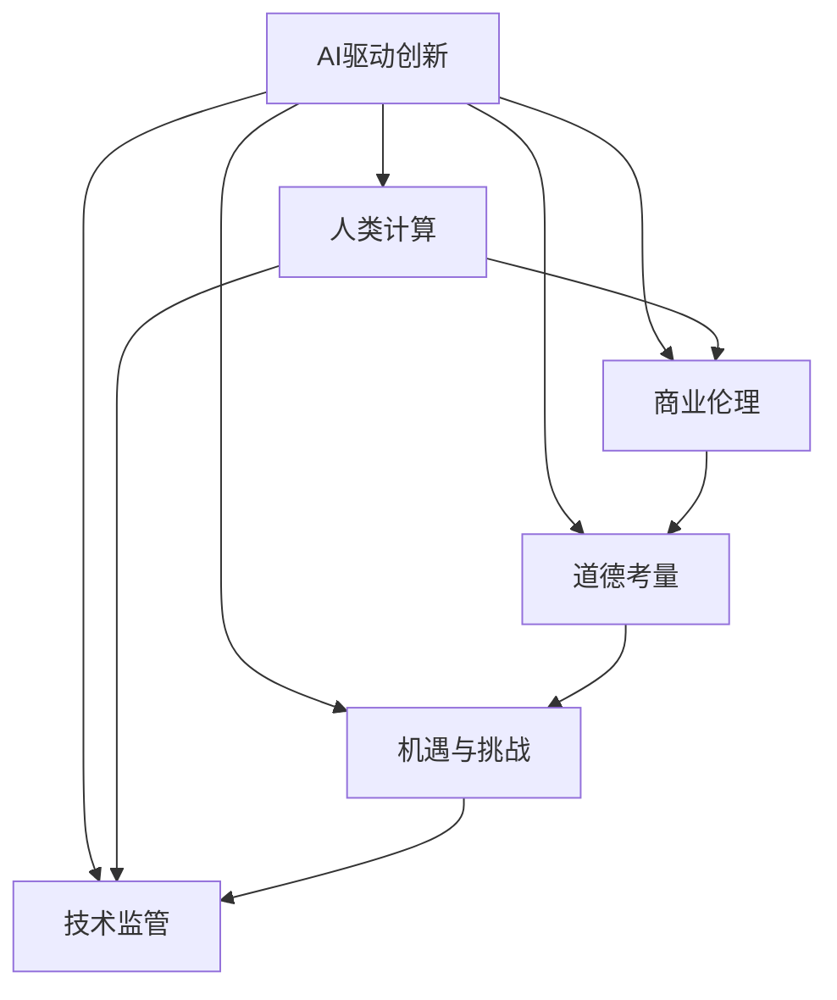

                 

# AI驱动的创新：人类计算在商业中的道德考虑因素与机遇

> 关键词：AI驱动创新，人类计算，商业伦理，道德考量，机遇与挑战

## 1. 背景介绍

### 1.1 问题由来
随着人工智能技术的快速发展，AI驱动的创新已成为推动商业领域进步的关键动力。AI技术能够自动化、智能化地处理海量数据，优化业务流程，提升决策效率，但同时其潜在的伦理道德问题也引起了广泛关注。如何在追求商业利益的同时，保证AI技术的道德规范，是当前业界和学界面临的重要课题。

### 1.2 问题核心关键点
AI驱动的商业创新涉及的技术广泛，包括自然语言处理、计算机视觉、强化学习等。这些技术的研发和应用，离不开复杂的人类计算过程，如数据收集、模型训练、推理预测等。人类计算在商业创新中的作用日益显著，但随之而来的道德问题也愈发凸显。如何在商业应用中平衡技术创新与道德规范，已成为业界亟需解决的关键挑战。

### 1.3 问题研究意义
探讨AI驱动的商业创新中的道德考量因素，有助于制定更为科学合理的技术开发与商业应用策略，保障技术进步与社会伦理的和谐共进。明确商业应用中的道德底线，可以增强社会信任，促进AI技术的健康发展。此外，通过研究如何在商业创新中兼顾技术优势与伦理道德，可以为未来的技术开发与政策制定提供参考。

## 2. 核心概念与联系

### 2.1 核心概念概述

为更好地理解AI驱动的商业创新及其中的道德考量，本节将介绍几个核心概念及其之间的联系：

- **AI驱动创新**：利用AI技术进行业务流程优化、产品创新、决策支持等活动，提升企业竞争力。

- **人类计算**：在AI开发和应用过程中，人类在数据预处理、模型训练、算法优化等方面扮演的角色。

- **商业伦理**：企业在进行商业活动时，应遵循的法律、道德规范和社会责任。

- **道德考量**：在AI技术应用中，需考虑的伦理问题，如隐私保护、数据安全、算法透明性、偏见与歧视等。

- **机遇与挑战**：AI技术带来的商业机遇，如市场扩展、运营效率提升、用户个性化服务等，以及可能面临的伦理风险和法律挑战。

- **技术监管**：政府和行业组织对AI技术开发与应用实施的监管政策，以保障社会利益和公共安全。

这些概念之间存在紧密的联系，共同构成了AI驱动的商业创新的框架。了解这些概念，有助于深入分析其中的道德考量，寻找应对挑战的策略。

### 2.2 核心概念原理和架构的 Mermaid 流程图



这个流程图展示了AI驱动的商业创新与核心概念之间的逻辑关系：

1. **AI驱动创新**作为起点，涉及数据计算、模型训练、业务决策等环节。
2. **人类计算**在AI驱动创新中占据重要地位，涉及数据预处理、算法优化等。
3. **商业伦理**关注企业在商业活动中的行为规范，保障用户权益。
4. **道德考量**聚焦AI应用中的伦理问题，如隐私保护、算法透明性等。
5. **机遇与挑战**指AI带来的商业机遇与潜在的伦理风险。
6. **技术监管**涉及政府和行业组织的监管政策，保障AI技术的健康发展。

## 3. 核心算法原理 & 具体操作步骤

### 3.1 算法原理概述

AI驱动的商业创新，核心在于利用AI技术优化业务流程、提升决策效率。其算法原理可概括为以下几个关键步骤：

1. **数据预处理**：收集和清洗数据，将其转化为适合AI模型处理的格式。
2. **模型训练**：利用数据训练AI模型，使其能够学习和提取数据中的规律。
3. **推理预测**：利用训练好的模型，对新数据进行推理预测，提供决策支持。
4. **反馈优化**：根据预测结果的准确性和业务反馈，对模型进行迭代优化。

### 3.2 算法步骤详解

**步骤1：数据预处理**
- 收集相关数据，如客户交易记录、市场数据、用户行为数据等。
- 进行数据清洗，去除噪声、填补缺失值、处理异常值。
- 对数据进行特征工程，提取有意义的特征。
- 将数据转化为适合AI模型的格式，如TensorFlow Dataset、PyTorch Dataset等。

**步骤2：模型训练**
- 选择合适的模型架构和优化器，如卷积神经网络(CNN)、循环神经网络(RNN)、Transformer等。
- 分割数据为训练集、验证集和测试集。
- 使用训练集进行模型训练，设定合适的学习率、批大小、迭代轮数等超参数。
- 在验证集上进行模型评估，调整超参数以避免过拟合。
- 使用测试集进行最终模型评估，输出模型性能指标。

**步骤3：推理预测**
- 使用训练好的模型，对新数据进行推理预测。
- 将预测结果转化为业务决策或用户推荐。
- 根据预测结果，进一步优化业务流程或提供个性化服务。

**步骤4：反馈优化**
- 收集预测结果的业务反馈，评估模型性能。
- 根据反馈调整模型参数或更新数据集，进行模型迭代优化。
- 定期重新训练模型，以应对业务需求的变化。

### 3.3 算法优缺点

**优点**：
1. **效率提升**：AI模型能够在短时间内处理大量数据，提升业务效率。
2. **决策优化**：AI技术提供精准的预测和决策支持，减少人为错误。
3. **创新突破**：AI驱动创新能够发现新的业务模式和应用场景，引领行业发展。
4. **数据驱动**：AI技术基于数据驱动决策，具有客观性和科学性。

**缺点**：
1. **隐私风险**：收集和使用大量个人数据可能带来隐私泄露的风险。
2. **算法透明性**：AI模型作为"黑盒"系统，其决策过程难以解释。
3. **偏见与歧视**：AI模型可能继承和放大数据中的偏见，导致不公平决策。
4. **技术依赖**：对AI技术的依赖可能导致企业技术风险和竞争劣势。
5. **伦理风险**：AI技术应用中可能出现伦理道德问题，如自动化裁员、隐私侵犯等。

### 3.4 算法应用领域

AI驱动的商业创新在多个领域得到了广泛应用，包括但不限于：

- **金融科技**：利用AI进行风险评估、投资决策、客户服务优化等。
- **医疗健康**：应用AI进行疾病预测、药物研发、患者管理等。
- **零售电商**：利用AI进行客户行为分析、商品推荐、库存管理等。
- **制造业**：使用AI进行生产流程优化、设备维护、质量控制等。
- **智能交通**：利用AI进行交通流量预测、自动驾驶、智能调度等。

## 4. 数学模型和公式 & 详细讲解 & 举例说明

### 4.1 数学模型构建

为便于理解AI驱动的商业创新中的算法原理，我们以金融科技领域的信用评分模型为例，构建数学模型。

假设金融公司使用AI模型对客户的信用评分进行评估，模型输入为客户的个人和财务信息，输出为信用评分。数学模型可以表示为：

$$
y = f(x;\theta)
$$

其中 $y$ 表示信用评分，$x$ 表示输入的客户信息，$\theta$ 表示模型参数。

### 4.2 公式推导过程

我们以逻辑回归模型为例，推导其优化目标函数：

**目标函数**：
$$
L(\theta) = -\frac{1}{N}\sum_{i=1}^N(y_i\log(f(x_i;\theta))+(1-y_i)\log(1-f(x_i;\theta)))
$$

其中 $y_i$ 表示样本 $i$ 的真实标签，$f(x_i;\theta)$ 表示模型对样本 $i$ 的预测概率。

**梯度下降**：
$$
\theta_{t+1} = \theta_t - \alpha \nabla_{\theta}L(\theta_t)
$$

其中 $\alpha$ 为学习率，$\nabla_{\theta}L(\theta_t)$ 表示损失函数对模型参数的梯度，通过反向传播算法计算。

### 4.3 案例分析与讲解

以一个简单的金融信用评分模型为例，展示其训练和应用过程。

**模型定义**：
```python
import torch
import torch.nn as nn
import torch.optim as optim

class CreditScoringModel(nn.Module):
    def __init__(self, input_size, output_size):
        super(CreditScoringModel, self).__init__()
        self.fc1 = nn.Linear(input_size, 32)
        self.fc2 = nn.Linear(32, output_size)
        self.sigmoid = nn.Sigmoid()
        
    def forward(self, x):
        x = self.fc1(x)
        x = self.sigmoid(x)
        x = self.fc2(x)
        x = self.sigmoid(x)
        return x
```

**训练流程**：
```python
model = CreditScoringModel(input_size=10, output_size=1)
optimizer = optim.SGD(model.parameters(), lr=0.01)
criterion = nn.BCELoss()

# 训练过程
for epoch in range(1000):
    optimizer.zero_grad()
    y_pred = model(X_train)
    loss = criterion(y_pred, y_train)
    loss.backward()
    optimizer.step()
    
    # 评估过程
    with torch.no_grad():
        y_pred = model(X_test)
        y_score = torch.sigmoid(y_pred)
        y_true = torch.sigmoid(y_test)
        accuracy = (y_score >= 0.5).float().mean()
```

通过上述代码，展示了逻辑回归模型的训练和应用过程。在训练过程中，模型参数 $\theta$ 不断更新，以最小化损失函数 $L(\theta)$。在应用过程中，利用训练好的模型进行信用评分预测，以支持业务决策。

## 5. 项目实践：代码实例和详细解释说明

### 5.1 开发环境搭建

在进行AI驱动的商业创新实践时，需要搭建合适的开发环境。以下是使用Python进行TensorFlow开发的环境配置流程：

1. 安装Anaconda：从官网下载并安装Anaconda，用于创建独立的Python环境。
2. 创建并激活虚拟环境：
```bash
conda create -n tf-env python=3.8 
conda activate tf-env
```
3. 安装TensorFlow：根据CUDA版本，从官网获取对应的安装命令。例如：
```bash
pip install tensorflow
```
4. 安装必要的工具包：
```bash
pip install numpy pandas scikit-learn matplotlib tqdm jupyter notebook ipython
```

完成上述步骤后，即可在`tf-env`环境中开始AI驱动的商业创新实践。

### 5.2 源代码详细实现

下面我们以金融科技领域的信用评分模型为例，给出使用TensorFlow进行模型训练的PyTorch代码实现。

首先，定义模型结构：
```python
import tensorflow as tf
from tensorflow.keras import layers

model = tf.keras.Sequential([
    layers.Dense(32, activation='relu', input_shape=(10,)),
    layers.Dense(1, activation='sigmoid')
])
```

然后，定义数据集和模型优化器：
```python
train_dataset = tf.data.Dataset.from_tensor_slices((X_train, y_train))
train_dataset = train_dataset.shuffle(buffer_size=1024).batch(batch_size=32)

test_dataset = tf.data.Dataset.from_tensor_slices((X_test, y_test))
test_dataset = test_dataset.batch(batch_size=32)

optimizer = tf.keras.optimizers.SGD(learning_rate=0.01)
loss_fn = tf.keras.losses.BinaryCrossentropy(from_logits=True)
```

接着，定义训练和评估函数：
```python
@tf.function
def train_step(inputs, labels):
    with tf.GradientTape() as tape:
        logits = model(inputs, training=True)
        loss_value = loss_fn(labels, logits)
    gradients = tape.gradient(loss_value, model.trainable_variables)
    optimizer.apply_gradients(zip(gradients, model.trainable_variables))
    return loss_value

@tf.function
def evaluate_step(inputs, labels):
    logits = model(inputs, training=False)
    loss_value = loss_fn(labels, logits)
    return loss_value

def train(model, dataset, epochs, batch_size):
    for epoch in range(epochs):
        total_loss = 0.0
        for X, y in dataset:
            loss = train_step(X, y)
            total_loss += loss
        print(f"Epoch {epoch+1}, Loss: {total_loss/len(dataset)}")
        
def evaluate(model, dataset, batch_size):
    total_loss = 0.0
    for X, y in dataset:
        loss = evaluate_step(X, y)
        total_loss += loss
    print(f"Test Loss: {total_loss/len(dataset)}")
```

最后，启动训练流程并在测试集上评估：
```python
epochs = 1000
batch_size = 32

train(model, train_dataset, epochs, batch_size)
evaluate(model, test_dataset, batch_size)
```

以上就是使用TensorFlow对信用评分模型进行训练的完整代码实现。可以看到，TensorFlow提供了方便的高级API，使得模型构建和优化变得简单高效。

### 5.3 代码解读与分析

让我们再详细解读一下关键代码的实现细节：

**模型定义**：
```python
import tensorflow as tf
from tensorflow.keras import layers

model = tf.keras.Sequential([
    layers.Dense(32, activation='relu', input_shape=(10,)),
    layers.Dense(1, activation='sigmoid')
])
```

**数据集定义**：
```python
train_dataset = tf.data.Dataset.from_tensor_slices((X_train, y_train))
train_dataset = train_dataset.shuffle(buffer_size=1024).batch(batch_size=32)

test_dataset = tf.data.Dataset.from_tensor_slices((X_test, y_test))
test_dataset = test_dataset.batch(batch_size=32)
```

**训练与评估函数**：
```python
@tf.function
def train_step(inputs, labels):
    with tf.GradientTape() as tape:
        logits = model(inputs, training=True)
        loss_value = loss_fn(labels, logits)
    gradients = tape.gradient(loss_value, model.trainable_variables)
    optimizer.apply_gradients(zip(gradients, model.trainable_variables))
    return loss_value

@tf.function
def evaluate_step(inputs, labels):
    logits = model(inputs, training=False)
    loss_value = loss_fn(labels, logits)
    return loss_value

def train(model, dataset, epochs, batch_size):
    for epoch in range(epochs):
        total_loss = 0.0
        for X, y in dataset:
            loss = train_step(X, y)
            total_loss += loss
        print(f"Epoch {epoch+1}, Loss: {total_loss/len(dataset)}")
        
def evaluate(model, dataset, batch_size):
    total_loss = 0.0
    for X, y in dataset:
        loss = evaluate_step(X, y)
        total_loss += loss
    print(f"Test Loss: {total_loss/len(dataset)}")
```

可以看到，TensorFlow的高级API使得模型构建和优化变得非常简洁。通过这些代码，可以高效地进行模型的训练和评估，验证模型的预测性能。

## 6. 实际应用场景

### 6.1 智能客服系统

AI驱动的智能客服系统，通过自然语言处理技术，能够理解和响应客户咨询，提供个性化的服务和建议。该系统在电信、银行、电商等多个领域得到了广泛应用，显著提升了客户服务质量。

**数据预处理**：
- 收集历史客户对话记录，提取问答对作为训练数据。
- 清洗数据，去除噪声、处理缺失值、标注意图和实体。
- 将文本转化为数值向量，如Word2Vec、BERT等。

**模型训练**：
- 使用对话生成模型（如Seq2Seq、Transformer等）进行训练。
- 定义损失函数，如BLEU、ROUGE等，衡量模型生成的回答与真实回答的相似度。
- 优化超参数，如模型架构、学习率、批大小等。

**推理预测**：
- 在测试集上评估模型性能，使用BLEU、ROUGE等指标。
- 实时收集用户对话数据，输入到模型中，生成回答。
- 提供个性化推荐，如产品推荐、服务推荐等。

**反馈优化**：
- 收集用户反馈，如满意度评分、回复时间等。
- 根据反馈调整模型参数，迭代优化模型。
- 定期重新训练模型，以应对客户需求的变化。

### 6.2 金融风险管理

AI驱动的金融风险管理系统，通过分析客户行为、交易记录等数据，预测和防范潜在的风险。该系统在银行、保险、证券等多个金融领域得到了应用，提高了风险管理的准确性和效率。

**数据预处理**：
- 收集客户历史交易记录、信用评分、财务信息等数据。
- 清洗数据，去除噪声、处理缺失值、标注标签。
- 将数据转化为数值向量，如特征工程、PCA等。

**模型训练**：
- 使用分类模型（如SVM、随机森林、XGBoost等）进行训练。
- 定义损失函数，如交叉熵、对数损失等，衡量模型预测与真实标签的差异。
- 优化超参数，如模型架构、学习率、批大小等。

**推理预测**：
- 在测试集上评估模型性能，使用准确率、召回率等指标。
- 实时收集交易数据，输入到模型中，进行风险预测。
- 根据预测结果，进行风险控制和预警。

**反馈优化**：
- 收集业务反馈，如风险控制效果、预警准确性等。
- 根据反馈调整模型参数，迭代优化模型。
- 定期重新训练模型，以应对业务需求的变化。

### 6.3 零售个性化推荐

AI驱动的零售个性化推荐系统，通过分析用户行为数据，为用户推荐个性化的商品和服务。该系统在电商、酒店、旅游等多个零售领域得到了应用，提高了用户体验和销售额。

**数据预处理**：
- 收集用户浏览、点击、购买等行为数据。
- 清洗数据，去除噪声、处理缺失值、标注标签。
- 将数据转化为数值向量，如协同过滤、深度学习等。

**模型训练**：
- 使用协同过滤模型（如ALS、Matrix Factorization等）进行训练。
- 定义损失函数，如均方误差、交叉熵等，衡量模型预测与真实标签的差异。
- 优化超参数，如模型架构、学习率、批大小等。

**推理预测**：
- 在测试集上评估模型性能，使用准确率、召回率等指标。
- 实时收集用户行为数据，输入到模型中，进行商品推荐。
- 提供个性化推荐，如商品推荐、活动推荐等。

**反馈优化**：
- 收集用户反馈，如推荐效果、点击率等。
- 根据反馈调整模型参数，迭代优化模型。
- 定期重新训练模型，以应对业务需求的变化。

### 6.4 未来应用展望

随着AI技术的不断进步，AI驱动的商业创新将在更多领域得到应用，带来更广泛的经济和社会效益。

**智慧医疗**：通过AI驱动的诊断和治疗系统，提高医疗服务的质量和效率，降低医疗成本，促进健康产业的发展。

**智能制造**：应用AI驱动的优化和预测系统，提高生产效率，减少资源浪费，推动制造业的数字化转型。

**智慧城市**：利用AI驱动的城市管理和服务系统，提高城市运行效率，提升居民生活质量，构建智慧城市。

**教育科技**：通过AI驱动的个性化学习系统，提供定制化的学习方案，提高教育效果，促进教育公平。

**可持续发展**：应用AI驱动的环境监测和资源管理系统，优化资源配置，推动绿色可持续发展。

总之，AI驱动的商业创新具有广阔的应用前景，将在多个领域实现突破，推动经济和社会的发展。

## 7. 工具和资源推荐

### 7.1 学习资源推荐

为了帮助开发者系统掌握AI驱动的商业创新及其中的道德考量，这里推荐一些优质的学习资源：

1. **《人工智能伦理：道德、法律和社会影响》**：详细介绍了AI技术带来的伦理道德问题，提供了系统化的解决方案。
2. **《深度学习入门》**：深入浅出地介绍了深度学习的基本原理和应用，适合初学者入门。
3. **《机器学习实战》**：提供了丰富的实战案例，帮助开发者掌握机器学习技术。
4. **Coursera《AI for Everyone》**：由斯坦福大学教授主讲，全面介绍了AI技术及其在商业中的应用。
5. **Kaggle**：全球最大的数据科学竞赛平台，提供丰富的数据集和代码实现，帮助开发者提升技能。

通过学习这些资源，相信你一定能够系统掌握AI驱动的商业创新及其中的道德考量因素，为未来的技术开发和应用提供指导。

### 7.2 开发工具推荐

高效的工具是提高开发效率的关键。以下是几款用于AI驱动的商业创新开发的常用工具：

1. **TensorFlow**：由Google主导的开源深度学习框架，生产部署方便，适合大规模工程应用。
2. **PyTorch**：Facebook开发的开源深度学习框架，灵活易用，适合研究和实验。
3. **Scikit-learn**：Python的机器学习库，提供了丰富的算法实现，适合数据分析和模型训练。
4. **TensorBoard**：TensorFlow配套的可视化工具，可实时监测模型训练状态，提供丰富的图表呈现方式。
5. **Weights & Biases**：模型训练的实验跟踪工具，可以记录和可视化模型训练过程中的各项指标，方便对比和调优。
6. **Jupyter Notebook**：Python的交互式开发环境，支持代码编写、数据可视化、实时计算等，适合研究和实验。

合理利用这些工具，可以显著提升AI驱动的商业创新开发效率，加速技术创新。

### 7.3 相关论文推荐

AI驱动的商业创新涉及的技术广泛，涵盖多个学科。以下是几篇奠基性的相关论文，推荐阅读：

1. **《AI and Fairness, Accountability and Transparency: Opportunities, Risks and Ethical Implications》**：探讨AI技术在公平、透明度、责任等方面的伦理问题，提供了系统的解决方案。
2. **《Deep Learning》**：深度学习领域的经典教材，详细介绍了深度学习的基本原理和应用。
3. **《Machine Learning》**：机器学习领域的经典教材，提供了丰富的算法实现和应用案例。
4. **《Human-AI Collaboration》**：探讨人类与AI的协作关系，提出多模态、跨领域的AI应用思路。
5. **《Fairness and Accountability in AI and Machine Learning: Societal Impact》**：探讨AI技术在公平、透明、责任等方面的社会影响，提供了系统的解决方案。

这些论文代表了大数据、深度学习、AI伦理等领域的研究方向，通过学习这些前沿成果，可以为未来的技术开发和应用提供指导。

## 8. 总结：未来发展趋势与挑战

### 8.1 总结

本文对AI驱动的商业创新及其中的道德考量因素进行了全面系统的介绍。首先阐述了AI驱动的商业创新的背景和意义，明确了在追求商业利益的同时，需考虑的伦理道德问题。其次，从原理到实践，详细讲解了AI驱动的商业创新的核心算法及其操作步骤。通过具体的案例分析，展示了AI驱动的商业创新在不同领域的实际应用。最后，本文推荐了一些学习资源、开发工具和相关论文，以帮助开发者系统掌握AI驱动的商业创新及其中的道德考量因素。

通过本文的系统梳理，可以看到，AI驱动的商业创新在多个领域得到了广泛应用，带来显著的商业效益。但同时也面临诸多挑战，如隐私风险、算法透明性、偏见与歧视等。如何在追求商业利益的同时，保障伦理道德，将是未来研究的重要课题。

### 8.2 未来发展趋势

展望未来，AI驱动的商业创新将呈现以下几个发展趋势：

1. **技术创新加速**：随着算力和数据的不断提升，AI技术将在更多领域得到应用，推动产业升级和创新。
2. **伦理规范完善**：AI技术的伦理规范将逐步完善，形成系统化的道德底线和法律框架。
3. **多模态融合**：AI技术将融合语音、图像、视频等多模态信息，提供更为全面和精准的商业解决方案。
4. **个性化服务提升**：通过AI技术，企业将能够提供更为个性化和定制化的服务，提升用户体验和满意度。
5. **自动化水平提高**：AI技术将提高自动化的水平，减少人为干预，提升业务效率。

### 8.3 面临的挑战

尽管AI驱动的商业创新取得了显著成就，但在其发展过程中仍面临诸多挑战：

1. **隐私保护**：数据的隐私保护问题，如数据泄露、滥用等，亟需得到解决。
2. **算法透明性**：AI模型的黑盒问题，如决策过程不透明，难以解释，将影响用户信任。
3. **偏见与歧视**：AI模型可能继承和放大数据中的偏见，导致不公平决策，需要进一步完善算法和数据处理。
4. **法律合规**：AI技术的应用涉及众多法律问题，如隐私保护、知识产权等，需确保合规。
5. **伦理道德**：AI技术的伦理道德问题，如自动化裁员、算法歧视等，需制定系统化的解决方案。

### 8.4 研究展望

面对AI驱动的商业创新面临的诸多挑战，未来的研究需要在以下几个方面寻求新的突破：

1. **隐私保护技术**：开发更加有效的隐私保护技术，如差分隐私、联邦学习等，确保数据安全和隐私保护。
2. **算法透明性**：开发可解释的AI模型，如可解释的深度学习模型、知识图谱等，提升算法透明性。
3. **偏见与歧视**：研究公平算法，如对抗性训练、公平性评估等，减少算法偏见和歧视。
4. **法律合规**：制定AI技术的法律规范，确保技术应用的合规性。
5. **伦理道德**：探讨AI技术的伦理道德问题，制定系统化的解决方案，确保技术的公平性和公正性。

这些研究方向的探索发展，将引领AI驱动的商业创新技术迈向更高的台阶，为构建安全、可靠、可解释、可控的智能系统铺平道路。

## 9. 附录：常见问题与解答

**Q1：AI驱动的商业创新如何平衡商业利益与伦理道德？**

A: 在AI驱动的商业创新中，平衡商业利益与伦理道德的关键在于建立系统化的伦理规范和合规体系。具体措施包括：

1. **数据隐私保护**：制定严格的数据隐私保护政策，确保数据的合法获取和使用。
2. **算法透明性**：开发可解释的AI模型，确保算法的透明性和可解释性。
3. **偏见与歧视检测**：建立公平算法和偏见检测机制，减少算法偏见和歧视。
4. **伦理审查**：建立伦理审查机制，确保AI技术应用的伦理性和公正性。
5. **法律合规**：制定AI技术的法律规范，确保技术应用的合法合规。

通过上述措施，可以在追求商业利益的同时，保障伦理道德，实现科技与人文的和谐共进。

**Q2：AI驱动的商业创新面临哪些挑战？**

A: AI驱动的商业创新面临诸多挑战，主要包括以下几个方面：

1. **隐私保护**：数据的隐私保护问题，如数据泄露、滥用等，亟需得到解决。
2. **算法透明性**：AI模型的黑盒问题，如决策过程不透明，难以解释，将影响用户信任。
3. **偏见与歧视**：AI模型可能继承和放大数据中的偏见，导致不公平决策，需要进一步完善算法和数据处理。
4. **法律合规**：AI技术的应用涉及众多法律问题，如隐私保护、知识产权等，需确保合规。
5. **伦理道德**：AI技术的伦理道德问题，如自动化裁员、算法歧视等，需制定系统化的解决方案。

应对这些挑战，需要多方协作，从技术、法律、伦理等多个层面共同努力。

**Q3：AI驱动的商业创新如何实现可持续性发展？**

A: 实现AI驱动的商业创新可持续性发展，需从以下几个方面进行努力：

1. **绿色技术**：采用绿色技术和节能减排措施，降低AI技术的应用对环境的影响。
2. **资源优化**：优化资源配置，提高能源利用效率，降低能耗。
3. **社会责任**：企业应承担社会责任，积极参与公益事业，推动社会可持续发展。
4. **伦理道德**：遵循伦理道德规范，确保技术应用的公正性和公平性。
5. **政策支持**：政府应制定相关政策，支持AI技术的发展和应用，促进可持续发展。

通过上述措施，可以实现AI驱动的商业创新与可持续发展的有机结合，推动经济和社会的可持续发展。

---

作者：禅与计算机程序设计艺术 / Zen and the Art of Computer Programming

