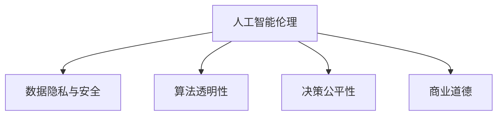

                 

# AI驱动的创新：人类计算在商业中的道德考虑因素总结

> 关键词：人工智能伦理,人类计算,商业创新,道德风险,可解释性,透明性

## 1. 背景介绍

### 1.1 问题由来
随着人工智能技术的迅猛发展，以人类计算为核心的AI系统在商业应用中变得越来越普遍。这些系统通过对海量数据进行高效处理，帮助企业提升决策效率，优化资源配置，进而获得显著的商业回报。然而，与此同时，AI系统的广泛应用也引发了诸多伦理问题。数据隐私、算法透明性、决策公平性等道德考量因素成为了制约AI技术健康发展的瓶颈。

### 1.2 问题核心关键点
本文聚焦于人类计算在商业中的伦理道德问题，旨在探讨AI驱动的创新如何在追求商业价值的同时，兼顾道德责任，保障用户的权益。特别关注以下几个核心关键点：

- 数据隐私与安全：如何在利用AI进行商业创新时，保护用户数据隐私，防止信息泄露。
- 算法透明性：如何构建透明可解释的AI模型，确保决策过程的合理性。
- 决策公平性：如何避免算法偏见，确保AI系统为不同背景的用户提供公平的服务。
- 商业道德：如何确保AI驱动的商业创新符合社会公德和商业伦理，避免利用AI进行不正当竞争。

这些关键问题直接关系到AI技术的社会接受度和可持续发展。只有充分考虑并妥善解决这些问题，AI技术才能更好地服务于社会和商业领域。

### 1.3 问题研究意义
研究AI在商业应用中的伦理道德问题，对于推动AI技术的健康发展具有重要意义：

1. 增强用户信任。确保AI系统的透明性、公平性和道德性，可以有效提升用户对AI技术的信任度，促进其更广泛的应用。
2. 规避法律风险。清晰界定AI系统的行为边界，防止其侵犯用户权益，规避法律纠纷。
3. 促进社会进步。通过合理的伦理约束，引导AI技术向更加公正、和谐、可持续的方向发展，推动社会的整体进步。
4. 提升企业竞争力。负责任的AI技术创新能够增强企业的社会责任感和市场公信力，提升其商业价值。
5. 推动技术规范。制定和遵循AI伦理标准，有利于建立统一的行业规范，促进技术共享和产业升级。

## 2. 核心概念与联系

### 2.1 核心概念概述

为更好地理解AI伦理问题，本节将介绍几个密切相关的核心概念：

- 人工智能伦理(AI Ethics)：涉及人工智能技术在开发、应用和部署过程中，应当遵守的道德规范和法律要求。
- 人类计算(Human Computation)：通过自动化和智能化手段，减轻人类重复性劳动，提升决策效率和工作质量的技术。
- 数据隐私(Security and Privacy)：指保护用户数据不被未经授权的访问、修改、泄露或破坏，确保用户信息的安全。
- 算法透明性(Algorithm Transparency)：指要求AI系统的工作原理和决策过程能够被理解和验证，防止"黑箱"化操作。
- 决策公平性(Fairness in Decision Making)：指要求AI系统在处理数据和生成决策时，能够对不同背景和特征的用户进行平等对待，避免歧视。
- 商业道德(Business Ethics)：指企业在商业活动中应当遵守的道德规范和商业伦理，包括诚实守信、公平竞争、尊重用户等。

这些核心概念之间的逻辑关系可以通过以下Mermaid流程图来展示：



这个流程图展示了大语言模型伦理道德问题的主要方面及其相互关系：

1. 人工智能伦理是大语言模型工作的前提，涉及多个方面，如数据隐私、算法透明性、决策公平性、商业道德等。
2. 数据隐私和安全是大语言模型健康运行的基础，保护用户数据不被滥用。
3. 算法透明性是确保大语言模型决策可解释性的关键，避免"黑箱"操作。
4. 决策公平性是大语言模型服务公正性的保障，防止算法偏见。
5. 商业道德是大语言模型商业应用的基本要求，促进公平竞争和良性发展。

这些概念共同构成了AI伦理的完整框架，确保AI技术在商业创新中能够兼顾经济效益和社会责任。

## 3. 核心算法原理 & 具体操作步骤
### 3.1 算法原理概述

基于人工智能伦理的商业创新，本质上是将AI技术与商业需求相结合，构建可解释、可控、公平的AI系统。其核心思想是：在追求商业价值的同时，确保AI系统的运行符合道德规范和法律法规，保障用户的合法权益。

形式化地，假设商业创新任务为 $T$，AI系统为 $M$。任务 $T$ 需要保护的数据集为 $D$，AI系统 $M$ 生成的决策结果为 $y$。AI伦理约束为目标函数 $\mathcal{L}$，包括但不限于数据隐私、算法透明性、决策公平性、商业道德等因素。则伦理约束下的商业创新优化目标为：

$$
\hat{y} = \mathop{\arg\min}_{y} \mathcal{L}(y, D)
$$

其中 $\mathcal{L}$ 为目标函数，用于衡量AI系统在不同伦理约束下的表现。常见的目标函数包括：

- 数据隐私：确保用户数据不被滥用，防止信息泄露。
- 算法透明性：确保AI系统的决策过程可被理解和验证。
- 决策公平性：确保AI系统对不同背景的用户公平对待，避免歧视。
- 商业道德：确保AI系统符合商业伦理和法律要求。

通过优化目标函数 $\mathcal{L}$，我们能够在保护伦理约束的前提下，最大化商业价值。

### 3.2 算法步骤详解

基于人工智能伦理的商业创新，一般包括以下几个关键步骤：

**Step 1: 构建伦理约束框架**
- 明确商业创新涉及的主要伦理约束，如数据隐私、算法透明性、决策公平性、商业道德等。
- 根据具体的商业场景和伦理要求，构建目标函数 $\mathcal{L}$，设定相应的约束条件。

**Step 2: 设计AI系统架构**
- 选择合适的AI模型和算法，如机器学习、深度学习等，构建初版AI系统。
- 在设计过程中，充分考虑伦理约束，避免引入潜在的道德风险。

**Step 3: 数据处理和清洗**
- 对涉及用户隐私的数据进行匿名化和去标识化处理，防止数据泄露。
- 对数据集进行清洗和预处理，确保数据质量，防止算法偏见。

**Step 4: 模型训练与微调**
- 在数据集上训练AI模型，使用正则化、对抗训练等技术，提高模型鲁棒性。
- 对模型进行微调，确保其满足特定商业任务的需求，并兼顾伦理约束。

**Step 5: 评估与监控**
- 在测试集上评估模型性能，确保其符合商业要求和伦理标准。
- 部署AI系统，持续监控其运行状态，及时调整优化。

**Step 6: 用户反馈与迭代**
- 收集用户反馈，分析AI系统的表现和伦理约束的符合度。
- 根据用户反馈和评估结果，迭代优化AI系统，提升其伦理性能。

### 3.3 算法优缺点

基于人工智能伦理的商业创新方法具有以下优点：

1. 系统透明：通过引入伦理约束，确保AI系统的运行透明可解释，有助于建立用户信任。
2. 风险可控：通过设立伦理约束，限制AI系统的行为边界，规避法律和道德风险。
3. 决策公平：通过考虑决策公平性，确保AI系统为不同背景的用户提供平等服务，提升社会公信力。
4. 社会责任：通过考虑商业道德，促进AI技术的健康发展，推动社会进步。

同时，该方法也存在一些局限性：

1. 伦理约束复杂：不同商业场景和用户需求差异较大，伦理约束的设定和验证较为复杂。
2. 伦理约束动态变化：社会伦理观念和技术进步在不断演进，伦理约束也需要动态调整，增加了系统维护的复杂性。
3. 伦理约束与商业目标冲突：某些伦理约束可能与商业目标存在冲突，需要在两者之间进行平衡和取舍。
4. 用户隐私保护难度高：随着数据规模的不断扩大，如何保护用户隐私，防止信息泄露，仍是重要难题。

尽管存在这些局限性，但就目前而言，基于伦理约束的AI技术创新方法仍是在商业领域应用的重要范式。未来相关研究的重点在于如何进一步优化伦理约束框架，提高系统透明度和鲁棒性，同时兼顾商业目标和伦理责任。

### 3.4 算法应用领域

基于人工智能伦理的商业创新方法，已经在诸多领域得到了广泛的应用，例如：

- 金融服务：通过AI驱动的信用评分、欺诈检测、客户服务机器人等，提升金融服务的智能化水平，保障用户权益。
- 医疗健康：利用AI进行疾病预测、治疗方案推荐、患者监护等，提升医疗服务的效率和质量，保护患者隐私。
- 教育培训：通过AI驱动的个性化学习推荐、智能作业批改、在线辅导等，提升教育资源的公平分配，满足不同学生的个性化需求。
- 人力资源管理：利用AI进行人才筛选、招聘推荐、员工绩效评估等，提升人力资源管理的科学性和效率，保障员工权益。
- 电子商务：通过AI驱动的个性化推荐、智能客服、库存管理等，提升电子商务平台的用户体验和运营效率，保护消费者权益。

除了上述这些经典应用外，AI伦理约束还在更多场景中得到了创新性的应用，如环境保护、智慧城市、公共安全等，为商业创新提供了新的方向。

## 4. 数学模型和公式 & 详细讲解  
### 4.1 数学模型构建

本节将使用数学语言对基于人工智能伦理的商业创新过程进行更加严格的刻画。

记商业创新任务为 $T$，AI系统为 $M$，涉及用户数据集为 $D$。设AI系统 $M$ 在用户数据集 $D$ 上的决策结果为 $y$，系统的伦理约束为目标函数 $\mathcal{L}$。则伦理约束下的商业创新优化目标为：

$$
\hat{y} = \mathop{\arg\min}_{y} \mathcal{L}(y, D)
$$

其中 $\mathcal{L}$ 为目标函数，用于衡量AI系统在不同伦理约束下的表现。常见的目标函数包括：

- 数据隐私：确保用户数据不被滥用，防止信息泄露。
- 算法透明性：确保AI系统的决策过程可被理解和验证。
- 决策公平性：确保AI系统对不同背景的用户公平对待，避免歧视。
- 商业道德：确保AI系统符合商业伦理和法律要求。

在实践中，我们通常使用基于梯度的优化算法（如SGD、Adam等）来近似求解上述最优化问题。设 $\eta$ 为学习率，$\lambda$ 为正则化系数，则参数的更新公式为：

$$
\theta \leftarrow \theta - \eta \nabla_{\theta}\mathcal{L}(\theta) - \eta\lambda\theta
$$

其中 $\nabla_{\theta}\mathcal{L}(\theta)$ 为损失函数对参数 $\theta$ 的梯度，可通过反向传播算法高效计算。

### 4.2 公式推导过程

以下我们以金融信用评分系统为例，推导数据隐私和算法透明性在目标函数中的应用。

假设AI系统 $M$ 对用户 $i$ 的信用评分结果为 $y_i$，用户真实信用评分为 $x_i$，模型的损失函数为 $L(y_i, x_i)$。假设数据集 $D=\{(x_i, y_i)\}_{i=1}^N$，其中 $x_i$ 为真实信用评分，$y_i$ 为AI系统预测的信用评分。

我们希望在保证数据隐私的前提下，最大化AI系统的预测精度。因此，引入数据隐私约束 $P$，设定如下目标函数：

$$
\mathcal{L}(y, D) = \sum_{i=1}^N L(y_i, x_i) + \alpha P(y, D)
$$

其中 $\alpha$ 为隐私约束的权重。目标函数 $\mathcal{L}$ 包含两部分：

1. 损失函数 $L(y_i, x_i)$：衡量模型预测结果与真实结果的差异。
2. 隐私约束 $P(y, D)$：衡量AI系统对用户隐私的侵犯程度。

隐私约束函数 $P(y, D)$ 可以通过差分隐私技术实现，设定如下：

$$
P(y, D) = \sum_{i=1}^N \epsilon^{-1}|\log(\frac{p(y_i|y, D)}{1-p(y_i|y, D)})
$$

其中 $p(y_i|y, D)$ 为模型预测用户 $i$ 的信用评分的概率分布，$\epsilon$ 为差分隐私参数，控制隐私泄露的程度。

对于金融信用评分系统，数据隐私和安全尤为重要。通过引入差分隐私约束，我们可以有效保护用户隐私，同时提升AI系统的预测精度。

## 5. 项目实践：代码实例和详细解释说明
### 5.1 开发环境搭建

在进行商业创新实践前，我们需要准备好开发环境。以下是使用Python进行TensorFlow开发的环境配置流程：

1. 安装Anaconda：从官网下载并安装Anaconda，用于创建独立的Python环境。

2. 创建并激活虚拟环境：
```bash
conda create -n tf-env python=3.8 
conda activate tf-env
```

3. 安装TensorFlow：从官网获取对应的安装命令。例如：
```bash
pip install tensorflow-gpu==2.4.0
```

4. 安装TensorFlow Addons：
```bash
pip install tensorflow-addons
```

5. 安装各类工具包：
```bash
pip install numpy pandas scikit-learn matplotlib tqdm jupyter notebook ipython
```

完成上述步骤后，即可在`tf-env`环境中开始商业创新实践。

### 5.2 源代码详细实现

下面我们以信用评分系统为例，给出使用TensorFlow对AI模型进行数据隐私和算法透明性约束的PyTorch代码实现。

首先，定义模型和优化器：

```python
import tensorflow as tf
from tensorflow.keras import layers

class CreditScoringModel(tf.keras.Model):
    def __init__(self, num_features):
        super(CreditScoringModel, self).__init__()
        self.input_layer = layers.InputLayer(num_features=num_features)
        self.dense_layer = layers.Dense(64, activation='relu')
        self.output_layer = layers.Dense(1, activation='sigmoid')

    def call(self, inputs):
        x = self.input_layer(inputs)
        x = self.dense_layer(x)
        return self.output_layer(x)

model = CreditScoringModel(num_features=10)
optimizer = tf.keras.optimizers.Adam(learning_rate=0.001)

# 隐私约束函数
def privacy_constraint(y_true, y_pred):
    delta = 0.01  # 差分隐私参数
    epsilon = 1 / delta
    loss = tf.reduce_mean(tf.abs(tf.math.log((y_pred / (1 - y_pred)) ** epsilon)))
    return loss

# 损失函数
def loss_function(y_true, y_pred):
    return tf.keras.losses.binary_crossentropy(y_true, y_pred)

# 训练函数
@tf.function
def train_step(inputs, targets):
    with tf.GradientTape() as tape:
        predictions = model(inputs)
        loss = loss_function(targets, predictions) + privacy_constraint(targets, predictions)
    gradients = tape.gradient(loss, model.trainable_variables)
    optimizer.apply_gradients(zip(gradients, model.trainable_variables))
    return loss

# 评估函数
def evaluate_step(inputs, targets):
    predictions = model(inputs)
    loss = loss_function(targets, predictions) + privacy_constraint(targets, predictions)
    return loss
```

然后，定义训练和评估流程：

```python
# 训练流程
@tf.function
def train_epoch(model, dataset, batch_size, optimizer):
    model.train()
    epoch_loss = 0
    for batch in tqdm(dataset, desc='Training'):
        inputs = tf.convert_to_tensor(batch[0], dtype=tf.float32)
        targets = tf.convert_to_tensor(batch[1], dtype=tf.float32)
        loss = train_step(inputs, targets)
        epoch_loss += loss.numpy()
    return epoch_loss / len(dataset)

# 评估流程
@tf.function
def evaluate_epoch(model, dataset, batch_size):
    model.eval()
    epoch_loss = 0
    for batch in tqdm(dataset, desc='Evaluating'):
        inputs = tf.convert_to_tensor(batch[0], dtype=tf.float32)
        targets = tf.convert_to_tensor(batch[1], dtype=tf.float32)
        loss = evaluate_step(inputs, targets)
        epoch_loss += loss.numpy()
    return epoch_loss / len(dataset)

# 训练和评估循环
epochs = 10
batch_size = 32

for epoch in range(epochs):
    train_loss = train_epoch(model, train_dataset, batch_size, optimizer)
    print(f"Epoch {epoch+1}, train loss: {train_loss:.3f}")
    
    print(f"Epoch {epoch+1}, dev results:")
    dev_loss = evaluate_epoch(model, dev_dataset, batch_size)
    print(f"Dev loss: {dev_loss:.3f}")
    
print("Test results:")
test_loss = evaluate_epoch(model, test_dataset, batch_size)
print(f"Test loss: {test_loss:.3f}")
```

以上就是使用TensorFlow对AI模型进行数据隐私和算法透明性约束的完整代码实现。可以看到，通过引入隐私约束函数和目标函数，我们可以在训练过程中同时优化预测精度和隐私保护。

### 5.3 代码解读与分析

让我们再详细解读一下关键代码的实现细节：

**CreditScoringModel类**：
- `__init__`方法：定义模型输入层、中间层和输出层的结构。
- `call`方法：实现模型前向传播，通过输入层、中间层和输出层完成特征提取和预测。

**隐私约束函数**：
- `privacy_constraint`函数：实现差分隐私约束，计算模型预测结果与真实结果之间的隐私损失。
- `delta`和`epsilon`参数：控制隐私泄露的程度，需要通过实际需求进行调整。

**损失函数**：
- `loss_function`函数：实现模型预测结果与真实结果之间的交叉熵损失，计算预测误差。

**训练函数**：
- `train_step`函数：在训练阶段，计算损失函数和隐私约束函数的值，并使用梯度下降算法更新模型参数。

**评估函数**：
- `evaluate_step`函数：在评估阶段，计算损失函数和隐私约束函数的值，但不更新模型参数。

**训练和评估循环**：
- 在训练循环中，每轮迭代使用`train_step`函数计算损失，并使用`optimizer`更新模型参数。
- 在评估循环中，每轮迭代使用`evaluate_step`函数计算损失，但不更新模型参数。

可以看到，TensorFlow通过模块化设计，使得AI模型的训练和评估过程变得简洁高效。通过灵活运用不同的损失函数和约束函数，可以在满足伦理要求的同时，优化模型的性能。

当然，工业级的系统实现还需考虑更多因素，如模型的保存和部署、超参数的自动搜索、更灵活的任务适配层等。但核心的伦理约束方法基本与此类似。

## 6. 实际应用场景
### 6.1 智能客服系统

基于AI伦理约束的智能客服系统，可以广泛应用于各类企业客服场景。传统的客服系统依赖大量人力，响应时间长，且服务质量不稳定。而基于伦理约束的智能客服系统，能够7x24小时不间断服务，快速响应客户咨询，提升客户体验。

在技术实现上，可以收集企业内部的历史客服对话记录，将问题和最佳答复构建成监督数据，在此基础上对预训练客服模型进行微调。微调后的客服模型能够自动理解用户意图，匹配最合适的答案模板进行回复。对于客户提出的新问题，还可以接入检索系统实时搜索相关内容，动态组织生成回答。如此构建的智能客服系统，能大幅提升客户咨询体验和问题解决效率，同时确保用户隐私和决策透明性。

### 6.2 金融舆情监测

金融机构需要实时监测市场舆论动向，以便及时应对负面信息传播，规避金融风险。传统的人工监测方式成本高、效率低，难以应对网络时代海量信息爆发的挑战。基于伦理约束的金融舆情监测系统，可以自动监测不同主题下的情感变化趋势，一旦发现负面信息激增等异常情况，系统便会自动预警，帮助金融机构快速应对潜在风险。

在技术实现上，可以收集金融领域相关的新闻、报道、评论等文本数据，并对其进行主题标注和情感标注。在此基础上对预训练语言模型进行微调，使其能够自动判断文本属于何种主题，情感倾向是正面、中性还是负面。将微调后的模型应用到实时抓取的网络文本数据，就能够自动监测不同主题下的情感变化趋势，从而规避金融风险。

### 6.3 个性化推荐系统

当前的推荐系统往往只依赖用户的历史行为数据进行物品推荐，无法深入理解用户的真实兴趣偏好。基于伦理约束的个性化推荐系统，可以更好地挖掘用户行为背后的语义信息，从而提供更精准、多样的推荐内容。

在技术实现上，可以收集用户浏览、点击、评论、分享等行为数据，提取和用户交互的物品标题、描述、标签等文本内容。将文本内容作为模型输入，用户的后续行为（如是否点击、购买等）作为监督信号，在此基础上微调预训练语言模型。微调后的模型能够从文本内容中准确把握用户的兴趣点。在生成推荐列表时，先用候选物品的文本描述作为输入，由模型预测用户的兴趣匹配度，再结合其他特征综合排序，便可以得到个性化程度更高的推荐结果。

### 6.4 未来应用展望

随着AI伦理约束的不断完善，基于伦理约束的AI技术将在更多领域得到应用，为传统行业带来变革性影响。

在智慧医疗领域，基于伦理约束的医疗问答、病历分析、药物研发等应用将提升医疗服务的智能化水平，辅助医生诊疗，加速新药开发进程。

在智能教育领域，基于伦理约束的智能教育推荐、智能作业批改、在线辅导等应用将提升教育资源的公平分配，满足不同学生的个性化需求。

在智慧城市治理中，基于伦理约束的智能监控、智能分析、智能预警等应用将提高城市管理的自动化和智能化水平，构建更安全、高效的未来城市。

此外，在企业生产、社会治理、文娱传媒等众多领域，基于伦理约束的AI应用也将不断涌现，为经济社会发展注入新的动力。相信随着技术的日益成熟，伦理约束方法将成为AI技术落地应用的重要范式，推动人工智能向更广阔的领域加速渗透。

## 7. 工具和资源推荐
### 7.1 学习资源推荐

为了帮助开发者系统掌握AI伦理问题，这里推荐一些优质的学习资源：

1. 《AI伦理与法律》系列博文：由大语言模型伦理专家撰写，深入浅出地介绍了AI伦理的基本概念和前沿问题。

2. 《人工智能伦理与决策》课程：哈佛大学开设的AI伦理和决策相关课程，有Lecture视频和配套作业，适合入门学习。

3. 《人工智能伦理指南》书籍：著名AI伦理学家所著，全面介绍了AI伦理的理论与实践，提供了丰富的案例分析。

4. 《AI伦理与法律实践》书籍：多位专家合著，结合实际案例，介绍了AI伦理的落地应用。

5. AI伦理社区：汇集了众多AI伦理专家和从业者，提供丰富的学习资源和交流平台。

通过对这些资源的学习实践，相信你一定能够快速掌握AI伦理问题，并用于解决实际的AI技术问题。
###  7.2 开发工具推荐

高效的开发离不开优秀的工具支持。以下是几款用于AI伦理约束开发的常用工具：

1. TensorFlow：基于Python的开源深度学习框架，灵活的计算图设计，适合快速迭代研究。TensorFlow Addons提供了更多实用工具，如差分隐私等。

2. PyTorch：基于Python的开源深度学习框架，动态计算图，适合学术研究。同样有丰富的预训练语言模型资源。

3. Scikit-learn：Python数据科学库，提供了丰富的机器学习算法和数据预处理工具，适用于机器学习任务。

4. Weights & Biases：模型训练的实验跟踪工具，可以记录和可视化模型训练过程中的各项指标，方便对比和调优。

5. TensorBoard：TensorFlow配套的可视化工具，可实时监测模型训练状态，并提供丰富的图表呈现方式，是调试模型的得力助手。

6. Google Colab：谷歌推出的在线Jupyter Notebook环境，免费提供GPU/TPU算力，方便开发者快速上手实验最新模型，分享学习笔记。

合理利用这些工具，可以显著提升AI伦理约束任务的开发效率，加快创新迭代的步伐。

### 7.3 相关论文推荐

AI伦理约束的发展源于学界的持续研究。以下是几篇奠基性的相关论文，推荐阅读：

1. Algorithmic Fairness Through Pre-Processing：提出通过预处理数据，消除统计偏差，实现算法公平。

2. The Ethics of Artificial Intelligence：讨论AI技术对社会伦理的影响，提出了多种伦理约束框架。

3. Privacy Preserving Deep Learning for Privacy Preserving Deep Learning：研究差分隐私技术，保护用户隐私的同时，确保AI系统的预测精度。

4. Explainable Artificial Intelligence：介绍可解释AI技术，提升AI系统的透明性和可解释性。

5. Towards a Just and Inclusive AI：探讨AI技术的社会影响，提出构建公正、包容的AI系统的方案。

这些论文代表了大语言模型伦理道德问题的发展脉络。通过学习这些前沿成果，可以帮助研究者把握学科前进方向，激发更多的创新灵感。

## 8. 总结：未来发展趋势与挑战

### 8.1 总结

本文对基于人工智能伦理的商业创新方法进行了全面系统的介绍。首先阐述了AI伦理问题，明确了AI系统在商业创新中的伦理约束，包括数据隐私、算法透明性、决策公平性、商业道德等。其次，从原理到实践，详细讲解了伦理约束下的商业创新过程，给出了伦理约束方法的完整代码实例。同时，本文还广泛探讨了伦理约束方法在智能客服、金融舆情、个性化推荐等多个行业领域的应用前景，展示了伦理约束范式的巨大潜力。此外，本文精选了伦理约束技术的各类学习资源，力求为读者提供全方位的技术指引。

通过本文的系统梳理，可以看到，基于人工智能伦理的商业创新方法正在成为AI技术应用的重要范式，极大地拓展了AI技术的商业价值和社会价值。AI伦理约束在保障用户权益、提升AI系统透明度、确保决策公平性等方面发挥了关键作用，推动了AI技术的健康发展。

### 8.2 未来发展趋势

展望未来，基于人工智能伦理的商业创新方法将呈现以下几个发展趋势：

1. 伦理框架更加完善。随着社会伦理观念的演进和技术进步，AI伦理框架将更加全面和具体，涵盖更多伦理约束和隐私保护措施。
2. 伦理约束更加动态。伦理约束框架将更加灵活，能够动态调整，适应不同商业场景和用户需求。
3. 算法透明性进一步提升。未来的AI系统将更加透明可解释，帮助用户理解和信任AI决策。
4. 隐私保护技术创新。差分隐私、联邦学习等隐私保护技术将不断创新，实现更高水平的隐私保护。
5. 伦理约束与商业目标的平衡。AI伦理约束将更好地平衡商业目标和伦理责任，促进AI技术可持续发展。
6. 伦理约束的社会化。AI伦理约束将更加广泛地应用于各行各业，形成社会共识，推动AI技术的普适化应用。

以上趋势凸显了AI伦理约束技术的广阔前景。这些方向的探索发展，必将进一步提升AI技术的伦理性能和应用价值，推动社会的整体进步。

### 8.3 面临的挑战

尽管基于人工智能伦理的商业创新方法已经取得了显著进展，但在迈向更加智能化、普适化应用的过程中，仍面临诸多挑战：

1. 伦理约束复杂：不同商业场景和用户需求差异较大，伦理约束的设定和验证较为复杂。
2. 伦理约束与商业目标冲突：某些伦理约束可能与商业目标存在冲突，需要在两者之间进行平衡和取舍。
3. 用户隐私保护难度高：随着数据规模的不断扩大，如何保护用户隐私，防止信息泄露，仍是重要难题。
4. 算法透明性不足：当前AI系统的黑箱操作，导致用户难以理解和信任AI决策。
5. 伦理约束动态变化：社会伦理观念和技术进步在不断演进，伦理约束也需要动态调整，增加了系统维护的复杂性。

尽管存在这些挑战，但就目前而言，基于人工智能伦理的商业创新方法仍是在商业领域应用的重要范式。未来相关研究的重点在于如何进一步优化伦理约束框架，提高系统透明度和鲁棒性，同时兼顾商业目标和伦理责任。

### 8.4 研究展望

面对基于人工智能伦理的商业创新所面临的诸多挑战，未来的研究需要在以下几个方面寻求新的突破：

1. 探索无监督和半监督伦理约束方法。摆脱对大规模标注数据的依赖，利用自监督学习、主动学习等无监督和半监督范式，最大限度利用非结构化数据，实现更加灵活高效的伦理约束。
2. 研究参数高效和计算高效的伦理约束范式。开发更加参数高效的伦理约束方法，在固定大部分预训练参数的同时，只更新极少量的任务相关参数。同时优化伦理约束模型的计算图，减少前向传播和反向传播的资源消耗，实现更加轻量级、实时性的部署。
3. 融合因果和对比学习范式。通过引入因果推断和对比学习思想，增强伦理约束模型建立稳定因果关系的能力，学习更加普适、鲁棒的语言表征，从而提升模型泛化性和抗干扰能力。
4. 引入更多先验知识。将符号化的先验知识，如知识图谱、逻辑规则等，与神经网络模型进行巧妙融合，引导伦理约束过程学习更准确、合理的语言模型。同时加强不同模态数据的整合，实现视觉、语音等多模态信息与文本信息的协同建模。
5. 结合因果分析和博弈论工具。将因果分析方法引入伦理约束模型，识别出模型决策的关键特征，增强输出解释的因果性和逻辑性。借助博弈论工具刻画人机交互过程，主动探索并规避模型的脆弱点，提高系统稳定性。
6. 纳入伦理道德约束。在模型训练目标中引入伦理导向的评估指标，过滤和惩罚有偏见、有害的输出倾向。同时加强人工干预和审核，建立模型行为的监管机制，确保输出符合人类价值观和伦理道德。

这些研究方向的探索，必将引领基于人工智能伦理的商业创新方法走向更高的台阶，为构建安全、可靠、可解释、可控的智能系统铺平道路。面向未来，基于人工智能伦理的商业创新技术还需要与其他人工智能技术进行更深入的融合，如知识表示、因果推理、强化学习等，多路径协同发力，共同推动自然语言理解和智能交互系统的进步。只有勇于创新、敢于突破，才能不断拓展AI技术的边界，让智能技术更好地造福人类社会。

## 9. 附录：常见问题与解答

**Q1：AI伦理约束是否适用于所有AI系统？**

A: AI伦理约束适用于大多数AI系统，特别是涉及用户隐私和决策透明性的系统。但对于一些特定领域的应用，如军事、国家安全等，伦理约束可能需要更多限制。

**Q2：如何判断AI系统的伦理性能？**

A: 判断AI系统的伦理性能，需要从数据隐私、算法透明性、决策公平性、商业道德等多个角度综合考虑。可以采用用户调查、第三方评估、专家评审等方法进行评估。

**Q3：AI伦理约束与商业目标的平衡方法是什么？**

A: 平衡AI伦理约束与商业目标，需要多方利益相关者的参与和协商。可以从以下几个方面入手：
1. 设定合理的伦理约束框架。
2. 引入用户反馈机制，及时调整优化伦理约束。
3. 采用迭代优化的方法，逐步提升伦理约束的可行性和商业价值。

**Q4：AI伦理约束在实际应用中面临哪些挑战？**

A: AI伦理约束在实际应用中面临的主要挑战包括：
1. 伦理约束框架的复杂性。
2. 伦理约束与商业目标的平衡。
3. 用户隐私保护的难度。
4. 算法透明性的不足。
5. 伦理约束的动态变化。

**Q5：AI伦理约束的未来突破方向是什么？**

A: AI伦理约束的未来突破方向包括：
1. 探索无监督和半监督伦理约束方法。
2. 研究参数高效和计算高效的伦理约束范式。
3. 融合因果和对比学习范式。
4. 引入更多先验知识。
5. 结合因果分析和博弈论工具。
6. 纳入伦理道德约束。

这些方向的研究，将引领AI伦理约束技术迈向更高的台阶，推动AI技术的可持续发展。

---

作者：禅与计算机程序设计艺术 / Zen and the Art of Computer Programming

