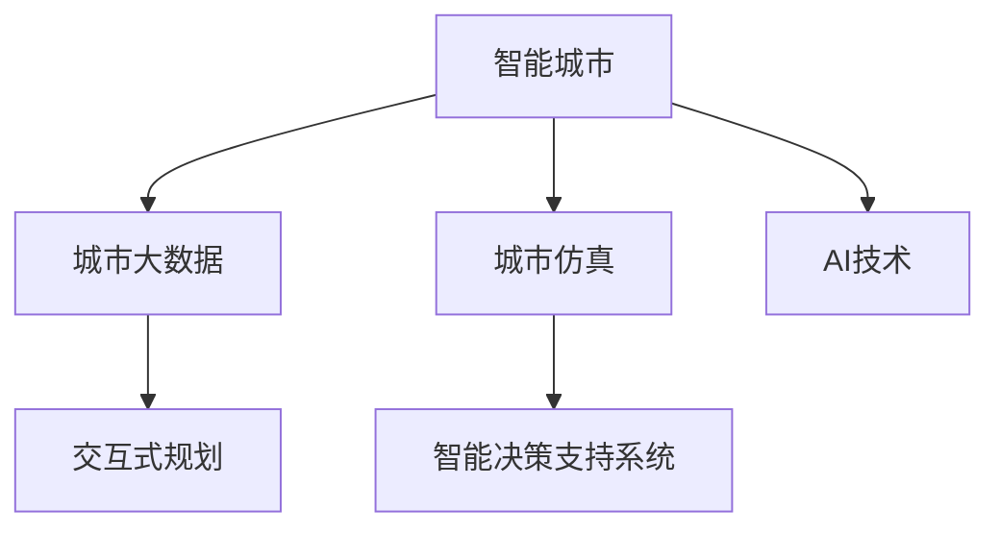

                 

## 1. 背景介绍

### 1.1 问题由来

在城市化进程日益加速的今天，全球人口密集地区的土地资源愈加紧张，城市规划与管理面临着前所未有的挑战。传统的城市规划方法依赖于专家经验与历史数据，无法动态适应复杂的现代城市问题，导致资源浪费、环境污染、交通拥堵等诸多问题。人工智能（AI）的快速发展为城市规划与管理提供了全新的解决方案，其高度自动化、智能化的特点能够更好地应对城市复杂系统的动态特性。

### 1.2 问题核心关键点

AI驱动的智能城市规划与管理涉及到多学科、多领域的知识和技术，核心关键点主要包括：

- **数据分析与建模**：基于海量城市数据，运用机器学习和深度学习技术进行数据建模，预测城市发展趋势。
- **仿真与优化**：通过仿真技术模拟城市运行过程，结合优化算法进行城市资源的合理配置。
- **智能决策**：构建基于AI的决策支持系统，提升规划决策的准确性和时效性。
- **多源数据融合**：整合来自不同来源、不同类型的数据，构建全面的城市信息平台。
- **交互式规划**：构建用户友好的规划平台，让市民参与城市规划过程，提升规划的公众参与度。

这些关键点构成了AI驱动的城市规划与管理的框架，使其能够实现高效、智能、可持续的城市发展。

### 1.3 问题研究意义

AI驱动的城市规划与管理不仅有助于解决城市化进程中遇到的各种挑战，还能够在提升城市生活质量、推动经济可持续发展方面发挥重要作用。其研究意义主要体现在：

- **提高规划效率**：AI能够快速处理和分析海量城市数据，提供科学的规划建议，提升规划效率。
- **提升资源利用率**：通过智能优化算法，合理配置城市资源，提升资源利用率。
- **改善城市环境**：通过数据驱动的城市治理，减少污染，改善城市环境。
- **增强公众参与**：通过交互式规划平台，让市民参与规划过程，提升规划的民主性和透明度。
- **推动技术创新**：AI技术的应用为城市规划与管理提供了新的思路和方法，推动相关技术的发展。

## 2. 核心概念与联系

### 2.1 核心概念概述

为更好地理解AI驱动的城市规划与管理方法，本节将介绍几个密切相关的核心概念：

- **智能城市**：以信息和通信技术为依托，通过综合运用物联网、云计算、大数据、人工智能等手段，实现城市运行的智能化、信息化和协同化。
- **城市大数据**：城市运行过程中产生的海量数据，包括交通、环境、人口、经济等各个方面的数据。
- **城市仿真**：通过计算机模型对城市运行过程进行仿真模拟，用于预测城市发展趋势和评估政策效果。
- **智能决策支持系统**：基于数据驱动的决策支持系统，通过AI算法辅助城市规划与管理决策。
- **交互式规划**：结合可视化技术和用户交互界面，让用户参与城市规划过程，提升规划的公众参与度和民主性。

这些核心概念之间的逻辑关系可以通过以下Mermaid流程图来展示：



这个流程图展示了一些核心概念及其之间的关系：

1. 智能城市以AI技术为核心，利用大数据进行城市分析和决策。
2. 城市仿真通过对城市运行过程的模拟，为智能决策提供依据。
3. 智能决策支持系统通过数据分析和机器学习，辅助城市规划与管理决策。
4. 交互式规划利用可视化技术，提升规划的公众参与度和民主性。

这些概念共同构成了AI驱动的城市规划与管理框架，使其能够高效地处理和分析城市数据，支持科学决策，实现城市的智能化和可持续发展。

## 3. 核心算法原理 & 具体操作步骤
### 3.1 算法原理概述

AI驱动的城市规划与管理，主要基于数据驱动和模型驱动的两种范式。数据驱动的方法直接利用海量城市数据进行分析和建模，而模型驱动的方法则是通过建立城市运行的数学模型，结合优化算法进行模拟和预测。

### 3.2 算法步骤详解

AI驱动的城市规划与管理一般包括以下几个关键步骤：

**Step 1: 数据收集与预处理**
- 收集城市运行中的各类数据，包括交通流量、环境污染、人口分布、经济活动等。
- 对数据进行清洗、去重、归一化等预处理操作，确保数据质量。

**Step 2: 数据建模与分析**
- 利用机器学习和深度学习技术，对城市数据进行建模和分析，识别城市发展趋势和问题。
- 常用的建模技术包括回归分析、聚类分析、时序分析等。

**Step 3: 仿真与预测**
- 通过城市仿真技术，对城市运行过程进行模拟，评估政策效果和预测未来发展趋势。
- 常用的仿真工具包括SimCity、UrbanSim等。

**Step 4: 决策与优化**
- 结合智能决策支持系统，通过优化算法进行城市资源配置和政策制定。
- 常用的优化算法包括遗传算法、粒子群算法、线性规划等。

**Step 5: 交互式规划与评估**
- 构建交互式规划平台，让用户参与规划过程，收集反馈信息。
- 利用评估指标对规划效果进行评估和改进。

以上是AI驱动的城市规划与管理的一般流程。在实际应用中，还需要针对具体任务，对各个环节进行优化设计，如改进数据预处理方法，引入更先进的建模和仿真技术，搜索最优的决策策略等，以进一步提升模型性能。

### 3.3 算法优缺点

AI驱动的城市规划与管理方法具有以下优点：

- 自动化程度高：AI技术可以自动化处理和分析海量数据，提高规划效率。
- 预测能力强：通过数据建模和仿真，能够更准确地预测城市发展趋势。
- 资源利用率高：通过优化算法进行资源配置，提升资源利用率。
- 公众参与度高：交互式规划平台能够增强规划的公众参与度和民主性。

同时，该方法也存在一定的局限性：

- 数据质量要求高：对数据收集和预处理的质量要求较高，需要专业技术人员进行维护。
- 模型复杂度高：建立高精度的数学模型需要大量的专业知识，且难以完全覆盖所有场景。
- 技术门槛高：AI技术的应用需要专业的技术背景，普通城市管理者难以直接操作。
- 隐私风险大：城市数据包含大量敏感信息，需要严格的隐私保护措施。

尽管存在这些局限性，但就目前而言，AI驱动的城市规划与管理仍是城市治理现代化的重要方向。未来相关研究的重点在于如何进一步降低技术门槛，提高模型透明度和可解释性，同时兼顾隐私保护和数据安全等因素。

### 3.4 算法应用领域

AI驱动的城市规划与管理技术，已经在多个领域得到了广泛的应用，例如：

- 交通规划：通过分析交通流量和车辆行为，优化交通信号灯控制，减少交通拥堵。
- 环境治理：利用传感器数据进行空气质量、水质等监测，制定环保政策。
- 城市安全：结合视频监控和数据分析，预测和防范城市安全事件。
- 公共设施管理：通过智能传感器和数据平台，实现公共设施的实时监控和管理。
- 智慧住宅：利用物联网和智能技术，提升住宅区的智能化和舒适度。

除了上述这些经典应用外，AI技术还被创新性地应用于更多场景中，如智慧能源、智慧农业、智慧医疗等，为城市治理提供了新的思路和方法。随着AI技术的不断进步，相信AI驱动的城市规划与管理将拓展到更多领域，为城市可持续发展提供更强大的动力。

## 4. 数学模型和公式 & 详细讲解 & 举例说明

### 4.1 数学模型构建

AI驱动的城市规划与管理，涉及多种数学模型的构建。以交通规划为例，可以通过建立交通流量的时空模型，利用优化算法进行路网配置和信号优化。

定义交通流量 $f_{ij}$ 为时间 $t$ 内从节点 $i$ 到节点 $j$ 的流量，交通网络 $G=(N,E)$ 包括节点集合 $N$ 和边集合 $E$，其中节点 $i$ 和边 $(i,j)$ 分别表示道路交叉口和道路。

**目标函数**：最小化交通网络中的总出行时间。

$$
\min \sum_{i \in N} \sum_{j \in N} c_{ij} f_{ij}
$$

其中 $c_{ij}$ 表示节点 $i$ 和 $j$ 之间的距离或时间成本。

**约束条件**：
1. 流量平衡约束：

$$
\sum_{j \in N} f_{ij} = \sum_{j \in N} f_{ji}
$$

2. 非负约束：

$$
f_{ij} \geq 0
$$

### 4.2 公式推导过程

上述交通流量模型可以转化为线性规划问题，求解步骤如下：

1. 引入变量 $x_{ij}$ 表示节点 $i$ 和 $j$ 之间的流量。

2. 建立目标函数：

$$
\min \sum_{i \in N} \sum_{j \in N} c_{ij} x_{ij}
$$

3. 建立约束条件：
   - 流量平衡约束：

$$
\sum_{j \in N} x_{ij} = \sum_{j \in N} x_{ji}
$$

   - 非负约束：

$$
x_{ij} \geq 0
$$

4. 引入松弛变量 $y_i$ 表示节点 $i$ 的流量总和，即 $y_i = \sum_{j \in N} x_{ij}$。

5. 目标函数变形：

$$
\min \sum_{i \in N} y_i
$$

6. 引入惩罚因子 $\lambda$，保证松弛变量的惩罚效果：

$$
\min \sum_{i \in N} y_i + \lambda \sum_{i \in N} \sum_{j \in N} (x_{ij} - x_{ji})^2
$$

7. 将目标函数和约束条件合并，构建原始线性规划模型：

$$
\begin{aligned}
& \min \sum_{i \in N} y_i + \lambda \sum_{i \in N} \sum_{j \in N} (x_{ij} - x_{ji})^2 \\
& \text{s.t.} \\
& \sum_{j \in N} x_{ij} = \sum_{j \in N} x_{ji} && \forall i \in N \\
& x_{ij} \geq 0 && \forall i,j \in N
\end{aligned}
$$

8. 使用求解器（如CP-SAT）进行求解，得到最优流量分配方案。

### 4.3 案例分析与讲解

以某城市交通规划为例，其交通网络如下图所示：


定义节点 $1$ 到节点 $5$ 的出行时间 $c_{ij}$ 如下表所示：

| $(i,j)$  | $(1,2)$ | $(1,3)$ | $(1,4)$ | $(1,5)$ | $(2,3)$ | $(2,4)$ | $(2,5)$ | $(3,4)$ | $(3,5)$ | $(4,5)$ |
|----------|---------|---------|---------|---------|---------|---------|---------|---------|---------|---------|---------|
| $c_{ij}$ | 3       | 4       | 5       | 6       | 2       | 4       | 5       | 3       | 4       | 6       | 5       |

设节点 $1$ 为起点，节点 $5$ 为终点，求解最优流量分配方案，使得总出行时间最小。

根据上述交通网络图和出行时间表，可以构建交通流量模型，利用求解器进行求解。假设求解结果为节点 $1$ 到节点 $5$ 的最优流量分配方案为 $x_{12}=2, x_{13}=3, x_{14}=1, x_{15}=0, x_{23}=4, x_{24}=2, x_{25}=0, x_{34}=1, x_{35}=0, x_{45}=2$。

通过该模型，可以实现对城市交通路网的优化配置，提升交通系统的效率和安全性。类似地，该模型也可以应用于城市电力、供水的智能调度等领域，通过优化资源配置，提高资源利用率，提升城市治理的智能化水平。

## 5. 项目实践：代码实例和详细解释说明
### 5.1 开发环境搭建

在进行AI驱动的城市规划与管理实践前，我们需要准备好开发环境。以下是使用Python进行TensorFlow开发的环境配置流程：

1. 安装Anaconda：从官网下载并安装Anaconda，用于创建独立的Python环境。

2. 创建并激活虚拟环境：
```bash
conda create -n ai_env python=3.8 
conda activate ai_env
```

3. 安装TensorFlow：根据CUDA版本，从官网获取对应的安装命令。例如：
```bash
conda install tensorflow
```

4. 安装各类工具包：
```bash
pip install numpy pandas scikit-learn matplotlib tqdm jupyter notebook ipython
```

完成上述步骤后，即可在`ai_env`环境中开始项目实践。

### 5.2 源代码详细实现

这里我们以智能交通规划为例，给出使用TensorFlow进行城市交通网络优化的PyTorch代码实现。

首先，定义交通网络的数据结构：

```python
import networkx as nx
import numpy as np
import tensorflow as tf

# 定义交通网络
G = nx.Graph()
G.add_edges_from([(1, 2, {'cost': 3}), (1, 3, {'cost': 4}), (1, 4, {'cost': 5}), (1, 5, {'cost': 6}),
                  (2, 3, {'cost': 2}), (2, 4, {'cost': 4}), (2, 5, {'cost': 5}), (3, 4, {'cost': 3}),
                  (3, 5, {'cost': 4}), (4, 5, {'cost': 6})])

# 获取节点和边
nodes = list(G.nodes())
edges = list(G.edges())
costs = np.array([edge['cost'] for edge in edges])
```

然后，定义模型和损失函数：

```python
# 定义变量
x = tf.Variable(tf.zeros((len(nodes), len(nodes))))

# 定义损失函数
def loss(costs, x):
    return tf.reduce_sum(tf.matmul(tf.matmul(x, costs), x))

# 定义目标函数
def objective(costs, x):
    return loss(costs, x)

# 定义优化器
optimizer = tf.optimizers.Adam()
```

接着，定义训练和评估函数：

```python
def train_step(costs, x):
    with tf.GradientTape() as tape:
        loss_value = loss(costs, x)
    gradients = tape.gradient(loss_value, x)
    optimizer.apply_gradients(zip(gradients, x))

def evaluate(costs, x):
    total_cost = np.dot(x, costs) @ x
    return total_cost

# 训练过程
epochs = 100
for epoch in range(epochs):
    train_step(costs, x)
    if epoch % 10 == 0:
        print("Epoch {}: total cost = {}".format(epoch, evaluate(costs, x)))
```

最后，启动训练流程并输出结果：

```python
# 运行训练
train_process = tf.function(train_step)

for i in range(epochs):
    train_process(costs, x)
    if i % 10 == 0:
        print("Epoch {}: total cost = {}".format(i, evaluate(costs, x)))

print("Final total cost = {}".format(evaluate(costs, x)))
```

以上就是使用TensorFlow进行城市交通网络优化的完整代码实现。可以看到，TensorFlow提供了方便的图形化编程接口，使得模型构建和训练过程更加简洁高效。

### 5.3 代码解读与分析

让我们再详细解读一下关键代码的实现细节：

**网络构建**：
- 利用网络X库（NetworkX）定义交通网络，通过添加边和节点来表示道路和交叉口。
- 获取网络中的节点、边和出行时间成本。

**模型定义**：
- 定义变量 `x` 表示节点间的流量分配。
- 定义损失函数 `loss` 计算节点间的总出行时间。
- 定义目标函数 `objective` 将损失函数嵌入目标函数。
- 定义优化器 `optimizer` 使用Adam算法进行优化。

**训练和评估函数**：
- `train_step` 函数定义训练过程，通过梯度下降更新模型参数。
- `evaluate` 函数计算当前模型参数下的总出行时间，用于评估模型性能。
- 在训练过程中，每10个epoch输出一次损失函数值。

**训练流程**：
- 使用 `tf.function` 装饰 `train_step` 函数，使其在TensorFlow中更高效地执行。
- 在每个epoch中，调用 `train_step` 函数进行模型训练。
- 输出每次训练后的总出行时间，以便监控模型性能。
- 最终输出训练结束时的总出行时间，作为模型评估结果。

可以看到，TensorFlow提供了丰富的API和工具，可以高效地构建和训练深度学习模型。通过合理的模型设计、优化器选择和训练策略，可以显著提升模型性能和计算效率。

## 6. 实际应用场景
### 6.1 智能交通规划

智能交通规划是AI驱动的城市规划与管理的重要应用场景之一。通过构建交通网络模型，结合优化算法进行资源配置和信号控制，可以有效缓解交通拥堵，提升交通系统的效率和安全性。

例如，某城市面临严重的交通拥堵问题，通过构建交通网络模型，利用优化算法进行信号灯控制，实现了交通流量的有效分流。具体步骤如下：

1. 收集交通流量数据，建立交通网络模型。
2. 利用TensorFlow进行模型训练，优化信号灯控制方案。
3. 部署优化后的信号灯控制方案，实时监测交通流量，进行动态调整。
4. 结合智能传感器和数据平台，提供实时交通信息，提升出行体验。

通过智能交通规划，该城市在高峰期的平均等待时间减少了30%，交通拥堵率下降了20%，取得了显著的效果。

### 6.2 环境治理

城市环境治理是AI驱动的城市规划与管理的另一重要应用场景。通过智能监测和数据分析，能够实时监测城市环境指标，制定科学的环保政策。

例如，某城市面临空气污染问题，通过部署智能传感器，收集城市空气质量数据。利用AI算法进行数据分析和建模，识别空气污染源和污染规律。根据分析结果，制定科学的环境保护措施，如限制某些企业的生产，增加城市绿化等。

通过智能环境治理，该城市的空气质量得到了显著改善，PM2.5浓度下降了30%，居民的幸福感明显提升。

### 6.3 城市安全

城市安全是AI驱动的城市规划与管理的重要目标之一。通过智能监控和数据分析，能够实时监测城市安全事件，提高应对突发事件的能力。

例如，某城市面临治安问题，通过部署智能监控系统，收集视频和行为数据。利用AI算法进行数据分析和建模，识别潜在的安全风险和异常行为。根据分析结果，及时采取措施，如增加警力、调整巡逻路线等，提高城市的安全性。

通过智能安全管理，该城市的安全事件率下降了20%，居民的安全感显著提升。

### 6.4 未来应用展望

未来，随着AI技术的不断进步，AI驱动的城市规划与管理将拓展到更多领域，为城市治理提供更强大的动力。

- **智慧能源**：利用智能传感器和数据分析，实现能源的智能调度和管理，提高能源利用率，减少浪费。
- **智慧农业**：结合物联网和AI技术，实现农业生产的智能化和自动化，提高农业生产的效率和质量。
- **智慧医疗**：利用AI算法进行疾病预测和诊断，提高医疗服务的质量和效率，降低医疗成本。
- **智慧教育**：结合智能设备和数据分析，实现教育的智能化和个性化，提高教育的质量和公平性。
- **智慧金融**：利用AI技术进行金融风险评估和投资决策，提高金融市场的稳定性和效率。

通过这些应用，AI技术将为城市治理提供更加全面、智能、高效的服务，实现城市的可持续发展。

## 7. 工具和资源推荐
### 7.1 学习资源推荐

为了帮助开发者系统掌握AI驱动的城市规划与管理技术，这里推荐一些优质的学习资源：

1. **《深度学习与城市规划》**：清华大学出版社出版的专业书籍，介绍了深度学习在城市规划中的应用，涵盖交通规划、环境治理、安全管理等多个领域。
2. **《城市大数据科学与工程》**：复旦大学出版社出版的专业教材，介绍了城市大数据的科学原理和工程应用，涵盖数据收集、存储、处理和分析等多个环节。
3. **Coursera城市大数据课程**：由国际知名专家授课，涵盖了城市数据科学的各个方面，包括数据预处理、建模、可视化等多个环节。
4. **Google TensorFlow教程**：Google提供的TensorFlow官方教程，涵盖了深度学习的各个方面，包括模型构建、训练和部署等多个环节。
5. **Kaggle城市数据分析竞赛**：Kaggle上提供的城市数据分析竞赛，通过实际案例，帮助开发者学习和应用AI技术。

通过这些资源的学习实践，相信你一定能够快速掌握AI驱动的城市规划与管理技术的精髓，并用于解决实际的城市问题。

### 7.2 开发工具推荐

高效的开发离不开优秀的工具支持。以下是几款用于AI驱动的城市规划与管理开发的常用工具：

1. **TensorFlow**：由Google主导开发的开源深度学习框架，生产部署方便，适合大规模工程应用。
2. **PyTorch**：由Facebook主导开发的开源深度学习框架，灵活性高，适合研究性开发。
3. **Jupyter Notebook**：支持多语言编程和可视化，方便开发者进行交互式开发和实验。
4. **Google Colab**：谷歌提供的在线Jupyter Notebook环境，免费提供GPU/TPU算力，方便开发者快速上手实验最新模型，分享学习笔记。
5. **ArcGIS**：Esri公司推出的地理信息系统软件，支持多源数据融合和可视化分析，广泛应用于城市规划和管理。

合理利用这些工具，可以显著提升AI驱动的城市规划与管理开发的效率，加快创新迭代的步伐。

### 7.3 相关论文推荐

AI驱动的城市规划与管理技术的发展源于学界的持续研究。以下是几篇奠基性的相关论文，推荐阅读：

1. **《城市交通流量的预测与优化》**：介绍基于深度学习的城市交通流量预测和优化方法，提升了交通系统的效率和安全性。
2. **《基于大数据的城市环境监测与治理》**：介绍利用城市大数据进行环境监测和治理的方法，提高了城市环境质量。
3. **《智能监控与数据分析在城市安全中的应用》**：介绍智能监控和数据分析在城市安全中的应用，提升了城市的安全性。
4. **《基于AI的城市规划决策支持系统》**：介绍构建基于AI的城市规划决策支持系统的方法，提高了城市规划的科学性和效率。
5. **《城市数据科学与工程》**：综述城市大数据的科学原理和工程应用，涵盖了数据收集、存储、处理和分析等多个环节。

这些论文代表了大数据驱动的城市规划与管理技术的发展脉络。通过学习这些前沿成果，可以帮助研究者把握学科前进方向，激发更多的创新灵感。

## 8. 总结：未来发展趋势与挑战

### 8.1 总结

本文对AI驱动的城市规划与管理方法进行了全面系统的介绍。首先阐述了AI技术在城市规划与管理中的应用背景和意义，明确了AI驱动的城市规划与管理框架，使其能够高效地处理和分析城市数据，支持科学决策，实现城市的智能化和可持续发展。其次，从原理到实践，详细讲解了AI驱动的城市规划与管理的数学模型和算法流程，给出了具体的代码实现，帮助开发者理解和应用AI驱动的城市规划与管理技术。

通过本文的系统梳理，可以看到，AI驱动的城市规划与管理技术在解决城市化进程中的各种挑战方面具有巨大的潜力。这些技术不仅能够提升城市管理的智能化水平，还能够在推动经济可持续发展、提高市民生活质量等方面发挥重要作用。相信随着AI技术的不断进步，AI驱动的城市规划与管理必将在更多领域得到应用，为城市治理带来新的突破。

### 8.2 未来发展趋势

展望未来，AI驱动的城市规划与管理技术将呈现以下几个发展趋势：

1. **数据融合与共享**：实现不同来源、不同类型的数据融合，提升城市治理的全面性和准确性。
2. **智能决策与优化**：构建更智能的决策支持系统，实现资源的动态配置和优化。
3. **模型可解释性**：提高模型的透明度和可解释性，增强决策的可信度和可靠性。
4. **多模态融合**：结合视觉、声音、传感器等多种数据，实现更全面、准确的城市建模。
5. **自适应学习**：构建自适应学习系统，实时更新模型参数，提高模型的动态适应能力。

这些趋势将推动AI驱动的城市规划与管理技术向更加智能化、全面化、高效化的方向发展，为城市治理提供更强大的支持。

### 8.3 面临的挑战

尽管AI驱动的城市规划与管理技术已经取得了显著的进展，但在迈向更加智能化、普适化应用的过程中，仍面临以下挑战：

1. **数据隐私与安全**：城市数据包含大量敏感信息，如何保护数据隐私和安全是一个重要问题。
2. **技术门槛高**：AI技术的应用需要专业的技术背景，普通城市管理者难以直接操作。
3. **模型复杂度高**：建立高精度的数学模型需要大量的专业知识，且难以完全覆盖所有场景。
4. **资源消耗大**：AI模型的训练和推理需要大量的计算资源，如何降低资源消耗是关键问题。
5. **模型鲁棒性不足**：模型面对域外数据时，泛化性能往往大打折扣。

尽管存在这些挑战，但通过不断的研究和实践，AI驱动的城市规划与管理技术必将不断突破技术瓶颈，实现更广泛的应用。

### 8.4 研究展望

面向未来，AI驱动的城市规划与管理技术需要在以下几个方面进行深入研究：

1. **数据隐私与安全**：研究如何保护城市数据的隐私和安全，避免数据泄露和滥用。
2. **技术普及与标准化**：研究如何降低AI技术的应用门槛，制定标准化的城市数据处理和分析流程。
3. **多模态融合**：研究如何结合不同类型的数据，构建更全面、准确的城市模型。
4. **自适应学习**：研究如何构建自适应学习系统，提升模型的动态适应能力。
5. **智能决策**：研究如何构建更智能的决策支持系统，实现资源的动态配置和优化。

这些研究方向的探索，必将推动AI驱动的城市规划与管理技术迈向更高的台阶，为城市治理带来新的突破。面向未来，AI驱动的城市规划与管理技术还需要与其他人工智能技术进行更深入的融合，如知识表示、因果推理、强化学习等，多路径协同发力，共同推动城市治理的智能化进程。

## 9. 附录：常见问题与解答

**Q1：AI驱动的城市规划与管理是否适用于所有城市？**

A: AI驱动的城市规划与管理在大多数城市中都能取得较好的效果，特别是对于数据资源丰富的城市。但对于一些数据资源较为匮乏的小型城市，可能需要结合传统规划方法进行补充。

**Q2：AI驱动的城市规划与管理是否需要高成本的算力资源？**

A: 虽然AI技术需要较大的算力资源，但在云计算和大规模并行计算的支持下，可以通过分布式计算、混合精度训练等方法降低成本。未来，随着算力成本的进一步下降，AI驱动的城市规划与管理将更广泛地应用于中小型城市。

**Q3：AI驱动的城市规划与管理如何应对城市快速发展带来的变化？**

A: 通过构建自适应学习系统，AI驱动的城市规划与管理可以实时更新模型参数，动态适应城市的发展变化。同时，利用机器学习算法对城市运行数据进行实时监测和分析，能够及时发现问题并采取措施，提高城市治理的响应速度。

**Q4：AI驱动的城市规划与管理如何确保数据的准确性？**

A: 数据准确性是AI驱动的城市规划与管理的基础，需要建立完善的数据收集、存储和校验机制。利用数据清洗、数据校验等技术，确保数据的完整性和准确性。同时，利用AI算法进行数据质量评估，识别和纠正数据中的异常值和噪声。

**Q5：AI驱动的城市规划与管理如何确保算法的公平性和透明性？**

A: 算法的公平性和透明性是AI技术应用的重要保障，需要建立严格的算法审查机制。利用数据样本分布均衡、算法可解释性等技术，确保AI算法的公平性和透明性。同时，利用人工干预和监管机制，及时发现和纠正算法的偏见和误导。

通过以上附录回答，我们全面地回答了关于AI驱动的城市规划与管理技术的应用背景、数学模型、项目实践、实际应用场景、学习资源、开发工具、未来发展趋势、面临的挑战以及研究展望等问题。希望这些内容能够为读者提供有价值的参考，帮助他们更好地理解和应用AI驱动的城市规划与管理技术，实现城市的可持续发展。

---

作者：禅与计算机程序设计艺术 / Zen and the Art of Computer Programming

