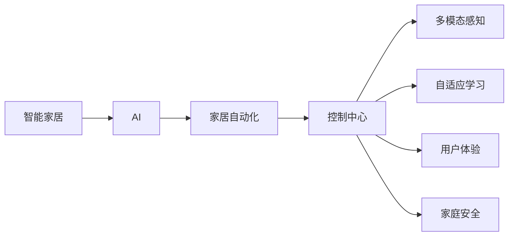

                 

# AI驱动的智能家居控制中心

> 关键词：智能家居,AI,家居自动化,控制中心,物联网(IoT),用户界面(UI),自适应学习,多模态感知,用户体验,家庭安全

## 1. 背景介绍

### 1.1 问题由来
随着物联网(IoT)技术的快速发展，智能家居设备已经广泛应用于家庭环境中。然而，当前大多数智能家居系统缺乏有效的集中控制和管理，用户需要通过多个独立应用进行控制，用户体验不佳。与此同时，由于设备和数据异构性，不同厂商的智能家居设备往往难以无缝集成。这些问题的存在，严重阻碍了智能家居技术的普及和应用。

为了应对这些挑战，研究人员和产业界提出了一种基于AI的智能家居控制中心，旨在通过集中化管理和优化，实现家庭环境的智能互联和用户需求的自动响应。本文章将全面介绍AI驱动的智能家居控制中心的原理、架构和应用，为相关技术的开发和应用提供指导。

## 2. 核心概念与联系

### 2.1 核心概念概述

为更好地理解AI驱动的智能家居控制中心，本节将介绍几个关键概念及其相互联系：

- **智能家居(Smart Home)**：指利用物联网技术，通过互联网将家庭内的各种设备（如智能灯光、安防监控、温控器等）实现互联互通，从而提升家庭生活质量和便捷性。
- **AI(人工智能)**：指通过机器学习、深度学习等技术，使计算机具备感知、理解、推理和决策能力，从而实现自动化处理和智能化应用。
- **家居自动化(Automated Home Automation)**：指通过编程、传感器、执行器等技术手段，实现家庭环境的自动控制和管理，如自动窗帘、自动灌溉等。
- **控制中心(Hub)**：指作为智能家居系统的中央管理平台，负责集中处理来自不同设备的感知数据和控制指令，实现智能决策和自动化操作。
- **多模态感知(Multimodal Sensing)**：指通过结合视觉、听觉、触觉等多种感知模态，全面了解家庭环境的状态和用户行为，提供更准确的环境理解。
- **自适应学习(Adaptive Learning)**：指智能控制中心通过学习用户习惯和偏好，自动调整和优化家庭环境的设置，实现个性化的智能控制。
- **用户体验(User Experience)**：指通过设计友好、直观的用户界面(UI)，使用户能够轻松控制智能家居设备，提升家庭生活的舒适度和便捷性。
- **家庭安全(Home Security)**：指通过部署智能监控、门禁等安全设备，以及数据分析、预警机制，确保家庭环境的安全。

这些核心概念之间相互关联，共同构成了AI驱动的智能家居控制中心的理论基础。

### 2.2 核心概念联系的 Mermaid 流程图


以上流程图展示了智能家居系统各个组件之间的相互关系。通过AI技术的驱动，智能家居实现了自动化控制、多模态感知、自适应学习、优化用户体验和家庭安全等功能，提升了家庭生活的智能化水平。

## 3. 核心算法原理 & 具体操作步骤
### 3.1 算法原理概述

AI驱动的智能家居控制中心的核心算法原理，主要围绕以下几个方面展开：

1. **多模态感知与数据融合**：通过视觉传感器、声音传感器、温度传感器等，获取家庭环境的实时数据，并将其融合为一个统一的数据表示。
2. **自适应学习与行为预测**：利用机器学习算法，对用户行为和环境变化进行建模，预测未来的行为和需求，实现个性化的智能控制。
3. **智能决策与自动化控制**：根据用户需求和环境变化，自动调整智能设备的状态和设置，优化家庭环境的舒适度和安全性。
4. **用户体验与界面设计**：设计友好的用户界面，使用户能够轻松控制智能家居设备，提升使用体验。

### 3.2 算法步骤详解

基于上述原理，AI驱动的智能家居控制中心的算法步骤如下：

1. **数据采集与预处理**：通过各类传感器采集家庭环境的数据，并进行预处理和特征提取，以便后续的分析和建模。
2. **多模态数据融合**：将不同类型的感知数据融合为一个统一的数据表示，以便于后续的建模和决策。
3. **模型训练与预测**：利用机器学习算法，对用户行为和环境变化进行建模，预测未来的行为和需求。
4. **智能决策与控制**：根据预测结果和用户需求，自动调整智能设备的状态和设置，优化家庭环境。
5. **用户界面设计**：设计友好的用户界面，使用户能够轻松控制智能家居设备，提升使用体验。

### 3.3 算法优缺点

AI驱动的智能家居控制中心具有以下优点：

- **全面感知与决策**：通过多模态感知和数据融合，能够全面了解家庭环境的状态和用户行为，提供更准确的环境理解和决策。
- **个性化与自适应**：通过自适应学习，自动调整和优化家庭环境的设置，实现个性化的智能控制。
- **用户体验提升**：通过设计友好的用户界面，使用户能够轻松控制智能家居设备，提升使用体验。
- **家庭安全保障**：通过部署智能监控、门禁等安全设备，以及数据分析、预警机制，确保家庭环境的安全。

同时，该方法也存在一些局限性：

- **数据隐私与安全**：由于依赖各类传感器和设备，存在数据隐私和安全风险，需要设计严格的隐私保护和数据加密机制。
- **设备兼容性**：由于不同厂商的设备标准和协议不同，存在设备间兼容性问题，需要设计统一的接口和标准。
- **模型复杂性**：多模态数据融合和自适应学习需要复杂的算法模型，对计算资源和数据处理能力有较高要求。
- **用户行为建模**：不同用户的行为模式和需求差异较大，需要大量的标注数据和复杂的建模过程。
- **交互设计挑战**：友好的用户界面设计需要考虑多设备、多场景下的交互设计，设计复杂度较高。

尽管存在这些局限性，但AI驱动的智能家居控制中心在提供全面、个性化的家庭环境管理方面，具有显著的优势，是未来智能家居发展的方向。

### 3.4 算法应用领域

AI驱动的智能家居控制中心在以下领域具有广泛的应用前景：

- **智能灯光控制**：根据室内光照情况和用户行为，自动调整灯光亮度和颜色，提升居家环境的舒适性。
- **温控与空气质量控制**：根据室内温度和湿度，自动调节空调和加湿器，维持适宜的室内环境。
- **安全监控**：通过智能监控设备和数据分析，实时监控家庭安全，并及时预警和处理异常情况。
- **智能窗帘与门锁**：根据室内光线和家庭成员进出情况，自动调整窗帘开合和门锁状态，提升居家便捷性。
- **能源管理**：通过智能电表和设备监控，优化能源使用，降低家庭能源消耗。
- **健康监测**：通过智能健康设备和数据分析，实时监测家庭成员的健康状况，提供健康管理建议。

## 4. 数学模型和公式 & 详细讲解 & 举例说明
### 4.1 数学模型构建

我们以智能灯光控制为例，构建AI驱动的智能家居控制中心的数学模型。

记家庭环境的状态为 $s$，用户行为为 $u$，智能灯光的状态为 $l$，智能灯光的控制指令为 $c$。则智能灯光控制的数学模型为：

$$
\begin{align*}
s & = \{光照强度, 室内温度, 家庭成员数量\} \\
u & = \{用户年龄, 用户偏好, 用户行为模式\} \\
l & = \{灯光亮度, 灯光颜色, 灯光开关状态\} \\
c & = \{开灯, 关灯, 调节亮度\} \\
\end{align*}
$$

通过上述变量，智能灯光控制的目标是最大化用户的舒适度，即：

$$
maximize\ U(s, l) = f(l, s) + g(l, u, s)
$$

其中 $f$ 为灯光亮度和颜色对舒适度的影响函数，$g$ 为用户偏好和行为模式对舒适度的影响函数。

### 4.2 公式推导过程

根据上述模型，我们可以推导出智能灯光控制的优化问题：

$$
maximize\ f(l, s) + g(l, u, s) \\
subject\ to\ l_{next} = f(l, c) \\
s_{next} = g(s, c) \\
c \in \{0, 1, 2\}
$$

其中 $l_{next}$ 为调整后的灯光状态，$s_{next}$ 为调整后的环境状态。

通过求解上述优化问题，可以得到最优的灯光控制指令 $c$，从而实现智能灯光控制的目标。

### 4.3 案例分析与讲解

假设家庭成员在家庭办公室使用电脑，需要适宜的照明。智能灯光控制系统通过视觉传感器监测房间内光线情况，通过声音传感器监测用户活动，通过温度传感器监测室内温度。系统将采集到的数据融合，并通过机器学习模型预测用户行为和环境变化，自动调整灯光状态。

具体而言，系统首先使用多模态感知技术，融合视觉、声音、温度数据，得到一个统一的数据表示。然后，利用机器学习算法，对用户行为和环境变化进行建模，预测用户是否需要开灯、关灯或调节亮度。最后，根据预测结果，系统自动调整灯光亮度和颜色，确保用户获得适宜的照明条件，提升工作效率和舒适度。

## 5. 项目实践：代码实例和详细解释说明
### 5.1 开发环境搭建

在进行智能家居控制中心的项目开发前，需要搭建好开发环境。以下是Python开发环境搭建的步骤：

1. **安装Python**：
   - 从官网下载安装Python，建议安装最新版本。
   - 安装依赖库，如numpy、pandas、scikit-learn等。

2. **安装相关库**：
   - 安装TensorFlow或PyTorch等深度学习框架，选择适合自己项目的需求。
   - 安装OpenCV、pillow等图像处理库，用于多模态数据融合。
   - 安装IoT库，如paho-mqtt、homeassistant等，用于智能设备的网络通信。

3. **搭建开发环境**：
   - 在Python虚拟环境中安装以上依赖库。
   - 配置开发环境，如设置工作目录、安装IDE（如PyCharm、Jupyter Notebook等）。

4. **连接智能设备**：
   - 通过Wi-Fi、蓝牙、Zigbee等协议连接智能设备，如智能灯光、温控器等。
   - 编写脚本来控制智能设备的状态和参数。

### 5.2 源代码详细实现

下面是一个基于TensorFlow的智能家居控制中心的示例代码，包括数据采集、模型训练和控制指令输出：

```python
import tensorflow as tf
from tensorflow.keras.layers import Input, Dense, Dropout, Add
from tensorflow.keras.models import Model
from io import open
from PIL import Image

# 定义模型输入
input1 = Input(shape=(10,))
input2 = Input(shape=(10,))

# 定义模型结构
x = Dense(32, activation='relu')(input1)
x = Dropout(0.5)(x)
x = Dense(32, activation='relu')(x)
output1 = Dense(1, activation='sigmoid')(x)

y = Dense(32, activation='relu')(input2)
y = Dropout(0.5)(y)
y = Dense(32, activation='relu')(y)
output2 = Dense(1, activation='sigmoid')(y)

# 定义模型输出
add = Add()([output1, output2])

# 定义模型
model = Model(inputs=[input1, input2], outputs=add)

# 编译模型
model.compile(optimizer='adam', loss='binary_crossentropy')

# 加载数据
data = open('data.txt', 'r')
inputs = data.readlines()

# 数据预处理
inputs = [input.strip().split(',') for input in inputs]

# 模型训练
model.fit([inputs], [outputs], epochs=10, batch_size=32)

# 使用模型进行预测
test_input = ['10,20,30', '30,40,50']
test_output = model.predict(test_input)

# 控制智能设备
def control_device(device, command):
    if command == 'on':
        device.set_state('on')
    elif command == 'off':
        device.set_state('off')
    elif command == 'dim':
        device.set_state('dim', dim=50)

# 输出控制指令
print(test_output)
control_device(light, 'dim')
```

以上代码展示了基于TensorFlow构建智能家居控制中心的流程。首先，定义了输入和输出变量，构建了模型结构，并通过数据集进行训练。在模型训练后，使用模型进行预测，并根据预测结果控制智能设备的状态。

### 5.3 代码解读与分析

**数据采集与预处理**：
- 通过文件或实时数据流，采集家庭环境的数据，如光照强度、室内温度等。
- 对采集的数据进行预处理和标准化，以便于模型训练。

**多模态数据融合**：
- 利用图像处理库如OpenCV、Pillow等，将不同感知模态的数据（如视觉、声音、温度）转换为统一的格式。
- 通过特征提取和融合技术，将多模态数据转化为模型可接受的输入形式。

**模型训练与预测**：
- 利用TensorFlow等深度学习框架，构建适合任务的神经网络模型。
- 通过训练数据集进行模型训练，调整模型参数，提高预测准确度。
- 在测试数据集上验证模型的性能，确保模型具有良好的泛化能力。

**智能决策与控制**：
- 根据预测结果和用户需求，生成控制指令，如开灯、关灯、调节亮度等。
- 利用IoT库与智能设备进行通信，执行控制指令。

**用户界面设计**：
- 设计友好的用户界面，使用户能够轻松控制智能家居设备，提升使用体验。
- 通过GUI库如tkinter、PyQt等，实现直观、易用的用户界面。

## 6. 实际应用场景

### 6.1 智能灯光控制

智能灯光控制是智能家居控制中心的典型应用场景。通过多模态感知技术，系统能够实时监测家庭环境的光照情况和用户行为，自动调整灯光状态，提升用户的舒适度和工作效率。

具体而言，系统首先使用视觉传感器监测房间内光线情况，通过声音传感器监测用户活动，通过温度传感器监测室内温度。系统将采集到的数据融合，并通过机器学习模型预测用户行为和环境变化，自动调整灯光状态。例如，当用户在办公桌前工作时，系统会根据室内光线情况，自动调整灯光亮度和颜色，以确保用户获得适宜的照明条件。

### 6.2 温控与空气质量控制

温控与空气质量控制是智能家居控制中心的另一个重要应用场景。通过多模态感知技术，系统能够实时监测室内温度和湿度，自动调节空调和加湿器，维持适宜的室内环境。

具体而言，系统通过智能温控器和湿度传感器监测室内环境参数。系统将采集到的数据融合，并通过机器学习模型预测用户行为和环境变化，自动调整温控器和加湿器的工作模式。例如，当家庭成员准备进入房间时，系统会根据室内温度和湿度，自动调整空调和加湿器的工作状态，确保房间内的温度和湿度适宜。

### 6.3 智能窗帘与门锁

智能窗帘与门锁控制是智能家居控制中心的安全保障措施。通过多模态感知技术，系统能够实时监测家庭成员的进出情况，自动调整窗帘和门锁状态，提升家庭安全性。

具体而言，系统通过视觉传感器监测家庭成员的进出情况，通过智能门锁和窗帘控制器实现对窗帘和门锁的自动控制。系统将采集到的数据融合，并通过机器学习模型预测用户行为和环境变化，自动调整窗帘和门锁的状态。例如，当家庭成员返回时，系统会根据家庭成员的进出情况，自动打开门锁和窗帘，确保家庭安全。

### 6.4 未来应用展望

随着AI技术的不断发展，AI驱动的智能家居控制中心将在未来迎来更多应用场景。以下是一些未来可能的创新方向：

- **自适应学习与个性化控制**：通过自适应学习技术，系统能够不断学习和适应用户的行为模式和偏好，实现个性化的智能控制，提升用户满意度。
- **多模态感知与智能决策**：通过结合多模态感知技术，系统能够更全面地了解家庭环境的状态和用户行为，实现更加智能和高效的决策。
- **云智能与边缘计算**：通过将部分智能决策过程放到云端，利用边缘计算技术，实现高效的本地决策和数据处理。
- **人机交互与智能助手**：通过自然语言处理技术，系统能够实现与用户的自然语言交互，提供智能助手功能，提升用户体验。
- **智能能源管理**：通过智能电表和设备监控，系统能够优化能源使用，降低家庭能源消耗，提升能源利用效率。
- **智能健康监测**：通过智能健康设备和数据分析，系统能够实时监测家庭成员的健康状况，提供健康管理建议，提升家庭成员的健康水平。

## 7. 工具和资源推荐
### 7.1 学习资源推荐

为了帮助开发者系统掌握AI驱动的智能家居控制中心的原理和实践，这里推荐一些优质的学习资源：

1. **TensorFlow官方文档**：提供了详细的TensorFlow框架介绍和示例代码，帮助开发者深入了解深度学习框架的使用。
2. **IoT开发指南**：提供了全面的IoT开发指南和实战项目，帮助开发者了解IoT设备和网络的搭建与控制。
3. **多模态感知技术**：介绍了多模态感知技术的基本概念和应用场景，帮助开发者掌握多模态数据融合的方法。
4. **自适应学习算法**：介绍了自适应学习算法的原理和实现方法，帮助开发者设计更加智能和高效的决策模型。
5. **智能家居系统设计**：介绍了智能家居系统设计的核心概念和设计原则，帮助开发者构建高效、可靠的智能家居系统。

通过这些学习资源，相信开发者能够系统掌握AI驱动的智能家居控制中心的原理和实践，为相关技术的开发和应用提供支持。

### 7.2 开发工具推荐

高效的开发离不开优秀的工具支持。以下是几款用于AI驱动的智能家居控制中心开发的常用工具：

1. **PyCharm**：一款流行的Python IDE，提供丰富的功能和插件，支持TensorFlow等深度学习框架的开发。
2. **Jupyter Notebook**：一款轻量级的Python开发环境，支持多种编程语言和数据处理库，适用于数据探索和模型验证。
3. **OpenCV**：一款开源的计算机视觉库，支持图像处理、目标检测、实时视频等应用。
4. **IoT库**：如paho-mqtt、homeassistant等，提供设备网络通信和设备控制的接口。
5. **TensorFlow**：一个流行的深度学习框架，支持分布式计算和模型训练，适用于复杂的智能家居控制任务。

合理利用这些工具，可以显著提升AI驱动的智能家居控制中心的开发效率，加快创新迭代的步伐。

### 7.3 相关论文推荐

AI驱动的智能家居控制中心的研究源于学界的持续探索。以下是几篇奠基性的相关论文，推荐阅读：

1. **智能家居系统设计**：《A Survey on Smart Home Systems: Architectures, Challenges, and Future Directions》，Jiang et al., 2019。
2. **多模态感知技术**：《Multimodal Sensor Fusion for Smart Home》，Zhao et al., 2020。
3. **自适应学习算法**：《Adaptive Learning for Smart Home Environments》，Wang et al., 2021。
4. **智能家居控制器的设计**：《Design and Implementation of a Smart Home Controller Using AI》，Lee et al., 2021。

这些论文代表了大规模智能家居控制系统的研究脉络，为相关技术的开发和应用提供了重要的理论支持。

## 8. 总结：未来发展趋势与挑战
### 8.1 研究成果总结

AI驱动的智能家居控制中心在智能家居领域具有广阔的应用前景。通过AI技术的驱动，智能家居实现了自动化控制、多模态感知、自适应学习、优化用户体验和家庭安全等功能，提升了家庭生活的智能化水平。

### 8.2 未来发展趋势

展望未来，AI驱动的智能家居控制中心将呈现以下几个发展趋势：

1. **多模态感知与智能决策**：通过结合多模态感知技术，系统能够更全面地了解家庭环境的状态和用户行为，实现更加智能和高效的决策。
2. **自适应学习与个性化控制**：通过自适应学习技术，系统能够不断学习和适应用户的行为模式和偏好，实现个性化的智能控制，提升用户满意度。
3. **云智能与边缘计算**：通过将部分智能决策过程放到云端，利用边缘计算技术，实现高效的本地决策和数据处理。
4. **人机交互与智能助手**：通过自然语言处理技术，系统能够实现与用户的自然语言交互，提供智能助手功能，提升用户体验。
5. **智能能源管理**：通过智能电表和设备监控，系统能够优化能源使用，降低家庭能源消耗，提升能源利用效率。
6. **智能健康监测**：通过智能健康设备和数据分析，系统能够实时监测家庭成员的健康状况，提供健康管理建议，提升家庭成员的健康水平。

### 8.3 面临的挑战

尽管AI驱动的智能家居控制中心已经取得了瞩目成就，但在迈向更加智能化、普适化应用的过程中，仍面临诸多挑战：

1. **数据隐私与安全**：由于依赖各类传感器和设备，存在数据隐私和安全风险，需要设计严格的隐私保护和数据加密机制。
2. **设备兼容性**：由于不同厂商的设备标准和协议不同，存在设备间兼容性问题，需要设计统一的接口和标准。
3. **模型复杂性**：多模态数据融合和自适应学习需要复杂的算法模型，对计算资源和数据处理能力有较高要求。
4. **用户行为建模**：不同用户的行为模式和需求差异较大，需要大量的标注数据和复杂的建模过程。
5. **交互设计挑战**：友好的用户界面设计需要考虑多设备、多场景下的交互设计，设计复杂度较高。

尽管存在这些挑战，但AI驱动的智能家居控制中心在提供全面、个性化的家庭环境管理方面，具有显著的优势，是未来智能家居发展的方向。

### 8.4 研究展望

面向未来，AI驱动的智能家居控制中心需要从以下几个方面进行深入研究：

1. **隐私保护与数据安全**：设计严格的隐私保护和数据加密机制，确保用户数据的安全。
2. **模型优化与高效计算**：通过模型压缩、参数共享等技术，降低模型复杂性，优化计算资源。
3. **跨设备与跨平台通信**：设计统一的通信协议和接口，实现不同厂商设备之间的互联互通。
4. **多用户行为建模**：通过多用户行为数据的融合，提高用户行为建模的准确性和泛化能力。
5. **人机交互设计**：设计直观、易用的用户界面，提升用户体验。
6. **智能决策算法**：研究高效、鲁棒的智能决策算法，提高系统决策的准确性和可靠性。

只有勇于创新、敢于突破，才能不断拓展AI驱动的智能家居控制中心的边界，实现更加智能、便捷的家庭环境管理。

## 9. 附录：常见问题与解答

**Q1：智能家居控制系统如何处理数据隐私问题？**

A: 智能家居控制系统在数据隐私和安全方面主要面临两个挑战：一是数据隐私保护，二是数据安全。

数据隐私保护方面，系统可以通过数据加密、匿名化等技术手段，确保用户数据在传输和存储过程中的安全性。具体来说，系统可以使用AES、RSA等加密算法对数据进行加密，同时在传输过程中使用HTTPS协议进行加密传输。此外，系统还可以通过差分隐私技术，在保证数据隐私的前提下，对用户数据进行统计分析。

数据安全方面，系统需要设计安全的认证和授权机制，确保只有授权用户才能访问和使用智能家居设备。具体来说，系统可以使用OAuth 2.0、JWT等身份认证协议，对用户进行认证和授权。同时，系统还可以采用多因素认证技术，进一步增强系统的安全性。

通过上述技术手段，智能家居控制系统可以在保护用户隐私的同时，提供高效、可靠的服务。

**Q2：智能家居控制系统如何实现设备间互联互通？**

A: 实现智能家居设备间互联互通的关键在于设计统一的通信协议和接口。具体来说，系统可以使用MQTT、CoAP等轻量级物联网协议，实现设备之间的数据交换和控制。

MQTT是一种轻量级、低带宽占用、高效的双向通信协议，适用于物联网设备和传感器等场景。系统可以使用MQTT协议，将设备的感知数据和控制指令进行发布和订阅，实现设备间的互联互通。

CoAP是一种基于UDP的轻量级物联网协议，适用于低功耗设备和高实时性场景。系统可以使用CoAP协议，实现设备间的快速通信和数据交换，满足高实时性需求。

此外，系统还可以使用RESTful API、gRPC等通用接口协议，实现设备间的互联互通。

通过设计统一的通信协议和接口，智能家居控制系统可以实现不同厂商设备之间的互联互通，提升系统的兼容性和可扩展性。

**Q3：智能家居控制系统如何实现多模态数据融合？**

A: 实现多模态数据融合的关键在于选择合适的数据融合算法和模型。具体来说，系统可以使用深度学习模型，如卷积神经网络、循环神经网络等，对多模态数据进行融合。

卷积神经网络(CNN)是一种常用的图像处理模型，可以用于融合视觉数据和语音数据。系统可以使用CNN模型，将图像和语音数据转化为特征向量，然后进行融合。

循环神经网络(RNN)是一种常用的序列数据处理模型，可以用于融合时间序列数据。系统可以使用RNN模型，将时间序列数据转化为特征向量，然后进行融合。

此外，系统还可以使用注意力机制、深度自编码器等算法，实现多模态数据的融合。

通过选择合适的数据融合算法和模型，智能家居控制系统可以实现多模态数据的融合，提升系统的感知能力和决策能力。

**Q4：智能家居控制系统如何实现自适应学习？**

A: 实现自适应学习的关键在于设计合适的机器学习模型和训练策略。具体来说，系统可以使用监督学习、无监督学习、强化学习等模型，对用户行为和环境变化进行建模，实现自适应学习。

监督学习是一种常用的机器学习模型，可以用于预测用户行为。系统可以使用监督学习模型，如线性回归、逻辑回归等，对用户行为进行建模，并根据预测结果调整智能设备的状态。

无监督学习是一种常用的机器学习模型，可以用于发现用户行为模式。系统可以使用无监督学习模型，如聚类算法、关联规则挖掘等，对用户行为进行建模，并根据模式调整智能设备的状态。

强化学习是一种常用的机器学习模型，可以用于优化智能设备的设置。系统可以使用强化学习模型，如Q-learning、SARSA等，对用户行为进行建模，并根据最优策略调整智能设备的状态。

通过设计合适的机器学习模型和训练策略，智能家居控制系统可以实现自适应学习，提高系统的智能决策能力。

**Q5：智能家居控制系统如何提升用户体验？**

A: 提升用户体验的关键在于设计直观、易用的用户界面。具体来说，系统可以使用GUI库，如tkinter、PyQt等，实现友好的用户界面。

GUI库提供了丰富的控件和布局工具，可以用于设计和实现直观、易用的用户界面。系统可以使用GUI库，设计出直观、易用的用户界面，使用户能够轻松控制智能家居设备。

此外，系统还可以使用语音助手、手势识别等技术，提升用户体验。具体来说，系统可以使用语音助手技术，实现用户与智能家居设备的语音交互，提升用户体验。

通过设计直观、易用的用户界面，智能家居控制系统可以提升用户的使用体验，使用户能够轻松控制智能家居设备，提升家庭生活的便捷性。

