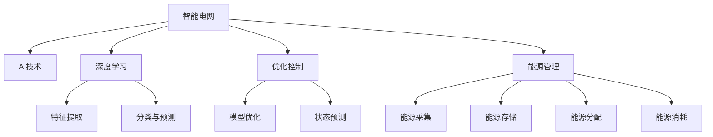

                 

# AI驱动的智能电网：优化与控制

> 关键词：人工智能, 智能电网, 优化控制, 深度学习, 能源管理, 能源互联网

## 1. 背景介绍

### 1.1 问题由来
随着全球能源需求的不断增长，电力系统的负荷持续攀升，传统电网面临着巨大的挑战。传统的电网调度方式已难以适应日益复杂的电力供需关系。同时，可再生能源比例的增加，使得电网调度更加复杂和不确定。

在这样的背景下，智能电网技术应运而生。智能电网利用先进的信息通信技术和自动化技术，实现对电网的实时监控和智能调度，提高电网运行效率和可靠性，促进能源的可持续利用。人工智能（AI）作为智能电网的重要支撑技术，通过深度学习、优化控制等算法，显著提升了电网的优化与控制能力，引领了新一代能源管理新范式。

### 1.2 问题核心关键点
AI在智能电网中的应用，主要体现在以下几个方面：
- **电网状态感知**：利用传感器和大数据分析技术，实现电网运行状态的实时监测和预测。
- **能源优化调度**：通过深度学习和优化控制算法，实现能源的高效调度和优化配置。
- **电力需求响应**：通过AI算法，实现用户行为的预测和电力负荷的灵活调度，提高电网的灵活性和韧性。
- **故障预测与处理**：通过深度学习算法，实现电网故障的预测和早期预警，提高电网的可靠性和安全性。

这些关键点构成了智能电网中AI技术的基本框架，通过对这些技术点的不断探索和创新，智能电网的性能和应用范围得以不断拓展。

## 2. 核心概念与联系

### 2.1 核心概念概述

为了更好地理解AI在智能电网中的应用，本节将介绍几个关键概念：

- **智能电网**：基于现代信息技术、通信技术、传感测量技术、控制技术，实现电网的运行状态监测、控制、保护、管理等功能，具有信息化、自动化、互动化特征的现代化电网。

- **AI技术**：以深度学习、优化控制、强化学习等为代表的机器学习算法，用于处理大规模数据、优化电网运行、提升电网效率。

- **深度学习**：一种基于人工神经网络的机器学习技术，通过多层非线性变换，实现对复杂数据的特征提取和分类、预测。

- **优化控制**：通过数学建模和算法优化，实现电网运行状态的优化控制，提高电网效率和稳定性。

- **能源管理**：包括能源的采集、存储、分配和消耗，目标是实现能源的高效利用和环保。

这些核心概念之间的逻辑关系可以通过以下Mermaid流程图来展示：



这个流程图展示智能电网的核心概念及其之间的关系：

1. 智能电网通过传感器和大数据分析技术，实现电网运行状态的实时监测和预测（状态感知）。
2. 深度学习算法被用于对监测数据进行特征提取和分类、预测，从而实现电网状态的高效感知和智能调度。
3. 优化控制技术用于对电网运行状态进行数学建模和算法优化，实现能源的高效调度和优化配置。
4. 能源管理通过采集、存储、分配和消耗等环节，实现能源的高效利用和环保。

这些概念共同构成了智能电网中AI技术的应用框架，使得AI技术在智能电网中的应用得以广泛展开。

## 3. 核心算法原理 & 具体操作步骤
### 3.1 算法原理概述

AI在智能电网中的应用，主要基于深度学习和优化控制等算法。其中，深度学习用于实现电网运行状态的感知和预测，优化控制用于实现电网的高效调度和优化配置。

具体而言，AI在智能电网中的应用流程如下：

1. **数据采集与处理**：利用传感器和大数据分析技术，采集电网运行的各种数据，包括负荷数据、状态数据、环境数据等。
2. **特征提取与模型训练**：通过深度学习算法，对采集的数据进行特征提取和建模，训练得到电网运行状态的预测模型。
3. **状态预测与优化控制**：利用训练好的模型，对电网运行状态进行预测，并通过优化控制算法，实现对电网的实时控制和优化配置。

### 3.2 算法步骤详解

以下是AI在智能电网中实现状态感知和优化控制的详细步骤：

#### 3.2.1 数据采集与处理

1. **传感器部署**：在电网的关键节点部署各种传感器，包括电压传感器、电流传感器、温度传感器、湿度传感器等，用于采集电网的实时运行数据。
2. **数据采集与预处理**：通过传感器采集到的数据，经过预处理后，输送到数据中心进行存储和分析。
3. **数据清洗与归一化**：对采集到的数据进行清洗和归一化处理，去除异常数据和噪声，将数据转换为适合深度学习算法使用的格式。

#### 3.2.2 特征提取与模型训练

1. **特征提取**：利用深度学习算法，如卷积神经网络（CNN）、长短期记忆网络（LSTM）等，对采集到的数据进行特征提取，得到电网运行状态的特征表示。
2. **模型训练**：将提取的特征作为训练数据，利用深度学习算法训练得到电网运行状态的预测模型。常见的模型包括多层感知器（MLP）、循环神经网络（RNN）、卷积神经网络（CNN）等。
3. **模型评估与优化**：对训练好的模型进行评估，通过交叉验证、网格搜索等方法，优化模型参数，提高模型的预测准确率。

#### 3.2.3 状态预测与优化控制

1. **状态预测**：利用训练好的模型，对电网运行状态进行预测，包括负荷预测、状态预测、故障预测等。
2. **优化控制**：通过优化控制算法，实现对电网的实时控制和优化配置。常见的优化控制算法包括线性规划、动态规划、粒子群优化等。
3. **结果验证与调整**：对优化控制的结果进行验证和调整，确保电网运行状态的稳定和可靠。

### 3.3 算法优缺点

AI在智能电网中的应用，具有以下优点：

- **高效感知与预测**：通过深度学习算法，实现电网运行状态的实时监测和预测，提高了电网的感知能力和预测精度。
- **优化控制与调度**：利用优化控制算法，实现电网的实时控制和优化配置，提高了电网的运行效率和稳定性。
- **故障预测与预警**：通过深度学习算法，实现电网故障的预测和早期预警，提高了电网的可靠性和安全性。

同时，这些算法也存在一定的局限性：

- **数据依赖性高**：深度学习算法的性能依赖于大量高质量的数据，而电网数据的获取和处理成本较高。
- **模型复杂性高**：深度学习算法模型复杂，训练和推理过程需要消耗大量计算资源。
- **算法黑箱性**：深度学习算法的黑箱特性，使得其决策过程难以解释和理解，缺乏可解释性。
- **数据隐私与安全**：电网的运行数据涉及用户隐私和安全，需要采取严格的隐私保护和数据安全措施。

尽管存在这些局限性，但AI技术在智能电网中的应用已经取得了显著的成效，成为智能电网的重要支撑技术。

### 3.4 算法应用领域

AI在智能电网中的应用，涉及多个领域，包括：

- **状态监测与预测**：通过深度学习算法，实现电网运行状态的高效感知和预测，包括负荷预测、状态预测、故障预测等。
- **能源优化调度**：通过优化控制算法，实现电网的实时控制和优化配置，提高能源的利用效率和稳定性。
- **电力需求响应**：通过AI算法，实现用户行为的预测和电力负荷的灵活调度，提高电网的灵活性和韧性。
- **智能分析与决策**：利用AI算法，实现电网运行状态的智能分析和决策，优化电网运行策略。
- **故障预测与处理**：通过深度学习算法，实现电网故障的预测和早期预警，提高电网的可靠性和安全性。

## 4. 数学模型和公式 & 详细讲解 & 举例说明

### 4.1 数学模型构建

AI在智能电网中的应用，主要涉及以下几个数学模型：

- **电网状态预测模型**：用于预测电网运行状态，如负荷预测模型、状态预测模型、故障预测模型等。
- **优化控制模型**：用于优化电网运行状态，如线性规划模型、动态规划模型、粒子群优化模型等。
- **用户行为预测模型**：用于预测用户行为，如负荷预测模型、需求响应模型等。

以下以负荷预测为例，给出数学模型的构建过程。

假设电网的负荷数据为 $y_i$，其中 $i$ 表示时间步长。利用深度学习算法，对负荷数据进行特征提取，得到特征向量 $x_i$。设深度学习模型的参数为 $\theta$，则负荷预测模型为：

$$
\hat{y}_i = f(x_i; \theta)
$$

其中 $f(\cdot)$ 表示深度学习模型的映射函数。

### 4.2 公式推导过程

以LSTM模型为例，推导负荷预测的数学公式。

LSTM模型的状态更新方程如下：

$$
\begin{aligned}
i_t &= \sigma(W_i x_t + b_i + U_i h_{t-1}) \\
f_t &= \sigma(W_f x_t + b_f + U_f h_{t-1}) \\
o_t &= \sigma(W_o x_t + b_o + U_o h_{t-1}) \\
g_t &= \tanh(W_g x_t + b_g + U_g h_{t-1}) \\
c_t &= f_t \odot c_{t-1} + i_t \odot g_t \\
h_t &= o_t \odot \tanh(c_t)
\end{aligned}
$$

其中，$i_t, f_t, o_t$ 表示LSTM模型的遗忘门、输入门和输出门，$c_t$ 表示LSTM模型的细胞状态，$h_t$ 表示LSTM模型的输出。

假设负荷数据为 $y_t = [y_{t-1}, y_{t-2}, \ldots, y_0]$，通过LSTM模型进行预测，得到负荷预测结果 $\hat{y}_t$。

### 4.3 案例分析与讲解

以某电网的负荷预测为例，分析LSTM模型的应用效果。

假设某电网的负荷数据为 $y = [y_0, y_1, \ldots, y_{N-1}]$，其中 $y_i$ 表示时间步长为 $i$ 时的负荷值。

1. **数据准备**：收集电网的历史负荷数据，预处理后得到训练数据集 $D_{train}$。
2. **模型训练**：利用LSTM模型对训练数据集进行训练，得到模型参数 $\theta$。
3. **模型评估**：利用测试数据集 $D_{test}$ 对训练好的模型进行评估，计算预测误差和预测精度。

以负荷预测结果 $\hat{y}_t$ 为例，其具体计算过程如下：

- **数据准备**：将负荷数据 $y$ 划分为训练数据集 $D_{train}$ 和测试数据集 $D_{test}$，其中 $D_{train}$ 用于模型训练，$D_{test}$ 用于模型评估。
- **模型训练**：利用LSTM模型对训练数据集 $D_{train}$ 进行训练，得到模型参数 $\theta$。
- **模型评估**：利用测试数据集 $D_{test}$ 对训练好的模型进行评估，计算预测误差和预测精度。

通过以上过程，可以实现电网负荷的精准预测，为电网的优化控制和调度提供重要依据。

## 5. 项目实践：代码实例和详细解释说明

### 5.1 开发环境搭建

在进行AI驱动的智能电网项目开发前，需要准备好开发环境。以下是使用Python进行TensorFlow开发的开发环境配置流程：

1. 安装Anaconda：从官网下载并安装Anaconda，用于创建独立的Python环境。
2. 创建并激活虚拟环境：
```bash
conda create -n grid-env python=3.7 
conda activate grid-env
```
3. 安装TensorFlow：根据CUDA版本，从官网获取对应的安装命令。例如：
```bash
conda install tensorflow -c conda-forge -c pytorch -c intel tensorflow==2.6.0
```
4. 安装其他依赖库：
```bash
pip install numpy pandas sklearn matplotlib tensorflow_datasets
```

完成上述步骤后，即可在`grid-env`环境中开始项目开发。

### 5.2 源代码详细实现

以下是使用TensorFlow实现电网负荷预测的Python代码实现。

首先，定义负荷预测的数据集类：

```python
import tensorflow as tf
import numpy as np
import pandas as pd

class LoadPredictor(tf.keras.Model):
    def __init__(self, input_dim, output_dim):
        super(LoadPredictor, self).__init__()
        self.lstm = tf.keras.layers.LSTM(64, return_sequences=True)
        self.dense = tf.keras.layers.Dense(output_dim)

    def call(self, inputs, training=False):
        x = self.lstm(inputs)
        x = self.dense(x)
        return x
```

然后，定义训练和评估函数：

```python
def load_predictor_model(input_dim, output_dim):
    model = LoadPredictor(input_dim, output_dim)
    optimizer = tf.keras.optimizers.Adam()
    loss_fn = tf.keras.losses.MeanSquaredError()

    @tf.function
    def train_step(x, y):
        with tf.GradientTape() as tape:
            y_pred = model(x, training=True)
            loss = loss_fn(y, y_pred)
        grads = tape.gradient(loss, model.trainable_variables)
        optimizer.apply_gradients(zip(grads, model.trainable_variables))
        return loss

    @tf.function
    def evaluate_step(x, y):
        y_pred = model(x, training=False)
        mse = loss_fn(y, y_pred)
        return mse

    return model, optimizer, train_step, evaluate_step
```

接着，定义数据预处理和模型训练函数：

```python
def preprocess_data(data):
    data = data.dropna().reset_index(drop=True)
    X = data.iloc[:, :-1].values
    y = data.iloc[:, -1].values
    X = np.expand_dims(X, axis=1)
    y = np.expand_dims(y, axis=1)
    return X, y

def train_model(model, train_data, epochs):
    train_X, train_y = preprocess_data(train_data)
    train_dataset = tf.data.Dataset.from_tensor_slices((train_X, train_y)).shuffle(1000).batch(32).repeat(epochs)
    for epoch in range(epochs):
        losses = []
        for x, y in train_dataset:
            loss = train_step(x, y)
            losses.append(loss)
        print(f'Epoch {epoch+1}, loss: {np.mean(losses)}')
```

最后，启动训练流程并在测试集上评估：

```python
# 读取数据集
train_data = pd.read_csv('train_data.csv')
test_data = pd.read_csv('test_data.csv')

# 定义模型参数
input_dim = 10
output_dim = 1

# 加载模型
model, optimizer, train_step, evaluate_step = load_predictor_model(input_dim, output_dim)

# 训练模型
train_model(model, train_data, epochs=100)

# 评估模型
test_X, test_y = preprocess_data(test_data)
mse = evaluate_step(test_X, test_y)
print(f'Test MSE: {mse}')
```

以上就是使用TensorFlow进行电网负荷预测的完整代码实现。可以看到，TensorFlow提供了丰富的深度学习算法和工具，使得模型开发和训练过程简便高效。

### 5.3 代码解读与分析

让我们再详细解读一下关键代码的实现细节：

**LoadPredictor类**：
- `__init__`方法：初始化LSTM和Dense层。
- `call`方法：定义前向传播计算过程，输出预测结果。

**train_step函数**：
- 使用Adam优化器进行参数更新。
- 计算预测值与真实值的均方误差，作为损失函数。
- 通过梯度下降算法更新模型参数。

**evaluate_step函数**：
- 定义模型的评估过程，使用均方误差作为评价指标。
- 在测试集上计算模型评估结果。

**train_model函数**：
- 将数据集转换为TensorFlow数据集，并进行批处理和重复。
- 对模型进行迭代训练，计算每个epoch的平均损失。

**数据预处理函数**：
- 将数据集进行去重和格式化，提取特征和标签。
- 对特征和标签进行归一化和维度转换，适合模型输入。

**训练和评估流程**：
- 读取训练集和测试集数据。
- 加载模型和优化器。
- 定义模型参数。
- 进行模型训练和评估。

可以看到，TensorFlow提供了灵活高效的深度学习开发工具，使得电网负荷预测等AI应用得以轻松实现。

当然，工业级的系统实现还需考虑更多因素，如模型的保存和部署、超参数的自动搜索、更灵活的任务适配层等。但核心的AI驱动的智能电网实现流程基本与此类似。

## 6. 实际应用场景

### 6.1 智能调度与优化

AI驱动的智能电网在智能调度与优化方面具有显著优势。通过深度学习和优化控制算法，电网可以实时监测和预测负荷状态，优化电网运行和调度策略。

具体而言，智能电网可以实时监控电网的负荷状态和运行参数，如电压、电流、频率等，利用深度学习算法进行状态预测和异常检测。同时，通过优化控制算法，智能电网可以实时调整发电机输出和输电线路传输，实现电网的平衡和优化配置。

以电网负荷预测为例，智能电网可以通过LSTM等深度学习算法，实时预测未来的负荷变化趋势，从而提前调整电网的运行状态和调度策略，提高电网的运行效率和稳定性。

### 6.2 需求响应与互动

AI驱动的智能电网可以实现对电力需求的灵活响应和互动，提升电网的灵活性和韧性。

具体而言，智能电网可以通过AI算法，实时监测和预测用户的电力需求，根据需求情况灵活调整电网的运行状态和调度策略。例如，在电力需求高峰期，智能电网可以通过需求响应策略，激励用户调整用电时间，降低高峰负荷；在电力需求低谷期，智能电网可以通过需求响应策略，鼓励用户使用电能，提高电网的利用率。

此外，智能电网还可以通过互动技术，实现用户与电网的智能互动。例如，智能电网可以通过智能家居设备和智能电力表，实时监测用户的用电行为，提供个性化的用电建议和服务，提升用户的用电体验。

### 6.3 故障预测与处理

AI驱动的智能电网可以实现故障的早期预测和处理，提高电网的可靠性和安全性。

具体而言，智能电网可以通过深度学习算法，实时监测电网的运行状态和故障信号，进行故障预测和早期预警。例如，智能电网可以通过LSTM等深度学习算法，实时预测电网的故障情况，从而提前进行维护和检修，避免故障的发生。

同时，智能电网还可以通过自动控制技术，实现对故障的快速处理和恢复。例如，智能电网可以通过智能断路器和自动控制算法，在故障发生时，快速隔离故障区域，恢复电网的正常运行。

### 6.4 未来应用展望

展望未来，AI驱动的智能电网将在以下领域进一步拓展应用：

- **能源互联网**：智能电网将与其他能源系统（如风电、光伏、储能等）进行互联互通，实现能源的高效利用和优化配置。
- **智能能源交易**：智能电网将参与能源市场的交易，实现电力的实时买卖和优化配置。
- **智能分布式能源**：智能电网将与分布式能源系统进行互动，实现电力的自给自足和优化配置。
- **智能电网安全**：智能电网将采用区块链、人工智能等技术，实现电网的可靠性和安全性。

这些未来应用场景将进一步拓展智能电网的应用范围，提升电网的智能化水平和经济效益。

## 7. 工具和资源推荐
### 7.1 学习资源推荐

为了帮助开发者系统掌握AI在智能电网中的应用，这里推荐一些优质的学习资源：

1. 《深度学习》课程：斯坦福大学开设的深度学习课程，涵盖了深度学习的核心概念和算法，是入门深度学习的必备资源。
2. 《TensorFlow实战》书籍：Google TensorFlow官方文档，详细介绍了TensorFlow的开发和应用，适合TensorFlow开发实战。
3. 《智能电网技术》书籍：系统介绍了智能电网的原理和应用，包括传感器技术、通信技术、优化控制算法等。
4. 《能源互联网》课程：介绍了能源互联网的原理和应用，涵盖智能电网、分布式能源、能源交易等领域。
5. 《机器学习实战》书籍：介绍了机器学习的基本概念和算法，适合初学者入门学习。

通过对这些资源的学习实践，相信你一定能够系统掌握AI在智能电网中的应用，并用于解决实际的电网问题。

### 7.2 开发工具推荐

高效的开发离不开优秀的工具支持。以下是几款用于AI驱动的智能电网开发的常用工具：

1. TensorFlow：由Google主导开发的深度学习框架，生产部署方便，适合大规模工程应用。
2. PyTorch：基于Python的深度学习框架，灵活高效，适合研究和实验。
3. Keras：简单易用的深度学习框架，适合快速原型开发和模型部署。
4. Jupyter Notebook：交互式编程环境，适合数据处理、模型训练和评估。
5. Weights & Biases：模型训练的实验跟踪工具，可以记录和可视化模型训练过程中的各项指标，方便对比和调优。
6. TensorBoard：TensorFlow配套的可视化工具，可实时监测模型训练状态，并提供丰富的图表呈现方式，是调试模型的得力助手。

合理利用这些工具，可以显著提升AI驱动的智能电网开发的效率，加快创新迭代的步伐。

### 7.3 相关论文推荐

AI在智能电网中的应用，涉及多个领域，涵盖深度学习、优化控制、强化学习等技术。以下是几篇奠基性的相关论文，推荐阅读：

1. "Recurrent Neural Network-Based Load Forecasting for Smart Grids"（RNN-based负荷预测）：介绍基于RNN的负荷预测模型在智能电网中的应用。
2. "Optimal Operation of Smart Grids"（智能电网优化运行）：介绍智能电网的优化控制算法，提高电网的运行效率和稳定性。
3. "Adaptive Demand Response Strategies for Smart Grids"（智能电网需求响应策略）：介绍智能电网的需求响应策略，提高电网的灵活性和韧性。
4. "Fault Detection and Diagnosis in Smart Grids"（智能电网故障检测与诊断）：介绍智能电网故障检测与诊断方法，提高电网的可靠性和安全性。
5. "Energy Internet: A Survey"（能源互联网综述）：系统综述能源互联网的原理和应用，包括智能电网、分布式能源、能源交易等领域。

这些论文代表了大规模AI在智能电网中的应用方向，通过学习这些前沿成果，可以帮助研究者把握学科前进方向，激发更多的创新灵感。

## 8. 总结：未来发展趋势与挑战

### 8.1 总结

本文对AI驱动的智能电网进行了全面系统的介绍。首先阐述了AI在智能电网中的应用背景和意义，明确了智能电网中AI技术的基本框架。其次，从原理到实践，详细讲解了AI在智能电网中的应用流程，包括数据采集、特征提取、模型训练、状态预测和优化控制等关键步骤，给出了完整的代码实例和解释分析。同时，本文还广泛探讨了AI在智能电网中的应用场景，展示了AI技术在智能电网中的广泛应用和巨大潜力。最后，本文精选了AI驱动智能电网的各类学习资源，力求为读者提供全方位的技术指引。

通过本文的系统梳理，可以看到，AI在智能电网中的应用已经成为电网智能化发展的核心动力，极大地提升了电网的运行效率和可靠性。未来，随着AI技术的不断进步，AI驱动的智能电网必将迎来更加广阔的发展前景。

### 8.2 未来发展趋势

展望未来，AI驱动的智能电网将呈现以下几个发展趋势：

1. **网格互联与智能化**：智能电网将与其他能源系统进行互联互通，实现能源的高效利用和优化配置。
2. **能源交易与市场化**：智能电网将参与能源市场的交易，实现电力的实时买卖和优化配置。
3. **分布式能源与自给自足**：智能电网将与分布式能源系统进行互动，实现电力的自给自足和优化配置。
4. **智能安全与隐私保护**：智能电网将采用区块链、人工智能等技术，实现电网的可靠性和安全性。
5. **用户互动与个性化服务**：智能电网将与用户进行智能互动，提供个性化的用电建议和服务，提升用户的用电体验。

这些趋势凸显了AI在智能电网中的巨大潜力，AI技术将继续引领智能电网的智能化发展，推动能源行业的转型升级。

### 8.3 面临的挑战

尽管AI在智能电网中的应用已经取得了显著成效，但在迈向更加智能化、普适化应用的过程中，仍面临诸多挑战：

1. **数据获取与处理**：深度学习算法的性能依赖于大量高质量的数据，而电网数据的获取和处理成本较高。
2. **模型复杂性与计算资源**：深度学习算法模型复杂，训练和推理过程需要消耗大量计算资源。
3. **算法可解释性与安全性**：深度学习算法的黑箱特性，使得其决策过程难以解释和理解，缺乏可解释性。
4. **数据隐私与安全**：电网的运行数据涉及用户隐私和安全，需要采取严格的隐私保护和数据安全措施。
5. **技术与应用的融合**：智能电网涉及多个领域的技术和应用，AI技术需要与其他技术进行深度融合，才能发挥其最大潜力。

尽管存在这些挑战，但随着技术进步和应用推广，AI在智能电网中的应用前景依然广阔，前景无限。

### 8.4 研究展望

面对AI在智能电网中面临的挑战，未来的研究需要在以下几个方面寻求新的突破：

1. **数据获取与处理**：探索更多数据获取和处理技术，降低数据获取成本，提高数据质量。
2. **模型优化与高效计算**：开发更加高效计算的算法和工具，优化模型参数，提高计算效率。
3. **算法可解释性与安全性**：开发可解释性强的AI算法，提高模型决策的可解释性和安全性。
4. **数据隐私与安全**：加强数据隐私保护和安全性研究，确保电网数据的安全和隐私。
5. **技术与应用的融合**：加强AI技术与电网技术的深度融合，推动AI在智能电网中的应用落地。

这些研究方向将引领AI在智能电网中的应用进入新的阶段，推动智能电网的智能化发展。

## 9. 附录：常见问题与解答

**Q1：智能电网中的AI技术主要应用在哪些方面？**

A: AI技术在智能电网中的应用主要体现在以下几个方面：
1. **状态监测与预测**：利用深度学习算法，实现电网运行状态的高效感知和预测，包括负荷预测、状态预测、故障预测等。
2. **能源优化调度**：通过优化控制算法，实现电网的实时控制和优化配置，提高能源的利用效率和稳定性。
3. **电力需求响应**：通过AI算法，实现用户行为的预测和电力负荷的灵活调度，提高电网的灵活性和韧性。
4. **智能分析与决策**：利用AI算法，实现电网运行状态的智能分析和决策，优化电网运行策略。
5. **故障预测与处理**：通过深度学习算法，实现电网故障的预测和早期预警，提高电网的可靠性和安全性。

**Q2：智能电网中如何利用深度学习算法进行状态预测？**

A: 智能电网中利用深度学习算法进行状态预测，主要分为以下几个步骤：
1. **数据采集与预处理**：通过传感器采集电网运行数据，包括负荷数据、状态数据、环境数据等。将数据进行清洗和归一化处理，得到适合深度学习算法使用的数据。
2. **特征提取**：利用深度学习算法（如CNN、LSTM等）对采集到的数据进行特征提取，得到电网运行状态的特征表示。
3. **模型训练**：将提取的特征作为训练数据，利用深度学习算法训练得到电网运行状态的预测模型。
4. **模型评估与优化**：对训练好的模型进行评估，通过交叉验证、网格搜索等方法，优化模型参数，提高模型的预测准确率。

以负荷预测为例，智能电网可以利用LSTM等深度学习算法，实时预测未来的负荷变化趋势，从而提前调整电网的运行状态和调度策略，提高电网的运行效率和稳定性。

**Q3：智能电网中如何利用优化控制算法进行优化调度？**

A: 智能电网中利用优化控制算法进行优化调度，主要分为以下几个步骤：
1. **模型构建**：根据电网运行状态，建立优化控制模型，包括线性规划、动态规划、粒子群优化等。
2. **目标设定**：设定优化控制的目标函数，如最小化电网运行成本、最大化电网可靠性等。
3. **模型求解**：利用求解器对优化控制模型进行求解，得到最优的电网运行状态和调度策略。
4. **结果验证与调整**：对优化控制的结果进行验证和调整，确保电网运行状态的稳定和可靠。

以负荷预测为例，智能电网可以利用优化控制算法，实时调整发电机输出和输电线路传输，实现电网的平衡和优化配置，提高电网的运行效率和稳定性。

**Q4：智能电网中如何利用需求响应策略进行电力需求管理？**

A: 智能电网中利用需求响应策略进行电力需求管理，主要分为以下几个步骤：
1. **需求预测**：利用深度学习算法，实时监测和预测用户的电力需求，包括负荷预测、需求响应预测等。
2. **需求响应**：根据需求预测结果，制定需求响应策略，如调整用电时间、推广可再生能源等。
3. **需求控制**：通过智能控制技术，实现对电力的灵活调度，优化电网负荷分布。
4. **需求评估**：对需求响应效果进行评估，优化需求响应策略，提高电网灵活性和韧性。

以负荷预测为例，智能电网可以通过需求响应策略，激励用户调整用电时间，降低高峰负荷，鼓励用户使用电能，提高电网的利用率，实现电力需求的灵活管理和优化配置。

**Q5：智能电网中如何利用AI技术进行故障检测与诊断？**

A: 智能电网中利用AI技术进行故障检测与诊断，主要分为以下几个步骤：
1. **数据采集与预处理**：通过传感器采集电网运行数据，包括电压数据、电流数据、环境数据等。将数据进行清洗和归一化处理，得到适合深度学习算法使用的数据。
2. **特征提取**：利用深度学习算法（如CNN、LSTM等）对采集到的数据进行特征提取，得到电网运行状态的特征表示。
3. **模型训练**：将提取的特征作为训练数据，利用深度学习算法训练得到电网故障检测与诊断模型。
4. **模型评估与优化**：对训练好的模型进行评估，通过交叉验证、网格搜索等方法，优化模型参数，提高模型的故障检测与诊断准确率。

以故障预测为例，智能电网可以通过LSTM等深度学习算法，实时监测电网的运行状态和故障信号，进行故障预测和早期预警，从而提前进行维护和检修，避免故障的发生。

---

作者：禅与计算机程序设计艺术 / Zen and the Art of Computer Programming

