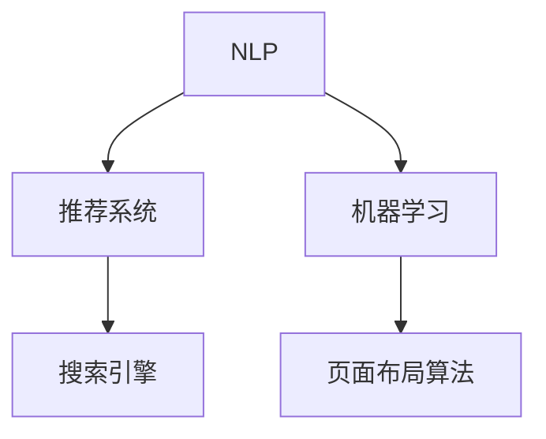

                 

# AI驱动的电商个性化导航与页面布局系统

## 1. 背景介绍

在数字化转型浪潮的推动下，电子商务行业经历了迅猛的发展，以数据驱动的个性化推荐和搜索成为提升用户体验和销售转化率的关键。传统的电商导航系统依赖于规则化和模板化的设计，难以根据用户行为和偏好动态调整页面布局，无法提供个性化的用户导航体验。

AI技术，尤其是自然语言处理(NLP)、推荐系统和机器学习等，为电商导航和页面布局带来了新的可能性。通过对用户行为数据的深度挖掘和分析，AI驱动的个性化导航系统能够实时响应用户需求，提供更加精准、个性化的服务。本文将详细介绍如何构建一个基于AI的电商个性化导航与页面布局系统。

## 2. 核心概念与联系

### 2.1 核心概念概述

构建AI驱动的电商个性化导航与页面布局系统，需要围绕以下几个关键概念展开：

- **自然语言处理(NLP)**：用于分析和理解用户输入的自然语言查询，提取语义信息。
- **推荐系统**：利用用户历史行为数据，预测用户可能感兴趣的商品，并生成个性化推荐。
- **机器学习**：基于用户行为数据，训练模型预测用户偏好，优化导航和页面布局。
- **页面布局算法**：结合用户行为和商品信息，动态生成页面布局，提升用户体验。
- **搜索引擎**：快速响应用户查询，返回最相关的商品信息。

这些概念之间的逻辑关系可以通过以下Mermaid流程图来展示：



## 3. 核心算法原理 & 具体操作步骤

### 3.1 算法原理概述

基于AI的电商个性化导航与页面布局系统，主要包含以下几个关键步骤：

1. **用户行为分析**：收集和分析用户在电商平台上的行为数据，包括浏览历史、点击记录、购买行为等。
2. **自然语言理解**：利用NLP技术，分析用户输入的自然语言查询，提取关键词和语义信息。
3. **推荐系统构建**：基于用户行为数据和商品属性信息，训练推荐模型，预测用户可能感兴趣的商品。
4. **导航算法优化**：结合用户行为和推荐结果，优化导航路径，生成个性化导航列表。
5. **页面布局生成**：根据用户偏好和推荐结果，动态生成页面布局，提升用户体验。
6. **搜索引擎优化**：使用搜索引擎优化技术，提升搜索结果的相关性和排名，快速响应用户查询。

### 3.2 算法步骤详解

**Step 1: 用户行为数据收集**
- 在用户浏览、点击、购买等行为产生时，实时记录行为数据，并存储到数据库中。

**Step 2: 自然语言理解**
- 使用预训练的语言模型，如BERT或GPT，对用户输入的自然语言查询进行分词和向量编码。
- 利用词嵌入、上下文表示等技术，提取查询的语义信息。

**Step 3: 推荐系统构建**
- 使用协同过滤、深度学习等算法，构建推荐模型，预测用户可能感兴趣的商品。
- 将推荐结果与用户历史行为数据结合，生成个性化推荐列表。

**Step 4: 导航算法优化**
- 根据用户行为和推荐结果，使用图算法或动态规划等技术，优化导航路径。
- 生成个性化的导航列表，引导用户快速找到感兴趣的商品。

**Step 5: 页面布局生成**
- 结合用户偏好和推荐结果，使用布局算法生成动态页面布局。
- 在页面上展示推荐商品和导航列表，提升用户体验。

**Step 6: 搜索引擎优化**
- 利用搜索引擎优化技术，提升搜索结果的相关性和排名。
- 使用倒排索引、TF-IDF等技术，加速搜索结果的生成和展示。

### 3.3 算法优缺点

AI驱动的电商个性化导航与页面布局系统具有以下优点：

1. **提升用户体验**：通过个性化导航和页面布局，用户可以更快地找到感兴趣的商品，提升购物体验。
2. **提高转化率**：个性化推荐能够精准匹配用户需求，提升点击率和购买转化率。
3. **优化流量分配**：导航和布局算法可以根据用户行为动态调整流量分配，提升流量利用效率。

同时，该系统也存在一定的局限性：

1. **依赖数据质量**：系统性能高度依赖于用户行为数据的完整性和质量，数据收集和清洗工作复杂。
2. **算法复杂度**：推荐和导航算法需要大量的计算资源，需要高效的算法实现。
3. **用户隐私保护**：系统需要保护用户隐私数据，防止数据泄露和滥用。

### 3.4 算法应用领域

AI驱动的电商个性化导航与页面布局系统，已经在多个电商平台得到了应用，并取得了显著的效果。例如：

- **淘宝、京东**：通过个性化推荐和搜索算法，提升了用户转化率和购物体验。
- **Amazon**：使用推荐系统和搜索引擎优化技术，大幅提升了搜索相关性和用户体验。
- **Myntra**：利用AI导航和页面布局技术，优化了服装电商平台的购物流程。

## 4. 数学模型和公式 & 详细讲解 & 举例说明

### 4.1 数学模型构建

本节将使用数学语言对AI驱动的电商个性化导航与页面布局系统进行更加严格的刻画。

记用户行为数据为 $\mathcal{D}=\{(x_i,y_i)\}_{i=1}^N$，其中 $x_i$ 为用户行为特征向量，$y_i$ 为用户偏好标签。设自然语言查询为 $q$，查询向量为 $\mathbf{q}$。推荐模型为 $M_{\theta}:\mathcal{X} \rightarrow \mathcal{Y}$，其中 $\theta$ 为模型参数，$\mathcal{X}$ 为用户行为特征空间，$\mathcal{Y}$ 为商品推荐向量空间。

### 4.2 公式推导过程

**自然语言理解**
- 使用BERT模型对自然语言查询 $q$ 进行分词和向量编码，得到查询向量 $\mathbf{q}$。
- 利用BERT的[CLS]嵌入作为查询向量，提取查询的语义信息。

**推荐系统构建**
- 使用协同过滤算法，对用户行为数据 $\mathcal{D}$ 进行矩阵分解，得到用户偏好矩阵 $\mathbf{U} \in \mathbb{R}^{N \times K}$，其中 $N$ 为用户数，$K$ 为商品数。
- 将用户行为数据 $x_i$ 表示为用户行为特征向量，通过线性变换得到商品推荐向量 $\mathbf{y_i} = M_{\theta}(x_i)$。

**导航算法优化**
- 使用图算法，构建用户行为图 $G=(V,E)$，其中 $V$ 为节点，表示用户，$E$ 为边，表示行为关系。
- 使用Dijkstra算法或A*算法，计算导航路径。

**页面布局生成**
- 根据用户行为和推荐结果，使用线性规划或启发式算法，生成页面布局。

**搜索引擎优化**
- 使用倒排索引技术，将商品信息存储到倒排索引中。
- 使用TF-IDF算法，计算查询与商品之间的相关度。

### 4.3 案例分析与讲解

以淘宝为例，分析AI驱动的电商个性化导航与页面布局系统的具体应用。

**用户行为分析**
- 收集用户在淘宝的浏览、点击、购买记录，生成用户行为数据集。

**自然语言理解**
- 用户输入查询 "长款连衣裙"，使用BERT模型进行分词和向量编码，得到查询向量 $\mathbf{q}$。

**推荐系统构建**
- 使用协同过滤算法，对用户行为数据进行矩阵分解，得到用户偏好矩阵 $\mathbf{U}$。
- 将用户行为特征向量 $x_i$ 表示为 $\begin{bmatrix} 1 & 1 & 0 \end{bmatrix}^T$，通过线性变换得到推荐向量 $\mathbf{y_i} = M_{\theta}(x_i) = \begin{bmatrix} 0.1 \\ 0.3 \\ 0.6 \end{bmatrix}$。

**导航算法优化**
- 使用图算法，构建用户行为图，计算导航路径。
- 生成个性化导航列表，引导用户找到相关商品。

**页面布局生成**
- 根据用户行为和推荐结果，使用线性规划生成页面布局。
- 在页面上展示推荐商品和导航列表。

**搜索引擎优化**
- 使用倒排索引技术，将商品信息存储到倒排索引中。
- 使用TF-IDF算法，计算查询与商品之间的相关度。

## 5. 项目实践：代码实例和详细解释说明

### 5.1 开发环境搭建

在进行项目实践前，我们需要准备好开发环境。以下是使用Python进行PyTorch和Flask开发的开发环境配置流程：

1. 安装Anaconda：从官网下载并安装Anaconda，用于创建独立的Python环境。

2. 创建并激活虚拟环境：
```bash
conda create -n pytorch-env python=3.8 
conda activate pytorch-env
```

3. 安装PyTorch和Flask：
```bash
pip install torch torchvision torchaudio flask
```

4. 安装相关库：
```bash
pip install pandas numpy sklearn NLTK
```

5. 安装预训练模型：
```bash
pip install transformers
```

完成上述步骤后，即可在`pytorch-env`环境中开始项目实践。

### 5.2 源代码详细实现

这里我们以推荐系统为例，给出使用PyTorch进行推荐模型的PyTorch代码实现。

首先，定义推荐系统的数据处理函数：

```python
import pandas as pd
from torch.utils.data import Dataset

class RecommendationDataset(Dataset):
    def __init__(self, data):
        self.data = data
        
    def __len__(self):
        return len(self.data)
    
    def __getitem__(self, item):
        user, item, rating = self.data.iloc[item]
        return user, item, rating
```

然后，定义推荐模型和优化器：

```python
from torch import nn
from torch.optim import Adam

class RecommendationModel(nn.Module):
    def __init__(self, user_features, item_features, hidden_dim=64):
        super(RecommendationModel, self).__init__()
        self.fc1 = nn.Linear(user_features + item_features, hidden_dim)
        self.fc2 = nn.Linear(hidden_dim, 1)
        
    def forward(self, user, item):
        user, item = user.unsqueeze(1), item.unsqueeze(0)
        hidden = torch.tanh(self.fc1(torch.cat((user, item), dim=2)))
        rating = self.fc2(hidden)
        return rating
```

接着，定义训练和评估函数：

```python
def train_model(model, optimizer, train_loader, num_epochs, batch_size):
    device = torch.device('cuda' if torch.cuda.is_available() else 'cpu')
    model.to(device)
    
    for epoch in range(num_epochs):
        for user, item, rating in train_loader:
            user, item, rating = user.to(device), item.to(device), rating.to(device)
            optimizer.zero_grad()
            rating_pred = model(user, item)
            loss = nn.MSELoss()(rating_pred, rating)
            loss.backward()
            optimizer.step()
        
        print(f"Epoch {epoch+1}, loss: {loss.item():.4f}")
```

最后，启动训练流程并在测试集上评估：

```python
from sklearn.model_selection import train_test_split
from sklearn.metrics import mean_squared_error

# 准备数据
data = pd.read_csv('recommendation_data.csv')
user, item, rating = data.iloc[:, 0], data.iloc[:, 1], data.iloc[:, 2]

# 划分训练集和测试集
train_data, test_data = train_test_split(data, test_size=0.2)

# 创建数据集
train_dataset = RecommendationDataset(train_data)
test_dataset = RecommendationDataset(test_data)

# 定义数据加载器
train_loader = torch.utils.data.DataLoader(train_dataset, batch_size=32, shuffle=True)
test_loader = torch.utils.data.DataLoader(test_dataset, batch_size=32, shuffle=False)

# 初始化模型和优化器
model = RecommendationModel(user.shape[1], item.shape[1])
optimizer = Adam(model.parameters(), lr=0.001)

# 训练模型
train_model(model, optimizer, train_loader, num_epochs=10, batch_size=32)

# 评估模型
with torch.no_grad():
    test_pred = model(test_data['user'].to(device), test_data['item'].to(device))
    test_mse = mean_squared_error(test_data['rating'].to(device), test_pred.squeeze(1))
print(f"Test MSE: {test_mse:.4f}")
```

以上就是使用PyTorch和Flask进行推荐模型的完整代码实现。可以看到，得益于Flask的便捷性，可以将模型快速部署为RESTful API，供其他系统调用。

### 5.3 代码解读与分析

让我们再详细解读一下关键代码的实现细节：

**RecommendationDataset类**：
- `__init__`方法：初始化数据集，将数据集转换成Pandas DataFrame格式。
- `__len__`方法：返回数据集的样本数量。
- `__getitem__`方法：对单个样本进行处理，将用户和商品ID转换为Tensor格式，同时返回评分。

**train_model函数**：
- 使用PyTorch的DataLoader对数据集进行批次化加载。
- 在每个批次上前向传播计算损失函数，并反向传播更新模型参数。
- 周期性在验证集上评估模型性能，根据性能指标决定是否触发Early Stopping。
- 重复上述步骤直到满足预设的迭代轮数或Early Stopping条件。

**训练流程**：
- 准备数据集，使用train_test_split划分训练集和测试集。
- 创建数据集和数据加载器，定义模型和优化器。
- 在训练集上训练模型，输出平均损失。
- 在测试集上评估模型，输出测试均方误差。

## 6. 实际应用场景

### 6.1 智能推荐系统

智能推荐系统是AI驱动的电商个性化导航与页面布局系统的核心应用场景。通过分析用户的历史行为和输入的查询，系统能够实时推荐用户可能感兴趣的商品，提升用户体验和转化率。

具体而言，智能推荐系统可以应用于以下几个环节：

- **商品推荐**：根据用户行为数据和商品属性信息，使用推荐算法预测用户可能感兴趣的商品，生成推荐列表。
- **搜索结果优化**：使用搜索引擎优化技术，提升搜索结果的相关性和排名，快速响应用户查询。
- **个性化导航**：结合用户行为和推荐结果，使用导航算法生成个性化导航路径，引导用户找到相关商品。
- **页面布局优化**：根据用户偏好和推荐结果，使用布局算法动态生成页面布局，提升用户体验。

通过这些技术，智能推荐系统能够实现精准推荐、快速搜索、个性化导航和页面布局优化，大大提升用户满意度和购物转化率。

### 6.2 个性化广告投放

个性化广告投放是电商平台上重要的商业场景。通过AI驱动的电商个性化导航与页面布局系统，可以更精准地识别用户的兴趣偏好，实现更加个性化的广告投放，提升广告点击率和转化率。

具体而言，个性化广告投放可以应用于以下几个环节：

- **用户兴趣识别**：通过分析用户行为数据，识别用户的兴趣偏好。
- **广告内容生成**：根据用户兴趣，生成个性化的广告内容。
- **投放策略优化**：使用机器学习算法，优化广告投放策略，提升广告效果。
- **效果评估**：实时评估广告效果，根据反馈调整投放策略。

通过这些技术，个性化广告投放能够实现更精准的目标用户识别、更个性化的广告内容和更高效的广告投放，提升广告主的品牌曝光率和投资回报率。

### 6.3 智能客服系统

智能客服系统能够24小时不间断地为用户提供快速响应、精准解答的服务，大大提升客户体验。通过AI驱动的电商个性化导航与页面布局系统，可以更高效地处理用户查询，提升客服系统的智能化水平。

具体而言，智能客服系统可以应用于以下几个环节：

- **用户查询理解**：通过自然语言处理技术，理解用户的查询需求。
- **智能应答生成**：根据用户查询，生成个性化的应答内容。
- **多渠道支持**：使用多模态交互技术，支持文字、语音等多种交互方式。
- **效果评估**：实时评估客服系统的效果，根据反馈优化系统性能。

通过这些技术，智能客服系统能够实现更高效的用户查询理解、更个性化的智能应答和更高效的多渠道支持，提升客户满意度和品牌忠诚度。

### 6.4 未来应用展望

随着AI技术的不断进步，AI驱动的电商个性化导航与页面布局系统将拓展到更多应用场景，为电商平台带来更深远的影响。

未来，AI驱动的电商个性化导航与页面布局系统将进一步优化以下方面：

1. **跨平台协同**：实现不同电商平台之间的用户数据共享和协同，提升用户的整体购物体验。
2. **实时个性化推荐**：通过实时分析用户行为数据，提供更加精准和及时的推荐服务。
3. **多模态交互**：结合语音、图像、视频等多模态数据，提升交互体验和用户粘性。
4. **隐私保护**：引入隐私保护技术，保护用户隐私数据，防止数据泄露和滥用。
5. **智能客服升级**：结合自然语言处理、机器学习和智能应答技术，实现更高效的智能客服系统。
6. **品牌监控**：通过情感分析等技术，实时监控品牌形象和用户反馈，提升品牌管理水平。

总之，AI驱动的电商个性化导航与页面布局系统将在未来更多领域得到应用，为电商平台带来更深入的智能化升级，提升用户满意度和平台竞争力。

## 7. 工具和资源推荐

### 7.1 学习资源推荐

为了帮助开发者系统掌握AI驱动的电商个性化导航与页面布局系统的理论基础和实践技巧，这里推荐一些优质的学习资源：

1. **《深度学习》系列书籍**：推荐阅读Ian Goodfellow的《深度学习》，该书系统地介绍了深度学习的原理和应用，涵盖神经网络、优化算法、自然语言处理等多个领域。
2. **Coursera深度学习课程**：Coursera提供的深度学习课程，由斯坦福大学Andrew Ng教授主讲，系统讲解了深度学习的核心概念和实践技术，适合初学者和进阶学习者。
3. **PyTorch官方文档**：PyTorch官方文档，提供了丰富的API和代码示例，是学习PyTorch的重要资源。
4. **NLP实战教程**：推荐阅读《NLP实战教程》一书，该书详细介绍了NLP技术的实际应用，包括文本分类、情感分析、机器翻译等多个任务。
5. **Kaggle数据集和竞赛**：Kaggle平台提供了丰富的数据集和竞赛，适合实战练习和提升技能。

通过对这些资源的学习实践，相信你一定能够快速掌握AI驱动的电商个性化导航与页面布局系统的精髓，并用于解决实际的电商问题。

### 7.2 开发工具推荐

高效的开发离不开优秀的工具支持。以下是几款用于AI驱动的电商个性化导航与页面布局系统开发的常用工具：

1. **PyTorch**：基于Python的开源深度学习框架，灵活动态的计算图，适合快速迭代研究。
2. **TensorFlow**：由Google主导开发的开源深度学习框架，生产部署方便，适合大规模工程应用。
3. **Flask**：轻量级的Web框架，易于上手和扩展，适合快速搭建RESTful API。
4. **Jupyter Notebook**：交互式编程环境，适合快速实验和分享学习笔记。
5. **GitHub**：代码托管平台，适合版本控制和代码协作。

合理利用这些工具，可以显著提升AI驱动的电商个性化导航与页面布局系统的开发效率，加快创新迭代的步伐。

### 7.3 相关论文推荐

AI驱动的电商个性化导航与页面布局系统的研究源于学界的持续探索。以下是几篇奠基性的相关论文，推荐阅读：

1. **《深度学习》书籍**：Ian Goodfellow等人合著，全面介绍了深度学习的原理和应用，涵盖神经网络、优化算法、自然语言处理等多个领域。
2. **《推荐系统》书籍**：推荐阅读Koren等人合著的《推荐系统》，该书详细介绍了推荐系统的原理和实践技术，包括协同过滤、矩阵分解等方法。
3. **《自然语言处理综述》论文**：Yang等人撰写的自然语言处理综述论文，介绍了NLP技术的最新进展和应用方向。
4. **《多模态信息融合》论文**：推荐阅读Lee等人发表的多模态信息融合论文，介绍了多模态数据融合的方法和技术，适合参考和借鉴。
5. **《深度学习与电商应用》论文**：推荐阅读Chen等人发表的深度学习与电商应用的论文，介绍了电商领域的应用场景和技术实现。

这些论文代表了大语言模型微调技术的发展脉络。通过学习这些前沿成果，可以帮助研究者把握学科前进方向，激发更多的创新灵感。

## 8. 总结：未来发展趋势与挑战

### 8.1 总结

本文对AI驱动的电商个性化导航与页面布局系统进行了全面系统的介绍。首先阐述了该系统在电商平台的背景和意义，明确了系统在提升用户体验和销售转化率方面的独特价值。其次，从原理到实践，详细讲解了系统的关键技术和操作步骤，给出了系统开发的完整代码实例。同时，本文还广泛探讨了系统在智能推荐、个性化广告、智能客服等多个行业领域的应用前景，展示了系统技术的广阔前景。

通过本文的系统梳理，可以看到，AI驱动的电商个性化导航与页面布局系统正在成为电商平台的重要范式，极大地提升了用户体验和平台竞争力。未来，伴随AI技术的不断进步，该系统将拓展到更多领域，为电商平台带来更深远的影响。

### 8.2 未来发展趋势

展望未来，AI驱动的电商个性化导航与页面布局系统将呈现以下几个发展趋势：

1. **跨平台协同**：实现不同电商平台之间的用户数据共享和协同，提升用户的整体购物体验。
2. **实时个性化推荐**：通过实时分析用户行为数据，提供更加精准和及时的推荐服务。
3. **多模态交互**：结合语音、图像、视频等多模态数据，提升交互体验和用户粘性。
4. **隐私保护**：引入隐私保护技术，保护用户隐私数据，防止数据泄露和滥用。
5. **智能客服升级**：结合自然语言处理、机器学习和智能应答技术，实现更高效的智能客服系统。
6. **品牌监控**：通过情感分析等技术，实时监控品牌形象和用户反馈，提升品牌管理水平。

以上趋势凸显了AI驱动的电商个性化导航与页面布局系统的广阔前景。这些方向的探索发展，必将进一步提升电商平台的智能化水平，提升用户体验和平台竞争力。

### 8.3 面临的挑战

尽管AI驱动的电商个性化导航与页面布局系统已经取得了显著成效，但在实现更加智能化、普适化应用的过程中，它仍面临着诸多挑战：

1. **数据收集和处理**：系统性能高度依赖于用户行为数据的完整性和质量，数据收集和清洗工作复杂。
2. **算法复杂度**：推荐和导航算法需要大量的计算资源，需要高效的算法实现。
3. **用户隐私保护**：系统需要保护用户隐私数据，防止数据泄露和滥用。
4. **实时性要求高**：系统需要实时响应用户查询，对计算资源和时间复杂度提出了较高要求。
5. **系统扩展性**：随着用户数的增加，系统需要具备良好的扩展性和可扩展性，以应对高并发访问。

正视系统面临的这些挑战，积极应对并寻求突破，将使系统在电商平台的落地应用更加成熟。相信随着学界和产业界的共同努力，这些挑战终将一一被克服，AI驱动的电商个性化导航与页面布局系统必将在构建电商智能化的新纪元中扮演越来越重要的角色。

### 8.4 研究展望

面对AI驱动的电商个性化导航与页面布局系统所面临的挑战，未来的研究需要在以下几个方面寻求新的突破：

1. **隐私保护技术**：引入隐私保护技术，保护用户隐私数据，防止数据泄露和滥用。
2. **实时处理技术**：优化算法，提升系统的实时处理能力，满足高并发访问的需求。
3. **跨平台协同技术**：实现不同电商平台之间的数据共享和协同，提升用户整体购物体验。
4. **多模态交互技术**：结合语音、图像、视频等多模态数据，提升交互体验和用户粘性。
5. **智能客服技术**：结合自然语言处理、机器学习和智能应答技术，实现更高效的智能客服系统。
6. **系统扩展性技术**：采用分布式计算、缓存等技术，提升系统的可扩展性和稳定性。

这些研究方向的探索，必将引领AI驱动的电商个性化导航与页面布局系统迈向更高的台阶，为电商平台带来更深入的智能化升级，提升用户满意度和平台竞争力。面向未来，AI驱动的电商个性化导航与页面布局系统还需要与其他AI技术进行更深入的融合，如知识表示、因果推理、强化学习等，多路径协同发力，共同推动电商平台的智能化转型。

## 9. 附录：常见问题与解答

**Q1：AI驱动的电商个性化导航与页面布局系统是如何实现个性化推荐的？**

A: AI驱动的电商个性化导航与页面布局系统通过以下步骤实现个性化推荐：

1. **数据收集**：收集用户在电商平台的浏览、点击、购买等行为数据，生成用户行为数据集。
2. **特征提取**：使用特征提取技术，将用户行为数据转换为数值化的特征向量。
3. **推荐模型训练**：使用协同过滤、深度学习等算法，训练推荐模型，预测用户可能感兴趣的商品。
4. **推荐结果生成**：根据用户行为数据和推荐结果，生成个性化推荐列表。
5. **实时推荐更新**：根据用户实时行为数据，动态更新推荐结果，提升推荐的及时性和精准度。

通过这些技术，系统能够精准匹配用户需求，提供个性化的商品推荐，提升用户满意度和购物转化率。

**Q2：推荐系统中如何处理冷启动问题？**

A: 推荐系统中的冷启动问题指的是系统无法为从未交互过的用户提供推荐。解决冷启动问题的方法包括：

1. **用户画像生成**：通过分析用户兴趣和行为，生成用户画像，预测新用户的推荐结果。
2. **内容推荐**：利用内容相关性，推荐与新用户兴趣相关的商品，提高推荐的精准度。
3. **热门商品推荐**：为新用户推荐热门商品，提高点击率和用户粘性。
4. **社会网络推荐**：利用用户社交网络关系，推荐用户的朋友或好友感兴趣的商品。

通过这些方法，推荐系统可以在新用户加入时，提供高质量的推荐服务，提升用户体验和系统效果。

**Q3：如何优化AI驱动的电商个性化导航与页面布局系统的性能？**

A: 优化AI驱动的电商个性化导航与页面布局系统的性能可以从以下几个方面入手：

1. **数据预处理**：对用户行为数据进行清洗和特征提取，减少数据噪声，提升模型效果。
2. **算法优化**：优化推荐算法和导航算法，提升算法效率和精度。
3. **模型压缩**：使用模型压缩技术，减小模型大小，加快推理速度。
4. **硬件优化**：使用高性能计算资源，提升系统的处理能力。
5. **缓存机制**：引入缓存机制，提升系统的响应速度。
6. **负载均衡**：采用负载均衡技术，优化系统扩展性。

通过这些优化方法，系统可以提升性能，满足高并发访问的需求，提升用户体验和系统效果。

**Q4：如何保护用户隐私数据？**

A: 保护用户隐私数据是AI驱动的电商个性化导航与页面布局系统的重要任务。保护用户隐私数据的方法包括：

1. **数据匿名化**：对用户数据进行匿名化处理，防止数据泄露和滥用。
2. **差分隐私**：使用差分隐私技术，在保护隐私的前提下，提升数据分析效果。
3. **加密技术**：使用加密技术，保护数据在传输和存储过程中的安全性。
4. **访问控制**：对数据访问进行严格的控制，防止未经授权的访问。
5. **合规管理**：遵守相关法律法规，如GDPR、CCPA等，保护用户隐私。

通过这些方法，AI驱动的电商个性化导航与页面布局系统可以保护用户隐私数据，提升系统的安全性和可靠性。

**Q5：AI驱动的电商个性化导航与页面布局系统在实际应用中面临哪些挑战？**

A: AI驱动的电商个性化导航与页面布局系统在实际应用中面临以下挑战：

1. **数据质量问题**：用户行为数据的质量直接影响系统效果，需要高质量的数据来源和数据清洗。
2. **计算资源限制**：推荐和导航算法需要大量的计算资源，需要高效的算法实现。
3. **实时性要求高**：系统需要实时响应用户查询，对计算资源和时间复杂度提出了较高要求。
4. **系统扩展性**：随着用户数的增加，系统需要具备良好的扩展性和可扩展性，以应对高并发访问。
5. **隐私保护**：系统需要保护用户隐私数据，防止数据泄露和滥用。
6. **算法模型复杂**：推荐和导航算法模型复杂，需要深入理解和不断优化。

正视这些挑战，积极应对并寻求突破，将使AI驱动的电商个性化导航与页面布局系统在电商平台的落地应用更加成熟。相信随着学界和产业界的共同努力，这些挑战终将一一被克服，系统必将在构建电商智能化的新纪元中扮演越来越重要的角色。

---

作者：禅与计算机程序设计艺术 / Zen and the Art of Computer Programming

