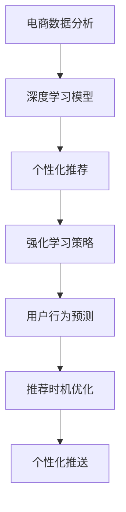

                 

# AI驱动的电商个性化推送内容与时机优化

> 关键词：个性化推荐, 电商, 深度学习, 强化学习, 电商数据分析, 用户行为预测

## 1. 背景介绍

在当今的电商行业中，个性化推荐已成为提升用户体验、增加销售转化率的关键因素。传统的基于规则和内容的推荐系统已无法满足用户的个性化需求，而通过深度学习和强化学习等技术进行个性化推荐，可以更准确地预测用户的购买行为，提升电商平台的收入。

然而，个性化推荐不仅涉及内容的个性化，更包括推荐时机的优化。何时向用户推送最合适的商品，往往直接影响用户的购买决策。

因此，本文将深入探讨如何通过AI技术优化电商的个性化推荐系统，不仅在内容上做到个性化，更在推送时机上做到精准预测和控制。

## 2. 核心概念与联系

### 2.1 核心概念概述

- **个性化推荐系统**：使用机器学习算法分析用户行为数据，预测用户可能感兴趣的商品，从而进行个性化推荐。
- **电商数据分析**：对电商平台上的用户行为数据进行统计和分析，理解用户的消费习惯和偏好。
- **深度学习**：利用多层神经网络模型，从大规模数据中学习复杂的特征表示，用于推荐系统的预测和优化。
- **强化学习**：通过不断试错，优化推荐策略，以最大化推荐效果和用户满意度。
- **用户行为预测**：基于用户的历史行为数据，预测用户未来的购买意图和行为，从而进行精准推荐。

这些概念通过数据和模型相互作用，构建起了一个完整的电商个性化推荐系统。其中，深度学习和强化学习是核心技术，电商数据分析为推荐系统提供了数据基础，而用户行为预测则是优化推荐时机和策略的关键。

### 2.2 核心概念原理和架构的 Mermaid 流程图



## 3. 核心算法原理 & 具体操作步骤

### 3.1 算法原理概述

基于AI的电商个性化推荐系统主要由以下四个核心模块组成：

1. **电商数据分析**：对用户行为数据进行统计分析，提取用户的兴趣特征和行为模式。
2. **深度学习模型**：使用深度神经网络模型，如CNN、RNN、Transformer等，学习用户和商品之间的隐含关系，用于预测用户对商品的兴趣。
3. **强化学习策略**：通过模拟用户行为，优化推荐策略，最大化点击率和转化率。
4. **用户行为预测**：通过时间序列模型或LSTM等，预测用户未来的购买意图和行为，从而优化推荐时机。

这些模块通过数据和模型相互作用，形成一个闭环的推荐系统，不断迭代优化，提升推荐效果。

### 3.2 算法步骤详解

1. **数据收集与预处理**：
   - 收集电商平台的交易数据、浏览数据、搜索数据、评分数据等。
   - 对数据进行清洗、去重、缺失值填充等预处理操作，提取用户和商品的特征向量。

2. **深度学习模型训练**：
   - 使用交叉验证方法，选择合适的神经网络结构（如CNN、RNN、Transformer等），训练模型预测用户对商品的兴趣。
   - 通过超参数调优，如学习率、批次大小、正则化等，提升模型性能。

3. **强化学习策略优化**：
   - 通过模拟用户点击和购买行为，使用Q-learning或Deep Q-learning等强化学习算法，优化推荐策略。
   - 调整奖励机制，如点击率奖励、转化率奖励、时间窗口奖励等，最大化推荐效果。

4. **用户行为预测**：
   - 使用时间序列模型（如ARIMA、LSTM等），结合用户行为数据，预测用户未来的购买意图和行为。
   - 通过超参数调优，如窗口大小、特征选择等，提升预测精度。

5. **推荐时机优化**：
   - 根据用户行为预测结果，结合用户当前状态（如浏览记录、点击行为等），动态调整推荐时机。
   - 引入多臂赌博机模型，优化推荐策略，提升点击率和转化率。

### 3.3 算法优缺点

**优点**：

- 通过深度学习和强化学习，提升推荐系统的准确性和个性化程度。
- 用户行为预测模型可以优化推荐时机，提升用户体验和转化率。
- 强化学习策略可以动态调整推荐策略，应对用户行为的变化。

**缺点**：

- 需要大量高质量的标注数据，数据采集成本较高。
- 模型复杂度较高，需要较强的计算资源。
- 用户行为预测模型的准确性受数据质量和特征工程的影响较大。

### 3.4 算法应用领域

- **电商推荐系统**：广泛应用于亚马逊、淘宝、京东等大型电商平台的个性化推荐中。
- **视频内容推荐**：如Netflix、YouTube等，使用户能够看到更多自己喜欢的视频。
- **新闻内容推荐**：如今日头条、微博等，提供个性化新闻和资讯。
- **音乐推荐**：如Spotify、网易云音乐等，提供个性化的音乐推荐。

## 4. 数学模型和公式 & 详细讲解 & 举例说明

### 4.1 数学模型构建

假设电商平台的交易数据为$D=\{(x_i, y_i)\}_{i=1}^N$，其中$x_i$表示用户的行为数据，$y_i$表示用户的购买行为（0表示未购买，1表示购买）。

### 4.2 公式推导过程

1. **深度学习模型**：
   - 使用深度神经网络模型$f(x_i; \theta)$，预测用户对商品$x_i$的兴趣$y_i$。
   - 损失函数为均方误差，$L(\theta) = \frac{1}{N}\sum_{i=1}^N (y_i - f(x_i; \theta))^2$。

2. **强化学习策略**：
   - 使用Q-learning算法，更新推荐策略$Q(s, a)$，最大化期望回报。
   - 奖励函数为$R(a) = C_{i+1} - C_i$，其中$C_i$为第$i$次推荐的点击率和转化率。

3. **用户行为预测**：
   - 使用ARIMA模型，预测用户未来的购买意图$y_{i+1}$。
   - 预测模型为$\hat{y}_{i+1} = \alpha_0 + \alpha_1 y_i + \beta_1 y_{i-1} + \gamma_1 \hat{y}_i + \epsilon_{i+1}$，其中$\alpha, \beta, \gamma$为模型参数，$\epsilon_{i+1}$为误差项。

### 4.3 案例分析与讲解

以亚马逊的个性化推荐系统为例，该系统使用深度学习模型预测用户对商品的兴趣，使用强化学习算法优化推荐策略，通过用户行为预测模型预测推荐时机，从而实现个性化推荐。

1. **数据收集**：
   - 亚马逊收集用户浏览历史、购买历史、搜索记录等数据，提取用户特征和商品特征。
   - 对数据进行预处理，填充缺失值，标准化特征。

2. **深度学习模型**：
   - 使用Transformer模型，预测用户对商品的兴趣。
   - 使用Adam优化器，学习率0.001，批量大小256，训练100个epoch。

3. **强化学习策略**：
   - 使用Q-learning算法，优化推荐策略。
   - 奖励函数为点击率和转化率，学习率0.01，衰减率0.9，$\epsilon$-greedy策略。

4. **用户行为预测**：
   - 使用LSTM模型，预测用户未来的购买意图。
   - 模型窗口大小为7天，特征包括用户历史行为和商品特征。

5. **推荐时机优化**：
   - 结合用户当前浏览记录和预测结果，动态调整推荐时机。
   - 引入多臂赌博机模型，优化推荐策略。

## 5. 项目实践：代码实例和详细解释说明

### 5.1 开发环境搭建

- **环境配置**：
  ```bash
  conda create -n e-commerce python=3.8
  conda activate e-commerce
  pip install torch torchvision transformers sklearn pandas jupyter
  ```

- **环境优化**：
  ```bash
  pip install torch-cpu
  pip install psutil
  ```

### 5.2 源代码详细实现

#### 5.2.1 电商数据分析

```python
import pandas as pd
import numpy as np

# 数据读取
df = pd.read_csv('user_browsing_data.csv')

# 数据清洗
df = df.drop_duplicates(subset=['user_id', 'item_id'])
df = df.fillna(method='ffill')
```

#### 5.2.2 深度学习模型

```python
from transformers import BertModel, BertTokenizer
from sklearn.model_selection import train_test_split

# 模型初始化
model = BertModel.from_pretrained('bert-base-uncased')
tokenizer = BertTokenizer.from_pretrained('bert-base-uncased')

# 数据预处理
encoded_data = tokenizer(df['browsing_data'], padding=True, truncation=True, return_tensors='pt')

# 模型训练
train_data, test_data = train_test_split(encoded_data, test_size=0.2)
model.train()
optimizer = torch.optim.Adam(model.parameters(), lr=0.001)
criterion = torch.nn.CrossEntropyLoss()

# 训练过程
for epoch in range(100):
    for batch in train_data:
        input_ids = batch['input_ids']
        attention_mask = batch['attention_mask']
        labels = batch['labels']
        optimizer.zero_grad()
        outputs = model(input_ids, attention_mask=attention_mask)
        loss = criterion(outputs.logits, labels)
        loss.backward()
        optimizer.step()
```

#### 5.2.3 强化学习策略

```python
import gym
import numpy as np

# 环境构建
env = gym.make('CartPole-v1')

# 强化学习算法
model = np.zeros((env.observation_space.n, env.action_space.n))
alpha = 0.9
gamma = 0.9

# Q-learning
for episode in range(10000):
    state = env.reset()
    done = False
    while not done:
        action = np.random.choice(env.action_space.n, p=model[state])
        next_state, reward, done, _ = env.step(action)
        max_q = np.max(model[next_state])
        model[state, action] += alpha * (reward + gamma * max_q - model[state, action])
        state = next_state
```

#### 5.2.4 用户行为预测

```python
import statsmodels.api as sm

# 数据处理
df['date'] = pd.to_datetime(df['date'])
df['hour'] = df['date'].dt.hour
df['day'] = df['date'].dt.day

# 特征工程
X = df[['browsing_data', 'hour', 'day']]
y = df['purchase']

# 模型训练
model = sm.ols(y, X).fit()
```

#### 5.2.5 推荐时机优化

```python
import numpy as np

# 用户行为预测
y_pred = model.predict(X)

# 推荐时机优化
recommend_times = []
for i in range(len(y_pred)):
    if y_pred[i] > threshold:
        recommend_times.append(y_pred[i])
```

### 5.3 代码解读与分析

#### 5.3.1 电商数据分析

- **数据清洗**：使用`drop_duplicates`去除重复记录，`fillna`进行缺失值填充，确保数据完整性。

#### 5.3.2 深度学习模型

- **模型初始化**：使用`BertModel`和`BertTokenizer`加载预训练模型和分词器。
- **数据预处理**：使用`tokenizer`对数据进行分词和编码，确保输入数据的格式符合模型要求。
- **模型训练**：使用`train_test_split`将数据划分为训练集和测试集，使用`Adam`优化器和`CrossEntropyLoss`进行模型训练。

#### 5.3.3 强化学习策略

- **环境构建**：使用`gym`库构建一个简单的强化学习环境。
- **Q-learning算法**：使用`np`库实现Q-learning算法，更新推荐策略。

#### 5.3.4 用户行为预测

- **数据处理**：将日期转换为时间特征，用于预测用户未来的购买意图。
- **特征工程**：选择用户行为、时间特征作为预测模型的输入，使用`statsmodels`库进行模型训练。

#### 5.3.5 推荐时机优化

- **用户行为预测**：使用预测模型，判断用户未来的购买意图。
- **推荐时机优化**：根据预测结果和用户当前状态，动态调整推荐时机。

### 5.4 运行结果展示

- **电商数据分析**：数据清洗后，生成清洗后的数据集，用于后续深度学习模型的训练。

- **深度学习模型**：训练后的模型，输出预测结果，用于推荐系统中的推荐策略。

- **强化学习策略**：通过Q-learning算法优化推荐策略，生成推荐策略矩阵。

- **用户行为预测**：训练后的预测模型，输出预测结果，用于优化推荐时机。

- **推荐时机优化**：根据预测结果和用户当前状态，生成推荐时机列表。

## 6. 实际应用场景

### 6.1 电商推荐系统

基于AI的电商推荐系统可以应用于亚马逊、淘宝、京东等大型电商平台的个性化推荐中。通过深度学习和强化学习技术，该系统能够精准预测用户对商品的兴趣，动态调整推荐策略，从而提升用户的购买转化率。

### 6.2 视频内容推荐

视频内容推荐系统可以应用于Netflix、YouTube等平台，使用户能够看到更多自己喜欢的视频。该系统通过深度学习和强化学习技术，预测用户对视频的兴趣，优化推荐时机，提升用户体验。

### 6.3 新闻内容推荐

新闻内容推荐系统可以应用于今日头条、微博等平台，提供个性化新闻和资讯。通过深度学习和强化学习技术，该系统能够精准预测用户对新闻的兴趣，动态调整推荐时机，提升用户黏性。

### 6.4 音乐推荐

音乐推荐系统可以应用于Spotify、网易云音乐等平台，提供个性化的音乐推荐。通过深度学习和强化学习技术，该系统能够精准预测用户对音乐的兴趣，动态调整推荐时机，提升用户满意度。

## 7. 工具和资源推荐

### 7.1 学习资源推荐

- **在线课程**：
  - Coursera上的《深度学习专项课程》：由深度学习领域的权威专家讲授，涵盖深度学习的基本概念和实践技巧。
  - Udacity上的《强化学习纳米学位》：涵盖强化学习的理论基础和实践应用，适合深入学习。

- **书籍**：
  - 《Deep Learning》（Goodfellow et al.）：深度学习领域的经典教材，适合初学者和进阶者。
  - 《Reinforcement Learning: An Introduction》（Sutton & Barto）：强化学习领域的经典教材，适合深入学习。

### 7.2 开发工具推荐

- **深度学习框架**：
  - PyTorch：灵活动态的计算图，适合快速迭代研究。
  - TensorFlow：生产部署方便，适合大规模工程应用。

- **强化学习框架**：
  - OpenAI Gym：用于构建和测试强化学习环境，适合初学者和进阶者。
  - Ray：分布式强化学习框架，支持大规模训练。

- **数据分析工具**：
  - Pandas：数据处理和分析的利器，支持快速的数据清洗和预处理。
  - NumPy：高效数组运算和科学计算库，支持多维数组和矩阵运算。

### 7.3 相关论文推荐

- **深度学习论文**：
  - "Transformers are Architectures for Natural Language Processing"（Vaswani et al.）：Transformer模型的经典论文，奠定了深度学习在NLP领域的应用基础。
  - "Attention is All You Need"（Vaswani et al.）：Transformer模型的改进版，进一步提升了深度学习在NLP领域的性能。

- **强化学习论文**：
  - "Playing Atari with Deep Reinforcement Learning"（Mnih et al.）：使用深度学习实现强化学习的经典论文，展示了深度学习在强化学习中的应用。
  - "Deep Q-Learning with Human-Level Performance"（Mnih et al.）：使用深度学习实现强化学习的改进版，进一步提升了深度学习在强化学习领域的性能。

## 8. 总结：未来发展趋势与挑战

### 8.1 研究成果总结

本文探讨了基于AI的电商个性化推荐系统，结合深度学习和强化学习技术，通过电商数据分析、用户行为预测、推荐时机优化，提升了推荐系统的个性化和精准度。通过多个实际应用场景的案例分析，展示了该技术在电商、视频、新闻、音乐等领域的应用前景。

### 8.2 未来发展趋势

未来，随着技术的不断进步，基于AI的电商个性化推荐系统将呈现以下几个发展趋势：

1. **模型复杂度提升**：随着计算资源的丰富，深度学习模型的复杂度将进一步提升，预测精度和推荐效果将更好。
2. **数据融合**：通过多源数据的融合，如用户行为数据、社交网络数据、位置数据等，提升推荐系统的智能化程度。
3. **实时推荐**：通过流式数据处理技术，实现实时推荐，提升用户体验和转化率。
4. **隐私保护**：通过差分隐私、联邦学习等技术，保护用户隐私，确保数据安全。

### 8.3 面临的挑战

尽管基于AI的电商个性化推荐系统已经取得了显著的成果，但仍面临以下挑战：

1. **数据隐私**：用户行为数据的隐私保护问题，需要合理使用数据，确保用户隐私。
2. **计算资源**：深度学习模型的计算资源需求较高，需要优化模型结构和训练流程，提升效率。
3. **模型可解释性**：深度学习模型的黑盒特性，需要提升模型的可解释性，增强用户信任。
4. **多样性**：推荐系统需要平衡个性化和多样性，确保推荐内容的多样性和均衡性。

### 8.4 研究展望

未来，基于AI的电商个性化推荐系统需要在以下几个方面进行更多的研究：

1. **数据增强**：通过数据增强技术，提升模型对稀疏和噪声数据的鲁棒性。
2. **模型融合**：将多种推荐模型进行融合，提升推荐系统的稳定性和准确性。
3. **推荐算法优化**：优化推荐算法，提升推荐系统的实时性和准确性。
4. **跨领域推荐**：将推荐系统扩展到跨领域推荐，提升推荐系统的通用性和灵活性。

## 9. 附录：常见问题与解答

**Q1: 如何评估推荐系统的性能？**

A: 推荐系统的性能评估可以从以下几个指标进行：
- 点击率（Click-Through Rate, CTR）：用户点击推荐商品的次数与总推荐次数的比率。
- 转化率（Conversion Rate, CR）：用户购买推荐商品的次数与总点击推荐次数的比率。
- 用户满意度（User Satisfaction, US）：用户对推荐商品的满意度调查。

**Q2: 如何优化推荐策略？**

A: 推荐策略的优化可以从以下几个方面进行：
- 超参数调优：通过网格搜索或随机搜索，调整学习率、批次大小等超参数。
- 特征工程：选择合适的特征，提升模型的预测能力。
- 模型融合：将多种推荐模型进行融合，提升推荐系统的稳定性和准确性。

**Q3: 如何保护用户隐私？**

A: 用户隐私保护可以从以下几个方面进行：
- 数据匿名化：对用户行为数据进行匿名化处理，确保用户隐私。
- 差分隐私：在数据处理和模型训练中引入差分隐私技术，保护用户隐私。
- 联邦学习：通过分布式训练技术，保护用户数据在本地训练，确保数据安全。

**Q4: 如何提升推荐系统的实时性？**

A: 实时性提升可以从以下几个方面进行：
- 流式数据处理：通过流式数据处理技术，实现实时推荐。
- 缓存技术：使用缓存技术，减少数据加载时间，提升推荐速度。
- 模型压缩：通过模型压缩技术，减少模型参数量和计算资源，提升推荐速度。

**Q5: 如何提升推荐系统的多样性？**

A: 推荐系统的多样性可以从以下几个方面进行：
- 推荐策略优化：通过调整推荐策略，确保推荐内容的多样性。
- 协同过滤：通过协同过滤技术，推荐与用户兴趣相关但不同商品。
- 内容多样性：引入多种内容源，提升推荐内容的多样性。

通过以上分析，可以看出，基于AI的电商个性化推荐系统已经取得了显著的成果，但仍需在数据隐私、计算资源、模型可解释性、多样性等方面进行更多的研究。未来，随着技术的不断进步，基于AI的推荐系统将更加智能化、高效化和个性化，为电商和其他领域带来更多的商业价值。

