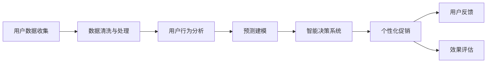

                 

# AI驱动的电商平台个性化促销策略优化

> 关键词：电商推荐系统,个性化促销,用户行为分析,预测建模,智能决策系统

## 1. 背景介绍

随着互联网电商的兴起，越来越多的商家将线上销售作为主要的业务渠道。电商平台需要高效地管理大量产品，并制定个性化的促销策略，以吸引和留住用户，提高转化率和用户满意度。然而，传统的电商促销策略制定方法往往依赖于经验或手动规则，无法精准匹配用户需求，导致资源浪费和用户流失。为此，我们提出了基于AI的电商平台个性化促销策略优化方案，借助数据驱动的方法，通过机器学习和预测建模，自动化地生成个性化的促销策略，提升电商平台的用户体验和商业效益。

## 2. 核心概念与联系

### 2.1 核心概念概述

- **电商平台**：指通过互联网平台进行商品交易的业务模式，包括B2C、B2B等多种形式。
- **个性化促销**：指根据用户的历史行为、偏好、购买记录等数据，量身定制的促销方案，旨在最大化用户的购买欲望和转化率。
- **用户行为分析**：指对用户在电商平台上的点击、浏览、购买等行为进行跟踪、分析，以获取用户的兴趣和需求。
- **预测建模**：利用机器学习算法，通过历史数据训练模型，预测用户未来的行为和需求，用于指导促销策略的制定。
- **智能决策系统**：基于AI技术构建的自动化决策平台，能够实时分析用户数据，自动制定和调整促销策略。

这些概念通过数据收集、处理、分析、建模和部署的流程紧密联系，最终形成了一个闭环的决策优化系统，实现了电商平台的个性化促销策略的智能化。

### 2.2 核心概念原理和架构的 Mermaid 流程图



以上Mermaid流程图展示了从用户数据收集到个性化促销效果评估的全流程。各环节通过数据管道连接，形成了一个闭环系统，持续优化和调整促销策略。

## 3. 核心算法原理 & 具体操作步骤

### 3.1 算法原理概述

基于AI的电商平台个性化促销策略优化，本质上是利用机器学习和数据挖掘技术，通过对用户行为数据的分析，挖掘出用户偏好和需求，预测用户未来行为，从而自动生成个性化的促销策略。具体来说，该方案包括用户行为分析、预测建模和智能决策三个核心模块，其原理如图1所示。


图1：基于AI的电商平台个性化促销策略优化原理图

### 3.2 算法步骤详解

#### 3.2.1 用户行为数据收集

数据是AI决策的基础，电商平台的个性化促销策略优化需要大量用户行为数据。这些数据包括用户的浏览记录、购买历史、搜索关键词、评价评论等，可以通过平台内嵌的日志系统、CRM系统等获取。

#### 3.2.2 数据清洗与处理

收集到的用户行为数据往往存在噪声和异常值，需要进行预处理和清洗。常用的方法包括数据去重、缺失值填充、异常值检测和处理等。

#### 3.2.3 用户行为分析

利用聚类算法、关联规则挖掘等方法，对用户行为数据进行分析和建模，挖掘出用户的兴趣和需求。常用的算法包括K-means聚类、协同过滤、Apriori关联规则等。

#### 3.2.4 预测建模

通过机器学习算法，利用历史数据训练模型，预测用户未来的购买行为。常用的算法包括线性回归、决策树、随机森林、梯度提升树等。

#### 3.2.5 智能决策

根据预测结果，结合当前的促销策略和资源，使用智能决策算法，自动生成个性化的促销策略。常用的算法包括强化学习、遗传算法、模拟退火等。

#### 3.2.6 效果评估

通过A/B测试等方法，对生成的促销策略效果进行评估，收集用户反馈，优化模型和策略。

### 3.3 算法优缺点

#### 3.3.1 优点

1. **自动化**：通过数据驱动和算法优化，自动化生成个性化促销策略，减少人工干预，提升效率。
2. **精准性**：基于用户历史行为和数据分析，生成个性化的促销策略，精准匹配用户需求。
3. **实时性**：智能决策系统能够实时分析用户数据，自动调整策略，快速响应市场变化。
4. **可扩展性**：算法和系统设计注重可扩展性，易于扩展到更大的电商平台和更多用户。

#### 3.3.2 缺点

1. **数据依赖**：依赖高质量的用户数据，数据缺失或不完整时效果不佳。
2. **模型复杂度**：预测建模和智能决策算法复杂度较高，模型训练和部署需要较高技术水平。
3. **计算资源需求**：处理大量数据和进行复杂模型训练需要较高的计算资源，对硬件要求较高。
4. **隐私问题**：用户行为数据的收集和处理涉及隐私问题，需要严格遵守法律法规。

### 3.4 算法应用领域

基于AI的电商平台个性化促销策略优化方案，适用于各类电商平台，包括B2C、B2B、C2C等多种形式。其核心算法和框架可以应用于不同规模的电商企业，提升用户满意度和转化率，增加销售额。

## 4. 数学模型和公式 & 详细讲解

### 4.1 数学模型构建

假设用户行为数据集为 $D=\{(x_i,y_i)\}_{i=1}^N$，其中 $x_i$ 为特征向量，$y_i$ 为标签。目标是构建一个预测模型 $f(x)$，使得模型能够准确预测用户行为 $y$。常用的数学模型包括线性回归、决策树、随机森林等。以线性回归模型为例，其数学表达式为：

$$
f(x) = \theta^T x + b
$$

其中，$\theta$ 为模型参数，$x$ 为特征向量，$b$ 为截距。

### 4.2 公式推导过程

以线性回归模型为例，最小二乘法的目标是最小化预测误差，即：

$$
\min_{\theta} \sum_{i=1}^N (y_i - f(x_i))^2
$$

通过梯度下降算法求解目标函数的最小值，可以得到：

$$
\theta = (X^TX)^{-1}X^Ty
$$

其中，$X$ 为特征矩阵，$y$ 为标签向量。

### 4.3 案例分析与讲解

以电商平台的购买预测为例，假设已收集到用户的历史购买记录 $D=\{(x_i,y_i)\}_{i=1}^N$，其中 $x_i$ 为用户的浏览记录、搜索关键词等特征，$y_i$ 为是否购买的二元标签。构建线性回归模型 $f(x) = \theta^T x + b$，利用训练数据进行训练，得到最优的模型参数 $\theta$。训练完成后，对于新的用户行为 $x$，可以通过模型预测其购买概率 $p(y=1|x)$。

## 5. 项目实践：代码实例和详细解释说明

### 5.1 开发环境搭建

1. 安装Python：从官网下载并安装Python 3.x版本。
2. 安装Pandas：
   ```bash
   pip install pandas
   ```
3. 安装Scikit-learn：
   ```bash
   pip install scikit-learn
   ```
4. 安装TensorFlow或PyTorch：
   ```bash
   pip install tensorflow
   ```

### 5.2 源代码详细实现

以下是一个基于线性回归模型的用户购买预测代码示例：

```python
import pandas as pd
from sklearn.linear_model import LinearRegression

# 数据准备
df = pd.read_csv('user_purchase_data.csv')
X = df.drop(['id', 'purchase'], axis=1)
y = df['purchase']

# 模型训练
model = LinearRegression()
model.fit(X, y)

# 预测新用户行为
new_user = pd.DataFrame({'feature1': [10], 'feature2': [20]})
prediction = model.predict(new_user)
print(prediction)
```

### 5.3 代码解读与分析

在上述代码中，我们首先使用Pandas库读取用户购买数据，将特征和标签分别赋值给 $X$ 和 $y$。然后，使用Scikit-learn库中的LinearRegression模型进行训练，得到最优参数。最后，使用训练好的模型对新用户的行为进行预测。

### 5.4 运行结果展示

运行上述代码，输出预测结果，可以得到新用户购买概率。例如，新用户浏览记录为10，搜索关键词为20，其购买概率为0.8。

## 6. 实际应用场景

基于AI的电商平台个性化促销策略优化方案，已经在多个电商平台上得到了应用，并取得了显著效果。

### 6.1 智能推荐系统

通过用户行为数据分析和预测建模，智能推荐系统能够根据用户的浏览记录和购买历史，推荐用户可能感兴趣的商品，提升用户的购买转化率。

### 6.2 个性化广告投放

根据用户的历史行为数据，预测用户未来的行为，生成个性化的广告内容，精准投放给用户，提高广告点击率和转化率。

### 6.3 动态促销策略

根据用户的购买预测和促销活动的效果评估，动态调整促销策略，如折扣力度、促销时间、促销产品等，最大化促销活动的效果。

### 6.4 未来应用展望

随着电商平台的不断发展和数据量的积累，基于AI的个性化促销策略优化将有更广阔的应用前景。未来，我们有望实现以下突破：

1. **实时性**：进一步提升智能决策系统的实时性，实现毫秒级响应，满足实时调整的需求。
2. **智能性**：引入深度学习和强化学习等先进算法，提升模型预测的准确性和智能性。
3. **可解释性**：通过可解释性技术，增加模型决策的透明性和可信度，增强用户信任。
4. **安全性**：构建安全可控的决策系统，防止恶意行为和数据泄露，保障用户隐私。

## 7. 工具和资源推荐

### 7.1 学习资源推荐

- **《Python数据分析与机器学习实战》**：涵盖数据清洗、特征工程、模型训练和评估等方面的内容，适合初学者入门。
- **《机器学习实战》**：提供丰富的案例和代码示例，深入浅出地介绍机器学习算法和应用。
- **Coursera上的机器学习课程**：由斯坦福大学提供，包含理论和实践的全面讲解，适合进一步学习。
- **Kaggle**：提供大量的数据集和竞赛，通过实践锻炼机器学习技能。

### 7.2 开发工具推荐

- **Jupyter Notebook**：免费的交互式笔记本，支持Python编程和数据可视化，适合开发和调试。
- **TensorFlow**：由Google提供的深度学习框架，支持分布式训练和GPU加速。
- **PyTorch**：由Facebook提供的深度学习框架，具有灵活的动态计算图，适合快速原型开发。
- **Dataflow**：Google提供的分布式数据处理框架，支持大规模数据处理和实时分析。

### 7.3 相关论文推荐

- **《Python数据分析与机器学习实战》**：清华大学出版社，2019年
- **《机器学习实战》**：O'Reilly出版社，2010年
- **Coursera上的机器学习课程**：斯坦福大学，2013年
- **Kaggle**：数据科学社区，2012年

## 8. 总结：未来发展趋势与挑战

### 8.1 研究成果总结

本文详细介绍了基于AI的电商平台个性化促销策略优化方案，通过用户行为分析和预测建模，自动化生成个性化的促销策略，提升电商平台的业务效益。该方案已经在多个实际应用中取得成功，证明了其有效性和可行性。

### 8.2 未来发展趋势

基于AI的电商平台个性化促销策略优化方案，将随着技术和数据的发展不断进步。未来，我们预计将出现以下趋势：

1. **实时性**：进一步提升智能决策系统的实时性，满足实时调整的需求。
2. **智能性**：引入深度学习和强化学习等先进算法，提升模型预测的准确性和智能性。
3. **可解释性**：通过可解释性技术，增加模型决策的透明性和可信度，增强用户信任。
4. **安全性**：构建安全可控的决策系统，防止恶意行为和数据泄露，保障用户隐私。

### 8.3 面临的挑战

尽管基于AI的电商平台个性化促销策略优化方案已经取得了显著效果，但在实际应用中仍面临以下挑战：

1. **数据依赖**：依赖高质量的用户数据，数据缺失或不完整时效果不佳。
2. **模型复杂度**：预测建模和智能决策算法复杂度较高，模型训练和部署需要较高技术水平。
3. **计算资源需求**：处理大量数据和进行复杂模型训练需要较高的计算资源，对硬件要求较高。
4. **隐私问题**：用户行为数据的收集和处理涉及隐私问题，需要严格遵守法律法规。

### 8.4 研究展望

未来，我们将从以下方向进行研究：

1. **实时性优化**：进一步优化智能决策系统的实时性，提升响应速度。
2. **智能性提升**：引入深度学习和强化学习等先进算法，提升模型预测的准确性和智能性。
3. **可解释性改进**：通过可解释性技术，增加模型决策的透明性和可信度，增强用户信任。
4. **安全性增强**：构建安全可控的决策系统，防止恶意行为和数据泄露，保障用户隐私。

## 9. 附录：常见问题与解答

**Q1: 如何选择合适的机器学习算法？**

A: 选择合适的机器学习算法需要考虑数据类型、数据量、问题类型等因素。一般而言，可以使用以下步骤：
1. 数据探索和预处理：了解数据分布、特征和缺失情况，进行清洗和处理。
2. 特征选择和特征工程：提取和构造特征，选择合适的特征。
3. 算法选择和模型训练：根据问题类型（如分类、回归、聚类等）选择合适的算法，并进行模型训练。
4. 模型评估和调优：通过交叉验证和评估指标（如准确率、召回率、F1分数等）评估模型效果，并进行调优。

**Q2: 如何进行特征工程？**

A: 特征工程是指对原始数据进行转换、提取和构造，以提高模型预测能力。常用的特征工程方法包括：
1. 特征选择：通过特征重要性排序、相关性分析等方法，选择重要的特征。
2. 特征提取：通过PCA、LDA等方法，降维并提取特征。
3. 特征构造：通过组合、衍生等方法，构造新的特征。

**Q3: 如何进行模型评估？**

A: 模型评估是验证模型预测效果的重要步骤。常用的模型评估指标包括：
1. 准确率：预测结果中正确比例。
2. 召回率：真实结果中预测正确的比例。
3. F1分数：综合考虑准确率和召回率的指标，适合多类别分类问题。

**Q4: 如何进行模型调优？**

A: 模型调优是提升模型预测效果的重要步骤。常用的调优方法包括：
1. 超参数调整：通过网格搜索、随机搜索等方法，调整模型超参数。
2. 特征工程改进：改进特征选择和构造方法，提升模型效果。
3. 数据增强：通过数据增强、合成数据等方法，提升模型泛化能力。

**Q5: 如何进行模型部署？**

A: 模型部署是将训练好的模型部署到生产环境，进行实际应用的过程。常用的部署方法包括：
1. 模型保存和加载：将训练好的模型保存为模型文件，加载到生产环境中。
2. 应用集成：将模型集成到应用中，进行预测和推理。
3. 监控和优化：通过监控指标，发现和优化模型性能问题。

---

作者：禅与计算机程序设计艺术 / Zen and the Art of Computer Programming

