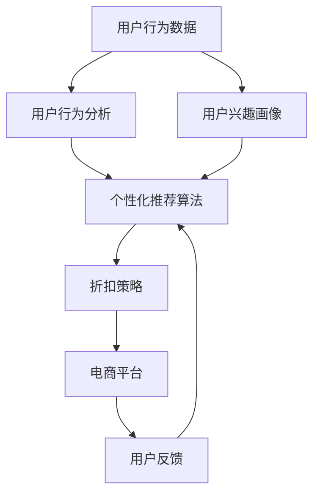

                 

# AI驱动的电商平台个性化折扣策略

> 关键词：AI驱动, 个性化折扣, 电商平台, 推荐算法, 用户行为分析, 反欺诈, 混合推荐

## 1. 背景介绍

### 1.1 问题由来
随着电商市场的竞争加剧，平台商家和用户之间的互动日益频繁，个性化折扣策略成为提升用户体验和商家销售业绩的关键因素。电商平台需根据用户行为和历史数据，设计合适的个性化折扣方案，以促使用户购买决策。传统方法基于规则和统计分析，难以动态响应复杂多变的市场行为。人工智能技术的引入，特别是机器学习和深度学习的应用，为个性化折扣策略提供了新的解决方案。

### 1.2 问题核心关键点
个性化折扣的核心是理解用户的真实需求和行为模式，根据这些信息进行动态定价和促销策略设计。AI驱动的个性化折扣策略，通过学习用户的购物行为、偏好和交易数据，预测用户对不同折扣的响应，实时调整折扣力度和推广策略，从而实现更高的转化率和销售额。

## 2. 核心概念与联系

### 2.1 核心概念概述

为更好地理解AI驱动的个性化折扣策略，本节将介绍几个关键概念：

- **个性化推荐算法**：利用用户的历史行为和特征，推荐符合用户兴趣的商品。常用的推荐算法包括协同过滤、基于内容的推荐、矩阵分解等。

- **用户行为分析**：通过分析用户在平台上的浏览、点击、购买等行为数据，识别用户的兴趣和需求。

- **混合推荐系统**：结合基于内容的推荐和基于协同过滤的推荐，充分发挥两种方法的优点，提高推荐效果。

- **深度学习模型**：包括神经网络、卷积神经网络、循环神经网络等，用于构建复杂的推荐模型，从高维度数据中提取有用的特征。

- **反欺诈技术**：通过检测异常行为和欺诈交易，保护电商平台的利益，提高用户信任度。

- **反欺诈模型**：利用机器学习算法，检测和防止各种欺诈行为，如虚假交易、刷单等。

这些核心概念通过商家的促销策略和用户行为数据，共同构成了一个电商平台的个性化折扣系统，从而提升用户体验和商家销售业绩。

### 2.2 核心概念原理和架构的 Mermaid 流程图



这个流程图展示了AI驱动的个性化折扣策略的核心流程：

1. 从用户行为数据中分析用户兴趣。
2. 利用个性化推荐算法构建用户兴趣画像。
3. 根据用户画像设计个性化折扣策略。
4. 在电商平台上实施折扣策略，并收集用户反馈。
5. 不断迭代优化推荐和折扣策略。

## 3. 核心算法原理 & 具体操作步骤

### 3.1 算法原理概述

AI驱动的个性化折扣策略，本质上是一个机器学习问题，通过学习用户的购物行为和偏好，预测用户对不同折扣的响应，从而设计最优的折扣方案。其核心思想是：利用历史数据训练一个模型，预测用户在不同折扣下的购买概率，然后选择能够最大化预期收益的折扣策略。

形式化地，假设用户对商品 $i$ 的购买概率为 $P(i|D)$，其中 $D$ 为用户的兴趣画像。则个性化折扣的目标是最大化预期收益 $E$：

$$
E = \sum_i P(i|D) \cdot p(i)
$$

其中 $p(i)$ 为商品 $i$ 的利润。

### 3.2 算法步骤详解

基于AI驱动的个性化折扣策略，一般包括以下几个关键步骤：

**Step 1: 数据准备与特征工程**

- 收集用户的浏览、点击、购买等行为数据，以及商品的属性、价格、销量等信息。
- 对数据进行清洗和预处理，去除噪声和异常值。
- 设计合适的特征，如用户特征、商品特征、时间特征等，用于训练推荐模型。

**Step 2: 用户画像构建**

- 使用协同过滤、矩阵分解等方法，构建用户的兴趣画像，表示用户的潜在偏好。
- 可以引入深度学习模型，如CNN、RNN、LSTM等，学习更复杂的用户行为模式。

**Step 3: 推荐模型训练**

- 选择适当的推荐算法，如基于内容的推荐、协同过滤等。
- 使用历史数据训练推荐模型，预测用户对不同商品的兴趣程度。
- 定期更新模型，以反映用户兴趣的变化。

**Step 4: 折扣策略设计**

- 根据推荐模型预测的用户购买概率，设计个性化折扣策略。
- 选择合适的折扣力度，平衡成本和收益。
- 设计多轮折扣，如首单折扣、回购折扣等，以激励用户复购。

**Step 5: 实施与反馈优化**

- 在电商平台上实施个性化折扣策略，观察用户行为和销售数据。
- 收集用户反馈和销售结果，进行效果评估。
- 根据反馈调整模型参数和折扣策略，不断优化推荐和折扣方案。

### 3.3 算法优缺点

AI驱动的个性化折扣策略具有以下优点：

1. **高效精准**：通过机器学习模型，实时动态调整折扣策略，快速响应市场变化。
2. **个性化推荐**：能够根据用户的具体需求和行为，提供定制化的折扣方案，提升用户满意度。
3. **成本优化**：通过预测购买概率，精准投放折扣，减少无效折扣和成本浪费。

同时，该方法也存在以下局限性：

1. **数据需求高**：需要大量标注数据进行训练，收集和处理数据成本较高。
2. **模型复杂**：深度学习模型的训练和优化较为复杂，需要较强的计算资源。
3. **解释性差**：黑盒模型难以解释其内部工作机制，难以向用户解释折扣策略的依据。
4. **安全风险**：模型可能学习到异常行为模式，导致欺诈和滥用。

尽管存在这些局限性，AI驱动的个性化折扣策略仍然是大数据分析和机器学习在电商平台应用的重要手段，能够显著提升销售业绩和用户体验。

### 3.4 算法应用领域

AI驱动的个性化折扣策略在电商平台的各个环节都有广泛应用：

- **商品推荐**：利用个性化推荐算法，向用户推荐符合其兴趣的商品，并结合折扣策略进行推广。
- **价格优化**：根据用户行为和市场数据，动态调整商品价格，确保价格竞争力。
- **活动促销**：设计多轮折扣和促销活动，吸引用户参与，提高活动效果。
- **库存管理**：预测用户购买概率，优化库存结构，避免缺货和积压。
- **用户留存**：通过个性化折扣和推荐，提升用户满意度和忠诚度，减少流失率。

## 4. 数学模型和公式 & 详细讲解 & 举例说明

### 4.1 数学模型构建

本节将使用数学语言对AI驱动的个性化折扣策略进行更加严格的刻画。

假设电商平台上用户 $u$ 对商品 $i$ 的购买概率为 $P(i|D_u)$，其中 $D_u$ 为用户 $u$ 的兴趣画像。令 $\theta$ 为模型参数，则购买概率可以表示为：

$$
P(i|D_u) = \sigma(\theta^T f(i,D_u))
$$

其中 $\sigma(\cdot)$ 为激活函数，$f(i,D_u)$ 为特征映射函数。

平台的目标是最大化预期收益：

$$
E = \sum_i P(i|D_u) \cdot p(i)
$$

### 4.2 公式推导过程

以下我们以基于协同过滤的个性化折扣策略为例，推导推荐模型的预测购买概率和期望收益公式。

假设用户 $u$ 和商品 $i$ 的协同矩阵为 $\mathbf{R}$，用户和商品的特征向量分别为 $\mathbf{u}$ 和 $\mathbf{i}$，则协同过滤模型的预测购买概率为：

$$
P(i|D_u) = \frac{1}{1+\exp(-\mathbf{u}^T \mathbf{R} \mathbf{i})}
$$

基于协同过滤模型的期望收益为：

$$
E = \sum_i P(i|D_u) \cdot p(i)
$$

在实际应用中，可以引入深度学习模型进行特征提取，优化模型性能。

### 4.3 案例分析与讲解

假设一个电商平台，用户 $u$ 对商品 $i$ 的协同矩阵为：

$$
\mathbf{R} = \begin{bmatrix}
0.2 & 0.3 & 0.1 \\
0.1 & 0.5 & 0.4 \\
0.3 & 0.2 & 0.5 \\
\end{bmatrix}
$$

商品 $i$ 的特征向量为 $\mathbf{i} = [0.5, 0.3, 0.2]^T$，用户的特征向量为 $\mathbf{u} = [0.3, 0.5, 0.2]^T$，商品 $i$ 的利润为 $p(i) = 10$。

根据协同过滤模型，用户 $u$ 对商品 $i$ 的购买概率为：

$$
P(i|D_u) = \frac{1}{1+\exp(-\mathbf{u}^T \mathbf{R} \mathbf{i})} = 0.3
$$

因此，基于协同过滤模型的期望收益为：

$$
E = P(i|D_u) \cdot p(i) = 0.3 \cdot 10 = 3
$$

这表明，对于用户 $u$，推荐商品 $i$ 的预期收益为3元。

## 5. 项目实践：代码实例和详细解释说明

### 5.1 开发环境搭建

在进行个性化折扣策略的实践前，我们需要准备好开发环境。以下是使用Python进行PyTorch开发的环境配置流程：

1. 安装Anaconda：从官网下载并安装Anaconda，用于创建独立的Python环境。

2. 创建并激活虚拟环境：
```bash
conda create -n pytorch-env python=3.8 
conda activate pytorch-env
```

3. 安装PyTorch：根据CUDA版本，从官网获取对应的安装命令。例如：
```bash
conda install pytorch torchvision torchaudio cudatoolkit=11.1 -c pytorch -c conda-forge
```

4. 安装TensorFlow：使用pip安装TensorFlow，用于可视化模型训练和推理。
```bash
pip install tensorflow
```

5. 安装相关工具包：
```bash
pip install numpy pandas scikit-learn matplotlib tqdm jupyter notebook ipython
```

完成上述步骤后，即可在`pytorch-env`环境中开始个性化折扣策略的开发。

### 5.2 源代码详细实现

下面以基于协同过滤的个性化折扣策略为例，给出使用PyTorch进行模型训练和预测的代码实现。

首先，定义协同过滤模型的训练函数：

```python
import torch
from torch import nn
from torch.nn import functional as F

class CollaborativeFiltering(nn.Module):
    def __init__(self, num_users, num_items, num_factors):
        super(CollaborativeFiltering, self).__init__()
        self.num_users = num_users
        self.num_items = num_items
        self.num_factors = num_factors
        self.user_factor = nn.Embedding(num_users, num_factors)
        self.item_factor = nn.Embedding(num_items, num_factors)
        self.bias = nn.Embedding(num_items, 1)
        self.activation = nn.Sigmoid()
        
    def forward(self, user_idx, item_idx):
        user_vector = self.user_factor(user_idx)
        item_vector = self.item_factor(item_idx)
        bias_vector = self.bias(item_idx)
        pred = (user_vector @ item_vector.T + bias_vector).sigmoid()
        return pred

    def predict(self, user_idx, item_idx):
        user_vector = self.user_factor(user_idx)
        item_vector = self.item_factor(item_idx)
        bias_vector = self.bias(item_idx)
        pred = (user_vector @ item_vector.T + bias_vector)
        return pred

# 加载数据
user_idx = torch.tensor([0, 1, 2])
item_idx = torch.tensor([0, 1, 2])
R = torch.tensor([[0.2, 0.3, 0.1], [0.1, 0.5, 0.4], [0.3, 0.2, 0.5]])
model = CollaborativeFiltering(3, 3, 3)

# 训练模型
optimizer = torch.optim.Adam(model.parameters(), lr=0.01)
for epoch in range(100):
    optimizer.zero_grad()
    loss = F.binary_cross_entropy(model(user_idx, item_idx), R)
    loss.backward()
    optimizer.step()
    if epoch % 10 == 0:
        print(f"Epoch {epoch+1}, loss: {loss.item()}")

# 预测购买概率
user_idx = torch.tensor([0, 1, 2])
item_idx = torch.tensor([0, 1, 2])
pred = model.predict(user_idx, item_idx)
print(f"Prediction: {pred.item()}")
```

这段代码展示了协同过滤模型的定义、训练和预测过程。我们首先定义了一个包含用户、商品和偏置项的协同矩阵，然后构建了协同过滤模型，通过反向传播优化模型参数。

### 5.3 代码解读与分析

让我们再详细解读一下关键代码的实现细节：

**CollaborativeFiltering类**：
- `__init__`方法：初始化用户、商品、偏置项的维度。
- `forward`方法：前向传播计算预测购买概率。
- `predict`方法：计算预测购买概率。

**数据加载**：
- 定义用户和商品索引，加载协同矩阵 $R$。
- 初始化模型，包含用户和商品的因子向量，以及偏置项向量。
- 定义优化器和损失函数。

**训练模型**：
- 对每个epoch进行前向传播和反向传播，更新模型参数。
- 在每个epoch的末尾输出训练损失。

**预测购买概率**：
- 计算预测购买概率，并输出结果。

可以看到，协同过滤模型的代码实现较为简洁，易于理解。实际的电商平台上，数据量可能远大于此示例，因此需要进一步优化代码，提高计算效率。

## 6. 实际应用场景

### 6.1 智能推荐系统

基于个性化折扣策略的推荐系统，可以广泛应用于电商平台，提升用户购物体验和商家销售额。通过分析用户历史行为数据，推荐符合用户兴趣的商品，并根据用户的购买概率设计个性化折扣，引导用户做出购买决策。

在技术实现上，可以利用协同过滤、深度学习等推荐算法，设计多轮折扣策略，结合广告投放和营销活动，最大化用户转化率和销售业绩。推荐系统的效果评估，可以通过点击率、转化率、销售额等指标进行衡量。

### 6.2 价格优化策略

电商平台通过个性化折扣策略，可以动态调整商品价格，保持价格竞争力。利用协同过滤模型预测用户购买概率，设计动态价格策略，避免价格波动过大，同时吸引用户购买。

在实际应用中，可以根据用户行为数据和市场趋势，实时更新价格模型，确保价格策略的动态性和灵活性。此外，平台还可以结合季节性折扣和促销活动，进一步提升价格优化效果。

### 6.3 反欺诈系统

个性化折扣策略在提高销售的同时，也面临着欺诈风险。平台需要建立反欺诈系统，检测和防止各种欺诈行为，如虚假交易、刷单等。利用异常检测、机器学习等技术，构建反欺诈模型，实时监控用户行为，及时发现异常交易。

在具体实现上，可以采用基于规则和基于机器学习的两种反欺诈方法，结合用户画像和行为数据，识别潜在欺诈行为。发现异常交易后，及时进行风险提示和处理，确保平台资金安全。

## 7. 工具和资源推荐

### 7.1 学习资源推荐

为了帮助开发者系统掌握个性化折扣策略的理论基础和实践技巧，这里推荐一些优质的学习资源：

1. 《推荐系统实战》系列博文：由推荐系统专家撰写，深入浅出地介绍了推荐系统的基本原理和经典算法。

2. 《深度学习与推荐系统》课程：斯坦福大学开设的推荐系统课程，涵盖了协同过滤、深度学习等多种推荐技术。

3. 《协同过滤推荐系统》书籍：全面介绍了协同过滤算法，包括矩阵分解、SVD等方法，是推荐系统开发的必备资料。

4. 《推荐系统》课程：麻省理工学院开设的推荐系统课程，讲解推荐系统的基本概念和应用场景。

5. 《Recommender Systems Handbook》书籍：详细介绍了推荐系统的各种算法和应用，是推荐系统领域的重要参考书。

通过对这些资源的学习实践，相信你一定能够快速掌握个性化折扣策略的精髓，并用于解决实际的电商问题。

### 7.2 开发工具推荐

高效的开发离不开优秀的工具支持。以下是几款用于个性化折扣策略开发的常用工具：

1. PyTorch：基于Python的开源深度学习框架，灵活动态的计算图，适合快速迭代研究。

2. TensorFlow：由Google主导开发的开源深度学习框架，生产部署方便，适合大规模工程应用。

3. Transformers库：HuggingFace开发的NLP工具库，集成了多种预训练语言模型，支持深度学习推荐系统。

4. Weights & Biases：模型训练的实验跟踪工具，可以记录和可视化模型训练过程中的各项指标，方便对比和调优。

5. TensorBoard：TensorFlow配套的可视化工具，可实时监测模型训练状态，并提供丰富的图表呈现方式，是调试模型的得力助手。

6. Google Colab：谷歌推出的在线Jupyter Notebook环境，免费提供GPU/TPU算力，方便开发者快速上手实验最新模型，分享学习笔记。

合理利用这些工具，可以显著提升个性化折扣策略的开发效率，加快创新迭代的步伐。

### 7.3 相关论文推荐

个性化折扣策略的发展源于学界的持续研究。以下是几篇奠基性的相关论文，推荐阅读：

1. Recommender Systems in e-Commerce：探讨了电商平台的个性化推荐算法，包括协同过滤、深度学习等方法。

2. Cascaded Regression Trees for Personalized Recommendation：提出了一种基于决策树的推荐算法，用于电商平台的个性化折扣策略。

3. Biased Matrix Factorization for Recommender Systems：提出了一种带有偏差的矩阵分解算法，用于电商平台的推荐系统。

4. Factorization Machines for Recommender Systems：提出了一种基于因子分解的推荐算法，用于电商平台的个性化折扣策略。

5. Deep Neural Networks for Recommender Systems：探讨了深度学习在推荐系统中的应用，特别是深度神经网络模型。

这些论文代表了大数据和机器学习在电商平台的应用方向。通过学习这些前沿成果，可以帮助研究者把握学科前进方向，激发更多的创新灵感。

## 8. 总结：未来发展趋势与挑战

### 8.1 总结

本文对AI驱动的个性化折扣策略进行了全面系统的介绍。首先阐述了个性化折扣策略的研究背景和意义，明确了AI技术在电商平台中的重要价值。其次，从原理到实践，详细讲解了个性化折扣策略的数学模型和关键步骤，给出了推荐系统的代码实例。同时，本文还广泛探讨了个性化折扣策略在推荐系统、价格优化、反欺诈等多个领域的应用前景，展示了AI技术在电商平台落地应用的广阔空间。

通过本文的系统梳理，可以看到，AI驱动的个性化折扣策略正在成为电商数据分析和机器学习的重要手段，极大地提升了电商平台的用户体验和销售业绩。未来，伴随AI技术的不断演进，个性化折扣策略也将迎来新的突破，进一步推动电商平台的智能化进程。

### 8.2 未来发展趋势

展望未来，AI驱动的个性化折扣策略将呈现以下几个发展趋势：

1. **深度学习模型普及**：深度学习模型在推荐系统和个性化折扣策略中的应用将更加广泛，通过学习高维度数据，优化推荐效果和折扣策略。

2. **多模态推荐**：结合文本、图像、视频等多模态数据，提升推荐系统的丰富性和多样性，满足用户更复杂的需求。

3. **实时推荐**：利用实时数据流处理技术，实现动态推荐和个性化折扣策略，及时响应市场变化和用户需求。

4. **个性化服务**：基于用户画像和行为数据，提供更加个性化、定制化的折扣和推荐服务，提升用户体验和满意度。

5. **跨平台推荐**：结合不同平台的用户数据，构建统一的个性化推荐系统，提升跨平台用户粘性和转化率。

以上趋势凸显了AI驱动的个性化折扣策略的广阔前景。这些方向的探索发展，必将进一步提升电商平台的推荐效果和个性化服务水平，为电商市场带来新的机遇。

### 8.3 面临的挑战

尽管AI驱动的个性化折扣策略已经取得了瞩目成就，但在迈向更加智能化、普适化应用的过程中，它仍面临着诸多挑战：

1. **数据隐私问题**：电商平台需平衡用户隐私保护和个性化推荐需求，保护用户数据安全。

2. **计算资源限制**：深度学习模型的训练和推理需要大量的计算资源，如何优化资源使用，提升系统效率，是一个重要问题。

3. **推荐系统公平性**：确保推荐系统不产生偏见，对不同用户群体提供公平的推荐服务，是一个亟待解决的问题。

4. **用户体验优化**：推荐系统需要在保证推荐准确性的同时，提升用户体验，避免推荐内容过多导致用户疲劳。

5. **技术升级成本**：AI驱动的个性化折扣策略需要持续升级和优化，平台需投入大量资源进行技术研发和迭代。

6. **技术融合挑战**：将AI技术与其他电商系统（如库存管理、客服系统等）进行整合，需要多系统协同设计和优化，面临较大挑战。

这些挑战需要在技术、业务、管理等多个层面进行综合应对，才能实现个性化折扣策略的全面应用。

### 8.4 研究展望

面对AI驱动的个性化折扣策略所面临的种种挑战，未来的研究需要在以下几个方面寻求新的突破：

1. **跨平台数据融合**：实现跨平台用户数据的无缝融合，构建统一的个性化推荐系统，提升用户粘性和转化率。

2. **深度学习模型优化**：开发更加高效、轻量级的深度学习模型，优化计算资源使用，提高推荐和折扣策略的实时性。

3. **推荐系统公平性**：引入公平性约束，确保推荐系统对不同用户群体提供公平的推荐服务，提升用户体验和满意度。

4. **个性化推荐算法创新**：开发更加高效、多样化的推荐算法，提升推荐系统的丰富性和多样性，满足用户更复杂的需求。

5. **反欺诈技术提升**：结合深度学习和大数据分析，构建更加准确、鲁棒的反欺诈模型，确保平台资金安全。

这些研究方向的探索，必将引领个性化折扣策略技术迈向更高的台阶，为电商平台的智能化和个性化服务带来新的突破。总之，通过不断创新和优化，AI驱动的个性化折扣策略必将在电商市场中发挥更大的作用，提升电商平台的竞争力和用户体验。

## 9. 附录：常见问题与解答

**Q1：个性化推荐算法有哪些？**

A: 常用的个性化推荐算法包括协同过滤、基于内容的推荐、矩阵分解、深度学习等。协同过滤利用用户和商品的相似性进行推荐，基于内容的推荐结合商品属性进行推荐，矩阵分解通过因子分解优化推荐效果，深度学习模型则利用神经网络学习更复杂的推荐逻辑。

**Q2：如何设计多轮折扣策略？**

A: 多轮折扣策略设计需要根据用户的购物行为和偏好进行个性化定制。可以通过用户画像和行为数据，设计不同阶段的折扣方案，如首单折扣、回购折扣等。同时，结合广告投放和营销活动，动态调整折扣力度，提高用户转化率。

**Q3：如何优化个性化推荐系统的计算资源使用？**

A: 可以通过模型裁剪、量化加速等技术，优化深度学习模型的计算资源使用。模型裁剪去除不必要的层和参数，量化加速将浮点模型转为定点模型，减小存储空间和计算量。同时，采用模型并行和分布式训练，提升系统效率。

**Q4：如何在推荐系统中实现公平性？**

A: 推荐系统公平性可以通过引入公平性约束，确保不同用户群体获得公平的推荐服务。例如，可以设计公平性损失函数，惩罚推荐结果中的偏见，或者采用平等的推荐权重，确保不同用户获取相同质量的推荐内容。

**Q5：如何结合多模态数据进行个性化推荐？**

A: 多模态数据融合可以通过特征工程和模型融合实现。将文本、图像、视频等多模态数据进行预处理，提取有意义的特征，然后通过联合训练或模型融合，提升推荐系统的丰富性和多样性。

这些问题的回答，希望能为你提供更多关于AI驱动的个性化折扣策略的实际应用和优化建议，助你更好地构建电商平台的个性化推荐系统。

---

作者：禅与计算机程序设计艺术 / Zen and the Art of Computer Programming

