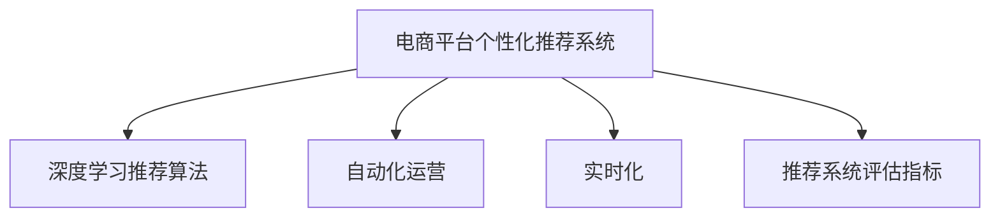

                 

## 1. 背景介绍

### 1.1 问题由来

在当今数字化时代，电商平台已经成为商业活动的重要舞台。如何提升用户体验、提高转化率、增强客户粘性，成为电商运营者们亟需解决的核心问题。个性化推荐和自动化营销，是提升电商平台性能的有效手段。它们通过对用户行为数据的深度挖掘和分析，精准地推送个性化商品和优惠信息，显著提高了用户满意度和电商平台运营效率。

然而，传统的手工规则和简单算法无法满足复杂多变的电商场景需求，难以兼顾个性化和效率的双重目标。人工智能技术，尤其是基于深度学习和大数据技术的个性化推荐系统，通过精准的算法模型和优化的推荐策略，为电商平台带来了前所未有的个性化营销自动化新机遇。

### 1.2 问题核心关键点

个性化推荐和自动化营销的关键在于：

- 数据驱动：需要海量用户行为数据来指导模型训练和优化。
- 深度学习：采用先进的深度学习算法来挖掘用户兴趣和行为规律。
- 模型优化：通过对模型参数的微调，提升推荐精准度。
- 自动化运营：实现算法模型的自动部署和持续迭代，减少人力成本。
- 实时性：保证推荐和营销策略的实时生效，提升用户体验。

本文聚焦于利用深度学习技术，构建个性化的电商平台推荐系统，并结合自动化运营技术，实现高效、精准的个性化营销自动化。

## 2. 核心概念与联系

### 2.1 核心概念概述

为更好地理解AI驱动的电商平台个性化营销自动化，本节将介绍几个关键概念：

- **电商平台个性化推荐系统**：利用用户行为数据，通过机器学习算法构建模型，实现商品的个性化推荐。核心在于精准挖掘用户兴趣，提升用户满意度。

- **深度学习推荐算法**：基于神经网络架构设计的推荐算法，通过多层次抽象，挖掘用户潜在兴趣，提升推荐效果。常见算法包括协同过滤、内容推荐、基于序列的推荐等。

- **自动化运营**：利用自动化技术，实现算法的自动部署、监控和迭代，减少人工干预，提高运营效率。

- **实时化**：通过高并发的系统架构和高效的算法实现，保证推荐策略的实时生效，提升用户体验。

- **推荐系统评估指标**：包括精确率、召回率、覆盖率、点击率等，用于评估推荐效果。

这些概念之间的联系可以通过以下Mermaid流程图来展示：



这个流程图展示了个性化推荐系统的核心组件及其相互关系：

1. 基于深度学习算法进行推荐，构建个性化模型。
2. 通过自动化技术实现模型的自动部署和持续优化。
3. 实时化策略保证推荐策略的快速生效。
4. 评估指标用于监测和调整推荐策略的效果。

## 3. 核心算法原理 & 具体操作步骤
### 3.1 算法原理概述

AI驱动的电商平台个性化推荐系统，本质上是一个基于用户行为数据的深度学习模型。其核心在于，通过深度学习算法，从用户的行为数据中挖掘出用户的潜在兴趣，进而进行精准的个性化推荐。

假设有用户行为数据集 $\mathcal{D}=\{(x_i, y_i)\}_{i=1}^N$，其中 $x_i$ 为用户的行为记录，$y_i$ 为推荐系统想要预测的目标，如点击、购买等。我们希望构建一个深度学习模型 $M$，使得 $M(x_i) \approx y_i$，从而实现推荐。

### 3.2 算法步骤详解

构建一个基于深度学习推荐算法的电商平台个性化推荐系统，一般包括以下关键步骤：

**Step 1: 数据收集与处理**
- 收集用户行为数据，包括浏览记录、购买记录、点击记录等。
- 对数据进行清洗、去重、归一化等预处理，确保数据质量。

**Step 2: 模型训练**
- 选择合适的深度学习框架（如TensorFlow、PyTorch等）和推荐算法（如协同过滤、深度学习嵌入等）。
- 使用用户行为数据进行模型训练，最小化损失函数。
- 进行超参数调优，如学习率、批大小、迭代轮数等。

**Step 3: 模型微调**
- 在训练集上进行全参数或部分参数微调，提升推荐效果。
- 定期在验证集上评估模型性能，防止过拟合。

**Step 4: 实时推荐**
- 部署模型到线上系统，根据实时数据进行推荐。
- 利用缓存和异步技术，提升推荐效率。

**Step 5: 自动化运营与持续优化**
- 利用自动化工具进行模型部署和监控。
- 根据用户反馈和行为变化，持续优化推荐策略和模型参数。

### 3.3 算法优缺点

基于深度学习推荐算法的电商平台个性化推荐系统具有以下优点：

- **高精度**：深度学习算法可以挖掘用户行为的复杂规律，提高推荐准确性。
- **自动化**：自动化部署和持续优化，减少人工干预，提高效率。
- **实时性**：高并发的系统架构和高效的算法实现，保证推荐策略的实时生效。

同时，该方法也存在一些局限性：

- **数据依赖**：依赖高质量的数据集进行训练，数据质量直接影响推荐效果。
- **计算资源消耗**：深度学习模型的训练和部署需要大量计算资源，成本较高。
- **模型解释性不足**：深度学习模型通常被视为"黑盒"系统，难以解释推荐逻辑和决策过程。
- **风险敏感性**：模型可能受到恶意攻击，导致推荐策略失效或产生有害影响。

尽管存在这些局限性，但整体而言，深度学习推荐算法在电商平台个性化推荐中已展现出巨大的潜力和优势。未来相关研究的方向将聚焦于如何进一步降低对数据质量和计算资源的依赖，提升模型的可解释性和安全性，以及如何更好地应对恶意攻击等问题。

### 3.4 算法应用领域

基于深度学习推荐算法的个性化推荐系统，在电商平台中的应用广泛，包括但不限于：

- **商品推荐**：根据用户历史购买和浏览记录，推荐相关商品。
- **用户画像**：通过用户行为数据，构建用户兴趣和行为模式。
- **内容推荐**：推荐新闻、文章、视频等多媒体内容，提升用户粘性。
- **营销自动化**：结合用户画像和市场趋势，自动化生成营销策略，提高广告转化率。
- **价格优化**：根据用户需求和市场供需，动态调整商品价格，提升销售额。

除了电商平台，基于深度学习推荐算法的个性化推荐系统还被应用于社交网络、视频平台、在线教育等多个场景中，为各种数字化应用带来了显著的业务价值。

## 4. 数学模型和公式 & 详细讲解  
### 4.1 数学模型构建

为了更严谨地表达深度学习推荐系统的原理，本节将详细描述其数学模型构建过程。

假设有用户行为数据集 $\mathcal{D}=\{(x_i, y_i)\}_{i=1}^N$，其中 $x_i$ 为用户的行为记录，$y_i$ 为推荐系统想要预测的目标，如点击、购买等。

我们希望构建一个深度学习模型 $M$，使得 $M(x_i) \approx y_i$。不失一般性，假设模型为多层神经网络，其中 $x_i$ 输入为 $d$ 维向量，$y_i$ 输出为 $c$ 维向量，$M$ 参数为 $\theta$。

模型的损失函数为：

$$
\mathcal{L}(\theta) = -\frac{1}{N} \sum_{i=1}^N \log \sigma(M(x_i))^T y_i
$$

其中 $\sigma$ 为激活函数，$\log$ 为自然对数。

### 4.2 公式推导过程

对于深度神经网络，我们可以使用反向传播算法来计算损失函数对模型参数 $\theta$ 的梯度，并更新模型参数以最小化损失函数。

设损失函数对 $M(x_i)$ 的导数为 $\frac{\partial \mathcal{L}(\theta)}{\partial M(x_i)}$，通过链式法则，可推导得：

$$
\frac{\partial \mathcal{L}(\theta)}{\partial \theta} = \frac{\partial \mathcal{L}(\theta)}{\partial M(x_i)} \cdot \frac{\partial M(x_i)}{\partial \theta}
$$

其中 $\frac{\partial M(x_i)}{\partial \theta}$ 为模型对输入 $x_i$ 的导数，可通过自动微分技术高效计算。

在得到损失函数的梯度后，即可带入优化算法进行迭代更新模型参数。常见的优化算法包括随机梯度下降（SGD）、AdamW、Adagrad等。

### 4.3 案例分析与讲解

以协同过滤推荐算法为例，其数学模型可表示为：

$$
\mathbf{U} \times \mathbf{V} \approx \mathbf{P}
$$

其中 $\mathbf{U}$ 和 $\mathbf{V}$ 分别为用户和物品的嵌入矩阵，$\mathbf{P}$ 为预测矩阵。

协同过滤算法的目标是最大化预测矩阵 $\mathbf{P}$ 与真实矩阵 $\mathbf{R}$ 的余弦相似度，损失函数为：

$$
\mathcal{L}(\mathbf{U}, \mathbf{V}) = \frac{1}{2N} \sum_{i=1}^N \sum_{j=1}^M (\mathbf{P}_{ij} - \mathbf{R}_{ij})^2
$$

其中 $N$ 为样本数，$M$ 为物品数。

协同过滤算法的核心在于求解用户和物品的嵌入向量，使得预测矩阵 $\mathbf{P}$ 尽可能逼近真实矩阵 $\mathbf{R}$。通过求解最小二乘问题，可得到用户和物品的嵌入向量：

$$
\mathbf{U}, \mathbf{V} = \mathop{\arg\min}_{\mathbf{U}, \mathbf{V}} \mathcal{L}(\mathbf{U}, \mathbf{V})
$$

利用梯度下降等优化算法，最小化损失函数，即可得到最优的用户和物品嵌入向量。

## 5. 项目实践：代码实例和详细解释说明
### 5.1 开发环境搭建

在进行推荐系统开发前，我们需要准备好开发环境。以下是使用Python进行TensorFlow开发的环境配置流程：

1. 安装Anaconda：从官网下载并安装Anaconda，用于创建独立的Python环境。

2. 创建并激活虚拟环境：
```bash
conda create -n tf-env python=3.8 
conda activate tf-env
```

3. 安装TensorFlow：根据CUDA版本，从官网获取对应的安装命令。例如：
```bash
conda install tensorflow tensorflow-gpu=2.4 -c tf -c conda-forge
```

4. 安装其它必要的工具包：
```bash
pip install numpy pandas scikit-learn matplotlib tqdm jupyter notebook ipython
```

完成上述步骤后，即可在`tf-env`环境中开始推荐系统开发。

### 5.2 源代码详细实现

下面我们以协同过滤推荐算法为例，给出使用TensorFlow实现电商平台的个性化推荐系统的完整代码实现。

首先，定义数据处理函数：

```python
import tensorflow as tf
from tensorflow.keras import layers

def load_data(file_path):
    with open(file_path, 'r') as f:
        data = f.readlines()
    data = [x.strip().split(',') for x in data]
    return tf.constant(data)

def process_data(data):
    items = data[:, 0]
    ratings = data[:, 1]
    return items, ratings

items, ratings = load_data('ratings.csv')
items, ratings = process_data(items), process_data(ratings)
```

然后，定义模型和优化器：

```python
items_len, ratings_len = len(items), len(ratings)
num_users, num_items = items_len, ratings_len

embedding_dim = 50
num_epochs = 10

users = layers.Embedding(num_users, embedding_dim)
items = layers.Embedding(num_items, embedding_dim)
ratings = layers.Dense(1)

model = tf.keras.Sequential([
    users,
    items,
    ratings
])

optimizer = tf.keras.optimizers.Adam(learning_rate=0.01)
loss_fn = tf.keras.losses.MeanSquaredError()

model.compile(optimizer=optimizer, loss=loss_fn)
```

接着，定义训练和评估函数：

```python
from sklearn.model_selection import train_test_split

def train_epoch(model, X_train, y_train, X_valid, y_valid, batch_size=32):
    model.fit(X_train, y_train, epochs=1, batch_size=batch_size, validation_data=(X_valid, y_valid))
    return model.evaluate(X_valid, y_valid, batch_size=batch_size)[1]

def evaluate(model, X_test, y_test, batch_size=32):
    return model.evaluate(X_test, y_test, batch_size=batch_size)[1]
```

最后，启动训练流程并在测试集上评估：

```python
X_train, X_valid, y_train, y_valid = train_test_split(items, ratings, test_size=0.2)

for epoch in range(num_epochs):
    train_loss = train_epoch(model, X_train, y_train, X_valid, y_valid)
    test_loss = evaluate(model, items, ratings)
    print(f'Epoch {epoch+1}, train loss: {train_loss:.4f}, test loss: {test_loss:.4f}')
```

以上就是使用TensorFlow实现协同过滤推荐算法的电商平台的个性化推荐系统的完整代码实现。可以看到，借助TensorFlow的高效计算图和自动微分功能，代码实现变得简洁高效。

### 5.3 代码解读与分析

让我们再详细解读一下关键代码的实现细节：

**数据处理函数**：
- `load_data`函数：读取CSV文件，并将每行数据分割成用户ID和评分。
- `process_data`函数：对数据进行归一化处理，返回用户的ID列表和评分列表。

**模型定义**：
- 使用TensorFlow的`Embedding`层定义用户和物品的嵌入矩阵，初始化权重为随机向量。
- 定义一个`Dense`层，作为预测模型的输出，用于回归预测用户评分。
- 使用`Sequential`模型封装用户嵌入、物品嵌入和预测层，形成推荐系统的深度神经网络。
- 选择合适的优化器（如Adam）和损失函数（如均方误差），并编译模型。

**训练和评估函数**：
- 使用`train_test_split`函数对数据集进行划分，分成训练集、验证集和测试集。
- 定义训练函数`train_epoch`：在每个epoch中，使用批量梯度下降法训练模型，并在验证集上评估模型性能。
- 定义评估函数`evaluate`：在测试集上评估模型的预测性能。

**训练流程**：
- 定义训练次数和批量大小，开始循环迭代
- 在每个epoch内，在训练集上训练模型，输出训练损失
- 在验证集上评估模型，输出验证损失
- 所有epoch结束后，在测试集上评估模型，给出最终测试结果

可以看到，TensorFlow配合高层次的Keras API，使得推荐系统的开发变得简洁高效。开发者可以将更多精力放在模型架构、数据处理、超参数调优等高层逻辑上，而不必过多关注底层的实现细节。

当然，工业级的系统实现还需考虑更多因素，如模型的保存和部署、超参数的自动搜索、更灵活的任务适配层等。但核心的推荐范式基本与此类似。

## 6. 实际应用场景
### 6.1 智能客服系统

基于深度学习推荐算法的个性化推荐系统，可以广泛应用于智能客服系统的构建。传统客服往往需要配备大量人力，高峰期响应缓慢，且一致性和专业性难以保证。而使用个性化推荐系统，可以7x24小时不间断服务，快速响应客户咨询，用推荐结果作为客服的回复参考，显著提高客户满意度。

在技术实现上，可以收集客户的历史浏览记录、购买记录、客服聊天记录等数据，通过协同过滤、协同矩阵分解等算法，生成推荐结果，作为客服回答的参考。在实际应用中，还需要结合语音识别、情感分析等技术，提供更加个性化的客户服务。

### 6.2 金融风控系统

金融风控系统需要对客户行为数据进行实时监测和风险评估，以识别潜在欺诈和信用风险。基于深度学习推荐算法的系统，可以在客户行为数据中挖掘出潜在风险因素，提前预警潜在风险。

具体而言，可以收集用户的交易记录、账户余额、交易频率等行为数据，通过协同过滤、序列推荐等算法，识别出潜在的高风险用户和行为，结合风控规则进行风险评估，及时采取相应的风险控制措施。

### 6.3 个性化推荐系统

电商平台的用户个性化推荐系统，通过协同过滤、内容推荐等算法，精准地推荐用户感兴趣的商品，提升用户体验和销售额。

在实际应用中，系统可以根据用户的历史浏览、购买记录，结合物品的属性、类别等特征，生成个性化的推荐结果。对于新用户，还可以结合商品的热门度和用户画像，生成初始推荐列表，吸引用户点击浏览。

### 6.4 未来应用展望

随着深度学习推荐算法的发展，基于推荐系统的个性化营销自动化将进一步拓展其应用范围，为更多行业带来变革性影响。

在智慧医疗领域，个性化推荐系统可以帮助医生根据患者的病历和历史记录，推荐最适合的治疗方案和药物，提升诊疗效率和效果。

在智能教育领域，推荐系统可以为学生推荐合适的学习资料、课程和习题，个性化指导学生学习，提高教育效果。

在智慧城市治理中，推荐系统可以用于推荐市民最感兴趣的城市活动、公共设施等，提高市民参与度和满意度。

此外，在企业生产、社会治理、文娱传媒等众多领域，基于深度学习推荐算法的个性化推荐系统也将不断涌现，为各行各业数字化转型升级提供新的技术路径。

## 7. 工具和资源推荐
### 7.1 学习资源推荐

为了帮助开发者系统掌握深度学习推荐算法的原理和实践技巧，这里推荐一些优质的学习资源：

1. **《深度学习推荐系统：理论与算法》**：全面介绍了推荐系统的理论基础和算法设计，从协同过滤到深度学习嵌入，涵盖推荐系统的各个方面。

2. **Coursera《推荐系统》课程**：由斯坦福大学开设，系统讲解推荐系统的基本原理和应用案例，适合初学者学习。

3. **Kaggle推荐系统竞赛**：Kaggle平台上的推荐系统竞赛，提供了大量的实战项目和数据集，适合练习和验证推荐模型的效果。

4. **《TensorFlow实战推荐系统》**：基于TensorFlow的推荐系统实战指南，涵盖推荐系统的开发流程和关键技术。

5. **《推荐系统实践》**：结合实际项目，介绍推荐系统的开发、部署和优化策略，适合工程实践。

通过这些资源的学习实践，相信你一定能够快速掌握深度学习推荐算法的精髓，并用于解决实际的推荐系统问题。

### 7.2 开发工具推荐

高效的开发离不开优秀的工具支持。以下是几款用于深度学习推荐系统开发的常用工具：

1. **TensorFlow**：基于Python的开源深度学习框架，灵活高效，适合大规模模型训练和部署。

2. **PyTorch**：Facebook开源的深度学习框架，提供了丰富的API和动态图功能，适合快速原型开发。

3. **Apache Spark**：大数据计算框架，支持分布式计算和数据处理，适合处理大规模推荐数据。

4. **Amazon SageMaker**：AWS提供的机器学习服务，提供了便捷的模型训练、部署和优化工具，适合企业级应用。

5. **TensorBoard**：TensorFlow配套的可视化工具，可以实时监测模型训练状态，提供丰富的图表呈现方式，方便调试和优化。

6. **Weights & Biases**：模型训练的实验跟踪工具，可以记录和可视化模型训练过程中的各项指标，方便对比和调优。

合理利用这些工具，可以显著提升推荐系统的开发效率，加快创新迭代的步伐。

### 7.3 相关论文推荐

深度学习推荐算法的发展源于学界的持续研究。以下是几篇奠基性的相关论文，推荐阅读：

1. **《协同过滤推荐系统》**：经典协同过滤推荐算法，介绍了基于用户和物品的协同矩阵分解方法。

2. **《深度学习在推荐系统中的应用》**：综述了深度学习在推荐系统中的最新进展，包括基于序列的推荐、深度神经网络等。

3. **《推荐系统的可解释性》**：讨论了推荐系统的可解释性问题，提出了多种增强推荐系统透明度的技术。

4. **《推荐系统的最新研究进展》**：总结了推荐系统领域的最新研究成果，涵盖协同过滤、深度学习、分布式计算等多个方向。

这些论文代表了大推荐系统的发展脉络。通过学习这些前沿成果，可以帮助研究者把握学科前进方向，激发更多的创新灵感。

## 8. 总结：未来发展趋势与挑战

### 8.1 总结

本文对基于深度学习推荐算法的电商平台个性化推荐系统进行了全面系统的介绍。首先阐述了推荐系统的研究背景和意义，明确了深度学习推荐算法在提升电商推荐效果方面的独特价值。其次，从原理到实践，详细讲解了深度学习推荐算法的数学模型构建和关键步骤，给出了推荐系统开发的完整代码实例。同时，本文还广泛探讨了推荐系统在智能客服、金融风控、个性化推荐等多个行业领域的应用前景，展示了推荐系统技术的广阔前景。

通过本文的系统梳理，可以看到，基于深度学习推荐算法的电商推荐系统已经取得了显著的业务价值，成为电商运营的重要手段。未来，伴随推荐算法的不断进步和应用场景的拓展，基于推荐系统的个性化营销自动化必将在更多领域得到广泛应用，为各行各业带来新的变革。

### 8.2 未来发展趋势

展望未来，深度学习推荐算法将呈现以下几个发展趋势：

1. **多模态融合**：结合文本、图像、音频等多模态数据，构建更为全面和精准的推荐系统。

2. **跨领域推荐**：通过迁移学习和多任务学习，实现不同领域之间的推荐模型共享，提升推荐系统的泛化能力。

3. **实时化**：通过高效的计算图优化和流式计算，实现实时推荐，提升用户体验。

4. **可解释性**：引入可解释性技术，提升推荐系统的透明度和可信度，增强用户的信任感。

5. **自动化部署与调优**：实现自动化的模型部署和持续优化，减少人工干预，提升运营效率。

6. **安全与隐私保护**：加强数据隐私保护和安全性，确保推荐系统的合规性。

以上趋势凸显了深度学习推荐算法的广泛应用前景。这些方向的探索发展，必将进一步提升推荐系统的性能和应用范围，为各行各业带来新的变革。

### 8.3 面临的挑战

尽管深度学习推荐算法在电商推荐中已展现出巨大的潜力和优势，但在迈向更加智能化、普适化应用的过程中，它仍面临诸多挑战：

1. **数据质量问题**：推荐系统高度依赖数据质量，数据缺失、噪声和不一致等问题，直接影响推荐效果。如何获取高质量、高时效性的数据，成为关键挑战。

2. **计算资源消耗**：深度学习模型的训练和部署需要大量计算资源，成本较高。如何优化模型结构和计算图，减少计算资源消耗，是未来的重要研究方向。

3. **模型解释性不足**：深度学习模型通常被视为"黑盒"系统，难以解释推荐逻辑和决策过程。如何增强推荐系统的可解释性，增强用户的信任感，是亟待解决的问题。

4. **隐私保护与安全**：推荐系统涉及大量用户行为数据，数据隐私和安全问题不容忽视。如何保护用户隐私，防止数据泄露和滥用，是推荐系统面临的重要挑战。

5. **恶意攻击与数据污染**：推荐系统可能受到恶意攻击和数据污染，导致推荐策略失效或产生有害影响。如何识别和应对恶意攻击，保障推荐系统的稳健性，是未来的研究重点。

6. **算法公平性**：推荐系统可能存在算法偏见，导致对某些用户或群体的歧视性推荐。如何提高推荐系统的公平性和多样性，是亟待解决的伦理问题。

这些挑战凸显了深度学习推荐算法的复杂性和多面性。未来相关研究需要在数据质量、计算效率、模型可解释性、隐私保护、安全性、公平性等多个方面进行全面优化。

### 8.4 研究展望

面对深度学习推荐算法所面临的种种挑战，未来的研究需要在以下几个方面寻求新的突破：

1. **高效推荐算法**：开发更加高效、低消耗的推荐算法，在保证推荐效果的同时，减少对计算资源的依赖。

2. **多模态融合技术**：结合视觉、音频等多模态数据，提升推荐系统的全面性和准确性。

3. **自动化调优**：实现自动化的模型调优和超参数搜索，减少人工干预，提升推荐系统性能。

4. **数据隐私保护**：采用差分隐私等技术，保障用户隐私安全，防止数据泄露和滥用。

5. **安全与鲁棒性**：引入对抗训练、数据清洗等技术，增强推荐系统的鲁棒性和抗攻击能力。

6. **可解释性增强**：引入可解释性技术，增强推荐系统的透明度和可信度，增强用户信任感。

这些研究方向将推动深度学习推荐算法的不断发展，为推荐系统技术的未来应用提供新的思路和方法。总之，未来基于深度学习推荐算法的推荐系统需要兼顾性能和效率，多模态融合、自动化调优、隐私保护、安全性、可解释性等方面，才能真正实现推荐系统技术的广泛应用和深度发展。

## 9. 附录：常见问题与解答

**Q1：如何衡量推荐系统的性能？**

A: 推荐系统的性能通常通过以下指标来衡量：

- **精确率（Precision）**：推荐列表中实际点击的商品占推荐商品总数的比例。
- **召回率（Recall）**：推荐列表中实际点击的商品占真实点击商品总数的比例。
- **覆盖率（Coverage）**：推荐列表中不同商品的种类数占实际商品总数的比例。
- **点击率（Click-Through Rate, CTR）**：推荐列表中实际点击的商品占展示商品总数的比例。

这些指标可以帮助我们评估推荐系统的推荐效果，找出不足并改进。

**Q2：推荐系统如何应对新用户？**

A: 对于新用户，推荐系统通常有以下两种策略：

1. **基于内容的推荐**：根据用户的历史行为数据，推荐与其已有偏好相似的商品。

2. **基于模型的推荐**：通过协同过滤、深度学习嵌入等算法，预测用户对新商品的兴趣，进行推荐。

为了提升新用户的推荐效果，还可以结合热门商品推荐，吸引新用户点击浏览。

**Q3：推荐系统如何平衡用户隐私和个性化推荐？**

A: 在推荐系统中，平衡用户隐私和个性化推荐是一个重要的问题。以下是一些常用的方法：

1. **差分隐私**：在数据处理和模型训练过程中，加入噪声，保护用户隐私。

2. **联邦学习**：在分布式环境中，通过数据加密和模型聚合，保护用户隐私，同时实现个性化推荐。

3. **用户画像匿名化**：在用户画像构建和存储过程中，采用匿名化处理，减少隐私泄露风险。

4. **隐私保护算法**：采用隐私保护算法，如谱分解、聚类等，在保护用户隐私的同时，实现推荐系统的优化。

通过这些方法，可以在保护用户隐私的前提下，实现个性化推荐，增强用户信任感。

**Q4：推荐系统如何应对恶意攻击？**

A: 推荐系统可能受到多种恶意攻击，如数据注入、广告劫持等，导致推荐策略失效或产生有害影响。以下是一些常用的防御方法：

1. **数据清洗和过滤**：通过数据清洗和过滤，检测和去除恶意数据。

2. **对抗训练**：在模型训练过程中，加入对抗样本，增强模型的鲁棒性和抗攻击能力。

3. **多模型融合**：通过多个推荐模型的融合，提高推荐系统的稳定性和鲁棒性。

4. **异常检测**：采用异常检测技术，识别和应对恶意攻击行为。

5. **安全验证**：在推荐策略部署和执行过程中，加入安全验证环节，防止恶意攻击。

通过这些方法，可以有效应对恶意攻击，保障推荐系统的稳健性。

**Q5：推荐系统如何应对用户需求变化？**

A: 推荐系统需要定期更新模型和推荐策略，以适应用户需求的变化。以下是一些常用的方法：

1. **模型迭代更新**：定期重新训练模型，更新推荐策略，适应用户需求变化。

2. **在线学习**：通过在线学习技术，实时更新模型参数，快速响应用户需求变化。

3. **A/B测试**：通过A/B测试，评估新推荐策略的效果，快速迭代优化。

4. **用户反馈**：通过用户反馈机制，收集用户意见和建议，改进推荐策略。

5. **个性化定制**：根据用户个性化需求，提供定制化的推荐服务。

通过这些方法，推荐系统可以持续优化，更好地满足用户需求。

---

作者：禅与计算机程序设计艺术 / Zen and the Art of Computer Programming

