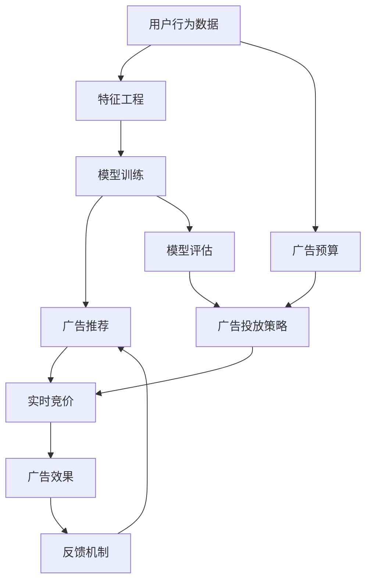

                 

# AI驱动的电商平台实时竞价广告系统优化

> 关键词：人工智能, 电商平台, 实时竞价, 广告系统, 优化策略, 推荐算法, 深度学习, 模型训练, 特征工程, 数据处理

## 1. 背景介绍

### 1.1 问题由来

在现代电商平台上，广告竞价系统是提升销售转化、优化用户体验的重要工具。随着用户需求的个性化日益增强，广告推荐需要更精准地匹配用户兴趣，实现个性化广告投放。传统的广告系统往往依赖固定规则或简单统计模型，难以满足复杂多变的用户需求，导致资源浪费和用户流失。

为此，基于人工智能(AI)的大规模推荐系统被广泛应用。通过机器学习和深度学习技术，系统可以根据用户的历史行为、社交信息、点击行为等构建用户画像，实现个性化推荐。这些推荐系统不仅提升了广告投放的精准度，还显著提高了平台的转化率和用户满意度。

然而，随着用户行为的多样性和复杂性不断增加，传统推荐系统的局限性逐渐显现。如何在实时竞价场景下，高效地进行个性化广告推荐，成为了电商广告系统面临的巨大挑战。本文章将深入探讨基于AI的电商平台实时竞价广告系统的优化策略，为实际应用提供参考和指导。

### 1.2 问题核心关键点

电商平台广告系统优化的核心关键点在于以下几个方面：

1. **实时处理能力**：在动态变化的电商环境中，实时处理广告请求是基础要求。系统需能够在毫秒级内响应广告竞价请求，确保广告展示的实时性。

2. **精准广告推荐**：基于用户画像和行为数据，推荐系统需精准匹配用户需求，提高广告投放的点击率和转化率。

3. **高效资源管理**：在资源有限的条件下，广告系统需优化广告投放策略，最大化广告投放效果，同时避免浪费。

4. **安全性与隐私保护**：用户数据的安全和隐私保护是电商平台不可忽视的重要问题，广告系统需确保数据处理过程的合法合规。

## 2. 核心概念与联系

### 2.1 核心概念概述

为更好地理解基于AI的电商平台实时竞价广告系统优化方法，本节将介绍几个密切相关的核心概念：

- **AI驱动广告推荐**：指基于机器学习和深度学习技术，对用户行为数据进行分析和建模，生成个性化广告推荐的方法。

- **实时竞价广告系统**：指在电商平台中，广告主通过实时竞价方式，以最高出价获取广告位的方法。系统需根据广告主出价和用户行为数据，实时计算并分配广告位。

- **推荐系统**：指通过用户历史行为数据和相关特征，预测用户可能感兴趣的商品或服务，并实现精准推荐的系统。

- **深度学习模型**：指利用神经网络结构进行深度学习训练，从大规模数据中学习复杂模式和特征，用于构建推荐和预测模型。

- **特征工程**：指对原始数据进行处理和转换，提取有意义的特征，用于提升模型的预测性能。

- **模型训练与评估**：指使用训练数据对模型进行学习，并通过测试数据评估模型效果，优化模型参数的过程。

- **广告投放策略**：指在广告竞价和推荐系统中，如何合理分配广告预算、优化广告投放时间和频率等策略。

这些核心概念之间的逻辑关系可以通过以下Mermaid流程图来展示：



这个流程图展示了用户行为数据如何经过特征工程和模型训练，最终应用于实时竞价广告推荐的过程。同时，广告预算和投放策略也参与了广告推荐，并受到广告效果和反馈机制的反馈影响。

## 3. 核心算法原理 & 具体操作步骤
### 3.1 算法原理概述

基于AI的电商平台实时竞价广告系统优化，主要涉及以下几个关键算法：

1. **深度学习推荐模型**：如CTR(Click-Through Rate)预测模型、序列推荐模型等，用于根据用户行为数据和上下文信息预测点击率。

2. **实时竞价算法**：如第一价格拍卖、第二价格拍卖等，用于在动态竞价环境中，高效计算广告出价和投放位置。

3. **广告投放策略**：如基于时序的动态调整、基于特征的用户分组投放等，用于优化广告投放效率和效果。

4. **特征工程与数据处理**：如缺失值处理、特征提取与选择等，用于提升模型预测性能和计算效率。

5. **模型评估与调优**：如A/B测试、交叉验证等，用于评估模型效果和优化模型参数。

这些算法通过深度学习和实时计算技术的结合，实现了个性化广告推荐和高效竞价系统的构建。

### 3.2 算法步骤详解

基于AI的电商平台实时竞价广告系统优化，主要包括以下几个关键步骤：

**Step 1: 数据收集与预处理**
- 收集用户行为数据，包括浏览记录、点击行为、购买历史等。
- 数据清洗和处理，如去除重复数据、处理缺失值、归一化等。
- 特征工程，提取和构建有意义的特征，如用户画像、行为特征、广告特征等。

**Step 2: 模型训练与优化**
- 选择合适的深度学习模型，如CTR预测模型、序列推荐模型等。
- 划分训练集和验证集，使用交叉验证等方法优化模型参数。
- 使用Adam、SGD等优化算法训练模型，调整学习率、批大小等超参数。
- 使用A/B测试或交叉验证评估模型效果，选择最优模型。

**Step 3: 广告竞价与推荐**
- 实时计算广告请求和竞价信息，使用第一价格拍卖或第二价格拍卖算法。
- 根据用户画像和行为数据，使用推荐模型预测点击率，生成个性化广告推荐。
- 根据用户点击行为和转化率，实时更新广告预算和投放策略。

**Step 4: 系统监控与调优**
- 实时监控广告投放效果，如点击率、转化率等。
- 定期评估广告系统性能，如响应时间、广告展示率等。
- 根据用户反馈和系统监控数据，优化广告投放策略和模型参数。

### 3.3 算法优缺点

基于AI的电商平台实时竞价广告系统优化，具有以下优点：

1. **高精度广告推荐**：利用深度学习模型对用户行为进行建模，提升广告推荐的准确性和个性化程度。

2. **实时响应能力**：实时竞价算法能够快速处理和响应广告请求，满足动态广告投放需求。

3. **高效资源管理**：通过广告投放策略优化，合理分配广告预算，提升广告投放效果。

4. **动态调整能力**：根据用户反馈和系统监控数据，动态调整广告投放策略和模型参数，适应市场变化。

同时，该算法也存在以下局限性：

1. **数据需求量大**：高质量的数据是模型优化的基础，需要大量用户行为数据进行训练和验证。

2. **计算资源消耗高**：深度学习模型的训练和实时竞价计算消耗大量的计算资源。

3. **模型解释性不足**：深度学习模型通常是"黑盒"模型，难以解释其内部决策逻辑。

4. **隐私保护风险**：用户数据的安全和隐私保护是重要问题，需严格遵守法律法规。

5. **广告投放公平性**：需要确保广告投放过程的公平性，避免特定用户或广告主被歧视。

## 4. 数学模型和公式 & 详细讲解 & 举例说明
### 4.1 数学模型构建

基于AI的电商平台实时竞价广告系统优化，涉及多个数学模型和公式。这里以CTR预测模型为例，详细讲解其构建和优化过程。

假设用户行为数据为 $X = (x_1, x_2, ..., x_n)$，广告特征为 $A = (a_1, a_2, ..., a_m)$，用户画像特征为 $P = (p_1, p_2, ..., p_k)$。CTR预测模型的目标是根据用户行为数据和广告特征，预测用户点击广告的概率。

定义CTR预测模型为：

$$
\hat{y} = f(X, A, P)
$$

其中 $f$ 为深度学习模型，如多层感知器(MLP)、深度神经网络(DNN)等。

假设模型输入为 $x = (x_1, x_2, ..., x_n)$，模型参数为 $\theta$。则模型的预测结果为：

$$
\hat{y} = f(X, A, P; \theta) = \sigma(W(x) + b)
$$

其中 $W(x)$ 为线性变换，$\sigma$ 为激活函数，如ReLU、sigmoid等。

### 4.2 公式推导过程

CTR预测模型的目标是最大化预测准确率，即最小化预测误差。假设实际点击率为 $y$，预测点击率为 $\hat{y}$，则预测误差为：

$$
\mathcal{L} = -\frac{1}{N} \sum_{i=1}^N y_i \log(\hat{y}_i) + (1-y_i) \log(1-\hat{y}_i)
$$

其中 $N$ 为样本数量。

使用梯度下降算法最小化损失函数 $\mathcal{L}$，优化模型参数 $\theta$：

$$
\theta \leftarrow \theta - \eta \nabla_{\theta} \mathcal{L}
$$

其中 $\eta$ 为学习率，$\nabla_{\theta} \mathcal{L}$ 为损失函数对参数 $\theta$ 的梯度，可通过反向传播算法计算。

### 4.3 案例分析与讲解

以电商平台商品推荐为例，假设某用户访问了电商平台，并浏览了多个商品页面。对于每个商品页面，平台需计算其对用户点击的概率，并根据竞价信息决定是否展示该商品广告。

假设广告主对商品广告的竞价为 $p$，用户对该商品广告的点击率为 $r$。则平台根据竞价信息和用户点击概率，决定是否展示该商品广告。若点击率大于竞价权重 $w$，则展示该广告，否则不展示。

具体计算步骤如下：

1. 对用户访问的商品页面进行特征工程，提取有意义的特征，如商品ID、价格、描述等。

2. 使用CTR预测模型对用户行为数据和商品特征进行建模，预测用户点击商品的概率 $r$。

3. 根据竞价信息 $p$ 和点击率 $r$，计算广告展示概率 $r \times w$。

4. 判断广告展示概率是否大于竞价权重 $w$，若大于则展示该商品广告。

5. 实时监控广告展示效果，如点击率、转化率等，根据效果调整竞价权重和广告投放策略。

## 5. 项目实践：代码实例和详细解释说明
### 5.1 开发环境搭建

在进行项目实践前，我们需要准备好开发环境。以下是使用Python进行TensorFlow开发的开发环境配置流程：

1. 安装Anaconda：从官网下载并安装Anaconda，用于创建独立的Python环境。

2. 创建并激活虚拟环境：
```bash
conda create -n tf-env python=3.8 
conda activate tf-env
```

3. 安装TensorFlow：根据CUDA版本，从官网获取对应的安装命令。例如：
```bash
conda install tensorflow-gpu=2.5 -c pytorch -c conda-forge
```

4. 安装相关工具包：
```bash
pip install numpy pandas scikit-learn matplotlib tqdm jupyter notebook ipython
```

完成上述步骤后，即可在`tf-env`环境中开始项目实践。

### 5.2 源代码详细实现

下面我们以电商平台实时竞价广告系统为例，给出使用TensorFlow进行CTR预测模型训练和广告推荐的代码实现。

首先，定义CTR预测模型：

```python
import tensorflow as tf

# 定义输入
X = tf.keras.layers.Input(shape=(n_features,), name='input')
A = tf.keras.layers.Input(shape=(m_features,), name='ad_feature')
P = tf.keras.layers.Input(shape=(k_features,), name='user_profile')

# 定义CTR预测模型
model = tf.keras.layers.Dense(units=1, activation='sigmoid')(X)
model = tf.keras.layers.Dense(units=1, activation='sigmoid')(model + A + P)
```

然后，定义损失函数和优化器：

```python
# 定义损失函数
loss_fn = tf.keras.losses.BinaryCrossentropy()

# 定义优化器
optimizer = tf.keras.optimizers.Adam(learning_rate=0.001)
```

接着，定义训练和评估函数：

```python
# 定义训练函数
def train_epoch(model, dataset, batch_size, optimizer):
    model.compile(optimizer=optimizer, loss=loss_fn, metrics=['accuracy'])
    model.fit(dataset, batch_size=batch_size, epochs=1, verbose=0)

# 定义评估函数
def evaluate(model, dataset, batch_size):
    model.evaluate(dataset, batch_size=batch_size, verbose=0)
```

最后，启动训练流程并在测试集上评估：

```python
# 假设训练集和测试集已经准备好
train_dataset = ...
test_dataset = ...

# 模型训练
train_epoch(model, train_dataset, batch_size=32, optimizer=optimizer)

# 模型评估
evaluate(model, test_dataset, batch_size=32)
```

以上就是使用TensorFlow对CTR预测模型进行电商广告系统实时竞价优化的完整代码实现。可以看到，得益于TensorFlow的强大封装，我们可以用相对简洁的代码完成CTR预测模型的训练和优化。

### 5.3 代码解读与分析

让我们再详细解读一下关键代码的实现细节：

**CTR预测模型定义**：
- 使用`tf.keras.layers.Input`定义输入层，`shape`参数指定输入特征维度。
- 使用`tf.keras.layers.Dense`定义全连接层，`units`参数指定输出维度，`activation`参数指定激活函数。
- 使用`model = model + A + P`将广告特征和用户画像特征加入预测模型中。

**损失函数和优化器定义**：
- 使用`tf.keras.losses.BinaryCrossentropy`定义二元交叉熵损失函数。
- 使用`tf.keras.optimizers.Adam`定义Adam优化器，并设置学习率。

**训练和评估函数定义**：
- 使用`model.compile`编译模型，指定优化器、损失函数和评估指标。
- 使用`model.fit`对模型进行训练，指定训练数据、批次大小、轮数和训练信息输出。
- 使用`model.evaluate`对模型进行评估，指定评估数据和批次大小。

**训练流程启动**：
- 假设训练集和测试集已经准备好。
- 调用`train_epoch`函数训练模型。
- 调用`evaluate`函数评估模型性能。

可以看到，TensorFlow提供了完整的深度学习模型定义、训练和评估流程，大大简化了项目开发过程。

## 6. 实际应用场景

### 6.1 智能推荐系统

基于AI的电商平台实时竞价广告系统，可以在智能推荐系统中发挥重要作用。智能推荐系统通过实时竞价广告系统，可以动态调整广告投放策略，根据用户行为数据实现个性化推荐。

在实际应用中，可以收集用户浏览记录、点击行为、购买历史等数据，使用CTR预测模型进行建模。根据模型预测结果和竞价信息，动态调整广告投放策略，实现更加精准和个性化的推荐。

### 6.2 广告投放优化

电商平台广告系统通过实时竞价广告系统，可以高效优化广告投放策略，提升广告投放效果。

在实际应用中，可以收集广告主的竞价信息、广告效果数据和用户行为数据，使用CTR预测模型进行建模。根据模型预测结果和竞价信息，动态调整广告投放策略，优化广告预算和投放时间，提升广告投放效果。

### 6.3 用户体验提升

基于AI的电商平台实时竞价广告系统，可以通过精准推荐和个性化广告投放，提升用户购物体验。

在实际应用中，可以收集用户浏览记录、点击行为、评价反馈等数据，使用CTR预测模型进行建模。根据模型预测结果和竞价信息，动态调整广告投放策略，实现精准推荐和个性化广告投放，提升用户满意度和购物体验。

### 6.4 未来应用展望

随着AI技术的不断进步，基于实时竞价广告系统的电商平台优化将呈现以下几个发展趋势：

1. **实时处理能力提升**：通过优化模型结构和计算图，提升广告竞价和推荐的实时处理能力。

2. **个性化推荐精度提升**：通过引入更多先验知识和特征工程方法，提升深度学习模型的预测精度和泛化能力。

3. **广告投放策略优化**：通过动态调整广告预算和投放时间，优化广告投放策略，提升广告投放效果。

4. **用户隐私保护增强**：通过数据匿名化和去标识化处理，增强用户隐私保护能力，确保用户数据安全。

5. **系统可扩展性和灵活性提升**：通过微服务和分布式架构设计，提升系统的可扩展性和灵活性，满足大规模和动态变化的业务需求。

6. **智能运营支持增强**：通过实时监控和自动调参工具，增强系统的智能运营支持能力，快速响应业务变化和用户需求。

## 7. 工具和资源推荐

### 7.1 学习资源推荐

为了帮助开发者系统掌握基于AI的电商平台实时竞价广告系统优化技术，这里推荐一些优质的学习资源：

1. 《深度学习实战》系列博文：由AI领域专家撰写，深入浅出地介绍了深度学习模型的构建和优化方法。

2. CS231n《卷积神经网络》课程：斯坦福大学开设的经典深度学习课程，有Lecture视频和配套作业，带你入门深度学习基本概念和模型构建。

3. 《机器学习实战》书籍：涵盖机器学习和深度学习的基本理论和实践技巧，适合初学者和中级开发者学习。

4. TensorFlow官方文档：提供了完整的TensorFlow框架使用文档和示例代码，是TensorFlow开发的必备资料。

5. PyTorch官方文档：提供了丰富的PyTorch框架使用文档和示例代码，适合深度学习模型的构建和优化。

6. Google Cloud Machine Learning Engine：谷歌提供的云端机器学习平台，可以方便地部署和管理深度学习模型。

通过对这些资源的学习实践，相信你一定能够快速掌握基于AI的电商平台实时竞价广告系统优化技术的精髓，并用于解决实际的广告推荐问题。

### 7.2 开发工具推荐

高效的开发离不开优秀的工具支持。以下是几款用于电商广告系统开发的常用工具：

1. TensorFlow：由Google主导开发的开源深度学习框架，生产部署方便，适合大规模工程应用。

2. PyTorch：由Facebook主导开发的开源深度学习框架，灵活易用，适合研究性开发。

3. Keras：高层次的深度学习API，提供了简洁易用的接口，适合快速原型开发。

4. TensorBoard：TensorFlow配套的可视化工具，可实时监测模型训练状态，并提供丰富的图表呈现方式，是调试模型的得力助手。

5. Weights & Biases：模型训练的实验跟踪工具，可以记录和可视化模型训练过程中的各项指标，方便对比和调优。

6. TFX：由Google开发的机器学习平台，提供数据集管理、模型训练、模型评估等功能，适用于大规模工程应用。

合理利用这些工具，可以显著提升电商广告系统开发效率，加快创新迭代的步伐。

### 7.3 相关论文推荐

基于AI的电商平台实时竞价广告系统优化涉及诸多前沿技术，以下是几篇奠基性的相关论文，推荐阅读：

1. Deep Learning for Ad Ranking in Online Advertising（ACM '11）：介绍了基于深度学习的广告竞价模型，通过用户行为数据和广告特征进行点击率预测。

2. E-commerce Recommendations: A Survey（IEEE Trans. Knowl. Data Eng. '19）：综述了电商推荐系统的研究进展，介绍了各种推荐算法和应用场景。

3. Neural Collaborative Filtering：基于神经网络的协同过滤方法，通过用户行为数据和商品特征进行推荐。

4. Model-based Recommendation Systems（Trends in Cognitive Sciences '19）：综述了基于模型的方法在推荐系统中的应用，介绍了模型训练和评估方法。

5. Learning to Rank: A Unified Approach（IEEE Trans. Inf. Theory '09）：介绍了基于学习排名的推荐方法，通过点击率预测和排序优化提升推荐效果。

6. Deep Neural Networks for Ad Ranking（ACM '13）：介绍了基于深度神经网络的广告竞价模型，通过用户行为数据和广告特征进行点击率预测。

这些论文代表了电商广告推荐系统的最新研究方向，通过学习这些前沿成果，可以帮助研究者把握学科前进方向，激发更多的创新灵感。

## 8. 总结：未来发展趋势与挑战

### 8.1 总结

本文对基于AI的电商平台实时竞价广告系统优化方法进行了全面系统的介绍。首先阐述了电商广告系统优化的背景和意义，明确了实时竞价和推荐算法在提升广告投放精准度和效果方面的独特价值。其次，从原理到实践，详细讲解了深度学习推荐模型、实时竞价算法、广告投放策略等的关键步骤和具体操作，给出了电商广告系统实时竞价优化的完整代码实现。同时，本文还探讨了电商广告系统的实际应用场景，展示了该技术在智能推荐、广告投放、用户体验提升等方面的巨大潜力。此外，本文还推荐了相关学习资源和工具，力求为读者提供全方位的技术指引。

通过本文的系统梳理，可以看到，基于AI的电商平台实时竞价广告系统优化技术已经在电商广告推荐中得到广泛应用，显著提升了广告投放的精准度和效果。未来，伴随AI技术的不断进步，基于实时竞价广告系统的电商平台优化将进一步提升广告推荐和投放的智能化水平，带来更加个性化的用户体验和更高的广告效果。

### 8.2 未来发展趋势

展望未来，基于AI的电商平台实时竞价广告系统优化技术将呈现以下几个发展趋势：

1. **模型规模和深度增强**：随着模型规模和深度的不断提升，推荐模型的预测精度和泛化能力将进一步增强。

2. **广告投放策略优化**：通过引入更多先验知识和智能运营支持，广告投放策略将更加动态灵活，提升广告投放效果。

3. **个性化推荐技术演进**：基于深度学习和强化学习的推荐算法将逐步取代传统算法，提升推荐系统的智能水平。

4. **实时处理能力提升**：通过优化计算图和硬件资源，广告竞价和推荐的实时处理能力将进一步提升。

5. **用户隐私保护增强**：通过数据匿名化和去标识化处理，用户隐私保护能力将不断增强，确保用户数据安全。

6. **系统可扩展性和灵活性提升**：通过微服务和分布式架构设计，系统的可扩展性和灵活性将不断提升，满足大规模和动态变化的业务需求。

7. **智能运营支持增强**：通过实时监控和自动调参工具，系统的智能运营支持能力将不断增强，快速响应业务变化和用户需求。

以上趋势凸显了基于AI的电商平台实时竞价广告系统优化技术的广阔前景。这些方向的探索发展，必将进一步提升电商广告系统的智能化水平，带来更加个性化的用户体验和更高的广告效果。

### 8.3 面临的挑战

尽管基于AI的电商平台实时竞价广告系统优化技术已经取得了瞩目成就，但在迈向更加智能化、普适化应用的过程中，它仍面临诸多挑战：

1. **数据需求量大**：高质量的数据是模型优化的基础，需要大量用户行为数据进行训练和验证。

2. **计算资源消耗高**：深度学习模型的训练和实时竞价计算消耗大量的计算资源。

3. **模型解释性不足**：深度学习模型通常是"黑盒"模型，难以解释其内部决策逻辑。

4. **广告投放公平性**：需要确保广告投放过程的公平性，避免特定用户或广告主被歧视。

5. **隐私保护风险**：用户数据的安全和隐私保护是重要问题，需严格遵守法律法规。

6. **系统复杂性高**：系统的复杂性高，需要高效的数据处理、模型训练和实时计算能力。

7. **业务需求变化快**：电商平台业务需求变化快，需快速调整广告投放策略和推荐算法。

### 8.4 研究展望

面对基于AI的电商平台实时竞价广告系统优化所面临的挑战，未来的研究需要在以下几个方面寻求新的突破：

1. **无监督和半监督学习**：摆脱对大规模标注数据的依赖，利用自监督学习、主动学习等无监督和半监督范式，最大限度利用非结构化数据，实现更加灵活高效的广告推荐。

2. **跨模态融合**：将符号化的先验知识，如知识图谱、逻辑规则等，与神经网络模型进行融合，引导推荐过程学习更全面、准确的语言模型。

3. **动态广告投放策略**：根据用户行为数据和市场变化，动态调整广告预算和投放策略，提升广告投放效果。

4. **用户行为建模**：通过引入更多的先验知识和特征工程方法，提升深度学习模型的预测精度和泛化能力。

5. **实时监控和自动调参**：通过实时监控和自动调参工具，增强系统的智能运营支持能力，快速响应业务变化和用户需求。

6. **隐私保护技术**：通过数据匿名化和去标识化处理，增强用户隐私保护能力，确保用户数据安全。

这些研究方向的探索，必将引领基于AI的电商平台实时竞价广告系统优化技术迈向更高的台阶，为构建更加智能化、个性化的电商广告系统铺平道路。面向未来，基于AI的电商平台实时竞价广告系统优化技术还需要与其他AI技术进行更深入的融合，如自然语言处理、计算机视觉、强化学习等，多路径协同发力，共同推动电商广告系统的进步。只有勇于创新、敢于突破，才能不断拓展电商广告系统的边界，让AI技术更好地造福电商行业。

## 9. 附录：常见问题与解答

**Q1：电商平台广告系统优化的关键点是什么？**

A: 电商平台广告系统优化的关键点在于以下几个方面：

1. **实时处理能力**：在动态变化的电商环境中，实时处理广告请求是基础要求。系统需能够在毫秒级内响应广告竞价请求，确保广告展示的实时性。

2. **精准广告推荐**：基于用户画像和行为数据，推荐系统需精准匹配用户需求，提高广告投放的点击率和转化率。

3. **高效资源管理**：在资源有限的条件下，广告系统需优化广告投放策略，最大化广告投放效果，同时避免浪费。

4. **安全性与隐私保护**：用户数据的安全和隐私保护是重要问题，需严格遵守法律法规。

**Q2：电商广告系统如何实现精准推荐？**

A: 电商广告系统通过实时竞价广告系统，可以实现精准推荐。具体步骤如下：

1. 收集用户浏览记录、点击行为、购买历史等数据。

2. 使用CTR预测模型对用户行为数据和商品特征进行建模，预测用户点击商品的概率。

3. 根据竞价信息 $p$ 和点击率 $r$，计算广告展示概率 $r \times w$。

4. 判断广告展示概率是否大于竞价权重 $w$，若大于则展示该商品广告。

5. 实时监控广告展示效果，如点击率、转化率等，根据效果调整竞价权重和广告投放策略。

**Q3：电商广告系统如何高效优化广告投放策略？**

A: 电商广告系统通过实时竞价广告系统，可以高效优化广告投放策略。具体步骤如下：

1. 收集广告主的竞价信息、广告效果数据和用户行为数据。

2. 使用CTR预测模型对广告主竞价和广告效果数据进行建模，预测广告展示效果。

3. 根据竞价信息 $p$ 和广告效果 $e$，计算广告展示概率 $e \times p$。

4. 判断广告展示概率是否大于竞价权重 $w$，若大于则展示该商品广告。

5. 实时监控广告展示效果，如点击率、转化率等，根据效果调整竞价权重和广告投放策略。

**Q4：电商平台广告系统优化需要考虑哪些因素？**

A: 电商平台广告系统优化需要考虑以下几个因素：

1. 实时处理能力：系统需能够在毫秒级内响应广告竞价请求，确保广告展示的实时性。

2. 精准广告推荐：推荐系统需精准匹配用户需求，提高广告投放的点击率和转化率。

3. 高效资源管理：广告系统需优化广告投放策略，合理分配广告预算，提升广告投放效果。

4. 用户隐私保护：用户数据的安全和隐私保护是重要问题，需严格遵守法律法规。

5. 广告投放公平性：广告投放过程需确保公平性，避免特定用户或广告主被歧视。

6. 系统可扩展性和灵活性：需高效的数据处理、模型训练和实时计算能力。

7. 业务需求变化：需快速调整广告投放策略和推荐算法，满足市场变化和用户需求。

这些因素的综合考虑，才能构建高效、公平、安全的电商平台广告系统，提升用户满意度和平台转化率。

---

作者：禅与计算机程序设计艺术 / Zen and the Art of Computer Programming

