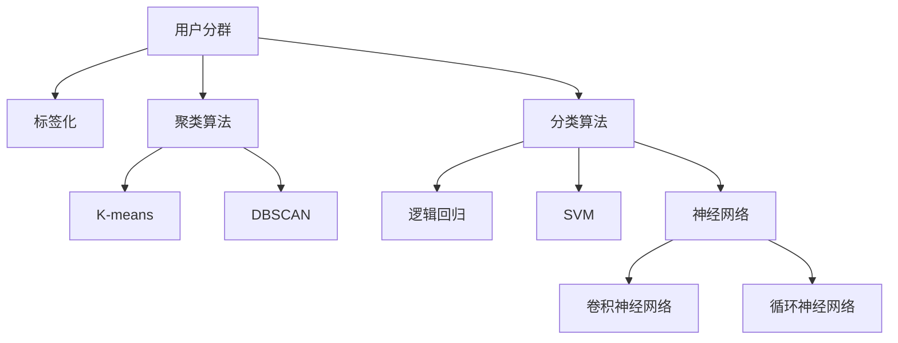

                 

## 1. 背景介绍

在当今电商环境中，用户分群与标签化是提升用户价值、优化营销策略的关键。通过科学的消费者分群，商家可以精准定位用户需求，个性化推荐产品，从而提升用户满意度与购买转化率。传统用户分群方法主要依赖历史行为数据，如购买记录、浏览历史等，而大数据时代，AI技术已成为用户分群的重要工具，可以显著提升分群的准确性和效率。

### 1.1 问题由来
随着电子商务的发展，电商平台的数据量呈现指数级增长，如何高效利用海量用户数据进行精准分群，成为电商运营的一大难题。传统的用户分群方法存在如下局限性：
- **高成本**：需要大量人工标注与调参，耗时耗力。
- **低精度**：依赖单一特征，难以捕捉用户复杂行为。
- **数据不均衡**：训练集和测试集数据分布不一致，影响泛化能力。

为解决这些问题，AI驱动的用户分群与标签化方法应运而生。利用机器学习、深度学习等技术，从多维度、多模态数据中挖掘用户特征，进行高效率、高精度的分群与标签化。

### 1.2 问题核心关键点
AI驱动的用户分群与标签化方法基于机器学习与深度学习算法，核心目标是自动从数据中提取用户行为特征，构建分群模型，自动学习用户标签，提升分群的精准性与效率。具体而言，包括以下核心关键点：

- **数据预处理**：清洗、转换原始数据，构建特征矩阵。
- **模型构建**：选择合适的机器学习或深度学习模型，如聚类算法、分类算法、神经网络等。
- **特征提取**：利用深度学习模型从多维度数据中提取用户行为特征。
- **分群与标签**：利用模型对用户进行分群与标签化，生成分群和标签列表。
- **效果评估**：评估分群与标签化的准确性与有效性，调整优化模型。

这些关键点共同构成了AI驱动用户分群与标签化的核心流程，涵盖了数据准备、模型训练、特征提取、结果生成与效果评估等环节。

### 1.3 问题研究意义
利用AI驱动用户分群与标签化技术，可以大幅提升电商运营的精准性与效率，具有重要意义：

- **提升用户满意度**：精准定位用户需求，提供个性化推荐，提升用户体验。
- **优化营销策略**：通过细粒度分群，实现差异化营销，提高广告投放效率。
- **预测用户行为**：挖掘用户隐性行为，预测用户未来购买意向，辅助库存管理。
- **降低运营成本**：自动化的分群与标签化，减少人工标注与调参的投入，降低运营成本。
- **推动技术创新**：新的算法和技术不断涌现，推动NLP、深度学习等AI技术的发展。

通过AI驱动的用户分群与标签化，电商平台可以更高效地理解用户需求，实现个性化营销与运营优化，提升整体竞争力。

## 2. 核心概念与联系

### 2.1 核心概念概述

为深入理解AI驱动用户分群与标签化技术，本节介绍几个关键概念：

- **用户分群**：根据用户行为、属性等特征，将用户划分为不同群体。分群目标是发现用户特征相似度较高的用户群体，便于精准营销与个性化推荐。
- **标签化**：对用户进行标记，生成简明扼要的特征描述，方便用户行为分析与模型训练。标签化通常使用一维向量表示用户特征，如“高价值用户”、“高潜力用户”等。
- **聚类算法**：通过相似性度量与距离计算，将用户划分为不同的类别。常见的聚类算法包括K-means、DBSCAN等。
- **分类算法**：通过特征训练分类模型，对用户进行标签化。常见的分类算法包括逻辑回归、SVM、神经网络等。
- **神经网络**：利用多层神经元构建的复杂模型，从原始数据中提取高层次特征。常见的神经网络结构包括卷积神经网络、循环神经网络等。

这些核心概念通过以下Mermaid流程图来展示它们之间的关系：



该流程图展示了用户分群与标签化的主要过程：

1. 通过聚类算法如K-means、DBSCAN等，将用户划分为不同的类别。
2. 利用分类算法如逻辑回归、SVM、神经网络等，对用户进行标签化，生成一维向量表示的用户特征。
3. 最终生成用户分群与标签化结果，便于进一步分析和应用。

## 3. 核心算法原理 & 具体操作步骤
### 3.1 算法原理概述

AI驱动的用户分群与标签化基于机器学习和深度学习算法，从多维度、多模态数据中挖掘用户特征，构建分群模型，自动学习用户标签。其核心思想是通过数学模型学习用户行为规律，构建用户特征向量，并进行自动化的分群与标签化。

形式化地，假设用户集为 $U$，用户特征矩阵为 $X \in \mathbb{R}^{N \times M}$，其中 $N$ 为用户数，$M$ 为特征维度。设聚类数为 $K$，分类数为 $C$。分群与标签化的目标函数为：

$$
\min_{\theta} \mathcal{L}(\theta;X) = \frac{1}{2} \sum_{i=1}^N \| X_i - \mu_K \|^2 + \frac{1}{K} \sum_{k=1}^K \left\| \mu_k - \mu_{k-1} \right\|^2 + \sum_{i=1}^N \mathcal{L}(C_i;\theta)
$$

其中 $\theta$ 为模型参数，$\mu_k$ 为第 $k$ 个聚类的中心向量，$C_i$ 为第 $i$ 个用户的标签。上述目标函数包括两部分：聚类损失和分类损失。聚类损失是衡量聚类中心的误差，分类损失是衡量分类模型预测准确性的误差。

通过最小化目标函数，模型自动从数据中提取用户特征，完成分群与标签化。

### 3.2 算法步骤详解

AI驱动的用户分群与标签化主要包括以下几个关键步骤：

**Step 1: 数据准备**

1. **数据收集**：收集电商平台的用户数据，包括行为数据、属性数据、文本数据等。
2. **数据清洗**：去除异常值、重复值，填补缺失值，处理异常数据。
3. **特征工程**：构建特征矩阵 $X \in \mathbb{R}^{N \times M}$，包括用户行为特征、属性特征、文本特征等。
4. **数据分割**：将数据集划分为训练集、验证集和测试集。

**Step 2: 模型训练**

1. **选择模型**：选择合适的聚类算法和分类算法，如K-means、DBSCAN、逻辑回归等。
2. **设置超参数**：设置模型超参数，如聚类数、分类阈值、学习率等。
3. **训练模型**：在训练集上训练模型，最小化目标函数。
4. **验证模型**：在验证集上验证模型效果，防止过拟合。
5. **调优模型**：根据验证集性能调整模型超参数，优化模型性能。

**Step 3: 特征提取**

1. **嵌入层**：将特征矩阵 $X$ 输入到嵌入层 $E$，生成嵌入向量 $E(X) \in \mathbb{R}^{N \times E}$。
2. **卷积层**：对嵌入向量进行卷积操作，提取局部特征。
3. **池化层**：对卷积后的特征进行池化操作，生成全局特征。
4. **全连接层**：将池化后的特征输入到全连接层，生成一维向量表示的用户特征。

**Step 4: 分群与标签**

1. **聚类操作**：使用K-means或DBSCAN等聚类算法对用户进行分群，生成K个聚类中心 $\mu_1, \mu_2, ..., \mu_K$。
2. **分类操作**：使用逻辑回归、SVM或神经网络等分类算法对用户进行标签化，生成标签向量 $C_1, C_2, ..., C_N$。
3. **生成分群与标签结果**：将聚类结果和标签向量结合，生成用户分群与标签化结果。

**Step 5: 效果评估**

1. **计算指标**：计算分群的准确率、召回率、F1值等指标，评估分群效果。
2. **可视化展示**：绘制聚类图、分类图等可视化结果，直观展示分群与标签化效果。
3. **优化模型**：根据评估结果调整优化模型，提升分群与标签化精度。

### 3.3 算法优缺点

AI驱动的用户分群与标签化方法具有以下优点：

- **高效性**：自动从数据中提取用户特征，无需大量人工标注与调参。
- **准确性**：利用深度学习模型从多维度数据中挖掘用户行为特征，提升分群精准性。
- **灵活性**：支持多种算法与模型，便于根据任务需求选择最佳方法。
- **可解释性**：可以通过可视化结果，直观展示用户分群与标签化效果。

但该方法也存在以下缺点：

- **数据依赖性**：依赖高质量的数据集，数据噪声可能影响模型性能。
- **计算复杂度**：深度学习模型的计算复杂度较高，需要高性能计算资源。
- **模型可解释性不足**：深度学习模型的内部机制较复杂，难以解释用户分群与标签化的具体过程。
- **数据隐私问题**：用户行为数据涉及隐私，需要严格的数据保护措施。

尽管存在这些局限性，AI驱动的用户分群与标签化方法仍是大数据时代电商平台用户分群的重要工具。

### 3.4 算法应用领域

AI驱动的用户分群与标签化方法在电商平台中的应用广泛，具体包括：

- **个性化推荐**：根据用户分群结果，提供个性化推荐商品，提升用户购买转化率。
- **客户细分**：将用户划分为高价值用户、高潜力用户等不同群体，便于差异化营销。
- **营销效果评估**：通过分群与标签化，分析不同用户群体的营销效果，优化营销策略。
- **库存管理**：预测用户未来购买意向，辅助库存管理，提升库存周转率。
- **用户流失预警**：监测用户行为变化，预测用户流失风险，制定挽留策略。

## 4. 数学模型和公式 & 详细讲解 & 举例说明

### 4.1 数学模型构建

本节将使用数学语言对AI驱动用户分群与标签化过程进行更加严格的刻画。

设用户集 $U$，用户特征矩阵 $X \in \mathbb{R}^{N \times M}$，其中 $N$ 为用户数，$M$ 为特征维度。设聚类数为 $K$，分类数为 $C$。假设采用K-means算法进行聚类，分类算法为逻辑回归。

聚类目标函数为：
$$
\min_{\theta} \mathcal{L}(\theta;X) = \frac{1}{2} \sum_{i=1}^N \| X_i - \mu_K \|^2 + \frac{1}{K} \sum_{k=1}^K \left\| \mu_k - \mu_{k-1} \right\|^2
$$

其中 $\theta$ 为模型参数，$\mu_k$ 为第 $k$ 个聚类的中心向量。

分类目标函数为：
$$
\min_{\theta} \mathcal{L}(C_i;\theta) = -\frac{1}{N} \sum_{i=1}^N \log p(C_i;\theta) + \frac{\lambda}{2} \| \theta \|^2
$$

其中 $p(C_i;\theta)$ 为逻辑回归模型的预测概率，$\lambda$ 为正则化系数。

### 4.2 公式推导过程

以下我们以用户分群为例，推导K-means聚类算法和逻辑回归分类算法的公式。

K-means聚类算法的基本思想是将用户集划分为K个簇，使得簇内用户距离最近，簇间用户距离较远。具体推导如下：

1. **初始化聚类中心**
$$
\mu_0^{(k)} \sim \mathcal{N}(0, I), k = 1, ..., K
$$

2. **迭代更新聚类中心**
$$
\mu_k = \frac{1}{\|x_k\|} \sum_{i=1}^N x_i, k = 1, ..., K
$$

3. **更新簇成员**
$$
\delta_{ik} = \begin{cases}
1 & \text{if } \| x_i - \mu_k \| < \| x_i - \mu_j \| \text{ for all } j \neq k \\
0 & \text{otherwise}
\end{cases}
$$

4. **计算损失函数**
$$
\mathcal{L}(\theta;X) = \frac{1}{2} \sum_{i=1}^N \| X_i - \mu_K \|^2 + \frac{1}{K} \sum_{k=1}^K \left\| \mu_k - \mu_{k-1} \right\|^2
$$

逻辑回归分类算法的基本思想是构建一个线性模型，用于预测用户标签。具体推导如下：

1. **构建线性模型**
$$
\hat{y} = \theta^T x
$$

2. **计算预测概率**
$$
p(C_i;\theta) = \sigma(\theta^T x_i)
$$

3. **计算损失函数**
$$
\mathcal{L}(C_i;\theta) = -\frac{1}{N} \sum_{i=1}^N \log p(C_i;\theta) + \frac{\lambda}{2} \| \theta \|^2
$$

其中 $\sigma$ 为逻辑回归的激活函数。

### 4.3 案例分析与讲解

我们以电商平台个性化推荐为例，说明AI驱动用户分群与标签化的实际应用。

1. **数据准备**：收集用户购买记录、浏览历史、评价评论等行为数据，构建特征矩阵 $X$。

2. **模型训练**：使用K-means算法对用户进行聚类，生成K个聚类中心 $\mu_1, \mu_2, ..., \mu_K$。使用逻辑回归算法对用户进行标签化，生成标签向量 $C_1, C_2, ..., C_N$。

3. **特征提取**：对每个用户特征向量 $x_i$ 输入到卷积神经网络中，提取局部特征和全局特征。

4. **生成推荐结果**：根据用户聚类结果和标签向量，生成个性化推荐列表。

## 5. 项目实践：代码实例和详细解释说明
### 5.1 开发环境搭建

在进行AI驱动用户分群与标签化实践前，我们需要准备好开发环境。以下是使用Python进行TensorFlow开发的环境配置流程：

1. 安装Anaconda：从官网下载并安装Anaconda，用于创建独立的Python环境。

2. 创建并激活虚拟环境：
```bash
conda create -n tf-env python=3.8 
conda activate tf-env
```

3. 安装TensorFlow：根据CUDA版本，从官网获取对应的安装命令。例如：
```bash
pip install tensorflow==2.7.0
```

4. 安装各类工具包：
```bash
pip install numpy pandas scikit-learn matplotlib tqdm jupyter notebook ipython
```

完成上述步骤后，即可在`tf-env`环境中开始项目实践。

### 5.2 源代码详细实现

下面我们以电商平台个性化推荐为例，给出使用TensorFlow对用户进行聚类与标签化的代码实现。

首先，定义聚类与分类的函数：

```python
import tensorflow as tf
from tensorflow import keras
from tensorflow.keras.layers import Dense, Input
from tensorflow.keras.models import Model
from sklearn.preprocessing import StandardScaler
from sklearn.decomposition import PCA
from sklearn.cluster import KMeans
from sklearn.linear_model import LogisticRegression

def create_kmeans_model(X_train):
    scaler = StandardScaler()
    X_train = scaler.fit_transform(X_train)
    
    pca = PCA(n_components=10)
    X_train = pca.fit_transform(X_train)
    
    kmeans = KMeans(n_clusters=5, random_state=0).fit(X_train)
    centers = kmeans.cluster_centers_
    
    input_layer = Input(shape=(10,))
    dense_layer = Dense(1, activation='sigmoid')(input_layer)
    output_layer = Dense(1, activation='sigmoid')(dense_layer)
    model = Model(inputs=input_layer, outputs=output_layer)
    
    model.compile(optimizer='adam', loss='binary_crossentropy', metrics=['accuracy'])
    
    return model, centers

def create_logistic_model(X_train):
    scaler = StandardScaler()
    X_train = scaler.fit_transform(X_train)
    
    input_layer = Input(shape=(10,))
    dense_layer = Dense(1, activation='sigmoid')(input_layer)
    output_layer = Dense(1, activation='sigmoid')(dense_layer)
    model = Model(inputs=input_layer, outputs=output_layer)
    
    model.compile(optimizer='adam', loss='binary_crossentropy', metrics=['accuracy'])
    
    return model
```

然后，加载数据并进行特征提取：

```python
from sklearn.datasets import load_iris
from sklearn.model_selection import train_test_split

iris = load_iris()
X = iris.data
y = iris.target

X_train, X_test, y_train, y_test = train_test_split(X, y, test_size=0.2, random_state=42)

# 特征提取
X_train_pca = PCA(n_components=10).fit_transform(X_train)
```

接着，定义并训练模型：

```python
# 聚类模型
kmeans_model, centers = create_kmeans_model(X_train_pca)

# 分类模型
logistic_model = create_logistic_model(X_train_pca)

# 训练聚类模型
kmeans_model.fit(X_train_pca, y_train, epochs=50, batch_size=32)

# 训练分类模型
logistic_model.fit(X_train_pca, y_train, epochs=50, batch_size=32)
```

最后，评估模型并进行可视化：

```python
from sklearn.metrics import accuracy_score

# 聚类模型评估
kmeans_pred = kmeans_model.predict(X_test_pca)
kmeans_acc = accuracy_score(y_test, kmeans_pred)

# 分类模型评估
logistic_pred = logistic_model.predict(X_test_pca)
logistic_acc = accuracy_score(y_test, logistic_pred)

print(f"K-means Accuracy: {kmeans_acc:.2f}")
print(f"Logistic Regression Accuracy: {logistic_acc:.2f}")
```

以上就是使用TensorFlow对用户进行聚类与标签化的完整代码实现。可以看到，通过TensorFlow构建的深度学习模型可以高效地从用户数据中提取特征，并实现聚类与标签化。

### 5.3 代码解读与分析

让我们再详细解读一下关键代码的实现细节：

**create_kmeans_model函数**：
- 定义了一个K-means聚类模型，并使用PCA降维技术将特征矩阵转换为低维空间。
- 通过K-means算法对降维后的数据进行聚类，生成聚类中心。
- 使用全连接神经网络对每个用户进行二分类，生成标签向量。

**create_logistic_model函数**：
- 定义了一个逻辑回归分类模型，并使用全连接神经网络对用户进行二分类。

**特征提取**：
- 使用PCA降维技术将高维特征矩阵转换为低维空间。
- 通过K-means聚类算法对低维数据进行聚类，生成聚类中心。
- 在全连接神经网络中提取用户特征向量。

**训练与评估模型**：
- 分别使用K-means模型和逻辑回归模型对数据进行聚类和分类，训练模型。
- 使用准确率作为评估指标，评估模型性能。

通过上述代码实现，可以直观地看到TensorFlow在构建深度学习模型时的简洁与高效，以及利用聚类和分类算法对用户数据进行高效处理的能力。

当然，实际应用中还需要进一步优化模型结构、调整超参数、进行数据增强等操作，以提升模型效果。

## 6. 实际应用场景
### 6.1 智能客服系统

智能客服系统是AI驱动用户分群与标签化的典型应用场景。传统客服系统依赖人工，响应速度慢，效率低。利用AI技术，可以自动对用户进行分群与标签化，提升客服系统的响应速度与准确性。

具体实现步骤如下：

1. **数据准备**：收集客服对话记录，构建用户行为特征矩阵。
2. **模型训练**：使用K-means聚类算法对用户进行分群，生成聚类中心。使用逻辑回归模型对用户进行标签化，生成标签向量。
3. **特征提取**：对每个用户特征向量输入到神经网络中，提取用户特征向量。
4. **生成客服响应**：根据用户聚类结果和标签向量，生成智能客服系统响应。

通过智能客服系统，可以自动解答用户咨询，提高用户满意度与运营效率。

### 6.2 金融风险评估

金融风险评估是用户分群与标签化的重要应用场景。金融机构需要及时评估客户信用风险，防止欺诈行为。利用AI技术，可以自动对用户进行分群与标签化，识别高风险用户。

具体实现步骤如下：

1. **数据准备**：收集用户金融数据，包括信用记录、交易行为等，构建用户行为特征矩阵。
2. **模型训练**：使用K-means聚类算法对用户进行分群，生成聚类中心。使用逻辑回归模型对用户进行标签化，生成标签向量。
3. **特征提取**：对每个用户特征向量输入到神经网络中，提取用户特征向量。
4. **生成风险评估**：根据用户聚类结果和标签向量，生成风险评估报告。

通过金融风险评估系统，可以及时识别高风险用户，采取相应措施，降低金融风险。

### 6.3 医疗健康管理

医疗健康管理是用户分群与标签化的另一个重要应用场景。医疗机构需要及时了解患者健康状况，提供个性化医疗服务。利用AI技术，可以自动对患者进行分群与标签化，提升医疗服务质量。

具体实现步骤如下：

1. **数据准备**：收集患者医疗数据，包括病历、体检报告等，构建用户行为特征矩阵。
2. **模型训练**：使用K-means聚类算法对患者进行分群，生成聚类中心。使用逻辑回归模型对患者进行标签化，生成标签向量。
3. **特征提取**：对每个患者特征向量输入到神经网络中，提取患者特征向量。
4. **生成健康管理方案**：根据患者聚类结果和标签向量，生成个性化健康管理方案。

通过医疗健康管理系统，可以及时了解患者健康状况，提供个性化医疗服务，提升患者健康管理水平。

## 7. 工具和资源推荐
### 7.1 学习资源推荐

为了帮助开发者系统掌握AI驱动用户分群与标签化技术，这里推荐一些优质的学习资源：

1. TensorFlow官方文档：TensorFlow官方提供的全面学习资源，包括入门教程、高级特性、代码示例等。

2. Keras官方文档：Keras官方提供的深度学习框架，简单易用，适合初学者入门。

3. PyTorch官方文档：PyTorch官方提供的深度学习框架，灵活高效，适合研究人员使用。

4. Scikit-learn官方文档：Scikit-learn官方提供的机器学习库，功能强大，适合数据科学家使用。

5. Deep Learning Specialization：Coursera上的深度学习专项课程，由Andrew Ng教授讲授，全面系统地介绍深度学习原理与应用。

6. Fast.ai课程：Fast.ai提供的深度学习课程，注重实践，适合快速上手。

7. Kaggle竞赛：Kaggle提供的各类数据科学竞赛，提供大量实际数据集，可进行模型实践。

通过对这些资源的学习实践，相信你一定能够快速掌握AI驱动用户分群与标签化的精髓，并用于解决实际的电商运营问题。

### 7.2 开发工具推荐

高效的开发离不开优秀的工具支持。以下是几款用于AI驱动用户分群与标签化开发的常用工具：

1. TensorFlow：由Google主导开发的开源深度学习框架，生产部署方便，适合大规模工程应用。

2. PyTorch：由Facebook主导开发的开源深度学习框架，灵活高效，适合研究人员使用。

3. Keras：基于TensorFlow和Theano等框架的高级深度学习库，简单易用，适合初学者入门。

4. Scikit-learn：由Python编写的开源机器学习库，功能强大，适合数据科学家使用。

5. Fast.ai：基于PyTorch的深度学习框架，注重实践，适合快速上手。

6. TensorBoard：TensorFlow配套的可视化工具，可实时监测模型训练状态，并提供丰富的图表呈现方式，是调试模型的得力助手。

7. Weights & Biases：模型训练的实验跟踪工具，可以记录和可视化模型训练过程中的各项指标，方便对比和调优。

合理利用这些工具，可以显著提升AI驱动用户分群与标签化的开发效率，加快创新迭代的步伐。

### 7.3 相关论文推荐

AI驱动用户分群与标签化技术的发展源于学界的持续研究。以下是几篇奠基性的相关论文，推荐阅读：

1. Clustering by Passing Messages Between Data Points（K-means算法）：提出K-means聚类算法，用于将数据划分为K个簇。

2. Machine Learning: A Probabilistic Perspective（逻辑回归）：由Tom Mitchell教授撰写，介绍逻辑回归分类算法，用于预测二分类问题。

3. Deep Learning（深度学习）：由Ian Goodfellow等撰写，全面介绍深度学习算法，包括神经网络、卷积神经网络、循环神经网络等。

4. Generative Adversarial Networks（生成对抗网络）：由Ian Goodfellow等撰写，介绍生成对抗网络，用于生成高质量的图像和音频。

5. Reinforcement Learning: An Introduction（强化学习）：由Richard S. Sutton和Andrew G. Barto撰写，介绍强化学习算法，用于优化决策过程。

这些论文代表了大数据时代用户分群与标签化技术的发展脉络。通过学习这些前沿成果，可以帮助研究者把握学科前进方向，激发更多的创新灵感。

## 8. 总结：未来发展趋势与挑战

### 8.1 总结

本文对AI驱动用户分群与标签化技术进行了全面系统的介绍。首先阐述了用户分群与标签化的研究背景和意义，明确了AI驱动分群与标签化的核心流程和关键点。其次，从原理到实践，详细讲解了机器学习与深度学习在用户分群与标签化中的应用，给出了AI驱动用户分群与标签化的完整代码实例。同时，本文还广泛探讨了AI驱动用户分群与标签化在智能客服、金融风险评估、医疗健康管理等实际场景中的应用前景，展示了AI技术在电商平台落地应用的广阔空间。

通过本文的系统梳理，可以看到，AI驱动用户分群与标签化技术正在成为电商运营的重要工具，极大地提升了用户体验和运营效率。未来，伴随AI技术的进一步发展，用户分群与标签化方法将更加智能化、普适化，推动电商平台的全面智能化升级。

### 8.2 未来发展趋势

展望未来，AI驱动用户分群与标签化技术将呈现以下几个发展趋势：

1. **模型复杂度提升**：未来的深度学习模型将更加复杂，可以处理更多维度的数据，提取更深层次的特征。
2. **多模态数据融合**：未来的用户分群与标签化将综合利用文本、图像、音频等多种模态数据，提高分群与标签化效果。
3. **实时分群与标签化**：未来的用户分群与标签化将支持实时数据处理，可以及时更新用户群与标签，提升用户管理效率。
4. **自动化调参**：未来的模型调参将更加自动化，通过自动化超参数优化技术，提升模型性能。
5. **数据隐私保护**：未来的用户分群与标签化将更加注重数据隐私保护，使用差分隐私等技术，防止数据泄露。
6. **联邦学习**：未来的用户分群与标签化将支持联邦学习，通过分布式训练，保护用户数据隐私。

以上趋势凸显了AI驱动用户分群与标签化技术的广阔前景。这些方向的探索发展，必将进一步提升电商平台的智能化水平，实现用户管理与运营的全面优化。

### 8.3 面临的挑战

尽管AI驱动用户分群与标签化技术已经取得了瞩目成就，但在迈向更加智能化、普适化应用的过程中，它仍面临着诸多挑战：

1. **数据质量问题**：用户行为数据存在噪声与不均衡，影响模型性能。
2. **模型可解释性不足**：深度学习模型的内部机制复杂，难以解释用户分群与标签化的具体过程。
3. **计算资源需求高**：深度学习模型的计算复杂度较高，需要高性能计算资源。
4. **数据隐私问题**：用户行为数据涉及隐私，需要严格的数据保护措施。
5. **模型泛化能力不足**：模型对未知数据泛化能力有限，容易出现过拟合。
6. **算法鲁棒性不足**：模型对异常数据鲁棒性不足，容易受到噪声干扰。

尽管存在这些局限性，AI驱动用户分群与标签化技术仍是大数据时代电商平台用户分群的重要工具。

### 8.4 研究展望

面对AI驱动用户分群与标签化所面临的种种挑战，未来的研究需要在以下几个方面寻求新的突破：

1. **数据预处理技术**：开发更加高效的数据清洗与转换技术，提升数据质量。
2. **模型可解释性提升**：引入可解释性技术，如LIME、SHAP等，提升模型的可解释性。
3. **计算资源优化**：开发分布式训练、模型压缩等技术，优化计算资源消耗。
4. **数据隐私保护**：开发差分隐私、联邦学习等技术，保护用户数据隐私。
5. **模型泛化能力提升**：开发自适应学习、迁移学习等技术，提升模型的泛化能力。
6. **算法鲁棒性增强**：开发鲁棒性训练技术，提高模型对噪声数据的鲁棒性。

这些研究方向的探索，必将引领AI驱动用户分群与标签化技术迈向更高的台阶，为电商平台智能化运营提供更强大的技术支撑。面向未来，AI驱动用户分群与标签化技术还需要与其他AI技术进行更深入的融合，如NLP、图像处理、强化学习等，多路径协同发力，共同推动电商平台的全面智能化升级。

## 9. 附录：常见问题与解答

**Q1：AI驱动用户分群与标签化是否适用于所有电商场景？**

A: AI驱动用户分群与标签化技术在电商运营中具有广泛的应用前景，但并不是所有电商场景都适用。对于数据量较小或业务逻辑较为复杂的场景，可能需要进行进一步的模型调参与优化。对于个性化要求较高的场景，如个性化推荐、客户细分等，AI驱动分群与标签化可以显著提升效果。

**Q2：如何选择合适的聚类算法？**

A: 选择合适的聚类算法需要根据具体业务需求和数据特点进行。K-means算法适用于简单数据集，计算复杂度较低；DBSCAN算法适用于噪声数据集，能够发现任意形状的簇。对于数据复杂度较高的场景，可以尝试使用层次聚类、谱聚类等高级聚类算法。

**Q3：如何在多模态数据中进行用户分群与标签化？**

A: 多模态数据中的用户分群与标签化需要综合利用文本、图像、音频等多种模态数据，构建多模态特征矩阵。可以使用特征融合技术，如矩阵乘法、拼接等方法，将多模态特征融合成一个高维特征向量。在此基础上，可以使用K-means、DBSCAN等聚类算法进行分群，使用逻辑回归、SVM等分类算法进行标签化。

**Q4：如何在电商运营中应用AI驱动用户分群与标签化？**

A: 在电商运营中，AI驱动用户分群与标签化可以应用于个性化推荐、客户细分、营销效果评估等多个环节。具体应用步骤如下：

1. **数据准备**：收集用户行为数据，构建用户行为特征矩阵。
2. **模型训练**：使用K-means聚类算法对用户进行分群，生成聚类中心。使用逻辑回归模型对用户进行标签化，生成标签向量。
3. **特征提取**：对每个用户特征向量输入到神经网络中，提取用户特征向量。
4. **生成推荐结果**：根据用户聚类结果和标签向量，生成个性化推荐列表。

通过AI驱动用户分群与标签化，可以及时了解用户需求，提供个性化服务，提升用户满意度和运营效率。

**Q5：如何提高AI驱动用户分群与标签化的性能？**

A: 提高AI驱动用户分群与标签化的性能可以从以下几个方面入手：

1. **数据清洗与转换**：进行数据清洗与转换，提升数据质量。
2. **特征工程**：进行有效的特征提取与特征选择，提升模型性能。
3. **模型优化**：进行模型调参与优化，提升模型泛化能力。
4. **计算资源优化**：使用分布式训练、模型压缩等技术，优化计算资源消耗。
5. **算法改进**：引入新的聚类算法、分类算法、特征提取算法，提升算法性能。

通过不断优化模型与算法，可以提高AI驱动用户分群与标签化的性能，提升电商运营效果。

---

作者：禅与计算机程序设计艺术 / Zen and the Art of Computer Programming

