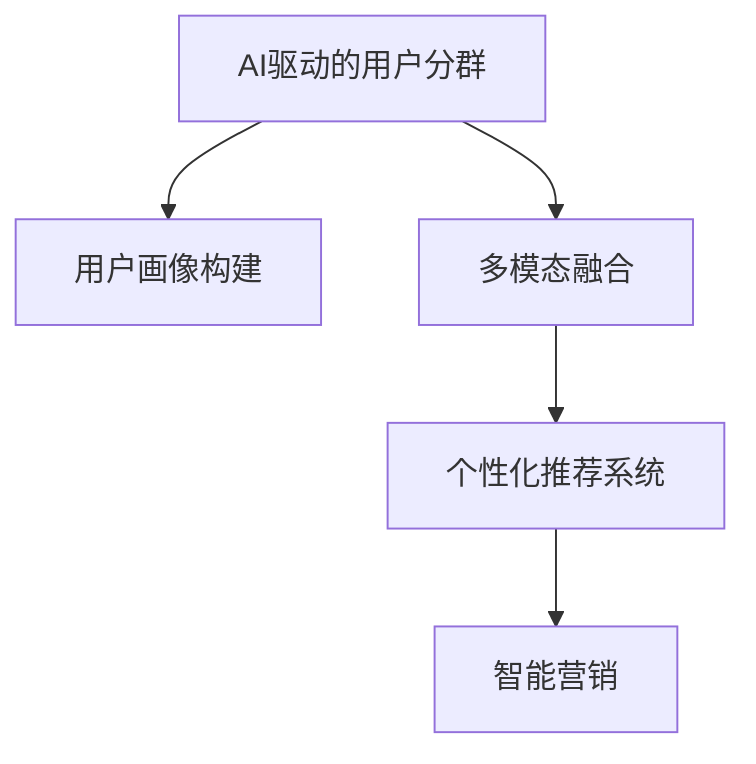

                 

# AI驱动的电商平台用户分群策略

> 关键词：AI驱动, 用户分群, 电商平台, 数据挖掘, 个性化推荐, 多模态融合, 智能营销

## 1. 背景介绍

在电子商务的数字化转型过程中，用户分群策略的制定扮演了至关重要的角色。传统的用户分群依赖于简单的统计特征和手工规则，效率低下，准确度不高。而随着人工智能技术的快速发展，电商平台开始通过数据驱动的智能分析，精确识别用户的特征和行为模式，实现更高效、精准的用户分群，驱动个性化推荐和智能营销的策略。

### 1.1 问题由来

随着电子商务平台商品种类不断增加和用户行为模式的不断变化，传统用户分群策略已无法满足日益复杂的用户需求。而基于AI的用户分群技术，通过综合利用用户的历史行为数据、购买记录、社交媒体信息等多源数据，能够构建更为精确和动态的客户画像，实现更个性化和精细化的推荐和服务。

### 1.2 问题核心关键点

用户分群的核心关键点包括：
- 数据收集：全面、准确、实时地获取用户的多维数据。
- 特征工程：选择合适的特征，构建用户特征向量。
- 建模算法：选择和优化算法，实现高效、准确的分群效果。
- 智能营销：将分群结果转化为精准的营销策略和个性化推荐。

本文将详细探讨如何利用AI技术进行电商平台用户分群，并具体剖析各个关键环节的实现方法。

## 2. 核心概念与联系

### 2.1 核心概念概述

为更好地理解AI驱动的电商平台用户分群，本节将介绍几个密切相关的核心概念：

- AI驱动的电商平台用户分群：利用人工智能技术，对电商平台用户进行精准分群，从而提升推荐和营销效果。
- 用户画像(User Profiling)：构建用户特征向量，描述用户的行为和属性。
- 多模态融合(Multi-modal Fusion)：融合用户在不同模态（如文本、图像、行为）下的数据，提升用户画像的丰富度和准确度。
- 个性化推荐系统(Personalized Recommendation System)：根据用户画像和历史行为数据，为用户推荐商品。
- 智能营销(Intelligent Marketing)：根据用户分群结果，制定个性化的营销策略，提升用户转化率和满意度。

这些核心概念之间的逻辑关系可以通过以下Mermaid流程图来展示：



这个流程图展示了大语言模型的核心概念及其之间的关系：

1. AI驱动的用户分群技术通过多模态融合，从用户的多维度数据中构建精准的用户画像。
2. 个性化推荐系统根据用户画像和历史行为数据，为用户推荐商品。
3. 智能营销系统根据用户分群结果，制定个性化的营销策略，提升用户转化率和满意度。

这些概念共同构成了AI驱动的电商平台用户分群的核心框架，使其能够更好地服务电商平台的推荐和营销需求。

## 3. 核心算法原理 & 具体操作步骤
### 3.1 算法原理概述

基于AI的电商平台用户分群，本质上是一个数据挖掘和机器学习的过程。其核心思想是：利用机器学习算法，对电商平台用户的多维度数据进行综合分析，从中提取出有价值的特征，构建用户画像，并用于个性化推荐和智能营销策略的制定。

形式化地，假设用户数据集为 $D=\{(x_i, y_i)\}_{i=1}^N$，其中 $x_i$ 为用户特征向量，$y_i$ 为其他相关的标签信息（如购买记录、浏览行为等）。用户分群的目标是找到最优的特征集合 $F=\{f_k\}_{k=1}^K$，使得根据这些特征构建的用户画像 $P_{\theta}(x_i)$ 与真实标签 $y_i$ 的误差最小。具体来说，模型需要最小化如下损失函数：

$$
\min_{\theta} \mathcal{L}(P_{\theta}, D)
$$

其中 $\theta$ 为模型参数，$\mathcal{L}$ 为损失函数，可以选用均方误差、交叉熵等。

### 3.2 算法步骤详解

基于AI的电商平台用户分群一般包括以下几个关键步骤：

**Step 1: 数据预处理**
- 数据收集：从电商平台中获取用户的多源数据，如历史购买记录、浏览行为、社交媒体信息等。
- 数据清洗：去除噪声和异常值，保证数据的准确性和完整性。
- 数据归一化：将不同模态的数据统一到相同的量级。

**Step 2: 特征工程**
- 特征选择：选择与目标标签最相关的特征，构建用户特征向量。
- 特征提取：对原始数据进行降维、提取等操作，生成高维特征。
- 特征组合：将不同特征进行组合，提升特征向量的表示能力。

**Step 3: 模型选择与训练**
- 模型选择：根据数据特征和任务需求，选择合适的机器学习模型。
- 模型训练：使用训练数据集对模型进行训练，找到最优的模型参数。

**Step 4: 用户画像构建**
- 特征融合：将用户的多维度特征进行融合，构建用户画像。
- 用户画像存储：将用户画像存储到数据库或缓存中，便于后续查询和使用。

**Step 5: 个性化推荐与智能营销**
- 个性化推荐：根据用户画像和历史行为数据，为用户推荐商品。
- 智能营销：根据用户分群结果，制定个性化的营销策略，提升用户转化率和满意度。

### 3.3 算法优缺点

基于AI的电商平台用户分群方法具有以下优点：
1. 准确性高：利用多模态融合和机器学习技术，能够更精准地识别用户特征和行为模式。
2. 个性化强：构建的用户画像能够反映用户的真实需求和偏好，实现更个性化的推荐和服务。
3. 实时性高：基于AI的推荐系统能够实时更新用户画像和推荐结果，提升用户体验。
4. 可扩展性强：能够轻松应对电商平台用户规模的扩大和业务场景的变化。

同时，该方法也存在一定的局限性：
1. 数据需求大：需要获取大量的用户数据，对平台的隐私保护和数据安全提出了更高的要求。
2. 计算资源消耗高：涉及多模态数据的融合和机器学习模型的训练，计算资源消耗较大。
3. 模型复杂度高：高维度的用户画像和多模态融合方法，使得模型训练和优化过程较为复杂。
4. 结果解释性差：基于黑盒模型的用户画像和推荐系统，难以解释其内部决策逻辑。

尽管存在这些局限性，但就目前而言，基于AI的用户分群方法仍是大规模电商平台的推荐和营销的重要工具。未来相关研究的方向在于如何进一步降低数据需求，提高模型的实时性和可解释性，同时优化计算资源消耗。

### 3.4 算法应用领域

基于AI的电商平台用户分群技术，已在电商、金融、医疗等多个领域得到广泛应用，包括：

- 电商推荐系统：根据用户的历史行为数据，推荐符合其偏好的商品。
- 金融风险管理：通过分析用户的交易行为，识别潜在的风险用户。
- 医疗疾病诊断：利用用户的健康数据，进行疾病预测和早期筛查。
- 智能客服系统：根据用户的问题，自动推荐相关的答案或引导至人工客服。
- 社交媒体广告：根据用户的社交行为和兴趣，精准投放广告。

除了这些经典应用外，AI驱动的用户分群技术还在更多领域不断扩展，如智慧城市、智能家居等，为各行各业带来变革性影响。

## 4. 数学模型和公式 & 详细讲解 & 举例说明
### 4.1 数学模型构建

本节将使用数学语言对基于AI的电商平台用户分群过程进行更加严格的刻画。

假设用户数据集为 $D=\{(x_i, y_i)\}_{i=1}^N$，其中 $x_i$ 为用户特征向量，$y_i$ 为其他相关的标签信息（如购买记录、浏览行为等）。用户分群的目标是找到最优的特征集合 $F=\{f_k\}_{k=1}^K$，使得根据这些特征构建的用户画像 $P_{\theta}(x_i)$ 与真实标签 $y_i$ 的误差最小。具体来说，模型需要最小化如下损失函数：

$$
\min_{\theta} \mathcal{L}(P_{\theta}, D) = \frac{1}{N} \sum_{i=1}^N \ell(P_{\theta}(x_i), y_i)
$$

其中 $\ell$ 为损失函数，可以选用均方误差、交叉熵等。以均方误差为例，用户画像 $P_{\theta}(x_i)$ 与真实标签 $y_i$ 的误差为：

$$
\ell(P_{\theta}(x_i), y_i) = \frac{1}{2} \| P_{\theta}(x_i) - y_i \|_2^2
$$

### 4.2 公式推导过程

以下我们以电商平台推荐系统为例，推导均方误差损失函数的详细计算过程。

假设用户画像 $P_{\theta}(x_i)$ 是一个 $d$ 维的向量，由 $K$ 个特征 $f_k(x_i)$ 组合而成：

$$
P_{\theta}(x_i) = \sum_{k=1}^K \theta_k f_k(x_i)
$$

其中 $\theta_k$ 为特征 $f_k$ 的系数。对于均方误差损失函数，我们需要最小化如下公式：

$$
\min_{\theta} \frac{1}{2} \sum_{i=1}^N \| P_{\theta}(x_i) - y_i \|_2^2
$$

将其展开并简化，得：

$$
\min_{\theta} \frac{1}{2} \sum_{i=1}^N \sum_{k=1}^K (\theta_k f_k(x_i) - y_i)^2
$$

根据链式法则，求偏导得到：

$$
\frac{\partial \mathcal{L}(P_{\theta}, D)}{\partial \theta_k} = \frac{1}{N} \sum_{i=1}^N (f_k(x_i) - y_i) f_k(x_i)
$$

通过优化算法（如梯度下降法），更新模型参数 $\theta$，使损失函数 $\mathcal{L}(P_{\theta}, D)$ 最小化。

### 4.3 案例分析与讲解

以电商平台推荐系统为例，我们进行具体分析：

假设用户画像 $P_{\theta}(x_i)$ 由用户的浏览历史 $h$、浏览时长 $t$ 和购买记录 $p$ 三个特征组成：

$$
P_{\theta}(x_i) = \theta_h h_i + \theta_t t_i + \theta_p p_i
$$

其中 $h_i$、$t_i$ 和 $p_i$ 为用户的浏览历史、浏览时长和购买记录。以均方误差损失函数为例，模型需要最小化如下公式：

$$
\min_{\theta} \frac{1}{2} \sum_{i=1}^N \| \theta_h h_i + \theta_t t_i + \theta_p p_i - y_i \|_2^2
$$

假设用户画像和真实标签之间存在线性关系：

$$
P_{\theta}(x_i) = y_i
$$

则损失函数可以简化为：

$$
\mathcal{L}(P_{\theta}, D) = \frac{1}{2N} \sum_{i=1}^N (h_i - y_i)^2 + (t_i - y_i)^2 + (p_i - y_i)^2
$$

通过对损失函数求偏导，并使用梯度下降算法进行模型训练，即可得到最优的模型参数 $\theta$。

## 5. 项目实践：代码实例和详细解释说明
### 5.1 开发环境搭建

在进行用户分群实践前，我们需要准备好开发环境。以下是使用Python进行Scikit-learn开发的开发环境配置流程：

1. 安装Anaconda：从官网下载并安装Anaconda，用于创建独立的Python环境。

2. 创建并激活虚拟环境：
```bash
conda create -n py3_env python=3.8 
conda activate py3_env
```

3. 安装Scikit-learn：
```bash
pip install -U scikit-learn
```

4. 安装其他必要的工具包：
```bash
pip install numpy pandas scipy matplotlib seaborn scikit-optimize joblib
```

完成上述步骤后，即可在`py3_env`环境中开始用户分群实践。

### 5.2 源代码详细实现

这里我们以电商平台推荐系统为例，给出使用Scikit-learn进行用户分群的Python代码实现。

首先，定义用户分群的函数：

```python
from sklearn.model_selection import train_test_split
from sklearn.linear_model import LinearRegression
from sklearn.metrics import mean_squared_error

def user_profiling(train_data, test_data, features):
    # 数据预处理
    train_features = train_data[features]
    train_labels = train_data['target']
    test_features = test_data[features]
    test_labels = test_data['target']
    
    # 特征工程
    train_features = train_features.copy()
    test_features = test_features.copy()
    
    # 模型选择与训练
    model = LinearRegression()
    model.fit(train_features, train_labels)
    
    # 用户画像构建
    train_user_profiles = model.predict(train_features)
    test_user_profiles = model.predict(test_features)
    
    # 评估效果
    mse = mean_squared_error(test_labels, test_user_profiles)
    print(f"Mean Squared Error: {mse:.3f}")
    
    # 返回用户画像
    return train_user_profiles, test_user_profiles
```

然后，调用用户分群函数并展示结果：

```python
# 加载数据集
data = pd.read_csv('user_data.csv')

# 数据分割
train_data, test_data = train_test_split(data, test_size=0.2, random_state=42)

# 特征选择
features = ['browsing_history', 'browsing_duration', 'purchase_records']

# 用户分群
train_profiles, test_profiles = user_profiling(train_data, test_data, features)

# 展示结果
print('Train Profiles:')
print(train_profiles[:5])
print('Test Profiles:')
print(test_profiles[:5])
```

以上就是使用Scikit-learn进行电商平台推荐系统用户分群的完整代码实现。可以看到，Scikit-learn提供了丰富的机器学习算法和工具，使得用户分群任务的开发和优化变得简单高效。

### 5.3 代码解读与分析

让我们再详细解读一下关键代码的实现细节：

**用户分群函数**：
- `train_data`和`test_data`：包含用户数据的数据集。
- `features`：用户特征向量中包含的特征名称。
- `train_features`和`train_labels`：训练数据集中的特征和标签。
- `test_features`和`test_labels`：测试数据集中的特征和标签。
- `model`：选择和训练线性回归模型。
- `train_user_profiles`和`test_user_profiles`：根据模型训练的用户画像。
- `mean_squared_error`：计算预测值和真实值之间的均方误差。

**用户分群函数调用**：
- `pd.read_csv`：读取CSV格式的数据集。
- `train_test_split`：将数据集划分为训练集和测试集。
- `user_profiling`：调用用户分群函数进行模型训练和用户画像构建。
- `train_profiles`和`test_profiles`：获取训练集和测试集的用户画像。

**结果展示**：
- `print`：将用户画像的前5行输出，方便查看结果。

可以看到，Scikit-learn提供了简洁易用的API，使得用户分群任务在开发过程中可以更加快速迭代。同时，Scikit-learn还提供了丰富的评估指标和可视化工具，方便开发者进行效果评估和优化。

## 6. 实际应用场景
### 6.1 智能客服系统

基于AI驱动的用户分群技术，可以实现智能客服系统的优化。传统客服系统往往难以应对海量用户的咨询需求，而基于用户分群的智能客服系统，能够根据用户画像自动匹配合适的客服专家，提供个性化、快速的服务。

在技术实现上，可以收集用户的咨询记录、历史购买记录、浏览行为等数据，构建用户画像。然后根据用户画像自动匹配合适的客服专家，并提供个性化的服务。对于用户提出的新问题，智能客服系统还可以动态调整回答策略，提供更准确的答案。

### 6.2 个性化推荐系统

电商平台推荐系统是用户分群技术的重要应用之一。通过对用户的多维度数据进行深入分析，推荐系统能够为用户推荐更符合其兴趣和需求的商品，提升用户体验和转化率。

在推荐系统的开发中，可以利用用户画像构建个性化推荐模型，根据用户的历史行为数据和兴趣特征，动态调整推荐算法，为用户推荐更合适的商品。例如，对于购买过某种商品的客户，推荐系统可以自动匹配类似商品；对于浏览过某个类别商品的客户，推荐系统可以自动推荐该类别的其他商品。

### 6.3 智能营销

智能营销是用户分群技术的另一重要应用领域。通过精准的用户画像，企业可以制定更有效的营销策略，提高广告的投放效果和用户转化率。

在营销策略的制定中，可以依据用户分群结果，进行定向广告投放、个性化邮件营销等。例如，对于高价值用户，可以投放更精准的广告；对于有潜力的客户，可以通过个性化邮件进行深度触达，提升其购买意愿。

### 6.4 未来应用展望

随着用户分群技术的不断发展，未来将有更多场景可以应用到AI驱动的电商平台用户分群中。例如：

- 金融风控：通过分析用户的交易行为和信用记录，构建用户画像，识别潜在的风险用户。
- 医疗诊断：利用用户的健康数据，进行疾病预测和早期筛查，提升诊疗效果。
- 社交广告：根据用户的社交行为和兴趣，精准投放广告，提高广告效果。
- 智能家居：通过分析用户的居家习惯和偏好，提供个性化的智能家居服务。

这些应用场景将进一步拓展AI驱动的用户分群技术的应用范围，带来更大的社会价值和经济效益。

## 7. 工具和资源推荐
### 7.1 学习资源推荐

为了帮助开发者系统掌握AI驱动的电商平台用户分群技术，这里推荐一些优质的学习资源：

1. 《Python机器学习》：适合有一定编程基础的读者，详细介绍了机器学习和数据挖掘的基本概念和算法。
2. Scikit-learn官方文档：Scikit-learn的官方文档，提供了丰富的算法和工具的详细介绍和使用方法。
3. Kaggle竞赛：Kaggle上许多优秀的用户分群竞赛项目，可以借鉴他人的思路和解决方案。
4. Coursera课程：Coursera上提供多门数据挖掘和机器学习的在线课程，适合系统学习。
5. 机器学习竞赛网站：如Kaggle、DrivenData等，提供丰富的数据集和竞赛机会，可以帮助开发者提升实战能力。

通过对这些资源的学习实践，相信你一定能够快速掌握AI驱动的用户分群技术，并用于解决实际的电商问题。

### 7.2 开发工具推荐

高效的开发离不开优秀的工具支持。以下是几款用于用户分群开发的常用工具：

1. Scikit-learn：Python中的机器学习库，提供了丰富的算法和工具，方便开发和优化用户分群系统。
2. Pandas：Python中的数据处理库，支持大规模数据的处理和分析，方便数据预处理和特征工程。
3. NumPy：Python中的数值计算库，支持高效的数值计算和矩阵运算，方便模型训练和优化。
4. Matplotlib：Python中的可视化库，支持图表绘制，方便数据可视化。
5. Seaborn：Python中的高级可视化库，支持更美观和复杂的图表展示。

合理利用这些工具，可以显著提升用户分群任务的开发效率，加快创新迭代的步伐。

### 7.3 相关论文推荐

AI驱动的用户分群技术的发展源于学界的持续研究。以下是几篇奠基性的相关论文，推荐阅读：

1. K-means: A method for clustering in the absence of class labels (K-means)：K-means聚类算法，经典的无监督学习算法，用于用户分群的初步聚类。
2. Deep Learning for Personalized Recommendation: A User-Centric Approach：介绍深度学习在个性化推荐系统中的应用，包括用户画像和推荐算法的详细实现。
3. Multi-Task Learning for User Segmentation with Latent Themes in User-Product Interaction Networks：提出多任务学习在用户分群中的应用，利用用户产品互动网络中的隐式主题信息进行用户聚类。
4. User Profiling and Recommendation: A Survey and Taxonomy：综述用户分群和推荐系统的研究进展，提供丰富的算法和工具。
5. How to Conduct a Machine Learning Practice Workshop：介绍如何进行机器学习项目的开发和优化，包含项目实践的详细流程。

这些论文代表了大用户分群技术的发展脉络。通过学习这些前沿成果，可以帮助研究者把握学科前进方向，激发更多的创新灵感。

## 8. 总结：未来发展趋势与挑战
### 8.1 总结

本文对AI驱动的电商平台用户分群方法进行了全面系统的介绍。首先阐述了用户分群的重要性和AI驱动技术的应用背景，明确了用户分群在提升推荐和营销效果中的关键作用。其次，从原理到实践，详细讲解了用户分群的数学模型和具体算法，给出了用户分群任务开发的完整代码实例。同时，本文还广泛探讨了用户分群技术在智能客服、个性化推荐、智能营销等多个领域的应用前景，展示了AI驱动用户分群技术的巨大潜力。

通过本文的系统梳理，可以看到，AI驱动的用户分群技术正在成为电商平台推荐和营销的重要工具，极大地拓展了电商平台的用户分群方式和策略。受益于AI技术的广泛应用，电商平台能够在更短的时间内获取更精准的用户画像，实现更高效的个性化推荐和智能营销，为电商平台的数字化转型带来更大的推动力。

### 8.2 未来发展趋势

展望未来，AI驱动的电商平台用户分群技术将呈现以下几个发展趋势：

1. 深度学习算法的应用将越来越广泛。随着深度学习算法的不断发展，用户分群系统将更加高效、准确。
2. 多模态融合将成为用户分群的重要方向。结合用户的文本数据、行为数据、社交数据等多模态信息，构建更丰富、准确的用户画像。
3. 自动化和智能化水平将不断提高。利用机器学习和深度学习技术，用户分群系统将实现更高效的自动化和智能化。
4. 数据隐私和安全将受到更多重视。在数据收集和使用过程中，将更加注重用户隐私和数据安全。
5. 个性化推荐将更加精准。结合用户的兴趣和行为数据，推荐系统将能够提供更符合用户需求的个性化推荐。
6. 用户分群将更具可解释性。利用可解释性较强的算法，用户分群系统将能够更好地解释其决策过程和结果。

这些趋势凸显了AI驱动的用户分群技术的广阔前景。这些方向的探索发展，必将进一步提升用户分群系统的性能和应用范围，为电商平台带来更多的创新和突破。

### 8.3 面临的挑战

尽管AI驱动的用户分群技术已经取得了显著进展，但在实际应用中仍面临诸多挑战：

1. 数据隐私和安全性：在用户数据收集和处理过程中，如何保护用户隐私和数据安全，是用户分群系统的重要挑战。
2. 数据质量和完整性：用户数据的质量和完整性对用户分群的效果有重要影响，如何获取高质量、完整的数据是系统开发的关键。
3. 计算资源消耗：多模态数据融合和深度学习模型的训练，对计算资源的需求较高，如何优化计算资源消耗，提高系统效率，是系统优化的一个重要方向。
4. 模型复杂度：深度学习模型往往具有较高的复杂度，如何简化模型结构，提高模型的解释性，是系统开发中需要关注的问题。
5. 结果可解释性：深度学习模型的黑盒特性，使得其决策过程难以解释，如何提高系统的可解释性，是用户分群系统的重要目标。
6. 跨领域应用：用户分群技术在不同领域的应用场景中，需要考虑不同的业务需求和数据特点，如何进行跨领域优化，是系统开发中的一个难点。

这些挑战需要系统开发者在模型设计、数据处理、算法优化等方面进行深入研究，逐步克服这些难题，才能使AI驱动的用户分群技术更好地应用于实际场景中。

### 8.4 研究展望

面对AI驱动的用户分群技术面临的挑战，未来的研究需要在以下几个方面寻求新的突破：

1. 提升模型的可解释性：利用可解释性较强的算法，提高用户分群系统的透明度和可信度。
2. 降低数据需求：通过数据增强、迁移学习等方法，降低对大量标注数据的依赖，提高系统的鲁棒性和泛化能力。
3. 优化计算资源消耗：结合模型压缩、量化加速等技术，提高系统的运行效率，降低计算成本。
4. 跨领域优化：根据不同领域的特点，设计针对性的用户分群算法和策略，提高系统的可扩展性。
5. 结合AI和人类智慧：将AI技术和人类智慧结合，提升用户分群系统的精准度和鲁棒性。
6. 引入伦理道德约束：在用户分群系统的设计中，引入伦理导向的评估指标，确保系统的公平性和安全性。

这些研究方向和探索，必将引领AI驱动的用户分群技术迈向更高的台阶，为电商平台带来更多的创新和突破，推动社会的数字化转型。

## 9. 附录：常见问题与解答

**Q1：AI驱动的用户分群是否适用于所有电商平台？**

A: AI驱动的用户分群技术适用于大多数电商平台，特别是那些用户规模较大、业务复杂、数据多样化的平台。但对于一些小型电商平台，可能受到数据量和计算资源的限制，需要结合实际情况进行优化和调整。

**Q2：如何选择合适的用户分群算法？**

A: 用户分群算法的选择需要考虑多个因素，包括数据特征、任务需求、计算资源等。常用的算法包括K-means、层次聚类、DBSCAN、LDA等。一般建议选择简单、高效的算法，并在实践中不断优化。

**Q3：用户分群过程中需要注意哪些数据问题？**

A: 用户分群过程中，需要注意以下数据问题：
1. 数据缺失：利用数据补全、插值等方法处理缺失数据。
2. 数据异常：通过异常值检测和处理，确保数据的准确性。
3. 数据一致性：确保不同数据源中的数据一致性，避免数据冲突和重复。
4. 数据隐私：在数据收集和使用过程中，严格遵守数据隐私保护法规。

**Q4：如何优化用户分群系统的计算资源消耗？**

A: 用户分群系统的计算资源消耗主要集中在多模态数据融合和深度学习模型的训练过程中。为了优化计算资源消耗，可以采取以下措施：
1. 数据降维：利用PCA、LDA等方法对数据进行降维处理，减少数据维度。
2. 模型压缩：利用模型压缩、量化等技术，减小模型参数量，提高模型效率。
3. 分布式训练：利用分布式训练框架，并行计算，提升训练速度。
4. 增量学习：利用增量学习技术，对新数据进行实时更新，避免重复训练。

**Q5：用户分群结果对电商平台的影响有哪些？**

A: 用户分群结果对电商平台的影响主要体现在以下方面：
1. 推荐系统：根据用户分群结果，推荐系统能够提供更符合用户需求的商品，提升用户体验和转化率。
2. 智能营销：通过用户分群结果，制定个性化的营销策略，提高广告投放效果和用户转化率。
3. 智能客服：根据用户分群结果，智能客服系统能够提供个性化服务，提升客户满意度。
4. 风险控制：通过用户分群结果，识别潜在风险用户，提升风险控制能力。

这些影响使得用户分群结果成为电商平台数字化转型的重要工具，对电商平台的发展具有重要意义。

---

作者：禅与计算机程序设计艺术 / Zen and the Art of Computer Programming

