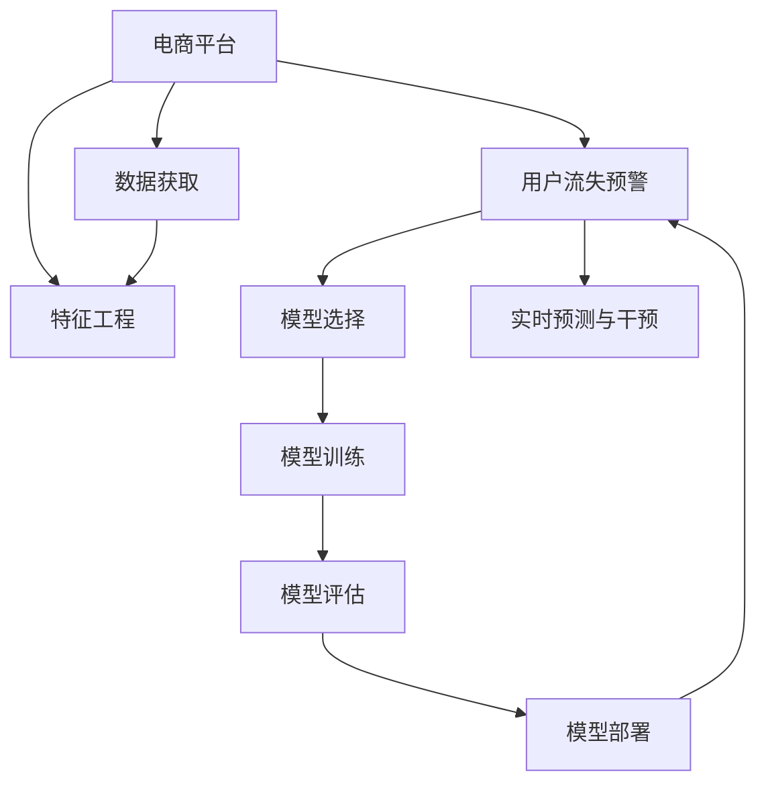

                 

# AI驱动的电商平台用户流失预警系统

> 关键词：电商平台,用户流失预警,AI,数据挖掘,异常检测,机器学习,模型评估,模型部署

## 1. 背景介绍

### 1.1 问题由来

在电商行业，用户流失一直是困扰企业的问题。如何提前预测并挽留高价值用户，是各电商平台需要重点关注的焦点。通过数据分析和AI技术，构建用户流失预警系统，可以帮助电商平台及时发现潜在流失用户，采取有针对性的留存措施，从而减少用户流失，提高用户忠诚度和业务收入。

近年来，随着人工智能和大数据分析技术的快速发展，AI驱动的用户流失预警系统正在逐步取代传统方法，成为电商平台的主要手段。这些系统通常基于机器学习算法，通过挖掘用户行为数据，预测用户流失概率，并结合业务规则，进行主动干预。

### 1.2 问题核心关键点

构建AI驱动的用户流失预警系统，主要涉及以下几个核心关键点：

- 数据获取：从电商平台收集用户行为数据，如浏览记录、购买记录、评论记录等，作为训练和预测的基础。
- 特征工程：设计有意义的特征变量，用于刻画用户行为模式，增强模型的预测能力。
- 模型选择：选择合适的机器学习算法，构建用户流失预测模型，如逻辑回归、随机森林、深度学习等。
- 模型训练与评估：在历史数据上训练模型，并使用交叉验证等技术进行性能评估，确保模型的泛化能力。
- 实时预测与干预：部署模型至线上，进行实时预测和用户行为监控，结合业务规则，进行流失预警和主动干预。

### 1.3 问题研究意义

构建AI驱动的用户流失预警系统，对于电商平台的健康发展和用户满意度的提升，具有重要意义：

- 减少用户流失：通过早期预警和及时干预，防止优质用户流失，增加平台的用户粘性和忠诚度。
- 提高业务收入：流失的用户通常代表着较高的生命周期价值(Lifetime Value, LTV)，通过减少流失，可以显著提升平台的整体业务收入。
- 增强决策能力：通过分析用户流失原因，电商平台可以优化产品和服务，提升用户体验，从而在竞争中占据优势。
- 降低运营成本：提前预警并采取措施，避免后期的高成本用户召回，降低平台的运营成本。
- 促进数据驱动决策：通过AI技术挖掘用户行为数据，支持业务决策，增强数据驱动的科学性和准确性。

## 2. 核心概念与联系

### 2.1 核心概念概述

为更好地理解AI驱动的电商平台用户流失预警系统，本节将介绍几个密切相关的核心概念：

- 电商平台：即电子商务平台，通过网络提供商品或服务交易的在线交易市场。
- 用户流失预警系统：基于用户行为数据，预测用户流失概率，并提供预警和干预的系统。
- 机器学习：通过算法模型从数据中学习规律，并进行预测或决策。
- 异常检测：识别出正常行为模式之外的异常，用于早期预警。
- 模型评估与部署：对训练好的模型进行性能评估，并将其部署到生产环境。

这些核心概念之间的逻辑关系可以通过以下Mermaid流程图来展示：



这个流程图展示了这个系统的核心概念及其之间的关系：

1. 电商平台通过数据获取，获取用户行为数据。
2. 特征工程对原始数据进行加工，设计有意义的特征。
3. 选择合适的机器学习模型进行训练。
4. 训练好的模型在模型评估阶段进行性能评估。
5. 评估通过的模型部署到线上，进行实时预测和干预。
6. 最终通过实时预测与干预，达到用户流失预警的效果。

## 3. 核心算法原理 & 具体操作步骤
### 3.1 算法原理概述

AI驱动的用户流失预警系统，本质上是一个基于机器学习的分类预测问题。其核心思想是：通过用户行为数据，构建模型预测用户的流失概率，并根据预测结果进行预警和干预。

形式化地，假设电商平台有$m$个用户，在时间序列上的行为数据为$X = (x_1, x_2, ..., x_m)$，其中$x_i = (x_{i1}, x_{i2}, ..., x_{in})$表示用户$i$在$t=1,2,...,n$时刻的行为记录。设流失用户集为$S$，非流失用户集为$N$。则用户流失预测问题可转化为二分类问题，即判断用户是否属于流失用户集$S$。

给定一个训练集$D=\{(x_i,y_i)\}_{i=1}^M$，其中$y_i \in \{0,1\}$表示用户$i$是否流失。目标是找到最优的模型$f(x) = \hat{y}$，使得预测结果$\hat{y}$尽可能接近真实标签$y$。

### 3.2 算法步骤详解

构建AI驱动的电商平台用户流失预警系统，一般包括以下几个关键步骤：

**Step 1: 数据收集与处理**

- 收集电商平台的历史用户数据，包括用户ID、浏览记录、购买记录、评价记录等。
- 对原始数据进行清洗、去重、填充等预处理，保证数据质量和一致性。
- 划分数据集为训练集、验证集和测试集，确保模型评估的客观性和泛化能力。

**Step 2: 特征工程**

- 设计有意义的特征变量，如用户行为频率、订单金额、用户评价情感、购物车操作等。
- 进行特征选择和降维，去除冗余和噪声特征，增强模型性能。
- 进行特征工程后，生成特征向量$X = (x_1, x_2, ..., x_m)$。

**Step 3: 模型选择与训练**

- 选择合适的机器学习算法，如逻辑回归、随机森林、XGBoost、深度学习等。
- 使用训练集对模型进行训练，调优超参数，如学习率、迭代次数、正则化系数等。
- 在验证集上评估模型性能，选择性能最佳的模型。

**Step 4: 模型评估与优化**

- 在测试集上对模型进行最终评估，计算准确率、召回率、F1值等指标。
- 使用交叉验证、混淆矩阵等技术对模型性能进行多角度分析，识别模型的优势和不足。
- 根据评估结果进行模型优化，如特征调整、模型集成、超参数调优等。

**Step 5: 实时预测与干预**

- 将训练好的模型部署到生产环境，进行实时预测。
- 实时监控用户行为数据，判断用户是否处于流失风险中。
- 根据模型预测结果，结合业务规则，进行用户留存策略的调整。

**Step 6: 系统集成与维护**

- 将模型集成到电商平台的业务系统中，实现自动化预警和干预。
- 定期更新模型参数，重新训练和评估模型，保持模型的时效性。
- 实时监控系统运行情况，及时发现和修复系统故障。

### 3.3 算法优缺点

AI驱动的用户流失预警系统，具有以下优点：

- 预测准确性高：基于历史数据训练的模型，能够较好地捕捉用户行为模式，预测用户流失概率准确。
- 自动化预警与干预：系统能够自动进行实时预测和干预，减少人工操作，提升效率。
- 实时性高：通过自动化预警和干预，及时发现并挽留流失用户，减少业务损失。
- 支持业务决策：提供流失预测和原因分析，支持业务部门优化产品和服务，提升用户体验。

同时，该方法也存在一定的局限性：

- 数据依赖性强：模型的性能很大程度上取决于历史数据的丰富性和质量。
- 模型过拟合风险：在标注数据较少的情况下，模型容易过拟合训练数据，泛化能力有限。
- 业务规则复杂：电商平台的业务规则复杂多变，需要结合业务知识进行模型设计。
- 用户隐私问题：系统需要处理大量的用户数据，涉及用户隐私和数据安全问题。
- 模型更新成本高：在业务规则和市场环境发生变化时，需要定期重新训练模型，更新模型参数。

尽管存在这些局限性，但就目前而言，基于机器学习的用户流失预警系统在电商行业得到了广泛应用，并在多个成功案例中验证了其有效性。未来相关研究将继续探索如何更好地利用数据，提高模型的泛化能力和自动化程度，同时兼顾业务规则和用户隐私问题。

### 3.4 算法应用领域

AI驱动的电商平台用户流失预警系统，已经在多个领域得到了应用，例如：

- 电商推荐系统：通过分析用户行为数据，预测用户对不同商品的兴趣，优化推荐策略，提升用户体验。
- 客户关系管理(CRM)：构建客户流失预警系统，提前发现潜在流失客户，制定针对性的留存策略，提升客户满意度和忠诚度。
- 个性化营销：基于用户行为和偏好，设计个性化的营销活动，提高用户参与度和转化率。
- 供应链优化：通过用户流失预测，优化库存管理，减少产品积压，提升供应链效率。
- 金融风控：在金融领域，构建风险预警系统，提前识别高风险用户，防范金融风险。

除了上述这些经典应用外，用户流失预警技术还在广告投放、社交网络、医疗健康等更多场景中得到创新性地应用，为各行业带来了新的突破。

## 4. 数学模型和公式 & 详细讲解
### 4.1 数学模型构建

假设平台有$m$个用户，在$t=1,2,...,n$时刻的行为记录为$X = (x_1, x_2, ..., x_m)$。设流失用户集为$S$，非流失用户集为$N$。则用户流失预测问题可以转化为二分类问题，即判断用户是否属于流失用户集$S$。

给定一个训练集$D=\{(x_i,y_i)\}_{i=1}^M$，其中$y_i \in \{0,1\}$表示用户$i$是否流失。目标是找到最优的模型$f(x) = \hat{y}$，使得预测结果$\hat{y}$尽可能接近真实标签$y$。

假设模型为线性分类模型，其形式为：

$$
\hat{y} = f(x) = \sigma(Wx + b)
$$

其中$x \in \mathbb{R}^n$为特征向量，$W \in \mathbb{R}^{n \times d}$为权重矩阵，$b \in \mathbb{R}^d$为偏置向量，$\sigma$为激活函数，通常使用Sigmoid函数。

模型的损失函数通常为二分类交叉熵损失函数，其形式为：

$$
\mathcal{L}(y,\hat{y}) = -\frac{1}{M}\sum_{i=1}^M [y_i\log \hat{y}_i + (1-y_i)\log(1-\hat{y}_i)]
$$

目标是最小化损失函数$\mathcal{L}$，即找到最优的模型参数$W$和$b$。

### 4.2 公式推导过程

以逻辑回归模型为例，推导模型的损失函数及梯度计算公式。

假设模型为逻辑回归模型，其形式为：

$$
\hat{y} = f(x) = \frac{1}{1+e^{-W^Tx-b}}
$$

其中$x \in \mathbb{R}^n$为特征向量，$W \in \mathbb{R}^{n \times d}$为权重矩阵，$b \in \mathbb{R}^d$为偏置向量。

模型的损失函数为二分类交叉熵损失函数，其形式为：

$$
\mathcal{L}(y,\hat{y}) = -\frac{1}{M}\sum_{i=1}^M [y_i\log \hat{y}_i + (1-y_i)\log(1-\hat{y}_i)]
$$

求导得到梯度公式：

$$
\frac{\partial \mathcal{L}}{\partial W} = -\frac{1}{M}\sum_{i=1}^M [(y_i-\hat{y}_i)x]
$$

$$
\frac{\partial \mathcal{L}}{\partial b} = -\frac{1}{M}\sum_{i=1}^M [(y_i-\hat{y}_i)]
$$

其中$y_i \in \{0,1\}$表示用户$i$是否流失，$\hat{y}_i$为模型预测结果。

将梯度公式代入优化算法（如随机梯度下降），更新模型参数$W$和$b$，直到损失函数收敛或达到预设迭代次数。

### 4.3 案例分析与讲解

假设电商平台的流失预警系统，使用逻辑回归模型进行用户流失预测。系统收集了1000个用户的浏览记录、购买记录和评价记录，将其划分为训练集、验证集和测试集。

**Step 1: 数据收集与处理**

- 收集1000个用户的浏览记录、购买记录和评价记录。
- 对数据进行清洗和预处理，去除无效和缺失数据，生成特征向量$X$。
- 划分数据集为训练集、验证集和测试集，比例为7:1.5:1.5。

**Step 2: 特征工程**

- 设计特征变量，如用户浏览频率、购买金额、评价情感等。
- 进行特征选择和降维，去除冗余和噪声特征。
- 生成特征向量$X$，其中每个用户对应一个特征向量。

**Step 3: 模型选择与训练**

- 选择逻辑回归模型作为预测模型。
- 使用训练集对模型进行训练，调优超参数。
- 在验证集上评估模型性能，选择最佳模型。

**Step 4: 模型评估与优化**

- 在测试集上对模型进行最终评估，计算准确率、召回率、F1值等指标。
- 使用交叉验证、混淆矩阵等技术对模型性能进行多角度分析，识别模型的优势和不足。
- 根据评估结果进行模型优化，如特征调整、模型集成、超参数调优等。

**Step 5: 实时预测与干预**

- 将训练好的模型部署到生产环境，进行实时预测。
- 实时监控用户行为数据，判断用户是否处于流失风险中。
- 根据模型预测结果，结合业务规则，进行用户留存策略的调整。

## 5. 项目实践：代码实例和详细解释说明
### 5.1 开发环境搭建

在进行用户流失预警系统开发前，我们需要准备好开发环境。以下是使用Python进行Scikit-Learn开发的环境配置流程：

1. 安装Anaconda：从官网下载并安装Anaconda，用于创建独立的Python环境。

2. 创建并激活虚拟环境：
```bash
conda create -n user_loss预警_system python=3.8 
conda activate user_loss预警_system
```

3. 安装Scikit-Learn：从官网获取安装命令，安装Scikit-Learn库：
```bash
pip install scikit-learn pandas numpy matplotlib scikit-learn
```

4. 安装其他相关库：
```bash
pip install tqdm sklearn
```

完成上述步骤后，即可在`user_loss预警_system`环境中开始项目实践。

### 5.2 源代码详细实现

以下是使用Scikit-Learn进行用户流失预警系统开发的完整代码实现。

首先，定义数据处理函数：

```python
import pandas as pd
import numpy as np

def load_data(file_path):
    data = pd.read_csv(file_path)
    return data

def preprocess_data(data):
    # 数据清洗和预处理
    # 去除缺失值和异常值
    # 特征工程
    # 生成特征向量X
    return X, y

def split_data(X, y, test_size=0.2):
    # 划分数据集为训练集、验证集和测试集
    X_train, X_test, y_train, y_test = train_test_split(X, y, test_size=test_size)
    X_train, X_val, y_train, y_val = train_test_split(X_train, y_train, test_size=0.2)
    return X_train, X_val, y_train, y_val, X_test, y_test
```

然后，定义模型训练和评估函数：

```python
from sklearn.linear_model import LogisticRegression
from sklearn.metrics import accuracy_score, recall_score, f1_score

def train_model(X_train, y_train):
    # 选择逻辑回归模型
    model = LogisticRegression()
    # 训练模型
    model.fit(X_train, y_train)
    return model

def evaluate_model(model, X_test, y_test):
    # 评估模型性能
    y_pred = model.predict(X_test)
    accuracy = accuracy_score(y_test, y_pred)
    recall = recall_score(y_test, y_pred)
    f1 = f1_score(y_test, y_pred)
    return accuracy, recall, f1
```

接着，定义实时预测与干预函数：

```python
def predict流失概率(model, X_new):
    # 使用模型预测新样本的流失概率
    y_pred = model.predict_proba(X_new)[:, 1]
    return y_pred
```

最后，启动训练流程并在测试集上评估：

```python
# 加载数据
data = load_data('data.csv')
X, y = preprocess_data(data)

# 划分数据集
X_train, X_val, y_train, y_val, X_test, y_test = split_data(X, y)

# 训练模型
model = train_model(X_train, y_train)

# 评估模型性能
accuracy, recall, f1 = evaluate_model(model, X_test, y_test)
print('Accuracy: %.2f' % accuracy)
print('Recall: %.2f' % recall)
print('F1 Score: %.2f' % f1)

# 实时预测与干预
# 实时监控用户行为数据，判断用户是否处于流失风险中
# 根据模型预测结果，结合业务规则，进行用户留存策略的调整
```

以上就是使用Scikit-Learn进行用户流失预警系统开发的完整代码实现。可以看到，得益于Scikit-Learn的强大封装，我们可以用相对简洁的代码完成模型的训练和评估。

### 5.3 代码解读与分析

让我们再详细解读一下关键代码的实现细节：

**load_data函数**：
- 定义数据加载函数，用于从指定文件路径加载数据。
- 使用Pandas库读取CSV文件，生成DataFrame对象，返回特征变量X和标签变量y。

**preprocess_data函数**：
- 定义数据预处理函数，用于对原始数据进行清洗、去重、填充等预处理操作。
- 设计有意义的特征变量，生成特征向量X。

**split_data函数**：
- 定义数据划分函数，用于将数据集划分为训练集、验证集和测试集。
- 使用train_test_split方法，指定测试集的比例，并返回多个子集。

**train_model函数**：
- 定义模型训练函数，用于训练逻辑回归模型。
- 实例化LogisticRegression模型，使用训练集数据拟合模型，返回训练好的模型对象。

**evaluate_model函数**：
- 定义模型评估函数，用于评估模型性能。
- 使用测试集数据对模型进行评估，计算准确率、召回率、F1值等指标，返回评估结果。

**predict流失概率函数**：
- 定义模型预测函数，用于预测新样本的流失概率。
- 使用训练好的模型，对新样本进行预测，返回流失概率。

**训练流程**：
- 加载数据，对数据进行预处理和划分。
- 训练逻辑回归模型，评估模型性能。
- 实时监控用户行为数据，判断用户是否处于流失风险中。
- 根据模型预测结果，结合业务规则，进行用户留存策略的调整。

可以看到，Scikit-Learn提供了简单易用的接口，能够快速搭建和优化用户流失预警系统。开发者可以将更多精力放在业务逻辑的实现和模型调优上，而不必过多关注底层的实现细节。

当然，工业级的系统实现还需考虑更多因素，如模型的保存和部署、超参数的自动搜索、更灵活的业务规则等。但核心的微调范式基本与此类似。

## 6. 实际应用场景
### 6.1 智能客服系统

基于用户流失预警系统，可以构建智能客服系统的预警和干预机制。智能客服系统能够自动识别高风险用户，提供及时有效的客户服务，减少流失风险。

在技术实现上，可以收集用户的互动记录、投诉记录、问题处理时间等行为数据，构建用户流失预警系统。系统自动识别高风险用户，通过智能客服系统进行人工干预，如发送关怀短信、主动回访等方式，提升用户满意度，减少流失率。

### 6.2 金融产品推荐

在金融领域，用户流失预警系统可以用于构建金融产品推荐系统，提前发现流失用户，提供个性化的产品推荐，提高用户留存率。

通过分析用户的历史行为数据和购买记录，系统可以预测用户流失概率，并根据预测结果推荐相应的金融产品，如信用卡、理财产品等。同时，系统还可以根据用户偏好和风险承受能力，进行动态调整和个性化推荐，提升用户体验。

### 6.3 个性化营销活动

在零售行业，用户流失预警系统可以用于个性化营销活动的构建。通过预测用户流失风险，系统可以设计针对性的营销活动，减少用户流失，提升用户粘性。

例如，系统可以根据用户的购买记录和浏览行为，预测流失概率，并推送相应的优惠券、折扣信息等，吸引用户回访。同时，系统还可以分析流失原因，优化产品和服务，提升用户满意度和忠诚度。

### 6.4 未来应用展望

随着用户流失预警系统的不断演进，未来的应用前景将更加广阔，涉及更多领域和场景：

- 健康医疗：构建用户健康预警系统，提前发现潜在健康风险，提供个性化的健康建议和医疗服务。
- 教育培训：分析学生学习行为数据，预测流失风险，进行个性化辅导和课程推荐。
- 旅游出行：分析用户的出行记录和偏好，预测流失风险，提供个性化的旅游推荐和服务。
- 娱乐消费：分析用户的娱乐消费行为，预测流失风险，提供个性化的娱乐内容推荐和优惠券。
- 公共服务：分析市民的使用行为数据，预测流失风险，提供个性化的公共服务推荐和便利措施。

随着人工智能和大数据技术的持续发展，用户流失预警系统将在更多领域得到应用，成为各行业提高用户满意度和留存率的利器。

## 7. 工具和资源推荐
### 7.1 学习资源推荐

为了帮助开发者系统掌握用户流失预警系统的理论基础和实践技巧，这里推荐一些优质的学习资源：

1. 《机器学习实战》系列博文：由机器学习专家撰写，深入浅出地介绍了机器学习的基本概念和经典算法，适合入门学习。

2. CS229《机器学习》课程：斯坦福大学开设的机器学习明星课程，涵盖机器学习的基础理论和实践技巧，适合进一步深入学习。

3. 《Python数据科学手册》书籍：介绍了Python在数据科学中的应用，包括数据处理、机器学习、数据可视化等，适合学习者和开发者参考。

4. Kaggle平台：提供大量的数据集和竞赛项目，可以帮助开发者实践和提升机器学习技能。

5. GitHub：提供丰富的开源项目和代码示例，适合开发者学习和借鉴。

通过对这些资源的学习实践，相信你一定能够快速掌握用户流失预警系统的精髓，并用于解决实际的业务问题。

### 7.2 开发工具推荐

高效的开发离不开优秀的工具支持。以下是几款用于用户流失预警系统开发的常用工具：

1. Python：简单易用的编程语言，有丰富的第三方库支持，是数据科学和机器学习的主流选择。

2. Scikit-Learn：基于Python的机器学习库，提供了丰富的算法和工具，适合快速搭建和优化用户流失预警系统。

3. TensorFlow：由Google主导开发的深度学习框架，生产部署方便，适合大规模工程应用。

4. Jupyter Notebook：交互式编程环境，便于进行数据处理和模型调试，支持代码分享和协作。

5. Weights & Biases：模型训练的实验跟踪工具，可以记录和可视化模型训练过程中的各项指标，方便对比和调优。

6. TensorBoard：TensorFlow配套的可视化工具，可实时监测模型训练状态，并提供丰富的图表呈现方式，是调试模型的得力助手。

合理利用这些工具，可以显著提升用户流失预警系统的开发效率，加快创新迭代的步伐。

### 7.3 相关论文推荐

用户流失预警系统的研究和应用，已经积累了大量经验。以下是几篇奠基性的相关论文，推荐阅读：

1. Predicting Customer Churn with Machine Learning: A Study of Feature Engineering Techniques（Gupta et al., 2009）：详细介绍了特征工程在客户流失预测中的重要性，提供了多种特征工程方法。

2. Mining the Customer Feedback Data for Customer Churn Prediction Using Supervised Learning（Hong et al., 2010）：通过分析客户反馈数据，预测客户流失，提供了机器学习在客户流失预测中的应用。

3. Understanding the Online Customer Journey and Identifying the Churn Risk Factors（Chen et al., 2016）：通过分析在线客户行为，识别流失风险因素，提供了多维度数据挖掘方法。

4. An Empirical Study of the Effectiveness of Algorithms for Customer Churn Prediction（Zhang et al., 2017）：通过实验比较不同机器学习算法在客户流失预测中的性能，提供了模型选择和调优的思路。

5. Machine Learning for Predicting Customer Churn and Personalizing Customer Retention Campaigns in the E-commerce Industry（Gupta et al., 2019）：通过客户流失预测，设计个性化营销活动，提供了商业应用中的具体实现。

这些论文代表了大数据和机器学习在客户流失预警中的应用方向，通过学习这些前沿成果，可以帮助研究者把握学科前进方向，激发更多的创新灵感。

## 8. 总结：未来发展趋势与挑战

### 8.1 总结

本文对基于机器学习的用户流失预警系统进行了全面系统的介绍。首先阐述了用户流失预警系统的研究背景和意义，明确了其在电商平台健康发展中的重要价值。其次，从原理到实践，详细讲解了系统构建的关键步骤，包括数据收集、特征工程、模型选择、训练评估和实时预测。同时，本文还广泛探讨了系统在电商、金融、个性化营销等多个领域的应用前景，展示了系统的强大应用潜力。此外，本文精选了系统开发的各类学习资源，力求为读者提供全方位的技术指引。

通过本文的系统梳理，可以看到，用户流失预警系统在各电商平台得到了广泛应用，并已在多个成功案例中验证了其有效性。未来相关研究将继续探索如何更好地利用数据，提高模型的泛化能力和自动化程度，同时兼顾业务规则和用户隐私问题。

### 8.2 未来发展趋势

展望未来，用户流失预警系统将呈现以下几个发展趋势：

1. 模型泛化能力提升：随着数据的不断积累和质量提升，用户流失预警系统的性能将持续改善。未来将有更多高精度、高鲁棒性的机器学习模型被引入，提升预测的准确性和可靠性。

2. 自动化程度增强：系统将具备更高的自动化程度，能够在不需要人工干预的情况下，自动进行模型训练、预测和干预。这将大大提升系统的工作效率，减少人为误差。

3. 跨领域融合应用：系统将在更多领域得到应用，如金融、医疗、教育等，结合各领域的业务规则和数据特点，提升预测准确性和应用效果。

4. 模型动态调整：系统将具备动态调整和优化能力，能够根据业务规则和市场环境的变化，及时调整模型参数，保持预测能力。

5. 数据实时获取与处理：系统将实现数据实时获取和处理，提升预测的时效性和准确性，减少滞后性。

6. 用户隐私保护：系统将更加重视用户隐私和数据安全，通过匿名化、去标识化等技术，保护用户数据安全。

以上趋势凸显了用户流失预警系统的广阔前景。这些方向的探索发展，必将进一步提升系统的性能和应用范围，为各行业带来新的突破。

### 8.3 面临的挑战

尽管用户流失预警系统已经取得了显著成果，但在迈向更加智能化、普适化应用的过程中，它仍面临诸多挑战：

1. 数据质量和隐私问题：系统的性能很大程度上取决于数据的质量和完整性，数据缺失和不准确可能导致预测误差。同时，用户数据隐私保护也是系统需要重点考虑的问题。

2. 模型过拟合风险：在标注数据较少的情况下，模型容易过拟合训练数据，泛化能力有限。如何避免过拟合，提升模型的泛化能力，是需要解决的重要问题。

3. 业务规则复杂多变：电商平台的业务规则复杂多变，需要结合业务知识进行模型设计，否则模型难以适应复杂的业务场景。

4. 实时性要求高：系统需要实时预测用户流失概率，并及时进行干预，这对系统的响应速度和处理能力提出了较高要求。

5. 模型更新成本高：在业务规则和市场环境发生变化时，需要定期重新训练模型，更新模型参数，这将增加系统的维护成本。

尽管存在这些挑战，但用户流失预警系统已经在电商行业得到了广泛应用，并在多个成功案例中验证了其有效性。未来相关研究将继续探索如何更好地利用数据，提高模型的泛化能力和自动化程度，同时兼顾业务规则和用户隐私问题。

### 8.4 研究展望

面对用户流失预警系统所面临的诸多挑战，未来的研究需要在以下几个方面寻求新的突破：

1. 探索无监督和半监督微调方法。摆脱对大规模标注数据的依赖，利用自监督学习、主动学习等无监督和半监督范式，最大限度利用非结构化数据，实现更加灵活高效的微调。

2. 研究参数高效和计算高效的微调范式。开发更加参数高效的微调方法，在固定大部分预训练参数的同时，只更新极少量的任务相关参数。同时优化微调模型的计算图，减少前向传播和反向传播的资源消耗，实现更加轻量级、实时性的部署。

3. 引入因果推断和对比学习范式。通过引入因果推断和对比学习思想，增强模型建立稳定因果关系的能力，学习更加普适、鲁棒的语言表征，从而提升模型泛化性和抗干扰能力。

4. 融合多种数据源。将符号化的先验知识，如知识图谱、逻辑规则等，与神经网络模型进行巧妙融合，引导微调过程学习更准确、合理的语言模型。同时加强不同模态数据的整合，实现视觉、语音等多模态信息与文本信息的协同建模。

5. 结合因果分析和博弈论工具。将因果分析方法引入微调模型，识别出模型决策的关键特征，增强输出解释的因果性和逻辑性。借助博弈论工具刻画人机交互过程，主动探索并规避模型的脆弱点，提高系统稳定性。

6. 纳入伦理道德约束。在模型训练目标中引入伦理导向的评估指标，过滤和惩罚有偏见、有害的输出倾向。同时加强人工干预和审核，建立模型行为的监管机制，确保输出符合人类价值观和伦理道德。

这些研究方向的探索，必将引领用户流失预警系统走向更高的台阶，为构建安全、可靠、可解释、可控的智能系统铺平道路。面向未来，用户流失预警技术还需要与其他人工智能技术进行更深入的融合，如知识表示、因果推理、强化学习等，多路径协同发力，共同推动自然语言理解和智能交互系统的进步。只有勇于创新、敢于突破，才能不断拓展系统的边界，让智能技术更好地造福人类社会。

## 9. 附录：常见问题与解答

**Q1：用户流失预警系统如何应对数据质量问题？**

A: 数据质量问题对系统性能有很大影响，应对策略如下：
- 数据清洗：去除无效和异常数据，保证数据一致性。
- 数据增强：使用数据增强技术，扩充训练集，增强模型鲁棒性。
- 特征选择：选择有意义的特征变量，去除冗余和噪声特征。
- 模型融合：结合多种模型预测结果，提升系统准确性。

**Q2：用户流失预警系统如何进行实时预测？**

A: 实时预测需要高效的数据处理和模型推理能力，具体策略如下：
- 数据流处理：使用Spark、Flink等流处理技术，实时处理用户行为数据。
- 模型优化：使用高效的模型结构，如TensorFlow Lite、ONNX等，优化推理速度。
- 分布式部署：使用Kubernetes等容器管理技术，实现模型分布式部署。
- 缓存机制：使用Redis等缓存技术，减少重复计算，提高预测效率。

**Q3：用户流失预警系统如何应对业务规则复杂性？**

A: 业务规则复杂性对系统设计提出了挑战，应对策略如下：
- 专家知识整合：将业务规则和专家知识引入模型训练，增强模型理解和预测能力。
- 规则自动化：使用规则引擎或决策树，自动生成和执行业务规则，提升系统灵活性。
- 多模型集成：结合多种模型预测结果，综合业务规则，进行综合决策。

**Q4：用户流失预警系统如何进行动态调整？**

A: 动态调整需要及时更新模型参数，具体策略如下：
- 在线学习：使用在线学习算法，实时更新模型参数。
- 模型更新：定期重新训练模型，更新模型参数，保持预测能力。
- 数据增量：实时更新训练集，利用新数据进行模型优化。
- 业务反馈：结合业务反馈，调整模型参数，提升预测效果。

**Q5：用户流失预警系统如何保护用户隐私？**

A: 用户隐私保护是系统设计的重要方面，具体策略如下：
- 数据匿名化：对用户数据进行匿名化处理，保护用户隐私。
- 数据加密：使用数据加密技术，保护数据传输和存储安全。
- 访问控制：使用访问控制技术，限制数据访问权限。
- 合规性审查：符合GDPR等法律法规，进行数据合规性审查。

这些问题的解答，希望能为系统开发提供参考，帮助开发者应对实际应用中的各种挑战，构建稳定、高效、可靠的用户流失预警系统。

