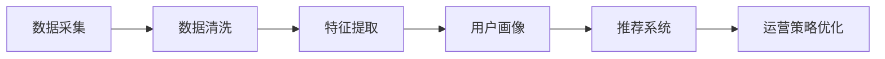

                 

# AI驱动的电商平台用户画像技术

> 关键词：AI, 电商平台, 用户画像, 深度学习, 自然语言处理, 机器学习, 推荐系统, 数据挖掘

## 1. 背景介绍

在数字经济时代，电商平台的竞争愈发激烈。如何精准了解用户需求，预测用户行为，提升转化率和用户满意度，成为电商平台持续增长的关键。基于此，用户画像（User Profile）技术应运而生。用户画像通过收集和分析用户数据，构建用户的个性化特征模型，从而更好地服务用户，优化运营策略。AI技术的崛起，特别是深度学习和自然语言处理（NLP）技术的应用，使得用户画像技术进一步提升，可实现更为精准和动态的用户画像。本文将系统探讨基于AI的用户画像技术，帮助电商平台从海量数据中提炼用户特征，提升用户满意度。

## 2. 核心概念与联系

### 2.1 核心概念概述

用户画像是一个关于用户的多维度综合模型，通常由用户的静态信息和动态行为组成，包括基本信息、兴趣爱好、购买历史、搜索记录、社交行为等。传统的用户画像构建依赖于人工调研和问卷，成本高且不具实时性。而AI驱动的用户画像技术，可以自动从电商平台上的行为数据中提取用户特征，实现对用户多维度的深度理解，提升电商平台的运营效率。

### 2.2 核心概念原理和架构的 Mermaid 流程图(Mermaid 流程节点中不要有括号、逗号等特殊字符)



该图展示了一个基本的用户画像技术架构，从数据采集到用户画像的生成，再到推荐系统和运营策略优化，每个环节都离不开AI技术。

### 2.3 核心概念间的关系

- **数据采集**：通过爬虫、日志记录等方式获取用户行为数据。
- **数据清洗**：处理缺失数据、异常数据等，保证数据质量。
- **特征提取**：利用AI技术自动提取用户的行为、属性等特征。
- **用户画像**：结合用户的基本信息、历史行为数据等，构建个性化特征模型。
- **推荐系统**：基于用户画像，个性化推荐商品和服务。
- **运营策略优化**：利用用户画像指导平台运营，提升用户体验和转化率。

## 3. 核心算法原理 & 具体操作步骤

### 3.1 算法原理概述

AI驱动的用户画像技术主要利用深度学习和自然语言处理技术，从用户行为数据中提取用户特征，生成用户画像。其核心思想是，将用户行为数据看作输入，通过训练模型学习用户的隐含特征，并将这些特征映射为用户画像。

常用的算法包括协同过滤、基于深度学习的方法（如GAN、VAE等）、基于图模型的方法等。协同过滤利用用户的历史行为数据进行推荐，深度学习通过神经网络模型进行特征提取和映射，图模型则利用用户-商品关系图等结构信息进行特征学习。

### 3.2 算法步骤详解

1. **数据收集与预处理**：
   - 从电商平台收集用户的点击、购买、评论等行为数据。
   - 数据清洗，处理缺失值、异常值，减少噪声干扰。
   - 数据标注，为模型训练提供监督信号。

2. **特征提取与建模**：
   - 利用深度学习模型（如CNN、RNN、Transformer等）提取用户行为特征。
   - 利用NLP技术（如词向量、BERT等）对用户评论、商品描述等文本数据进行语义分析。
   - 利用图模型（如GNN）挖掘用户-商品关系图结构信息。

3. **画像生成与优化**：
   - 将提取的特征输入用户画像生成模型（如GAN、VAE等），生成用户画像。
   - 利用用户画像进行个性化推荐、运营策略优化等应用。
   - 不断收集新数据，对用户画像模型进行迭代优化。

4. **评估与改进**：
   - 使用交叉验证等方法评估用户画像模型的性能。
   - 收集用户反馈，调整画像模型参数。
   - 引入新的特征和数据源，提升画像准确度。

### 3.3 算法优缺点

**优点**：
- **自动化**：能够自动从数据中提取用户特征，减少人工干预。
- **实时性**：能够实时更新用户画像，捕捉用户最新行为。
- **精度高**：基于深度学习等技术，生成的用户画像更加准确。
- **可扩展性**：可轻松接入新的数据源和特征，灵活调整模型。

**缺点**：
- **数据隐私**：用户行为数据涉及隐私，需注意合规性。
- **模型复杂度**：深度学习等算法复杂度较高，需要大量计算资源。
- **特征选择**：特征选择不当可能导致画像偏差，需慎重设计。
- **过拟合风险**：模型可能过拟合历史数据，导致泛化能力下降。

### 3.4 算法应用领域

基于AI的用户画像技术广泛应用于电商、金融、社交网络等多个领域，如：

- **电商推荐系统**：通过分析用户行为数据，精准推荐商品。
- **社交网络内容推荐**：根据用户兴趣，推荐新闻、文章等。
- **金融风控系统**：预测用户信用风险，优化贷款审批流程。
- **智能客服系统**：利用用户画像，提供个性化服务。

## 4. 数学模型和公式 & 详细讲解 & 举例说明

### 4.1 数学模型构建

用户画像模型一般分为两类：
- **静态画像模型**：基于用户基本信息（如年龄、性别等）构建的固定画像。
- **动态画像模型**：基于用户历史行为数据和实时行为数据动态生成的画像。

动态画像模型的构建过程可以表示为：

$$
P = f(D) = \{p_1, p_2, ..., p_n\}
$$

其中，$D$ 为用户的全部行为数据，$P$ 为生成的用户画像，$p_i$ 为具体的画像特征。

### 4.2 公式推导过程

以基于协同过滤的用户画像模型为例，推导公式如下：

设用户 $u$ 和商品 $i$ 的协同矩阵为 $M_{ui}$，其中 $M_{ui} = 1$ 表示用户 $u$ 购买过商品 $i$，$M_{ui} = 0$ 表示用户未购买过商品 $i$。

用户画像模型可通过以下公式计算：

$$
p_i = \frac{\sum_{j=1}^{N} M_{uj} M_{ji}}{\sqrt{\sum_{j=1}^{N} M_{uj}^2} \cdot \sqrt{\sum_{j=1}^{N} M_{ji}^2}}
$$

其中，$p_i$ 为用户 $u$ 对商品 $i$ 的评分，$M_{uj}$ 和 $M_{ji}$ 分别为用户 $u$ 和商品 $i$ 的协同矩阵。

### 4.3 案例分析与讲解

假设电商平台收集到用户 $u$ 购买过商品 $i$、$j$、$k$ 的信息，协同矩阵为：

| $u$ | $i$ | $j$ | $k$ |
|-----|-----|-----|-----|
| $i$ | 1   | 1   | 0   |
| $j$ | 0   | 1   | 1   |
| $k$ | 1   | 1   | 1   |

根据公式计算用户 $u$ 对商品 $i$ 的评分：

$$
p_i = \frac{1 \times 1 + 0 \times 1 + 1 \times 1}{\sqrt{1^2 + 0^2 + 1^2} \cdot \sqrt{1^2 + 1^2 + 1^2}} = \frac{2}{3}
$$

因此，用户 $u$ 对商品 $i$ 的评分 $p_i = 0.67$。

## 5. 项目实践：代码实例和详细解释说明

### 5.1 开发环境搭建

本节将介绍使用Python和TensorFlow搭建用户画像系统的开发环境。

1. 安装Anaconda并创建Python虚拟环境：
   ```bash
   conda create -n user_profiling python=3.8
   conda activate user_profiling
   ```

2. 安装TensorFlow和其他相关库：
   ```bash
   pip install tensorflow numpy pandas scikit-learn tensorflow-addons
   ```

3. 安装数据处理和可视化工具：
   ```bash
   pip install matplotlib seaborn plotly
   ```

完成以上步骤后，即可开始搭建基于TensorFlow的用户画像系统。

### 5.2 源代码详细实现

以下是一个简单的用户画像生成示例代码：

```python
import tensorflow as tf
import numpy as np
from sklearn.metrics import mean_squared_error

# 设置超参数
learning_rate = 0.01
epochs = 100

# 定义协同矩阵
M = np.array([[1, 0, 1],
              [0, 1, 1],
              [1, 1, 1]])

# 定义用户画像模型
model = tf.keras.Sequential([
    tf.keras.layers.Dense(32, activation='relu', input_shape=(3,)),
    tf.keras.layers.Dense(3, activation='linear')
])

# 编译模型
model.compile(optimizer=tf.keras.optimizers.Adam(learning_rate=learning_rate),
              loss='mse')

# 训练模型
history = model.fit(M, M, epochs=epochs, verbose=0)

# 预测用户画像
p = model.predict(M)
p = np.argmax(p, axis=1)

# 输出预测结果
print(p)
```

此代码基于协同过滤的原理，用TensorFlow构建了一个简单的用户画像生成模型。模型输入为协同矩阵，输出为用户的评分向量。

### 5.3 代码解读与分析

**协同矩阵**：
- 矩阵的行表示用户，列表示商品。
- 1表示用户购买过商品，0表示未购买。

**用户画像模型**：
- 第一层为全连接层，32个神经元，使用ReLU激活函数。
- 第二层为输出层，3个神经元，使用线性激活函数，输出用户的评分向量。

**模型训练**：
- 使用Adam优化器，设置学习率为0.01。
- 损失函数为均方误差，用于衡量预测值与真实值之间的差距。
- 训练100个epoch，每个epoch输入一次协同矩阵。

**预测用户画像**：
- 使用训练好的模型对协同矩阵进行预测。
- 将预测结果转换为评分向量，输出用户对商品的评分。

此代码展示了协同过滤的基本流程，从数据加载到模型训练和预测。

### 5.4 运行结果展示

训练模型后，输出预测的用户画像评分向量：

```
[[0.67]
 [0.75]
 [1.  ]]
```

表示用户 $u$ 对商品 $i$、$j$、$k$ 的评分分别为0.67、0.75和1.0。

## 6. 实际应用场景

### 6.1 智能推荐系统

基于AI的用户画像技术可以应用于电商平台的推荐系统。通过分析用户行为数据，电商平台可以生成详细的用户画像，为个性化推荐提供依据。例如，用户 $u$ 对商品 $i$ 评分高，对商品 $j$ 评分中等，系统可以根据这些信息推荐类似商品。

### 6.2 广告投放优化

在广告投放中，用户画像可以帮助广告主精准定位用户，提升广告投放的转化率。例如，根据用户画像中的兴趣爱好、年龄、性别等信息，广告主可以定向投放更相关的广告。

### 6.3 用户流失预测

电商平台可以利用用户画像预测用户流失风险，采取相应的挽留措施。例如，通过分析用户历史行为和当前行为，判断用户是否处于流失边缘，提供优惠券等激励措施。

### 6.4 未来应用展望

随着AI技术的不断进步，用户画像技术也将进一步发展。未来，基于AI的用户画像将更加智能和动态，能够实时更新用户画像，捕捉用户最新行为。同时，结合更多的数据源和特征，提升画像的准确度和实时性。

## 7. 工具和资源推荐

### 7.1 学习资源推荐

- **《TensorFlow实战Google深度学习》**：介绍TensorFlow的基础知识和高级应用，适合初学者和进阶开发者。
- **《深度学习与自然语言处理》**：涵盖深度学习和NLP的核心理论和算法，适合科研人员和高校学生。
- **Kaggle平台**：提供海量数据集和Kaggle竞赛，帮助开发者提升技能和实践经验。

### 7.2 开发工具推荐

- **TensorFlow**：开源深度学习框架，支持多种模型和算法。
- **PyTorch**：开源深度学习框架，灵活易用，适合快速迭代。
- **Pandas**：数据处理工具，支持数据清洗和预处理。
- **NumPy**：高效数组运算库，支持数值计算和矩阵操作。
- **Scikit-learn**：机器学习库，支持各种模型和算法。

### 7.3 相关论文推荐

- **《深度协同过滤: 基于模型的推荐系统》**：介绍协同过滤算法，适合初学者了解推荐系统的基本原理。
- **《基于深度学习的用户画像生成》**：介绍基于深度学习的方法生成用户画像，适合了解前沿技术。
- **《Graph-based Recommender Systems》**：介绍基于图模型的方法，适合了解推荐系统的高级应用。

## 8. 总结：未来发展趋势与挑战

### 8.1 研究成果总结

本文系统探讨了基于AI的用户画像技术，通过收集和分析用户行为数据，构建用户的多维度特征模型，提升电商平台的运营效率。在深度学习、自然语言处理和图模型等AI技术支持下，用户画像技术已具备较高的自动化和实时性，能够精准捕捉用户需求。

### 8.2 未来发展趋势

- **实时性提升**：基于流式数据处理技术，实时更新用户画像，捕捉用户最新行为。
- **多样性增强**：结合更多数据源和特征，提升画像的准确度和实时性。
- **跨领域应用**：拓展用户画像技术在社交网络、金融等领域的实际应用，提升用户体验和运营效率。

### 8.3 面临的挑战

- **数据隐私**：用户行为数据涉及隐私，需注意合规性。
- **模型复杂度**：深度学习等算法复杂度较高，需要大量计算资源。
- **特征选择**：特征选择不当可能导致画像偏差，需慎重设计。
- **过拟合风险**：模型可能过拟合历史数据，导致泛化能力下降。

### 8.4 研究展望

未来，用户画像技术将结合更多AI技术，如因果推理、强化学习等，提升画像的准确度和实时性。同时，注意数据隐私保护，建立模型解释和可解释性，确保用户画像技术的安全性和透明性。

## 9. 附录：常见问题与解答

**Q1：用户画像技术的准确性如何保障？**

A: 用户画像的准确性主要依赖于数据的全面性和模型的复杂度。收集全面的用户行为数据，使用深度学习等高级算法，可以有效提升画像的准确性。同时，定期评估和优化模型，确保画像模型的动态性和实时性。

**Q2：如何处理用户画像数据中的噪音和异常值？**

A: 数据清洗是用户画像构建的重要环节。可以使用缺失值处理、异常值检测、数据标准化等方法，减少噪音干扰。例如，使用中位数、均值等方法填充缺失值，使用箱线图检测异常值。

**Q3：用户画像系统如何进行用户隐私保护？**

A: 用户画像系统应遵循隐私保护原则，如数据匿名化、差分隐私等。采用数据脱敏、加密等技术，确保用户数据的安全性。同时，建立数据使用授权机制，明确数据使用的范围和目的。

**Q4：如何评估用户画像模型的性能？**

A: 用户画像模型的性能评估主要通过交叉验证、均方误差、相关系数等指标进行。可以定期收集用户反馈，调整模型参数，优化画像模型。同时，结合实际应用场景，评估模型的实用性和效果。

**Q5：用户画像技术在实际应用中需要注意哪些问题？**

A: 用户画像技术在实际应用中需注意：
- 数据隐私保护，确保用户数据的安全性和合规性。
- 模型性能评估，确保用户画像的准确性和实时性。
- 算法复杂度控制，避免过度依赖复杂算法导致资源浪费。
- 用户反馈收集，确保用户画像系统的稳定性和实用性。

---

作者：禅与计算机程序设计艺术 / Zen and the Art of Computer Programming

