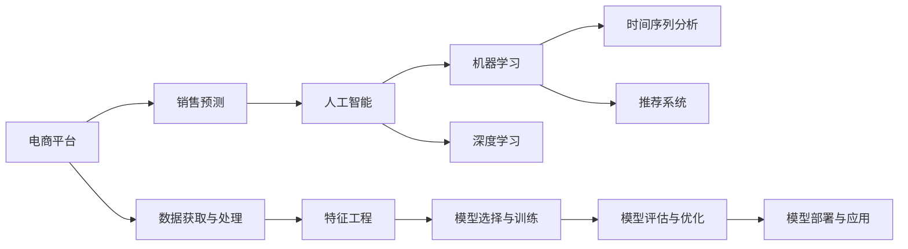

                 

# AI驱动的电商平台销售预测模型

> 关键词：销售预测,电商平台,人工智能,机器学习,深度学习,时间序列分析,推荐系统,精准营销

## 1. 背景介绍

### 1.1 问题由来

在电子商务时代，销售预测是电商平台运营中至关重要的环节。通过准确预测未来的销售趋势，商家可以合理制定库存、价格策略，优化运营流程，提升盈利能力。传统上，销售预测主要依赖历史数据、统计模型和人工经验，存在数据维度低、模型预测能力有限等问题。随着数据量的激增和算法的进步，基于人工智能（AI）的预测方法成为新的趋势。

### 1.2 问题核心关键点

AI驱动的销售预测模型主要包括以下几个关键点：

1. **数据获取与处理**：从多个渠道收集原始数据，并对数据进行清洗、转换和标准化，为模型提供高质量的输入。
2. **模型选择与训练**：选择合适的AI模型（如深度学习、时间序列模型），并在大量历史数据上进行训练，使其具备预测能力。
3. **特征工程**：设计有效的特征提取方法，从原始数据中提取出有助于预测的特征。
4. **模型评估与优化**：使用适当的评估指标（如均方误差、R^2系数）对模型性能进行评估，并通过调参和模型融合等手段进行优化。
5. **模型部署与应用**：将训练好的模型部署到生产环境中，实现自动化的销售预测，并通过系统优化提升预测精度。

### 1.3 问题研究意义

基于AI的销售预测模型，通过大数据和先进的算法，能够更准确、更快速地预测销售趋势，为电商平台提供决策支持。其研究意义主要体现在以下几个方面：

1. **提高预测精度**：AI模型利用复杂的算法和大量的数据，可以捕捉到传统方法无法发现的模式和规律，显著提高预测精度。
2. **降低运营成本**：通过精准的预测，电商平台可以减少库存积压和缺货风险，优化库存管理，降低运营成本。
3. **提升用户体验**：准确的预测可以帮助电商平台提供个性化的商品推荐，提升用户体验和满意度。
4. **增强竞争力**：高效的预测能力帮助电商平台在市场竞争中占据有利位置，提高市场份额。
5. **促进智能营销**：AI驱动的预测模型可以为智能营销策略的制定提供依据，提升广告投放效果。

## 2. 核心概念与联系

### 2.1 核心概念概述

要深入理解基于AI的电商平台销售预测模型，需要掌握以下核心概念：

1. **电商平台**：指通过互联网提供商品或服务销售的平台，如亚马逊、淘宝、京东等。
2. **销售预测**：通过历史销售数据和相关因素预测未来销售量的过程。
3. **人工智能**：利用机器学习、深度学习等算法模拟人类智能行为的技术。
4. **机器学习**：通过数据训练模型，使其具备预测、分类、聚类等能力。
5. **深度学习**：一种特殊的机器学习技术，利用多层神经网络进行复杂模式学习。
6. **时间序列分析**：利用时间序列数据进行趋势、周期性分析，预测未来趋势。
7. **推荐系统**：根据用户行为和偏好，推荐商品或服务的系统。

这些概念之间相互关联，构成了AI驱动的电商平台销售预测模型的基础框架。

### 2.2 核心概念原理和架构的 Mermaid 流程图



这个流程图展示了核心概念之间的联系：

1. **数据获取与处理**：电商平台从各种渠道收集原始数据。
2. **特征工程**：对原始数据进行处理，提取有用的特征。
3. **模型选择与训练**：选择合适的AI模型并进行训练。
4. **模型评估与优化**：评估模型性能，通过调参和融合等手段进行优化。
5. **模型部署与应用**：将优化后的模型应用于实际预测场景，提供决策支持。

## 3. 核心算法原理 & 具体操作步骤

### 3.1 算法原理概述

基于AI的销售预测模型通常采用深度学习、时间序列分析等技术，结合电商平台的特性进行建模。其核心算法原理包括：

1. **深度学习模型**：通过多层神经网络学习数据中的复杂模式，具备强大的拟合能力。
2. **时间序列模型**：利用时间序列数据的历史趋势和周期性，预测未来变化。
3. **特征工程**：设计特征提取方法，将原始数据转换为模型可用的输入。

### 3.2 算法步骤详解

基于AI的电商平台销售预测模型构建步骤如下：

1. **数据获取与处理**：
   - 从电商平台收集历史销售数据，包括时间、商品ID、销售量等。
   - 收集相关特征数据，如促销活动、季节性、节假日等。
   - 对数据进行清洗和标准化，去除异常值和噪声。

2. **特征工程**：
   - 设计特征提取方法，提取有用的特征，如时间特征、季节性特征、商品属性等。
   - 进行特征工程，如特征编码、归一化等。
   - 生成特征集合，准备输入到模型中。

3. **模型选择与训练**：
   - 选择合适的AI模型，如LSTM、GRU等时间序列模型，或CNN、RNN等深度学习模型。
   - 使用历史数据对模型进行训练，调整模型参数。
   - 使用交叉验证等技术进行模型评估。

4. **模型评估与优化**：
   - 使用适当的评估指标（如均方误差、R^2系数）对模型进行评估。
   - 根据评估结果进行调参，优化模型性能。
   - 使用模型融合等技术提升预测精度。

5. **模型部署与应用**：
   - 将优化后的模型部署到生产环境中。
   - 实时获取最新数据，进行预测。
   - 通过系统优化提升预测精度，降低响应时间。

### 3.3 算法优缺点

基于AI的电商平台销售预测模型的优点包括：

1. **高预测精度**：利用复杂的算法和大数据，模型能够捕捉到数据中的复杂模式，提高预测精度。
2. **实时预测**：能够实时获取最新数据，进行动态预测。
3. **自适应性强**：模型能够根据数据变化进行自适应调整。

其缺点包括：

1. **数据需求高**：需要大量高质量的数据进行训练，否则模型效果可能不佳。
2. **模型复杂度高**：深度学习模型结构复杂，训练和优化过程耗时较长。
3. **可解释性差**：复杂的模型难以解释其内部工作机制，不易进行调试和优化。

### 3.4 算法应用领域

基于AI的电商平台销售预测模型主要应用于以下几个领域：

1. **库存管理**：通过预测未来销售趋势，优化库存管理，减少缺货和库存积压。
2. **促销活动优化**：根据预测结果，优化促销活动的时间和范围，提升活动效果。
3. **广告投放**：通过预测用户行为，优化广告投放策略，提升广告效果和ROI。
4. **客户推荐**：根据用户行为和预测结果，提供个性化的商品推荐，提升用户体验。
5. **市场分析**：通过预测分析，了解市场趋势和竞争格局，制定市场策略。

## 4. 数学模型和公式 & 详细讲解 & 举例说明

### 4.1 数学模型构建

基于AI的电商平台销售预测模型通常采用时间序列模型和深度学习模型进行建模。以下以LSTM模型为例进行说明。

设历史销售数据为 $y_t$，时间特征为 $x_t$，预测未来 $n$ 天的销售量 $y_{t+n}$。LSTM模型的预测公式如下：

$$
y_{t+n} = f(y_t, x_t)
$$

其中 $f$ 表示LSTM模型的映射函数，包括多个时间步的输入和状态更新。

### 4.2 公式推导过程

以LSTM模型为例，其基本原理是通过长短时记忆网络（LSTM）结构，捕捉时间序列数据中的长期依赖关系。LSTM模型包括多个时间步，每个时间步的状态更新公式如下：

$$
h_{t} = \tanh(W_h x_{t} + U_h h_{t-1} + b_h)
$$

$$
i_t = \sigma(W_i x_{t} + U_i h_{t-1} + b_i)
$$

$$
f_t = \sigma(W_f x_{t} + U_f h_{t-1} + b_f)
$$

$$
o_t = \sigma(W_o x_{t} + U_o h_{t-1} + b_o)
$$

$$
c_t = f_t * c_{t-1} + i_t * \tanh(h_t)
$$

$$
h_t = o_t * \tanh(c_t)
$$

其中 $x_t$ 为时间步 $t$ 的输入，$h_t$ 为时间步 $t$ 的输出，$c_t$ 为时间步 $t$ 的记忆状态，$W$、$U$ 为模型参数，$\sigma$ 为sigmoid函数，$\tanh$ 为双曲正切函数。

### 4.3 案例分析与讲解

以某电商平台的日销售额预测为例，假设历史数据为 $y_t$，时间特征为 $x_t$，其中 $x_t$ 包括日期、星期几、节假日等特征。使用LSTM模型进行预测，输入为 $(x_t, y_t)$，输出为 $y_{t+1}$，训练数据集为 $D = \{(x_{1}, y_{1}), (x_{2}, y_{2}), ..., (x_{N}, y_{N})\}$，其中 $N$ 为历史数据数量。

模型的训练过程如下：

1. 初始化模型参数 $W$、$U$。
2. 对于每个时间步 $t$，输入 $x_t$ 和输出 $y_t$，计算 $h_t$、$i_t$、$f_t$、$o_t$、$c_t$。
3. 计算预测输出 $y_{t+1}$，使用均方误差等损失函数计算损失值。
4. 反向传播计算梯度，更新模型参数。
5. 重复步骤2-4，直到模型收敛。

预测过程如下：

1. 对于新输入 $x_{t+1}$，使用训练好的LSTM模型计算 $h_{t+1}$、$i_{t+1}$、$f_{t+1}$、$o_{t+1}$、$c_{t+1}$。
2. 计算预测输出 $y_{t+2}$，使用模型输出结果进行销售预测。

## 5. 项目实践：代码实例和详细解释说明

### 5.1 开发环境搭建

为了搭建基于LSTM的电商平台销售预测模型，需要以下开发环境：

1. **Python**：作为主要编程语言，安装版本为3.8以上。
2. **Pandas**：用于数据处理和特征工程。
3. **TensorFlow**：用于构建和训练LSTM模型。
4. **Keras**：用于模型构建和评估。
5. **TensorBoard**：用于模型训练和评估可视化。

以下是搭建开发环境的步骤：

1. 安装Python：
```bash
sudo apt-get update
sudo apt-get install python3.8
```

2. 安装Pandas：
```bash
pip install pandas
```

3. 安装TensorFlow和Keras：
```bash
pip install tensorflow
pip install keras
```

4. 安装TensorBoard：
```bash
pip install tensorboard
```

### 5.2 源代码详细实现

以下是一个简单的LSTM模型构建和训练的Python代码实现：

```python
import pandas as pd
import tensorflow as tf
from tensorflow.keras.models import Sequential
from tensorflow.keras.layers import LSTM, Dense

# 数据读取和处理
data = pd.read_csv('sales_data.csv', index_col='date')
data = data[['day_of_week', 'holiday', 'temperature', 'sales']]
data = data.dropna()

# 特征工程
data['day_of_week'] = data['day_of_week'].apply(lambda x: 1 if x == 'Monday' else 0)
data['holiday'] = data['holiday'].apply(lambda x: 1 if x == 'Yes' else 0)
data['temperature'] = (data['temperature'] - data['temperature'].mean()) / data['temperature'].std()

# 数据划分
train_data = data[:'2020-01-01']
test_data = data['2020-01-01':]

# 构建模型
model = Sequential()
model.add(LSTM(64, input_shape=(train_data.shape[1], train_data.shape[2])))
model.add(Dense(1))

# 编译模型
model.compile(optimizer='adam', loss='mean_squared_error')

# 模型训练
model.fit(train_data, train_data['sales'], epochs=50, batch_size=32, validation_data=(test_data, test_data['sales']))

# 模型评估
test_loss = model.evaluate(test_data, test_data['sales'])
print('Test loss:', test_loss)

# 模型预测
predictions = model.predict(test_data)
```

### 5.3 代码解读与分析

这段代码实现了一个基本的LSTM模型，用于预测电商平台的日销售额。以下是关键部分的解释：

1. **数据读取和处理**：使用Pandas读取原始数据，并进行缺失值处理和特征工程。将日期作为时间特征，对日期进行编码，对温度进行标准化处理。
2. **模型构建**：使用Keras构建LSTM模型，包括一个LSTM层和一个全连接层。
3. **模型编译**：使用Adam优化器进行模型编译，损失函数为均方误差。
4. **模型训练**：使用历史数据对模型进行训练，设置50个epoch和32的批大小。
5. **模型评估**：使用测试集对模型进行评估，输出均方误差。
6. **模型预测**：使用训练好的模型对测试集进行预测。

### 5.4 运行结果展示

训练和评估结果可以通过TensorBoard进行可视化。以下是TensorBoard的使用示例：

1. 启动TensorBoard：
```bash
tensorboard --logdir=logs
```

2. 在TensorBoard界面查看训练和评估结果。

## 6. 实际应用场景

### 6.1 智能库存管理

基于LSTM的销售预测模型可以帮助电商平台进行智能库存管理，避免库存积压和缺货。通过实时监控销售趋势，商家可以及时调整库存水平，提升运营效率。

### 6.2 促销活动优化

电商平台可以通过预测销售趋势，优化促销活动的时间和范围，提升活动效果。例如，在预测销售额大幅上升前，提前推出促销活动，吸引更多用户购买。

### 6.3 广告投放优化

根据预测结果，电商平台可以优化广告投放策略，提升广告效果和ROI。例如，在预测销售量高的产品上增加广告投放，提升广告点击率和转化率。

### 6.4 客户推荐

电商平台可以根据用户行为和预测结果，提供个性化的商品推荐，提升用户体验和满意度。例如，在预测用户可能感兴趣的商品上增加推荐权重。

### 6.5 市场分析

基于LSTM的销售预测模型可以用于市场趋势分析，了解市场动态和竞争格局，制定市场策略。例如，预测不同季节的销售趋势，调整市场推广策略。

## 7. 工具和资源推荐

### 7.1 学习资源推荐

1. **《深度学习》书籍**：Ian Goodfellow所著，深入浅出地介绍了深度学习的基本原理和实现方法。
2. **《TensorFlow官方文档》**：TensorFlow的官方文档，提供了丰富的API和代码示例。
3. **《Keras官方文档》**：Keras的官方文档，提供了模型构建和评估的详细指南。
4. **《机器学习实战》书籍**：Peter Harrington所著，提供了实用的机器学习项目实现案例。
5. **Coursera《深度学习》课程**：Andrew Ng等名师开设的深度学习课程，涵盖了深度学习的基础知识和应用实践。

### 7.2 开发工具推荐

1. **Jupyter Notebook**：免费的交互式编程环境，支持Python、R等语言。
2. **GitHub**：版本控制系统，方便代码协作和版本管理。
3. **Jupytext**：将Jupyter Notebook转换为Markdown格式，方便文档和代码管理。
4. **Anaconda**：Python环境管理系统，方便多版本Python和依赖包的管理。
5. **VSCode**：功能强大的代码编辑器，支持多种编程语言和插件。

### 7.3 相关论文推荐

1. **《Long Short-Term Memory》论文**：Hochreiter和Schmidhuber所著，首次提出了LSTM网络结构，成为时间序列预测的利器。
2. **《Attention Is All You Need》论文**：Vaswani等所著，提出了Transformer结构，为深度学习模型提供了新的范式。
3. **《Deep Learning for Time Series Forecasting》论文**：Wang和Zhou所著，系统介绍了深度学习在时间序列预测中的应用。
4. **《Recurrent Neural Networks for Multi-Step Time Series Forecasting》论文**：Sutskever等所著，介绍了RNN在多步时间序列预测中的应用。

## 8. 总结：未来发展趋势与挑战

### 8.1 研究成果总结

基于AI的电商平台销售预测模型已经在多个实际应用中取得了显著效果。其核心技术包括深度学习、时间序列分析等，广泛应用于库存管理、促销活动优化、广告投放优化、客户推荐和市场分析等领域。

### 8.2 未来发展趋势

1. **模型自动化**：随着模型训练自动化工具的普及，越来越多的电商平台将使用AI驱动的销售预测模型。
2. **多模态融合**：结合图像、语音等多模态数据，提升销售预测的精度和鲁棒性。
3. **实时预测**：实现实时数据处理和预测，提高决策速度和精度。
4. **跨领域应用**：将销售预测模型应用于其他行业，如金融、零售等，提升业务效率和效果。

### 8.3 面临的挑战

1. **数据质量**：高质量的数据是AI预测模型的基础，电商平台的原始数据可能存在噪声和缺失。
2. **模型复杂度**：深度学习模型结构复杂，训练和优化过程耗时较长。
3. **可解释性**：复杂的模型难以解释其内部工作机制，不易进行调试和优化。
4. **资源需求**：大模型训练需要高性能计算资源，对硬件和算力提出了高要求。

### 8.4 研究展望

1. **自动化数据预处理**：自动化数据清洗和特征工程，提升数据质量和模型效果。
2. **模型简化**：优化模型结构，减少计算资源消耗，提升预测速度。
3. **多模态融合**：结合多模态数据，提升预测精度和鲁棒性。
4. **跨领域应用**：将销售预测模型应用于其他领域，提升业务效率和效果。

## 9. 附录：常见问题与解答

**Q1: 电商平台销售预测模型的输入数据是什么？**

A: 电商平台销售预测模型的输入数据主要包括时间、商品ID、销售量、促销活动、季节性、节假日等。这些数据需要经过清洗和标准化处理，才能作为模型的输入。

**Q2: 电商平台销售预测模型如何处理时间特征？**

A: 电商平台销售预测模型通常使用时间特征（如日期、星期几、小时等）进行预测。时间特征需要进行编码，例如将星期几转换为0-6的整数，对日期进行编码等。

**Q3: 电商平台销售预测模型如何选择模型参数？**

A: 电商平台销售预测模型中的模型参数需要通过调参来确定。常用的调参方法包括网格搜索、随机搜索、贝叶斯优化等。调参过程中，可以使用交叉验证等技术评估模型性能。

**Q4: 电商平台销售预测模型如何进行实时预测？**

A: 电商平台销售预测模型可以通过在线学习（Online Learning）进行实时预测。在线学习可以实时获取最新数据，并更新模型参数，实现动态预测。

**Q5: 电商平台销售预测模型的局限性有哪些？**

A: 电商平台销售预测模型的局限性主要包括：数据质量不高、模型复杂度高、可解释性差、资源需求高等。在实际应用中，需要根据具体情况进行优化和改进。

---

作者：禅与计算机程序设计艺术 / Zen and the Art of Computer Programming

