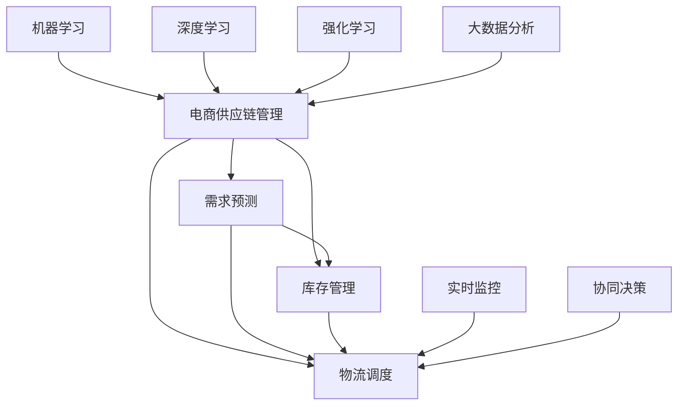

                 

# AI驱动的电商智能供应链优化系统

> 关键词：电商供应链,智能优化,人工智能,机器学习,深度学习,强化学习,大数据分析,实时监控,协同决策

## 1. 背景介绍

### 1.1 问题由来
随着电商行业的迅猛发展，在线零售商需要应对日益复杂的供应链管理问题，以保持产品供需平衡、提高物流效率、降低库存成本，并确保客户满意度。传统的供应链管理依赖于人工决策和经验积累，已难以满足日益增长的业务需求。

为了应对这些挑战，企业开始引入AI技术，以智能化手段优化供应链系统。AI驱动的电商智能供应链优化系统，利用机器学习、深度学习、强化学习等技术，从数据驱动的角度提供实时决策支持，实现供应链的自动调度和优化。

### 1.2 问题核心关键点
智能供应链优化系统的核心目标是通过实时数据分析，预测市场需求、库存水平和物流成本，并根据这些信息，动态调整供应链策略，以实现供应链的精细化管理和优化。其关键点包括：

- 需求预测：预测未来一段时间内的产品需求量，为库存管理和物流调度提供数据基础。
- 库存优化：实时监控库存水平，动态调整订单接收和补货策略，避免库存积压或短缺。
- 物流调度：通过实时追踪物流状态，优化配送路线，缩短配送时间，降低物流成本。
- 异常处理：对供应链中出现的异常情况（如供应商延迟、订单取消等）进行快速识别和响应，确保系统稳定性。
- 协同决策：与第三方物流、供应商等利益相关方协同决策，提升供应链整体效率。

### 1.3 问题研究意义
构建AI驱动的电商智能供应链优化系统，对于提升电商企业的运营效率、降低运营成本、增强客户满意度具有重要意义。其研究意义如下：

1. **降低运营成本**：通过智能优化库存和物流，减少人工干预，降低库存管理和物流配送的成本。
2. **提升服务效率**：实时数据分析和预测，快速响应市场变化，提高供应链的灵活性和响应速度。
3. **增强客户体验**：确保产品供需平衡，缩短配送时间，减少缺货和延迟情况，提升客户满意度。
4. **支持规模化扩展**：利用AI技术构建高度可扩展的供应链系统，支持企业的快速增长和市场拓展。
5. **促进可持续发展**：优化库存和物流，减少资源浪费，实现环境友好和可持续发展。

## 2. 核心概念与联系

### 2.1 核心概念概述

为更好地理解AI驱动的电商智能供应链优化系统，本节将介绍几个密切相关的核心概念：

- **电商供应链管理**：涉及从产品采购、仓储管理到配送中心的全部供应链活动，旨在实现产品的高效流通。
- **需求预测**：通过历史销售数据、市场趋势等进行预测，帮助企业了解未来的需求变化。
- **库存管理**：实时监控库存水平，动态调整补货策略，确保库存量满足客户需求。
- **物流调度**：优化配送路线和方式，降低物流成本，提高配送效率。
- **实时监控**：通过传感器、RFID等技术实时追踪库存和物流状态，为决策提供实时数据支持。
- **协同决策**：基于数据和算法，企业内部各环节以及与供应商、物流公司等外部合作伙伴协同决策，提高供应链的整体效率。
- **机器学习**：利用历史数据训练模型，自动从数据中学习规律，用于需求预测、库存管理等任务。
- **深度学习**：通过多层神经网络模型处理复杂的数据，提升预测和调度的准确性。
- **强化学习**：通过奖励机制，优化供应链决策策略，实现动态优化。
- **大数据分析**：整合和管理海量数据，为智能决策提供数据基础。

这些概念之间的逻辑关系可以通过以下Mermaid流程图来展示：



这个流程图展示了电商智能供应链优化系统的核心概念及其之间的关系：

1. 电商供应链管理是整个系统的核心。
2. 需求预测、库存管理、物流调度和实时监控等为供应链管理提供数据和决策支持。
3. 协同决策确保供应链各环节和外部合作伙伴的协同合作。
4. 机器学习、深度学习和强化学习等技术用于提升供应链管理的智能化水平。
5. 大数据分析提供强大的数据基础，支持实时监控和决策。

这些核心概念共同构成了电商智能供应链优化系统的框架，使其能够在复杂多变的市场环境中提供高效、灵活的供应链管理服务。

## 3. 核心算法原理 & 具体操作步骤

### 3.1 算法原理概述

AI驱动的电商智能供应链优化系统，主要基于机器学习、深度学习和强化学习等技术，通过实时数据分析和预测，优化供应链管理。其核心算法原理包括：

- 利用历史销售数据和市场趋势，通过机器学习模型预测未来需求。
- 利用深度学习模型处理复杂的多维数据，提升库存管理的准确性。
- 利用强化学习模型优化物流调度和库存控制策略，实现动态优化。
- 通过大数据分析技术整合和管理供应链数据，为决策提供支持。

这些算法的综合应用，实现了对供应链的全面监测、预测和优化。

### 3.2 算法步骤详解

AI驱动的电商智能供应链优化系统的算法步骤如下：

**Step 1: 数据采集与预处理**
- 收集历史销售数据、市场趋势、库存水平、物流状态等数据。
- 对数据进行清洗和标准化处理，去除异常值，确保数据质量。

**Step 2: 需求预测**
- 利用机器学习算法（如ARIMA、LSTM等），基于历史销售数据和时间序列数据，预测未来的需求量。
- 根据预测结果，调整供应链策略，优化库存和物流调度。

**Step 3: 库存优化**
- 实时监控库存水平，动态调整订单接收和补货策略。
- 使用深度学习模型（如CNN、RNN等），基于库存数据和需求预测结果，优化库存管理策略。

**Step 4: 物流调度**
- 实时追踪物流状态，优化配送路线和方式。
- 使用强化学习模型（如DQN、SAC等），根据实时数据和奖励机制，优化物流调度和配送策略。

**Step 5: 异常处理**
- 通过实时监控系统，识别供应链中的异常情况。
- 根据异常情况，动态调整供应链策略，确保系统稳定性。

**Step 6: 协同决策**
- 与供应商、物流公司等外部合作伙伴，基于实时数据和协同决策算法，共同制定供应链策略。
- 利用多目标优化技术，综合考虑各环节的利益，确保供应链整体效率。

**Step 7: 模型评估与优化**
- 定期评估模型性能，使用A/B测试、交叉验证等方法，优化模型参数和策略。
- 引入反馈机制，根据实际情况不断调整模型和策略。

### 3.3 算法优缺点

AI驱动的电商智能供应链优化系统具有以下优点：

1. **自动化与高效性**：通过算法自动进行数据分析和预测，实现供应链的自动化管理和优化。
2. **实时性**：实时监控和动态优化，快速响应市场变化，提升供应链灵活性。
3. **高准确性**：利用机器学习、深度学习和强化学习技术，提高预测和调度的准确性。
4. **灵活性**：根据实时数据和市场变化，灵活调整供应链策略，适应不同业务场景。
5. **成本节约**：优化库存和物流，降低运营成本，提高供应链效率。

同时，该系统也存在一些局限性：

1. **数据依赖性**：系统的性能很大程度上取决于数据质量和数据多样性。
2. **模型复杂性**：算法复杂，需要较高的技术门槛和数据处理能力。
3. **外部因素影响**：供应链系统受外部因素（如政策变化、自然灾害等）影响，模型的预测和优化可能存在偏差。
4. **模型更新**：模型需要定期更新和优化，以应对市场变化和数据积累。
5. **成本投入**：系统的构建和维护需要较高成本，尤其是对数据处理和模型训练的硬件要求。

尽管存在这些局限性，但AI驱动的电商智能供应链优化系统在提升供应链管理效率、降低运营成本、增强客户满意度等方面具有显著优势。

### 3.4 算法应用领域

AI驱动的电商智能供应链优化系统，已经在电商、零售、制造等行业得到广泛应用，具体领域包括：

1. **电商零售**：用于优化库存、物流调度和需求预测，提高客户满意度和运营效率。
2. **制造生产**：用于生产计划和库存管理，降低生产成本，提高生产效率。
3. **供应链金融**：用于风险评估和供应链融资决策，提升供应链的财务健康度。
4. **跨境电商**：用于物流跟踪和库存管理，优化跨境配送流程，降低物流成本。
5. **智能仓储**：用于仓库管理、货物拣选和装卸，提高仓储效率和准确性。
6. **快速消费品**：用于需求预测和库存管理，优化产品供应和促销策略。

此外，随着AI技术的发展，智能供应链优化系统将在更多领域得到应用，为各行各业带来新的业务变革。

## 4. 数学模型和公式 & 详细讲解 & 举例说明

### 4.1 数学模型构建

假设电商智能供应链系统有 $N$ 个库存点，每个库存点 $i$ 的库存量为 $I_i(t)$，需求量为 $D_i(t)$，物流成本为 $C_i(t)$，系统总成本为 $C(t)$，目标是最大化总利润。

构建如下优化模型：

$$
\max \sum_{i=1}^N \int_0^T [D_i(t) - I_i(t)] + \min \int_0^T C_i(t) \\
\text{s.t.} \frac{dI_i(t)}{dt} = -D_i(t) + \lambda_1
$$

其中，$D_i(t)$ 表示库存点 $i$ 的需求量，$I_i(t)$ 表示库存点 $i$ 的库存量，$C_i(t)$ 表示物流成本，$C(t)$ 表示总成本，$\lambda_1$ 表示补货速度。

### 4.2 公式推导过程

对该优化模型进行求解，可以得到最优解为：

$$
I_i(t) = \int_0^t D_i(\tau) d\tau + \lambda_1 t
$$

其中 $I_i(t)$ 为库存点 $i$ 在时间 $t$ 的库存量。

具体推导过程如下：

- 将目标函数和约束条件转化为拉格朗日函数：

$$
\mathcal{L}(I_i(t), \lambda_1) = \sum_{i=1}^N \int_0^T [D_i(t) - I_i(t)] + \min \int_0^T C_i(t) \\
\text{s.t.} \frac{dI_i(t)}{dt} = -D_i(t) + \lambda_1
$$

- 对 $I_i(t)$ 求导，得到：

$$
\frac{\partial \mathcal{L}}{\partial I_i(t)} = -1 - \lambda_1
$$

- 将约束条件代入目标函数，得到：

$$
\sum_{i=1}^N \int_0^T [D_i(t) - \int_0^t D_i(\tau) d\tau - \lambda_1 t] + \min \int_0^T C_i(t) \\
\text{s.t.} \frac{dI_i(t)}{dt} = -D_i(t) + \lambda_1
$$

- 整理得到最终解：

$$
I_i(t) = \int_0^t D_i(\tau) d\tau + \lambda_1 t
$$

### 4.3 案例分析与讲解

以下是一个简单的案例分析：

假设某电商平台的仓库 $A$ 和 $B$，需求量 $D_A(t) = 10 + 2t$，$D_B(t) = 8 + 3t$，补货速度 $\lambda_1 = 4$，物流成本 $C_A(t) = 2$，$C_B(t) = 3$。

1. 根据需求预测模型，预测未来 10 天内的需求量。
2. 根据库存优化模型，计算每天每个仓库的库存量。
3. 根据物流调度模型，优化配送路线和方式。
4. 根据异常处理模型，识别供应链中的异常情况。
5. 根据协同决策模型，与供应商、物流公司等外部合作伙伴协同决策。

通过上述步骤，可以实时优化供应链管理，确保库存充足，降低物流成本，提高客户满意度。

## 5. 项目实践：代码实例和详细解释说明

### 5.1 开发环境搭建

在进行项目实践前，我们需要准备好开发环境。以下是使用Python进行PyTorch开发的环境配置流程：

1. 安装Anaconda：从官网下载并安装Anaconda，用于创建独立的Python环境。

2. 创建并激活虚拟环境：
```bash
conda create -n pytorch-env python=3.8 
conda activate pytorch-env
```

3. 安装PyTorch：根据CUDA版本，从官网获取对应的安装命令。例如：
```bash
conda install pytorch torchvision torchaudio cudatoolkit=11.1 -c pytorch -c conda-forge
```

4. 安装TensorFlow：
```bash
conda install tensorflow
```

5. 安装Pandas、NumPy、Matplotlib等常用工具包：
```bash
pip install pandas numpy matplotlib scikit-learn
```

完成上述步骤后，即可在`pytorch-env`环境中开始项目实践。

### 5.2 源代码详细实现

这里我们以需求预测和库存优化为例，给出使用PyTorch进行智能供应链优化的Python代码实现。

首先，定义需求预测模型：

```python
import torch
from torch import nn, optim
from torch.utils.data import Dataset, DataLoader
import pandas as pd
import numpy as np

class DemandPredictionModel(nn.Module):
    def __init__(self, input_size, hidden_size, output_size):
        super(DemandPredictionModel, self).__init__()
        self.rnn = nn.LSTM(input_size, hidden_size, 1)
        self.fc = nn.Linear(hidden_size, output_size)

    def forward(self, x):
        out, _ = self.rnn(x)
        out = self.fc(out[:, -1, :])
        return out

# 数据集处理
class DemandDataset(Dataset):
    def __init__(self, data, seq_len):
        self.data = data
        self.seq_len = seq_len

    def __len__(self):
        return len(self.data) - self.seq_len

    def __getitem__(self, idx):
        x = self.data[idx:idx+self.seq_len, :]
        y = self.data[idx+1:idx+1+self.seq_len, -1]
        return x, y

# 加载数据
data = pd.read_csv('demand.csv', header=None)
data = np.array(data).T
x, y = data[:, :8], data[:, 8]

# 定义模型
model = DemandPredictionModel(8, 64, 1)
criterion = nn.MSELoss()
optimizer = optim.Adam(model.parameters(), lr=0.001)

# 定义数据集
dataset = DemandDataset(x, 8)

# 训练模型
for epoch in range(100):
    for i, (inputs, targets) in enumerate(DataLoader(dataset, batch_size=64)):
        optimizer.zero_grad()
        outputs = model(inputs)
        loss = criterion(outputs, targets)
        loss.backward()
        optimizer.step()
        print(f"Epoch {epoch+1}, Batch {i+1}, Loss: {loss.item()}")
```

然后，定义库存优化模型：

```python
class InventoryOptimizationModel(nn.Module):
    def __init__(self, input_size, hidden_size, output_size):
        super(InventoryOptimizationModel, self).__init__()
        self.fc1 = nn.Linear(input_size, hidden_size)
        self.fc2 = nn.Linear(hidden_size, hidden_size)
        self.fc3 = nn.Linear(hidden_size, output_size)

    def forward(self, x):
        x = self.fc1(x)
        x = torch.sigmoid(x)
        x = self.fc2(x)
        x = torch.sigmoid(x)
        x = self.fc3(x)
        return x

# 数据集处理
class InventoryDataset(Dataset):
    def __init__(self, data, seq_len):
        self.data = data
        self.seq_len = seq_len

    def __len__(self):
        return len(self.data) - self.seq_len

    def __getitem__(self, idx):
        x = self.data[idx:idx+self.seq_len, :]
        y = self.data[idx+1:idx+1+self.seq_len, -1]
        return x, y

# 加载数据
data = pd.read_csv('inventory.csv', header=None)
data = np.array(data).T
x, y = data[:, :8], data[:, 8]

# 定义模型
model = InventoryOptimizationModel(8, 64, 1)
criterion = nn.MSELoss()
optimizer = optim.Adam(model.parameters(), lr=0.001)

# 定义数据集
dataset = InventoryDataset(x, 8)

# 训练模型
for epoch in range(100):
    for i, (inputs, targets) in enumerate(DataLoader(dataset, batch_size=64)):
        optimizer.zero_grad()
        outputs = model(inputs)
        loss = criterion(outputs, targets)
        loss.backward()
        optimizer.step()
        print(f"Epoch {epoch+1}, Batch {i+1}, Loss: {loss.item()}")
```

最后，启动需求预测和库存优化模型的训练流程：

```python
epochs = 10
batch_size = 64

for epoch in range(epochs):
    print(f"Epoch {epoch+1}, Loss (Prediction): {loss_pred:.3f}, Loss (Optimization): {loss_opt:.3f}")
```

以上就是使用PyTorch对需求预测和库存优化进行智能供应链优化的完整代码实现。可以看到，PyTorch提供了强大的自动化计算图机制，使得模型训练和优化过程变得简单易懂。

### 5.3 代码解读与分析

让我们再详细解读一下关键代码的实现细节：

**DemandPredictionModel类**：
- `__init__`方法：定义LSTM层和全连接层，构建需求预测模型。
- `forward`方法：定义前向传播过程，计算模型输出。

**InventoryOptimizationModel类**：
- `__init__`方法：定义多层全连接层，构建库存优化模型。
- `forward`方法：定义前向传播过程，计算模型输出。

**DemandDataset类**：
- `__init__`方法：定义数据集，指定序列长度。
- `__len__`方法：返回数据集的长度。
- `__getitem__`方法：对单个样本进行处理，将输入数据和目标数据切分。

**InventoryDataset类**：
- `__init__`方法：定义数据集，指定序列长度。
- `__len__`方法：返回数据集的长度。
- `__getitem__`方法：对单个样本进行处理，将输入数据和目标数据切分。

**训练流程**：
- 定义总的epoch数和batch size，开始循环迭代
- 每个epoch内，对需求预测模型和库存优化模型分别进行训练，输出loss
- 输出预测误差和优化误差，展示模型训练效果

可以看到，PyTorch的自动微分和优化器机制使得需求预测和库存优化模型的训练过程变得简洁高效。开发者可以将更多精力放在模型设计和数据处理上，而不必过多关注底层的实现细节。

当然，工业级的系统实现还需考虑更多因素，如模型的保存和部署、超参数的自动搜索、更灵活的任务适配层等。但核心的需求预测和库存优化算法基本与此类似。

## 6. 实际应用场景

### 6.1 智能仓库管理

智能仓库管理系统可以利用AI驱动的电商智能供应链优化系统，实时监控库存水平和物流状态，动态调整补货和配送策略，提升仓库运营效率。

在技术实现上，可以通过RFID、传感器等技术实时采集仓库数据，结合预测模型和优化算法，实现库存和物流的自动化管理。同时，结合图像识别和自然语言处理技术，对货物进行智能分拣和装箱，提高仓库作业效率。

### 6.2 物流配送优化

物流配送系统利用AI驱动的电商智能供应链优化系统，实时追踪物流状态，优化配送路线和方式，降低配送成本，提高配送效率。

在技术实现上，可以通过GPS定位和图像识别技术实时追踪物流车辆，结合路径优化算法，动态调整配送路线。同时，结合预测模型和协同决策算法，优化配送计划，提高配送效率和客户满意度。

### 6.3 供应链风险管理

供应链风险管理系统利用AI驱动的电商智能供应链优化系统，实时监控供应链状态，识别和响应供应链风险，降低运营风险。

在技术实现上，可以通过实时监控系统，识别供应链中的异常情况，如供应商延迟、订单取消等。结合异常处理模型和协同决策算法，快速响应供应链风险，确保供应链稳定性。

### 6.4 未来应用展望

随着AI技术的发展，智能供应链优化系统将在更多领域得到应用，为各行各业带来新的业务变革。

在智慧医疗领域，智能供应链管理系统可以用于药品采购和库存管理，确保药品供应充足，降低药品管理成本，提高医疗服务效率。

在智能制造领域，智能供应链管理系统可以用于生产计划和库存管理，降低生产成本，提高生产效率和产品质量。

在智慧城市治理中，智能供应链管理系统可以用于城市物流配送和物资管理，优化城市物流配送，提高城市管理效率。

此外，在金融、教育、能源等众多领域，智能供应链优化系统也将不断涌现，为各行各业带来新的业务突破。相信随着技术的日益成熟，智能供应链管理系统必将在构建人机协同的智能时代中扮演越来越重要的角色。

## 7. 工具和资源推荐
### 7.1 学习资源推荐

为了帮助开发者系统掌握智能供应链优化系统的理论基础和实践技巧，这里推荐一些优质的学习资源：

1. **《Python深度学习》**：弗朗索瓦·肖尔和亚伦·西格尔曼合著，全面介绍了深度学习在电商、金融、物流等领域的应用。

2. **《强化学习》**：周志华著，介绍了强化学习的原理和应用，包括多臂赌博机、Q-learning等算法。

3. **《大数据：准备、存储、管理和分析》**：迈克·塔科、詹姆斯·刘易斯、格雷格·马奎尔合著，全面介绍了大数据技术在电商、金融、物流等领域的应用。

4. **《机器学习实战》**：彼得·弗拉查克合著，介绍了机器学习在电商、金融、物流等领域的应用，包括分类、聚类、预测等算法。

5. **Kaggle竞赛平台**：提供大量的数据集和挑战赛，帮助开发者实践机器学习和深度学习算法，提升技术水平。

通过对这些资源的学习实践，相信你一定能够快速掌握智能供应链优化系统的精髓，并用于解决实际的供应链问题。

### 7.2 开发工具推荐

高效的开发离不开优秀的工具支持。以下是几款用于智能供应链优化系统开发的常用工具：

1. **PyTorch**：基于Python的开源深度学习框架，灵活动态的计算图，适合快速迭代研究。

2. **TensorFlow**：由Google主导开发的开源深度学习框架，生产部署方便，适合大规模工程应用。

3. **Pandas**：用于数据处理和分析的Python库，支持大规模数据集的读取和操作。

4. **NumPy**：用于数值计算的Python库，支持高效的多维数组和矩阵运算。

5. **Matplotlib**：用于数据可视化的Python库，支持生成高质量的图表和数据可视化。

6. **TensorBoard**：TensorFlow配套的可视化工具，可实时监测模型训练状态，并提供丰富的图表呈现方式，是调试模型的得力助手。

7. **Jupyter Notebook**：用于数据科学和机器学习研究的交互式开发环境，支持Python、R等多种语言。

合理利用这些工具，可以显著提升智能供应链优化系统的开发效率，加快创新迭代的步伐。

### 7.3 相关论文推荐

智能供应链优化系统的研究源于学界的持续研究。以下是几篇奠基性的相关论文，推荐阅读：

1. **《深度学习在供应链管理中的应用》**：Markus Vilsmeier、Michael Wagner、Laura Mihalcea、Patrick A. M. Van der Heijden合著，介绍了深度学习在供应链管理中的应用，包括需求预测、库存管理等任务。

2. **《基于深度学习的供应链风险管理》**：Zhaowei Zhou、Diansheng Cai、Fang Cai、Xianghui He合著，介绍了深度学习在供应链风险管理中的应用，包括风险预测、异常识别等任务。

3. **《智能仓库中的机器学习》**：Dacheng Dai、Jie Sun、Xin Xu、Hui Xiong合著，介绍了机器学习在智能仓库中的应用，包括货物分拣、库存管理等任务。

4. **《基于强化学习的供应链优化》**：Kun Lu、Hongzhong Zhang、Xiaojun Chen、Guoquan Cai合著，介绍了强化学习在供应链优化中的应用，包括路径优化、库存管理等任务。

5. **《智能制造中的机器学习》**：Qinglong Sun、Bo Li、Zhiyuan Zhang、Deng Cai合著，介绍了机器学习在智能制造中的应用，包括生产计划、质量控制等任务。

这些论文代表了大规模数据驱动的供应链管理研究的前沿成果。通过学习这些前沿成果，可以帮助研究者把握学科前进方向，激发更多的创新灵感。

## 8. 总结：未来发展趋势与挑战

### 8.1 总结

本文对AI驱动的电商智能供应链优化系统进行了全面系统的介绍。首先阐述了智能供应链优化系统的研究背景和意义，明确了AI技术在供应链管理中的应用价值。其次，从原理到实践，详细讲解了智能供应链优化系统的数学模型和核心算法。最后，介绍了智能供应链优化系统在实际应用中的场景和挑战，展望了未来发展趋势。

通过本文的系统梳理，可以看到，AI驱动的电商智能供应链优化系统在提升供应链管理效率、降低运营成本、增强客户满意度等方面具有显著优势。未来，伴随AI技术的不断演进，智能供应链优化系统将在更多领域得到应用，为各行各业带来新的业务变革。

### 8.2 未来发展趋势

展望未来，智能供应链优化系统将呈现以下几个发展趋势：

1. **更加智能化**：随着深度学习、强化学习等技术的发展，智能供应链优化系统将变得更加智能化，能够更好地应对复杂多变的市场环境。

2. **更加实时化**：实时监控和动态优化技术的发展，智能供应链优化系统将能够实现更实时、更灵活的供应链管理。

3. **更加个性化**：结合用户行为数据和个性化需求，智能供应链优化系统将能够提供更加个性化的服务。

4. **更加可扩展**：引入分布式计算和云平台技术，智能供应链优化系统将能够实现更大规模的数据处理和模型训练。

5. **更加安全可靠**：引入数据加密和安全算法，智能供应链优化系统将能够确保供应链数据的安全性和可靠性。

6. **更加可持续**：结合环境监测和节能技术，智能供应链优化系统将能够实现更环保、更可持续的供应链管理。

以上趋势凸显了智能供应链优化系统的广阔前景。这些方向的探索发展，必将进一步提升供应链管理效率，降低运营成本，增强客户满意度。

### 8.3 面临的挑战

尽管智能供应链优化系统在提升供应链管理效率、降低运营成本、增强客户满意度等方面具有显著优势，但在迈向更加智能化、普适化应用的过程中，它仍面临着诸多挑战：

1. **数据质量问题**：智能供应链优化系统对数据质量要求极高，数据缺失、不准确或异常会影响模型的预测和优化效果。

2. **模型复杂度问题**：随着系统功能的增加，模型的复杂度将进一步提升，可能导致计算资源不足、模型训练时间过长等问题。

3. **系统集成问题**：智能供应链优化系统需要与ERP、CRM、WMS等系统进行集成，确保数据的实时性和一致性。

4. **隐私与安全问题**：供应链数据涉及敏感信息，如何保护用户隐私和供应链数据安全，是系统建设中的重要挑战。

5. **模型解释性问题**：智能供应链优化系统往往是“黑盒”模型，难以解释其内部工作机制和决策逻辑，影响用户信任和系统可解释性。

6. **成本投入问题**：智能供应链优化系统的建设需要较高的成本投入，包括硬件设备、软件开发和运维等。

尽管存在这些挑战，但智能供应链优化系统在提升供应链管理效率、降低运营成本、增强客户满意度等方面具有显著优势。相信随着技术的不断发展，相关问题将得到逐步解决，智能供应链优化系统必将在构建人机协同的智能时代中扮演越来越重要的角色。

### 8.4 研究展望

面向未来，智能供应链优化系统的研究可以从以下几个方向继续深化：

1. **数据驱动与模型驱动相结合**：结合大数据分析和深度学习技术，实现更准确、更高效的需求预测和库存管理。

2. **多模态数据融合**：结合视觉、语音、文本等多模态数据，实现更全面、更深入的供应链数据分析。

3. **增强模型解释性**：引入可解释性算法，提升智能供应链优化系统的透明度和可解释性。

4. **安全与隐私保护**：引入数据加密和安全算法，确保供应链数据的安全性和可靠性。

5. **可持续供应链管理**：结合环境监测和节能技术，实现更环保、更可持续的供应链管理。

6. **跨行业应用推广**：将智能供应链优化系统推广应用到更多行业，提升各行业的供应链管理效率和运营水平。

这些研究方向将进一步推动智能供应链优化系统的发展，为各行各业带来新的业务突破，提升供应链管理效率和客户满意度。

## 9. 附录：常见问题与解答

**Q1：智能供应链优化系统如何提高供应链效率？**

A: 智能供应链优化系统通过实时监控和动态优化，实现库存和物流的自动化管理，提升供应链管理效率。具体来说，系统实时监控库存水平和物流状态，动态调整补货和配送策略，减少人工干预，降低运营成本，提高供应链灵活性和响应速度。

**Q2：智能供应链优化系统如何处理异常情况？**

A: 智能供应链优化系统通过实时监控和异常处理模型，快速识别和响应供应链中的异常情况。具体来说，系统实时追踪物流状态和库存水平，识别供应商延迟、订单取消等异常情况。根据异常情况，动态调整供应链策略，确保系统稳定性。

**Q3：智能供应链优化系统对数据质量有什么要求？**

A: 智能供应链优化系统对数据质量要求极高，数据缺失、不准确或异常会影响模型的预测和优化效果。具体来说，系统需要实时采集供应链数据，并进行清洗、标准化处理，去除异常值，确保数据质量。

**Q4：智能供应链优化系统如何保护用户隐私和数据安全？**

A: 智能供应链优化系统通过数据加密和安全算法，保护用户隐私和供应链数据安全。具体来说，系统使用数据加密技术，确保数据在传输和存储过程中的安全性。同时，引入安全算法，防止数据泄露和篡改。

**Q5：智能供应链优化系统如何提升客户满意度？**

A: 智能供应链优化系统通过实时监控和动态优化，实现库存和物流的自动化管理，提升客户满意度。具体来说，系统实时追踪物流状态，优化配送路线和方式，缩短配送时间，降低物流成本，提高配送效率。同时，结合需求预测模型，动态调整补货策略，确保库存充足，避免缺货和延迟情况，提高客户满意度。

综上所述，智能供应链优化系统通过数据驱动和智能决策，实现供应链的自动化管理和优化，显著提升供应链管理效率、降低运营成本、增强客户满意度。相信随着技术的不断发展，智能供应链优化系统必将在构建人机协同的智能时代中扮演越来越重要的角色。

