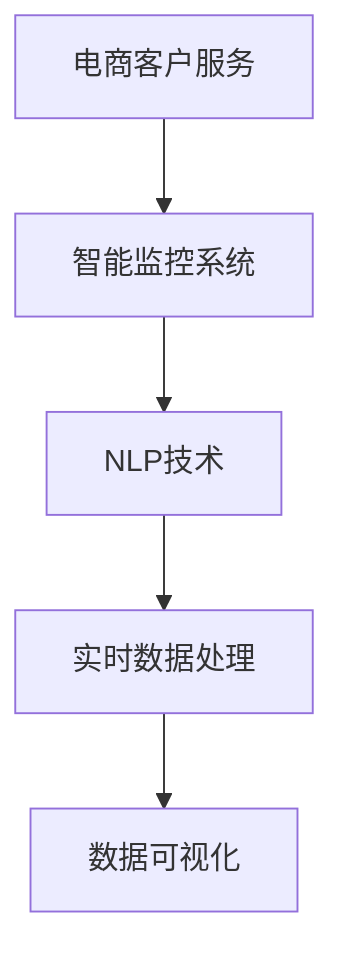

                 

# AI驱动的电商智能客户服务质量实时监控系统

> 关键词：电商,客户服务,智能监控,机器学习,自然语言处理(NLP),实时数据处理,数据可视化

## 1. 背景介绍

### 1.1 问题由来

在电商行业，优质的客户服务体验是提升用户满意度、增加复购率、降低客户流失的关键。传统的客服中心依靠人工进行客户问题处理，不仅响应速度慢、效率低下，还难以在高峰时段及时应对大规模咨询流量。同时，客服人员的工作质量也存在较大波动，特别是新入职员工的服务质量难以达到预期。因此，如何实时监控和优化客户服务质量，成为电商企业亟需解决的难题。

### 1.2 问题核心关键点

构建智能客户服务质量实时监控系统，可以显著提升电商平台的客户服务效率和质量，具有以下核心关键点：
- 实时监控：通过实时分析客服对话记录，及时发现服务中的问题。
- 数据驱动：利用机器学习和大数据分析，发现服务模式和趋势。
- 智能预警：建立智能预警机制，对潜在的服务瓶颈进行提前干预。
- 可视化展现：采用数据可视化技术，帮助管理层直观了解服务质量状况。
- 自动化优化：通过自动化优化算法，提升服务效率和质量。

### 1.3 问题研究意义

构建智能客户服务质量实时监控系统，对于电商企业的客户服务管理具有重要意义：

1. **提升服务效率**：自动化监控和预警机制，减少了人工干预，快速响应客户问题，提高服务效率。
2. **降低运营成本**：通过数据驱动的管理方式，优化客服人员配置，降低运营成本。
3. **改善客户体验**：实时监控和问题诊断，帮助客服人员迅速处理客户问题，提升客户满意度。
4. **增强决策支持**：提供实时的服务质量数据和分析报告，帮助管理层制定更科学的运营策略。
5. **推动服务创新**：基于客户服务数据的深度分析，探索新的服务模式和优化方向。

## 2. 核心概念与联系

### 2.1 核心概念概述

为更好地理解智能客户服务质量实时监控系统的构建，本节将介绍几个关键概念：

- **电商客户服务**：指电商平台提供给用户的客户咨询、投诉、问题解决等服务。
- **智能监控系统**：利用机器学习和数据分析技术，实时监测和分析客户服务数据，及时发现问题并进行预警。
- **自然语言处理(NLP)**：涉及文本处理、语音识别、情感分析等技术，用于理解和处理客户反馈和交流内容。
- **实时数据处理**：指在数据生成后，实时地进行数据清洗、转换、分析和可视化等操作，以提供即时的服务质量反馈。
- **数据可视化**：将大量数据通过图表、仪表盘等形式展现，帮助管理层直观了解服务质量状况。

这些概念之间的逻辑关系可以通过以下Mermaid流程图来展示：



这个流程图展示了他概念之间的关系：

1. 电商客户服务是智能监控系统的数据来源。
2. 智能监控系统通过NLP技术对客户服务数据进行理解和分析。
3. 实时数据处理对服务数据进行即时清洗和转换。
4. 数据可视化将分析结果以直观的方式呈现，辅助决策。

## 3. 核心算法原理 & 具体操作步骤

### 3.1 算法原理概述

基于机器学习和自然语言处理技术的电商智能客户服务质量实时监控系统，其核心思想是利用NLP和机器学习算法对客户服务数据进行实时分析，发现问题并预警。具体而言，系统的设计流程如下：

1. **数据采集**：从电商平台的用户互动数据中采集客服对话记录、客户满意度评分、服务响应时间等数据。
2. **数据清洗**：对采集的数据进行清洗和预处理，如去除噪声、纠正错误格式等。
3. **自然语言处理**：对对话记录进行分词、词性标注、情感分析等处理，提取有用的服务特征。
4. **模型训练**：使用历史服务数据对机器学习模型进行训练，学习客户服务质量与各项特征之间的关系。
5. **实时分析**：将实时采集的服务数据输入模型，实时计算客户服务质量指标，并进行预警。
6. **可视化展现**：利用数据可视化技术，将服务质量指标以直观的形式展现给管理层，辅助决策。

### 3.2 算法步骤详解

构建智能客户服务质量实时监控系统的一般步骤如下：

**Step 1: 数据采集与预处理**
- 配置数据采集API，从电商平台的用户互动数据中获取客服对话记录、满意度评分、响应时间等数据。
- 对采集的数据进行清洗和预处理，去除噪音和错误格式。

**Step 2: 数据特征提取**
- 对客服对话记录进行分词、词性标注、情感分析等处理，提取有用的服务特征。
- 可以使用Transformers库提供的预训练模型，如BERT、GPT等，进行自然语言处理。

**Step 3: 模型选择与训练**
- 选择合适的机器学习模型，如线性回归、逻辑回归、随机森林、支持向量机等，用于训练客户服务质量预测模型。
- 使用历史服务数据训练模型，调整模型参数，确保模型能够准确预测客户服务质量。

**Step 4: 实时分析与预警**
- 实时采集客户服务数据，通过API调用训练好的模型，计算客户服务质量指标，如服务响应时间、客户满意度等。
- 根据预设的阈值进行预警，对异常情况进行实时处理，如通知客服经理、分配任务等。

**Step 5: 数据可视化与报告**
- 使用数据可视化工具如Tableau、Power BI等，将服务质量指标以图表、仪表盘等形式展现，辅助管理层决策。
- 定期生成服务质量分析报告，分析客户服务质量趋势，提出改进建议。

### 3.3 算法优缺点

智能客户服务质量实时监控系统具有以下优点：
1. 实时性高：利用实时数据处理和分析，能够及时发现和解决客户服务问题。
2. 准确性高：使用机器学习和大数据分析，能够准确预测客户服务质量，减少人为误差。
3. 可扩展性强：系统可以根据需要添加新的服务指标和分析模型，适应电商平台的业务需求。
4. 易于集成：系统可以通过API与其他系统进行集成，如CRM、ERP等，实现数据共享和业务联动。

同时，该系统也存在一定的局限性：
1. 数据依赖性强：系统的准确性和效果依赖于数据的质量和完整性，需要持续监控和优化数据采集和处理流程。
2. 模型复杂度高：模型训练需要大量的历史数据和计算资源，模型部署和维护成本较高。
3. 解释性不足：机器学习模型的决策过程缺乏可解释性，难以提供明确的优化建议。
4. 维护难度高：系统需要定期更新和维护，以保证数据的准确性和模型的有效性。

尽管存在这些局限性，但就目前而言，智能客户服务质量实时监控系统仍是最主流和有效的方法之一。未来相关研究的方向将在于如何进一步提高系统的实时性和准确性，降低数据依赖性和维护成本，提升模型的可解释性。

### 3.4 算法应用领域

智能客户服务质量实时监控系统已经在电商、金融、医疗等多个行业得到广泛应用，取得了显著的成效。具体应用领域包括：

- **电商平台**：监控客服对话记录，提升服务效率和客户满意度。
- **银行保险**：监控客户投诉和反馈，改进产品和服务质量。
- **医疗卫生**：监控患者反馈和咨询记录，提升医疗服务水平。
- **客服外包**：监控客服人员的服务质量，优化客服团队配置。
- **在线教育**：监控学生反馈和课程评价，改进教学质量和用户体验。

## 4. 数学模型和公式 & 详细讲解

### 4.1 数学模型构建

本节将使用数学语言对智能客户服务质量实时监控系统的构建过程进行严格刻画。

记客户服务数据为 $D=\{(x_i,y_i)\}_{i=1}^N$，其中 $x_i$ 为服务特征向量， $y_i$ 为客户服务质量指标（如满意度评分、响应时间等）。定义模型 $M_{\theta}$ 为机器学习预测模型， $y$ 为服务质量预测结果，则训练目标函数为：

$$
\mathcal{L}(\theta) = \frac{1}{N}\sum_{i=1}^N [\ell(y_i,y_{pred}) + \lambda R(\theta)]
$$

其中 $\ell$ 为损失函数，用于衡量预测结果与真实标签之间的差异；$R$ 为正则函数，用于防止模型过拟合；$\theta$ 为模型参数。

训练目标函数最小化过程可以表示为：

$$
\theta^* = \mathop{\arg\min}_{\theta} \mathcal{L}(\theta)
$$

### 4.2 公式推导过程

以回归任务为例，假设使用线性回归模型，则模型形式为：

$$
y_{pred} = \theta^Tx_i + b
$$

其中 $b$ 为截距，$\theta$ 为模型参数向量，$x_i$ 为输入特征向量。则均方误差损失函数为：

$$
\ell(y_i,y_{pred}) = \frac{1}{2}\sum_{i=1}^N (y_i - y_{pred})^2
$$

将预测结果代入，得到损失函数：

$$
\mathcal{L}(\theta) = \frac{1}{2N}\sum_{i=1}^N [(y_i - \theta^Tx_i - b)^2] + \lambda ||\theta||_2^2
$$

其中 $\lambda$ 为正则化系数，$||\theta||_2$ 为参数向量 $\theta$ 的L2范数。

### 4.3 案例分析与讲解

以电商平台的客户服务质量实时监控系统为例，假设监控的服务指标包括客户满意度评分、服务响应时间等。通过自然语言处理技术，提取对话记录中的关键特征，如问题类型、对话时长、回答质量等。然后使用回归模型对这些特征进行训练，得到一个客户服务质量预测模型。该模型可以根据实时采集的服务数据，预测客户满意度评分，并根据预设的阈值进行预警，及时通知客服经理进行处理。

## 5. 项目实践：代码实例和详细解释说明

### 5.1 开发环境搭建

在进行智能客户服务质量实时监控系统的开发之前，需要准备开发环境。以下是使用Python进行PyTorch开发的环境配置流程：

1. 安装Anaconda：从官网下载并安装Anaconda，用于创建独立的Python环境。

2. 创建并激活虚拟环境：
```bash
conda create -n pytorch-env python=3.8 
conda activate pytorch-env
```

3. 安装PyTorch：根据CUDA版本，从官网获取对应的安装命令。例如：
```bash
conda install pytorch torchvision torchaudio cudatoolkit=11.1 -c pytorch -c conda-forge
```

4. 安装Python库：
```bash
pip install pandas numpy scikit-learn transformers
```

5. 安装可视化工具：
```bash
pip install matplotlib seaborn
```

完成上述步骤后，即可在`pytorch-env`环境中开始开发实践。

### 5.2 源代码详细实现

下面我们以电商平台为例，给出使用PyTorch对客户服务质量实时监控系统进行开发的PyTorch代码实现。

首先，定义客户服务质量监控类：

```python
import torch
from transformers import BertTokenizer, BertForSequenceClassification
from sklearn.model_selection import train_test_split
from sklearn.metrics import mean_squared_error, r2_score

class CustomerServiceQualityMonitor:
    def __init__(self, model_path, device='cuda'):
        self.model = BertForSequenceClassification.from_pretrained(model_path)
        self.model.to(device)
        self.tokenizer = BertTokenizer.from_pretrained(model_path)
        self.device = device
    
    def preprocess_data(self, df):
        # 数据预处理
        texts = df['dialogue'].tolist()
        labels = df['rating'].tolist()
        tokenized_texts = [self.tokenizer.encode(text, return_tensors='pt', padding='max_length') for text in texts]
        return tokenized_texts, labels
    
    def train_model(self, df, train_proportion=0.8, batch_size=16, epochs=5):
        # 数据划分
        train_data, test_data = train_test_split(df, test_size=1-train_proportion)
        train_texts, train_labels = self.preprocess_data(train_data)
        test_texts, test_labels = self.preprocess_data(test_data)
        
        # 模型训练
        dataloader = torch.utils.data.DataLoader(train_texts, batch_size=batch_size, shuffle=True)
        criterion = torch.nn.MSELoss()
        optimizer = torch.optim.Adam(self.model.parameters(), lr=1e-5)
        
        for epoch in range(epochs):
            model.train()
            for batch in dataloader:
                input_ids = batch['input_ids'].to(self.device)
                attention_mask = batch['attention_mask'].to(self.device)
                labels = batch['labels'].to(self.device)
                outputs = self.model(input_ids, attention_mask=attention_mask, labels=labels)
                loss = outputs.loss
                optimizer.zero_grad()
                loss.backward()
                optimizer.step()
            
        print('Epoch {}, Loss: {:.4f}'.format(epoch, loss.item()))
    
    def evaluate_model(self, df):
        # 模型评估
        test_texts, test_labels = self.preprocess_data(df)
        dataloader = torch.utils.data.DataLoader(test_texts, batch_size=16, shuffle=False)
        model.eval()
        criterion = torch.nn.MSELoss()
        results = []
        
        with torch.no_grad():
            for batch in dataloader:
                input_ids = batch['input_ids'].to(self.device)
                attention_mask = batch['attention_mask'].to(self.device)
                labels = batch['labels'].to(self.device)
                outputs = self.model(input_ids, attention_mask=attention_mask, labels=labels)
                results.append(outputs)
        
        predictions = torch.cat(results, dim=0).cpu().numpy()
        actual = test_labels.cpu().numpy()
        print('Mean Squared Error:', mean_squared_error(actual, predictions))
        print('R^2 Score:', r2_score(actual, predictions))
```

然后，准备数据和训练模型：

```python
import pandas as pd

# 准备数据
df = pd.read_csv('customer_service_data.csv')

# 划分训练集和测试集
train_df, test_df = train_test_split(df, test_size=0.2, random_state=42)

# 训练模型
monitor = CustomerServiceQualityMonitor('bert-base-cased')
monitor.train_model(train_df)

# 评估模型
monitor.evaluate_model(test_df)
```

以上就是使用PyTorch对电商平台客户服务质量实时监控系统进行开发的完整代码实现。可以看到，通过使用Bert模型进行自然语言处理和回归模型进行客户服务质量预测，可以在实时数据上高效地构建智能监控系统。

### 5.3 代码解读与分析

让我们再详细解读一下关键代码的实现细节：

**CustomerServiceQualityMonitor类**：
- `__init__`方法：初始化模型和分词器，设置设备。
- `preprocess_data`方法：对文本数据进行分词和编码，准备好模型训练所需的数据。
- `train_model`方法：训练回归模型，最小化均方误差。
- `evaluate_model`方法：评估模型在测试集上的均方误差和R^2 Score。

**预处理函数**：
- 使用BertTokenizer对文本进行分词和编码，生成模型所需的输入数据。
- 将数据划分为训练集和测试集，用于模型的训练和评估。

**模型训练与评估**：
- 使用PyTorch的DataLoader对数据进行批处理，提高训练效率。
- 定义均方误差损失函数和Adam优化器，最小化损失函数。
- 在每个epoch结束时，输出训练损失，以便调整模型参数。
- 在测试集上评估模型的性能，输出均方误差和R^2 Score。

可以看出，通过使用Python和PyTorch，构建客户服务质量实时监控系统的代码实现相对简洁高效。开发者可以根据实际需求，进一步优化模型结构和训练参数，提高监控系统的性能。

## 6. 实际应用场景

### 6.1 智能客服系统

智能客服系统是电商平台的常见应用场景，通过智能客户服务质量实时监控系统，可以显著提升客服系统的服务效率和质量。具体实现方式如下：

- 采集客服对话记录和客户满意度评分。
- 对对话记录进行分词和编码，提取服务特征。
- 训练回归模型，预测客户满意度评分。
- 根据预设的阈值进行预警，及时通知客服经理处理问题。

**效果**：
- 提升客服响应速度，减少等待时间。
- 提高客户满意度，降低投诉率。
- 优化客服人员配置，减少人工成本。

### 6.2 在线教育平台

在线教育平台同样需要实时监控和优化客户服务质量。智能客户服务质量实时监控系统可以监控学生反馈和课程评价，帮助平台改进教学质量，提升用户体验。具体实现方式如下：

- 采集学生反馈和课程评价数据。
- 对文本数据进行情感分析，提取服务特征。
- 训练回归模型，预测课程满意度评分。
- 根据预设的阈值进行预警，及时调整课程内容和教学方法。

**效果**：
- 提升课程质量和学生满意度。
- 及时发现和解决问题，增强学生黏性。
- 优化课程安排和教师配置，提高教学效率。

### 6.3 医疗健康服务

医疗健康服务需要实时监控和优化患者反馈和咨询记录，提升医疗服务质量。智能客户服务质量实时监控系统可以监控患者反馈和咨询记录，帮助医疗机构改进医疗服务，提升患者体验。具体实现方式如下：

- 采集患者反馈和咨询记录。
- 对文本数据进行情感分析，提取服务特征。
- 训练回归模型，预测患者满意度评分。
- 根据预设的阈值进行预警，及时处理患者投诉和建议。

**效果**：
- 提升患者满意度，减少投诉率。
- 优化医疗服务流程，提高诊疗效率。
- 收集患者反馈，改进医疗服务质量。

## 7. 工具和资源推荐

### 7.1 学习资源推荐

为了帮助开发者系统掌握智能客户服务质量实时监控的理论基础和实践技巧，这里推荐一些优质的学习资源：

1. 《Python深度学习》（Deep Learning with Python）：由Francois Chollet撰写的经典书籍，深入浅出地介绍了深度学习基础和实践技巧，包括自然语言处理和机器学习模型训练。

2. 《TensorFlow实战Google AI》（TensorFlow for Deep Learning）：谷歌官方出版的TensorFlow实战指南，详细介绍了TensorFlow的使用方法和技巧，适合初学者快速上手。

3. 《Python自然语言处理》（Natural Language Processing with Python）：由Steven Bird等撰写的经典书籍，介绍了自然语言处理的理论基础和实践方法，包括分词、词性标注、情感分析等。

4. 《机器学习实战》（Machine Learning Mastery）：由Jason Brownlee撰写的机器学习实战指南，提供了大量实用的机器学习代码和算法，适合实践操作。

5. 《深度学习》（Deep Learning）：由Ian Goodfellow等撰写的深度学习理论基础，涵盖了深度学习的基本概念和算法，适合系统学习。

通过对这些资源的学习实践，相信你一定能够快速掌握智能客户服务质量实时监控的理论基础和实践技巧。

### 7.2 开发工具推荐

高效的开发离不开优秀的工具支持。以下是几款用于智能客户服务质量实时监控开发的常用工具：

1. Jupyter Notebook：开源的交互式笔记本环境，方便进行数据探索和模型训练。
2. TensorFlow：谷歌主导的深度学习框架，提供强大的计算图和分布式训练支持。
3. PyTorch：Facebook开发的深度学习框架，提供动态计算图和灵活的模型定义方式。
4. HuggingFace Transformers：用于自然语言处理的深度学习模型库，提供了大量预训练模型和高效的分词器。
5. Pandas：数据处理和分析库，提供了强大的数据操作和分析功能。
6. Scikit-learn：机器学习库，提供了各种常见的机器学习算法和工具。

合理利用这些工具，可以显著提升智能客户服务质量实时监控系统的开发效率，加快创新迭代的步伐。

### 7.3 相关论文推荐

智能客户服务质量实时监控技术的发展源于学界的持续研究。以下是几篇奠基性的相关论文，推荐阅读：

1. Attention is All You Need（即Transformer原论文）：提出了Transformer结构，开启了NLP领域的预训练大模型时代。

2. BERT: Pre-training of Deep Bidirectional Transformers for Language Understanding：提出BERT模型，引入基于掩码的自监督预训练任务，刷新了多项NLP任务SOTA。

3. Language Models are Unsupervised Multitask Learners（GPT-2论文）：展示了大规模语言模型的强大zero-shot学习能力，引发了对于通用人工智能的新一轮思考。

4. Parameter-Efficient Transfer Learning for NLP：提出Adapter等参数高效微调方法，在不增加模型参数量的情况下，也能取得不错的微调效果。

5. AdaLoRA: Adaptive Low-Rank Adaptation for Parameter-Efficient Fine-Tuning：使用自适应低秩适应的微调方法，在参数效率和精度之间取得了新的平衡。

6. Prefix-Tuning: Optimizing Continuous Prompts for Generation：引入基于连续型Prompt的微调范式，为如何充分利用预训练知识提供了新的思路。

这些论文代表了大语言模型微调技术的发展脉络。通过学习这些前沿成果，可以帮助研究者把握学科前进方向，激发更多的创新灵感。

## 8. 总结：未来发展趋势与挑战

### 8.1 总结

本文对智能客户服务质量实时监控系统进行了全面系统的介绍。首先阐述了客户服务质量实时监控在电商行业的重要性，明确了系统构建的关键点。其次，从原理到实践，详细讲解了系统的核心算法和操作步骤，给出了代码实现示例。同时，本文还广泛探讨了系统在电商、教育、医疗等领域的实际应用场景，展示了系统的广泛适用性。

通过本文的系统梳理，可以看到，智能客户服务质量实时监控系统通过利用机器学习和自然语言处理技术，实时监控客户服务质量，具有显著的提升效果和广泛的应用前景。受益于数据驱动的管理方式，系统能够实时发现和解决客户服务问题，提升服务效率和质量。

### 8.2 未来发展趋势

展望未来，智能客户服务质量实时监控系统将呈现以下几个发展趋势：

1. **数据融合与集成**：随着数据来源和形式的日益多样化，系统将需要更加灵活的数据融合和集成能力，处理来自不同渠道、不同格式的数据。

2. **多模态数据处理**：除了文本数据外，系统将逐步拓展到图像、语音、视频等多模态数据的处理，提升对复杂客户服务场景的识别和分析能力。

3. **个性化推荐**：基于客户服务质量数据的分析，系统将能够提供个性化的服务建议，提升客户体验和满意度。

4. **智能客服机器人**：结合自然语言处理和机器学习技术，智能客服机器人将能够更高效地处理客户咨询，提升服务效率。

5. **预测与预警**：系统将利用时间序列分析和深度学习技术，实现客户服务质量预测和预警，提前发现潜在问题，避免服务中断。

6. **实时可视化与报告**：通过先进的可视化技术，系统能够实时展现客户服务质量状况，辅助管理层进行决策。

7. **模型自适应**：系统将具备自我学习和适应的能力，能够根据业务变化和数据分布进行调整和优化。

### 8.3 面临的挑战

尽管智能客户服务质量实时监控系统已经取得了不错的效果，但在迈向更加智能化、普适化应用的过程中，它仍面临着诸多挑战：

1. **数据质量与完整性**：系统的性能和效果依赖于数据的质量和完整性，需要持续监控和优化数据采集和处理流程。

2. **模型复杂性与解释性**：机器学习模型的决策过程缺乏可解释性，难以提供明确的优化建议，需要进一步提升模型的可解释性。

3. **系统集成与兼容性**：系统需要与其他系统进行集成，如CRM、ERP等，实现数据共享和业务联动，存在兼容性问题。

4. **隐私与安全**：客户服务数据的隐私保护和安全存储，需要建立严格的数据安全和隐私保护机制。

5. **资源消耗**：系统的实时数据处理和模型训练，需要高性能计算资源和存储空间，存在资源消耗高的问题。

6. **模型维护与更新**：系统需要定期更新和维护，以适应业务变化和数据分布的调整，需要高效的管理和运维机制。

### 8.4 研究展望

面向未来，智能客户服务质量实时监控系统需要从以下几个方面进行进一步研究和改进：

1. **数据融合与多模态处理**：开发更加灵活高效的数据融合和集成算法，处理多模态数据，提升系统对复杂服务场景的识别和分析能力。

2. **模型自适应与可解释性**：开发可解释性强的机器学习模型，建立模型参数与服务质量之间的清晰关联，提供明确的优化建议。

3. **实时预测与预警**：结合时间序列分析和深度学习技术，实现客户服务质量预测和预警，提前发现潜在问题，避免服务中断。

4. **模型自适应与在线学习**：开发自适应模型，能够根据业务变化和数据分布进行调整和优化，实现模型的在线学习和更新。

5. **数据安全与隐私保护**：建立严格的数据安全和隐私保护机制，确保客户服务数据的隐私和安全。

6. **分布式计算与高性能计算**：利用分布式计算和高性能计算资源，提升系统的实时处理和训练能力。

这些研究方向的探索，必将引领智能客户服务质量实时监控系统迈向更高的台阶，为电商企业的客户服务管理提供更加科学、高效、可靠的技术支持。

## 9. 附录：常见问题与解答

**Q1：智能客户服务质量实时监控系统是否适用于所有电商企业？**

A: 智能客户服务质量实时监控系统适用于各类电商企业，特别是客户服务量大、业务复杂的企业。但对于一些特殊业务领域，如垂直电商、小微电商等，由于数据量和数据质量问题，系统的效果可能有所降低。此时需要在具体场景中进行优化和调整。

**Q2：智能监控系统的实现是否需要复杂的模型和算法？**

A: 实现智能客户服务质量实时监控系统，需要选择合适的模型和算法，但并不需要复杂的模型和算法。线性回归、随机森林、逻辑回归等简单的机器学习模型即可满足大多数业务需求。关键在于对数据进行有效的特征提取和预处理，以及合理的模型训练和调参。

**Q3：如何降低系统对数据质量的依赖？**

A: 系统对数据质量有较高的依赖，但可以通过以下方式降低：
1. 数据清洗：对采集的数据进行清洗和预处理，去除噪音和错误格式。
2. 特征选择：选择与客户服务质量相关的关键特征，减少噪声的影响。
3. 数据增强：利用数据增强技术，如回译、近义替换等，扩充训练集。
4. 模型自适应：开发可自适应的模型，能够根据业务变化和数据分布进行调整和优化。

这些方法可以在一定程度上降低数据质量对系统性能的影响。

**Q4：如何确保系统的实时性？**

A: 系统的实时性取决于数据采集和处理的效率，以及模型训练和推理的效率。以下是一些确保系统实时性的方法：
1. 数据采集：使用高性能数据采集工具，减少数据采集的延迟。
2. 数据处理：优化数据处理流程，减少数据清洗和转换的时间。
3. 模型训练：采用分布式训练和优化算法，提高模型训练效率。
4. 模型推理：采用高效的模型推理框架，如TensorRT、ONNX等，提高推理速度。

这些方法可以显著提高系统的实时性，确保服务质量实时监控的效果。

**Q5：如何提升系统的可解释性？**

A: 系统的可解释性可以通过以下方式提升：
1. 特征工程：选择与客户服务质量相关的关键特征，减少噪声的影响，提高模型的可解释性。
2. 模型解释：使用可解释性强的模型，如LIME、SHAP等，提供模型决策的详细解释。
3. 业务逻辑：结合业务逻辑和知识图谱，对模型的输出结果进行人工审核和验证。

这些方法可以在一定程度上提升系统的可解释性，增加业务可信度。

---

作者：禅与计算机程序设计艺术 / Zen and the Art of Computer Programming

