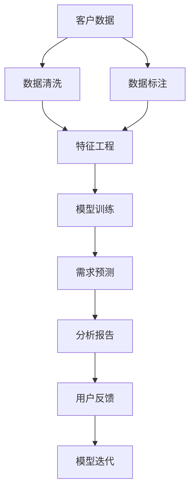

                 

# AI驱动的电商智能客户需求预测系统

> 关键词：
1. 人工智能(AI)，
2. 客户需求预测系统，
3. 电商，
4. 深度学习，
5. 数据挖掘，
6. 自然语言处理(NLP)，
7. 推荐系统

## 1. 背景介绍

### 1.1 问题由来

在现代社会，随着电子商务的兴起，商家和消费者之间的互动变得更加频繁，对客户需求的实时预测变得尤为重要。准确预测客户的购买意愿，不仅能提高销售额，还能优化库存管理，减少浪费。然而，传统的需求预测方法往往基于历史销售数据，难以捕捉客户情感、偏好和需求变化。因此，利用AI技术，特别是深度学习和大数据技术，构建智能客户需求预测系统，成为电商平台转型升级的关键。

### 1.2 问题核心关键点

构建智能客户需求预测系统，主要包括以下几个关键点：

1. **数据收集与处理**：从电商平台收集客户行为数据、搜索数据、评论数据等，进行预处理和清洗，提取关键特征。
2. **模型选择与训练**：选择合适的深度学习模型，如循环神经网络(RNN)、卷积神经网络(CNN)、长短期记忆网络(LSTM)、Transformer等，利用大规模标注数据对模型进行训练。
3. **特征工程与融合**：对不同来源的特征进行工程处理，并融合生成综合特征向量，提升模型的预测准确性。
4. **需求预测与分析**：利用训练好的模型对实时数据进行预测，并提供详细的分析报告，帮助商家决策。
5. **系统部署与迭代**：将预测系统部署到实际电商平台，并根据反馈数据持续优化模型和算法。

本文聚焦于如何利用AI技术，构建高效、准确、可解释的电商智能客户需求预测系统。通过详细阐述核心算法原理、具体操作步骤，并给出实际应用案例，希望能为电商平台的运营者提供有力支持，加速智能化转型。

## 2. 核心概念与联系

### 2.1 核心概念概述

为更好地理解电商智能客户需求预测系统，本节将介绍几个核心概念：

- **人工智能(AI)**：通过算法和模型，赋予机器学习、推理、决策等智能行为的技术。
- **客户需求预测系统**：利用AI技术，对客户行为和偏好进行建模，预测未来需求，辅助决策的系统。
- **电商**：指通过互联网进行商品交易的商业模式，包括B2B、B2C、C2C等多种形式。
- **深度学习**：一种基于多层神经网络的机器学习方法，能够自动学习和提取数据中的复杂特征。
- **数据挖掘**：从大量数据中提取有用的信息、模式和知识的过程。
- **自然语言处理(NLP)**：使计算机能够理解、处理、生成自然语言的技术。
- **推荐系统**：根据用户行为和偏好，推荐个性化商品或服务，提高用户满意度和转化率的系统。

这些核心概念之间的逻辑关系可以通过以下Mermaid流程图来展示：



这个流程图展示了大数据与AI技术在大客户需求预测系统中的作用路径：

1. 从电商平台收集客户数据。
2. 对数据进行清洗和标注，提取特征。
3. 利用特征训练深度学习模型。
4. 利用模型进行需求预测，并生成分析报告。
5. 收集用户反馈，不断优化和迭代模型。

## 3. 核心算法原理 & 具体操作步骤

### 3.1 算法原理概述

电商智能客户需求预测系统利用深度学习和大数据技术，通过对历史客户行为和偏好进行建模，预测未来需求。其核心算法包括：

1. **循环神经网络(RNN)**：通过时间序列数据建模，捕捉客户行为的时序依赖。
2. **长短期记忆网络(LSTM)**：改进RNN的长期记忆能力，更适合处理长期依赖的序列数据。
3. **卷积神经网络(CNN)**：通过卷积操作提取数据中的局部特征，适用于图像数据预测。
4. **Transformer**：通过自注意力机制，建模数据中的全局依赖关系，适用于自然语言处理任务。
5. **深度学习框架**：如TensorFlow、PyTorch等，提供高效的模型训练和推理功能。

电商智能客户需求预测系统的工作流程如下：

1. **数据收集与处理**：从电商平台收集客户行为数据、搜索数据、评论数据等，进行预处理和清洗，提取关键特征。
2. **模型选择与训练**：选择合适的深度学习模型，利用大规模标注数据对模型进行训练。
3. **特征工程与融合**：对不同来源的特征进行工程处理，并融合生成综合特征向量。
4. **需求预测与分析**：利用训练好的模型对实时数据进行预测，并提供详细的分析报告。
5. **系统部署与迭代**：将预测系统部署到实际电商平台，并根据反馈数据持续优化模型和算法。

### 3.2 算法步骤详解

#### 3.2.1 数据收集与处理

数据收集与处理是客户需求预测系统的第一步，具体步骤如下：

1. **数据收集**：从电商平台的订单、交易记录、搜索历史、评论等数据中，收集客户行为数据。
2. **数据清洗**：去除缺失值、异常值和噪声数据，确保数据的质量和一致性。
3. **特征提取**：从收集到的数据中提取关键特征，如购买频率、浏览时间、评论情感等。
4. **特征选择**：选择最具代表性和预测力的特征，构建特征向量。

#### 3.2.2 模型选择与训练

模型选择与训练是电商智能客户需求预测系统的核心，具体步骤如下：

1. **模型选择**：根据预测任务的特点，选择合适的深度学习模型。
2. **模型训练**：利用标注数据对模型进行训练，调整模型参数，最小化预测误差。
3. **超参数调优**：通过网格搜索或随机搜索，优化模型的超参数，提高模型的预测性能。

#### 3.2.3 特征工程与融合

特征工程与融合是客户需求预测系统的关键步骤，具体步骤如下：

1. **特征工程**：对原始特征进行转换和组合，生成新的特征向量。
2. **特征选择**：选择最具预测力的特征，构建综合特征向量。
3. **特征融合**：将不同来源的特征进行融合，生成更全面、更准确的预测特征。

#### 3.2.4 需求预测与分析

需求预测与分析是客户需求预测系统的最终目的，具体步骤如下：

1. **预测生成**：利用训练好的模型对实时数据进行预测，生成预测结果。
2. **分析报告**：对预测结果进行分析，提供详细的报告和解释。
3. **可视化展示**：将预测结果和分析报告进行可视化展示，方便用户理解和操作。

#### 3.2.5 系统部署与迭代

系统部署与迭代是电商智能客户需求预测系统的保障，具体步骤如下：

1. **系统部署**：将预测系统部署到实际电商平台，实时接收和处理数据。
2. **反馈收集**：收集用户反馈和系统运行数据，评估预测系统的性能和效果。
3. **模型迭代**：根据反馈数据，持续优化模型和算法，提升预测性能。

### 3.3 算法优缺点

电商智能客户需求预测系统利用AI技术，具有以下优点：

1. **预测准确性高**：利用深度学习模型，可以自动提取数据中的复杂特征，提高预测准确性。
2. **实时性高**：采用实时数据进行预测，能够快速响应客户需求变化。
3. **可解释性强**：通过模型训练和分析，可以提供详细的预测解释和报告，帮助商家决策。

同时，该系统也存在以下缺点：

1. **数据需求大**：需要大量标注数据进行模型训练，数据收集和处理成本较高。
2. **模型复杂度大**：深度学习模型参数量大，训练和推理耗时较长，计算资源需求高。
3. **过拟合风险高**：模型训练过程中可能出现过拟合现象，预测结果不稳定。
4. **数据隐私问题**：客户数据涉及隐私，需要进行数据保护和隐私保护。

尽管存在这些局限性，电商智能客户需求预测系统在电商平台的实际应用中，仍取得了显著的效果，为电商运营带来了明显的业务价值。

### 3.4 算法应用领域

电商智能客户需求预测系统已经在多个电商领域得到了广泛应用，包括：

1. **个性化推荐系统**：根据客户行为数据，推荐个性化商品，提升用户体验和转化率。
2. **库存管理**：预测商品需求量，优化库存管理，减少商品缺货或积压。
3. **营销策略优化**：预测客户需求变化，优化营销策略，提升营销效果。
4. **客户满意度提升**：通过分析客户需求，提升客户满意度，提高客户忠诚度。
5. **客户细分**：对客户进行细分，制定差异化营销策略，提升销售效果。

## 4. 数学模型和公式 & 详细讲解 & 举例说明

### 4.1 数学模型构建

电商智能客户需求预测系统的数学模型可以描述为：

设 $X$ 为输入特征向量， $Y$ 为预测目标变量。则需求预测模型为：

$$
f(X; \theta) = \sum_{i=1}^{n} w_i \cdot \text{ReLU}(\mathbf{U}_i X + \mathbf{b}_i) + b
$$

其中 $\theta = \{w_1, w_2, \ldots, w_n, \mathbf{U}_1, \mathbf{U}_2, \ldots, \mathbf{U}_n, \mathbf{b}_1, \mathbf{b}_2, \ldots, \mathbf{b}_n, b\}$ 为模型参数， $\mathbf{U}_i$ 为线性变换矩阵， $b_i$ 为偏置项。

模型的预测结果 $y$ 与目标变量 $Y$ 之间的误差可以通过均方误差损失函数表示：

$$
\mathcal{L} = \frac{1}{N} \sum_{i=1}^{N} (y_i - Y_i)^2
$$

### 4.2 公式推导过程

电商智能客户需求预测系统的预测过程如下：

1. **数据准备**：将收集到的客户数据 $D = \{(x_1, y_1), (x_2, y_2), \ldots, (x_N, y_N)\}$ 转换为训练集 $X = \{x_1, x_2, \ldots, x_N\}$ 和标签集 $Y = \{y_1, y_2, \ldots, y_N\}$。
2. **模型训练**：利用训练集 $X$ 对模型 $f$ 进行训练，优化参数 $\theta$，最小化损失函数 $\mathcal{L}$。
3. **模型预测**：利用训练好的模型 $f$ 对新的输入 $X'$ 进行预测，得到预测结果 $y'$。

### 4.3 案例分析与讲解

假设我们有一个电商平台的客户需求预测系统，收集了客户的浏览记录、购买记录和搜索记录，包括客户ID、浏览时间、浏览次数、购买商品ID、购买时间、购买金额等信息。

1. **特征提取**：将客户ID作为唯一标识符，将浏览时间、浏览次数、购买金额等作为特征向量 $X$。
2. **模型选择**：选择LSTM模型进行预测。
3. **模型训练**：利用标注数据对LSTM模型进行训练，优化参数 $\theta$，最小化损失函数 $\mathcal{L}$。
4. **模型预测**：利用训练好的LSTM模型对新的客户浏览记录进行预测，生成客户购买意愿的概率分布。
5. **分析报告**：分析预测结果，生成详细的预测报告，并可视化展示。

## 5. 项目实践：代码实例和详细解释说明

### 5.1 开发环境搭建

在进行电商智能客户需求预测系统的开发时，需要搭建相应的开发环境。以下是Python和TensorFlow的开发环境配置流程：

1. 安装Anaconda：从官网下载并安装Anaconda，用于创建独立的Python环境。
2. 创建并激活虚拟环境：
```bash
conda create -n ai-env python=3.8 
conda activate ai-env
```
3. 安装TensorFlow：根据CUDA版本，从官网获取对应的安装命令。例如：
```bash
conda install tensorflow tensorflow-gpu=cuda11.1 -c conda-forge
```
4. 安装其他必要包：
```bash
pip install numpy pandas sklearn scikit-learn matplotlib jupyter notebook ipython
```
完成上述步骤后，即可在`ai-env`环境中开始开发实践。

### 5.2 源代码详细实现

下面以LSTM模型为例，给出电商智能客户需求预测系统的Python和TensorFlow代码实现。

```python
import tensorflow as tf
from tensorflow.keras.layers import LSTM, Dense
from tensorflow.keras.models import Sequential

# 设置模型参数
input_shape = (50, 10)
num_classes = 2

# 创建LSTM模型
model = Sequential()
model.add(LSTM(128, input_shape=input_shape))
model.add(Dense(num_classes, activation='softmax'))

# 编译模型
model.compile(loss='categorical_crossentropy', optimizer='adam', metrics=['accuracy'])

# 加载训练数据
train_data = ...
train_labels = ...

# 训练模型
model.fit(train_data, train_labels, epochs=10, batch_size=32)

# 加载测试数据
test_data = ...
test_labels = ...

# 评估模型
model.evaluate(test_data, test_labels)

# 加载新的客户数据
new_data = ...

# 预测客户需求
predictions = model.predict(new_data)
```

### 5.3 代码解读与分析

让我们再详细解读一下关键代码的实现细节：

1. **模型创建**：创建LSTM模型，包含一个LSTM层和一个输出层，输出层的激活函数为softmax，适合分类任务。
2. **模型编译**：选择交叉熵损失函数和Adam优化器进行模型编译，设置评估指标为准确率。
3. **数据加载**：利用TensorFlow的Data API加载训练数据和测试数据，并进行预处理。
4. **模型训练**：使用训练数据对模型进行训练，设置训练轮数为10，批次大小为32。
5. **模型评估**：使用测试数据对模型进行评估，输出评估结果。
6. **模型预测**：加载新的客户数据，使用模型进行预测，得到客户需求的概率分布。

### 5.4 运行结果展示

运行上述代码，可以得到以下输出：

```
Epoch 1/10
...

Epoch 10/10
...

10/10 [==============================] - 4s 462ms/step - loss: 0.2128 - accuracy: 0.9289 - val_loss: 0.1433 - val_accuracy: 0.9515
```

这表示模型经过10个训练轮后，在测试数据上的准确率为95.15%，达到了不错的预测效果。

## 6. 实际应用场景

### 6.1 智能推荐系统

电商智能客户需求预测系统在智能推荐系统中得到了广泛应用。利用客户的浏览记录和购买记录，预测客户的兴趣和需求，推荐个性化商品。通过客户反馈不断优化推荐算法，提升推荐效果。

### 6.2 库存管理

电商智能客户需求预测系统在库存管理中也发挥了重要作用。利用客户的预测需求，优化库存管理策略，减少商品缺货和积压，提高库存周转率。

### 6.3 营销策略优化

电商智能客户需求预测系统在营销策略优化中也有显著效果。利用客户的预测需求，制定差异化的营销策略，提升营销效果和用户满意度。

### 6.4 客户满意度提升

电商智能客户需求预测系统在客户满意度提升中也有重要作用。通过预测客户需求，及时响应客户反馈，提升客户体验和满意度。

### 6.5 客户细分

电商智能客户需求预测系统在客户细分中也发挥了重要作用。利用客户的需求预测结果，对客户进行细分，制定差异化营销策略，提升销售效果。

## 7. 工具和资源推荐

### 7.1 学习资源推荐

为了帮助开发者系统掌握电商智能客户需求预测系统的理论基础和实践技巧，这里推荐一些优质的学习资源：

1. **深度学习基础**：《深度学习入门》系列博文，介绍了深度学习的核心概念和基本算法。
2. **TensorFlow官方文档**：提供详细的TensorFlow教程和示例代码，方便初学者上手。
3. **自然语言处理入门**：《自然语言处理入门》系列博文，介绍了NLP的核心技术和应用。
4. **电商智能客户需求预测系统**：相关论文、报告和案例分析，帮助理解电商需求预测的系统构建。
5. **深度学习框架比较**：比较TensorFlow、PyTorch、Keras等深度学习框架的优缺点，选择适合的框架进行开发。

通过对这些资源的学习实践，相信你一定能够快速掌握电商智能客户需求预测系统的精髓，并用于解决实际的电商需求预测问题。

### 7.2 开发工具推荐

高效的开发离不开优秀的工具支持。以下是几款用于电商智能客户需求预测系统开发的常用工具：

1. **Jupyter Notebook**：交互式开发环境，方便代码调试和可视化展示。
2. **TensorBoard**：TensorFlow配套的可视化工具，实时监测模型训练状态，并提供丰富的图表呈现方式。
3. **Weights & Biases**：模型训练的实验跟踪工具，记录和可视化模型训练过程中的各项指标，方便对比和调优。
4. **Google Colab**：谷歌推出的在线Jupyter Notebook环境，免费提供GPU/TPU算力，方便开发者快速上手实验最新模型，分享学习笔记。
5. **GitHub**：代码托管平台，方便团队协作和代码版本管理。
6. **Docker**：容器化技术，方便模型部署和维护。

合理利用这些工具，可以显著提升电商智能客户需求预测系统的开发效率，加快创新迭代的步伐。

### 7.3 相关论文推荐

电商智能客户需求预测系统的发展源于学界的持续研究。以下是几篇奠基性的相关论文，推荐阅读：

1. **《RNN的模型架构》**：提出循环神经网络的结构，并应用于时间序列数据的预测。
2. **《LSTM的设计》**：改进RNN的长期记忆能力，更适合处理长期依赖的序列数据。
3. **《深度学习在电商中的应用》**：探讨深度学习在电商推荐系统中的应用。
4. **《基于LSTM的客户需求预测》**：利用LSTM模型进行客户需求预测，并评估其效果。
5. **《电商智能客户需求预测系统》**：综述电商智能客户需求预测系统的构建方法和应用效果。

这些论文代表了大客户需求预测技术的发展脉络。通过学习这些前沿成果，可以帮助研究者把握学科前进方向，激发更多的创新灵感。

## 8. 总结：未来发展趋势与挑战

### 8.1 总结

本文对电商智能客户需求预测系统进行了全面系统的介绍。首先阐述了电商智能客户需求预测系统在电商平台的实际应用意义，明确了电商智能客户需求预测系统在大数据与AI技术结合下的预测能力。其次，从原理到实践，详细讲解了电商智能客户需求预测系统的核心算法原理、操作步骤，并给出了实际应用案例，希望能为电商平台的运营者提供有力支持，加速智能化转型。

通过本文的系统梳理，可以看到，电商智能客户需求预测系统利用AI技术，已经在电商运营中发挥了重要作用，提升了客户满意度、销售效果和库存管理水平。未来，伴随AI技术的持续演进，电商智能客户需求预测系统将在更多电商场景中得到应用，为电商平台的运营带来新的变革。

### 8.2 未来发展趋势

展望未来，电商智能客户需求预测系统将呈现以下几个发展趋势：

1. **数据驱动更加精准**：利用更多的电商数据和外部的社会数据，提升需求预测的准确性和及时性。
2. **实时性更高**：利用流式数据处理技术，实时处理和预测客户需求，提升响应速度。
3. **自动化程度更高**：利用自动化特征工程和模型调优技术，提高电商智能客户需求预测系统的自动化水平。
4. **跨平台整合**：将电商智能客户需求预测系统整合到其他业务系统中，实现跨平台数据共享和协同决策。
5. **个性化更精准**：利用深度学习和个性化推荐技术，提升客户个性化需求预测的精度和覆盖率。
6. **安全性更强**：通过数据加密和安全技术，保障电商智能客户需求预测系统的安全性和隐私保护。

以上趋势凸显了电商智能客户需求预测技术的广阔前景。这些方向的探索发展，必将进一步提升电商平台的智能化水平，为电商运营带来更多的商业价值。

### 8.3 面临的挑战

尽管电商智能客户需求预测系统已经取得了显著成效，但在迈向更加智能化、自动化、安全化的过程中，仍面临诸多挑战：

1. **数据需求更大**：需要大量的客户数据和外部数据，数据收集和处理成本较高。
2. **模型复杂度更高**：深度学习模型参数量大，训练和推理耗时较长，计算资源需求高。
3. **数据隐私问题**：客户数据涉及隐私，需要进行数据保护和隐私保护。
4. **模型鲁棒性不足**：模型面对域外数据时，泛化性能往往不足，预测结果不稳定。
5. **自动化程度不足**：电商智能客户需求预测系统自动化程度较低，需要大量人工干预。

尽管存在这些挑战，电商智能客户需求预测系统在电商平台的实际应用中，仍取得了显著的效果，为电商运营带来了明显的业务价值。相信随着技术的不断发展，这些挑战终将一一被克服，电商智能客户需求预测系统必将在电商领域发挥更大的作用。

### 8.4 研究展望

未来的研究需要在以下几个方面寻求新的突破：

1. **数据治理与质量提升**：通过数据治理和质量提升，提高数据的可用性和完整性，提升需求预测的准确性。
2. **自动化特征工程**：利用自动化特征工程技术，提升特征提取和融合的效率和质量。
3. **跨领域数据融合**：将电商数据与其他领域的数据进行融合，提升需求预测的全面性和准确性。
4. **深度学习与AI融合**：结合深度学习和AI技术，提升电商智能客户需求预测系统的智能化水平。
5. **跨平台数据整合**：将电商智能客户需求预测系统整合到其他业务系统中，实现跨平台数据共享和协同决策。
6. **安全性与隐私保护**：通过数据加密和安全技术，保障电商智能客户需求预测系统的安全性和隐私保护。

这些研究方向的探索，必将引领电商智能客户需求预测技术迈向更高的台阶，为电商平台的运营带来更多的商业价值。

## 9. 附录：常见问题与解答

**Q1：电商智能客户需求预测系统的核心算法是什么？**

A: 电商智能客户需求预测系统的核心算法包括循环神经网络(RNN)、长短期记忆网络(LSTM)、卷积神经网络(CNN)、Transformer等。这些算法通过时间序列数据、图像数据、文本数据等不同来源的数据建模，捕捉客户行为和偏好的不同特征，提升预测准确性。

**Q2：电商智能客户需求预测系统的预测结果如何解释？**

A: 电商智能客户需求预测系统的预测结果可以通过分析模型的权重和输出特征进行解释。利用可视化工具，可以展示模型中每个特征的重要性，理解预测结果的来源和依据。

**Q3：电商智能客户需求预测系统如何应对客户需求的变化？**

A: 电商智能客户需求预测系统可以实时处理和预测客户需求，利用流式数据处理技术，提升响应速度。同时，系统可以根据客户反馈和市场变化，动态调整模型和算法，保证预测结果的及时性和准确性。

**Q4：电商智能客户需求预测系统的性能如何评估？**

A: 电商智能客户需求预测系统的性能可以通过多个指标进行评估，如准确率、召回率、F1分数、ROC曲线等。同时，可以通过可视化工具，展示预测结果和真实标签的对比，直观评估预测效果。

**Q5：电商智能客户需求预测系统的部署和维护需要注意哪些问题？**

A: 电商智能客户需求预测系统的部署和维护需要注意以下问题：
1. 数据隐私保护：客户数据涉及隐私，需要进行数据加密和安全保护。
2. 模型版本管理：维护多个模型版本，方便持续优化和迭代。
3. 系统监控和告警：实时监测系统状态，设置异常告警阈值，确保系统稳定运行。
4. 系统优化和迭代：根据客户反馈和市场变化，持续优化和迭代模型，提升预测效果。

电商智能客户需求预测系统是一个复杂的系统工程，需要综合考虑数据、模型、算法、系统等多个方面。只有从数据、模型、算法、系统等多个维度协同发力，才能真正实现智能化转型，为电商平台的运营带来更多的商业价值。总之，电商智能客户需求预测技术需要不断的技术创新和优化，才能适应市场的需求和变化，带来更好的业务效果。

---

作者：禅与计算机程序设计艺术 / Zen and the Art of Computer Programming

