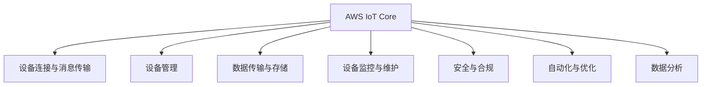

                 

# AWS IoT 核心：管理 IoT 设备

> 关键词：AWS IoT, IoT 设备管理, 安全与合规, 物联网平台, 自动化与优化, 数据分析

## 1. 背景介绍

### 1.1 问题由来

物联网(IoT)正迅速改变我们的生活方式，从智能家居到智慧城市，物联网设备无处不在。然而，随着设备数量的急剧增加，设备管理与维护变得越来越复杂。这不仅增加了运维成本，还带来了数据安全和隐私保护的挑战。

AWS IoT平台是AWS提供的全球领先的物联网平台，旨在帮助客户轻松构建、管理和部署IoT解决方案。本文将详细探讨AWS IoT的核心管理功能，包括设备管理、安全与合规、自动化与优化、数据分析等，帮助开发者和系统管理员更好地管理和优化IoT设备。

### 1.2 问题核心关键点

AWS IoT提供了全面的设备管理功能，包括设备连接与认证、数据传输与存储、设备监控与维护等。通过高效的管理手段，可以确保设备的安全、可靠和高效运行，并及时发现和解决潜在问题。

此外，AWS IoT还内置了强大的安全与合规功能，帮助客户遵守行业标准和法律法规，保护设备数据安全和隐私。

在自动化与优化方面，AWS IoT提供了丰富的API和SDK，支持设备自动发现、故障诊断和动态调整等，极大地提高了设备管理效率。

最后，AWS IoT还集成了强大的数据分析能力，帮助客户从设备数据中挖掘有价值的信息，进行实时监控和预测分析。

## 2. 核心概念与联系

### 2.1 核心概念概述

为了更好地理解AWS IoT的管理功能，我们首先介绍几个核心概念：

- AWS IoT Core：AWS IoT的核心组件，负责设备连接和消息传输。
- AWS IoT Device Defender：提供设备安全与合规管理功能，包括恶意软件检测、异常行为检测等。
- AWS IoT Analytics：集成数据分析功能，支持实时数据流处理和长期数据存储分析。
- AWS IoT Device Manager：提供设备管理功能，支持设备身份验证、配置管理等。

这些组件通过合理的架构设计，实现了设备管理、安全与合规、自动化与优化和数据分析等功能，共同构成了AWS IoT的核心能力。

### 2.2 核心概念原理和架构的 Mermaid 流程图



这个流程图展示了AWS IoT的核心组件及其功能关联，各组件协同工作，共同实现设备的全生命周期管理。

## 3. 核心算法原理 & 具体操作步骤

### 3.1 算法原理概述

AWS IoT的核心算法原理基于云计算和大数据技术，结合了设备连接、数据传输、设备管理、安全与合规、自动化与优化和数据分析等综合功能。其核心思想是通过集中管理和云平台资源，实现设备的自动化、优化和安全性保障，同时提供强大的数据分析能力。

### 3.2 算法步骤详解

AWS IoT的核心算法步骤如下：

1. **设备连接与认证**：
   - 设备通过TLS/SSL协议与AWS IoT Core建立安全连接。
   - 设备通过预配置的证书或动态生成的证书进行身份验证。
   - 设备连接成功后，数据传输过程采用TLS加密，确保数据传输的安全性。

2. **数据传输与存储**：
   - 设备将采集的数据通过AWS IoT Core传输到云端存储。
   - 数据存储在AWS S3、AWS DynamoDB等云存储服务中，支持长期存储和数据分析。

3. **设备监控与维护**：
   - 通过AWS IoT Device Manager，实现设备的身份验证、配置管理和生命周期管理。
   - 支持设备状态的实时监控和告警，快速响应设备故障和异常。
   - 提供设备固件升级功能，支持远程更新设备固件，保障设备安全。

4. **安全与合规**：
   - 使用AWS IoT Device Defender进行恶意软件检测和异常行为检测。
   - 支持基于规则的访问控制和审计，确保设备操作符合合规要求。
   - 提供设备操作记录和日志，支持合规性审计和取证。

5. **自动化与优化**：
   - 使用AWS IoT提供的API和SDK，实现设备自动发现、故障诊断和动态调整。
   - 支持设备间的数据共享和协同工作，提高设备使用效率。
   - 提供设备性能监控和优化建议，帮助用户提升设备运行效率。

6. **数据分析**：
   - 使用AWS IoT Analytics进行实时数据流处理和长期数据存储分析。
   - 支持自定义分析和机器学习算法，从设备数据中提取有价值的信息。
   - 提供可视化工具，支持数据可视化和报告生成。

### 3.3 算法优缺点

AWS IoT的核心算法优点包括：

- **安全性和合规性**：内置安全与合规功能，确保设备数据的安全和合规。
- **可靠性与稳定性**：基于云计算和大数据技术，确保设备的可靠性和稳定性。
- **自动化与优化**：提供自动化和优化功能，提高设备管理效率。
- **强大数据分析能力**：集成数据分析功能，帮助用户从设备数据中提取有价值的信息。

缺点包括：

- **高成本**：AWS IoT平台需要支付云服务费用，长期运行成本较高。
- **复杂性**：设备管理涉及多个组件和功能，需要较高的技术门槛。
- **依赖云计算**：需要依赖AWS的云平台和网络环境，可能存在网络延迟和带宽限制。

### 3.4 算法应用领域

AWS IoT的核心算法广泛应用于各种物联网应用场景，包括智能家居、智慧城市、智能农业、工业物联网等。通过高效的设备管理、安全与合规、自动化与优化和数据分析功能，AWS IoT帮助用户构建高效、安全、可靠的IoT解决方案。

## 4. 数学模型和公式 & 详细讲解

### 4.1 数学模型构建

AWS IoT的核心算法模型可以表示为：

$$
\text{IoT} = \text{AWS IoT Core} \times \text{设备连接与认证} \times \text{数据传输与存储} \times \text{设备监控与维护} \times \text{安全与合规} \times \text{自动化与优化} \times \text{数据分析}
$$

### 4.2 公式推导过程

以设备连接与认证为例，推导过程如下：

假设设备在连接AWS IoT Core时，需要进行身份验证，并使用证书进行加密传输。设备连接过程可以表示为：

$$
\text{Device Connection} = \text{Device Identity} \times \text{Certificate-based Authentication} \times \text{TLS Encryption}
$$

其中，$\text{Device Identity}$表示设备的身份验证，$\text{Certificate-based Authentication}$表示基于证书的身份验证，$\text{TLS Encryption}$表示传输数据的加密过程。

### 4.3 案例分析与讲解

以智能家居为例，分析AWS IoT的核心算法应用：

1. **设备连接与认证**：
   - 智能家居设备通过TLS/SSL协议与AWS IoT Core建立安全连接。
   - 设备使用预配置的证书进行身份验证，确保设备连接的合法性。
   - 数据传输过程中，使用TLS加密确保数据的安全性。

2. **数据传输与存储**：
   - 智能家居设备将采集的环境数据通过AWS IoT Core传输到AWS S3云存储服务。
   - 数据存储在AWS S3中，支持长期存储和数据分析。

3. **设备监控与维护**：
   - 通过AWS IoT Device Manager，实现智能家居设备的身份验证和配置管理。
   - 支持设备状态的实时监控和告警，快速响应设备故障和异常。
   - 提供设备固件升级功能，支持远程更新设备固件，保障设备安全。

4. **安全与合规**：
   - 使用AWS IoT Device Defender进行恶意软件检测和异常行为检测。
   - 支持基于规则的访问控制和审计，确保设备操作符合合规要求。
   - 提供设备操作记录和日志，支持合规性审计和取证。

5. **自动化与优化**：
   - 使用AWS IoT提供的API和SDK，实现智能家居设备的自动发现、故障诊断和动态调整。
   - 支持设备间的数据共享和协同工作，提高设备使用效率。
   - 提供设备性能监控和优化建议，帮助用户提升设备运行效率。

6. **数据分析**：
   - 使用AWS IoT Analytics进行智能家居设备的环境数据分析。
   - 支持自定义分析和机器学习算法，从设备数据中提取有价值的信息。
   - 提供可视化工具，支持数据可视化和报告生成。

## 5. 项目实践：代码实例和详细解释说明

### 5.1 开发环境搭建

要使用AWS IoT进行设备管理，首先需要搭建开发环境。步骤如下：

1. 在AWS Management Console中，创建AWS IoT Core实例。
2. 安装AWS CLI和AWS IoT SDK，支持Python、Java等多种编程语言。
3. 创建设备证书和设备规则，支持设备身份验证和访问控制。

### 5.2 源代码详细实现

下面是一个使用Python编写的AWS IoT设备管理代码示例：

```python
import boto3
from botocore.exceptions import NoCredentialsError

def create_thing(thing_name):
    # 创建设备
    try:
        iot = boto3.client('iot', region_name='us-west-2')
        iot.create_thing(thing_name=thing_name)
        print(f"Device {thing_name} created successfully.")
    except NoCredentialsError:
        print("No credentials found.")

def attach_policy(thing_name, policy_name):
    # 为设备绑定策略
    try:
        iot = boto3.client('iot', region_name='us-west-2')
        iot.attach_thing_policy(thing_name=thing_name, policy_name=policy_name)
        print(f"Policy {policy_name} attached to device {thing_name} successfully.")
    except NoCredentialsError:
        print("No credentials found.")

def get_thing_state(thing_name):
    # 获取设备状态
    try:
        iot = boto3.client('iot', region_name='us-west-2')
        state = iot.describe_thing(thing_name=thing_name)
        print(f"Device {thing_name} state: {state['thing']['state']['stateEvent']['detail']}")
    except NoCredentialsError:
        print("No credentials found.")
```

### 5.3 代码解读与分析

上述代码示例展示了AWS IoT设备管理的基本功能：

- `create_thing`函数：创建设备，指定设备名称。
- `attach_policy`函数：为设备绑定策略，指定设备名称和策略名称。
- `get_thing_state`函数：获取设备状态，输出设备当前状态。

### 5.4 运行结果展示

运行上述代码后，可以在AWS Management Console中查看设备创建、策略绑定和设备状态等信息，确保设备管理功能的正常运行。

## 6. 实际应用场景

### 6.1 智能家居系统

在智能家居系统中，AWS IoT设备管理功能可以确保设备的可靠性和安全性。智能家居设备通过TLS加密连接AWS IoT Core，使用预配置的证书进行身份验证，确保数据传输的安全性。同时，使用AWS IoT Device Manager进行设备身份验证和配置管理，支持设备状态的实时监控和告警，快速响应设备故障和异常。

### 6.2 智慧城市监控

智慧城市监控系统需要大量IoT设备进行环境监测和数据采集。通过AWS IoT，可以实现设备的自动发现、故障诊断和动态调整，提高设备使用效率。同时，使用AWS IoT Analytics进行数据分析，支持实时数据流处理和长期数据存储分析，帮助城市管理者快速响应城市运行中的各种问题。

### 6.3 工业物联网

工业物联网系统需要高效的设备管理和数据采集。通过AWS IoT，可以实现设备连接与认证、数据传输与存储、设备监控与维护等功能，保障设备的可靠性和安全性。同时，使用AWS IoT Device Defender进行恶意软件检测和异常行为检测，确保设备操作符合合规要求。

## 7. 工具和资源推荐

### 7.1 学习资源推荐

为了深入理解AWS IoT的核心算法和功能，以下是一些推荐的学习资源：

1. AWS IoT官方文档：提供完整的AWS IoT产品文档，包括设备管理、安全与合规、自动化与优化和数据分析等功能。
2. AWS IoT Devguide：提供AWS IoT的开发指南，包括API和SDK的使用方法。
3. AWS IoT Use Cases：提供AWS IoT的案例研究，展示AWS IoT在不同行业的应用。
4. AWS IoT Training：提供AWS IoT的在线培训课程，帮助开发者掌握AWS IoT的核心算法和功能。

### 7.2 开发工具推荐

使用AWS IoT进行设备管理，需要以下开发工具：

1. AWS CLI：AWS命令行界面，支持批量操作和管理。
2. AWS IoT SDK：支持Python、Java等多种编程语言，方便开发者进行设备管理和数据采集。
3. AWS Management Console：提供可视化的设备管理界面，方便用户进行设备配置和管理。

### 7.3 相关论文推荐

为了深入理解AWS IoT的核心算法，以下是一些相关的论文推荐：

1. "Securing IoT Devices using AWS IoT Core"：探讨AWS IoT Core的安全机制，包括设备连接与认证和数据传输加密等。
2. "IoT Device Management with AWS IoT Device Manager"：介绍AWS IoT Device Manager的功能和使用方法，支持设备身份验证和配置管理。
3. "Real-time Data Analytics with AWS IoT Analytics"：介绍AWS IoT Analytics的功能和使用方法，支持实时数据流处理和长期数据存储分析。

## 8. 总结：未来发展趋势与挑战

### 8.1 研究成果总结

AWS IoT的核心算法基于云计算和大数据技术，集成了设备连接、数据传输、设备管理、安全与合规、自动化与优化和数据分析等功能。其核心思想是通过集中管理和云平台资源，实现设备的自动化、优化和安全性保障，同时提供强大的数据分析能力。

### 8.2 未来发展趋势

未来，AWS IoT将呈现以下几个发展趋势：

1. **边缘计算的融合**：随着边缘计算的兴起，AWS IoT将进一步与边缘计算平台结合，实现更高效的数据处理和设备管理。
2. **人工智能的集成**：通过集成人工智能技术，AWS IoT将提供更智能化的设备管理和服务，支持设备性能优化和异常检测。
3. **数据分析的深入**：AWS IoT将进一步增强数据分析功能，支持更高级的数据挖掘和机器学习算法，从设备数据中提取更多有价值的信息。
4. **物联网生态的拓展**：AWS IoT将与其他IoT平台和设备厂商合作，构建更完整的物联网生态系统，提供更全面的设备管理和服务。

### 8.3 面临的挑战

AWS IoT在不断发展过程中，也面临一些挑战：

1. **高成本**：AWS IoT平台需要支付云服务费用，长期运行成本较高。
2. **复杂性**：设备管理涉及多个组件和功能，需要较高的技术门槛。
3. **依赖云计算**：需要依赖AWS的云平台和网络环境，可能存在网络延迟和带宽限制。
4. **数据隐私和安全**：随着设备数量的增加，数据隐私和安全问题也将越来越突出。

### 8.4 研究展望

未来，AWS IoT需要在以下几个方面进行深入研究：

1. **边缘计算与云平台的协同**：进一步探索边缘计算与云平台的协同，实现更高效的数据处理和设备管理。
2. **人工智能与设备管理的结合**：通过集成人工智能技术，提升设备管理和服务智能化水平。
3. **数据分析与机器学习的融合**：进一步增强数据分析功能，支持更高级的数据挖掘和机器学习算法。
4. **数据隐私与安全的保护**：研究和开发更强大的数据隐私和安全保护机制，确保设备数据的安全和合规。

## 9. 附录：常见问题与解答

**Q1：AWS IoT是否支持跨区域的设备管理？**

A: AWS IoT支持跨区域的设备管理。用户可以在多个AWS区域创建和管理设备，通过AWS IoT Core进行数据传输和设备连接。但需要注意的是，跨区域的设备管理可能需要考虑网络延迟和带宽限制等问题。

**Q2：AWS IoT是否支持设备的动态配置？**

A: AWS IoT支持设备的动态配置。用户可以通过AWS IoT Device Manager进行设备状态监控和告警，支持设备的远程更新和配置。同时，支持自定义规则和策略，根据设备状态动态调整配置参数。

**Q3：AWS IoT是否支持设备数据的实时分析？**

A: AWS IoT支持设备的实时数据分析。用户可以使用AWS IoT Analytics进行实时数据流处理和长期数据存储分析，支持自定义分析和机器学习算法，从设备数据中提取有价值的信息。

**Q4：AWS IoT是否支持设备的操作记录和审计？**

A: AWS IoT支持设备的操作记录和审计。用户可以使用AWS IoT Device Defender进行恶意软件检测和异常行为检测，支持基于规则的访问控制和审计，确保设备操作符合合规要求。

**Q5：AWS IoT是否支持设备的自动发现和动态调整？**

A: AWS IoT支持设备的自动发现和动态调整。用户可以使用AWS IoT提供的API和SDK，实现设备自动发现、故障诊断和动态调整，支持设备间的数据共享和协同工作，提高设备使用效率。

---

作者：禅与计算机程序设计艺术 / Zen and the Art of Computer Programming

