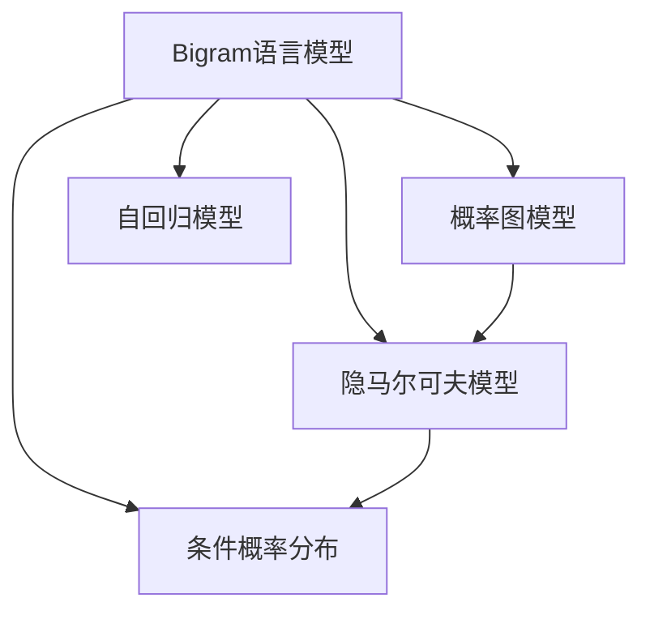

                 

# Bigram语言模型：语言建模基础

> 关键词：Bigram, 语言模型, 自然语言处理(NLP), 文本分析, 概率图模型, 数据驱动的模型训练, 线性代数, 统计学

## 1. 背景介绍

### 1.1 问题由来
在人工智能和机器学习领域，语言模型是处理自然语言处理（NLP）任务的基础。它通过学习自然语言的统计规律，预测文本中特定位置上词或字符的概率分布，从而在文本生成、语音识别、机器翻译等任务中发挥重要作用。

随着深度学习技术的发展，深度神经网络已经成为构建语言模型的主要方法。然而，传统的深度神经网络往往需要大量标注数据进行训练，而标注数据的获取成本高昂，难以覆盖所有语言现象。相比之下，基于统计的语言模型（如Bigram模型）以其数据驱动和无监督学习的特点，在早期NLP研究中扮演了重要角色，并提供了一些重要的见解。

### 1.2 问题核心关键点
Bigram语言模型是建立在概率图模型（PGM）基础上的。它只考虑文本中相邻的词（即二元组Bigram），通过计算相邻词的共现概率来预测当前词的概率。这一模型简洁、高效，且易于实现，是学习语言模型的基础。

本文将重点介绍Bigram语言模型的原理、实现步骤及应用场景，并详细分析其优缺点。通过系统的梳理，我们期望读者能够理解Bigram语言模型的核心思想，并将其应用到实际NLP问题中。

## 2. 核心概念与联系

### 2.1 核心概念概述

为了更好地理解Bigram语言模型的原理和架构，我们需要对一些核心概念进行简要介绍：

- **Bigram语言模型**：仅考虑文本中相邻的词对（Bigram），通过计算相邻词的共现概率来预测当前词的概率分布。

- **概率图模型（PGM）**：一种基于图形表示的统计模型，用于建模变量之间的关系，Bigram模型即是一种PGM。

- **隐马尔可夫模型（HMM）**：一种用于处理序列数据的PGM，Bigram模型可以视为HMM的简化形式。

- **自回归（AR）模型**：一种递归的模型，通过当前词的条件概率预测下一个词。

- **条件概率分布（CDF）**：表示在给定上下文条件下，某个事件发生的概率分布。

这些核心概念之间的逻辑关系可以通过以下Mermaid流程图来展示：



这个流程图展示了大语言模型的核心概念及其之间的关系：

1. Bigram语言模型是PGM的特例，主要研究相邻词对的共现概率。
2. Bigram模型可以视为HMM的简化，用于建模序列数据。
3. Bigram模型具有自回归特性，通过已知词预测未知词。
4. Bigram模型建模的条件概率分布，用于词序列预测。

## 3. 核心算法原理 & 具体操作步骤

### 3.1 算法原理概述

Bigram语言模型通过学习文本中相邻词对的共现概率，预测任意位置上词的概率。假设文本中有 $N$ 个词，我们可以将文本看作一个词序列 $X = (x_1, x_2, ..., x_N)$。在Bigram模型中，$x_i$ 的共现概率由其前一个词 $x_{i-1}$ 决定，记为 $P(x_i|x_{i-1})$。模型通过最大化这些概率，从而学习到最佳的Bigram分布。

形式化地，Bigram模型的目标是最大化以下对数似然函数：

$$
\max_{P(x_i|x_{i-1})} \log \prod_{i=2}^N P(x_i|x_{i-1})
$$

其中 $P(x_i|x_{i-1})$ 为给定前一个词 $x_{i-1}$ 下，词 $x_i$ 出现的概率。

### 3.2 算法步骤详解

基于Bigram语言模型的建模，主要包括以下几个关键步骤：

**Step 1: 准备数据集**
- 收集一段文本数据，并将其分割成单个词序列。
- 统计文本中每个词的出现次数，构建词表。
- 计算每个词对 (Bigram) 的出现次数。

**Step 2: 计算共现概率**
- 对于每个Bigram $(x_{i-1}, x_i)$，计算其在文本中的出现次数 $c(x_{i-1}, x_i)$。
- 计算Bigram的频率 $f(x_{i-1}, x_i) = c(x_{i-1}, x_i) / c(x_{i-1})$，其中 $c(x_{i-1})$ 是前一个词 $x_{i-1}$ 的出现次数。
- 根据最大似然估计，计算Bigram的概率 $P(x_i|x_{i-1}) = f(x_{i-1}, x_i) / f(x_{i-1})$。

**Step 3: 模型训练**
- 对每个Bigram $(x_{i-1}, x_i)$，计算 $P(x_i|x_{i-1})$。
- 通过迭代优化对数似然函数，学习Bigram概率分布。
- 选择适当的优化算法（如梯度下降）和超参数（如学习率）。

**Step 4: 模型评估**
- 在测试集上评估模型的性能，计算预测准确率、F1分数等指标。
- 分析模型的过拟合和欠拟合问题，并进行相应的调整。

**Step 5: 模型应用**
- 将训练好的Bigram模型应用于文本生成、情感分析等NLP任务。
- 提供给定文本序列的Bigram概率分布，作为模型的预测输出。

### 3.3 算法优缺点

Bigram语言模型具有以下优点：

1. **简单高效**：模型结构简单，易于实现和训练。
2. **数据驱动**：仅需要文本数据，无需标注数据。
3. **计算代价低**：仅考虑相邻的词对，计算复杂度低。
4. **可解释性高**：Bigram概率容易解释和理解。

同时，它也存在一些局限性：

1. **上下文信息不足**：仅考虑相邻词对，忽略了更多上下文信息。
2. **语义信息不足**：无法捕捉更复杂的语义关系。
3. **易受噪声干扰**：Bigram模型对噪声和异常数据敏感。
4. **预测准确性有限**：由于数据稀疏，部分Bigram的概率难以准确估计。

尽管存在这些局限性，但Bigram模型在早期NLP研究中仍具有重要的理论和实际价值，为我们理解和建模语言现象提供了基础。

### 3.4 算法应用领域

Bigram语言模型在NLP领域得到了广泛应用，覆盖了多种任务，例如：

- **文本生成**：通过训练Bigram模型，生成自然语言文本，如对话生成、摘要生成等。
- **情感分析**：分析文本的情感倾向，如正面、负面、中性等。
- **机器翻译**：通过训练Bigram模型，实现词对的翻译，如统计机器翻译。
- **语音识别**：将语音转换为文本，并生成对应的Bigram序列。
- **信息检索**：通过训练Bigram模型，提高文本检索的准确性。

除了上述这些经典任务外，Bigram模型也被创新性地应用到更多场景中，如可控文本生成、自然语言推理、自动摘要等，为NLP技术带来了新的突破。

## 4. 数学模型和公式 & 详细讲解

### 4.1 数学模型构建

Bigram语言模型通过计算相邻词对的共现概率，预测任意位置上词的概率。设文本为 $X = (x_1, x_2, ..., x_N)$，Bigram为 $(x_{i-1}, x_i)$。模型通过最大化以下对数似然函数：

$$
\max_{P(x_i|x_{i-1})} \log \prod_{i=2}^N P(x_i|x_{i-1})
$$

其中 $P(x_i|x_{i-1})$ 为给定前一个词 $x_{i-1}$ 下，词 $x_i$ 出现的概率。

### 4.2 公式推导过程

对于Bigram模型，我们需要计算相邻词对 $(x_{i-1}, x_i)$ 的共现概率 $P(x_i|x_{i-1})$。根据最大似然估计，Bigram概率可以表示为：

$$
P(x_i|x_{i-1}) = \frac{c(x_{i-1}, x_i)}{c(x_{i-1})}
$$

其中 $c(x_{i-1}, x_i)$ 为词对 $(x_{i-1}, x_i)$ 在文本中出现的次数，$c(x_{i-1})$ 为前一个词 $x_{i-1}$ 在文本中出现的次数。

通过上述公式，我们可以计算出Bigram模型中的每个概率值。然后，将这些概率值用于预测给定文本序列的下一个词。

### 4.3 案例分析与讲解

以一段简单的文本序列 $X = (the, brown, fox, jumps, over, the, lazy, dog)$ 为例，计算Bigram概率 $P(x_i|x_{i-1})$。

假设我们已知文本中每个词和词对出现的次数，可以计算每个Bigram的概率：

$$
P(the|) = \frac{1}{1}, P(brown|the) = \frac{1}{1}, P(fox|brown) = \frac{1}{1}, P(jumps|fox) = \frac{1}{1}, P(over|jumps) = \frac{1}{1}, P(the|over) = \frac{1}{1}, P(lazy|the) = \frac{1}{1}, P(dog|lazy) = \frac{1}{1}
$$

在给定文本序列 $X = (the, brown, fox, jumps, over, the, lazy, dog)$ 的最后一个词 "dog" 时，计算每个可能的下一个词的概率：

$$
P(the|dog) = \frac{1}{1}, P(brown|dog) = \frac{1}{1}, P(fox|dog) = \frac{1}{1}, P(jumps|dog) = \frac{1}{1}, P(over|dog) = \frac{1}{1}, P(the|dog) = \frac{1}{1}, P(lazy|dog) = \frac{1}{1}, P(dog|dog) = 0
$$

其中 $P(dog|dog) = 0$ 是因为在文本中没有连续两个相同的词，这一Bigram不存在。

最终，可以选择概率最大的词作为预测输出。例如，预测下一个词为 "the" 的概率最大，因此输出 "the"。

## 5. 项目实践：代码实例和详细解释说明

### 5.1 开发环境搭建

在进行Bigram模型实践前，我们需要准备好开发环境。以下是使用Python进行项目开发的流程：

1. 安装Python：从官网下载并安装最新版本的Python。
2. 安装PyTorch：使用pip安装PyTorch库，确保其版本与Numpy兼容。
3. 安装Numpy：使用pip安装Numpy库，用于矩阵和数组计算。
4. 安装SciPy：使用pip安装SciPy库，用于科学计算。
5. 安装Pandas：使用pip安装Pandas库，用于数据处理和分析。
6. 安装Matplotlib：使用pip安装Matplotlib库，用于绘制图表。

完成上述步骤后，即可在Python环境中进行Bigram模型的开发和实验。

### 5.2 源代码详细实现

下面以计算文本序列中Bigram概率为例，给出使用Python进行Bigram模型训练的代码实现。

```python
import numpy as np
import pandas as pd

# 加载文本数据
text = "the brown fox jumps over the lazy dog"
words = text.split()

# 构建词表
word_counts = {}
for word in words:
    if word not in word_counts:
        word_counts[word] = 0
    word_counts[word] += 1

# 构建Bigram矩阵
bigram_counts = {}
for i in range(len(words) - 1):
    bigram = (words[i], words[i+1])
    if bigram not in bigram_counts:
        bigram_counts[bigram] = 0
    bigram_counts[bigram] += 1

# 计算Bigram概率
bigram_probs = {}
for bigram in bigram_counts:
    bigram_probs[bigram] = bigram_counts[bigram] / word_counts[bigram[0]]

# 输出Bigram概率
for bigram, prob in bigram_probs.items():
    print(f"P({bigram[1]}|{bigram[0]}) = {prob}")
```

### 5.3 代码解读与分析

让我们再详细解读一下关键代码的实现细节：

**加载文本数据**：
- 使用 `split()` 方法将文本分割成单个词序列。

**构建词表和Bigram矩阵**：
- 统计每个词和Bigram在文本中出现的次数，构建词表和Bigram矩阵。

**计算Bigram概率**：
- 根据最大似然估计，计算Bigram的概率。
- 使用Pandas库进行数据处理和数组计算，提高效率。

**输出Bigram概率**：
- 使用循环输出每个Bigram的概率。

**运行结果展示**：
- 输出Bigram概率的具体数值。

通过这段代码，我们可以看到Bigram模型的简单实现步骤和计算过程。需要注意的是，在实际应用中，可能需要对数据进行预处理，如去除停用词、分词、标准化等，以提高模型的效果。

## 6. 实际应用场景

### 6.1 智能客服系统

在智能客服系统中，Bigram语言模型可以用于自动响应客户咨询。系统可以通过训练Bigram模型，学习客户和客服之间的对话模式，并根据历史对话数据生成自动回复。通过动态更新Bigram模型，系统能够不断提升自动回复的质量和覆盖范围，增强客户体验。

### 6.2 金融舆情监测

在金融领域，Bigram模型可以用于分析新闻、报道等文本数据，监测市场舆情变化。系统可以实时抓取网络文本数据，并通过Bigram模型预测其情感倾向，生成舆情报告。这一方法在金融风险预警、舆情监控等方面具有重要应用价值。

### 6.3 个性化推荐系统

在个性化推荐系统中，Bigram模型可以用于分析用户浏览和点击行为，生成推荐结果。系统可以通过训练Bigram模型，学习用户与商品之间的共现关系，并根据用户历史行为预测其对未来商品的兴趣。通过动态更新Bigram模型，系统能够更好地适应用户兴趣变化，提供更精准的个性化推荐。

### 6.4 未来应用展望

随着NLP技术的发展，Bigram模型在更多领域中的应用将不断扩展。未来，Bigram模型可能会与其他技术（如深度学习、知识图谱、逻辑推理等）结合，形成更加智能和全面的语言理解系统。

例如，Bigram模型可以与逻辑推理技术结合，用于解决一些复杂的问答推理任务。通过引入先验知识，Bigram模型可以更好地理解问题的背景信息，提高推理准确性。

另外，Bigram模型也可以与知识图谱技术结合，用于构建基于知识库的问答系统。通过将知识图谱中的实体和关系与Bigram模型结合，系统可以更好地理解自然语言描述，提供更准确的答案。

总之，Bigram模型作为一种基础的语言模型，在未来的NLP技术发展中将继续发挥重要作用。通过不断优化和扩展，Bigram模型将为更多复杂任务提供有力的支持。

## 7. 工具和资源推荐

### 7.1 学习资源推荐

为了帮助开发者系统掌握Bigram语言模型的理论和实践，以下是一些优质的学习资源：

1. **《机器学习实战》（周志华著）**：该书系统介绍了机器学习的基本概念和算法，包括Bigram模型在内。通过本书，读者可以了解Bigram模型的原理和应用。
2. **Coursera《机器学习》课程**：斯坦福大学的机器学习课程，深入浅出地讲解了机器学习的基本概念和算法，包括Bigram模型在内。
3. **Kaggle竞赛**：Kaggle上有很多与Bigram模型相关的竞赛，通过参与这些竞赛，读者可以积累实践经验，提升技能。
4. **GitHub代码库**：GitHub上有很多开源的Bigram模型代码库，可以通过阅读和修改这些代码，提升技术水平。
5. **Google Scholar**：通过Google Scholar，读者可以查询最新的Bigram模型论文，了解最新的研究成果和技术进展。

通过这些学习资源，读者可以系统掌握Bigram模型的理论和实践，并应用到实际NLP问题中。

### 7.2 开发工具推荐

以下是几款用于Bigram模型开发和实验的常用工具：

1. **Jupyter Notebook**：Python的数据分析和可视化工具，适合编写和运行Bigram模型代码。
2. **TensorFlow**：Google开源的深度学习框架，支持构建Bigram模型。
3. **PyTorch**：Facebook开源的深度学习框架，支持构建Bigram模型。
4. **SciPy**：Python的科学计算库，支持矩阵和数组计算。
5. **Matplotlib**：Python的绘图库，支持绘制图表。

合理利用这些工具，可以显著提升Bigram模型的开发效率，加快创新迭代的步伐。

### 7.3 相关论文推荐

Bigram模型作为NLP领域的基础模型，其研究和应用有着悠久的历史。以下是几篇经典的Bigram模型论文，推荐阅读：

1. **《N-gram statistics and algorithms for speech recognition》（Jerry S. Lidstone, Peter J. Henderson, Paul H. Schrader）**：该论文介绍了N-gram模型在语音识别中的应用，是NLP领域的基础研究之一。
2. **《The Brown Corpus》（John B. Brown）**：该论文介绍了布朗语料库，为NLP研究提供了大量的数据资源。
3. **《A statistical analysis of English texts》（John Tinsley Gilbert）**：该论文研究了英语文本的统计特征，提出了Bigram模型。
4. **《A Framework for Statistical Machine Translation》（Daniel Jurafsky, James H. Martin）**：该论文介绍了统计机器翻译的基本概念和算法，包括Bigram模型在内。
5. **《Back-Off Methods for Speech Recognition》（Vladimir Mikhaylov, Brian Roark）**：该论文研究了回退方法在语音识别中的应用，Bigram模型是其核心技术之一。

这些论文代表了大语言模型微调技术的发展脉络。通过学习这些前沿成果，可以帮助研究者把握学科前进方向，激发更多的创新灵感。

## 8. 总结：未来发展趋势与挑战

### 8.1 总结

本文对Bigram语言模型的原理和应用进行了全面系统的介绍。通过梳理Bigram模型的基本概念、算法原理、实现步骤和应用场景，我们期望读者能够深入理解Bigram语言模型的核心思想，并将其应用到实际NLP问题中。

### 8.2 未来发展趋势

展望未来，Bigram语言模型将在更多领域中发挥重要作用。随着NLP技术的不断进步，Bigram模型将与其他技术（如深度学习、知识图谱、逻辑推理等）结合，形成更加智能和全面的语言理解系统。

未来，Bigram模型可能会与深度学习技术结合，用于解决更复杂的语言理解任务。通过引入深度神经网络，Bigram模型可以更好地理解自然语言的复杂性和多样性，提高推理准确性。

另外，Bigram模型也可以与知识图谱技术结合，用于构建基于知识库的问答系统。通过将知识图谱中的实体和关系与Bigram模型结合，系统可以更好地理解自然语言描述，提供更准确的答案。

总之，Bigram模型作为一种基础的语言模型，在未来的NLP技术发展中将继续发挥重要作用。通过不断优化和扩展，Bigram模型将为更多复杂任务提供有力的支持。

### 8.3 面临的挑战

尽管Bigram模型在NLP领域中具有重要的应用价值，但在实际应用中也面临一些挑战：

1. **数据稀疏性**：Bigram模型仅考虑相邻词对，忽略了更多上下文信息。对于某些低频词，Bigram模型的预测效果可能不佳。
2. **计算复杂性**：Bigram模型需要计算每个Bigram的概率，计算复杂度较高。对于大规模文本数据，Bigram模型的计算代价可能较大。
3. **模型鲁棒性**：Bigram模型对噪声和异常数据敏感，可能受到文本质量的影响。

为了克服这些挑战，未来需要在数据预处理、模型优化等方面进行进一步研究。例如，可以使用更高效的数据压缩和编码技术，降低计算复杂性；引入更多的上下文信息，提高模型鲁棒性。

### 8.4 研究展望

未来，Bigram语言模型的研究方向将集中在以下几个方面：

1. **数据增强**：通过增加数据量和质量，提高模型的泛化能力和鲁棒性。
2. **模型优化**：引入更多的上下文信息，优化模型结构，提高预测准确性。
3. **多模态融合**：将文本、语音、图像等多种模态的信息结合，提高模型的综合理解能力。
4. **模型训练**：引入更多先验知识，优化训练过程，提高模型的可解释性和鲁棒性。

通过这些研究方向，Bigram语言模型将不断优化和扩展，为更多复杂任务提供有力的支持。

## 9. 附录：常见问题与解答

**Q1：Bigram语言模型如何处理低频词？**

A: 低频词在Bigram模型中可能会出现数据稀疏性问题，即某些Bigram的概率难以准确估计。为了解决这个问题，可以引入平滑技术，如Laplace平滑或Good-Turing平滑，对低频词进行修正，使Bigram概率更加稳定。

**Q2：Bigram模型是否适用于所有语言？**

A: Bigram模型主要针对英语等语言的文本数据，对于中文等语义结构不同的语言，Bigram模型的效果可能不佳。在实际应用中，需要根据具体语言的特点，选择适合的模型和预处理技术。

**Q3：Bigram模型是否适用于语音识别？**

A: 虽然Bigram模型主要用于文本处理，但在语音识别中，也可以通过将语音转换为文本，然后使用Bigram模型进行识别。这种方法虽然不如深度神经网络准确，但在某些场景下仍具有一定应用价值。

**Q4：Bigram模型如何处理噪声数据？**

A: 在处理噪声数据时，可以使用一些鲁棒性较强的模型，如HMM、CRF等，以及平滑技术，如最大似然估计和贝叶斯估计，提高模型的鲁棒性和泛化能力。

**Q5：Bigram模型是否适用于多语言文本？**

A: Bigram模型可以处理多语言文本，但需要根据不同语言的特点，选择适合的预处理技术。例如，对于中文等语序不同的语言，需要使用分词和词性标注技术，才能得到正确的Bigram序列。

总之，Bigram模型作为一种基础的语言模型，在未来的NLP技术发展中将继续发挥重要作用。通过不断优化和扩展，Bigram模型将为更多复杂任务提供有力的支持。

---

作者：禅与计算机程序设计艺术 / Zen and the Art of Computer Programming

