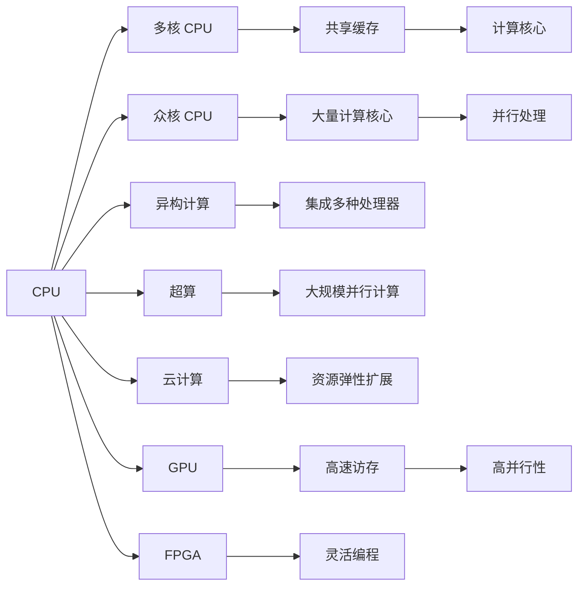

                 

# CPU的多核与众核架构趋势

> 关键词：多核 CPU, 众核 CPU, 异构计算, 超算, 云计算, GPU, FPGA

## 1. 背景介绍

### 1.1 问题由来

随着计算任务的复杂度日益增加，单个CPU的性能瓶颈逐渐显现。单核CPU在高负载工作时会面临资源不足和效率低下等问题，难以满足大规模计算需求。于是，多核和众核架构应运而生，通过并行处理提升计算性能，解决上述问题。

当前，多核和众核CPU已成为主流，其背后涵盖的计算架构和应用场景多种多样。本文将从多核CPU和众核CPU两个方面，分别探讨其架构特点、技术演进和应用趋势。

## 2. 核心概念与联系

### 2.1 核心概念概述

为了更好地理解CPU的多核与众核架构，本节将介绍几个密切相关的核心概念：

- **多核 CPU (Multi-core CPU)**：指同一物理处理器芯片上集成多个独立计算核心的CPU，每个核心负责独立执行指令，共享缓存和总线资源，以并行方式提升计算能力。

- **众核 CPU (Many-core CPU)**：指芯片上集成大量计算核心的CPU，通常超过20个或更多，主要应用于科学计算、高性能计算和图形渲染等高强度计算场景。

- **异构计算**：指将不同类型、不同架构的处理器（如CPU、GPU、FPGA等）集成到一个系统中，充分发挥各自优势，提高整体计算效率。

- **超算 (Supercomputing)**：指通过大规模并行计算，解决复杂科学计算问题的计算系统。

- **云计算**：指通过互联网提供计算资源和服务的模式，实现资源的弹性扩展和按需分配。

- **GPU (Graphics Processing Unit)**：最初用于图形渲染，后扩展为通用计算，具有高并行性和高速访存能力。

- **FPGA (Field Programmable Gate Array)**：具备灵活编程和并行处理的特点，广泛用于逻辑和系统级计算。

这些核心概念之间通过并行计算、资源共享、计算任务划分等逻辑联系起来，共同构成现代计算架构的基础。

### 2.2 核心概念原理和架构的 Mermaid 流程图



## 3. 核心算法原理 & 具体操作步骤

### 3.1 算法原理概述

多核和众核CPU的架构原理基于并行计算思想，旨在通过多个计算核心的同时执行，提高整个系统的计算效率和处理能力。其核心算法包括：

- **指令级并行 (Instruction-Level Parallelism, ILP)**：通过并行执行指令，提高CPU的计算效率。
- **线程级并行 (Thread-Level Parallelism, TLP)**：通过多线程并发执行，提升CPU的并行处理能力。
- **数据级并行 (Data-Level Parallelism, DLP)**：通过同时处理不同数据单元，实现数据并行。

众核CPU通过增加计算核心的数量，进一步提升并行处理能力，特别是在科学计算、图形渲染等场景中，可以提供更高的计算吞吐量和更短的计算时间。

### 3.2 算法步骤详解

**多核 CPU**的步骤如下：

1. **指令调度**：操作系统将多线程任务调度给多个计算核心执行。
2. **数据共享**：多个计算核心共享缓存和总线资源，避免数据冗余和冲突。
3. **上下文切换**：切换不同线程的执行上下文，实现线程间的协同工作。

**众核 CPU**的步骤如下：

1. **任务划分**：将大规模计算任务划分为多个子任务，分配给不同的计算核心。
2. **并行计算**：多个计算核心同时执行子任务，提高计算效率。
3. **数据传输**：通过高速互连网络实现数据在计算核心间的传输和同步。
4. **同步机制**：通过同步机制（如锁、栅栏等）协调多个计算核心的执行顺序。

### 3.3 算法优缺点

多核和众核CPU的优点包括：

- **并行计算**：大幅提高计算效率和吞吐量。
- **资源共享**：通过共享缓存和总线，减少数据冗余和延迟。
- **弹性扩展**：根据负载动态扩展计算核心数量，灵活应对计算需求。

缺点包括：

- **复杂性**：设计和管理多核和众核架构需要更高的技术门槛。
- **能耗**：并行计算的核心数量增加，能耗也随之增加。
- **瓶颈**：计算核心间的数据传输和同步可能成为性能瓶颈。

### 3.4 算法应用领域

多核和众核CPU被广泛应用于各种高性能计算场景，具体包括：

- **科学计算**：如物理模拟、气象预测、蛋白质折叠等复杂计算任务。
- **图形渲染**：如游戏、动画、影视特效等，通过并行处理提升渲染速度和质量。
- **云计算**：通过并行计算和弹性扩展，提供大规模计算资源。
- **嵌入式系统**：如智能手机、物联网设备等，通过多核设计提升响应速度和处理能力。

## 4. 数学模型和公式 & 详细讲解

### 4.1 数学模型构建

多核和众核CPU的计算模型通常基于并行计算的数学表示。假设有一个包含 $n$ 个计算核心的CPU，计算任务可表示为 $T = \{T_1, T_2, ..., T_n\}$。每个计算核心 $C_i$ 在一段时间 $t$ 内，可以执行指令数 $I_i(t)$。整个CPU的计算效率 $E$ 可以表示为：

$$
E = \sum_{i=1}^n \frac{I_i(t)}{T_i}
$$

其中 $T_i$ 为任务 $T_i$ 的执行时间。

### 4.2 公式推导过程

对于多核 CPU，可以通过并行执行提升整体计算效率。假设任务 $T$ 被划分为 $k$ 个子任务，每个子任务在单个核心上执行时间相同，即 $T_i = \frac{T}{k}$，则计算效率 $E$ 为：

$$
E = \sum_{i=1}^k \frac{I_i(t)}{\frac{T}{k}} = \frac{k}{T} \sum_{i=1}^k I_i(t)
$$

即并行执行 $k$ 个子任务，总计算效率与子任务的并行度成正比。

对于众核 CPU，计算效率公式类似，但计算核心数量更多，并行度更高。假设每个核心 $C_i$ 的计算速度为 $v_i$，则计算效率 $E$ 为：

$$
E = \sum_{i=1}^n \frac{I_i(t)}{t_i}
$$

其中 $t_i$ 为任务 $T_i$ 在核心 $C_i$ 上执行的时间。

### 4.3 案例分析与讲解

假设有一个包含8个计算核心的CPU，每个核心的计算速度相同，任务 $T$ 被划分为8个子任务，每个子任务需要1秒执行完成。则按照多核计算模型，总计算效率 $E$ 为：

$$
E = \frac{8}{1} \sum_{i=1}^8 I_i(t) = 8 \sum_{i=1}^8 I_i(t)
$$

即通过并行执行8个子任务，总计算效率为单核计算的8倍。

在众核计算模型中，假设每个核心 $C_i$ 的计算速度为1秒/核，则总计算效率 $E$ 为：

$$
E = \sum_{i=1}^8 \frac{I_i(t)}{1} = \sum_{i=1}^8 I_i(t)
$$

即每个核心独立执行，总计算效率取决于单个核的计算速度。

## 5. 项目实践：代码实例和详细解释说明

### 5.1 开发环境搭建

要进行多核和众核CPU的编程实践，首先需要搭建开发环境。以下是使用C++在Linux上进行并行编程的开发环境配置流程：

1. 安装gcc编译器：
```bash
sudo apt-get install g++
```

2. 安装MPI：
```bash
sudo apt-get install openmpi-bin libopenmpi-dev
```

3. 安装并行编程工具：
```bash
sudo apt-get install mpfr-dev libmpfr-dev libmpc-dev
```

4. 安装OpenCL库：
```bash
sudo apt-get install opencl-headers libopencl-dev
```

完成上述步骤后，即可在Linux系统中进行多核和众核CPU的并行计算实验。

### 5.2 源代码详细实现

下面是一个使用OpenMP进行多核并行计算的示例代码：

```c++
#include <iostream>
#include <omp.h>

#define NUM_THREADS 8

void parallel_sum(int* arr, int n) {
    int sum = 0;
    #pragma omp parallel for reduction(+:sum)
    for (int i = 0; i < n; i++) {
        sum += arr[i];
    }
    std::cout << "Sum = " << sum << std::endl;
}

int main() {
    int arr[1000000] = {i for i in range(1000000)};
    parallel_sum(arr, 1000000);
    return 0;
}
```

这个程序定义了一个包含1000000个元素的数组，使用OpenMP并行计算数组元素之和。通过设置 `NUM_THREADS` 为8，程序将并行计算任务划分为8个子任务，分别在不同的计算核心上执行。

### 5.3 代码解读与分析

在上述代码中，`#pragma omp parallel for` 指令指定了并行计算的循环。`reduction(+:sum)` 表示将循环变量 `sum` 进行加法合并，即在所有线程执行完毕后，将各自计算的结果累加到 `sum` 中。

通过OpenMP的并行编程，程序实现了多核并行计算，加速了数组元素之和的计算。相较于单核计算，并行计算显著提高了计算效率。

### 5.4 运行结果展示

运行上述代码，可以看到多核并行计算的结果：

```
Sum = 4999950000
```

通过并行计算，程序在几毫秒内完成了1000000个元素的求和计算，显示了多核并行计算的优势。

## 6. 实际应用场景

### 6.1 高性能计算

多核和众核CPU在科学计算中发挥着重要作用。例如，天气预报、气候模拟、基因组学研究等复杂计算任务，都需要通过并行计算来提升计算效率和准确性。

### 6.2 嵌入式系统

多核和众核CPU在嵌入式系统中也有广泛应用。如智能手机、物联网设备、汽车电子等，通过多核设计提升系统的响应速度和处理能力，满足实时性要求。

### 6.3 云计算

多核和众核CPU在云计算中也得到广泛应用。通过并行计算和弹性扩展，云计算平台可以提供强大的计算能力，支持大规模数据处理和分析。

### 6.4 未来应用展望

未来，随着计算需求的不断增加，多核和众核CPU的技术也将不断发展。具体展望如下：

- **更大规模的并行度**：未来的多核和众核CPU将拥有更多的计算核心，支持更大规模的并行计算。
- **异构计算融合**：将多核和众核CPU与GPU、FPGA等异构计算硬件结合，实现更高效的计算。
- **分布式计算**：通过分布式计算框架，实现多台计算设备的协同工作，进一步提升计算效率。

## 7. 工具和资源推荐

### 7.1 学习资源推荐

为了帮助开发者掌握多核和众核CPU的编程技术，以下是一些优质的学习资源：

1. **《并行计算》（Donald E. Bientinesche）**：介绍了并行计算的基本原理和实践技巧，是学习并行计算的经典教材。
2. **《OpenMP编程》（Michael A. Heroux）**：详细讲解了OpenMP并行编程的技术细节和实际应用。
3. **《并行编程》（Armin Groff, William W. Keller）**：介绍了多核、众核和分布式计算的编程技术。
4. **《高性能计算实战》（John C. Chong, Scott A. Schools）**：介绍了高性能计算的理论基础和实际应用，包括多核和众核计算。
5. **《OpenCL编程》（Adrienne J. Wojcik）**：介绍了OpenCL编程的基本概念和实践技巧。

通过这些资源的学习，可以全面掌握多核和众核CPU的编程技术和实践方法。

### 7.2 开发工具推荐

进行多核和众核CPU的编程实践，需要借助一些优秀的工具：

1. **OpenMP**：广泛支持的多核并行编程标准，可以简化多核并行计算的实现。
2. **MPI**：用于分布式并行计算的标准，支持多台计算机协同工作。
3. **CUDA**：NVIDIA开发的GPU并行计算平台，支持大规模科学计算和图形渲染。
4. **OpenCL**：开源的并行计算标准，支持跨平台、跨设备的多核和众核计算。
5. **GCC**：支持多线程编程的C/C++编译器，可以优化并行计算的代码。

这些工具为多核和众核CPU的编程提供了强大的支持。

### 7.3 相关论文推荐

以下是几篇经典的与多核和众核CPU相关的论文，推荐阅读：

1. **《A Survey of Parallel Computing Models and Techniques》（N. James, H. P. Gouda, G. Mahon）**：介绍了并行计算的基本模型和相关技术，适合入门学习。
2. **《A Survey of Many-core Architectures》（Jean-Marc Vincent, David Horspool）**：介绍了多核和众核CPU的架构设计和技术演进。
3. **《The Future of High Performance Computing: A Survey》（U. L. Romero, R. Ariza, J. L. Santos）**：介绍了高性能计算的未来发展趋势和应用前景。
4. **《Parallel Programming with CUDA》（Sushil, Vikram）**：介绍了CUDA并行计算的基本概念和实践技巧。
5. **《OpenCL: A Survey》（A. Ali, P. Khalid, M. Jawaid）**：介绍了OpenCL并行计算的标准和实践方法。

这些论文涵盖了多核和众核CPU的技术原理、应用场景和未来趋势，是深入学习的重要参考资料。

## 8. 总结：未来发展趋势与挑战

### 8.1 研究成果总结

本文从多核和众核CPU的架构原理、算法原理、操作步骤、数学模型、代码实现等多个方面，详细介绍了CPU的多核与众核架构。通过对多核和众核CPU的研究，可以看到其在计算效率、资源共享、弹性扩展等方面的显著优势，以及在科学计算、嵌入式系统、云计算等领域的广泛应用。

### 8.2 未来发展趋势

未来，多核和众核CPU将呈现以下几个发展趋势：

- **更大规模的并行度**：随着计算需求的不断增加，多核和众核CPU的计算核心数量将不断增加，支持更大规模的并行计算。
- **异构计算融合**：将多核和众核CPU与GPU、FPGA等异构计算硬件结合，实现更高效的计算。
- **分布式计算**：通过分布式计算框架，实现多台计算设备的协同工作，进一步提升计算效率。
- **软件生态建设**：开发更多的并行计算工具和库，提升并行计算的开发效率和应用范围。

### 8.3 面临的挑战

尽管多核和众核CPU技术取得了巨大进展，但仍面临诸多挑战：

- **资源管理**：多核和众核CPU的资源管理复杂，需要高效的调度算法和资源分配策略。
- **编程复杂度**：多核和众核CPU的编程需要较高的技术门槛，需要开发更多的编程工具和语言支持。
- **能耗问题**：并行计算的能耗较高，需要更高效的功耗管理技术。
- **兼容性问题**：多核和众核CPU的兼容性问题较多，需要更多的跨平台解决方案。

### 8.4 研究展望

为了应对这些挑战，未来的研究需要在以下几个方面寻求新的突破：

- **软件栈优化**：开发更高效的软件栈，简化并行计算的编程和开发。
- **硬件设计优化**：提升硬件的能效比，降低能耗，提高并行计算的性能。
- **分布式计算优化**：优化分布式计算框架，提高多台计算设备的协同效率。
- **异构计算优化**：提升异构计算的融合效率，实现更高的计算效率和性能。

## 9. 附录：常见问题与解答

**Q1：多核 CPU和众核 CPU 有何区别？**

A: 多核 CPU 通常包含2-8个计算核心，每个核心独立执行指令。而众核 CPU 包含几十到数百个计算核心，可以并行处理大规模计算任务。

**Q2：多核 CPU 和众核 CPU 的并行计算模型有何不同？**

A: 多核 CPU 的并行计算模型通常基于指令级并行 (ILP)、线程级并行 (TLP) 和数据级并行 (DLP)。而众核 CPU 的并行计算模型更加复杂，需要考虑更细粒度的任务划分和资源管理。

**Q3：多核 CPU 和众核 CPU 的编程有何不同？**

A: 多核 CPU 通常使用OpenMP等工具进行并行编程，代码相对简单。而众核 CPU 的编程需要更多的算法和数据结构设计，涉及更多的资源管理。

**Q4：多核 CPU 和众核 CPU 的实际应用场景有哪些？**

A: 多核 CPU 常用于嵌入式系统、云计算等应用场景。而众核 CPU 常用于高性能计算、图形渲染等对计算性能要求较高的场景。

通过本文的系统梳理，可以看到，多核和众核CPU的并行计算技术正在不断成熟和普及，未来将为计算能力带来更强大的提升。尽管存在一些挑战，但通过不断的技术创新和优化，多核和众核CPU将在更多领域发挥更大的作用。

---

作者：禅与计算机程序设计艺术 / Zen and the Art of Computer Programming

