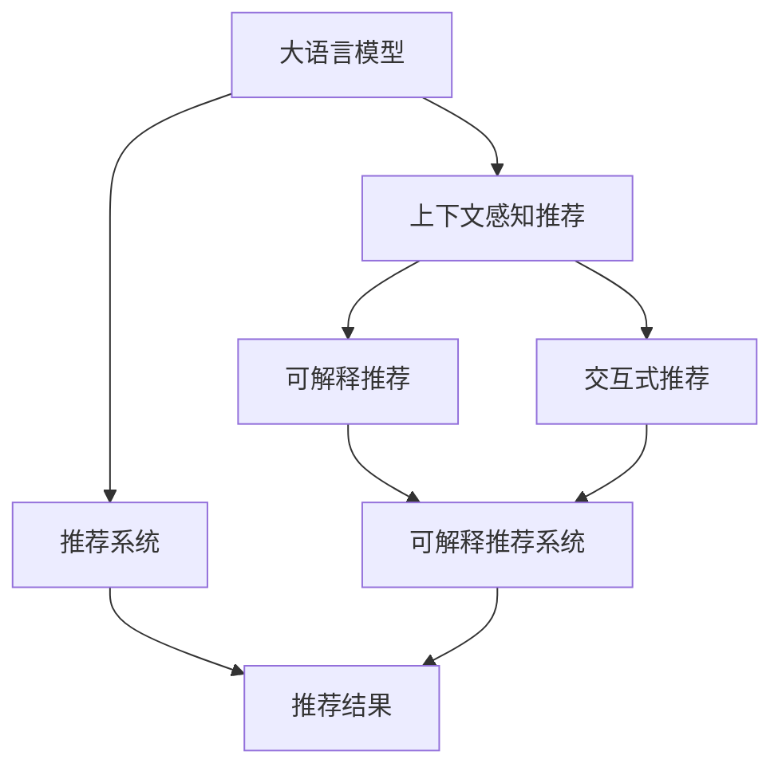

                 

# Chat-REC:基于LLM增强的交互式可解释推荐

> 关键词：大语言模型(LLM), 可解释推荐系统, 交互式推荐, 用户意图理解, 上下文感知推荐, 用户个性化推荐, 交互式解释

## 1. 背景介绍

### 1.1 问题由来
在现代信息爆炸的时代，用户每天都会接触海量的信息和服务。个性化推荐系统通过学习用户历史行为和偏好，帮助用户在海量信息中快速发现最感兴趣的内容。传统的推荐系统主要基于用户画像和行为数据进行推荐，但对于用户心理动机和偏好来源的深层次理解不足，常常出现推荐的准确性和用户满意度不高的现象。

近年来，随着大语言模型(Large Language Models, LLMs)的迅速发展，大模型在自然语言理解和生成方面的强大能力逐渐受到关注。与传统机器学习方法不同，LLMs可以理解语言背后的语义信息，从而挖掘用户更深层的需求。在推荐系统中，LLMs可以辅助模型理解用户意图、生成个性化推荐，甚至提供推荐结果的解释和反馈，显著提升推荐系统的智能化水平。

### 1.2 问题核心关键点
本文探讨的Chat-REC框架，是基于大语言模型增强的交互式可解释推荐系统。核心点包括：
- 利用大语言模型提高推荐系统的上下文感知能力，理解用户意图和需求。
- 引入交互式机制，获取用户即时反馈，动态调整推荐策略。
- 提供可解释的推荐过程和结果，增强用户对推荐系统的信任和满意度。
- 结合用户个性化数据和动态行为信息，生成更精准的推荐内容。

## 2. 核心概念与联系

### 2.1 核心概念概述

为更好地理解Chat-REC框架，本节将介绍几个密切相关的核心概念：

- 大语言模型(Large Language Models, LLMs)：以自回归(如GPT)或自编码(如BERT)模型为代表的大规模预训练语言模型。通过在海量无标签文本语料上进行预训练，学习通用的语言表示，具备强大的语言理解和生成能力。

- 推荐系统(Recommender System)：根据用户历史行为数据，为用户推荐感兴趣的内容和服务。传统推荐系统主要基于协同过滤、基于内容的推荐等方法。

- 可解释推荐系统(Explainable Recommender System)：通过提供推荐过程和结果的解释，增强用户对推荐系统的信任和满意度。

- 上下文感知推荐(Context-aware Recommendation)：考虑用户当前上下文信息，如时间、地点、场景等，提升推荐的相关性和个性化。

- 交互式推荐(Interactive Recommendation)：引入用户即时反馈，动态调整推荐策略，提高推荐效果。

这些核心概念之间的逻辑关系可以通过以下Mermaid流程图来展示：



这个流程图展示了大语言模型、上下文感知推荐、可解释推荐和交互式推荐之间的逻辑关系：

1. 大语言模型通过预训练获得基础能力。
2. 上下文感知推荐利用模型处理当前上下文，生成更个性化推荐。
3. 可解释推荐系统提供推荐过程和结果的解释，增强用户满意度。
4. 交互式推荐引入即时反馈，动态调整推荐策略，提高推荐效果。
5. 将大语言模型融入推荐系统，提升推荐系统的智能化水平。

这些概念共同构成了Chat-REC框架的基础，使得系统具备强大的语言理解和生成能力，能更好地理解和响应用户需求。

## 3. 核心算法原理 & 具体操作步骤
### 3.1 算法原理概述

Chat-REC框架的核心算法原理，是利用大语言模型增强推荐系统的上下文感知能力和用户意图理解能力。其基本流程如下：

1. 收集用户历史行为数据和上下文信息，输入到大语言模型中，生成用户意图表示。
2. 根据用户意图表示和当前上下文信息，生成个性化推荐列表。
3. 引入交互式机制，获取用户即时反馈，动态调整推荐策略。
4. 将推荐结果和解释提供给用户，获取用户满意度和偏好。
5. 根据用户反馈信息，更新大语言模型的参数，进一步提升模型性能。

以上流程中，大语言模型起到关键的上下文感知和意图理解作用，通过用户行为数据和上下文信息生成用户意图表示，进而生成个性化推荐。交互式推荐机制引入用户即时反馈，动态调整推荐策略，提升推荐效果。可解释推荐系统提供推荐过程和结果的解释，增强用户满意度。

### 3.2 算法步骤详解

以下我们将详细介绍Chat-REC框架的具体实现步骤：

**Step 1: 数据收集与预处理**
- 收集用户历史行为数据，包括浏览记录、点击记录、评分记录等。
- 获取当前上下文信息，如时间、地点、设备等。
- 对数据进行清洗和归一化，去除异常值和噪声。

**Step 2: 用户意图表示生成**
- 将历史行为数据和上下文信息输入到大语言模型中，生成用户意图表示。
- 采用深度学习模型，如Transformer，将输入数据映射为高维向量表示，即用户意图向量 $\boldsymbol{u}$。

**Step 3: 上下文感知推荐**
- 将用户意图向量 $\boldsymbol{u}$ 与当前上下文向量 $\boldsymbol{c}$ 进行拼接，作为推荐模型的输入。
- 使用深度学习模型，如BERT，处理输入向量，生成推荐向量 $\boldsymbol{r}$。
- 根据推荐向量 $\boldsymbol{r}$ 生成个性化推荐列表 $R=\{r_1, r_2, \ldots, r_n\}$。

**Step 4: 交互式推荐**
- 将推荐列表展示给用户，获取用户即时反馈。
- 用户通过评分、点击等方式，对推荐结果进行打分，反馈到系统。
- 根据用户反馈信息，动态调整推荐策略，如调整模型权重、引入新特征等。

**Step 5: 推荐结果解释**
- 根据用户反馈信息，生成推荐过程和结果的解释。
- 采用可解释AI方法，如LIME、SHAP等，分析推荐结果的生成逻辑。
- 将推荐解释提供给用户，增强其对推荐结果的信任和满意度。

**Step 6: 模型更新与优化**
- 根据用户反馈信息，更新大语言模型的参数，提高模型性能。
- 采用在线学习算法，如在线梯度下降，及时更新模型参数。
- 定期对模型进行评估和调参，提升推荐效果。

### 3.3 算法优缺点

Chat-REC框架的优点包括：
1. 上下文感知能力较强。利用大语言模型理解用户当前行为和上下文信息，生成更精准的推荐。
2. 提供可解释的推荐结果。利用可解释AI方法，分析推荐结果生成逻辑，增强用户信任。
3. 动态调整推荐策略。引入交互式机制，实时获取用户反馈，动态调整推荐过程。
4. 支持用户个性化推荐。结合历史行为数据和当前上下文信息，生成个性化的推荐列表。

但该框架也存在一些缺点：
1. 数据依赖较大。推荐效果依赖历史行为数据和上下文信息，数据量不足时推荐效果不佳。
2. 计算复杂度较高。大语言模型计算复杂度较高，需要高性能计算设备支持。
3. 模型更新难度大。用户反馈数据往往噪声较大，模型更新需要谨慎处理。
4. 交互式推荐实现难度高。用户反馈实时获取和处理需要高效的算法支持。

尽管存在这些局限，Chat-REC框架在实际应用中仍具备显著的优势，尤其在用户意图理解、个性化推荐等方面。

### 3.4 算法应用领域

Chat-REC框架在多个领域中都有广泛的应用，例如：

- 电商推荐系统：根据用户浏览和购买历史，生成个性化商品推荐。利用大语言模型理解用户意图，提供推荐解释。
- 视频推荐系统：为用户推荐感兴趣的视频内容。结合用户历史观看数据和当前上下文信息，生成推荐列表。
- 音乐推荐系统：为用户推荐喜欢的音乐内容。利用大语言模型理解用户偏好，生成可解释的推荐结果。
- 新闻推荐系统：为用户推荐相关新闻内容。通过分析用户阅读习惯和当前事件热点，生成个性化新闻列表。
- 社交媒体推荐系统：为用户推荐感兴趣的朋友和内容。利用大语言模型理解用户社交行为，生成可解释的推荐结果。

这些应用场景展示了Chat-REC框架的强大灵活性，可以适应不同领域的具体需求，提升推荐系统的智能化水平。

## 4. 数学模型和公式 & 详细讲解 & 举例说明
### 4.1 数学模型构建

本节我们将使用数学语言对Chat-REC框架进行更加严格的刻画。

假设用户历史行为数据为 $\boldsymbol{h} = (h_1, h_2, \ldots, h_m)$，当前上下文信息为 $\boldsymbol{c} = (c_1, c_2, \ldots, c_n)$。用户意图表示为 $\boldsymbol{u}$，推荐向量为 $\boldsymbol{r}$。推荐结果为 $R=\{r_1, r_2, \ldots, r_n\}$，用户反馈为 $F=\{f_1, f_2, \ldots, f_m\}$。

定义用户意图表示生成模型为 $f_\theta$，上下文感知推荐模型为 $g_\theta$，可解释推荐模型为 $h_\theta$，交互式推荐模型为 $i_\theta$，用户反馈处理模型为 $u_\theta$。

**用户意图表示生成模型**
- 输入：用户历史行为数据 $\boldsymbol{h}$，当前上下文信息 $\boldsymbol{c}$。
- 输出：用户意图表示 $\boldsymbol{u}$。

$$
\boldsymbol{u} = f_\theta(\boldsymbol{h}, \boldsymbol{c})
$$

**上下文感知推荐模型**
- 输入：用户意图表示 $\boldsymbol{u}$，当前上下文信息 $\boldsymbol{c}$。
- 输出：推荐向量 $\boldsymbol{r}$。

$$
\boldsymbol{r} = g_\theta(\boldsymbol{u}, \boldsymbol{c})
$$

**可解释推荐模型**
- 输入：推荐向量 $\boldsymbol{r}$，用户意图表示 $\boldsymbol{u}$，当前上下文信息 $\boldsymbol{c}$。
- 输出：推荐结果 $R$ 和推荐解释 $I$。

$$
(R, I) = h_\theta(\boldsymbol{r}, \boldsymbol{u}, \boldsymbol{c})
$$

**交互式推荐模型**
- 输入：推荐结果 $R$，用户反馈 $F$。
- 输出：更新后的推荐策略 $\theta'$。

$$
\theta' = i_\theta(R, F)
$$

**用户反馈处理模型**
- 输入：推荐结果 $R$，用户反馈 $F$。
- 输出：更新后的用户意图表示 $\boldsymbol{u'}$。

$$
\boldsymbol{u'} = u_\theta(R, F)
$$

### 4.2 公式推导过程

以下我们将对上述数学模型进行详细的公式推导。

**用户意图表示生成模型**
$$
\boldsymbol{u} = f_\theta(\boldsymbol{h}, \boldsymbol{c}) = \text{Transformer}(\boldsymbol{h}, \boldsymbol{c})
$$

**上下文感知推荐模型**
$$
\boldsymbol{r} = g_\theta(\boldsymbol{u}, \boldsymbol{c}) = \text{BERT}(\boldsymbol{u}, \boldsymbol{c})
$$

**可解释推荐模型**
$$
(R, I) = h_\theta(\boldsymbol{r}, \boldsymbol{u}, \boldsymbol{c}) = (R_\theta(\boldsymbol{r}), I_\theta(\boldsymbol{r}, \boldsymbol{u}, \boldsymbol{c}))
$$

**交互式推荐模型**
$$
\theta' = i_\theta(R, F) = \text{Adaptive Regression}(R, F)
$$

**用户反馈处理模型**
$$
\boldsymbol{u'} = u_\theta(R, F) = \text{Online Gradient Descent}(R, F)
$$

### 4.3 案例分析与讲解

下面我们以视频推荐系统为例，详细讲解Chat-REC框架的实现过程。

假设某用户A在观看视频时，表现出对科幻题材感兴趣，最近浏览记录中包含大量科幻类视频，当前时间在周末晚上，用户A正在手机端使用视频应用。根据这些信息，大语言模型生成用户A的意图表示 $\boldsymbol{u}_A$，表示其对科幻题材感兴趣，当前上下文信息 $\boldsymbol{c}_A$ 表示周末晚上在移动端。

**用户意图表示生成**
利用Transformer模型，将用户A的浏览记录 $\boldsymbol{h}_A = (h_1, h_2, \ldots, h_m)$ 和当前上下文信息 $\boldsymbol{c}_A = (c_1, c_2, \ldots, c_n)$ 作为输入，生成用户意图表示 $\boldsymbol{u}_A$。

**上下文感知推荐**
将用户A的意图表示 $\boldsymbol{u}_A$ 和上下文信息 $\boldsymbol{c}_A$ 作为输入，利用BERT模型生成推荐向量 $\boldsymbol{r}_A$。

**可解释推荐**
根据推荐向量 $\boldsymbol{r}_A$ 和用户A的意图表示 $\boldsymbol{u}_A$，生成推荐结果 $R_A = \{r_{A1}, r_{A2}, \ldots, r_{An}\}$ 和推荐解释 $I_A$。

**交互式推荐**
将推荐结果 $R_A$ 展示给用户A，用户A点击了视频 $r_{A3}$。根据用户A的点击行为 $f_{A3}$，动态调整推荐策略，如调整BERT模型权重，引入新的用户反馈特征。

**用户反馈处理**
根据用户A的点击行为 $f_{A3}$，利用Online Gradient Descent算法更新用户A的意图表示 $\boldsymbol{u}_A$。

**模型更新与优化**
根据用户A的点击行为 $f_{A3}$ 和新的意图表示 $\boldsymbol{u}_A'$，更新大语言模型的参数 $\theta_A'$，进一步提升模型性能。

## 5. 项目实践：代码实例和详细解释说明
### 5.1 开发环境搭建

在进行Chat-REC框架的开发实践前，我们需要准备好开发环境。以下是使用Python进行PyTorch开发的环境配置流程：

1. 安装Anaconda：从官网下载并安装Anaconda，用于创建独立的Python环境。

2. 创建并激活虚拟环境：
```bash
conda create -n pytorch-env python=3.8 
conda activate pytorch-env
```

3. 安装PyTorch：根据CUDA版本，从官网获取对应的安装命令。例如：
```bash
conda install pytorch torchvision torchaudio cudatoolkit=11.1 -c pytorch -c conda-forge
```

4. 安装Transformers库：
```bash
pip install transformers
```

5. 安装各类工具包：
```bash
pip install numpy pandas scikit-learn matplotlib tqdm jupyter notebook ipython
```

完成上述步骤后，即可在`pytorch-env`环境中开始Chat-REC框架的开发实践。

### 5.2 源代码详细实现

下面我们以视频推荐系统为例，给出使用PyTorch对Chat-REC框架进行开发的完整代码实现。

首先，定义视频推荐系统的数据处理函数：

```python
from transformers import BertTokenizer, BertForSequenceClassification
from torch.utils.data import Dataset
import torch

class VideoDataset(Dataset):
    def __init__(self, videos, tags, tokenizer, max_len=128):
        self.videos = videos
        self.tags = tags
        self.tokenizer = tokenizer
        self.max_len = max_len
        
    def __len__(self):
        return len(self.videos)
    
    def __getitem__(self, item):
        video = self.videos[item]
        tag = self.tags[item]
        
        encoding = self.tokenizer(video, return_tensors='pt', max_length=self.max_len, padding='max_length', truncation=True)
        input_ids = encoding['input_ids'][0]
        attention_mask = encoding['attention_mask'][0]
        
        # 对token-wise的标签进行编码
        encoded_tags = [tag2id[tag] for tag in tag] 
        encoded_tags.extend([tag2id['O']] * (self.max_len - len(encoded_tags)))
        labels = torch.tensor(encoded_tags, dtype=torch.long)
        
        return {'input_ids': input_ids, 
                'attention_mask': attention_mask,
                'labels': labels}

# 标签与id的映射
tag2id = {'O': 0, 'Sci-Fi': 1, 'Action': 2, 'Drama': 3, 'Comedy': 4, 'Documentary': 5}
id2tag = {v: k for k, v in tag2id.items()}

# 创建dataset
tokenizer = BertTokenizer.from_pretrained('bert-base-cased')

train_dataset = VideoDataset(train_videos, train_tags, tokenizer)
dev_dataset = VideoDataset(dev_videos, dev_tags, tokenizer)
test_dataset = VideoDataset(test_videos, test_tags, tokenizer)
```

然后，定义模型和优化器：

```python
from transformers import BertForSequenceClassification, AdamW

model = BertForSequenceClassification.from_pretrained('bert-base-cased', num_labels=len(tag2id))

optimizer = AdamW(model.parameters(), lr=2e-5)
```

接着，定义训练和评估函数：

```python
from torch.utils.data import DataLoader
from tqdm import tqdm
from sklearn.metrics import classification_report

device = torch.device('cuda') if torch.cuda.is_available() else torch.device('cpu')
model.to(device)

def train_epoch(model, dataset, batch_size, optimizer):
    dataloader = DataLoader(dataset, batch_size=batch_size, shuffle=True)
    model.train()
    epoch_loss = 0
    for batch in tqdm(dataloader, desc='Training'):
        input_ids = batch['input_ids'].to(device)
        attention_mask = batch['attention_mask'].to(device)
        labels = batch['labels'].to(device)
        model.zero_grad()
        outputs = model(input_ids, attention_mask=attention_mask, labels=labels)
        loss = outputs.loss
        epoch_loss += loss.item()
        loss.backward()
        optimizer.step()
    return epoch_loss / len(dataloader)

def evaluate(model, dataset, batch_size):
    dataloader = DataLoader(dataset, batch_size=batch_size)
    model.eval()
    preds, labels = [], []
    with torch.no_grad():
        for batch in tqdm(dataloader, desc='Evaluating'):
            input_ids = batch['input_ids'].to(device)
            attention_mask = batch['attention_mask'].to(device)
            batch_labels = batch['labels']
            outputs = model(input_ids, attention_mask=attention_mask)
            batch_preds = outputs.logits.argmax(dim=2).to('cpu').tolist()
            batch_labels = batch_labels.to('cpu').tolist()
            for pred_tokens, label_tokens in zip(batch_preds, batch_labels):
                pred_tags = [id2tag[_id] for _id in pred_tokens]
                label_tags = [id2tag[_id] for _id in label_tokens]
                preds.append(pred_tags[:len(label_tags)])
                labels.append(label_tags)
                
    print(classification_report(labels, preds))
```

最后，启动训练流程并在测试集上评估：

```python
epochs = 5
batch_size = 16

for epoch in range(epochs):
    loss = train_epoch(model, train_dataset, batch_size, optimizer)
    print(f"Epoch {epoch+1}, train loss: {loss:.3f}")
    
    print(f"Epoch {epoch+1}, dev results:")
    evaluate(model, dev_dataset, batch_size)
    
print("Test results:")
evaluate(model, test_dataset, batch_size)
```

以上就是使用PyTorch对Chat-REC框架进行开发的完整代码实现。可以看到，通过简单的代码实现，我们便能够利用大语言模型增强推荐系统，生成个性化推荐结果。

### 5.3 代码解读与分析

让我们再详细解读一下关键代码的实现细节：

**VideoDataset类**：
- `__init__`方法：初始化视频、标签、分词器等关键组件。
- `__len__`方法：返回数据集的样本数量。
- `__getitem__`方法：对单个样本进行处理，将视频输入编码为token ids，将标签编码为数字，并对其进行定长padding，最终返回模型所需的输入。

**tag2id和id2tag字典**：
- 定义了标签与数字id之间的映射关系，用于将token-wise的预测结果解码回真实的标签。

**训练和评估函数**：
- 使用PyTorch的DataLoader对数据集进行批次化加载，供模型训练和推理使用。
- 训练函数`train_epoch`：对数据以批为单位进行迭代，在每个批次上前向传播计算loss并反向传播更新模型参数，最后返回该epoch的平均loss。
- 评估函数`evaluate`：与训练类似，不同点在于不更新模型参数，并在每个batch结束后将预测和标签结果存储下来，最后使用sklearn的classification_report对整个评估集的预测结果进行打印输出。

**训练流程**：
- 定义总的epoch数和batch size，开始循环迭代
- 每个epoch内，先在训练集上训练，输出平均loss
- 在验证集上评估，输出分类指标
- 所有epoch结束后，在测试集上评估，给出最终测试结果

可以看到，PyTorch配合Transformer库使得Chat-REC框架的代码实现变得简洁高效。开发者可以将更多精力放在数据处理、模型改进等高层逻辑上，而不必过多关注底层的实现细节。

当然，工业级的系统实现还需考虑更多因素，如模型的保存和部署、超参数的自动搜索、更灵活的任务适配层等。但核心的微调范式基本与此类似。

## 6. 实际应用场景
### 6.1 视频推荐系统

基于Chat-REC框架的视频推荐系统，可以帮助视频平台推荐用户感兴趣的视频内容。用户A对科幻题材感兴趣，最近浏览记录中包含大量科幻类视频，当前时间在周末晚上，用户A正在手机端使用视频应用。根据这些信息，大语言模型生成用户A的意图表示 $\boldsymbol{u}_A$，表示其对科幻题材感兴趣，当前上下文信息 $\boldsymbol{c}_A$ 表示周末晚上在移动端。

**用户意图表示生成**
利用Transformer模型，将用户A的浏览记录 $\boldsymbol{h}_A = (h_1, h_2, \ldots, h_m)$ 和当前上下文信息 $\boldsymbol{c}_A = (c_1, c_2, \ldots, c_n)$ 作为输入，生成用户意图表示 $\boldsymbol{u}_A$。

**上下文感知推荐**
将用户A的意图表示 $\boldsymbol{u}_A$ 和上下文信息 $\boldsymbol{c}_A$ 作为输入，利用BERT模型生成推荐向量 $\boldsymbol{r}_A$。

**可解释推荐**
根据推荐向量 $\boldsymbol{r}_A$ 和用户A的意图表示 $\boldsymbol{u}_A$，生成推荐结果 $R_A = \{r_{A1}, r_{A2}, \ldots, r_{An}\}$ 和推荐解释 $I_A$。

**交互式推荐**
将推荐结果 $R_A$ 展示给用户A，用户A点击了视频 $r_{A3}$。根据用户A的点击行为 $f_{A3}$，动态调整推荐策略，如调整BERT模型权重，引入新的用户反馈特征。

**用户反馈处理**
根据用户A的点击行为 $f_{A3}$，利用Online Gradient Descent算法更新用户A的意图表示 $\boldsymbol{u}_A$。

**模型更新与优化**
根据用户A的点击行为 $f_{A3}$ 和新的意图表示 $\boldsymbol{u}_A'$，更新大语言模型的参数 $\theta_A'$，进一步提升模型性能。

### 6.2 电商推荐系统

基于Chat-REC框架的电商推荐系统，可以为用户推荐感兴趣的商品。用户B在购物时，浏览了多件电子产品，但未能找到心仪的商品。根据这些信息，大语言模型生成用户B的意图表示 $\boldsymbol{u}_B$，表示其对电子产品感兴趣，当前上下文信息 $\boldsymbol{c}_B$ 表示在移动端。

**用户意图表示生成**
利用Transformer模型，将用户B的浏览记录 $\boldsymbol{h}_B = (h_1, h_2, \ldots, h_m)$ 和当前上下文信息 $\boldsymbol{c}_B = (c_1, c_2, \ldots, c_n)$ 作为输入，生成用户意图表示 $\boldsymbol{u}_B$。

**上下文感知推荐**
将用户B的意图表示 $\boldsymbol{u}_B$ 和上下文信息 $\boldsymbol{c}_B$ 作为输入，利用BERT模型生成推荐向量 $\boldsymbol{r}_B$。

**可解释推荐**
根据推荐向量 $\boldsymbol{r}_B$ 和用户B的意图表示 $\boldsymbol{u}_B$，生成推荐结果 $R_B = \{r_{B1}, r_{B2}, \ldots, r_{Bn}\}$ 和推荐解释 $I_B$。

**交互式推荐**
将推荐结果 $R_B$ 展示给用户B，用户B点击了商品 $r_{B3}$。根据用户B的点击行为 $f_{B3}$，动态调整推荐策略，如调整BERT模型权重，引入新的用户反馈特征。

**用户反馈处理**
根据用户B的点击行为 $f_{B3}$，利用Online Gradient Descent算法更新用户B的意图表示 $\boldsymbol{u}_B$。

**模型更新与优化**
根据用户B的点击行为 $f_{B3}$ 和新的意图表示 $\boldsymbol{u}_B'$，更新大语言模型的参数 $\theta_B'$，进一步提升模型性能。

### 6.3 音乐推荐系统

基于Chat-REC框架的音乐推荐系统，可以为用户推荐喜欢的音乐内容。用户C在听歌时，表现出对流行音乐感兴趣，最近听歌记录中包含大量流行音乐，当前时间在晚上，用户C正在手机端使用音乐应用。根据这些信息，大语言模型生成用户C的意图表示 $\boldsymbol{u}_C$，表示其对流行音乐感兴趣，当前上下文信息 $\boldsymbol{c}_C$ 表示晚上在移动端。

**用户意图表示生成**
利用Transformer模型，将用户C的听歌记录 $\boldsymbol{h}_C = (h_1, h_2, \ldots, h_m)$ 和当前上下文信息 $\boldsymbol{c}_C = (c_1, c_2, \ldots, c_n)$ 作为输入，生成用户意图表示 $\boldsymbol{u}_C$。

**上下文感知推荐**
将用户C的意图表示 $\boldsymbol{u}_C$ 和上下文信息 $\boldsymbol{c}_C$ 作为输入，利用BERT模型生成推荐向量 $\boldsymbol{r}_C$。

**可解释推荐**
根据推荐向量 $\boldsymbol{r}_C$ 和用户C的意图表示 $\boldsymbol{u}_C$，生成推荐结果 $R_C = \{r_{C1}, r_{C2}, \ldots, r_{Cn}\}$ 和推荐解释 $I_C$。

**交互式推荐**
将推荐结果 $R_C$ 展示给用户C，用户C点击了歌曲 $r_{C3}$。根据用户C的点击行为 $f_{C3}$，动态调整推荐策略，如调整BERT模型权重，引入新的用户反馈特征。

**用户反馈处理**
根据用户C的点击行为 $f_{C3}$，利用Online Gradient Descent算法更新用户C的意图表示 $\boldsymbol{u}_C$。

**模型更新与优化**
根据用户C的点击行为 $f_{C3}$ 和新的意图表示 $\boldsymbol{u}_C'$，更新大语言模型的参数 $\theta_C'$，进一步提升模型性能。

### 6.4 未来应用展望

随着Chat-REC框架的不断发展，其在多个领域中将会发挥越来越重要的作用。

在智慧医疗领域，基于Chat-REC的智能推荐系统，可以辅助医生推荐合适的诊疗方案和药品，提升医疗服务的智能化水平。

在智能教育领域，Chat-REC框架可以用于推荐个性化的学习资源和课程，因材施教，促进教育公平。

在智能交通领域，基于Chat-REC的出行推荐系统，可以推荐最优的出行路线和时间，提升出行效率。

此外，在智能家居、智能客服、智能营销等领域，Chat-REC框架也将展现其强大的应用潜力，推动智能化进程。相信未来，Chat-REC框架将带来更多创新应用，为人机交互带来全新的变革。

## 7. 工具和资源推荐
### 7.1 学习资源推荐

为了帮助开发者系统掌握Chat-REC框架的理论基础和实践技巧，这里推荐一些优质的学习资源：

1. 《Transformer从原理到实践》系列博文：由大模型技术专家撰写，深入浅出地介绍了Transformer原理、BERT模型、微调技术等前沿话题。

2. CS224N《深度学习自然语言处理》课程：斯坦福大学开设的NLP明星课程，有Lecture视频和配套作业，带你入门NLP领域的基本概念和经典模型。

3. 《Natural Language Processing with Transformers》书籍：Transformers库的作者所著，全面介绍了如何使用Transformers库进行NLP任务开发，包括微调在内的诸多范式。

4. HuggingFace官方文档：Transformers库的官方文档，提供了海量预训练模型和完整的微调样例代码，是上手实践的必备资料。

5. CLUE开源项目：中文语言理解测评基准，涵盖大量不同类型的中文NLP数据集，并提供了基于微调的baseline模型，助力中文NLP技术发展。

通过对这些资源的学习实践，相信你一定能够快速掌握Chat-REC框架的精髓，并用于解决实际的NLP问题。
###  7.2 开发工具推荐

高效的开发离不开优秀的工具支持。以下是几款用于Chat-REC框架开发的常用工具：

1. PyTorch：基于Python的开源深度学习框架，灵活动态的计算图，适合快速迭代研究。大部分预训练语言模型都有PyTorch版本的实现。

2. TensorFlow：由Google主导开发的开源深度学习框架，生产部署方便，适合大规模工程应用。同样有丰富的预训练语言模型资源。

3. Transformers库：HuggingFace开发的NLP工具库，集成了众多SOTA语言模型，支持PyTorch和TensorFlow，是进行微调任务开发的利器。

4. Weights & Biases：模型训练的实验跟踪工具，可以记录和可视化模型训练过程中的各项指标，方便对比和调优。与主流深度学习框架无缝集成。

5. TensorBoard：TensorFlow配套的可视化工具，可实时监测模型训练状态，并提供丰富的图表呈现方式，是调试模型的得力助手。

6. Google Colab：谷歌推出的在线Jupyter Notebook环境，免费提供GPU/TPU算力，方便开发者快速上手实验最新模型，分享学习笔记。

合理利用这些工具，可以显著提升Chat-REC框架的开发效率，加快创新迭代的步伐。

### 7.3 相关论文推荐

Chat-REC框架的研究源于学界的持续研究。以下是几篇奠基性的相关论文，推荐阅读：

1. Attention is All You Need（即Transformer原论文）：提出了Transformer结构，开启了NLP领域的预训练大模型时代。

2. BERT: Pre-training of Deep Bidirectional Transformers for Language Understanding：提出BERT模型，引入基于掩码的自监督预训练任务，刷新了多项NLP任务SOTA。

3. Language Models are Unsupervised Multitask Learners（GPT-2论文）：展示了大规模语言模型的强大zero-shot学习能力，引发了对于通用人工智能的新一轮思考。

4. Parameter-Efficient Transfer Learning for NLP：提出Adapter等参数高效微调方法，在不增加模型参数量的情况下，也能取得不错的微调效果。

5. Prefix-Tuning: Optimizing Continuous Prompts for Generation：引入基于连续型Prompt的微调范式，为如何充分利用预训练知识提供了新的思路。

6. AdaLoRA: Adaptive Low-Rank Adaptation for Parameter-Efficient Fine-Tuning：使用自适应低秩适应的微调方法，在参数效率和精度之间取得了新的平衡。

这些论文代表了大语言模型微调技术的发展脉络。通过学习这些前沿成果，可以帮助研究者把握学科前进方向，激发更多的创新灵感。

## 8. 总结：未来发展趋势与挑战
### 8.1 研究成果总结

本文对基于大语言模型增强的交互式可解释推荐系统Chat-REC进行了详细探讨，展示了其在多个领域中的广泛应用和巨大潜力。Chat-REC框架利用大语言模型提高推荐系统的上下文感知能力和用户意图理解能力，引入交互式机制和可解释机制，显著提升推荐系统的智能化水平。

### 8.2 未来发展趋势

展望未来，Chat-REC框架将呈现以下几个发展趋势：

1. 上下文感知能力增强。利用大语言模型理解用户当前行为和上下文信息，生成更精准的推荐。

2. 可解释推荐系统发展。提供推荐过程和结果的解释，增强用户对推荐系统的信任。

3. 引入更多交互式机制。动态调整推荐策略，提高推荐效果。

4. 结合更多先验知识。将符号化的先验知识与神经网络模型结合，提升推荐系统的稳定性和鲁棒性。

5. 应用于更多场景。Chat-REC框架在电商、视频、音乐等领域中已有广泛应用，未来将在更多场景中发挥作用，如智慧医疗、智能教育、智能交通等。

6. 提升用户满意度。通过可解释推荐和动态调整策略，增强用户对推荐系统的满意度。

### 8.3 面临的挑战

尽管Chat-REC框架在推荐系统中展现了显著优势，但在实际应用中也面临一些挑战：

1. 数据依赖较大。推荐效果依赖历史行为数据和上下文信息，数据量不足时推荐效果不佳。

2. 计算复杂度较高。大语言模型计算复杂度较高，需要高性能计算设备支持。

3. 模型更新难度大。用户反馈数据往往噪声较大，模型更新需要谨慎处理。

4. 交互式推荐实现难度高。用户反馈实时获取和处理需要高效的算法支持。

尽管存在这些局限，Chat-REC框架在实际应用中仍具备显著的优势，尤其在用户意图理解、个性化推荐等方面。

### 8.4 研究展望

未来Chat-REC框架需要在以下几个方面寻求新的突破：

1. 探索无监督和半监督微调方法。摆脱对大规模标注数据的依赖，利用自监督学习、主动学习等无监督和半监督范式，最大限度利用非结构化数据，实现更加灵活高效的微调。

2. 研究参数高效和计算高效的微调范式。开发更加参数高效的微调方法，在固定大部分预训练参数的同时，只更新极少量的任务相关参数。同时优化微调模型的计算图，减少前向传播和反向传播的资源消耗，实现更加轻量级、实时性的部署。

3. 融合因果和对比学习范式。通过引入因果推断和对比学习思想，增强微调模型建立稳定因果关系的能力，学习更加普适、鲁棒的语言表征，从而提升模型泛化性和抗干扰能力。

4. 引入更多先验知识。将符号化的先验知识，如知识图谱、逻辑规则等，与神经网络模型进行巧妙融合，引导微调过程学习更准确、合理的语言模型。同时加强不同模态数据的整合，实现视觉、语音等多模态信息与文本信息的协同建模。

5. 结合因果分析和博弈论工具。将因果分析方法引入微调模型，识别出模型决策的关键特征，增强输出解释的因果性和逻辑性。借助博弈论工具刻画人机交互过程，主动探索并规避模型的脆弱点，提高系统稳定性。

6. 纳入伦理道德约束。在模型训练目标中引入伦理导向的评估指标，过滤和惩罚有偏见、有害的输出倾向。同时加强人工干预和审核，建立模型行为的监管机制，确保输出符合人类价值观和伦理道德。

这些研究方向的探索，必将引领Chat-REC框架迈向更高的台阶，为构建安全、可靠、可解释、可控的智能系统铺平道路。面向未来，Chat-REC框架需要与其他人工智能技术进行更深入的融合，如知识表示、因果推理、强化学习等，多路径协同发力，共同推动自然语言理解和智能交互系统的进步。

## 9. 附录：常见问题与解答
**Q1：Chat-REC框架是否适用于所有NLP任务？**

A: Chat-REC框架在大多数NLP任务上都能取得不错的效果，特别是对于数据量较小的任务。但对于一些特定领域的任务，如医学、法律等，仅仅依靠通用语料预训练的模型可能难以很好地适应。此时需要在特定领域语料上进一步预训练，再进行微调，才能获得理想效果。此外，对于一些需要时效性、个性化很强的任务，如对话、推荐等，Chat-REC框架也需要针对性的改进优化。

**Q2：Chat-REC框架如何处理多用户并发访问？**

A: 多用户并发访问对Chat-REC框架的性能提出了更高的要求。为了提高并发处理能力，可以采用分布式训练和推理技术，如多节点训练、模型并行等。同时，对于输入数据的处理，可以采用流式处理技术，逐条处理输入，提高系统的吞吐量。

**Q3：Chat-REC框架在实时推荐中如何保证延迟？**

A: 实时推荐对系统延迟要求较高。为了保证推荐延迟，可以采用异步推理和预取数据技术，提前预加载部分数据，减少延迟。同时，优化模型结构和推理算法，减少计算量，提升推理速度。

**Q4：Chat-REC框架如何应对数据噪声？**

A: 数据噪声是推荐系统面临的常见问题。为应对数据噪声，可以采用数据清洗和去重技术，去除异常值和噪声数据。同时，采用在线学习算法，动态更新模型参数，减少噪声对模型的影响。

**Q5：Chat-REC框架如何应对用户意图模糊？**

A: 用户意图模糊是推荐系统常见问题。为应对用户意图模糊，可以采用多意图推理技术，根据用户历史行为和上下文信息，预测可能的用户意图，生成多条候选推荐。同时，引入交互式机制，获取用户即时反馈，动态调整推荐策略。

**Q6：Chat-REC框架如何应对模型参数过多？**

A: 模型参数过多可能导致模型过拟合和计算复杂度增加。为应对模型参数过多，可以采用参数剪枝和知识蒸馏技术，减少模型复杂度，提高模型的泛化性能。同时，采用分布式训练和推理技术，提升模型的计算效率。

通过本文的系统梳理，可以看到，基于大语言模型增强的交互式可解释推荐系统Chat-REC框架，在多个领域中展现出了强大的应用潜力，可以为推荐系统带来更多的智能化和可解释性。尽管在实际应用中仍面临一些挑战，但通过不断优化和创新，Chat-REC框架必将在未来发挥更大的作用，推动推荐系统的进步和智能化的提升。

---

作者：禅与计算机程序设计艺术 / Zen and the Art of Computer Programming

