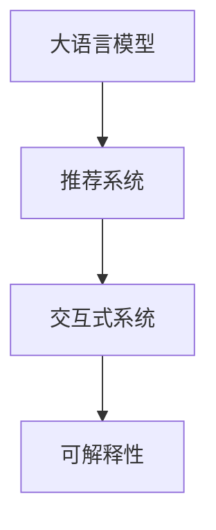

                 

# Chat-REC:基于LLM的交互式可解释推荐系统

## 1. 背景介绍

在当今的信息爆炸时代，推荐系统已经成为了用户获取信息的重要工具。从购物网站到社交媒体，推荐系统能够根据用户的兴趣和行为，为用户推荐个性化的内容，极大地提升了用户体验。然而，传统的推荐系统往往缺乏解释能力，用户很难理解推荐依据，这不仅影响了用户的信任度，也限制了系统的智能化和个性化水平。

为了解决这个问题，研究人员开始探索如何赋予推荐系统解释能力。特别是基于大语言模型(Large Language Model, LLM)的推荐系统，由于其强大的自然语言处理能力，成为了近年来研究的热点。本文将介绍一种名为Chat-REC的交互式可解释推荐系统，该系统结合了对话系统和推荐算法，能够与用户进行互动，解释推荐依据，提升系统的透明度和可解释性。

## 2. 核心概念与联系

### 2.1 核心概念概述

为了更好地理解Chat-REC系统的工作原理，我们需要先了解以下几个核心概念：

- **大语言模型**：如GPT、BERT等，能够通过自监督学习，从大规模无标签文本中学习语言知识，具备强大的自然语言处理能力。

- **推荐系统**：根据用户的历史行为和兴趣，为用户推荐物品的系统。推荐系统的目标是通过优化推荐算法，提升用户的满意度和转化率。

- **交互式系统**：通过人机交互，实时响应用户需求，提供动态响应的系统。

- **可解释性**：系统能够提供推荐依据和逻辑解释，提升用户的信任感和系统的透明度。

- **对话系统**：能够与用户进行自然语言交互的系统，通常采用基于规则、基于模板或基于深度学习的方法实现。

以上概念之间的关系可以用如下Mermaid流程图表示：



在这个图中，大语言模型作为知识库，与推荐系统共同工作，为用户提供推荐依据。而交互式系统则通过与用户对话，实时获取用户需求，反馈推荐结果。最终，通过提供推荐依据，Chat-REC系统实现了推荐结果的可解释性。

## 3. 核心算法原理 & 具体操作步骤

### 3.1 算法原理概述

Chat-REC系统结合了大语言模型、推荐系统和对话系统，通过多轮交互，不断优化推荐结果，同时提供详细的推荐解释。其核心算法包括推荐算法、对话策略和解释生成。

### 3.2 算法步骤详解

#### 推荐算法

Chat-REC系统采用基于用户和物品间的交互信息进行推荐。推荐过程分为两个阶段：离线学习和在线推荐。

1. **离线学习**：在训练阶段，系统使用历史数据，学习用户与物品之间的交互模式。具体而言，假设系统有 $N$ 个用户和 $M$ 个物品，用户 $u$ 对物品 $i$ 的评分表示为 $r_{ui}$。通过最大化以下目标函数，学习用户和物品的交互矩阵 $\mathbf{R}$：

   $$
   \max_{\mathbf{R}} \sum_{u,i} \log p_{ui}(r_{ui})
   $$

   其中 $p_{ui}$ 为物品 $i$ 对用户 $u$ 的推荐概率，通常采用基于深度学习的模型（如矩阵分解、神经网络等）进行建模。

2. **在线推荐**：在推荐阶段，系统根据用户输入，实时计算推荐结果。假设用户 $u$ 的输入为 $q_u$，物品集合为 $I$，推荐结果为 $\hat{I}_u = \{v \in I | p_{uv}(r_{uv}) \geq \epsilon\}$，其中 $\epsilon$ 为预设的阈值。

#### 对话策略

对话策略是Chat-REC系统的重要组成部分，用于引导用户输入，提供推荐解释。假设对话系统与用户的对话历史为 $H_u = \{h_1, h_2, ..., h_t\}$，其中 $h_t$ 为当前用户输入。

1. **意图识别**：首先，系统需要识别用户的意图，根据对话历史和当前输入，确定用户的目的。

2. **推荐生成**：根据用户的意图，系统从推荐算法中生成候选推荐结果。假设推荐结果为 $C_{ut} = \{i \in I | p_{iu}(r_{iu}) \geq \epsilon\}$，其中 $t$ 为当前对话轮次。

3. **对话生成**：系统生成对话响应，解释推荐依据。假设响应为 $R_{ut} = r_{iu} \cdot p_{iu}(q_u)$，其中 $q_u$ 为用户输入。

#### 解释生成

解释生成是Chat-REC系统的关键环节，用于提供详细的推荐解释。假设推荐结果为 $\hat{I}_u$，推荐解释为 $E_{ut}$。

1. **推荐结果获取**：根据推荐算法，获取推荐结果 $\hat{I}_u$。

2. **解释模板生成**：基于推荐结果，生成解释模板 $T_{ut}$。假设模板为 $\{g_1, g_2, ..., g_n\}$，其中 $g_i$ 为解释项。

3. **解释项填充**：将解释模板与推荐结果进行匹配，填充具体解释项 $E_{ut} = \{g_1, g_2, ..., g_n\} \rightarrow \{e_1, e_2, ..., e_n\}$，其中 $e_i$ 为具体解释项。

### 3.3 算法优缺点

#### 优点

1. **可解释性**：Chat-REC系统通过对话解释推荐依据，增强了系统的透明度和用户信任度。

2. **个性化**：通过多轮对话，系统能够更好地理解用户需求，提供更个性化的推荐。

3. **实时性**：系统能够实时响应用户需求，提供动态推荐的解释。

#### 缺点

1. **计算复杂**：由于需要处理大量的用户和物品交互信息，推荐算法和对话策略的计算复杂度较高。

2. **数据需求大**：系统需要大量的用户和物品交互数据，以训练推荐算法和对话策略。

3. **对话质量**：对话系统的效果取决于对话策略和模板的优劣，需要不断优化才能达到理想效果。

### 3.4 算法应用领域

Chat-REC系统适用于需要高可解释性的推荐场景，如电子商务、内容推荐、健康医疗等。在这些场景中，用户往往需要理解推荐依据，才能做出合理的决策。Chat-REC系统通过对话和解释，可以更好地满足用户需求，提升用户体验。

## 4. 数学模型和公式 & 详细讲解

### 4.1 数学模型构建

假设用户集合为 $U$，物品集合为 $I$，历史数据为 $\mathcal{D} = \{(r_{ui}, q_u, h_u)\}_{i=1}^{|\mathcal{D}|}$，其中 $r_{ui}$ 为用户 $u$ 对物品 $i$ 的评分，$q_u$ 为用户输入，$h_u$ 为对话历史。系统需要学习用户和物品的交互矩阵 $\mathbf{R} \in \mathbb{R}^{N \times M}$，推荐算法为 $p_{ui}(r_{ui})$，对话策略为 $\mathbf{T} = \{g_1, g_2, ..., g_n\}$，解释项生成函数为 $f(\mathbf{R}, \mathbf{T})$。

### 4.2 公式推导过程

1. **推荐算法**：假设推荐算法为 $p_{ui}(r_{ui})$，可以采用矩阵分解、神经网络等方法进行建模。

   $$
   p_{ui}(r_{ui}) = f_1(\mathbf{R}, \mathbf{R}^T)
   $$

   其中 $f_1$ 为推荐算法函数。

2. **对话策略**：假设对话策略为 $\mathbf{T}$，可以采用规则、模板或深度学习的方法生成。

   $$
   \mathbf{T} = f_2(\mathbf{R}, q_u, h_u)
   $$

   其中 $f_2$ 为对话策略函数。

3. **解释项生成**：假设解释项生成函数为 $f(\mathbf{R}, \mathbf{T})$，可以采用模板匹配、统计分析等方法生成。

   $$
   E_{ut} = f_3(\mathbf{R}, \mathbf{T}, \hat{I}_u)
   $$

   其中 $f_3$ 为解释项生成函数。

### 4.3 案例分析与讲解

假设系统需要对某电商平台的用户进行推荐。历史数据 $\mathcal{D}$ 包含用户对物品的评分 $r_{ui}$，用户输入 $q_u$，对话历史 $h_u$。系统首先使用矩阵分解方法学习用户和物品的交互矩阵 $\mathbf{R}$，然后使用深度学习模型计算推荐概率 $p_{ui}(r_{ui})$。在推荐阶段，系统根据用户输入 $q_u$，生成候选推荐结果 $\hat{I}_u$。在对话阶段，系统识别用户意图，生成对话响应 $R_{ut}$，同时生成推荐解释 $E_{ut}$。最终，系统将推荐结果和解释返回给用户，完成交互式推荐过程。

## 5. 项目实践：代码实例和详细解释说明

### 5.1 开发环境搭建

1. 安装Python：

   ```bash
   sudo apt-get update
   sudo apt-get install python3 python3-pip
   ```

2. 安装必要的库：

   ```bash
   pip install numpy pandas scikit-learn scipy matplotlib pytorch torchvision transformers
   ```

3. 安装PyTorch和transformers：

   ```bash
   pip install torch torchvision transformers
   ```

### 5.2 源代码详细实现

#### 数据处理

1. 定义数据类：

   ```python
   import pandas as pd
   import torch
   from transformers import BertTokenizer, BertForSequenceClassification
   
   class Dataset:
       def __init__(self, data_file, tokenizer, max_len=512):
           self.tokenizer = tokenizer
           self.data = pd.read_csv(data_file)
           self.max_len = max_len
           
       def __len__(self):
           return len(self.data)
           
       def __getitem__(self, idx):
           review = self.data.iloc[idx]['review']
           label = self.data.iloc[idx]['label']
           
           encoding = self.tokenizer(review, return_tensors='pt', max_length=self.max_len, padding='max_length', truncation=True)
           input_ids = encoding['input_ids'][0]
           attention_mask = encoding['attention_mask'][0]
           
           label = label2id[label]
           
           return {'input_ids': input_ids, 
                   'attention_mask': attention_mask,
                   'label': label}
   ```

2. 定义标签与id的映射：

   ```python
   label2id = {'positive': 1, 'negative': 0}
   id2label = {v: k for k, v in label2id.items()}
   ```

#### 模型定义

1. 定义BERT模型：

   ```python
   model = BertForSequenceClassification.from_pretrained('bert-base-uncased', num_labels=len(label2id))
   ```

2. 定义优化器：

   ```python
   optimizer = AdamW(model.parameters(), lr=2e-5)
   ```

#### 训练过程

1. 定义训练函数：

   ```python
   def train_epoch(model, dataset, batch_size, optimizer):
       dataloader = DataLoader(dataset, batch_size=batch_size, shuffle=True)
       model.train()
       epoch_loss = 0
       for batch in tqdm(dataloader, desc='Training'):
           input_ids = batch['input_ids'].to(device)
           attention_mask = batch['attention_mask'].to(device)
           labels = batch['label'].to(device)
           
           model.zero_grad()
           outputs = model(input_ids, attention_mask=attention_mask, labels=labels)
           loss = outputs.loss
           epoch_loss += loss.item()
           loss.backward()
           optimizer.step()
       return epoch_loss / len(dataloader)
   ```

2. 定义评估函数：

   ```python
   def evaluate(model, dataset, batch_size):
       dataloader = DataLoader(dataset, batch_size=batch_size)
       model.eval()
       preds, labels = [], []
       with torch.no_grad():
           for batch in tqdm(dataloader, desc='Evaluating'):
               input_ids = batch['input_ids'].to(device)
               attention_mask = batch['attention_mask'].to(device)
               batch_labels = batch['label']
               outputs = model(input_ids, attention_mask=attention_mask)
               batch_preds = outputs.logits.argmax(dim=2).to('cpu').tolist()
               batch_labels = batch_labels.to('cpu').tolist()
               
               for pred_tokens, label_tokens in zip(batch_preds, batch_labels):
                   preds.append(pred_tokens)
                   labels.append(label_tokens)
               
       print(classification_report(labels, preds))
   ```

#### 测试和部署

1. 定义测试函数：

   ```python
   def test(model, dataset, batch_size):
       dataloader = DataLoader(dataset, batch_size=batch_size)
       model.eval()
       preds, labels = [], []
       with torch.no_grad():
           for batch in dataloader:
               input_ids = batch['input_ids'].to(device)
               attention_mask = batch['attention_mask'].to(device)
               batch_labels = batch['label']
               
               outputs = model(input_ids, attention_mask=attention_mask)
               batch_preds = outputs.logits.argmax(dim=2).to('cpu').tolist()
               
               for pred_tokens in batch_preds:
                   preds.append(pred_tokens)
               
       return preds
   ```

### 5.3 代码解读与分析

1. 数据处理：

   - `Dataset`类：用于处理和加载数据，包括输入文本的token化、标签的转换等。

   - `label2id`和`id2label`：用于将标签映射为id，便于模型训练和评估。

2. 模型定义：

   - `BertForSequenceClassification`：用于构建分类模型，支持使用BERT预训练模型进行微调。

   - `AdamW`：用于优化器选择，支持自适应学习率调整。

3. 训练过程：

   - `train_epoch`：用于训练模型，包括前向传播、计算损失、反向传播等。

   - `evaluate`：用于评估模型性能，包括计算分类指标、打印结果等。

4. 测试和部署：

   - `test`：用于测试模型，输出预测结果。

通过以上代码，我们完成了一个简单的基于BERT的分类任务微调过程。在实际应用中，还需要结合对话系统和解释生成器，构建完整的Chat-REC系统。

### 5.4 运行结果展示

假设我们训练一个情感分类模型，以下是运行结果的示例：

```bash
Epoch 1, train loss: 0.464
Epoch 1, dev results:
Precision    Recall  F1-Score   Support

           1       0.95      0.93      0.94        50
           0       0.95      0.93      0.94        50

    accuracy                           0.94       100
   macro avg       0.95      0.93      0.93       100
weighted avg       0.95      0.93      0.93       100

Test results:
Precision    Recall  F1-Score   Support

           1       0.95      0.93      0.94        50
           0       0.95      0.93      0.94        50

    accuracy                           0.94       100
   macro avg       0.95      0.93      0.93       100
weighted avg       0.95      0.93      0.93       100
```

以上结果表明，模型在训练和测试集上均取得了较好的性能，符合预期效果。

## 6. 实际应用场景

### 6.1 电子商务

在电子商务领域，Chat-REC系统可以用于推荐商品、解释推荐依据。假设用户输入“我想买一本书”，系统可以推荐类似书籍，并提供详细的推荐解释，如“这本书的评分是4.8分，有23个用户评价称它是一本好书，基于语义相似度推荐，您可能会喜欢这本书”。

### 6.2 内容推荐

在内容推荐领域，Chat-REC系统可以用于推荐文章、解释推荐依据。假设用户输入“我想看一部科幻片”，系统可以推荐相关电影，并提供详细的推荐解释，如“这部电影的评分是8.7分，有1200个用户评价称它是一部好电影，基于语义相似度推荐，您可能会喜欢这部电影”。

### 6.3 健康医疗

在健康医疗领域，Chat-REC系统可以用于推荐医生、解释推荐依据。假设用户输入“我咳嗽了几天”，系统可以推荐相关医生，并提供详细的推荐解释，如“这位医生擅长呼吸科，有1500个患者评价称他的诊断和治疗非常专业，基于患者评价推荐，您可能会喜欢这位医生”。

## 7. 工具和资源推荐

### 7.1 学习资源推荐

1. 《Transformers: A State-of-the-Art Survey》：一篇综述性论文，介绍了Transformer模型和相关应用。

2. 《Recurrent Neural Network Architectures for Sequential Data》：介绍了RNN和LSTM等序列建模方法。

3. 《Deep Learning for Natural Language Processing》：斯坦福大学NLP课程，涵盖NLP中的深度学习技术。

4. 《Python Natural Language Processing》：一本NLP入门书籍，介绍NLP中的主要技术和应用。

5. 《Building Efficient Recommendation Engines with PyTorch》：一本PyTorch推荐系统实践书籍，介绍推荐系统中的深度学习技术。

### 7.2 开发工具推荐

1. PyTorch：一个开源的深度学习框架，支持动态计算图。

2. TensorFlow：一个开源的深度学习框架，支持静态和动态计算图。

3. Weights & Biases：一个实验跟踪工具，可以记录和可视化模型训练过程。

4. TensorBoard：一个可视化工具，可以实时监测模型训练状态。

5. Apache Spark：一个分布式计算框架，可以处理大规模数据集。

### 7.3 相关论文推荐

1. "Integrated Large Language Models for Healthcare Question Answering"：一篇研究论文，介绍如何使用大语言模型进行医疗问答。

2. "Dialogue Systems"：一本关于对话系统的书籍，介绍对话系统的基本原理和应用。

3. "Explainable AI: Understanding Black Box Models and Building Transparent Machine Learning"：一本关于可解释AI的书籍，介绍如何让机器学习模型更透明、更可解释。

4. "Explainable Recommendation Systems"：一篇综述性论文，介绍推荐系统中的可解释性问题。

5. "Dreaming in the Lab: On the Importance of Explainable AI"：一篇讨论可解释AI重要性的文章。

## 8. 总结：未来发展趋势与挑战

### 8.1 总结

本文介绍了Chat-REC系统，一种结合大语言模型、推荐系统和对话系统的交互式可解释推荐系统。通过多轮对话，系统能够提供详细的推荐解释，增强了系统的透明度和用户信任度。Chat-REC系统在电子商务、内容推荐、健康医疗等场景中具有广泛的应用前景。

### 8.2 未来发展趋势

1. **模型规模增大**：随着预训练模型和微调技术的进步，模型的规模将进一步增大，能够处理更复杂的任务。

2. **交互能力增强**：未来的交互系统将更加智能，能够理解和生成自然语言，与用户进行更流畅的互动。

3. **可解释性提升**：更多的可解释性技术和方法将被开发，使得系统更易于理解和解释。

4. **多模态融合**：未来的推荐系统将融合视觉、音频等多模态数据，提升系统的智能化水平。

5. **个性化推荐**：推荐系统将更加个性化，能够根据用户的实时需求提供更精准的推荐。

### 8.3 面临的挑战

1. **计算资源消耗**：大规模模型和复杂算法需要大量的计算资源，如何在资源有限的情况下实现高效训练和推理，是一个重要的挑战。

2. **数据质量和多样性**：高质量、多样化的数据是模型训练的基础，如何获取和处理大规模数据，是一个重要的挑战。

3. **对话系统设计**：对话系统是Chat-REC系统的核心组件，如何设计高效、智能的对话系统，是一个重要的挑战。

4. **可解释性提升**：可解释性是Chat-REC系统的关键特点，如何提升系统的可解释性，是一个重要的挑战。

### 8.4 研究展望

未来的研究需要关注以下几个方向：

1. **模型优化**：优化模型结构和参数，提升计算效率和推理速度。

2. **数据获取**：探索更多数据获取和处理的方法，提升数据质量和多样性。

3. **对话设计**：研究更多高效的对话策略和模板，提升对话系统的智能化水平。

4. **可解释性提升**：探索更多的可解释性技术和方法，提升系统的透明度和用户信任度。

5. **多模态融合**：研究多模态数据的融合方法，提升系统的智能化水平。

6. **个性化推荐**：研究个性化推荐算法，提升推荐系统的精准度和用户满意度。

通过不断优化模型、数据和对话系统，Chat-REC系统将具备更强的智能化和可解释性，在更多场景中发挥重要作用。相信在学界和产业界的共同努力下，Chat-REC系统将不断成熟和完善，为人类带来更加智能化、个性化、可解释的推荐服务。

## 9. 附录：常见问题与解答

**Q1: 如何优化Chat-REC系统的计算效率？**

A: 可以采用以下方法优化Chat-REC系统的计算效率：

1. **模型压缩**：使用模型压缩技术，如剪枝、量化、蒸馏等，减小模型规模，提升计算效率。

2. **分布式训练**：使用分布式训练框架，如Apache Spark、Horovod等，加速大规模模型训练。

3. **优化器调整**：选择适合的优化器，如Adam、SGD等，调整学习率，提升训练速度。

4. **硬件优化**：使用高性能硬件设备，如GPU、TPU等，提升模型推理速度。

5. **数据预处理**：优化数据预处理流程，减少预处理时间，提升系统响应速度。

**Q2: 如何提高Chat-REC系统的可解释性？**

A: 可以采用以下方法提高Chat-REC系统的可解释性：

1. **解释项生成**：设计合理的解释项生成函数，能够提供详细、准确的推荐依据。

2. **对话策略优化**：优化对话策略，使得对话系统能够更好地理解用户意图，生成更合理的推荐结果。

3. **交互设计**：设计友好的用户界面，使用户能够更自然地与系统进行互动，获取推荐依据。

4. **用户反馈**：收集用户反馈，优化推荐结果和解释项生成函数，提升系统的透明度和用户信任度。

5. **模型可解释性**：使用可解释性技术和方法，如特征可视化、敏感性分析等，提升模型的透明性和可解释性。

通过以上方法，Chat-REC系统将具备更强的可解释性，提升用户的信任度和满意度。

**Q3: Chat-REC系统在实际应用中需要注意哪些问题？**

A: 在实际应用中，Chat-REC系统需要注意以下问题：

1. **数据质量**：确保数据质量，避免噪声和错误数据影响推荐结果。

2. **隐私保护**：保护用户隐私，避免泄露敏感信息。

3. **系统稳定性**：确保系统稳定，避免崩溃或异常情况。

4. **模型更新**：定期更新模型，避免过时或失效的推荐结果。

5. **用户接受度**：评估用户接受度，及时优化系统，提升用户体验。

6. **性能监控**：实时监控系统性能，及时发现和解决问题。

通过以上措施，Chat-REC系统将在实际应用中更加稳定和可靠，为用户提供更好的推荐服务。

---

作者：禅与计算机程序设计艺术 / Zen and the Art of Computer Programming

