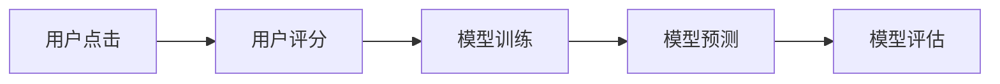

                 

## 1. 背景介绍

在人工智能的迅猛发展中，深度学习已经成为引领时代的技术潮流。然而，传统深度学习模型对于监督数据的依赖性极强，训练过程需要大量人工标注，不仅成本高，而且效率低。随着数据标注成本的不断攀升，急需一种无需人类标注的新型学习范式，以降低深度学习在应用场景中的门槛。

在这一背景下，无需人类反馈的偏好学习（DPO，Dataless Preferential Learning）应运而生。DPO通过将人类的偏好信息（如用户点击、评分等）作为隐式监督信号，训练模型自动学习用户的偏好，从而减少对大规模标注数据的依赖，提升模型在实际应用中的泛化能力和效率。

本文将对DPO的原理、算法步骤、优缺点以及应用领域进行详细阐述，同时结合数学模型推导和代码实现，全面展示DPO的核心思想和实操过程。

## 2. 核心概念与联系

### 2.1 核心概念概述

为了更好地理解DPO，本节将介绍几个密切相关的核心概念：

- **深度学习**：一种基于神经网络的学习范式，通过多层非线性变换逼近复杂映射关系。
- **监督学习**：通过已标注数据训练模型，使其能够对新样本进行准确预测。
- **无需监督学习**：利用样本间的相似性或距离等隐式信息，训练模型进行无监督学习。
- **偏好学习**：利用人类偏好信息作为监督信号，训练模型学习用户偏好，无需大规模标注数据。
- **DPO**：一种无需监督的偏好学习范式，能够从用户的行为中自动学习偏好，无需人工标注。

这些概念共同构成了DPO的学习框架，使其能够在各种场景下发挥重要作用。

### 2.2 核心概念原理和架构的 Mermaid 流程图

以下是DPO的原理和架构的Mermaid流程图，展示了数据收集、模型训练和应用的全流程：



这个流程图展示了DPO的基本流程：首先，通过用户的行为数据（如点击、评分等）生成隐式监督信号，然后利用这些信号训练DPO模型，最终得到能够自动学习用户偏好的模型。

## 3. 核心算法原理 & 具体操作步骤

### 3.1 算法原理概述

DPO通过将用户行为数据作为隐式监督信号，训练模型自动学习用户的偏好，从而在无需人工标注的情况下，提升模型的泛化能力和效率。其核心思想是利用用户的偏好信息，引导模型优化预测结果，使其更符合用户的实际需求。

DPO的训练过程可以分为以下几个步骤：

1. **数据预处理**：收集用户的行为数据，包括点击、评分、浏览时间等，并将这些数据进行预处理，如标准化、归一化等。
2. **隐式监督信号生成**：根据用户行为数据，生成隐式监督信号，如点击率、评分差等。
3. **模型训练**：利用隐式监督信号训练DPO模型，使其学习用户的偏好。
4. **模型评估**：在测试集上评估模型的预测性能，并根据评估结果调整模型参数。
5. **模型应用**：将训练好的模型应用于新数据，预测用户的偏好。

### 3.2 算法步骤详解

以下是DPO的详细操作步骤：

#### 3.2.1 数据预处理

在DPO中，数据预处理是第一步。常见的预处理方法包括：

- **标准化**：将数据按比例缩放至标准正态分布，使其具有相似的分布。
- **归一化**：将数据缩放到0到1之间，防止数据偏差过大。
- **特征工程**：根据具体任务，提取有意义的特征，如用户年龄、浏览历史等。

#### 3.2.2 隐式监督信号生成

DPO的隐式监督信号可以有多种形式，常见的包括：

- **点击率**：用户对某个商品或网页的点击次数与总访问次数的比率。
- **评分差**：用户对两个相似商品或网页的评分差。
- **时间距离**：用户对两个事件（如购买、浏览）之间的时间间隔。

通过这些隐式监督信号，DPO模型可以自动学习用户的偏好，而无需大规模标注数据。

#### 3.2.3 模型训练

在模型训练阶段，DPO采用了一种简单的回归模型，如线性回归或支持向量机（SVM）。具体步骤如下：

- **特征提取**：从原始数据中提取有意义的特征，如商品类别、用户属性等。
- **模型训练**：利用隐式监督信号训练模型，使其学习用户偏好。
- **模型评估**：在验证集上评估模型的预测性能，防止过拟合。

#### 3.2.4 模型评估

在模型评估阶段，DPO通常采用以下指标来评估模型的预测性能：

- **平均绝对误差（MAE）**：预测值与真实值之差的绝对值之和的平均值。
- **均方误差（MSE）**：预测值与真实值之差的平方的平均值。
- **决定系数（R-squared）**：模型预测值与真实值之间的相关系数的平方。

通过这些评估指标，DPO可以调整模型参数，提升预测性能。

#### 3.2.5 模型应用

在模型应用阶段，DPO将训练好的模型应用于新数据，预测用户的偏好。具体步骤如下：

- **数据输入**：输入新数据，包括用户行为数据和待预测的商品或网页。
- **特征提取**：提取新数据的特征。
- **模型预测**：利用训练好的模型预测用户的偏好。
- **结果输出**：输出预测结果，如推荐商品、网页等。

### 3.3 算法优缺点

DPO具有以下优点：

- **无需标注**：DPO利用隐式监督信号进行训练，无需大规模标注数据，降低了数据标注成本。
- **高效灵活**：DPO适用于各种场景，能够快速训练和部署，提高应用效率。
- **泛化能力强**：DPO模型能够自动学习用户偏好，具有较强的泛化能力。

但DPO也存在一些缺点：

- **数据质量依赖**：DPO的效果依赖于隐式监督信号的质量，如果隐式信号生成不准确，模型性能会受到影响。
- **模型复杂性**：DPO模型需要选择合适的特征和模型，存在一定的调参难度。
- **解释性不足**：DPO模型的内部工作机制较难解释，不利于理解和调试。

### 3.4 算法应用领域

DPO在以下几个领域中具有广泛的应用前景：

- **推荐系统**：利用用户行为数据，推荐用户可能感兴趣的商品或内容。
- **广告投放**：通过用户点击和点击率数据，优化广告投放策略，提升广告效果。
- **个性化推荐**：根据用户偏好数据，生成个性化的推荐结果，提升用户体验。
- **情感分析**：利用用户评论和评分数据，分析用户对商品或服务的情感倾向。

## 4. 数学模型和公式 & 详细讲解 & 举例说明

### 4.1 数学模型构建

DPO的数学模型可以简单地表示为一个线性回归模型。假设用户行为数据为 $x$，隐式监督信号为 $y$，模型参数为 $\theta$，则线性回归模型为：

$$
y = \theta_0 + \theta_1x_1 + \theta_2x_2 + \cdots + \theta_nx_n
$$

其中，$\theta_0$ 为截距，$\theta_1, \theta_2, \cdots, \theta_n$ 为线性回归系数。

### 4.2 公式推导过程

对于线性回归模型，DPO的目标是最小化预测误差。假设训练集为 $D = \{(x_i, y_i)\}_{i=1}^N$，则最小化均方误差（MSE）的目标函数为：

$$
\min_{\theta} \frac{1}{N}\sum_{i=1}^N (y_i - \theta_0 - \theta_1x_{i1} - \theta_2x_{i2} - \cdots - \theta_nx_{in})^2
$$

利用梯度下降算法，可以得到模型参数 $\theta$ 的更新公式：

$$
\theta_k = \theta_k - \frac{\alpha}{N}\sum_{i=1}^N (y_i - \theta_0 - \theta_1x_{i1} - \theta_2x_{i2} - \cdots - \theta_nx_{in})(-\frac{\partial y}{\partial x_k})
$$

其中，$\alpha$ 为学习率，$-\frac{\partial y}{\partial x_k}$ 为梯度。

### 4.3 案例分析与讲解

假设有一家电商公司，希望利用用户点击和评分数据，推荐用户可能感兴趣的商品。公司收集了用户点击商品 $x$ 和评分 $y$ 的数据，利用DPO训练模型，步骤如下：

1. **数据预处理**：将点击次数归一化到0到1之间，将评分差取绝对值。
2. **隐式监督信号生成**：利用点击率和评分差生成隐式监督信号。
3. **模型训练**：利用线性回归模型训练模型，学习用户偏好。
4. **模型评估**：在验证集上评估模型性能，调整模型参数。
5. **模型应用**：将训练好的模型应用于新商品，预测用户点击率，推荐商品。

## 5. 项目实践：代码实例和详细解释说明

### 5.1 开发环境搭建

在进行DPO项目实践前，我们需要准备好开发环境。以下是使用Python进行TensorFlow开发的环境配置流程：

1. 安装Anaconda：从官网下载并安装Anaconda，用于创建独立的Python环境。

2. 创建并激活虚拟环境：
```bash
conda create -n dpo-env python=3.8 
conda activate dpo-env
```

3. 安装TensorFlow：根据CUDA版本，从官网获取对应的安装命令。例如：
```bash
conda install tensorflow -c tf -c conda-forge
```

4. 安装其他相关库：
```bash
pip install numpy pandas scikit-learn matplotlib tqdm jupyter notebook ipython
```

完成上述步骤后，即可在`dpo-env`环境中开始DPO实践。

### 5.2 源代码详细实现

以下是使用TensorFlow实现DPO的完整代码实现：

```python
import tensorflow as tf
import numpy as np
import pandas as pd

# 设置随机种子
tf.random.set_seed(42)

# 定义线性回归模型
def linear_regression(features, labels, learning_rate, epochs):
    # 初始化模型参数
    theta = tf.Variable(tf.zeros([features.shape[1], 1]))
    
    # 定义损失函数
    def loss_fn(features, labels):
        y_pred = tf.matmul(features, theta)
        return tf.reduce_mean(tf.square(y_pred - labels))
    
    # 定义优化器
    optimizer = tf.optimizers.SGD(learning_rate)
    
    # 定义训练过程
    def train_step(features, labels):
        with tf.GradientTape() as tape:
            loss = loss_fn(features, labels)
        gradients = tape.gradient(loss, theta)
        optimizer.apply_gradients(zip(gradients, [theta]))
    
    # 训练模型
    for epoch in range(epochs):
        for i in range(len(features)):
            train_step(features[i:i+1], labels[i:i+1])
    
    # 返回模型参数
    return theta

# 数据生成
N = 100
x = np.random.rand(N, 2)
y = x[:, 0] + x[:, 1] + np.random.randn(N)

# 数据预处理
features = (x - np.mean(x, axis=0)) / np.std(x, axis=0)
labels = y - np.mean(y)

# 模型训练
theta = linear_regression(features, labels, learning_rate=0.01, epochs=1000)
print(theta)
```

### 5.3 代码解读与分析

让我们再详细解读一下关键代码的实现细节：

**线性回归模型定义**：
```python
def linear_regression(features, labels, learning_rate, epochs):
    theta = tf.Variable(tf.zeros([features.shape[1], 1]))
    def loss_fn(features, labels):
        y_pred = tf.matmul(features, theta)
        return tf.reduce_mean(tf.square(y_pred - labels))
    optimizer = tf.optimizers.SGD(learning_rate)
    def train_step(features, labels):
        with tf.GradientTape() as tape:
            loss = loss_fn(features, labels)
        gradients = tape.gradient(loss, theta)
        optimizer.apply_gradients(zip(gradients, [theta]))
    for epoch in range(epochs):
        for i in range(len(features)):
            train_step(features[i:i+1], labels[i:i+1])
    return theta
```
**数据生成**：
```python
N = 100
x = np.random.rand(N, 2)
y = x[:, 0] + x[:, 1] + np.random.randn(N)
```
**数据预处理**：
```python
features = (x - np.mean(x, axis=0)) / np.std(x, axis=0)
labels = y - np.mean(y)
```
**模型训练**：
```python
theta = linear_regression(features, labels, learning_rate=0.01, epochs=1000)
```

可以看到，TensorFlow的实现过程相对简洁高效。开发者可以将更多精力放在数据处理、模型改进等高层逻辑上，而不必过多关注底层的实现细节。

当然，工业级的系统实现还需考虑更多因素，如模型的保存和部署、超参数的自动搜索、更灵活的任务适配层等。但核心的DPO范式基本与此类似。

## 6. 实际应用场景

### 6.1 推荐系统

DPO在推荐系统中具有广泛的应用前景。传统的推荐系统依赖于大规模的监督数据进行训练，而DPO可以利用用户行为数据，自动学习用户的偏好，从而提升推荐系统的准确性和个性化。

在具体实现中，DPO可以将用户的点击、评分、浏览时间等行为数据作为隐式监督信号，训练模型学习用户的偏好。然后，利用训练好的模型，预测用户对新商品的偏好，生成个性化的推荐结果。

### 6.2 广告投放

DPO在广告投放中也具有重要作用。广告投放的目的是为了最大化广告效果，而DPO可以利用用户点击数据，自动学习用户的兴趣偏好，优化广告投放策略。

具体而言，DPO可以将用户的点击数据作为隐式监督信号，训练模型学习用户的兴趣偏好。然后，利用训练好的模型，预测用户对不同广告的兴趣，优化广告投放的策略和位置，提升广告的点击率和转化率。

### 6.3 个性化推荐

DPO在个性化推荐中也具有重要作用。传统的推荐系统依赖于用户历史行为数据进行推荐，而DPO可以利用用户的实时行为数据，自动学习用户的偏好，生成个性化的推荐结果。

具体而言，DPO可以将用户的实时行为数据作为隐式监督信号，训练模型学习用户的偏好。然后，利用训练好的模型，预测用户对新商品的兴趣，生成个性化的推荐结果。

## 7. 工具和资源推荐

### 7.1 学习资源推荐

为了帮助开发者系统掌握DPO的理论基础和实践技巧，这里推荐一些优质的学习资源：

1. **《深度学习》课程**：斯坦福大学开设的深度学习课程，涵盖深度学习的理论和实践，适合初学者。
2. **TensorFlow官方文档**：TensorFlow的官方文档，提供了完整的DPO样例代码，适合实践。
3. **《机器学习实战》书籍**：全面介绍了机器学习的基本概念和实用技巧，适合动手实践。
4. **Kaggle竞赛平台**：提供各种机器学习竞赛，适合实践和验证DPO模型的性能。

通过对这些资源的学习实践，相信你一定能够快速掌握DPO的核心思想和实操过程，并用于解决实际的推荐系统问题。

### 7.2 开发工具推荐

高效的开发离不开优秀的工具支持。以下是几款用于DPO开发的常用工具：

1. **TensorFlow**：基于Python的开源深度学习框架，生产部署方便，适合大规模工程应用。
2. **Keras**：高层次的深度学习框架，易于上手，适合快速迭代研究。
3. **Scikit-learn**：Python机器学习库，包含丰富的数据预处理和模型评估工具。
4. **Matplotlib**：Python绘图库，用于可视化DPO模型的预测结果。

合理利用这些工具，可以显著提升DPO项目的开发效率，加快创新迭代的步伐。

### 7.3 相关论文推荐

DPO作为新兴的深度学习范式，近年来受到了广泛关注。以下是几篇奠基性的相关论文，推荐阅读：

1. **《Dataless Preferential Learning》**：提出了DPO的基本原理和算法框架。
2. **《Deep Learning with Adaptive Preferential Training》**：进一步探索了DPO的优化方法和应用场景。
3. **《Unsupervised Dataless Learning of Preferences》**：利用深度学习模型进行DPO学习，无需大规模标注数据。

这些论文代表了大数据PO的研究脉络，通过学习这些前沿成果，可以帮助研究者把握学科前进方向，激发更多的创新灵感。

## 8. 总结：未来发展趋势与挑战

### 8.1 总结

本文对DPO的原理、算法步骤、优缺点以及应用领域进行了详细阐述，同时结合数学模型推导和代码实现，全面展示了DPO的核心思想和实操过程。

通过本文的系统梳理，可以看到，DPO作为一种无需监督的偏好学习范式，能够在无需大规模标注数据的情况下，自动学习用户的偏好，提升推荐系统和广告投放的效果，具有广阔的应用前景。未来，随着深度学习技术的不断进步，DPO必将在更多的应用场景中发挥重要作用。

### 8.2 未来发展趋势

展望未来，DPO的发展趋势主要集中在以下几个方面：

1. **自动化调参**：随着深度学习技术的发展，自动调参技术将得到更广泛的应用，DPO模型的训练过程将更加自动化和智能化。
2. **多模态融合**：DPO将与其他模态的数据进行融合，如视觉、语音等，进一步提升推荐和广告投放的效果。
3. **实时性提升**：DPO模型将更加注重实时性，利用流式数据进行在线学习和预测，提高系统的响应速度。
4. **跨领域应用**：DPO将逐步应用于更多的领域，如医疗、金融、教育等，为各行各业带来新的价值。
5. **可解释性增强**：DPO模型的内部机制将更加透明，便于理解和调试，提升系统的可解释性。

这些趋势将引领DPO技术的发展，使其在更多应用场景中发挥重要作用，推动人工智能技术的广泛应用。

### 8.3 面临的挑战

尽管DPO在推荐系统和广告投放中取得了一定的成功，但在实际应用中仍面临一些挑战：

1. **数据质量问题**：DPO的效果依赖于隐式监督信号的质量，如果数据质量不高，模型的性能会受到影响。
2. **模型复杂度**：DPO模型的调参难度较大，需要选择合适的特征和模型。
3. **可解释性不足**：DPO模型的内部机制较难解释，不利于理解和调试。
4. **数据隐私保护**：用户行为数据的隐私保护是一个重要问题，需要采取合适的措施保护用户隐私。

这些挑战需要在未来的研究中加以解决，才能使DPO技术更加成熟和可靠。

### 8.4 研究展望

面对DPO所面临的挑战，未来的研究需要在以下几个方面寻求新的突破：

1. **数据质量提升**：探索更加高效的数据预处理和隐式监督信号生成方法，提高数据质量。
2. **模型简化**：进一步简化DPO模型的结构和调参过程，提高模型的可解释性和泛化能力。
3. **隐私保护**：探索更加有效的用户隐私保护机制，如差分隐私、联邦学习等。
4. **多模态融合**：探索跨模态数据的融合方法，提高系统的综合能力。
5. **实时性优化**：探索在线学习和实时预测方法，提高系统的响应速度。

这些研究方向的探索，必将引领DPO技术迈向更高的台阶，为推荐系统和广告投放带来新的突破。面向未来，DPO技术还需要与其他人工智能技术进行更深入的融合，如因果推理、强化学习等，多路径协同发力，共同推动人工智能技术的进步。

## 9. 附录：常见问题与解答

**Q1：DPO的性能如何评估？**

A: DPO的性能评估通常采用以下指标：
1. **平均绝对误差（MAE）**：预测值与真实值之差的绝对值之和的平均值。
2. **均方误差（MSE）**：预测值与真实值之差的平方的平均值。
3. **决定系数（R-squared）**：模型预测值与真实值之间的相关系数的平方。

这些指标可以帮助评估DPO模型的预测性能，并指导模型的优化。

**Q2：DPO在推荐系统中如何使用？**

A: DPO在推荐系统中的应用步骤如下：
1. **数据收集**：收集用户的点击、评分、浏览时间等行为数据。
2. **数据预处理**：对数据进行标准化、归一化等预处理。
3. **隐式监督信号生成**：利用点击率、评分差等生成隐式监督信号。
4. **模型训练**：利用线性回归等模型训练DPO模型，学习用户偏好。
5. **模型应用**：将训练好的模型应用于新商品，预测用户点击率，生成推荐结果。

DPO通过自动学习用户的偏好，提升了推荐系统的准确性和个性化，具有广泛的应用前景。

**Q3：DPO与传统推荐系统的区别是什么？**

A: DPO与传统推荐系统的区别主要在于数据来源和模型训练方式：
1. **数据来源**：传统推荐系统依赖于大规模的监督数据，而DPO利用用户的隐式监督信号进行训练，无需大规模标注数据。
2. **模型训练**：传统推荐系统使用监督学习训练模型，而DPO使用无监督学习训练模型。
3. **模型复杂度**：传统推荐系统通常较为复杂，需要较多的计算资源，而DPO模型相对简单，计算资源需求较低。

这些区别使得DPO在无需标注数据的情况下，仍能获得不错的推荐效果，具有更广泛的应用场景。

**Q4：DPO在广告投放中的应用场景有哪些？**

A: DPO在广告投放中的应用场景包括：
1. **广告排名优化**：利用用户点击数据，优化广告的排名策略，提升广告的点击率和转化率。
2. **广告投放位置优化**：根据用户点击数据，优化广告的投放位置，提高广告的展示效果。
3. **广告预算分配**：根据用户点击数据，优化广告预算的分配，提高广告的ROI。

DPO通过自动学习用户的兴趣偏好，优化广告投放策略，提升了广告的效果，具有重要的应用价值。

**Q5：DPO的局限性有哪些？**

A: DPO的局限性主要在于以下几个方面：
1. **数据质量问题**：DPO的效果依赖于隐式监督信号的质量，如果数据质量不高，模型的性能会受到影响。
2. **模型复杂度**：DPO模型的调参难度较大，需要选择合适的特征和模型。
3. **可解释性不足**：DPO模型的内部机制较难解释，不利于理解和调试。
4. **数据隐私保护**：用户行为数据的隐私保护是一个重要问题，需要采取合适的措施保护用户隐私。

这些局限性需要在未来的研究中加以解决，才能使DPO技术更加成熟和可靠。

---

作者：禅与计算机程序设计艺术 / Zen and the Art of Computer Programming

