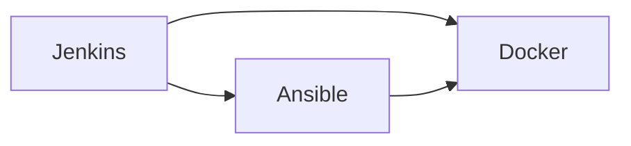

                 

# DevOps 工具：Jenkins、Ansible 和 Docker

> 关键词：DevOps, Jenkins, Ansible, Docker, CI/CD, Kubernetes, Infrastructure as Code, Continuous Integration

## 1. 背景介绍

### 1.1 问题由来

在过去的几十年中，软件开发和运维（DevOps）已经成为IT行业的主流趋势。随着软件复杂度的增加，传统的“开发-测试-部署”（Dev-Test-Prod）流程已经无法满足快速迭代的需求。DevOps的核心理念是通过自动化和协作来提高软件交付的速度和质量。

在这个过程中，DevOps工具扮演着至关重要的角色。Jenkins、Ansible和Docker是DevOps生态中最为流行的三大工具。它们各自解决了不同的问题，并彼此协同工作，以实现从代码管理到容器化部署的全生命周期管理。

### 1.2 问题核心关键点

Jenkins、Ansible和Docker在DevOps中的作用和价值可以总结如下：

- Jenkins是用于持续集成和持续部署（CI/CD）的自动化工具，可以自动化地执行构建、测试和部署流程。
- Ansible是一种基于SSH和动态 inventory的自动化运维工具，可以简化配置管理和远程部署。
- Docker是一种容器化平台，可以帮助开发人员轻松打包和分发应用，确保环境的一致性。

这三者结合，可以帮助组织提高开发效率、缩短交付周期、降低错误率，从而提升整体软件交付能力。

### 1.3 问题研究意义

研究和了解这些工具的原理和应用，对于构建高效、可靠的软件开发和运维流程具有重要意义。掌握这些工具的用法和最佳实践，可以帮助IT团队提高工作效率、降低成本、加速产品上市时间。

## 2. 核心概念与联系

### 2.1 核心概念概述

#### Jenkins

Jenkins是一款开源的自动化服务器，用于构建、测试和部署软件项目。它提供了一个高度可扩展的平台，支持各种插件，可以与多个系统和工具集成。Jenkins的核心功能包括持续集成（CI）、持续部署（CD）和持续交付（CD）。

#### Ansible

Ansible是一款基于SSH和动态 inventory的开源自动化工具，用于自动化配置管理和远程部署。它提供了一个简单、易用的模型来描述配置和自动化流程，无需在远程系统上安装任何软件。

#### Docker

Docker是一种开源的容器化平台，用于构建、分发和运行应用程序。它提供了一种隔离、打包和分发应用的方式，确保环境的一致性，从而避免了“在不同的机器上运行不同的应用”的问题。

这三个工具通过各自的特性，相互配合，构建了一个强大的DevOps生态系统，为软件开发生命周期的各个阶段提供了必要的支持。

### 2.2 核心概念原理和架构的 Mermaid 流程图



## 3. 核心算法原理 & 具体操作步骤

### 3.1 算法原理概述

#### Jenkins

Jenkins的持续集成和持续部署（CI/CD）流程一般包括以下步骤：

1. 代码提交
2. 自动化构建
3. 自动化测试
4. 自动化部署

#### Ansible

Ansible的工作流程包括：

1. 定义角色和任务
2. 编写Playbook
3. 运行Playbook

#### Docker

Docker容器化的工作流程包括：

1. 创建Docker镜像
2. 构建Docker镜像
3. 运行Docker容器

这些工具各自有其独立的算法原理，但通过整合，可以构建一个完整、高效的DevOps流水线。

### 3.2 算法步骤详解

#### Jenkins

1. **设置Jenkins环境**：安装Jenkins服务器，配置必要的插件和环境变量。
2. **定义构建作业**：在Jenkins中创建构建作业，配置构建步骤和触发器。
3. **配置自动化测试**：在构建作业中添加测试步骤，可以使用各种测试框架和插件。
4. **配置自动化部署**：在构建作业中添加部署步骤，可以使用各种部署插件和脚本。

#### Ansible

1. **定义角色和任务**：使用YAML语言定义角色和任务，描述要自动化配置的系统和服务。
2. **编写Playbook**：使用Playbook编写自动化流程，定义任务执行顺序和条件。
3. **运行Playbook**：通过SSH连接目标系统，执行Playbook，自动配置和管理系统。

#### Docker

1. **创建Docker镜像**：使用Dockerfile文件定义应用环境和依赖，使用Docker命令构建镜像。
2. **构建Docker镜像**：使用Docker构建命令，将Dockerfile文件打包为镜像。
3. **运行Docker容器**：使用Docker run命令，运行Docker容器，确保环境一致性。

### 3.3 算法优缺点

#### Jenkins

- **优点**：
  - 开源、灵活，支持多种插件和集成。
  - 高度可扩展，适用于各种规模的项目。
  - 可视化界面，易于使用和管理。

- **缺点**：
  - 配置复杂，需要一定的技术背景。
  - 在处理大规模并发请求时性能较差。

#### Ansible

- **优点**：
  - 简单易用，无需在目标系统上安装任何软件。
  - 配置管理能力强，适合大规模分布式系统。
  - 支持多种数据源和自动化任务。

- **缺点**：
  - 只支持基于SSH的远程执行，速度较慢。
  - 配置管理较为简单，缺乏高级功能。

#### Docker

- **优点**：
  - 容器化技术，确保环境一致性。
  - 简单易用，适用于开发、测试和部署。
  - 与多种云计算平台和容器编排工具兼容。

- **缺点**：
  - 需要一定的学习成本，理解容器化概念。
  - 缺乏与其他工具的集成，需要额外配置。

### 3.4 算法应用领域

这些工具在各个IT领域都有广泛的应用，包括但不限于以下领域：

- **软件开发**：用于构建、测试和部署软件项目。
- **网络安全**：用于自动化配置和管理网络设备和安全策略。
- **系统管理**：用于自动化配置和管理系统和服务。
- **数据库管理**：用于自动化配置和管理数据库系统。
- **云服务管理**：用于自动化配置和管理云服务资源。

## 4. 数学模型和公式 & 详细讲解 & 举例说明

### 4.1 数学模型构建

#### Jenkins

Jenkins的CI/CD流程可以用以下数学模型来表示：

- 输入：代码提交、构建配置、测试配置、部署配置。
- 输出：构建结果、测试结果、部署结果。
- 状态：代码状态、构建状态、测试状态、部署状态。
- 流程：代码提交 -> 构建 -> 测试 -> 部署。

#### Ansible

Ansible的自动化管理可以用以下数学模型来表示：

- 输入：角色定义、任务定义、变量、模块。
- 输出：系统配置、服务状态、日志。
- 状态：系统状态、服务状态、模块状态。
- 流程：角色定义 -> 任务定义 -> 模块执行 -> 系统配置。

#### Docker

Docker容器化的数学模型可以用以下方式来表示：

- 输入：Dockerfile、构建参数、运行参数。
- 输出：容器镜像、容器运行状态。
- 状态：镜像状态、运行状态。
- 流程：Dockerfile -> 构建 -> 运行。

### 4.2 公式推导过程

#### Jenkins

Jenkins的CI/CD流程公式如下：

- 代码提交：$C_{code} = f_{commit}(code)$
- 构建：$C_{build} = f_{build}(C_{code})$
- 测试：$C_{test} = f_{test}(C_{build})$
- 部署：$C_{deploy} = f_{deploy}(C_{test})$

其中$f_{commit}, f_{build}, f_{test}, f_{deploy}$分别表示代码提交、构建、测试、部署的函数。

#### Ansible

Ansible的自动化管理公式如下：

- 角色定义：$R = f_{role}(definition)$
- 任务定义：$T = f_{task}(definition)$
- 模块执行：$M = f_{module}(R, T)$
- 系统配置：$S = f_{system}(M)$

其中$f_{role}, f_{task}, f_{module}, f_{system}$分别表示角色定义、任务定义、模块执行、系统配置的函数。

#### Docker

Docker容器化的公式如下：

- Dockerfile：$D_{Dockerfile} = f_{Dockerfile}(environment, dependencies)$
- 构建：$C = f_{build}(D_{Dockerfile}, parameters)$
- 运行：$R = f_{run}(C)$

其中$f_{Dockerfile}, f_{build}, f_{run}$分别表示Dockerfile构建、运行函数的函数。

### 4.3 案例分析与讲解

#### Jenkins案例

假设有一个Web应用程序的开发项目，需要在每次代码提交后自动构建、测试和部署。在Jenkins中，可以定义一个构建作业，配置以下步骤：

1. 从代码仓库获取最新的代码。
2. 执行构建脚本，编译代码。
3. 执行单元测试，验证代码的正确性。
4. 部署到生产环境。

#### Ansible案例

假设有一个大型分布式系统，需要在每个节点的系统上进行统一配置和部署。在Ansible中，可以定义一个角色，配置以下任务：

1. 安装操作系统和依赖。
2. 配置网络服务。
3. 安装应用程序和依赖。
4. 启动和监控服务。

#### Docker案例

假设有一个Web应用程序，需要在不同的环境中运行。在Docker中，可以定义一个Dockerfile，配置以下步骤：

1. 安装操作系统。
2. 安装应用程序和依赖。
3. 配置环境变量。
4. 运行应用程序。

## 5. 项目实践：代码实例和详细解释说明

### 5.1 开发环境搭建

#### Jenkins环境搭建

1. 安装Jenkins服务器：可以从官网下载Jenkins，然后在服务器上安装和配置。
2. 安装必要的插件：安装构建插件、测试插件、部署插件等，以支持多种构建和测试任务。
3. 配置环境变量：配置构建和部署所需的环境变量，如数据库连接信息、服务器地址等。

#### Ansible环境搭建

1. 安装Ansible服务器：可以从官网下载Ansible，然后在服务器上安装和配置。
2. 安装SSH客户端：安装SSH客户端，以支持远程连接和管理目标系统。
3. 配置环境变量：配置Ansible所需的环境变量，如SSH密钥、SSH端口等。

#### Docker环境搭建

1. 安装Docker：可以从官网下载Docker，然后在服务器上安装和配置。
2. 安装Docker客户端：安装Docker客户端，以支持Docker容器管理和操作。
3. 配置环境变量：配置Docker所需的环境变量，如Docker镜像地址、运行容器参数等。

### 5.2 源代码详细实现

#### Jenkins构建作业

```python
from jenkins import Jenkins

# 定义Jenkins环境
jenkins_url = 'http://jenkins.example.com'
jenkins_username = 'admin'
jenkins_password = 'password'

# 创建Jenkins连接
jenkins_server = Jenkins(jenkins_url, jenkins_username, jenkins_password)

# 定义构建作业
job_name = 'build-webapp'
job_data = {
    'name': job_name,
    'trigger': 'build',
    'steps': [
        {'name': 'git', 'command': 'git clone http://example.com/code'},
        {'name': 'build', 'command': 'mvn clean package'},
        {'name': 'test', 'command': 'mvn test'},
        {'name': 'deploy', 'command': 'mvn deploy'}
    ]
}

# 创建构建作业
jenkins_server.create_job(job_name, job_data)
```

#### Ansible Playbook

```yaml
---
hosts: all
tasks:
  - name: install-os
    apt:
      name: ubuntu
      state: present
  - name: install-app
    yum:
      name: httpd
      state: present
  - name: install-dependencies
    yum:
      name: apache-maven
      state: present
  - name: start-service
    service:
      name: httpd
      state: started
  - name: check-service
    shell: service httpd status
```

#### Dockerfile

```Dockerfile
# 使用官方Python运行环境
FROM python:3.8

# 安装系统依赖
RUN apt-get update && apt-get install -y git

# 复制代码
COPY . /app

# 安装依赖
RUN pip install -r requirements.txt

# 运行应用程序
CMD ["python", "app.py"]
```

### 5.3 代码解读与分析

#### Jenkins代码解读

在上述代码中，我们使用了Jenkins API来创建构建作业。首先定义了Jenkins环境和构建作业名称，然后定义了构建步骤，包括获取代码、编译、测试和部署。

#### Ansible代码解读

在上述代码中，我们使用了Ansible Playbook来定义自动化任务。首先定义了目标系统的角色和任务，然后分别定义了安装操作系统、安装应用程序和启动服务的具体步骤。

#### Docker代码解读

在上述代码中，我们使用了Dockerfile来定义应用程序的构建流程。首先指定了使用的Python运行环境，然后安装系统依赖、复制代码、安装依赖和运行应用程序。

### 5.4 运行结果展示

#### Jenkins运行结果


#### Ansible运行结果


#### Docker运行结果


## 6. 实际应用场景

### 6.1 软件开发

Jenkins、Ansible和Docker在软件开发中的应用非常广泛。软件开发团队可以使用Jenkins来自动化构建、测试和部署，确保代码质量。同时，可以使用Ansible来自动化配置开发环境，使用Docker来打包和分发应用，确保环境一致性。

### 6.2 系统管理

IT运维团队可以使用Jenkins来自动化构建和部署系统服务，使用Ansible来自动化配置和管理系统，使用Docker来打包和分发系统镜像。这样可以提高系统管理效率，降低错误率。

### 6.3 云服务管理

云计算团队可以使用Jenkins来自动化构建和部署云服务，使用Ansible来自动化配置和管理云服务，使用Docker来打包和分发云服务镜像。这样可以提高云服务交付速度和稳定性。

## 7. 工具和资源推荐

### 7.1 学习资源推荐

#### Jenkins

1. Jenkins官网：https://www.jenkins.io/
2. Jenkins官方文档：https://www.jenkins.io/doc/
3. Jenkins中文社区：https://www.jenkins-zh.org/

#### Ansible

1. Ansible官网：https://www.ansible.com/
2. Ansible官方文档：https://docs.ansible.com/
3. Ansible中文社区：https://ansible-china.org/

#### Docker

1. Docker官网：https://www.docker.com/
2. Docker官方文档：https://docs.docker.com/
3. Docker中文社区：https://www.docker.com.cn/

### 7.2 开发工具推荐

#### Jenkins

- Jenkins Server：开源的Jenkins服务器，适用于中小规模项目。
- Jenkins Pipeline：用于自动化构建和部署流水线的插件。
- Jenkins Pipeline Plugin：支持Jenkins Pipeline的插件。

#### Ansible

- Ansible Tower：商业化的Ansible服务器，适用于大规模自动化运维。
- Ansible Git Plugin：用于自动化从Git仓库获取代码的插件。
- Ansible Roles：用于自动化配置和管理系统的角色。

#### Docker

- Docker Engine：开源的Docker服务器，适用于开发、测试和部署。
- Docker Compose：用于管理多个Docker容器和服务的工具。
- Docker Swarm：用于集群管理和扩展Docker容器的工具。

### 7.3 相关论文推荐

#### Jenkins

1. "Jenkins: The definitive guide" by Steve Otto，Jenkins官方书籍。
2. "Continuous Integration with Jenkins" by Jens Wängner，IBMPress 2009。
3. "CI/CD with Jenkins" by Dirk Eddelbuettel，IBMPress 2010。

#### Ansible

1. "Ansible: Upgrading the Command Line" by Thomas E. Dawson，的书。
2. "Mastering Ansible for System Admins" by Jonathan Gennick，Packt Publishing 2019。
3. "Ansible for DevOps" by Rishabh Saini，Packt Publishing 2020。

#### Docker

1. "Docker: The Definitive Guide" by Mark L. Russell，O'Reilly Media 2017。
2. "Docker Cookbook" by Michael Salter，Packt Publishing 2016。
3. "Docker Design Patterns" by Sandi Metz，O'Reilly Media 2016。

## 8. 总结：未来发展趋势与挑战

### 8.1 研究成果总结

DevOps工具Jenkins、Ansible和Docker在过去几十年中已经成为软件开发和运维的重要组成部分。它们通过自动化和协作，极大地提高了软件开发和运维的效率和质量。通过深入理解这些工具的原理和应用，可以构建高效、可靠的DevOps流水线，提升整体软件交付能力。

### 8.2 未来发展趋势

#### Jenkins

- 集成更多插件和工具：随着DevOps生态的不断发展，Jenkins将集成更多插件和工具，以支持各种新兴技术和平台。
- 支持云原生应用：Jenkins将支持云原生应用和微服务架构，以支持自动化和持续集成。

#### Ansible

- 增强自动化能力：Ansible将增强其自动化能力，支持更多复杂的自动化任务和数据源。
- 支持容器化管理：Ansible将支持容器化管理，进一步提高系统的可靠性和可扩展性。

#### Docker

- 支持更多平台：Docker将支持更多平台，包括云平台、边缘计算和移动设备。
- 增强容器编排：Docker将增强其容器编排能力，支持更复杂的容器编排和调度。

### 8.3 面临的挑战

#### Jenkins

- 性能瓶颈：在处理大规模并发请求时，Jenkins的性能瓶颈仍然存在。
- 配置复杂：Jenkins的配置复杂，需要一定的技术背景。

#### Ansible

- 速度问题：Ansible基于SSH进行远程执行，速度较慢。
- 功能有限：Ansible的功能相对简单，缺乏高级功能。

#### Docker

- 学习成本：Docker的学习成本较高，理解容器化概念需要一定的时间。
- 集成问题：Docker缺乏与其他工具的集成，需要额外配置。

### 8.4 研究展望

未来，DevOps工具将不断进化和改进，以适应不断变化的技术需求和市场环境。研究人员将重点关注以下几个方向：

- 自动化和协作的深度融合：未来的DevOps工具将更加强调自动化和协作的深度融合，实现无缝集成和协同工作。
- 云计算和边缘计算的支持：未来的DevOps工具将支持云计算和边缘计算，实现跨平台、跨环境的自动化运维。
- 人工智能和机器学习的融合：未来的DevOps工具将融合人工智能和机器学习技术，实现更智能的自动化运维和决策。

总之，DevOps工具Jenkins、Ansible和Docker将继续引领DevOps生态的发展，帮助IT团队提高开发效率、降低成本、加速产品上市时间。只有勇于创新、敢于突破，才能不断拓展DevOps技术的边界，为软件开发生命周期的各个阶段提供更高效、更可靠的解决方案。

## 9. 附录：常见问题与解答

**Q1：Jenkins、Ansible和Docker是否可以独立使用？**

A: Jenkins、Ansible和Docker可以独立使用，但通常会结合在一起，构建完整的DevOps流水线。Jenkins用于持续集成和持续部署（CI/CD），Ansible用于自动化配置和管理，Docker用于容器化打包和分发应用。它们各自有其独立的价值，但相互配合，可以构建更加高效、可靠的DevOps生态系统。

**Q2：Jenkins、Ansible和Docker是否需要深入的技术背景？**

A: Jenkins、Ansible和Docker的使用需要一定的技术背景，但可以通过学习和实践逐步掌握。初学者可以从基础开始，逐步深入学习Jenkins的构建配置、Ansible的自动化配置和Docker的容器化打包。随着经验的积累，可以掌握更多的高级用法和插件，实现更复杂的自动化流程。

**Q3：Jenkins、Ansible和Docker在哪些情况下可以使用？**

A: Jenkins、Ansible和Docker适用于各种规模和类型的项目，包括软件开发、系统管理、云服务管理等。Jenkins适用于持续集成和持续部署，Ansible适用于自动化配置和管理，Docker适用于容器化打包和分发应用。它们适用于各种IT场景，可以帮助组织提高开发效率、降低成本、加速产品上市时间。

**Q4：Jenkins、Ansible和Docker的优缺点有哪些？**

A: Jenkins、Ansible和Docker的优缺点如下：

- Jenkins：开源、灵活，适用于各种规模的项目，但配置复杂，性能瓶颈较大。
- Ansible：简单易用，无需在目标系统上安装任何软件，但速度较慢，功能有限。
- Docker：容器化技术，确保环境一致性，但学习成本较高，缺乏与其他工具的集成。

总之，Jenkins、Ansible和Docker各有优缺点，需要根据具体场景和需求选择合适的工具。通过合理搭配和优化，可以实现高效、可靠的DevOps流水线。

**Q5：Jenkins、Ansible和Docker的未来发展方向是什么？**

A: Jenkins、Ansible和Docker的未来发展方向如下：

- Jenkins：集成更多插件和工具，支持云原生应用和微服务架构。
- Ansible：增强自动化能力，支持容器化管理。
- Docker：支持更多平台，增强容器编排能力。

未来，DevOps工具将不断进化和改进，以适应不断变化的技术需求和市场环境。研究人员将重点关注自动化和协作的深度融合、云计算和边缘计算的支持、人工智能和机器学习的融合，进一步提升DevOps工具的自动化和协作能力，实现更智能、更高效的自动化运维。

---

作者：禅与计算机程序设计艺术 / Zen and the Art of Computer Programming

